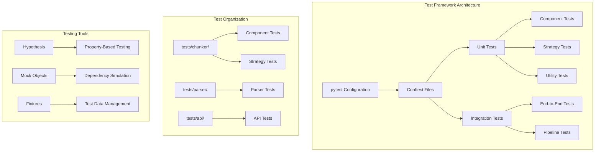
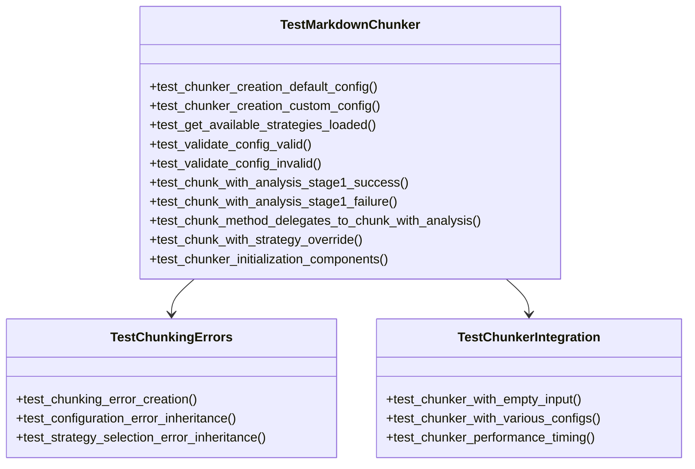
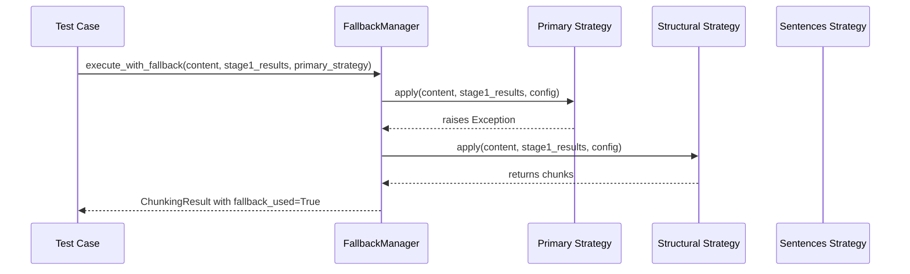
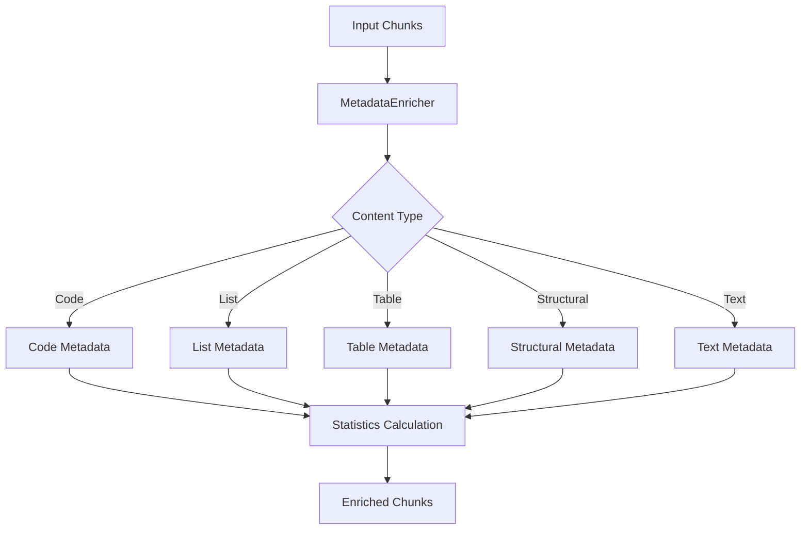
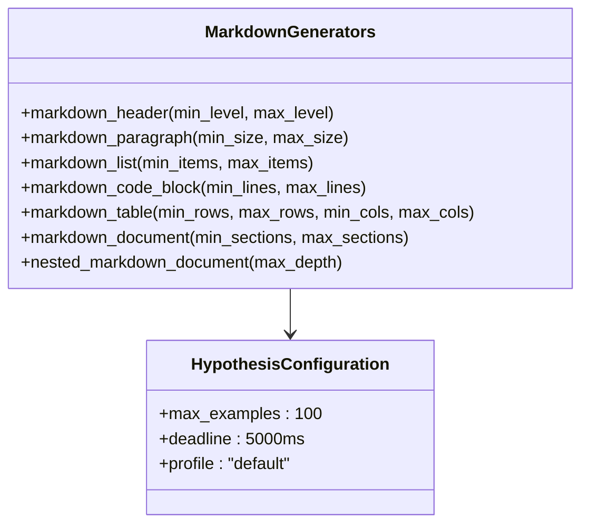
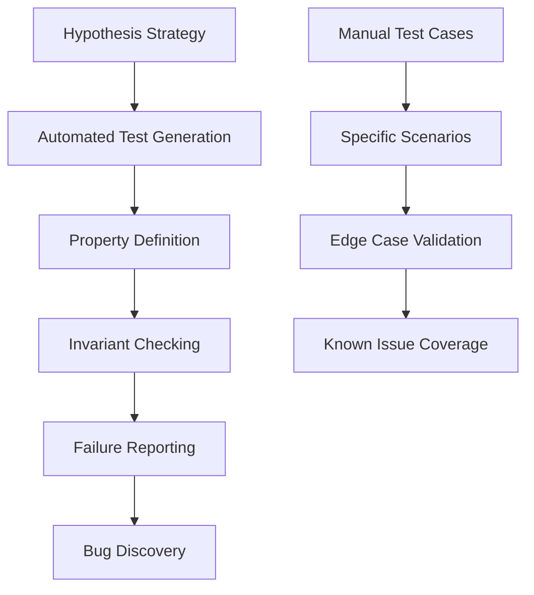
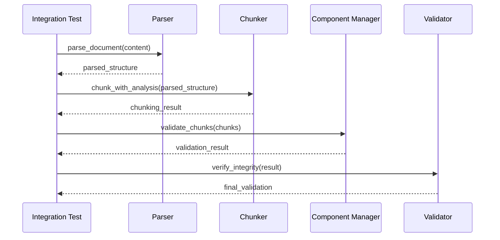

# Unit Testing Strategy

<cite>
**Referenced Files in This Document**
- [tests/chunker/test_chunker.py](file://tests/chunker/test_chunker.py)
- [tests/chunker/conftest.py](file://tests/chunker/conftest.py)
- [tests/chunker/test_components/test_fallback_manager.py](file://tests/chunker/test_components/test_fallback_manager.py)
- [tests/chunker/test_components/test_metadata_enricher.py](file://tests/chunker/test_components/test_metadata_enricher.py)
- [tests/chunker/test_components/test_overlap_manager.py](file://tests/chunker/test_components/test_overlap_manager.py)
- [tests/chunker/test_strategies/test_code_strategy.py](file://tests/chunker/test_strategies/test_code_strategy.py)
- [tests/chunker/test_strategies/test_structural_strategy.py](file://tests/chunker/test_strategies/test_structural_strategy.py)
- [tests/chunker/test_strategies/test_mixed_strategy.py](file://tests/chunker/test_strategies/test_mixed_strategy.py)
- [tests/conftest.py](file://tests/conftest.py)
- [tests/parser/conftest.py](file://tests/parser/conftest.py)
- [pytest.ini](file://pytest.ini)
- [tests/fixtures/mixed.md](file://tests/fixtures/mixed.md)
- [tests/fixtures/code_heavy.md](file://tests/fixtures/code_heavy.md)
- [tests/fixtures/table_heavy.md](file://tests/fixtures/table_heavy.md)
</cite>

## Table of Contents
1. [Introduction](#introduction)
2. [Testing Framework Architecture](#testing-framework-architecture)
3. [Component Isolation Strategy](#component-isolation-strategy)
4. [Test Organization and Structure](#test-organization-and-structure)
5. [Mock Objects and Fixtures](#mock-objects-and-fixtures)
6. [Assertion Patterns and Best Practices](#assertion-patterns-and-best-practices)
7. [Property-Based Testing](#property-based-testing)
8. [Common Testing Challenges](#common-testing-challenges)
9. [Best Practices for Maintainable Tests](#best-practices-for-maintainable-tests)
10. [Integration Testing Approach](#integration-testing-approach)

## Introduction

The markdown chunker library employs a comprehensive unit testing strategy that ensures robust, reliable, and maintainable code through isolated component testing, sophisticated mocking patterns, and property-based testing approaches. The testing framework is built around pytest and follows established patterns for testing complex text processing systems.

The testing strategy focuses on isolating individual components like the Chunker, FallbackManager, MetadataEnricher, and OverlapManager to validate their behavior independently while maintaining comprehensive coverage of edge cases and integration scenarios.

## Testing Framework Architecture

The testing framework is organized into multiple layers that mirror the application architecture, providing both unit and integration test capabilities.



**Diagram sources**
- [pytest.ini](file://pytest.ini#L1-L37)
- [tests/chunker/conftest.py](file://tests/chunker/conftest.py#L1-L220)

**Section sources**
- [pytest.ini](file://pytest.ini#L1-L37)
- [tests/chunker/conftest.py](file://tests/chunker/conftest.py#L1-L220)

## Component Isolation Strategy

The testing strategy emphasizes component isolation to ensure that each component can be tested independently while maintaining confidence in the overall system behavior.

### Chunker Component Testing

The main Chunker component is tested through comprehensive unit tests that verify its initialization, configuration handling, and integration with Stage 1 processing.



**Diagram sources**
- [tests/chunker/test_chunker.py](file://tests/chunker/test_chunker.py#L38-L305)

### FallbackManager Component Testing

The FallbackManager tests focus on the error handling and fallback chain functionality, ensuring that chunking always succeeds through multiple fallback levels.



**Diagram sources**
- [tests/chunker/test_components/test_fallback_manager.py](file://tests/chunker/test_components/test_fallback_manager.py#L70-L371)

### MetadataEnricher Component Testing

The MetadataEnricher tests verify comprehensive metadata injection across different content types and ensure statistical calculations are accurate.



**Diagram sources**
- [tests/chunker/test_components/test_metadata_enricher.py](file://tests/chunker/test_components/test_metadata_enricher.py#L11-L372)

### OverlapManager Component Testing

The OverlapManager tests focus on creating overlapping content between chunks while preserving content integrity and handling edge cases.

**Section sources**
- [tests/chunker/test_components/test_fallback_manager.py](file://tests/chunker/test_components/test_fallback_manager.py#L1-L371)
- [tests/chunker/test_components/test_metadata_enricher.py](file://tests/chunker/test_components/test_metadata_enricher.py#L1-L372)
- [tests/chunker/test_components/test_overlap_manager.py](file://tests/chunker/test_components/test_overlap_manager.py#L1-L397)

## Test Organization and Structure

The testing organization follows a hierarchical structure that mirrors the application architecture, with dedicated test modules for each major component.

### Directory Structure

```
tests/
├── chunker/
│   ├── test_components/
│   │   ├── test_fallback_manager.py
│   │   ├── test_metadata_enricher.py
│   │   └── test_overlap_manager.py
│   ├── test_strategies/
│   │   ├── test_code_strategy.py
│   │   ├── test_structural_strategy.py
│   │   └── test_mixed_strategy.py
│   └── test_chunker.py
├── parser/
│   └── conftest.py
└── conftest.py
```

### Test Class Organization

Each component has its own test class with focused test methods that follow a consistent naming convention:

- **Test class names**: `Test<ComponentName>`
- **Test method names**: `test_<behavior_description>`
- **Test categories**: Property tests, Behavior tests, Integration tests

### Test Categories

The testing strategy includes multiple categories of tests:

1. **Property Tests**: Verify mathematical and logical properties
2. **Behavior Tests**: Test specific functionality and edge cases
3. **Integration Tests**: Test component interactions
4. **Performance Tests**: Measure execution time and resource usage

**Section sources**
- [tests/chunker/test_chunker.py](file://tests/chunker/test_chunker.py#L1-L305)
- [tests/chunker/test_components/test_fallback_manager.py](file://tests/chunker/test_components/test_fallback_manager.py#L1-L371)

## Mock Objects and Fixtures

The testing framework extensively uses mock objects and fixtures to simulate dependencies and create controlled test environments.

### Hypothesis-Based Fixtures

The conftest.py files provide sophisticated fixtures for property-based testing using Hypothesis:



**Diagram sources**
- [tests/conftest.py](file://tests/conftest.py#L22-L220)

### Mock Strategy Implementation

The fallback manager tests demonstrate sophisticated mocking patterns:

```python
class MockStrategy(BaseStrategy):
    def __init__(self, name: str, priority: int, should_fail: bool = False, 
                 return_empty: bool = False, exception_type: Exception = None):
        self._name = name
        self._priority = priority
        self.should_fail = should_fail
        self.return_empty = return_empty
        self.exception_type = exception_type or StrategyError(name, "Mock failure")
```

### Fixture Usage Patterns

The testing framework uses fixtures for:

- **Test data generation**: Automated creation of markdown documents
- **Mock objects**: Simulated dependencies and external services
- **Configuration management**: Consistent test environment setup
- **Resource cleanup**: Proper test isolation and cleanup

**Section sources**
- [tests/conftest.py](file://tests/conftest.py#L1-L220)
- [tests/chunker/test_components/test_fallback_manager.py](file://tests/chunker/test_components/test_fallback_manager.py#L25-L66)

## Assertion Patterns and Best Practices

The testing framework employs consistent assertion patterns and follows established best practices for readable and maintainable tests.

### Assertion Patterns

1. **Boolean Assertions**: Use `assert` for boolean conditions
2. **Type Assertions**: Verify object types with `isinstance()`
3. **Value Assertions**: Compare values with equality operators
4. **Container Assertions**: Check lengths and membership
5. **Exception Assertions**: Verify exception types and messages

### Test Method Structure

Each test method follows a consistent structure:

```python
def test_behavior_under_test(self):
    """Test description with expected outcome."""
    # Arrange: Setup test data and mocks
    # Act: Execute the functionality being tested
    # Assert: Verify the expected outcomes
```

### Edge Case Testing

The framework systematically tests edge cases:

- **Empty inputs**: Verify graceful handling of empty content
- **Boundary conditions**: Test limits and thresholds
- **Error conditions**: Verify proper error handling
- **Performance characteristics**: Measure timing and resource usage

### Data-Driven Testing

Many tests use parameterized approaches to verify behavior across multiple inputs:

```python
@pytest.mark.parametrize("input_data,expected_output", [
    ("simple text", ["simple text"]),
    ("", []),
    ("multiple\nlines", ["multiple\nlines"]),
])
def test_simple_cases(input_data, expected_output):
    # Test implementation
```

**Section sources**
- [tests/chunker/test_components/test_fallback_manager.py](file://tests/chunker/test_components/test_fallback_manager.py#L70-L180)
- [tests/chunker/test_components/test_metadata_enricher.py](file://tests/chunker/test_components/test_metadata_enricher.py#L11-L100)

## Property-Based Testing

The framework incorporates property-based testing using Hypothesis to automatically generate test cases and discover edge cases.

### Property-Based Test Structure



**Diagram sources**
- [tests/conftest.py](file://tests/conftest.py#L10-L16)

### Property Definitions

The framework defines mathematical and logical properties that should hold true for all valid inputs:

- **Idempotence**: Applying the same operation multiple times produces consistent results
- **Monotonicity**: Results should change predictably with input changes
- **Completeness**: All valid inputs should produce valid outputs
- **Consistency**: Related operations should produce compatible results

### Automatic Test Generation

Hypothesis automatically generates thousands of test cases for each property, significantly increasing test coverage:

```python
@st.composite
def markdown_document(draw, min_sections=1, max_sections=5):
    """Generate a complete markdown document with various structures."""
    # Implementation generates valid markdown with random content
```

**Section sources**
- [tests/conftest.py](file://tests/conftest.py#L18-L220)

## Common Testing Challenges

The testing strategy addresses several common challenges in text processing and chunking systems.

### Test Flakiness

Test flakiness is mitigated through:

- **Deterministic fixtures**: Using Hypothesis for reproducible test data
- **Proper mocking**: Isolating external dependencies
- **Timeout controls**: Setting reasonable deadlines for complex operations
- **Resource management**: Ensuring proper cleanup between tests

### Dependency Coupling

Dependency coupling is addressed through:

- **Mock objects**: Simulating external dependencies
- **Interface abstraction**: Testing against interfaces rather than implementations
- **Fixture isolation**: Using separate fixtures for different test contexts
- **Dependency injection**: Making dependencies explicit and testable

### Performance Testing

Performance testing is integrated into the test suite:

- **Timing assertions**: Verifying operations complete within expected timeframes
- **Memory usage**: Monitoring resource consumption
- **Scalability testing**: Testing with larger datasets
- **Benchmark comparisons**: Comparing performance across versions

### Data Quality Validation

The framework includes comprehensive data quality validation:

- **Metadata completeness**: Ensuring all required metadata is present
- **Content integrity**: Verifying content is preserved correctly
- **Format consistency**: Maintaining consistent output formats
- **Error propagation**: Ensuring errors are properly reported

**Section sources**
- [tests/chunker/test_chunker.py](file://tests/chunker/test_chunker.py#L282-L305)
- [tests/chunker/test_components/test_fallback_manager.py](file://tests/chunker/test_components/test_fallback_manager.py#L305-L371)

## Best Practices for Maintainable Tests

The testing strategy incorporates several best practices for creating maintainable and reliable tests.

### Test Naming Conventions

Tests follow consistent naming conventions that clearly describe their purpose:

- **Descriptive names**: Names should explain what is being tested
- **Behavior focus**: Emphasize the behavior under test
- **Expected outcomes**: Include expected results in the name
- **Context information**: Provide context when necessary

### Test Organization Principles

- **Single responsibility**: Each test should verify one specific behavior
- **Independent execution**: Tests should be able to run in any order
- **Clear setup**: Arrange, act, assert structure
- **Minimal dependencies**: Reduce external dependencies

### Code Quality Standards

The testing framework maintains high code quality standards:

- **DRY principle**: Avoid code duplication through fixtures and helpers
- **Readability**: Use clear variable names and comments
- **Modularity**: Organize tests into logical groups
- **Documentation**: Include docstrings explaining complex test logic

### Continuous Improvement

The testing strategy includes mechanisms for continuous improvement:

- **Coverage monitoring**: Tracking test coverage metrics
- **Performance regression**: Detecting performance degradation
- **Maintenance alerts**: Identifying outdated or failing tests
- **Refactoring support**: Facilitating test maintenance

**Section sources**
- [pytest.ini](file://pytest.ini#L1-L37)
- [tests/chunker/conftest.py](file://tests/chunker/conftest.py#L1-L220)

## Integration Testing Approach

While the primary focus is on unit testing, the framework includes integration testing to verify component interactions and end-to-end functionality.

### Integration Test Categories

1. **Component Integration**: Testing interactions between major components
2. **Pipeline Integration**: Verifying the complete chunking pipeline
3. **Real-world Scenarios**: Testing with actual markdown documents
4. **Cross-component Validation**: Ensuring data consistency across components

### Integration Test Patterns



**Diagram sources**
- [tests/chunker/test_chunker.py](file://tests/chunker/test_chunker.py#L224-L305)

### Real-world Test Data

The framework uses real-world markdown documents for integration testing:

- **Technical documentation**: Complex documents with multiple elements
- **API documentation**: Structured content with code examples
- **Blog posts**: Mixed content with formatting
- **Code-heavy documents**: Documents primarily consisting of code blocks

### Cross-validation Testing

Integration tests verify that:

- **Metadata consistency**: Metadata is correctly propagated
- **Content preservation**: Content integrity is maintained
- **Error handling**: Errors are properly managed across components
- **Performance characteristics**: Overall performance meets expectations

**Section sources**
- [tests/chunker/test_chunker.py](file://tests/chunker/test_chunker.py#L224-L305)
- [tests/fixtures/mixed.md](file://tests/fixtures/mixed.md#L1-L51)
- [tests/fixtures/code_heavy.md](file://tests/fixtures/code_heavy.md#L1-L74)
- [tests/fixtures/table_heavy.md](file://tests/fixtures/table_heavy.md#L1-L40)