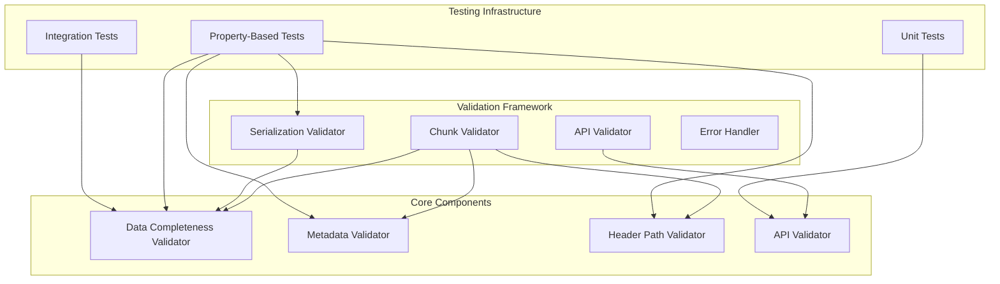
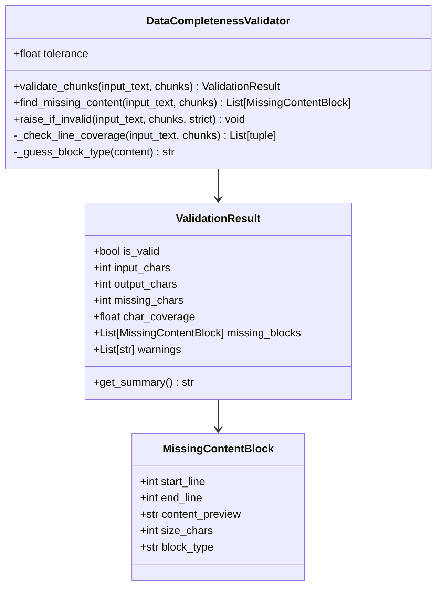
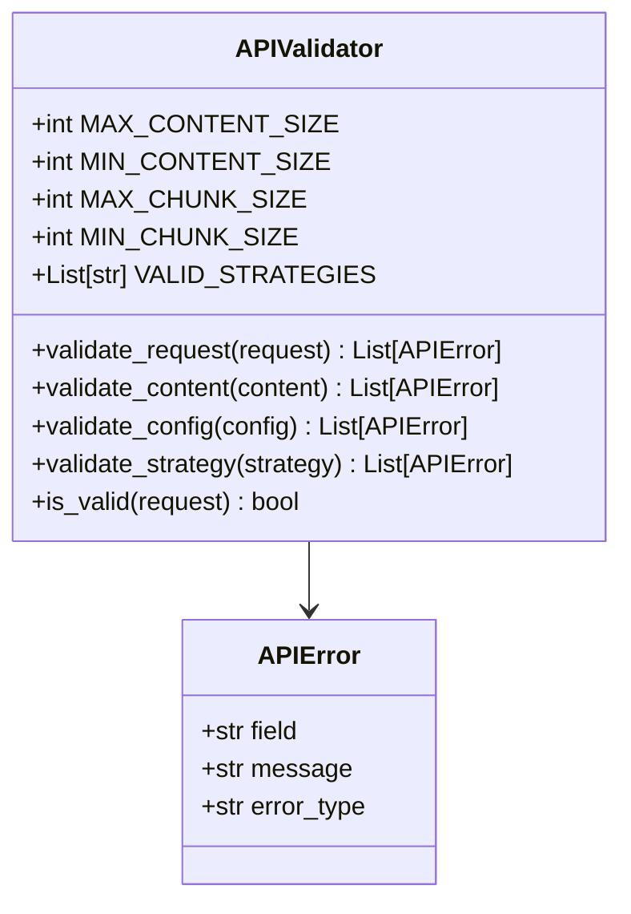
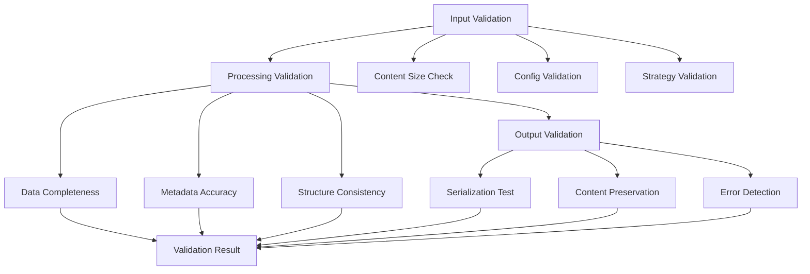
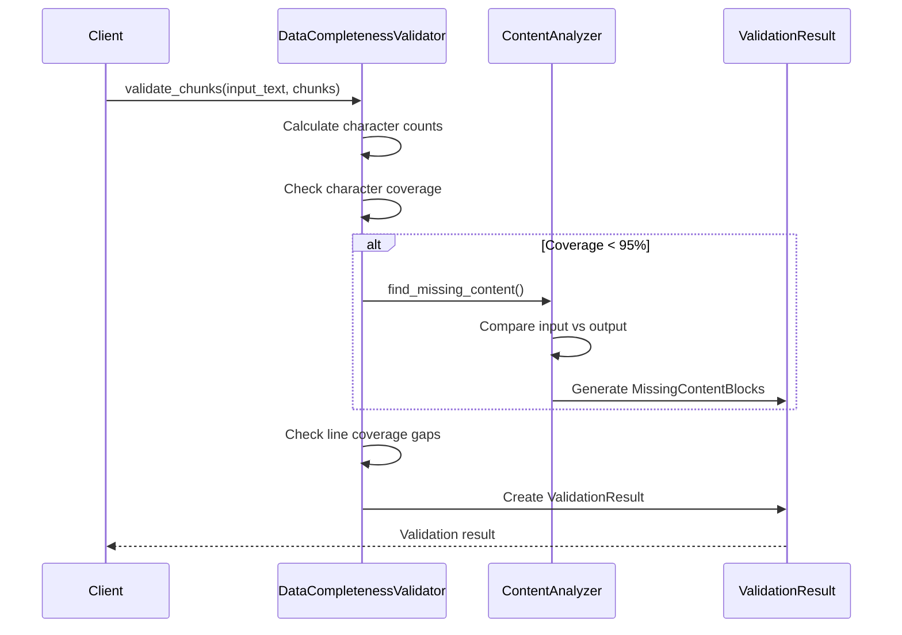
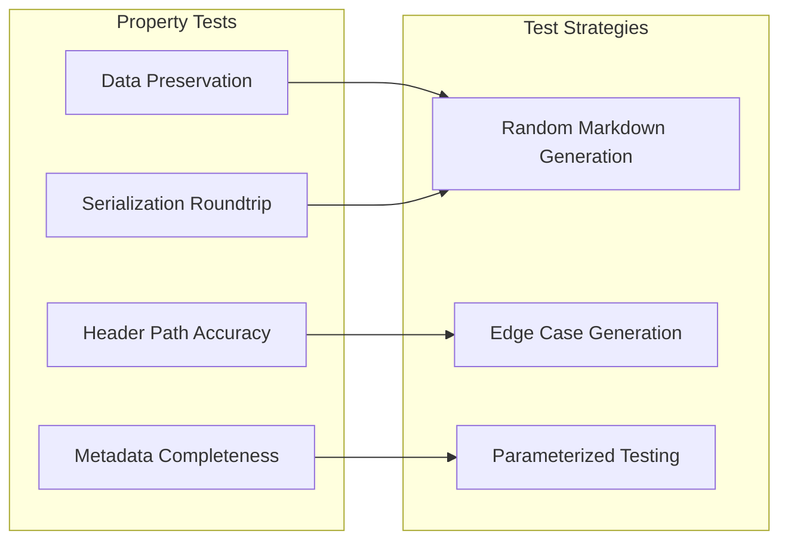
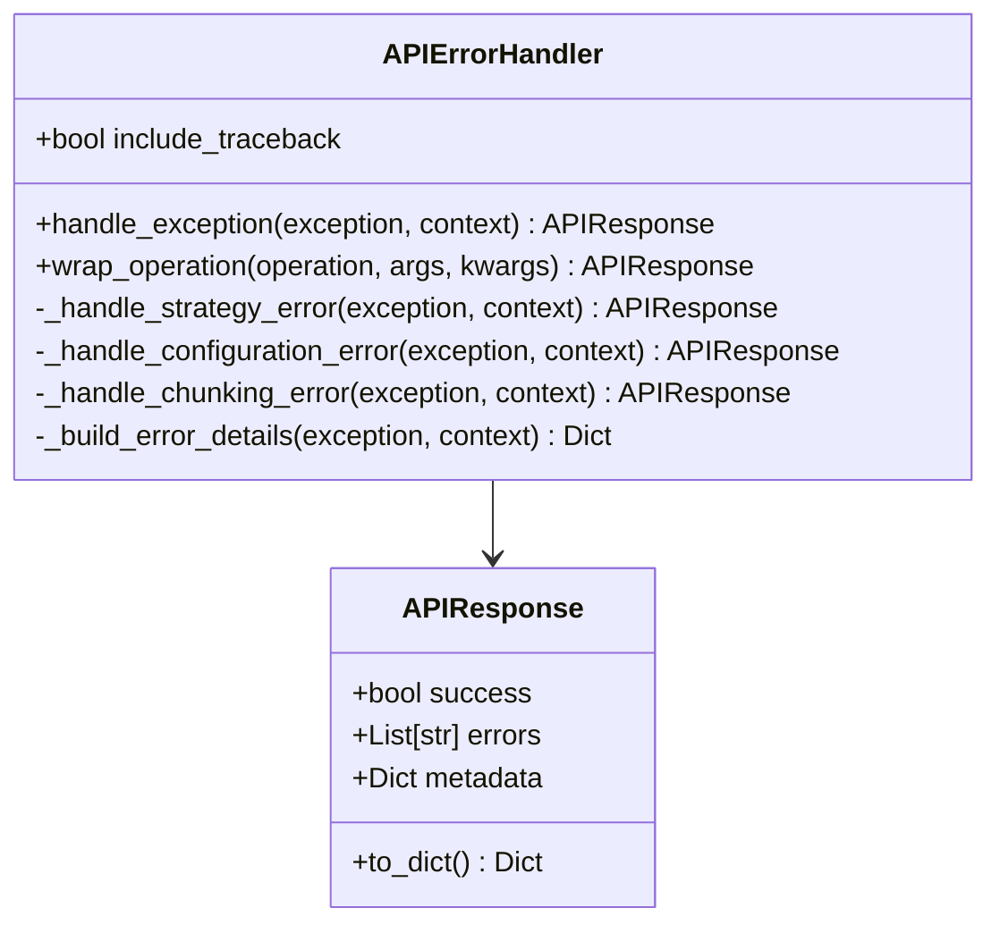

# Validation Framework

<cite>
**Referenced Files in This Document**
- [markdown_chunker/chunker/validator.py](file://markdown_chunker/chunker/validator.py)
- [tests/chunker/test_data_completeness_validator.py](file://tests/chunker/test_data_completeness_validator.py)
- [tests/chunker/test_serialization_roundtrip_property.py](file://tests/chunker/test_serialization_roundtrip_property.py)
- [markdown_chunker/api/validator.py](file://markdown_chunker/api/validator.py)
- [tests/chunker/test_header_path_property.py](file://tests/chunker/test_header_path_property.py)
- [tests/chunker/test_metadata_properties.py](file://tests/chunker/test_metadata_properties.py)
- [tests/chunker/test_data_preservation_properties.py](file://tests/chunker/test_data_preservation_properties.py)
- [tests/chunker/test_critical_properties.py](file://tests/chunker/test_critical_properties.py)
- [markdown_chunker/chunker/types.py](file://markdown_chunker/chunker/types.py)
- [markdown_chunker/api/error_handler.py](file://markdown_chunker/api/error_handler.py)
- [tests/api/test_error_handler.py](file://tests/api/test_error_handler.py)
</cite>

## Table of Contents
1. [Introduction](#introduction)
2. [Framework Architecture](#framework-architecture)
3. [Core Validation Components](#core-validation-components)
4. [Multi-Stage Validation Approach](#multi-stage-validation-approach)
5. [Data Completeness Validation](#data-completeness-validation)
6. [API Request Validation](#api-request-validation)
7. [Property-Based Testing Framework](#property-based-testing-framework)
8. [Error Handling and Recovery](#error-handling-and-recovery)
9. [Integration Patterns](#integration-patterns)
10. [Extending the Validation Framework](#extending-the-validation-framework)
11. [Best Practices](#best-practices)
12. [Troubleshooting Guide](#troubleshooting-guide)

## Introduction

The validation framework ensures data integrity throughout the chunking process by implementing a comprehensive multi-stage validation approach. This framework validates content preservation, metadata accuracy, structural consistency, and serialization integrity across all chunking operations. It provides both runtime validation for production use and extensive property-based testing for quality assurance.

The framework operates on three fundamental principles:
- **Data Integrity**: Ensuring no content is lost during chunking transformations
- **Structural Consistency**: Maintaining proper document hierarchy and metadata relationships  
- **Serialization Reliability**: Guaranteeing chunks can be serialized and deserialized without data loss

## Framework Architecture

The validation framework consists of several interconnected components that work together to ensure data integrity:



**Diagram sources**
- [markdown_chunker/chunker/validator.py](file://markdown_chunker/chunker/validator.py#L1-L354)
- [markdown_chunker/api/validator.py](file://markdown_chunker/api/validator.py#L1-L321)
- [tests/chunker/test_data_completeness_validator.py](file://tests/chunker/test_data_completeness_validator.py#L1-L419)

## Core Validation Components

### DataCompletenessValidator

The DataCompletenessValidator ensures that all input content appears in output chunks, allowing for minor whitespace normalization differences:



**Diagram sources**
- [markdown_chunker/chunker/validator.py](file://markdown_chunker/chunker/validator.py#L14-L354)

**Section sources**
- [markdown_chunker/chunker/validator.py](file://markdown_chunker/chunker/validator.py#L53-L354)

### API Validator

The API Validator performs comprehensive validation of incoming requests before processing:



**Diagram sources**
- [markdown_chunker/api/validator.py](file://markdown_chunker/api/validator.py#L12-L321)

**Section sources**
- [markdown_chunker/api/validator.py](file://markdown_chunker/api/validator.py#L12-L321)

## Multi-Stage Validation Approach

The validation framework implements a comprehensive multi-stage approach that validates different aspects of the chunking process:

### Stage 1: Input Validation
- Content size and format validation
- Configuration parameter validation
- Strategy parameter validation

### Stage 2: Processing Validation  
- Data completeness verification
- Metadata accuracy checking
- Structural consistency validation

### Stage 3: Output Validation
- Serialization round-trip testing
- Content preservation verification
- Error detection and reporting



**Section sources**
- [markdown_chunker/chunker/validator.py](file://markdown_chunker/chunker/validator.py#L71-L151)
- [markdown_chunker/api/validator.py](file://markdown_chunker/api/validator.py#L50-L73)

## Data Completeness Validation

The DataCompletenessValidator implements sophisticated algorithms to ensure no content is lost during chunking:

### Character-Level Validation
- Compares input and output character counts
- Allows ±5% tolerance for whitespace normalization
- Detects significant data loss (>10% difference)

### Line Coverage Analysis
- Identifies gaps in line coverage
- Reports large gaps (>10 lines) as validation failures
- Validates sequential line numbering

### Content Block Detection
- Identifies missing content blocks
- Classifies block types (code, list, table, header, paragraph)
- Provides detailed previews of missing content



**Diagram sources**
- [markdown_chunker/chunker/validator.py](file://markdown_chunker/chunker/validator.py#L71-L151)

**Section sources**
- [markdown_chunker/chunker/validator.py](file://markdown_chunker/chunker/validator.py#L153-L354)

## API Request Validation

The API Validator ensures all incoming requests meet quality standards before processing:

### Content Validation
- Validates content presence and format
- Checks content size limits (1B - 10MB)
- Ensures content is not empty or whitespace-only

### Configuration Validation
- Validates chunk size parameters (10-100KB)
- Checks overlap settings
- Validates boolean configuration fields
- Ensures threshold values (0.0-1.0)

### Strategy Validation
- Validates strategy parameter values
- Ensures strategy is in the valid strategy list
- Provides helpful error messages for invalid strategies

**Section sources**
- [markdown_chunker/api/validator.py](file://markdown_chunker/api/validator.py#L51-L308)

## Property-Based Testing Framework

The framework includes extensive property-based testing to ensure robust validation:

### Data Preservation Properties
- Validates that total characters in output ≈ input characters (±5% tolerance)
- Tests preservation across different content types (text, code, lists, tables)
- Verifies preservation with various chunk size configurations

### Header Path Accuracy
- Validates that header_path metadata accurately reflects document hierarchy
- Ensures header paths are consistent across chunks
- Tests edge cases with nested headers and skipped levels

### Metadata Completeness
- Verifies all required metadata fields are present
- Tests chunk indices, total chunks, and positioning flags
- Validates content statistics and document ID propagation



**Diagram sources**
- [tests/chunker/test_data_preservation_properties.py](file://tests/chunker/test_data_preservation_properties.py#L1-L373)
- [tests/chunker/test_header_path_property.py](file://tests/chunker/test_header_path_property.py#L1-L412)
- [tests/chunker/test_metadata_properties.py](file://tests/chunker/test_metadata_properties.py#L1-L308)

**Section sources**
- [tests/chunker/test_data_preservation_properties.py](file://tests/chunker/test_data_preservation_properties.py#L1-L373)
- [tests/chunker/test_serialization_roundtrip_property.py](file://tests/chunker/test_serialization_roundtrip_property.py#L1-L403)

## Error Handling and Recovery

The framework implements comprehensive error handling through the APIErrorHandler:

### Error Classification
- Strategy selection errors
- Configuration errors  
- Chunking errors
- Value and type errors
- Generic unexpected errors

### Standardized Response Format
- Consistent error response structure
- Appropriate error codes and types
- Detailed error information with optional tracebacks

### Operation Wrapping
- Automatic error handling for API operations
- Support for both synchronous and asynchronous operations
- Context-aware error reporting



**Diagram sources**
- [markdown_chunker/api/error_handler.py](file://markdown_chunker/api/error_handler.py#L18-L235)

**Section sources**
- [markdown_chunker/api/error_handler.py](file://markdown_chunker/api/error_handler.py#L18-L235)
- [tests/api/test_error_handler.py](file://tests/api/test_error_handler.py#L1-L262)

## Integration Patterns

### Runtime Integration
The validation framework integrates seamlessly with the chunking pipeline:

```python
# Example integration pattern
validator = DataCompletenessValidator(tolerance=0.05)
result = validator.validate_chunks(input_text, chunks)
if not result.is_valid:
    validator.raise_if_invalid(input_text, chunks, strict=True)
```

### Testing Integration
Property-based tests automatically generate test cases and validate invariants:

```python
# Example property test pattern
@given(random_markdown())
def test_property_data_preservation(markdown_text):
    chunker = MarkdownChunker()
    chunks = chunker.chunk(markdown_text)
    # Validation happens automatically
```

### API Integration
API endpoints use the validator to ensure request quality:

```python
# Example API validation pattern
validator = APIValidator()
errors = validator.validate_request(request)
if errors:
    return APIResponse.error_response(errors=errors)
```

**Section sources**
- [markdown_chunker/chunker/validator.py](file://markdown_chunker/chunker/validator.py#L314-L354)
- [tests/chunker/test_data_completeness_validator.py](file://tests/chunker/test_data_completeness_validator.py#L307-L324)

## Extending the Validation Framework

### Adding Custom Validators
To add custom validation logic:

1. **Create Validation Logic**: Implement validation functions
2. **Define Validation Results**: Create result data structures
3. **Integrate with Pipeline**: Add to validation chain
4. **Write Tests**: Create property-based tests

### Custom Error Types
Extend error handling for specific use cases:

```python
# Example custom error type
class CustomValidationError(Exception):
    def __init__(self, field, message):
        self.field = field
        self.message = message
```

### Integration with New Features
When adding new features, ensure validation coverage:

1. **Identify Validation Needs**: Determine what needs to be validated
2. **Implement Validators**: Create appropriate validation logic
3. **Add Property Tests**: Write comprehensive property-based tests
4. **Update Error Handling**: Integrate with error handling system

**Section sources**
- [markdown_chunker/chunker/validator.py](file://markdown_chunker/chunker/validator.py#L1-L354)
- [markdown_chunker/api/validator.py](file://markdown_chunker/api/validator.py#L1-L321)

## Best Practices

### Validation Design Principles
- **Fail Fast**: Catch errors early in the process
- **Provide Clear Feedback**: Use descriptive error messages
- **Maintain Tolerance**: Allow for reasonable variations
- **Comprehensive Coverage**: Validate all critical aspects

### Testing Guidelines
- **Property-Based Testing**: Use Hypothesis for comprehensive testing
- **Edge Cases**: Test boundary conditions and edge cases
- **Realistic Scenarios**: Test with realistic document structures
- **Performance Testing**: Ensure validation doesn't impact performance

### Error Handling Best Practices
- **Standardized Responses**: Use consistent error response formats
- **Context Information**: Provide helpful context in error messages
- **Traceback Control**: Use tracebacks judiciously in production
- **Graceful Degradation**: Handle validation failures gracefully

## Troubleshooting Guide

### Common Validation Issues

#### Data Loss Detection
**Problem**: Validation reports data loss despite seemingly complete chunks
**Solution**: Check for whitespace normalization differences and adjust tolerance

#### Header Path Issues
**Problem**: Header paths don't match expected hierarchy
**Solution**: Verify header structure and ensure proper nesting

#### Metadata Validation Failures
**Problem**: Required metadata fields missing or incorrect
**Solution**: Check metadata enrichment configuration and processing

### Debugging Validation Failures

#### Enable Detailed Logging
```python
import logging
logging.basicConfig(level=logging.DEBUG)
```

#### Use Validation Reports
```python
result = validator.validate_chunks(input_text, chunks)
print(result.get_summary())
for block in result.missing_blocks:
    print(f"Missing: {block.block_type} at lines {block.start_line}-{block.end_line}")
```

#### Test with Smaller Inputs
Start with smaller, simpler inputs to isolate issues

**Section sources**
- [tests/chunker/test_data_completeness_validator.py](file://tests/chunker/test_data_completeness_validator.py#L327-L337)
- [markdown_chunker/chunker/validator.py](file://markdown_chunker/chunker/validator.py#L37-L51)