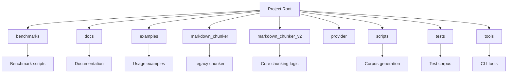
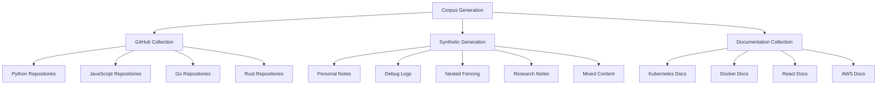
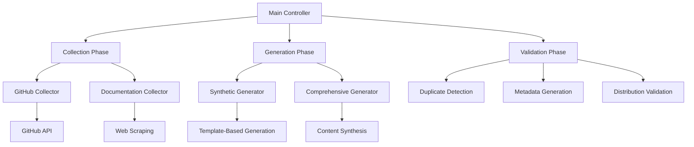
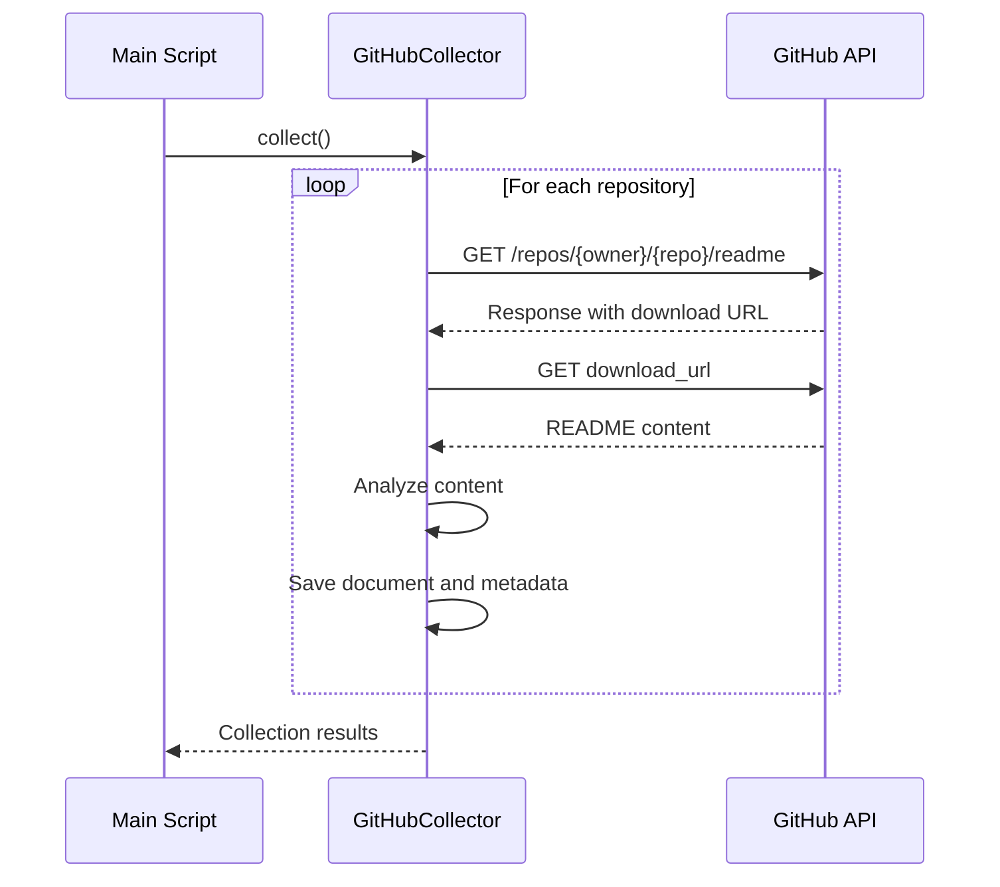
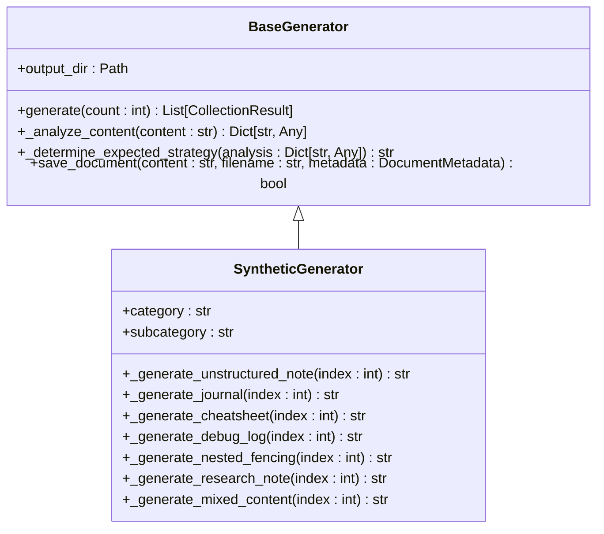
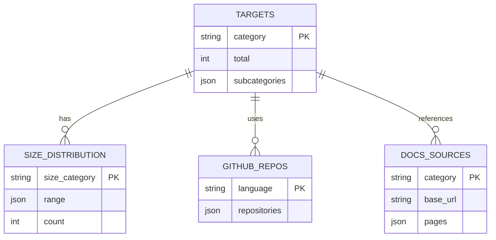
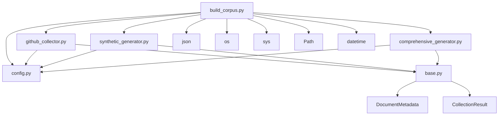

# Corpus Generation System

<cite>
**Referenced Files in This Document**   
- [main.py](file://main.py)
- [build_corpus.py](file://scripts/build_corpus.py)
- [build_full_corpus.py](file://scripts/build_full_corpus.py)
- [config.py](file://scripts/corpus_builder/config.py)
- [base.py](file://scripts/corpus_builder/base.py)
- [synthetic_generator.py](file://scripts/corpus_builder/synthetic_generator.py)
- [github_collector.py](file://scripts/corpus_builder/github_collector.py)
- [chunker.py](file://markdown_chunker_v2/chunker.py)
- [types.py](file://markdown_chunker_v2/types.py)
- [README.md](file://tests/corpus/README.md)
</cite>

## Table of Contents
1. [Introduction](#introduction)
2. [Project Structure](#project-structure)
3. [Corpus Generation System](#corpus-generation-system)
4. [Core Components](#core-components)
5. [Architecture Overview](#architecture-overview)
6. [Detailed Component Analysis](#detailed-component-analysis)
7. [Dependency Analysis](#dependency-analysis)
8. [Performance Considerations](#performance-considerations)
9. [Troubleshooting Guide](#troubleshooting-guide)
10. [Conclusion](#conclusion)

## Introduction
The Corpus Generation System is a comprehensive framework designed to create a diverse and representative test corpus for evaluating markdown chunking algorithms. The system generates a collection of 410+ markdown documents across various categories, including technical documentation, GitHub READMEs, changelogs, engineering blogs, and specialized content types like nested fencing examples and debug logs. This corpus serves as a benchmark for testing the effectiveness of the markdown chunker in handling different document structures, content types, and edge cases.

## Project Structure
The project is organized into several key directories that support the corpus generation and markdown chunking functionality:

**Diagram sources**
- [build_corpus.py](file://scripts/build_corpus.py#L1-L325)
- [config.py](file://scripts/corpus_builder/config.py#L1-L268)

**Section sources**
- [build_corpus.py](file://scripts/build_corpus.py#L1-L325)
- [config.py](file://scripts/corpus_builder/config.py#L1-L268)

## Corpus Generation System
The corpus generation system is designed to create a comprehensive collection of markdown documents for testing and benchmarking the markdown chunker. The system combines both automated collection from external sources and synthetic generation of specialized document types to ensure a diverse and representative test corpus.

The system targets a total of 410 documents across 9 categories:
- Technical Documentation (100 files)
- GitHub READMEs (100 files)
- Changelogs (50 files)
- Engineering Blogs (50 files)
- Personal Notes (30 files)
- Debug Logs (20 files)
- Nested Fencing Examples (20 files)
- Research Notes (20 files)
- Mixed Content (20 files)

**Diagram sources**
- [build_corpus.py](file://scripts/build_corpus.py#L1-L325)
- [config.py](file://scripts/corpus_builder/config.py#L1-L268)
- [README.md](file://tests/corpus/README.md#L1-L426)

**Section sources**
- [build_corpus.py](file://scripts/build_corpus.py#L1-L325)
- [config.py](file://scripts/corpus_builder/config.py#L1-L268)
- [README.md](file://tests/corpus/README.md#L1-L426)

## Core Components
The corpus generation system consists of several core components that work together to collect and generate markdown documents:

1. **GitHub Collector**: Retrieves README files from popular repositories across different programming languages
2. **Synthetic Generator**: Creates artificial documents for categories where real examples are difficult to obtain
3. **Comprehensive Generator**: Produces technical documentation-style content based on specified topics
4. **Configuration System**: Defines targets, sources, and parameters for corpus generation

The system is designed to be extensible, allowing for the addition of new document categories and generation strategies as needed.

**Section sources**
- [build_corpus.py](file://scripts/build_corpus.py#L1-L325)
- [github_collector.py](file://scripts/corpus_builder/github_collector.py#L1-L130)
- [synthetic_generator.py](file://scripts/corpus_builder/synthetic_generator.py#L1-L728)

## Architecture Overview
The corpus generation system follows a modular architecture with clear separation of concerns:

**Diagram sources**
- [build_corpus.py](file://scripts/build_corpus.py#L1-L325)
- [build_full_corpus.py](file://scripts/build_full_corpus.py#L1-L193)
- [config.py](file://scripts/corpus_builder/config.py#L1-L268)

**Section sources**
- [build_corpus.py](file://scripts/build_corpus.py#L1-L325)
- [build_full_corpus.py](file://scripts/build_full_corpus.py#L1-L193)
- [config.py](file://scripts/corpus_builder/config.py#L1-L268)

## Detailed Component Analysis

### GitHub Collector
The GitHub Collector is responsible for retrieving README files from popular repositories across different programming languages. It uses the GitHub API to search for repositories with high star counts and downloads their README files.

**Diagram sources**
- [github_collector.py](file://scripts/corpus_builder/github_collector.py#L1-L130)
- [config.py](file://scripts/corpus_builder/config.py#L1-L268)

**Section sources**
- [github_collector.py](file://scripts/corpus_builder/github_collector.py#L1-L130)
- [config.py](file://scripts/corpus_builder/config.py#L1-L268)

### Synthetic Generator
The Synthetic Generator creates artificial documents for categories where real examples are difficult to obtain or where specific characteristics need to be controlled.

**Diagram sources**
- [synthetic_generator.py](file://scripts/corpus_builder/synthetic_generator.py#L1-L728)
- [base.py](file://scripts/corpus_builder/base.py#L1-L295)

**Section sources**
- [synthetic_generator.py](file://scripts/corpus_builder/synthetic_generator.py#L1-L728)
- [base.py](file://scripts/corpus_builder/base.py#L1-L295)

### Configuration System
The configuration system defines the targets, sources, and parameters for corpus generation.

**Diagram sources**
- [config.py](file://scripts/corpus_builder/config.py#L1-L268)

**Section sources**
- [config.py](file://scripts/corpus_builder/config.py#L1-L268)

## Dependency Analysis
The corpus generation system has a well-defined dependency structure:

**Diagram sources**
- [build_corpus.py](file://scripts/build_corpus.py#L1-L325)
- [github_collector.py](file://scripts/corpus_builder/github_collector.py#L1-L130)
- [synthetic_generator.py](file://scripts/corpus_builder/synthetic_generator.py#L1-L728)
- [comprehensive_generator.py](file://scripts/corpus_builder/comprehensive_generator.py#L1-L193)
- [base.py](file://scripts/corpus_builder/base.py#L1-L295)
- [config.py](file://scripts/corpus_builder/config.py#L1-L268)

**Section sources**
- [build_corpus.py](file://scripts/build_corpus.py#L1-L325)
- [github_collector.py](file://scripts/corpus_builder/github_collector.py#L1-L130)
- [synthetic_generator.py](file://scripts/corpus_builder/synthetic_generator.py#L1-L728)
- [comprehensive_generator.py](file://scripts/corpus_builder/comprehensive_generator.py#L1-L193)
- [base.py](file://scripts/corpus_builder/base.py#L1-L295)
- [config.py](file://scripts/corpus_builder/config.py#L1-L268)

## Performance Considerations
The corpus generation system includes several performance considerations:

1. **Rate Limiting**: The GitHub collector implements rate limiting to avoid exceeding API limits
2. **Parallel Processing**: The system could be enhanced to process multiple repositories in parallel
3. **Memory Efficiency**: Documents are processed one at a time to minimize memory usage
4. **Caching**: Duplicate content is detected and skipped to avoid redundant processing

The system is designed to be efficient while maintaining reliability and data quality.

## Troubleshooting Guide
Common issues and solutions for the corpus generation system:

1. **GitHub API Rate Limiting**: If you encounter rate limiting issues, provide a GitHub token with the `--github-token` parameter
2. **Missing Documents**: If certain categories are not being generated, check the configuration in `config.py`
3. **Network Issues**: If web scraping fails, verify network connectivity and retry the operation
4. **Duplicate Content**: The system automatically detects and skips duplicate content
5. **Validation Failures**: If the corpus validation fails, check the distribution of document sizes and categories

**Section sources**
- [build_corpus.py](file://scripts/build_corpus.py#L1-L325)
- [config.py](file://scripts/corpus_builder/config.py#L1-L268)
- [README.md](file://tests/corpus/README.md#L1-L426)

## Conclusion
The Corpus Generation System provides a comprehensive framework for creating a diverse and representative test corpus for markdown chunking algorithms. By combining automated collection from external sources with synthetic generation of specialized document types, the system ensures a wide range of document structures, content types, and edge cases are represented in the test corpus. This enables thorough testing and benchmarking of the markdown chunker's capabilities across various scenarios, ultimately leading to more robust and reliable chunking results.