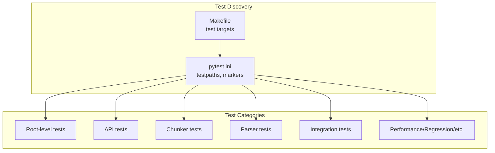
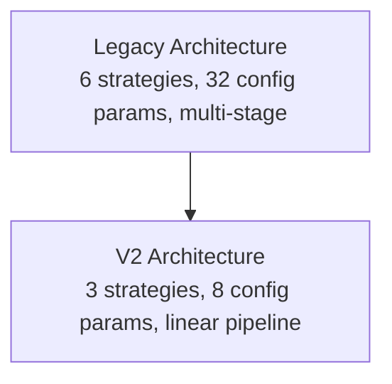
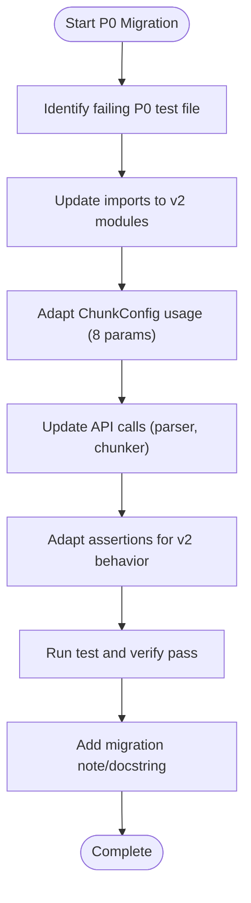
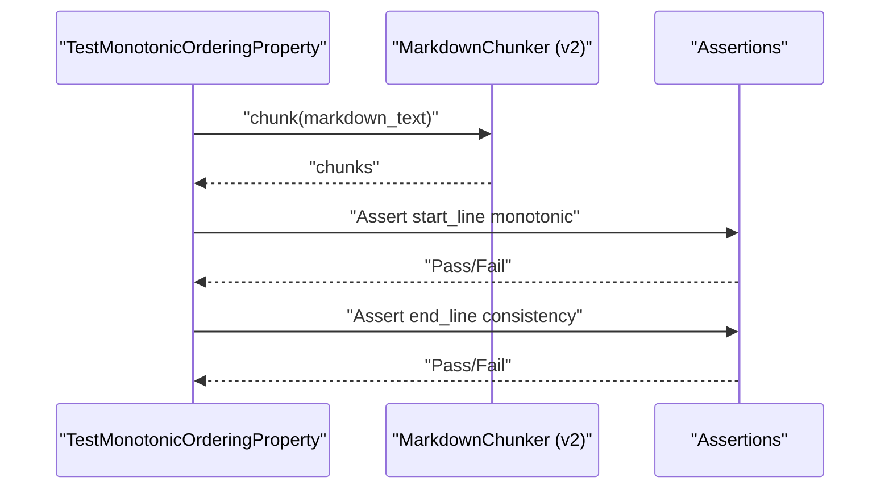
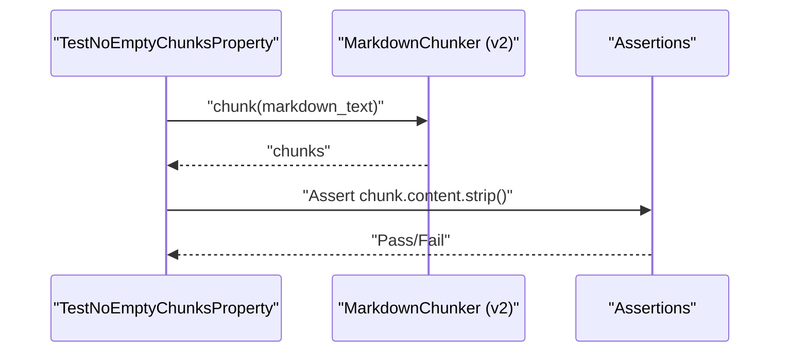
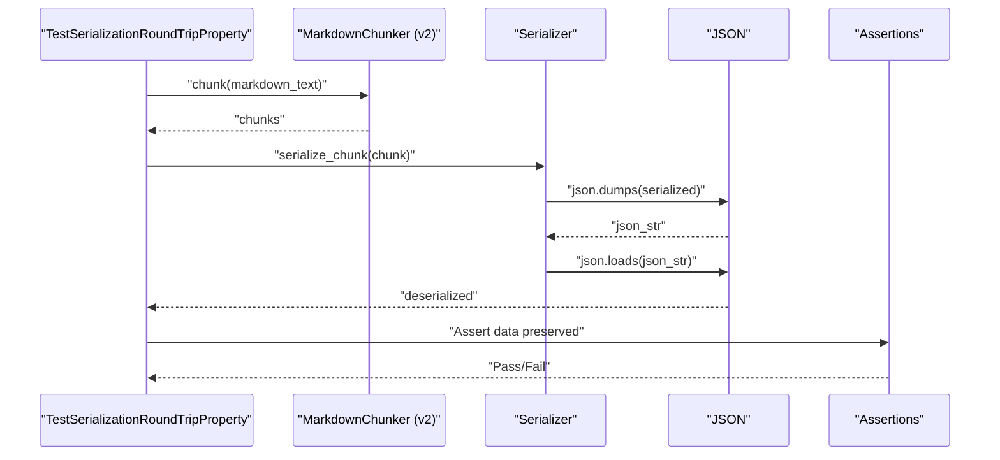
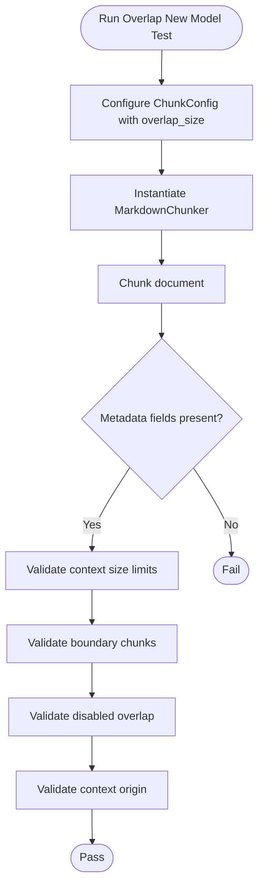
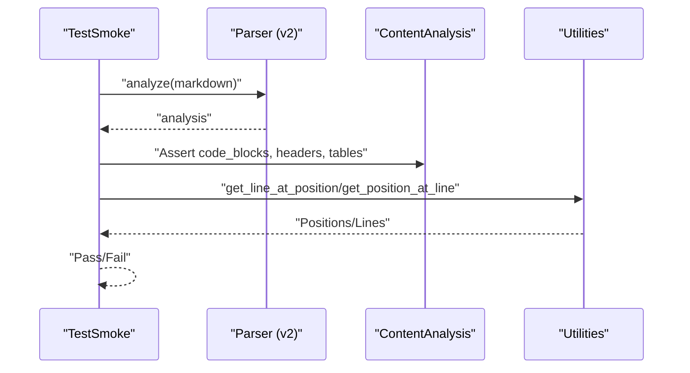
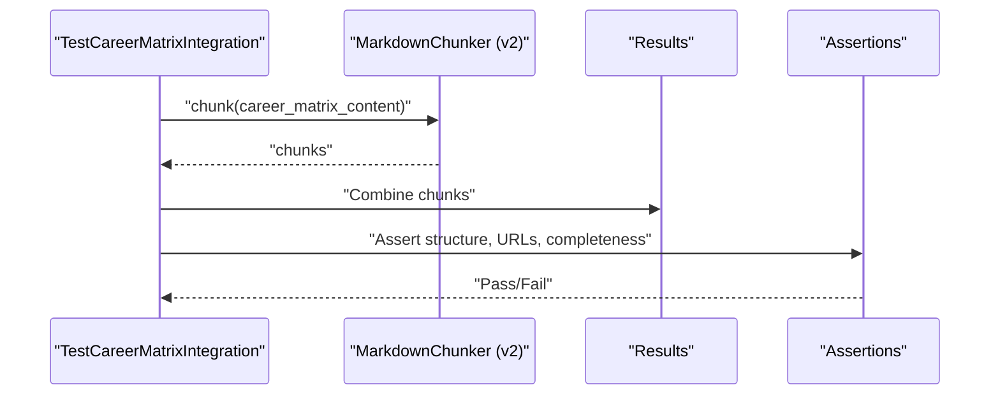
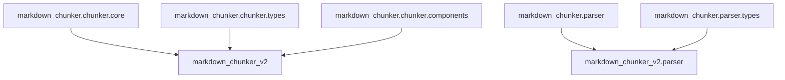

# Legacy Tests Analysis

<cite>
**Referenced Files in This Document**
- [README.md](file://README.md)
- [Makefile](file://Makefile)
- [pytest.ini](file://pytest.ini)
- [docs/legacy-tests-analysis/README.md](file://docs/legacy-tests-analysis/README.md)
- [docs/legacy-tests-analysis/IMPLEMENTATION_SUMMARY.md](file://docs/legacy-tests-analysis/IMPLEMENTATION_SUMMARY.md)
- [docs/legacy-tests-analysis/legacy-test-analysis.md](file://docs/legacy-tests-analysis/legacy-test-analysis.md)
- [docs/legacy-tests-analysis/test-migration-status.md](file://docs/legacy-tests-analysis/test-migration-status.md)
- [docs/legacy-tests-analysis/test-intent-analysis.md](file://docs/legacy-tests-analysis/test-intent-analysis.md)
- [tests/chunker/test_monotonic_ordering_property.py](file://tests/chunker/test_monotonic_ordering_property.py)
- [tests/chunker/test_no_empty_chunks_property.py](file://tests/chunker/test_no_empty_chunks_property.py)
- [tests/chunker/test_serialization_roundtrip_property.py](file://tests/chunker/test_serialization_roundtrip_property.py)
- [tests/chunker/test_components/test_overlap_new_model.py](file://tests/chunker/test_components/test_overlap_new_model.py)
- [tests/parser/test_smoke.py](file://tests/parser/test_smoke.py)
- [tests/integration/test_career_matrix.py](file://tests/integration/test_career_matrix.py)
- [tests/chunker/test_chunk_simple.py](file://tests/chunker/test_chunk_simple.py)
- [tests/chunker/test_serialization.py](file://tests/chunker/test_serialization.py)
</cite>

## Table of Contents
1. [Introduction](#introduction)
2. [Project Structure](#project-structure)
3. [Core Components](#core-components)
4. [Architecture Overview](#architecture-overview)
5. [Detailed Component Analysis](#detailed-component-analysis)
6. [Dependency Analysis](#dependency-analysis)
7. [Performance Considerations](#performance-considerations)
8. [Troubleshooting Guide](#troubleshooting-guide)
9. [Conclusion](#conclusion)
10. [Appendices](#appendices)

## Introduction
This document presents a comprehensive analysis of the legacy test suite and the migration plan to bring it into alignment with the v2 architecture. It synthesizes the repository’s documentation and test files to explain:
- The current state of the test suite and import errors
- The categorization and prioritization of tests
- The migration tasks for the six failing P0 tests
- The architectural simplifications that impact test migration
- Practical guidance for developers performing migrations

The goal is to enable a smooth transition of the legacy tests to v2 while preserving their intent and ensuring reliable coverage.

## Project Structure
The repository organizes tests by functional area:
- Root-level tests for domain properties, entry points, error handling, and plugin manifests
- API tests for backward compatibility and adapter behavior
- Chunker tests for core chunking logic, strategies, and components
- Parser tests for AST and content analysis
- Integration tests for end-to-end pipelines and real-world documents
- Additional categories such as performance and regression tests

The Makefile and pytest configuration define how tests are discovered and executed. The legacy tests rely heavily on imports from the old module structure, which must be updated to v2 modules.

**Diagram sources**
- [pytest.ini](file://pytest.ini#L1-L38)
- [Makefile](file://Makefile#L1-L136)

**Section sources**
- [pytest.ini](file://pytest.ini#L1-L38)
- [Makefile](file://Makefile#L1-L136)

## Core Components
- Legacy test inventory and categorization: The design document catalogs all test files, assigns categories (A–E) and priorities (P0–P3), and provides migration guidelines.
- Migration status dashboard: Tracks import errors, loadable tests, and P0 test progress.
- P0 migration tasks: Provides detailed, step-by-step migration plans for the six failing P0 tests.
- Test execution baselines: Establishes current pass rates and targets for P0 and full suites.

Key outcomes:
- 138 test files analyzed and categorized
- 28 P0 tests identified; 6 currently blocked by import errors
- Baseline established for P0 test execution and coverage

**Section sources**
- [docs/legacy-tests-analysis/README.md](file://docs/legacy-tests-analysis/README.md#L1-L285)
- [docs/legacy-tests-analysis/IMPLEMENTATION_SUMMARY.md](file://docs/legacy-tests-analysis/IMPLEMENTATION_SUMMARY.md#L1-L314)
- [docs/legacy-tests-analysis/legacy-test-analysis.md](file://docs/legacy-tests-analysis/legacy-test-analysis.md#L1-L793)
- [docs/legacy-tests-analysis/test-migration-status.md](file://docs/legacy-tests-analysis/test-migration-status.md#L1-L299)

## Architecture Overview
The legacy architecture featured:
- Multiple strategies (code, list, table, structural, sentences, mixed)
- A rich configuration surface (32 parameters)
- A multi-stage pipeline with modular components (e.g., overlap manager)
- A parser API with multiple interfaces

The v2 architecture simplifies:
- Strategies reduced from 6 to 3 (code_aware, structural, fallback)
- Configuration reduced from 32 to 8 parameters
- Pipeline streamlined to a linear flow
- Components integrated into strategies or removed

These changes directly impact how tests must be migrated:
- Imports must switch from legacy modules to v2 modules
- Configuration parameters must be adapted to the new schema
- Strategy references must align with v2 strategy names
- Parser API calls must use the simplified interface

**Diagram sources**
- [docs/legacy-tests-analysis/legacy-test-analysis.md](file://docs/legacy-tests-analysis/legacy-test-analysis.md#L1-L793)

**Section sources**
- [docs/legacy-tests-analysis/legacy-test-analysis.md](file://docs/legacy-tests-analysis/legacy-test-analysis.md#L1-L793)

## Detailed Component Analysis

### P0 Migration Tasks: Six Failing Tests
The six P0 tests currently blocked by import errors are:
1. Monotonic ordering property test
2. No empty chunks property test
3. Serialization roundtrip property test
4. Overlap new model test (components)
5. Parser smoke test
6. Career matrix integration test

Each task specifies:
- The file to migrate
- Estimated effort
- Required changes (imports, API adaptations, config updates)
- Validation steps

Migration patterns commonly involve:
- Updating imports from legacy modules to v2 modules
- Adapting ChunkConfig usage to the new parameter set
- Aligning strategy references to v2 strategy names
- Adjusting assertions to reflect v2 behavior

**Diagram sources**
- [docs/legacy-tests-analysis/test-migration-status.md](file://docs/legacy-tests-analysis/test-migration-status.md#L1-L299)
- [docs/legacy-tests-analysis/legacy-test-analysis.md](file://docs/legacy-tests-analysis/legacy-test-analysis.md#L1-L793)

**Section sources**
- [docs/legacy-tests-analysis/test-migration-status.md](file://docs/legacy-tests-analysis/test-migration-status.md#L1-L299)

### Monotonic Ordering Property Test
This property-based test validates that chunk start_line values are monotonically increasing and that end_line values remain consistent with input order. It exercises various content types (headers, lists, code) and different chunk sizes.

Migration highlights:
- Import updated to v2 MarkdownChunker and ChunkConfig
- Assertions validate monotonic ordering across strategies and configurations
- Edge cases include strict monotonicity and end_line consistency

**Diagram sources**
- [tests/chunker/test_monotonic_ordering_property.py](file://tests/chunker/test_monotonic_ordering_property.py#L1-L395)

**Section sources**
- [tests/chunker/test_monotonic_ordering_property.py](file://tests/chunker/test_monotonic_ordering_property.py#L1-L395)

### No Empty Chunks Property Test
This property-based test ensures that non-empty input never produces empty chunks. It covers plain text, lists, code blocks, and edge cases.

Migration highlights:
- Import updated to v2 MarkdownChunker and ChunkConfig
- Assertions validate content presence across strategies and configurations

**Diagram sources**
- [tests/chunker/test_no_empty_chunks_property.py](file://tests/chunker/test_no_empty_chunks_property.py#L1-L347)

**Section sources**
- [tests/chunker/test_no_empty_chunks_property.py](file://tests/chunker/test_no_empty_chunks_property.py#L1-L347)

### Serialization Roundtrip Property Test
This property-based test validates that chunks can be serialized to JSON and deserialized without data loss, including content, line numbers, strategy, and metadata.

Migration highlights:
- Import updated to v2 MarkdownChunker
- Custom serialization helpers validate roundtrip integrity

**Diagram sources**
- [tests/chunker/test_serialization_roundtrip_property.py](file://tests/chunker/test_serialization_roundtrip_property.py#L1-L412)

**Section sources**
- [tests/chunker/test_serialization_roundtrip_property.py](file://tests/chunker/test_serialization_roundtrip_property.py#L1-L412)

### Overlap New Model Test (Components)
This test validates the redesigned overlap mechanism in v2, focusing on neighbor context handling (previous_content/next_content), size limits, and metadata recording.

Migration highlights:
- Import updated to v2 MarkdownChunker, ChunkConfig, Chunk
- Assertions verify absence of deprecated overlap fields and presence of metadata fields
- Tests cover disabled overlap, single-chunk documents, and context origin checks

**Diagram sources**
- [tests/chunker/test_components/test_overlap_new_model.py](file://tests/chunker/test_components/test_overlap_new_model.py#L1-L357)

**Section sources**
- [tests/chunker/test_components/test_overlap_new_model.py](file://tests/chunker/test_components/test_overlap_new_model.py#L1-L357)

### Parser Smoke Test
This smoke test validates the v2 Parser.analyze() API, including code block extraction, line numbering, headers, tables, and error handling.

Migration highlights:
- Import updated to v2 parser and types
- Assertions validate ContentAnalysis fields and line conversions

**Diagram sources**
- [tests/parser/test_smoke.py](file://tests/parser/test_smoke.py#L1-L263)

**Section sources**
- [tests/parser/test_smoke.py](file://tests/parser/test_smoke.py#L1-L263)

### Career Matrix Integration Test
This integration test validates chunking of a real-world document, ensuring structural preservation, URL integrity, and content completeness.

Migration highlights:
- Import updated to v2 MarkdownChunker and ChunkConfig
- Assertions validate structural elements, metadata completeness, and chunk sizing

**Diagram sources**
- [tests/integration/test_career_matrix.py](file://tests/integration/test_career_matrix.py#L1-L296)

**Section sources**
- [tests/integration/test_career_matrix.py](file://tests/integration/test_career_matrix.py#L1-L296)

### Already Migrated P0 Tests (Reference)
Several P0 tests are already migrated and serve as reference examples:
- Simple chunking interface tests
- Serialization tests for v2 types

These demonstrate:
- Updated imports to v2 modules
- Adapted assertions for v2 behavior
- Minimal refactoring required for straightforward tests

**Section sources**
- [tests/chunker/test_chunk_simple.py](file://tests/chunker/test_chunk_simple.py#L1-L197)
- [tests/chunker/test_serialization.py](file://tests/chunker/test_serialization.py#L1-L218)

## Dependency Analysis
Legacy tests frequently import from:
- markdown_chunker.chunker.core and chunker.types
- markdown_chunker.chunker.components
- markdown_chunker.parser and parser.types

Migration requires updating these imports to v2 modules and adapting APIs. The migration status report enumerates the top directories with import errors and provides categorized fixes.

**Diagram sources**
- [docs/legacy-tests-analysis/test-migration-status.md](file://docs/legacy-tests-analysis/test-migration-status.md#L1-L299)

**Section sources**
- [docs/legacy-tests-analysis/test-migration-status.md](file://docs/legacy-tests-analysis/test-migration-status.md#L1-L299)

## Performance Considerations
- The design document sets targets for test execution time and coverage progression.
- P0 tests should run quickly to support rapid feedback loops.
- As migration progresses, aim to reduce import errors and increase pass rates for the broader test suite.

[No sources needed since this section provides general guidance]

## Troubleshooting Guide
Common issues and remedies:
- Import errors: Update legacy imports to v2 modules and resolve API mismatches
- Configuration mismatches: Replace legacy ChunkConfig parameters with v2 parameters
- Strategy mismatches: Replace legacy strategy names with v2 strategy names
- Assertion drift: Adapt assertions to reflect v2 behavior and simplified APIs

Recommended diagnostic steps:
- Use pytest collection to identify failing files
- Run targeted tests with verbose output to inspect failures
- Compare legacy behavior with v2 behavior using baseline expectations

**Section sources**
- [docs/legacy-tests-analysis/test-migration-status.md](file://docs/legacy-tests-analysis/test-migration-status.md#L1-L299)
- [docs/legacy-tests-analysis/legacy-test-analysis.md](file://docs/legacy-tests-analysis/legacy-test-analysis.md#L1-L793)

## Conclusion
The legacy test suite provides strong coverage of domain properties, parser behavior, and integration scenarios. The migration plan focuses on:
- Completing P0 migrations to restore a robust baseline
- Applying consistent patterns for import updates, configuration adaptation, and API alignment
- Preserving test intent while embracing v2 simplifications

By following the documented migration tasks and leveraging the already-migrated P0 tests as references, teams can efficiently modernize the test suite and maintain confidence in v2 correctness.

[No sources needed since this section summarizes without analyzing specific files]

## Appendices

### Test Execution Commands and Targets
- Run core v2 property tests
- Run P0 priority tests
- Run all tests in repository
- Run tests with coverage report
- Run quick tests

These commands are defined in the Makefile and pytest configuration.

**Section sources**
- [Makefile](file://Makefile#L1-L136)
- [pytest.ini](file://pytest.ini#L1-L38)

### Migration Checklist Template
Use this checklist when migrating each test file:
- Read test file and understand what it validates
- Update imports to v2 modules
- Adapt ChunkConfig usage (8 params vs 32)
- Update strategy references (6 strategies → 3)
- Adapt test assertions for v2 behavior
- Run test and verify it passes
- Check for deprecation warnings
- Update test documentation/comments
- Remove legacy-specific test cases
- Add migration note to test docstring
- Commit changes with descriptive message

**Section sources**
- [docs/legacy-tests-analysis/test-migration-status.md](file://docs/legacy-tests-analysis/test-migration-status.md#L1-L299)