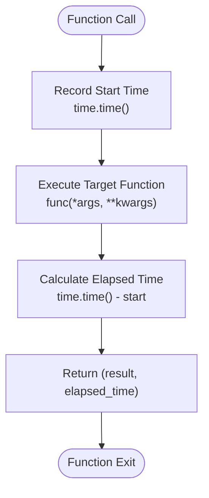
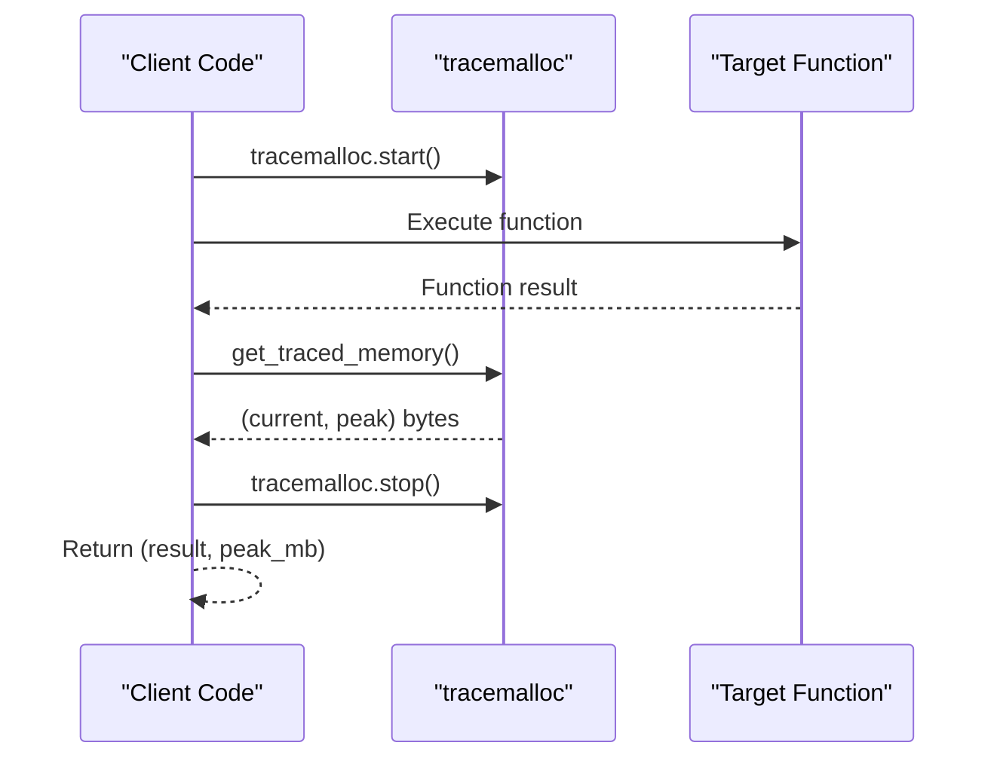
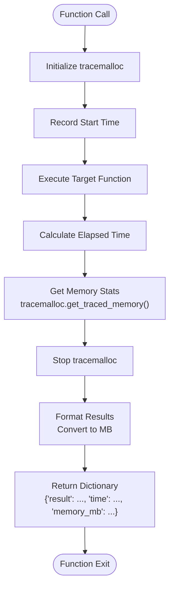
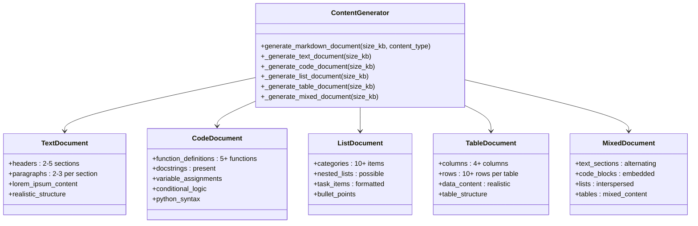
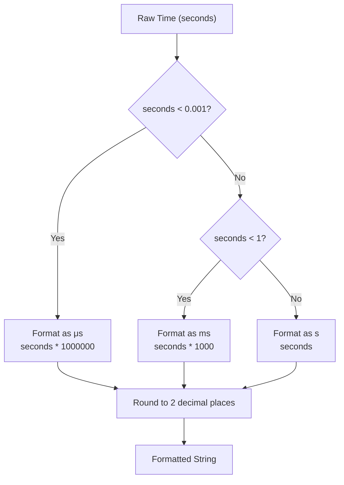
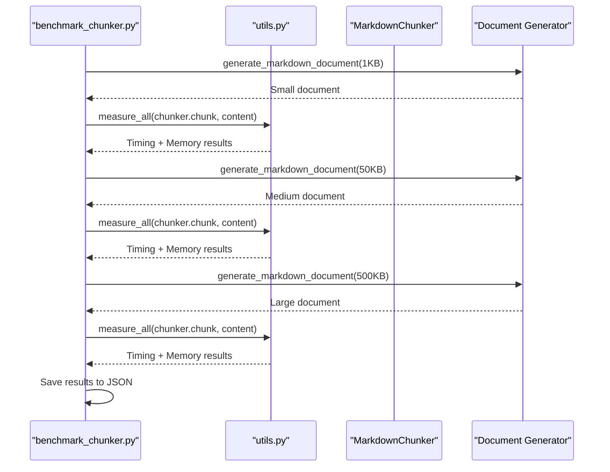
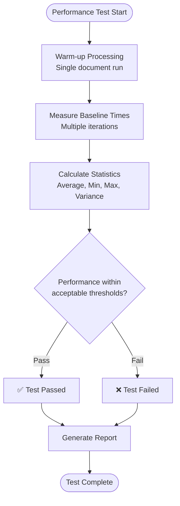

# Benchmark Utilities and Measurement Infrastructure

<cite>
**Referenced Files in This Document**
- [benchmarks/utils.py](file://benchmarks/utils.py)
- [tests/performance/test_benchmarks.py](file://tests/performance/test_benchmarks.py)
- [benchmarks/benchmark_chunker.py](file://benchmarks/benchmark_chunker.py)
- [benchmarks/benchmark_parser.py](file://benchmarks/benchmark_parser.py)
- [benchmarks/benchmark_strategies.py](file://benchmarks/benchmark_strategies.py)
- [tests/chunker/test_performance_benchmarks.py](file://tests/chunker/test_performance_benchmarks.py)
- [baseline.json](file://baseline.json)
</cite>

## Table of Contents
1. [Introduction](#introduction)
2. [Core Measurement Functions](#core-measurement-functions)
3. [Test Data Generation](#test-data-generation)
4. [Formatting Utilities](#formatting-utilities)
5. [Benchmark Scripts](#benchmark-scripts)
6. [Performance Validation](#performance-validation)
7. [Best Practices](#best-practices)
8. [Extending the Benchmark Suite](#extending-the-benchmark-suite)
9. [Troubleshooting](#troubleshooting)

## Introduction

The benchmark utilities and measurement infrastructure provide a comprehensive framework for performance testing, memory profiling, and consistency validation in the Dify Markdown Chunker project. This system enables reliable, reproducible performance testing across different document sizes, content types, and system configurations.

The infrastructure consists of three main components:
- **Measurement Functions**: Core timing and memory profiling utilities using `tracemalloc`
- **Test Data Generation**: Automated creation of benchmark documents with controlled characteristics
- **Validation Framework**: Performance regression testing and consistency checking

## Core Measurement Functions

The measurement infrastructure centers around three primary functions that provide accurate performance profiling capabilities.

### measure_time()

The `measure_time()` function provides precise execution time measurement for any callable function.



**Diagram sources**
- [benchmarks/utils.py](file://benchmarks/utils.py#L12-L27)

**Key Features:**
- Uses high-resolution `time.time()` for accurate timing
- Returns both function result and execution time
- Supports any callable with arbitrary arguments
- Minimal overhead measurement instrumentation

**Implementation Details:**
- Records start time immediately before function execution
- Calculates elapsed time after function completion
- Provides tuple return format `(result, elapsed_time)`
- Suitable for microsecond-level precision measurements

**Section sources**
- [benchmarks/utils.py](file://benchmarks/utils.py#L12-L27)

### measure_memory()

The `measure_memory()` function utilizes Python's `tracemalloc` module to profile peak memory usage during function execution.



**Diagram sources**
- [benchmarks/utils.py](file://benchmarks/utils.py#L30-L48)

**Key Features:**
- Utilizes `tracemalloc` for accurate memory tracking
- Converts peak memory from bytes to megabytes
- Automatically handles memory allocation tracking lifecycle
- Provides peak memory usage in MB for human readability

**Implementation Details:**
- Starts memory tracking before function execution
- Captures both current and peak memory states
- Stops tracking after function completion
- Converts peak bytes to MB using division by 1024²
- Returns tuple format `(result, peak_memory_mb)`

**Section sources**
- [benchmarks/utils.py](file://benchmarks/utils.py#L30-L48)

### measure_all()

The `measure_all()` function combines both timing and memory measurement in a single operation, providing comprehensive performance profiling.



**Diagram sources**
- [benchmarks/utils.py](file://benchmarks/utils.py#L51-L76)

**Key Features:**
- Single function call for comprehensive profiling
- Returns structured dictionary with all metrics
- Coordinated timing and memory tracking
- Consistent measurement methodology

**Implementation Details:**
- Initializes `tracemalloc` before function execution
- Records start time for duration calculation
- Executes target function with full argument forwarding
- Collects both timing and memory metrics
- Returns standardized dictionary format
- Proper resource cleanup with `tracemalloc.stop()`

**Section sources**
- [benchmarks/utils.py](file://benchmarks/utils.py#L51-L76)

## Test Data Generation

The test data generation system creates realistic benchmark documents with controlled characteristics for consistent performance testing.

### Content Type Generation

The system supports five distinct content types, each optimized for specific testing scenarios:



**Diagram sources**
- [benchmarks/utils.py](file://benchmarks/utils.py#L79-L224)

### Document Generation Functions

Each content type generator follows a consistent pattern for creating documents of specified size:

**Text Document Generation:**
- Creates structured documents with headers and paragraphs
- Uses lorem ipsum content for realistic text density
- Maintains hierarchical structure with multiple sections
- Targets specific size in kilobytes

**Code Document Generation:**
- Generates Python function definitions with docstrings
- Includes variable assignments and conditional logic
- Maintains proper indentation and syntax
- Creates realistic code examples

**List Document Generation:**
- Produces categorized task lists
- Supports nested list structures
- Maintains bullet point formatting
- Creates realistic task descriptions

**Table Document Generation:**
- Creates tables with multiple columns and rows
- Maintains proper markdown table syntax
- Includes realistic data content
- Supports various column types

**Mixed Document Generation:**
- Combines all content types in realistic proportions
- Alternates between text, code, lists, and tables
- Maintains natural document flow
- Simulates real-world mixed-content documents

**Section sources**
- [benchmarks/utils.py](file://benchmarks/utils.py#L79-L224)

## Formatting Utilities

The formatting utilities provide consistent presentation of performance metrics and enable human-readable output for benchmark results.

### format_time()

The `format_time()` function converts raw time values into human-readable formats with appropriate units.



**Diagram sources**
- [benchmarks/utils.py](file://benchmarks/utils.py#L235-L242)

**Key Features:**
- Automatic unit selection based on magnitude
- Microsecond precision for fast operations
- Millisecond precision for moderate operations
- Second precision for slow operations
- Consistent formatting with 2 decimal places

**Implementation Details:**
- Threshold-based unit selection (μs, ms, s)
- Multiplication factor for unit conversion
- String formatting with precision control
- Human-readable output formatting

**Section sources**
- [benchmarks/utils.py](file://benchmarks/utils.py#L235-L242)

### format_size()

The `format_size()` function converts byte values into appropriate size units with human-readable formatting.

**Key Features:**
- Automatic unit selection (B, KB, MB, GB, TB)
- Iterative unit conversion
- Precision control with 2 decimal places
- Support for very large file sizes

**Implementation Details:**
- Iterative division by 1024 until appropriate unit
- Unit array iteration for consistent scaling
- Final unit determination based on size threshold
- String formatting with precision specification

**Section sources**
- [benchmarks/utils.py](file://benchmarks/utils.py#L226-L232)

### calculate_throughput()

The `calculate_throughput()` function computes data processing rates in kilobytes per second.

**Key Features:**
- Byte-to-kilobyte conversion
- Time-based rate calculation
- Zero-time handling for safety
- Standardized throughput units

**Implementation Details:**
- Byte-to-KB conversion using division by 1024
- Time-based rate calculation
- Zero-division protection
- Floating-point precision maintenance

**Section sources**
- [benchmarks/utils.py](file://benchmarks/utils.py#L245-L258)

## Benchmark Scripts

The benchmark suite consists of specialized scripts for measuring different components of the markdown chunking system.

### benchmark_chunker.py

The main chunker benchmark measures overall performance across different document characteristics.



**Diagram sources**
- [benchmarks/benchmark_chunker.py](file://benchmarks/benchmark_chunker.py#L27-L88)

**Key Measurements:**
- Document size variations (1KB, 10KB, 50KB, 100KB, 500KB)
- Processing time for each size
- Memory usage patterns
- Throughput calculations
- Chunk count statistics

**Section sources**
- [benchmarks/benchmark_chunker.py](file://benchmarks/benchmark_chunker.py#L27-L88)

### benchmark_parser.py

The parser benchmark focuses specifically on the Stage 1 parsing component performance.

**Key Measurements:**
- Parsing time for different document sizes
- Element detection performance
- AST construction efficiency
- Content analysis speed

**Section sources**
- [benchmarks/benchmark_parser.py](file://benchmarks/benchmark_parser.py#L17-L42)

### benchmark_strategies.py

The strategy benchmark evaluates individual chunking strategy performance.

**Key Measurements:**
- Strategy-specific processing times
- Performance across different content types
- Strategy selection efficiency
- Comparative analysis between strategies

**Section sources**
- [benchmarks/benchmark_strategies.py](file://benchmarks/benchmark_strategies.py#L19-L77)

## Performance Validation

The performance validation system ensures consistent system behavior and detects performance regressions.

### Performance Regression Testing

The validation framework implements comprehensive performance regression testing:



**Diagram sources**
- [tests/performance/test_benchmarks.py](file://tests/performance/test_benchmarks.py#L209-L266)

**Validation Criteria:**
- Consistent processing time variance (≤100ms)
- Acceptable performance targets for each document size
- Memory usage stability across multiple runs
- No performance degradation compared to baselines

**Section sources**
- [tests/performance/test_benchmarks.py](file://tests/performance/test_benchmarks.py#L209-L266)

### Memory Usage Validation

The memory validation system monitors memory consumption patterns:

**Key Metrics:**
- Consistent chunk counts across multiple runs
- Stable processing times without degradation
- No memory leaks in repeated processing
- Reasonable memory usage patterns

**Section sources**
- [tests/performance/test_benchmarks.py](file://tests/performance/test_benchmarks.py#L171-L206)

### Baseline Comparison

The system maintains performance baselines for regression detection:

**Baseline Features:**
- Historical performance data storage
- Automated baseline comparison
- Performance trend analysis
- Regression detection alerts

**Section sources**
- [baseline.json](file://baseline.json)

## Best Practices

### Measurement Methodology

**Timing Accuracy:**
- Use `time.time()` for high-resolution timing
- Account for system overhead in measurements
- Perform warm-up runs before collecting data
- Take multiple measurements for statistical validity

**Memory Profiling:**
- Initialize `tracemalloc` before function execution
- Capture peak memory usage accurately
- Stop tracing after function completion
- Convert to appropriate units for reporting

**Test Data Consistency:**
- Use controlled document generation
- Maintain consistent content characteristics
- Test across representative document sizes
- Validate test data quality

### Performance Testing Guidelines

**Environment Control:**
- Run tests in consistent environments
- Minimize system load during testing
- Use appropriate hardware specifications
- Account for virtualization overhead

**Result Interpretation:**
- Consider statistical significance
- Account for system variability
- Compare against established baselines
- Document environmental conditions

### Extensibility Considerations

**Adding New Benchmarks:**
- Follow existing measurement patterns
- Use the same utility functions
- Maintain consistent output formats
- Integrate with existing validation frameworks

**Custom Measurement Functions:**
- Preserve timing accuracy
- Handle memory profiling appropriately
- Provide meaningful formatting utilities
- Document measurement methodologies

## Extending the Benchmark Suite

### Adding New Measurement Capabilities

To extend the benchmark suite with new measurement capabilities:

**Step 1: Define Measurement Function**
```python
def measure_custom_metric(func: Callable, *args, **kwargs) -> Dict[str, Any]:
    """Custom measurement function with additional metrics."""
    # Implementation following existing patterns
    pass
```

**Step 2: Create Formatting Utilities**
```python
def format_custom_unit(value: float) -> str:
    """Format custom metric values."""
    # Implementation for human-readable output
    pass
```

**Step 3: Integrate with Existing Framework**
- Add to benchmark scripts
- Update validation logic
- Extend baseline storage
- Update documentation

### Creating New Benchmark Scripts

**Template Structure:**
```python
def benchmark_new_feature():
    """Benchmark new feature performance."""
    # Implementation following existing patterns
    pass

def main():
    """Run all benchmarks."""
    # Integration with existing framework
    pass
```

**Best Practices:**
- Use consistent measurement utilities
- Follow established formatting patterns
- Integrate with validation frameworks
- Document measurement methodologies

## Troubleshooting

### Common Measurement Issues

**Inaccurate Timing:**
- Ensure adequate warm-up periods
- Check for system load interference
- Verify timing resolution
- Account for garbage collection

**Memory Profiling Problems:**
- Properly initialize `tracemalloc`
- Ensure clean shutdown
- Check for memory leaks
- Verify peak memory capture

**Test Data Generation Issues:**
- Validate generated document sizes
- Check content type consistency
- Verify document structure
- Test with various input patterns

### Performance Regression Detection

**False Positives:**
- Account for system variability
- Consider environmental factors
- Use statistical significance testing
- Establish appropriate thresholds

**Missing Regressions:**
- Monitor multiple metrics
- Test across different scenarios
- Use comprehensive validation
- Maintain detailed baselines

### Debugging Benchmark Failures

**Investigation Steps:**
1. Verify test environment consistency
2. Check for external interference
3. Validate measurement accuracy
4. Review baseline comparisons
5. Analyze performance trends

**Resolution Strategies:**
- Adjust performance thresholds
- Update baseline data
- Modify measurement methodology
- Improve test isolation

**Section sources**
- [tests/performance/test_benchmarks.py](file://tests/performance/test_benchmarks.py#L171-L318)