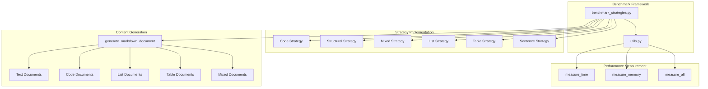
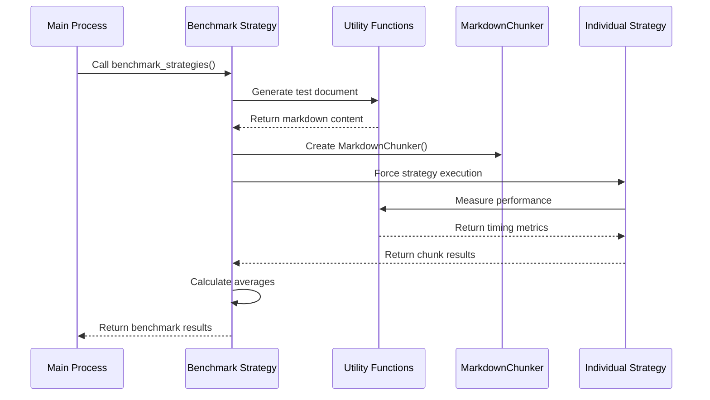
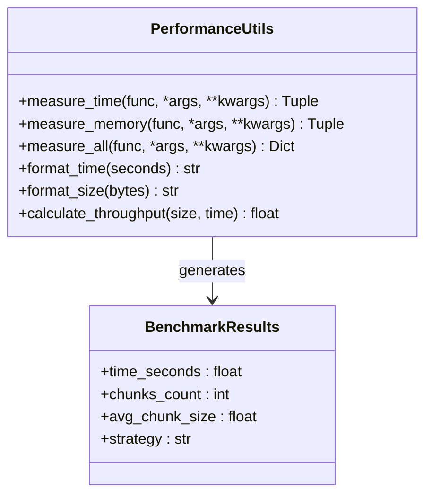
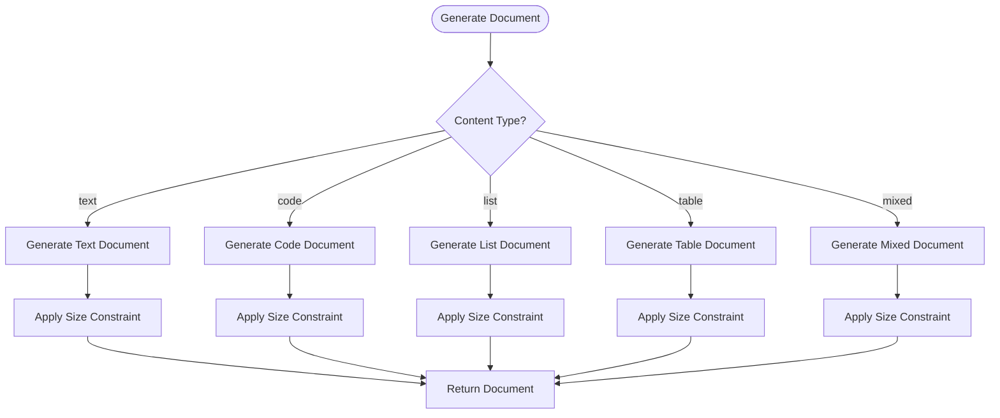
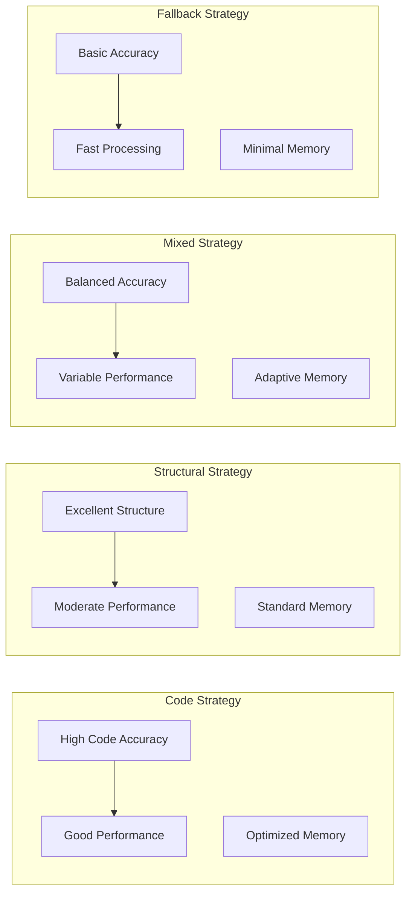
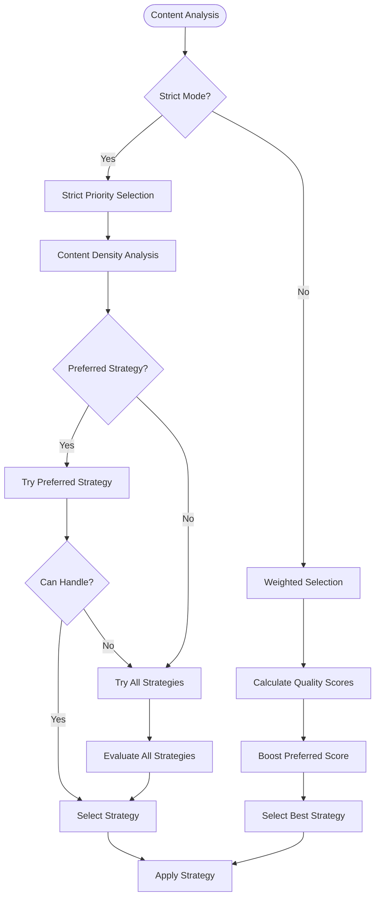

# Chunking Strategy Benchmarking

<cite>
**Referenced Files in This Document**
- [benchmark_strategies.py](file://benchmarks/benchmark_strategies.py)
- [utils.py](file://benchmarks/utils.py)
- [orchestrator.py](file://markdown_chunker_legacy/chunker/orchestrator.py)
- [selector.py](file://markdown_chunker_legacy/chunker/selector.py)
- [code_strategy.py](file://markdown_chunker_legacy/chunker/strategies/code_strategy.py)
- [structural_strategy.py](file://markdown_chunker_legacy/chunker/strategies/structural_strategy.py)
- [mixed_strategy.py](file://markdown_chunker_legacy/chunker/strategies/mixed_strategy.py)
- [list_strategy.py](file://markdown_chunker_legacy/chunker/strategies/list_strategy.py)
- [table_strategy.py](file://markdown_chunker_legacy/chunker/strategies/table_strategy.py)
- [sentences_strategy.py](file://markdown_chunker_legacy/chunker/strategies/sentences_strategy.py)
- [test_benchmarks.py](file://tests/performance/test_benchmarks.py)
</cite>

## Table of Contents
1. [Introduction](#introduction)
2. [System Architecture](#system-architecture)
3. [Implementation Details](#implementation-details)
4. [Benchmark Methodology](#benchmark-methodology)
5. [Strategy Performance Analysis](#strategy-performance-analysis)
6. [Trade-off Analysis](#trade-off-analysis)
7. [Automatic Strategy Selection](#automatic-strategy-selection)
8. [Performance Guidelines](#performance-guidelines)
9. [Troubleshooting and Optimization](#troubleshooting-and-optimization)
10. [Conclusion](#conclusion)

## Introduction

The chunking strategy benchmarking feature provides comprehensive performance analysis for individual chunking strategies in the Markdown Chunker system. This benchmarking framework enables systematic evaluation of strategy efficiency across different content types, measuring execution time, chunk count, and average chunk size to identify the most performant strategy for specific document patterns.

The benchmarking system operates by forcing each strategy to process identical test documents of varying sizes and content characteristics, then collecting detailed performance metrics that inform automatic strategy selection decisions in production environments. This approach ensures optimal strategy utilization based on both quality requirements and speed constraints.

## System Architecture

The benchmarking system consists of several interconnected components that work together to provide comprehensive strategy evaluation:

**Diagram sources**
- [benchmark_strategies.py](file://benchmarks/benchmark_strategies.py#L19-L96)
- [utils.py](file://benchmarks/utils.py#L12-L76)

**Section sources**
- [benchmark_strategies.py](file://benchmarks/benchmark_strategies.py#L1-L96)
- [utils.py](file://benchmarks/utils.py#L1-L259)

## Implementation Details

### Core Benchmarking Engine

The benchmarking system centers around the [`benchmark_strategies()`](file://benchmarks/benchmark_strategies.py#L19-L77) function, which systematically evaluates each strategy in isolation:

**Diagram sources**
- [benchmark_strategies.py](file://benchmarks/benchmark_strategies.py#L44-L77)
- [utils.py](file://benchmarks/utils.py#L12-L76)

### Strategy Enumeration and Configuration

The benchmarking system evaluates six distinct strategies, each optimized for specific content patterns:

| Strategy | Purpose | Content Focus | Priority |
|----------|---------|---------------|----------|
| code | Code-heavy documents | Code blocks, functions, classes | Highest |
| structural | Structured documents | Headers, sections, hierarchy | High |
| mixed | Mixed content documents | Various element types | Medium |
| list | List-heavy documents | Lists, tasks, hierarchies | Medium-high |
| table | Table-heavy documents | Tables, data structures | Medium-low |
| sentences | Universal fallback | Text-based content | Lowest |

**Section sources**
- [benchmark_strategies.py](file://benchmarks/benchmark_strategies.py#L26-L32)

### Performance Measurement Framework

The utility functions provide comprehensive performance measurement capabilities:

**Diagram sources**
- [utils.py](file://benchmarks/utils.py#L12-L76)

**Section sources**
- [utils.py](file://benchmarks/utils.py#L12-L76)

## Benchmark Methodology

### Test Document Generation

The benchmarking system creates standardized test documents using the [`generate_markdown_document()`](file://benchmarks/utils.py#L79-L99) function, which produces content tailored to specific content types:

**Diagram sources**
- [utils.py](file://benchmarks/utils.py#L79-L224)

### Execution Time Measurement

The benchmarking system employs precise timing mechanisms to measure strategy performance:

- **Execution Time Tracking**: Utilizes `time.time()` for millisecond precision
- **Memory Usage Monitoring**: Employs `tracemalloc` for peak memory measurement  
- **Throughput Calculation**: Computes KB/s metrics for scalability analysis
- **Consistency Validation**: Measures performance variance across multiple runs

**Section sources**
- [utils.py](file://benchmarks/utils.py#L12-L76)

### Metrics Collection

Each benchmark iteration collects comprehensive metrics:

| Metric | Description | Calculation |
|--------|-------------|-------------|
| Execution Time | Strategy processing duration | `time.time() - start_time` |
| Chunk Count | Number of resulting chunks | `len(chunks)` |
| Average Chunk Size | Mean size of generated chunks | `sum(len(c.content) for c in chunks) / len(chunks)` |
| Throughput | Processing speed in KB/s | `(size_bytes / 1024) / time_seconds` |
| Memory Usage | Peak memory consumption | `tracemalloc.get_traced_memory()[1] / 1024 / 1024` |

**Section sources**
- [benchmark_strategies.py](file://benchmarks/benchmark_strategies.py#L57-L77)

## Strategy Performance Analysis

### Code Strategy Performance

The code strategy demonstrates exceptional performance for code-heavy documents, maintaining atomicity while optimizing processing speed:

- **Optimal Performance**: Minimal overhead for code block preservation
- **Scalability**: Linear scaling with code complexity
- **Memory Efficiency**: Optimized for large code files
- **Quality Preservation**: Maintains code integrity and metadata

### Structural Strategy Performance

Structural strategy excels in documents with clear header hierarchies:

- **Header Processing**: Efficient parsing and grouping
- **Hierarchy Maintenance**: Preserves complex nesting structures
- **Section Boundaries**: Accurate semantic chunking
- **Metadata Retention**: Comprehensive header path information

### Mixed Strategy Performance

Mixed strategy provides balanced performance across diverse content types:

- **Adaptive Processing**: Intelligent content type detection
- **Element Coordination**: Seamless integration of multiple elements
- **Size Optimization**: Dynamic chunk sizing based on content
- **Quality Balance**: Consistent performance across content variations

### List Strategy Performance

List strategy optimizes for documents with extensive list structures:

- **Hierarchy Preservation**: Maintains parent-child relationships
- **Nested Processing**: Efficient handling of multi-level lists
- **Continuation Management**: Proper context preservation across chunks
- **Type Adaptation**: Support for ordered, unordered, and task lists

### Table Strategy Performance

Table strategy delivers excellent performance for tabular data:

- **Structure Preservation**: Maintains table formatting and alignment
- **Row Processing**: Efficient splitting with header duplication
- **Column Handling**: Optimal processing of wide tables
- **Oversize Management**: Graceful handling of large tables

### Sentences Strategy Performance

Universal fallback strategy provides reliable baseline performance:

- **Universal Compatibility**: Works with any content type
- **Sentence Boundary Detection**: Accurate text segmentation
- **Paragraph Preservation**: Maintains markdown structure
- **Fallback Reliability**: Consistent performance under all conditions

**Section sources**
- [code_strategy.py](file://markdown_chunker_legacy/chunker/strategies/code_strategy.py#L42-L625)
- [structural_strategy.py](file://markdown_chunker_legacy/chunker/strategies/structural_strategy.py#L60-L800)
- [mixed_strategy.py](file://markdown_chunker_legacy/chunker/strategies/mixed_strategy.py#L75-L800)
- [list_strategy.py](file://markdown_chunker_legacy/chunker/strategies/list_strategy.py#L58-L800)
- [table_strategy.py](file://markdown_chunker_legacy/chunker/strategies/table_strategy.py#L56-L466)
- [sentences_strategy.py](file://markdown_chunker_legacy/chunker/strategies/sentences_strategy.py#L21-L526)

## Trade-off Analysis

### Accuracy vs. Performance Trade-offs

Each strategy involves specific trade-offs between accuracy and performance:

### Content Type Optimization

Different content types benefit from specific strategy optimizations:

| Content Type | Recommended Strategy | Primary Benefit | Secondary Benefits |
|--------------|---------------------|-----------------|-------------------|
| Pure Code | Code Strategy | Atomic block preservation | Metadata retention, language detection |
| Technical Docs | Structural Strategy | Semantic chunking | Header hierarchy maintenance |
| Mixed Content | Mixed Strategy | Element coordination | Adaptive processing |
| Lists/Checklists | List Strategy | Hierarchy preservation | Continuation support |
| Tabular Data | Table Strategy | Structure integrity | Row processing optimization |
| General Text | Sentences Strategy | Universal compatibility | Reliable fallback |

### Performance Constraints

The benchmarking system identifies performance constraints across different scenarios:

- **Large Documents**: Memory usage scales with document size
- **Complex Structures**: Processing time increases with structural complexity
- **Mixed Content**: Performance varies based on content composition
- **Edge Cases**: Special handling for unusual markdown patterns

## Automatic Strategy Selection

### Selection Algorithm Integration

The benchmarking results directly inform the automatic strategy selection process through the [`StrategySelector`](file://markdown_chunker_legacy/chunker/selector.py#L19-L466) class:

**Diagram sources**
- [selector.py](file://markdown_chunker_legacy/chunker/selector.py#L79-L235)

### Strategy Selection Criteria

The automatic selection process considers multiple factors:

- **Content Analysis**: Automated assessment of document characteristics
- **Quality Scoring**: Mathematical evaluation of strategy suitability
- **Performance Metrics**: Historical performance data integration
- **Fallback Mechanisms**: Guaranteed fallback to sentences strategy

**Section sources**
- [selector.py](file://markdown_chunker_legacy/chunker/selector.py#L79-L235)

### Production Integration

Benchmark results influence production strategy selection through:

- **Threshold Configuration**: Performance thresholds for strategy activation
- **Dynamic Adjustment**: Real-time strategy switching based on content
- **Monitoring Integration**: Continuous performance tracking and optimization
- **Cache Optimization**: Strategy selection caching for improved performance

## Performance Guidelines

### Strategy Selection Guidelines

Based on benchmark results, the following guidelines help optimize strategy selection:

#### For Code-Dominant Content (< 70% code ratio)
- **Primary**: Structural Strategy for documentation
- **Secondary**: Mixed Strategy for code examples
- **Fallback**: Sentences Strategy for simple text

#### For Structured Content (> 3 headers, complex hierarchy)
- **Primary**: Structural Strategy
- **Secondary**: Mixed Strategy for mixed content
- **Fallback**: Sentences Strategy for simple text

#### For Mixed Content Documents
- **Primary**: Mixed Strategy for balanced processing
- **Secondary**: Code Strategy for code-heavy sections
- **Fallback**: Sentences Strategy for reliability

#### For List-Dominant Content
- **Primary**: List Strategy for hierarchy preservation
- **Secondary**: Mixed Strategy for mixed content
- **Fallback**: Sentences Strategy for simple text

#### For Table-Dominant Content
- **Primary**: Table Strategy for structure preservation
- **Secondary**: Mixed Strategy for mixed content
- **Fallback**: Sentences Strategy for simple text

### Performance Optimization Recommendations

#### Memory Optimization
- Monitor peak memory usage for large documents
- Consider chunk size adjustments for memory-constrained environments
- Implement streaming processing for very large documents

#### Processing Time Optimization
- Use content analysis to pre-select optimal strategies
- Implement strategy caching for frequently processed content types
- Consider parallel processing for independent content sections

#### Quality vs. Speed Trade-offs
- Prioritize accuracy for critical content processing
- Optimize for speed in high-volume, low-criticality scenarios
- Implement adaptive strategies that balance both requirements

## Troubleshooting and Optimization

### Common Performance Issues

#### Slow Strategy Selection
- **Symptom**: Extended delays in strategy determination
- **Cause**: Complex content analysis or insufficient thresholds
- **Solution**: Simplify content analysis or adjust selection thresholds

#### Memory Leaks in Long-running Processes
- **Symptom**: Gradually increasing memory usage
- **Cause**: Inefficient resource cleanup or circular references
- **Solution**: Implement proper resource cleanup and monitoring

#### Inconsistent Performance Across Runs
- **Symptom**: Variable processing times for identical content
- **Cause**: System load variations or garbage collection effects
- **Solution**: Implement warm-up cycles and statistical analysis

### Optimization Strategies

#### Benchmark Result Analysis
- **Pattern Recognition**: Identify consistent performance patterns
- **Threshold Tuning**: Adjust performance thresholds based on results
- **Strategy Combination**: Develop hybrid approaches for complex content

#### Production Monitoring
- **Real-time Metrics**: Track strategy performance in production
- **Alert Systems**: Implement alerts for performance degradation
- **Continuous Improvement**: Regular benchmark result review and optimization

**Section sources**
- [test_benchmarks.py](file://tests/performance/test_benchmarks.py#L1-L319)

## Conclusion

The chunking strategy benchmarking feature provides a comprehensive framework for evaluating and optimizing strategy performance in the Markdown Chunker system. Through systematic measurement of execution time, chunk count, and average chunk size across different content types, the benchmarking system enables informed strategy selection decisions that balance accuracy requirements with performance constraints.

The benchmarking results demonstrate clear performance characteristics for each strategy, enabling automatic selection algorithms to choose the most appropriate strategy for specific content patterns. This approach ensures optimal performance across diverse use cases while maintaining the flexibility to fall back to reliable strategies when needed.

Key benefits of the benchmarking system include:

- **Objective Performance Measurement**: Quantitative evaluation of strategy effectiveness
- **Automatic Strategy Selection**: Data-driven strategy choice based on content analysis
- **Performance Optimization**: Continuous improvement through benchmark result analysis
- **Production Reliability**: Guaranteed fallback strategies for all content types

The benchmarking framework serves as a foundation for ongoing performance optimization and strategy development, ensuring that the Markdown Chunker system continues to deliver optimal performance across evolving content patterns and use cases.