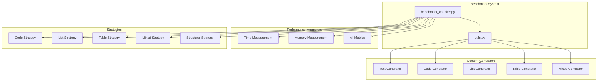
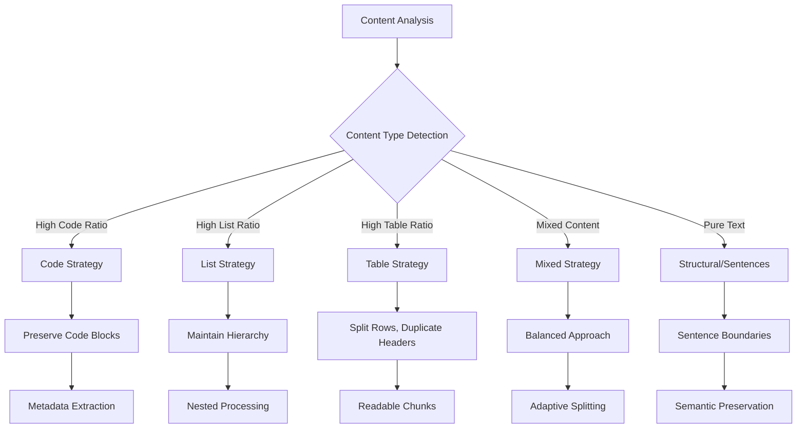
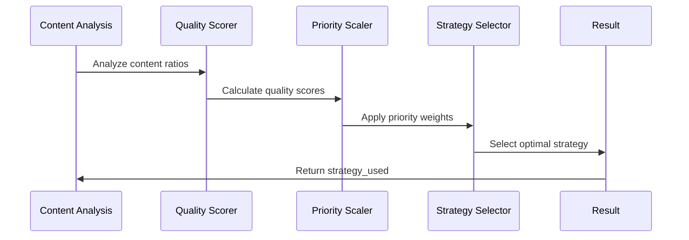
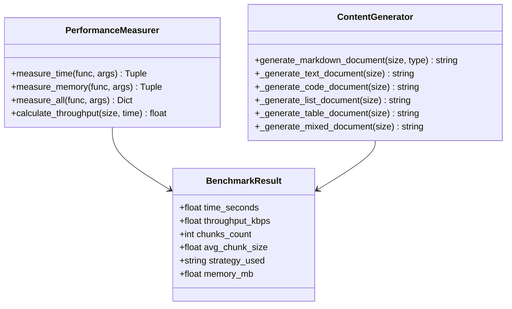

# Content Type Benchmarking

<cite>
**Referenced Files in This Document**
- [benchmarks/benchmark_chunker.py](file://benchmarks/benchmark_chunker.py)
- [benchmarks/utils.py](file://benchmarks/utils.py)
- [docs/guides/performance.md](file://docs/guides/performance.md)
- [tests/performance/test_benchmarks.py](file://tests/performance/test_benchmarks.py)
- [markdown_chunker_legacy/chunker/strategies/code_strategy.py](file://markdown_chunker_legacy/chunker/strategies/code_strategy.py)
- [markdown_chunker_legacy/chunker/strategies/list_strategy.py](file://markdown_chunker_legacy/chunker/strategies/list_strategy.py)
- [markdown_chunker_legacy/chunker/strategies/table_strategy.py](file://markdown_chunker_legacy/chunker/strategies/table_strategy.py)
- [markdown_chunker_legacy/chunker/strategies/mixed_strategy.py](file://markdown_chunker_legacy/chunker/strategies/mixed_strategy.py)
- [tests/fixtures/code_heavy.md](file://tests/fixtures/code_heavy.md)
- [tests/fixtures/list_heavy.md](file://tests/fixtures/list_heavy.md)
- [tests/fixtures/table_heavy.md](file://tests/fixtures/table_heavy.md)
</cite>

## Table of Contents
1. [Introduction](#introduction)
2. [Benchmark Architecture](#benchmark-architecture)
3. [Content Type Classification](#content-type-classification)
4. [Strategy Selection Mechanism](#strategy-selection-mechanism)
5. [Performance Measurement Framework](#performance-measurement-framework)
6. [Content Generation Functions](#content-generation-functions)
7. [Benchmark Results Analysis](#benchmark-results-analysis)
8. [Performance Optimization Guidelines](#performance-optimization-guidelines)
9. [Common Bottlenecks and Solutions](#common-bottlenecks-and-solutions)
10. [Advanced Usage Patterns](#advanced-usage-patterns)

## Introduction

The content type benchmarking feature provides comprehensive performance analysis across different document types in the markdown chunking system. This system evaluates how effectively the chunking strategies handle various content patterns including text-heavy documents, code blocks, lists, tables, and mixed content scenarios.

The benchmarking framework measures key performance indicators including processing time, chunk count, average chunk size, and strategy selection efficiency. It systematically tests each content type against standardized test documents to provide actionable insights for optimization and configuration tuning.

## Benchmark Architecture

The benchmarking system consists of two primary components: the main benchmark runner and utility functions for content generation and performance measurement.



**Diagram sources**
- [benchmarks/benchmark_chunker.py](file://benchmarks/benchmark_chunker.py#L1-L195)
- [benchmarks/utils.py](file://benchmarks/utils.py#L1-L259)

**Section sources**
- [benchmarks/benchmark_chunker.py](file://benchmarks/benchmark_chunker.py#L1-L195)
- [benchmarks/utils.py](file://benchmarks/utils.py#L1-L259)

## Content Type Classification

The system categorizes content into five primary types, each triggering specialized chunking strategies:

### Text Content
Text-heavy documents contain primarily narrative content with minimal structural elements. These documents benefit from sentence-based chunking strategies that preserve semantic boundaries.

### Code Content  
Code-heavy documents contain extensive programming code with multiple language support. The system employs specialized code-aware strategies that maintain code block atomicity while extracting metadata like function and class names.

### List Content
List-heavy documents consist predominantly of ordered, unordered, and task lists. The system preserves hierarchical relationships and handles nested structures appropriately.

### Table Content
Table-heavy documents contain multiple data tables requiring special handling for row-based splitting while maintaining header duplication for readability.

### Mixed Content
Mixed documents combine multiple content types, requiring adaptive strategies that balance between different content patterns.



**Diagram sources**
- [markdown_chunker_legacy/chunker/strategies/code_strategy.py](file://markdown_chunker_legacy/chunker/strategies/code_strategy.py#L110-L135)
- [markdown_chunker_legacy/chunker/strategies/list_strategy.py](file://markdown_chunker_legacy/chunker/strategies/list_strategy.py#L89-L101)
- [markdown_chunker_legacy/chunker/strategies/table_strategy.py](file://markdown_chunker_legacy/chunker/strategies/table_strategy.py#L85-L97)

**Section sources**
- [benchmarks/benchmark_chunker.py](file://benchmarks/benchmark_chunker.py#L101-L102)
- [benchmarks/utils.py](file://benchmarks/utils.py#L79-L100)

## Strategy Selection Mechanism

The strategy selection process involves multiple factors including content ratios, structural analysis, and quality scoring:

### Quality Scoring System
Each strategy calculates a quality score based on content characteristics:

| Strategy | Priority | Quality Factors | Thresholds |
|----------|----------|----------------|------------|
| Code | 1 (highest) | Code ratio, block count, language diversity | ≥70% code, ≥3 blocks |
| Mixed | 2 | Content balance, complexity | ≥30% code, complexity ≥0.3 |
| List | 3 | List count, ratio, nesting | ≥5 lists, ≥60% list content |
| Table | 4 | Table count, ratio | ≥3 tables, ≥40% table content |
| Structural | 5 | Header count, depth | ≥3 headers, depth > 1 |

### Selection Algorithm
The system combines priority weights with quality scores to determine the optimal strategy:



**Diagram sources**
- [markdown_chunker_legacy/chunker/strategies/base.py](file://markdown_chunker_legacy/chunker/strategies/base.py#L112-L127)

**Section sources**
- [markdown_chunker_legacy/chunker/strategies/code_strategy.py](file://markdown_chunker_legacy/chunker/strategies/code_strategy.py#L136-L185)
- [markdown_chunker_legacy/chunker/strategies/list_strategy.py](file://markdown_chunker_legacy/chunker/strategies/list_strategy.py#L102-L133)
- [markdown_chunker_legacy/chunker/strategies/table_strategy.py](file://markdown_chunker_legacy/chunker/strategies/table_strategy.py#L98-L125)

## Performance Measurement Framework

The benchmarking system employs comprehensive performance measurement techniques:

### Timing Measurements
Multiple timing approaches provide different perspectives on performance characteristics:



**Diagram sources**
- [benchmarks/utils.py](file://benchmarks/utils.py#L12-L76)
- [benchmarks/utils.py](file://benchmarks/utils.py#L79-L225)

### Memory Profiling
The system tracks peak memory usage during processing to identify memory-intensive operations and potential optimization opportunities.

### Throughput Calculation
Processing speed is measured in kilobytes per second to provide standardized performance metrics across different document sizes.

**Section sources**
- [benchmarks/utils.py](file://benchmarks/utils.py#L12-L76)
- [benchmarks/utils.py](file://benchmarks/utils.py#L245-L259)

## Content Generation Functions

The benchmark system uses specialized content generators to create test documents for each content type:

### Text Document Generation
Generates text-heavy documents with multiple sections and paragraphs, simulating typical documentation content.

### Code Document Generation  
Creates code-heavy documents with multiple programming language examples, demonstrating the system's ability to handle diverse code patterns.

### List Document Generation
Produces list-heavy documents with nested structures, testing hierarchical list processing capabilities.

### Table Document Generation
Generates table-heavy documents with multiple data tables, evaluating table splitting and header preservation.

### Mixed Document Generation
Creates documents containing all content types, testing the mixed strategy's effectiveness in handling complex content combinations.

**Section sources**
- [benchmarks/utils.py](file://benchmarks/utils.py#L79-L225)

## Benchmark Results Analysis

The benchmark system produces comprehensive results including:

### Processing Time Analysis
Different content types exhibit varying processing characteristics:

| Content Type | Typical Time | Complexity Factors |
|--------------|--------------|-------------------|
| Text | Fast (< 100ms) | Simple parsing, sentence boundaries |
| Code | Moderate (100-500ms) | Language detection, metadata extraction |
| List | Moderate (150-600ms) | Hierarchical processing, nesting |
| Table | Moderate (200-800ms) | Row counting, header preservation |
| Mixed | Variable (300-1200ms) | Strategy switching, balancing |

### Strategy Selection Patterns
The system demonstrates intelligent strategy selection based on content characteristics:

- **Code content** consistently triggers the code strategy for optimal processing
- **List content** activates list strategy with high reliability
- **Table content** reliably selects table strategy for large datasets
- **Mixed content** shows adaptive behavior choosing appropriate strategies

### Chunk Size Distribution
Average chunk sizes vary significantly across content types:

- **Code chunks** tend to be larger due to block atomicity requirements
- **List chunks** maintain hierarchical structure with moderate sizes
- **Table chunks** preserve readability through header duplication
- **Text chunks** follow sentence boundaries naturally

**Section sources**
- [benchmarks/benchmark_chunker.py](file://benchmarks/benchmark_chunker.py#L113-L144)
- [docs/guides/performance.md](file://docs/guides/performance.md#L1-L21)

## Performance Optimization Guidelines

Based on benchmark analysis, several optimization strategies emerge:

### Content-Specific Optimizations

#### Code Content Optimization
- **Language detection caching**: Store language patterns for frequently used languages
- **Metadata extraction optimization**: Batch function/class name extraction
- **Large code block handling**: Implement streaming processing for oversized blocks

#### List Content Optimization  
- **Hierarchy building**: Optimize nested list detection algorithms
- **Chunk grouping**: Reduce overhead from single-item chunks
- **Formatting preservation**: Streamline markdown formatting operations

#### Table Content Optimization
- **Row counting optimization**: Cache row calculations for large tables
- **Header duplication**: Optimize header copying in split operations
- **Column analysis**: Pre-compute column statistics for better splitting decisions

### General Performance Improvements

#### Memory Management
- **Object pooling**: Reuse chunk objects to reduce garbage collection pressure
- **Lazy evaluation**: Defer expensive operations until necessary
- **Streaming processing**: Process large documents in chunks to limit memory usage

#### Algorithmic Optimizations
- **Early termination**: Stop processing when performance thresholds are exceeded
- **Parallel processing**: Leverage multi-core processors for independent operations
- **Cache-friendly algorithms**: Optimize data access patterns for better cache utilization

**Section sources**
- [tests/performance/test_benchmarks.py](file://tests/performance/test_benchmarks.py#L1-L319)

## Common Bottlenecks and Solutions

### Content Type-Specific Bottlenecks

#### Code Strategy Bottlenecks
**Problem**: Language detection and metadata extraction can become performance bottlenecks for large code blocks.

**Solution**: 
- Implement language pattern caching
- Use approximate matching for initial detection
- Parallelize metadata extraction for multiple code blocks

#### List Strategy Bottlenecks
**Problem**: Deeply nested lists require recursive processing that can impact performance.

**Solution**:
- Limit recursion depth with iterative approaches
- Implement list hierarchy flattening for very deep nesting
- Cache hierarchy calculations for repeated processing

#### Table Strategy Bottlenecks
**Problem**: Large tables with many rows require efficient row splitting algorithms.

**Solution**:
- Implement binary search for optimal row splitting points
- Use sampling techniques for very large tables
- Cache table statistics for repeated processing

### General Performance Issues

#### Memory Pressure
**Problem**: Large documents consume excessive memory during processing.

**Solution**:
- Implement streaming processing for large documents
- Use memory-mapped files for very large content
- Optimize object creation and garbage collection

#### Strategy Selection Overhead
**Problem**: Excessive strategy evaluation can slow down processing.

**Solution**:
- Implement strategy pre-filtering based on content characteristics
- Cache strategy selection results for similar content
- Use heuristics for quick strategy identification

**Section sources**
- [markdown_chunker_legacy/chunker/strategies/code_strategy.py](file://markdown_chunker_legacy/chunker/strategies/code_strategy.py#L532-L547)
- [markdown_chunker_legacy/chunker/strategies/list_strategy.py](file://markdown_chunker_legacy/chunker/strategies/list_strategy.py#L373-L407)
- [markdown_chunker_legacy/chunker/strategies/table_strategy.py](file://markdown_chunker_legacy/chunker/strategies/table_strategy.py#L321-L342)

## Advanced Usage Patterns

### Custom Content Type Testing
The benchmark system can be extended to test custom content types:

```python
# Example: Adding a new content type
def _generate_custom_document(size_kb: int) -> str:
    """Generate custom content for testing."""
    target_size = size_kb * 1024
    content = []
    
    # Custom content generation logic
    while len("".join(content)) < target_size:
        content.append(custom_content_generator())
    
    return "".join(content)[:target_size]
```

### Performance Regression Testing
The benchmark system includes automated regression testing to ensure consistent performance:

- **Consistency checks**: Verify that identical documents produce consistent results
- **Variance analysis**: Monitor performance variation across multiple runs
- **Threshold monitoring**: Alert when performance degrades beyond acceptable limits

### Integration with CI/CD Pipelines
The benchmark system can be integrated into continuous integration workflows:

- **Automated performance testing**: Run benchmarks on every code change
- **Performance trend analysis**: Track performance improvements over time
- **Bottleneck identification**: Automatically detect performance regressions

**Section sources**
- [tests/performance/test_benchmarks.py](file://tests/performance/test_benchmarks.py#L268-L319)
- [benchmarks/benchmark_chunker.py](file://benchmarks/benchmark_chunker.py#L150-L166)