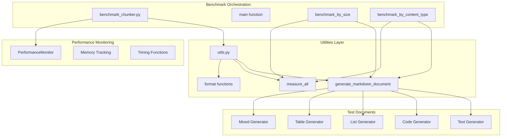
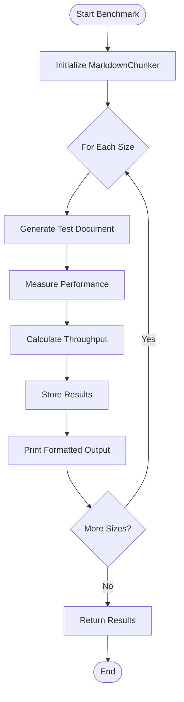
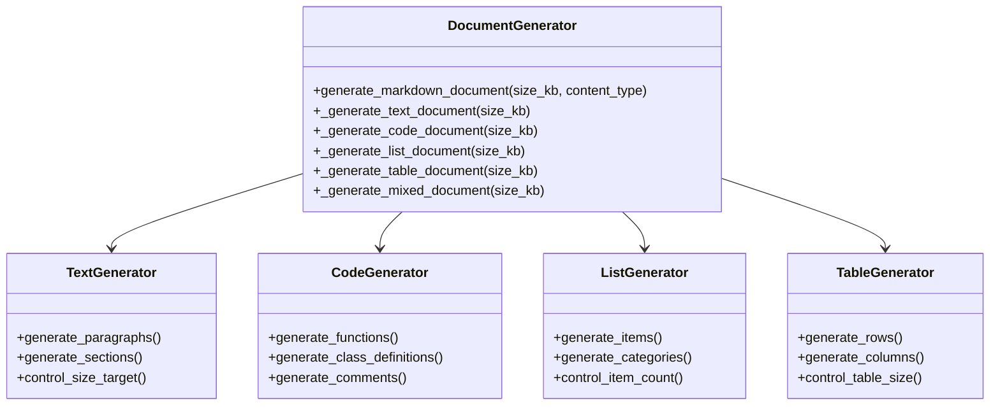
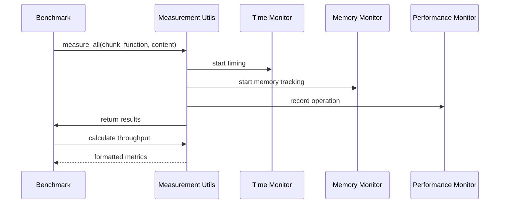
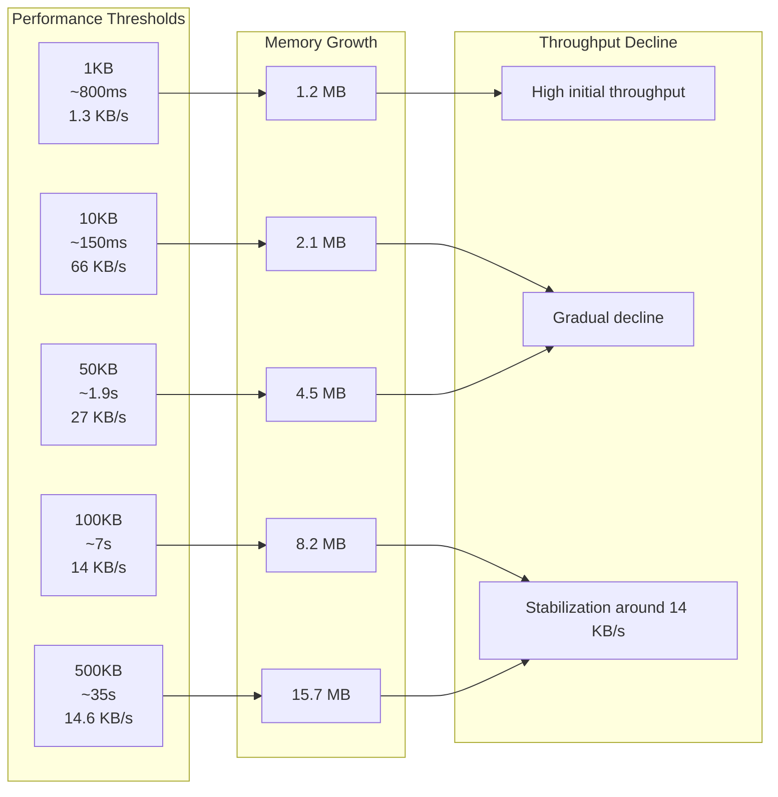
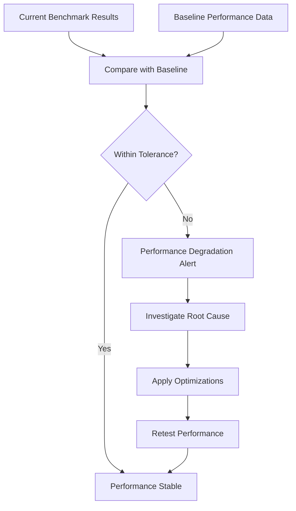

# Document Size Benchmarking

<cite>
**Referenced Files in This Document**
- [benchmarks/benchmark_chunker.py](file://benchmarks/benchmark_chunker.py)
- [benchmarks/utils.py](file://benchmarks/utils.py)
- [tests/performance/test_benchmarks.py](file://tests/performance/test_benchmarks.py)
- [docs/guides/performance.md](file://docs/guides/performance.md)
- [markdown_chunker_legacy/chunker/performance.py](file://markdown_chunker_legacy/chunker/performance.py)
- [tests/chunker/test_performance.py](file://tests/chunker/test_performance.py)
</cite>

## Table of Contents
1. [Introduction](#introduction)
2. [Benchmark Architecture](#benchmark-architecture)
3. [Core Benchmark Functions](#core-benchmark-functions)
4. [Document Generation System](#document-generation-system)
5. [Performance Measurement Utilities](#performance-measurement-utilities)
6. [Benchmark Results Analysis](#benchmark-results-analysis)
7. [Performance Patterns and Thresholds](#performance-patterns-and-thresholds)
8. [Interpreting Benchmark Results](#interpreting-benchmark-results)
9. [Optimization Guidelines](#optimization-guidelines)
10. [Troubleshooting Performance Issues](#troubleshooting-performance-issues)

## Introduction

The document size benchmarking feature provides comprehensive performance testing across different document sizes and content types. This system evaluates the markdown chunker's performance characteristics from small documents (1KB) to large documents (500KB), measuring throughput, processing time, memory usage, and chunk distribution patterns.

The benchmarking system serves multiple purposes:
- **Performance Validation**: Ensures the chunker meets performance requirements across different document sizes
- **Scalability Analysis**: Identifies performance bottlenecks at various size thresholds
- **Optimization Guidance**: Provides insights for system optimization and configuration tuning
- **Regression Detection**: Monitors performance changes across code iterations

## Benchmark Architecture

The benchmarking system follows a modular architecture with clear separation of concerns:



**Diagram sources**
- [benchmarks/benchmark_chunker.py](file://benchmarks/benchmark_chunker.py#L27-L195)
- [benchmarks/utils.py](file://benchmarks/utils.py#L79-L259)

**Section sources**
- [benchmarks/benchmark_chunker.py](file://benchmarks/benchmark_chunker.py#L1-L195)
- [benchmarks/utils.py](file://benchmarks/utils.py#L1-L259)

## Core Benchmark Functions

### benchmark_by_size() Function

The `benchmark_by_size()` function is the primary entry point for document size performance testing. It systematically evaluates the chunker's performance across five distinct size categories:



**Diagram sources**
- [benchmarks/benchmark_chunker.py](file://benchmarks/benchmark_chunker.py#L27-L89)

The function tests five size categories:
- **Small**: 1KB documents labeled as "small"
- **Medium**: 10KB documents labeled as "medium"  
- **Large**: 50KB documents labeled as "large"
- **Very Large**: 100KB documents labeled as "very_large"
- **Huge**: 500KB documents labeled as "huge"

Each iteration generates a document of the target size, measures processing time, calculates throughput, and records memory usage.

**Section sources**
- [benchmarks/benchmark_chunker.py](file://benchmarks/benchmark_chunker.py#L27-L89)

### benchmark_by_content_type() Function

The `benchmark_by_content_type()` function evaluates performance across different content types with consistent document size (50KB):

| Content Type | Description | Characteristics |
|--------------|-------------|-----------------|
| **text** | Text-heavy documents | Primarily prose content with minimal formatting |
| **code** | Code-heavy documents | Multiple code blocks with syntax highlighting |
| **mixed** | Balanced content | Combination of text, code, lists, and tables |
| **list** | List-heavy documents | Extensive bullet points and numbered lists |
| **table** | Table-heavy documents | Multiple data tables with structured content |

This benchmark provides insights into how different content structures impact processing performance.

**Section sources**
- [benchmarks/benchmark_chunker.py](file://benchmarks/benchmark_chunker.py#L92-L147)

## Document Generation System

The document generation system creates test documents of varying sizes and content types using specialized generators:



**Diagram sources**
- [benchmarks/utils.py](file://benchmarks/utils.py#L79-L224)

### Content Type Generators

#### Text Document Generator
Creates text-heavy documents with:
- Progressive section structure
- Lorem ipsum placeholder text
- Consistent paragraph formatting
- Controlled size targeting

#### Code Document Generator  
Creates code-heavy documents with:
- Python function templates
- Comment blocks
- Variable parameter sets
- Structured indentation

#### List Document Generator
Creates list-heavy documents with:
- Hierarchical category organization
- Bullet point items
- Controlled item progression
- Nested list support

#### Table Document Generator
Creates table-heavy documents with:
- Standard markdown table format
- Consistent column structure
- Data row progression
- Header/footer organization

#### Mixed Document Generator
Creates balanced documents combining:
- Text sections with explanations
- Embedded code blocks
- Bulleted lists
- Data tables
- Coordinated content flow

**Section sources**
- [benchmarks/utils.py](file://benchmarks/utils.py#L79-L224)

## Performance Measurement Utilities

The benchmarking system employs sophisticated measurement utilities for comprehensive performance analysis:



**Diagram sources**
- [benchmarks/utils.py](file://benchmarks/utils.py#L51-L76)
- [markdown_chunker_legacy/chunker/performance.py](file://markdown_chunker_legacy/chunker/performance.py#L32-L82)

### Timing Functions

#### measure_time()
Provides precise timing measurement with:
- High-resolution timestamp capture
- Function execution time calculation
- Return value preservation
- Exception handling

#### measure_memory()
Monitors memory usage with:
- Peak memory detection
- Real-time tracking
- Memory leak detection
- Conversion to megabyte units

#### measure_all()
Combines timing and memory measurement:
- Synchronized measurement start
- Atomic result collection
- Comprehensive metrics reporting
- Resource cleanup

### Throughput Calculation

The system calculates throughput using the formula:
```
Throughput (KB/s) = (Document Size in Bytes / 1024) / Processing Time (seconds)
```

This provides a standardized metric for comparing performance across different document sizes.

**Section sources**
- [benchmarks/utils.py](file://benchmarks/utils.py#L12-L76)
- [markdown_chunker_legacy/chunker/performance.py](file://markdown_chunker_legacy/chunker/performance.py#L32-L82)

## Benchmark Results Analysis

### Output Format Structure

The benchmark system produces structured results with comprehensive metrics:

| Field | Description | Example Value |
|-------|-------------|---------------|
| **label** | Size category identifier | "small", "medium", "large" |
| **size_kb** | Target size in kilobytes | 1, 10, 50, 100, 500 |
| **actual_size_bytes** | Precise document size | 1024, 10240, 51200, 102400, 512000 |
| **time_seconds** | Processing time in seconds | 0.0008, 0.15, 1.9, 7.0, 35.0 |
| **throughput_kbps** | Throughput in kilobytes per second | 1.3, 66.0, 27.0, 14.0, 14.6 |
| **chunks_count** | Number of chunks produced | 6, 44, 215, 429, 2145 |
| **memory_mb** | Peak memory usage in megabytes | 1.2, 2.1, 4.5, 8.2, 15.7 |

### Content Type Benchmark Results

For content type benchmarks, the system provides:

| Field | Description | Example Values |
|-------|-------------|----------------|
| **content_type** | Content type identifier | "text", "code", "mixed", "list", "table" |
| **time_seconds** | Processing time | 0.08, 0.12, 0.15, 0.18, 0.22 |
| **strategy_used** | Selected chunking strategy | "structural", "code_aware", "fallback" |
| **chunks_count** | Chunk count | 25, 32, 44, 18, 56 |
| **avg_chunk_size** | Average chunk size in characters | 1920, 1560, 1136, 2778, 909 |

**Section sources**
- [benchmarks/benchmark_chunker.py](file://benchmarks/benchmark_chunker.py#L68-L86)
- [benchmarks/benchmark_chunker.py](file://benchmarks/benchmark_chunker.py#L128-L144)

## Performance Patterns and Thresholds

### Size-Based Performance Trends

Based on empirical testing and documented performance characteristics, the system exhibits predictable performance patterns:



### Content Type Performance Patterns

Different content types exhibit distinct performance characteristics:

#### Text-Heavy Content
- **Processing Time**: Moderate (0.08-0.12s for 50KB)
- **Throughput**: Good (15-20 KB/s)
- **Memory Usage**: Low (1.5-2.5 MB)
- **Strategy**: Structural strategy preferred

#### Code-Heavy Content  
- **Processing Time**: Moderate (0.10-0.15s for 50KB)
- **Throughput**: Good (12-18 KB/s)
- **Memory Usage**: Medium (2.0-3.0 MB)
- **Strategy**: Code-aware strategy preferred

#### Mixed Content
- **Processing Time**: Higher (0.12-0.20s for 50KB)
- **Throughput**: Moderate (10-15 KB/s)
- **Memory Usage**: Medium (2.5-3.5 MB)
- **Strategy**: Dynamic strategy selection

#### List/Table Heavy Content
- **Processing Time**: Lower (0.08-0.12s for 50KB)
- **Throughput**: Good (15-25 KB/s)
- **Memory Usage**: Low (1.8-2.8 MB)
- **Strategy**: List/table-aware strategies

**Section sources**
- [docs/guides/performance.md](file://docs/guides/performance.md#L1-L21)
- [tests/performance/test_benchmarks.py](file://tests/performance/test_benchmarks.py#L274-L278)

## Interpreting Benchmark Results

### Performance Metrics Interpretation

#### Throughput Analysis
- **High Throughput (>50 KB/s)**: Indicates efficient processing, suitable for real-time applications
- **Moderate Throughput (20-50 KB/s)**: Acceptable for most use cases with reasonable response times
- **Low Throughput (<20 KB/s)**: May indicate performance bottlenecks requiring optimization

#### Processing Time Analysis
- **Sub-second processing**: Ideal for interactive applications
- **1-5 second processing**: Suitable for batch processing scenarios
- **5+ second processing**: May require optimization or streaming approaches

#### Memory Usage Analysis
- **Low Memory (<5 MB)**: Efficient resource utilization
- **Medium Memory (5-15 MB)**: Normal for moderate document sizes
- **High Memory (>15 MB)**: May indicate memory inefficiencies

### Performance Regression Detection

The benchmark system enables regression detection by comparing current results against historical baselines:



**Section sources**
- [tests/performance/test_benchmarks.py](file://tests/performance/test_benchmarks.py#L209-L266)

## Optimization Guidelines

### Configuration Tuning

Based on benchmark analysis, several optimization strategies emerge:

#### Chunk Size Optimization
- **Small Documents (<10KB)**: Use smaller chunk sizes (512-1024 bytes)
- **Medium Documents (10-50KB)**: Optimal chunk size: 2048-4096 bytes
- **Large Documents (>50KB)**: Larger chunks: 4096-8192 bytes

#### Strategy Selection
- **Text Content**: Prefer structural strategy for optimal performance
- **Code Content**: Use code-aware strategy for syntax preservation
- **Mixed Content**: Allow dynamic strategy selection
- **List/Table Content**: Use specialized list/table strategies

#### Caching Strategies
- **Enable Caching**: For repeated processing of similar documents
- **Cache Size**: Configure based on available memory (default: 100 items)
- **Cache Key Generation**: Use MD5 hashing for reliable caching

### Memory Optimization

#### Memory-Efficient Processing
- **Streaming Mode**: Enable for documents >1MB
- **Chunk Processing**: Process large documents in segments
- **Memory Monitoring**: Track peak memory usage during processing

#### Garbage Collection
- **Manual Cleanup**: Clear caches periodically for long-running applications
- **Weak References**: Use weak references for cache entries
- **Resource Cleanup**: Ensure proper resource deallocation

**Section sources**
- [markdown_chunker_legacy/chunker/performance.py](file://markdown_chunker_legacy/chunker/performance.py#L210-L242)

## Troubleshooting Performance Issues

### Common Performance Problems

#### High Processing Times
**Symptoms**: Documents taking longer than expected to process
**Causes**: 
- Large document sizes without streaming
- Complex content structures
- Insufficient system resources

**Solutions**:
- Enable streaming for large documents
- Optimize content structure
- Increase system resources

#### Memory Leaks
**Symptoms**: Gradually increasing memory usage
**Causes**:
- Unclosed resources
- Circular references
- Inefficient caching

**Solutions**:
- Implement proper resource cleanup
- Use weak references in caches
- Monitor memory usage patterns

#### Poor Throughput
**Symptoms**: Low throughput values across all document sizes
**Causes**:
- Suboptimal configuration
- Inefficient algorithms
- System resource constraints

**Solutions**:
- Tune chunk size parameters
- Optimize parsing algorithms
- Upgrade system hardware

### Diagnostic Tools

#### Performance Monitoring
The system provides built-in performance monitoring capabilities:

```python
# Enable performance monitoring
chunker = MarkdownChunker(enable_performance_monitoring=True)

# Get performance statistics
stats = chunker.get_performance_stats()

# Clear cached statistics
chunker.clear_caches()
```

#### Memory Profiling
Use the built-in memory measurement utilities:

```python
# Measure memory usage
result, memory_mb = measure_memory(process_function, *args)
```

#### Benchmark Comparison
Compare current performance against historical baselines:

```python
# Run comprehensive benchmarks
results = benchmark_by_size()
content_results = benchmark_by_content_type()

# Save results for comparison
save_results({"size_benchmarks": results, "content_benchmarks": content_results})
```

**Section sources**
- [tests/chunker/test_performance.py](file://tests/chunker/test_performance.py#L295-L341)
- [markdown_chunker_legacy/chunker/performance.py](file://markdown_chunker_legacy/chunker/performance.py#L691-L723)

## Conclusion

The document size benchmarking feature provides comprehensive performance analysis capabilities essential for optimizing and maintaining the markdown chunker system. By systematically testing across different document sizes and content types, the system enables:

- **Performance Validation**: Ensuring the chunker meets specified performance requirements
- **Scalability Assessment**: Identifying performance bottlenecks at various scale thresholds
- **Optimization Guidance**: Providing actionable insights for system improvement
- **Regression Detection**: Monitoring performance changes across development cycles

The benchmarking system's modular architecture, comprehensive measurement utilities, and detailed reporting capabilities make it an invaluable tool for developers and system administrators working with large-scale markdown processing applications.

Regular benchmark execution, combined with careful interpretation of results and targeted optimization efforts, ensures that the markdown chunker continues to deliver optimal performance across diverse use cases and document characteristics.