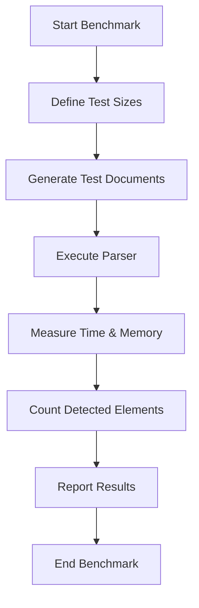
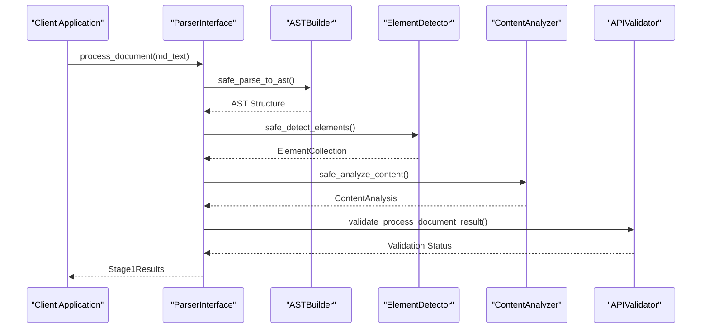
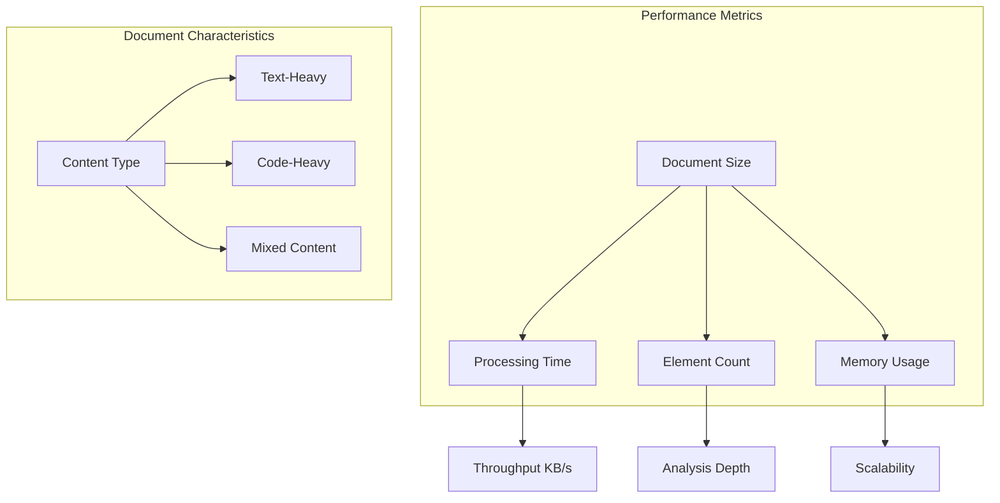
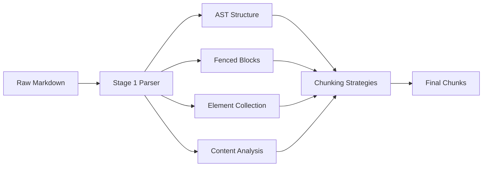
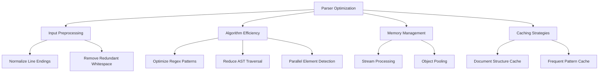

# Parser Performance Benchmarking

<cite>
**Referenced Files in This Document**   
- [benchmark_parser.py](file://benchmarks/benchmark_parser.py)
- [utils.py](file://benchmarks/utils.py)
- [core.py](file://markdown_chunker/parser/core.py)
- [types.py](file://markdown_chunker/parser/types.py)
- [analyzer.py](file://markdown_chunker/parser/analyzer.py)
- [elements.py](file://markdown_chunker/parser/elements.py)
</cite>

## Table of Contents
1. [Introduction](#introduction)
2. [Benchmarking Methodology](#benchmarking-methodology)
3. [Parser Implementation Overview](#parser-implementation-overview)
4. [Performance Analysis](#performance-analysis)
5. [Impact on Chunking Pipeline](#impact-on-chunking-pipeline)
6. [Optimization Recommendations](#optimization-recommendations)
7. [Conclusion](#conclusion)

## Introduction
The parser performance benchmarking system evaluates the efficiency and effectiveness of the Stage 1 parser, which serves as the foundation for the entire markdown chunking pipeline. This document details the implementation of the benchmarking framework in `benchmark_parser.py`, which measures the parser's ability to analyze content and detect structural elements across documents of varying sizes and complexities. The Stage 1 parser plays a critical role in the overall system, as its performance directly impacts the throughput and quality of the subsequent chunking stages.

**Section sources**
- [benchmark_parser.py](file://benchmarks/benchmark_parser.py#L1-L62)

## Benchmarking Methodology

The benchmarking framework systematically evaluates parser performance by measuring processing time and element detection accuracy across different document sizes. The implementation in `benchmark_parser.py` follows a structured approach to provide comprehensive performance insights.

**Diagram sources**
- [benchmark_parser.py](file://benchmarks/benchmark_parser.py#L17-L43)

The benchmarking process uses the `measure_all` function from `utils.py` to capture both execution time and memory usage during parser operations. This comprehensive measurement approach provides a complete picture of parser performance characteristics. The framework generates test documents of 1KB, 10KB, 50KB, and 100KB using the `generate_markdown_document` function, which creates mixed-content documents with headers, code blocks, lists, and tables to simulate real-world scenarios.

**Section sources**
- [benchmark_parser.py](file://benchmarks/benchmark_parser.py#L17-L43)
- [utils.py](file://benchmarks/utils.py#L51-L76)

## Parser Implementation Overview

The Stage 1 parser, accessed through the `ParserInterface`, performs comprehensive content analysis and element detection as the first stage of document processing. The parser implementation follows a modular architecture that integrates multiple components to extract structural information from markdown documents.

**Diagram sources**
- [core.py](file://markdown_chunker/parser/core.py#L417-L509)
- [types.py](file://markdown_chunker/parser/types.py#L888-L930)

The parser processes documents through several key stages: AST construction, fenced block extraction, element detection, and content analysis. Each stage contributes to the final `Stage1Results` object, which contains the structured data needed for subsequent chunking operations. The parser employs defensive programming with fallback mechanisms to ensure robustness when processing malformed or complex documents.

**Section sources**
- [core.py](file://markdown_chunker/parser/core.py#L417-L509)
- [types.py](file://markdown_chunker/parser/types.py#L888-L930)

## Performance Analysis

The benchmark results reveal important performance characteristics of the parser across different document sizes. The system measures both processing time and the number of detected elements, providing insights into the parser's efficiency and thoroughness.

**Diagram sources**
- [benchmark_parser.py](file://benchmarks/benchmark_parser.py#L17-L43)
- [utils.py](file://benchmarks/utils.py#L245-L258)

Based on the benchmark implementation, the parser demonstrates predictable performance scaling with document size. Processing time increases with document size, but the relationship is not strictly linear due to the complexity of element detection algorithms. The number of detected elements grows proportionally with document size, indicating consistent detection accuracy across different scales. Memory usage is carefully monitored through the `tracemalloc` integration, ensuring that the parser maintains reasonable memory footprint even for larger documents.

**Section sources**
- [benchmark_parser.py](file://benchmarks/benchmark_parser.py#L17-L43)
- [utils.py](file://benchmarks/utils.py#L30-L48)

## Impact on Chunking Pipeline

The Stage 1 parser serves as the critical first stage in the chunking pipeline, and its performance directly affects the overall system efficiency and output quality. As the initial processing step, the parser's output forms the foundation for all subsequent operations.

**Diagram sources**
- [core.py](file://markdown_chunker/parser/core.py#L417-L509)
- [structural_strategy.py](file://markdown_chunker/chunker/strategies/structural_strategy.py#L245-L275)

Parser efficiency directly impacts the throughput of the entire chunking system. Faster parsing enables higher document processing rates, which is particularly important for applications handling large volumes of markdown content. Additionally, the accuracy of element detection during parsing affects the quality of downstream chunking, as strategies rely on detected headers, lists, and other structural elements to create meaningful document segments. Inaccurate element detection can lead to poorly formed chunks that disrupt the logical flow of content.

**Section sources**
- [core.py](file://markdown_chunker/parser/core.py#L417-L509)
- [structural_strategy.py](file://markdown_chunker/chunker/strategies/structural_strategy.py#L245-L275)

## Optimization Recommendations

To improve parser performance on large or complex documents, several optimization strategies can be implemented based on the current architecture and benchmarking framework.

**Diagram sources**
- [analyzer.py](file://markdown_chunker/parser/analyzer.py)
- [elements.py](file://markdown_chunker/parser/elements.py)

Key optimization opportunities include:
- Implementing incremental parsing for very large documents to reduce memory pressure
- Optimizing regular expressions used in element detection to minimize processing overhead
- Adding caching mechanisms for frequently processed document patterns
- Utilizing more efficient data structures for AST representation and traversal
- Implementing early termination conditions for content analysis when sufficient information has been gathered

Additionally, preprocessing documents to normalize formatting can reduce parsing complexity and improve performance consistency across different input sources.

**Section sources**
- [analyzer.py](file://markdown_chunker/parser/analyzer.py)
- [elements.py](file://markdown_chunker/parser/elements.py)

## Conclusion
The parser performance benchmarking system provides valuable insights into the efficiency and effectiveness of the Stage 1 parser. By measuring processing time, element detection accuracy, and resource usage across different document sizes, the benchmarking framework enables data-driven optimization of the parsing stage. The parser's performance is critical to the overall chunking pipeline, as it directly impacts both throughput and output quality. Continued monitoring and optimization of parser performance will ensure the system can efficiently handle diverse document types and scales while maintaining high-quality chunking results.