# Performance Benchmarks

<cite>
**Referenced Files in This Document**
- [tests/performance/results_manager.py](file://tests/performance/results_manager.py)
- [tests/performance/run_all_benchmarks.py](file://tests/performance/run_all_benchmarks.py)
- [tests/performance/utils.py](file://tests/performance/utils.py)
- [tests/performance/test_benchmark_size.py](file://tests/performance/test_benchmark_size.py)
- [tests/performance/test_benchmark_content_type.py](file://tests/performance/test_benchmark_content_type.py)
- [tests/performance/test_benchmark_strategy.py](file://tests/performance/test_benchmark_strategy.py)
- [tests/performance/test_benchmark_config.py](file://tests/performance/test_benchmark_config.py)
- [tests/performance/test_benchmark_scalability.py](file://tests/performance/test_benchmark_scalability.py)
- [tests/performance/corpus_selector.py](file://tests/performance/corpus_selector.py)
- [docs/guides/performance.md](file://docs/guides/performance.md)
</cite>

## Update Summary
**Changes Made**
- Updated to reflect new comprehensive benchmarking suite in tests/performance/
- Added documentation for scalability, configuration impact, and content type performance testing
- Integrated results management via results_manager.py
- Updated architectural diagrams to reflect new benchmark categories
- Enhanced performance measurement infrastructure details

## Table of Contents
1. [Introduction](#introduction)
2. [System Architecture](#system-architecture)
3. [Benchmark Suite Components](#benchmark-suite-components)
4. [Performance Measurement Infrastructure](#performance-measurement-infrastructure)
5. [Content-Type Benchmarking](#content-type-benchmarking)
6. [Configuration Impact Testing](#configuration-impact-testing)
7. [Scalability Analysis](#scalability-analysis)
8. [Utility Functions](#utility-functions)
9. [Results Management](#results-management)
10. [Best Practices](#best-practices)

## Introduction

The performance benchmarking system is a comprehensive suite designed to measure and optimize the chunking performance of the Markdown Chunker across different document sizes, content types, configurations, and processing strategies. This system provides quantitative metrics for throughput, memory usage, processing time, and strategy effectiveness, enabling developers to identify performance bottlenecks and optimize chunking operations for RAG (Retrieval-Augmented Generation) systems.

The benchmarking infrastructure consists of multiple specialized benchmark suites that evaluate different aspects of the chunking pipeline: document size performance, content-type-specific benchmarks, parser efficiency, strategy performance, configuration impact, and scalability characteristics. All measurements are captured with precision timing, memory profiling, and result serialization for historical comparison and regression detection.

## System Architecture

The performance benchmarking system follows a modular architecture with clear separation of concerns:

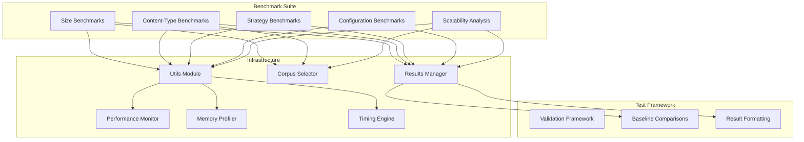

**Diagram sources**
- [tests/performance/run_all_benchmarks.py](file://tests/performance/run_all_benchmarks.py#L17-L76)
- [tests/performance/results_manager.py](file://tests/performance/results_manager.py#L15-L331)

**Section sources**
- [tests/performance/run_all_benchmarks.py](file://tests/performance/run_all_benchmarks.py#L17-L76)
- [tests/performance/results_manager.py](file://tests/performance/results_manager.py#L15-L331)

## Benchmark Suite Components

### Size-Based Benchmark

The size-based benchmark measures performance across different document size categories:

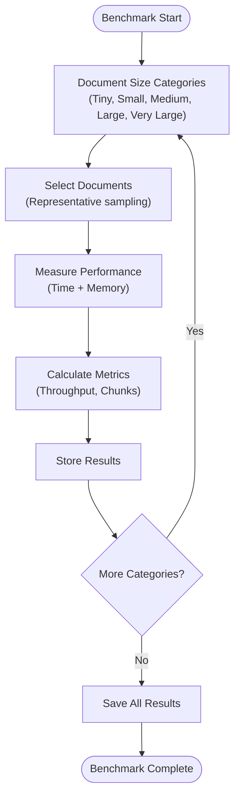

**Diagram sources**
- [tests/performance/test_benchmark_size.py](file://tests/performance/test_benchmark_size.py#L39-L195)

### Content-Type Benchmark

The content-type benchmark evaluates performance across different document categories:

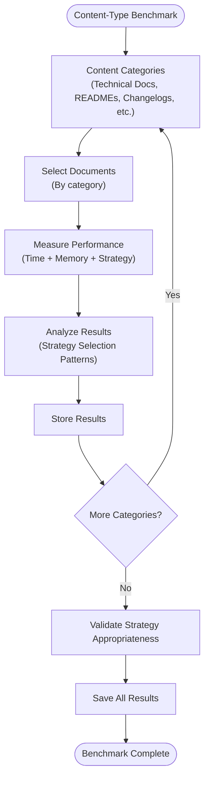

**Diagram sources**
- [tests/performance/test_benchmark_content_type.py](file://tests/performance/test_benchmark_content_type.py#L39-L192)

### Strategy Benchmark

Individual strategy performance evaluation:

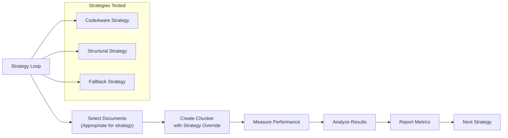

**Diagram sources**
- [tests/performance/test_benchmark_strategy.py](file://tests/performance/test_benchmark_strategy.py#L34-L246)

### Configuration Benchmark

Configuration impact testing:

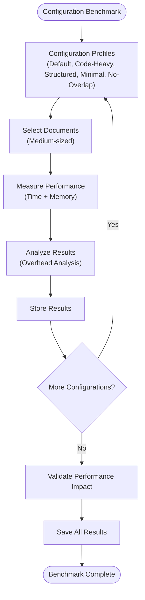

**Diagram sources**
- [tests/performance/test_benchmark_config.py](file://tests/performance/test_benchmark_config.py#L34-L225)

### Scalability Analysis

Scalability analysis with regression modeling:

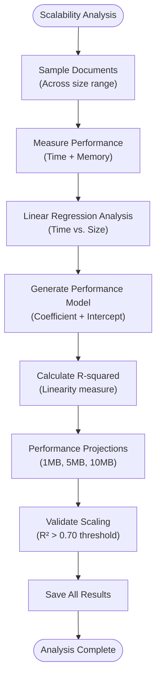

**Diagram sources**
- [tests/performance/test_benchmark_scalability.py](file://tests/performance/test_benchmark_scalability.py#L39-L267)

**Section sources**
- [tests/performance/test_benchmark_size.py](file://tests/performance/test_benchmark_size.py#L39-L195)
- [tests/performance/test_benchmark_content_type.py](file://tests/performance/test_benchmark_content_type.py#L39-L192)
- [tests/performance/test_benchmark_strategy.py](file://tests/performance/test_benchmark_strategy.py#L34-L246)
- [tests/performance/test_benchmark_config.py](file://tests/performance/test_benchmark_config.py#L34-L225)
- [tests/performance/test_benchmark_scalability.py](file://tests/performance/test_benchmark_scalability.py#L39-L267)

## Performance Measurement Infrastructure

The benchmarking system relies on sophisticated measurement utilities that capture comprehensive performance metrics:

### Timing Measurement

The timing infrastructure provides precise execution time measurement with multiple measurement modes:

| Measurement Mode | Purpose | Implementation |
|------------------|---------|----------------|
| `measure_time` | Single function timing | `time.perf_counter()` wrapper |
| `measure_memory` | Peak memory usage | `tracemalloc` integration |
| `measure_all` | Combined timing and memory | Dual measurement system |
| `run_benchmark` | Statistical benchmarking | Multiple runs with warm-up |

### Memory Profiling

Memory measurement utilizes Python's `tracemalloc` module for accurate peak memory tracking:

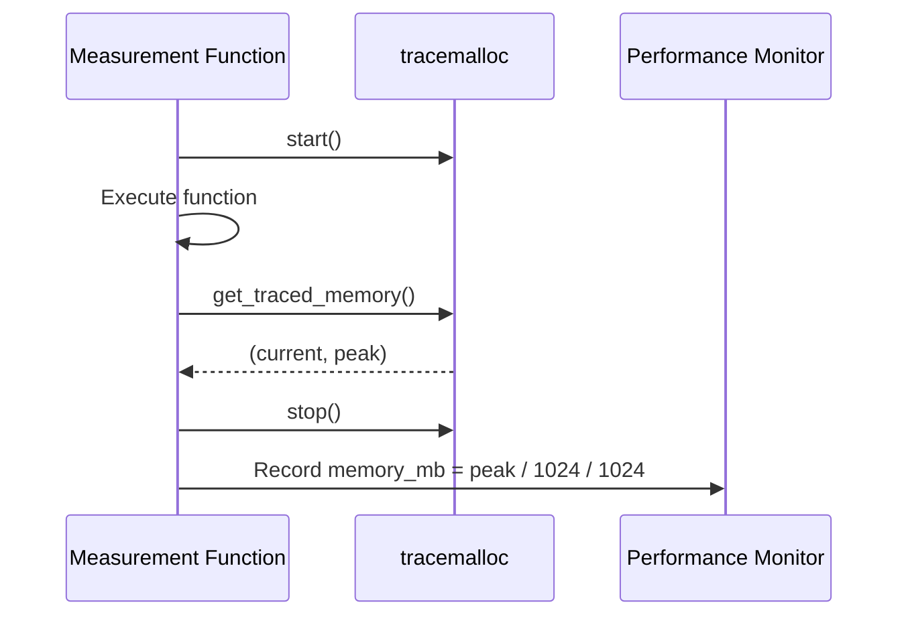

**Diagram sources**
- [tests/performance/utils.py](file://tests/performance/utils.py#L31-L49)

### Throughput Calculation

Throughput metrics are calculated using the formula: `(size_bytes / 1024) / time_seconds` for KB/s measurement.

**Section sources**
- [tests/performance/utils.py](file://tests/performance/utils.py#L132-L152)

## Content-Type Benchmarking

The system evaluates performance across multiple distinct content types, each requiring specialized handling:

### Content Type Categories

| Content Type | Characteristics | Benchmark Focus |
|--------------|-----------------|-----------------|
| **Technical Documentation** | Mix of code and text with headers | Strategy selection, code block handling |
| **GitHub READMEs** | Well-structured with code examples | Structural preservation, header hierarchy |
| **Changelogs** | List-heavy with regular structure | List structure preservation, indentation handling |
| **Engineering Blogs** | Narrative with code examples | Content type detection, mixed content handling |
| **Personal Notes** | Simple text with minimal structure | Basic chunking efficiency |
| **Debug Logs** | Code-heavy with technical content | Code block integrity, language detection |
| **Mixed Content** | Combination of all element types | Strategy selection, content type detection |

### Document Selection Strategy

Each content type uses representative documents from the corpus:

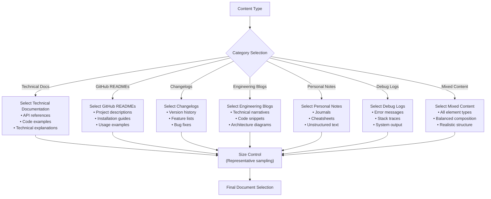

**Diagram sources**
- [tests/performance/corpus_selector.py](file://tests/performance/corpus_selector.py)
- [tests/performance/test_benchmark_content_type.py](file://tests/performance/test_benchmark_content_type.py#L39-L192)

**Section sources**
- [tests/performance/test_benchmark_content_type.py](file://tests/performance/test_benchmark_content_type.py#L39-L192)

## Configuration Impact Testing

The benchmarking suite evaluates how different configurations affect performance:

### Configuration Profiles

| Profile | max_chunk_size | overlap_size | Use Case |
|---------|----------------|--------------|-----------|
| **Default** | 4096 | 200 | General purpose |
| **Code Heavy** | 8192 | 100 | Technical documentation |
| **Structured** | 4096 | 200 | User guides |
| **Minimal** | 1024 | 50 | Small chunks |
| **No Overlap** | 4096 | 0 | No context needed |

### Overlap Processing Impact

The v2 architecture uses metadata-only overlap, resulting in minimal overhead:

| Overlap Size | Expected Overhead | Notes |
|--------------|-------------------|-------|
| 0 (disabled) | Baseline | No overlap processing |
| 50 | < 2% | Minimal metadata |
| 100 | < 5% | Standard setting |
| 200 | < 10% | Default setting |
| 400 | < 15% | Large context |

**Section sources**
- [tests/performance/test_benchmark_config.py](file://tests/performance/test_benchmark_config.py#L34-L225)

## Scalability Analysis

The system performs regression analysis to validate scaling characteristics:

### Linear Regression Model

The chunker exhibits linear scaling with document size:

```
Processing Time = coefficient × Document Size (KB) + baseline overhead
```

- **Coefficient**: ~0.5-1.0 ms per KB (see scalability benchmarks)
- **Baseline Overhead**: ~5-10 ms (parsing, analysis, strategy selection)
- **R-squared**: > 0.70 (acceptable linear trend)

### Performance Projections

Based on linear scaling model:

| Document Size | Projected Time | Projected Memory | Recommendation |
|---------------|----------------|------------------|----------------|
| 1 MB | ~500-800 ms | ~150-200 MB | ✓ Suitable |
| 5 MB | ~2.5-4 s | ~750 MB-1 GB | ✓ Suitable |
| 10 MB | ~5-8 s | ~1.5-2 GB | ⚠ Memory intensive |
| 50 MB | ~25-40 s | ~7-10 GB | ⚠ Consider streaming |
| 100 MB | ~50-80 s | ~14-20 GB | ⚠ Not recommended |

**Section sources**
- [tests/performance/test_benchmark_scalability.py](file://tests/performance/test_benchmark_scalability.py#L39-L267)

## Utility Functions

The utility module provides essential functions for benchmarking operations:

### Core Measurement Functions

| Function | Purpose | Parameters | Returns |
|----------|---------|------------|---------|
| `measure_time` | Time function execution | `func`, `*args`, `**kwargs` | `(result, time_in_seconds)` |
| `measure_memory` | Track peak memory usage | `func`, `*args`, `**kwargs` | `(result, peak_memory_mb)` |
| `measure_all` | Combined timing and memory | `func`, `*args`, `**kwargs` | `(result, time, memory_mb)` |
| `run_benchmark` | Statistical benchmarking | `func`, `args`, `kwargs`, `warmup_runs`, `measurement_runs` | `{"time": ..., "memory": ..., "result": ...}` |
| `calculate_throughput` | Calculate throughput metrics | `size_bytes`, `time_seconds` | `{"kb_per_sec": ..., "mb_per_sec": ...}` |
| `aggregate_results` | Aggregate multiple benchmark results | `results` | Aggregated statistics |

### Benchmark Execution Flow

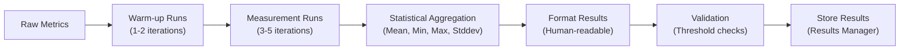

**Diagram sources**
- [tests/performance/utils.py](file://tests/performance/utils.py#L77-L185)

**Section sources**
- [tests/performance/utils.py](file://tests/performance/utils.py#L13-L185)

## Results Management

The ResultsManager class handles collection, storage, and reporting of benchmark results:

### Results Manager Architecture

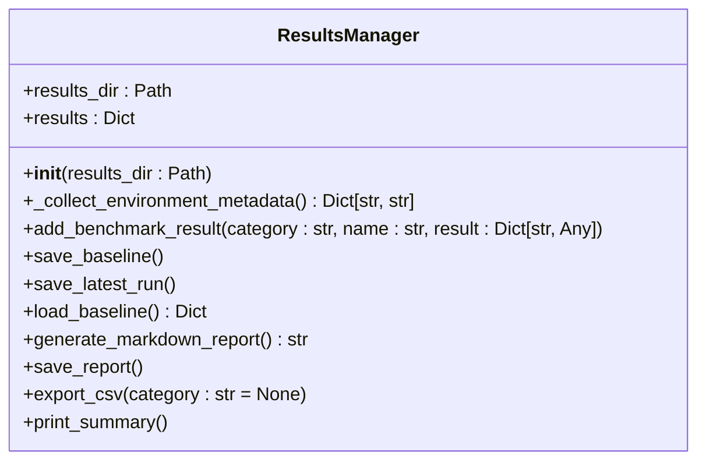

**Diagram sources**
- [tests/performance/results_manager.py](file://tests/performance/results_manager.py#L15-L331)

### Result Storage Format

Benchmark results are stored in a structured JSON format that captures comprehensive metrics:

```json
{
  "metadata": {
    "timestamp": "2024-12-03T10:30:00.000Z",
    "python_version": "3.11.5",
    "platform": "Linux-5.15.0-86-generic-x86_64-with-glibc2.35",
    "processor": "x86_64",
    "machine": "x86_64"
  },
  "benchmarks": {
    "size": {
      "small": {
        "time": {
          "mean": 0.0008,
          "min": 0.0007,
          "max": 0.0009,
          "stddev": 0.0001
        },
        "memory": {
          "mean": 1.2,
          "min": 1.1,
          "max": 1.3
        },
        "throughput": {
          "kb_per_sec": 1.3
        },
        "document_count": 45
      }
    },
    "content_type": {
      "technical_docs": {
        "time": {
          "mean": 0.0015,
          "min": 0.0012,
          "max": 0.0021
        },
        "strategy": "code_aware",
        "output": {
          "avg_chunk_count": 8.5,
          "avg_chunk_size": 1200
        }
      }
    }
  }
}
```

### Report Generation

The ResultsManager generates human-readable reports in multiple formats:

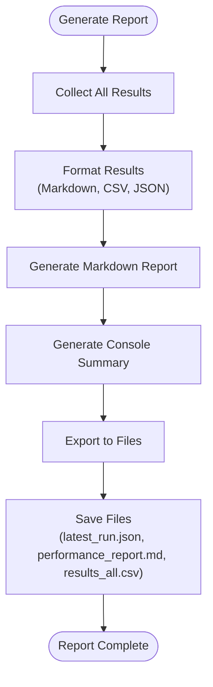

**Section sources**
- [tests/performance/results_manager.py](file://tests/performance/results_manager.py#L15-L331)

## Best Practices

### Benchmark Design Principles

1. **Representative Test Data**: Use realistic document structures that reflect production usage from the corpus
2. **Comprehensive Coverage**: Test all content types, document sizes, configurations, and strategies
3. **Statistical Significance**: Run multiple iterations with warm-up for reliable metrics
4. **Baseline Establishment**: Maintain historical performance baselines for regression detection
5. **Incremental Testing**: Test individual components alongside end-to-end scenarios

### Performance Optimization Guidelines

| Optimization Area | Recommendation | Measurement Approach |
|------------------|----------------|---------------------|
| **Memory Usage** | Monitor peak memory allocation | Use `tracemalloc` for memory profiling |
| **Processing Time** | Track function-level timing | Implement micro-benchmarking |
| **Strategy Selection** | Test strategy effectiveness | Compare strategy performance across content types |
| **Configuration Impact** | Evaluate configuration profiles | Test different chunk sizes and overlap settings |
| **Scalability** | Validate linear scaling | Perform regression analysis on size vs. time |

### Testing Methodology

1. **Warm-up Runs**: Execute benchmark functions before measurement to eliminate startup overhead
2. **Multiple Iterations**: Run each benchmark multiple times to account for system variability
3. **Environment Control**: Ensure consistent system conditions during testing
4. **Resource Monitoring**: Track CPU, memory, and I/O usage during benchmarks
5. **Regression Detection**: Compare current results against established baselines

### Performance Monitoring Integration

The system integrates with the comprehensive benchmark suite:

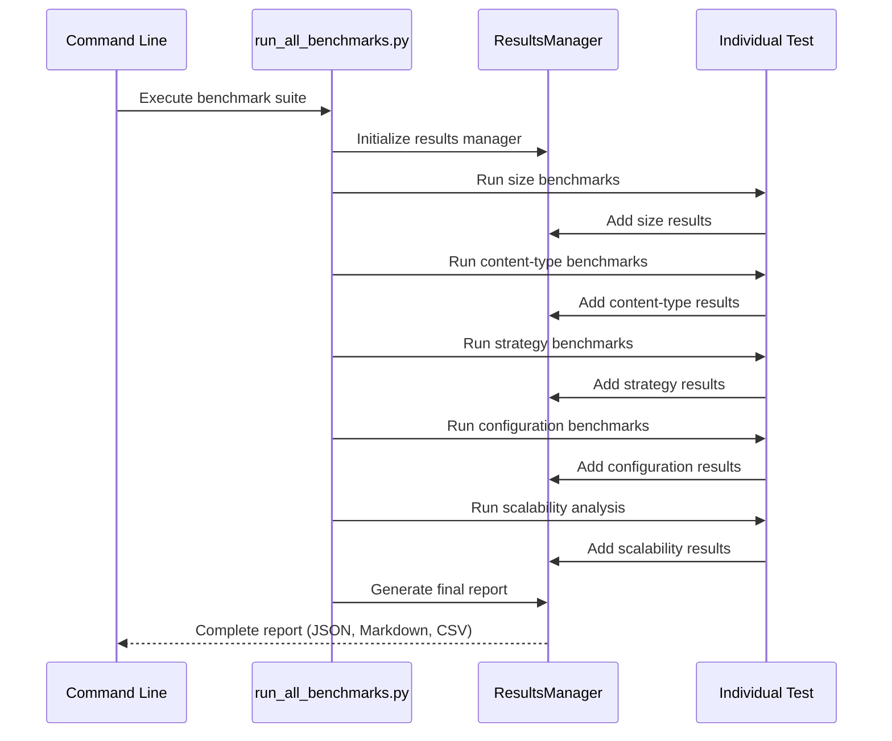

**Diagram sources**
- [tests/performance/run_all_benchmarks.py](file://tests/performance/run_all_benchmarks.py#L17-L76)
- [tests/performance/results_manager.py](file://tests/performance/results_manager.py#L15-L331)

**Section sources**
- [tests/performance/run_all_benchmarks.py](file://tests/performance/run_all_benchmarks.py#L17-L76)
- [docs/guides/performance.md](file://docs/guides/performance.md)