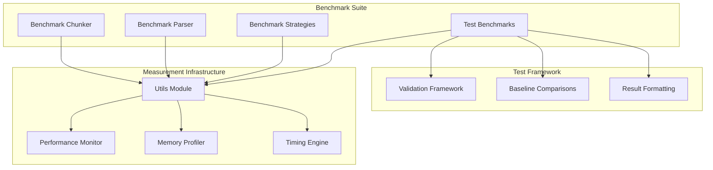
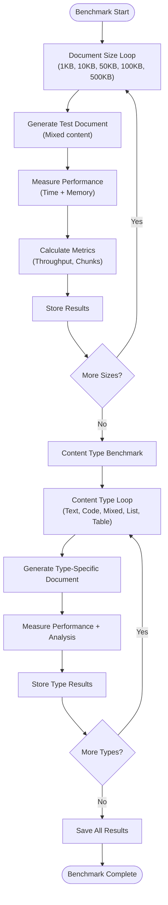
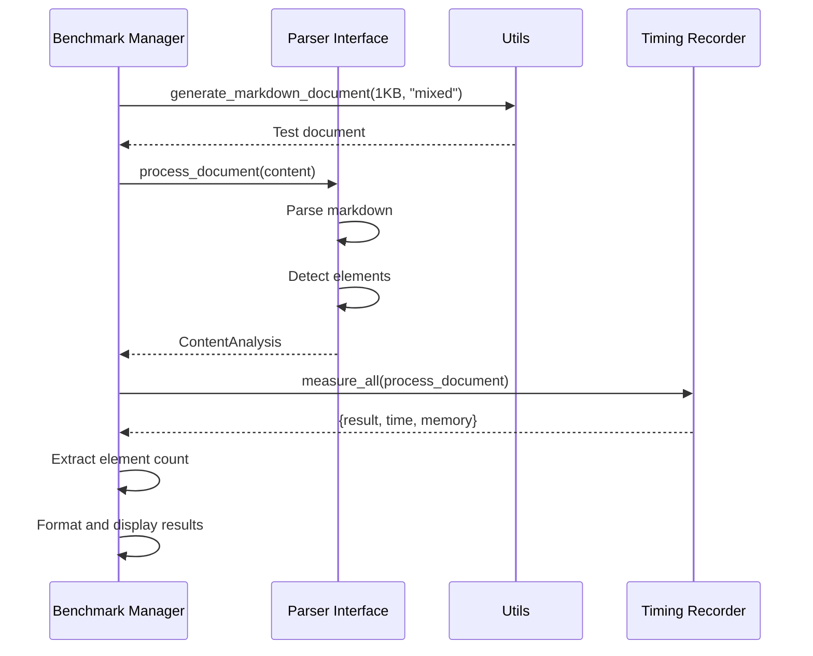
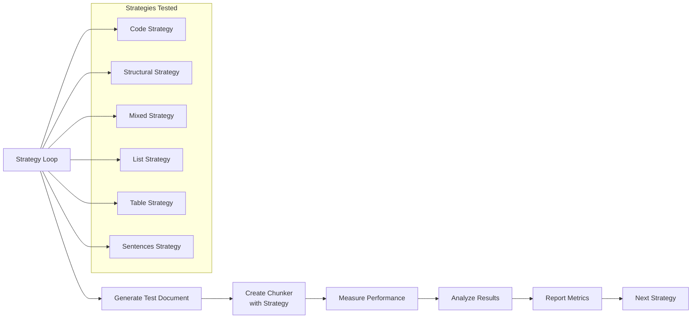
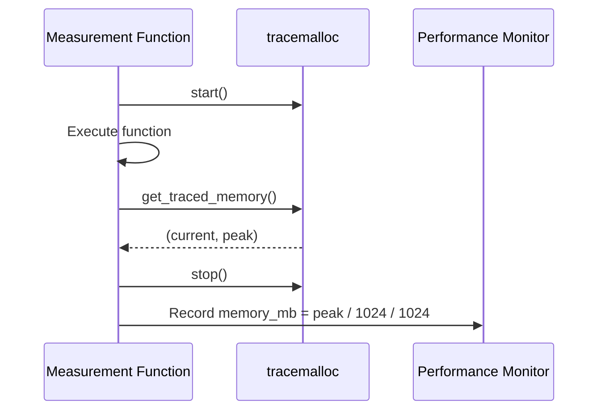
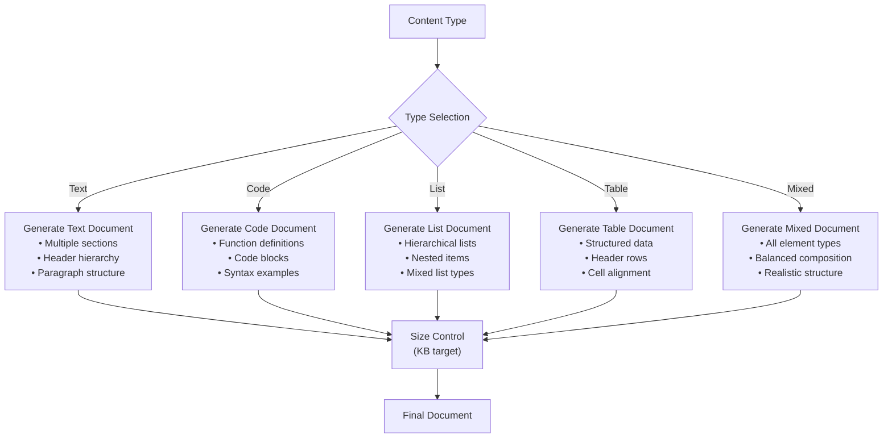
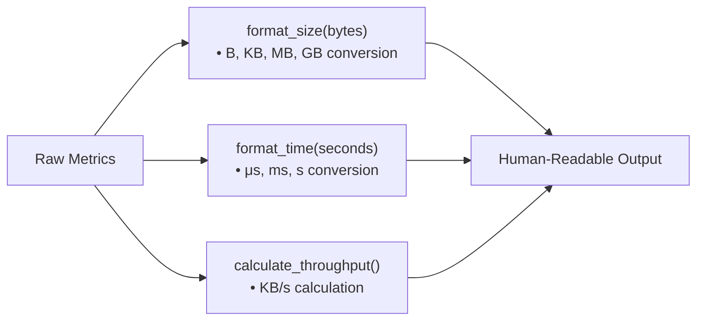
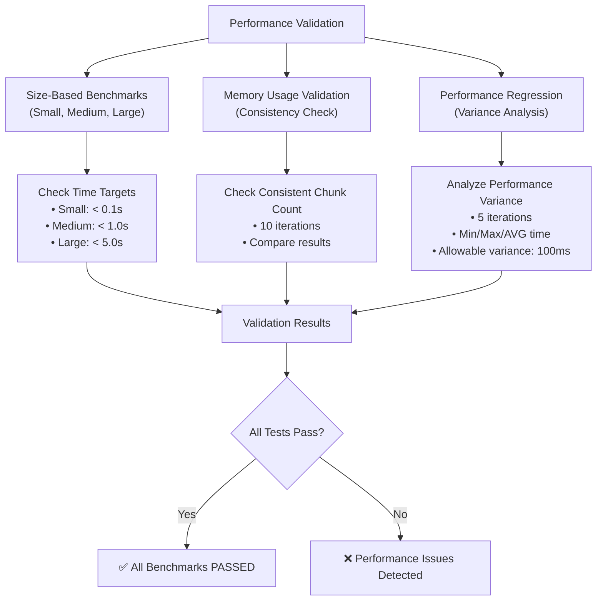
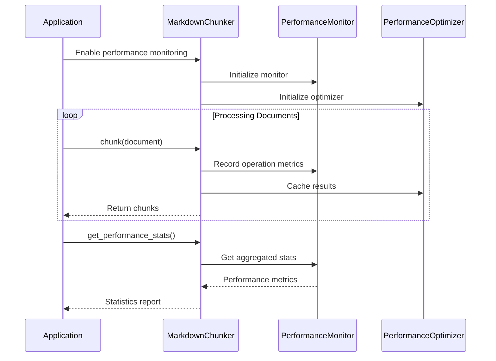

# Performance Benchmarks

<cite>
**Referenced Files in This Document**
- [benchmarks/benchmark_chunker.py](file://benchmarks/benchmark_chunker.py)
- [benchmarks/utils.py](file://benchmarks/utils.py)
- [benchmarks/benchmark_parser.py](file://benchmarks/benchmark_parser.py)
- [benchmarks/benchmark_strategies.py](file://benchmarks/benchmark_strategies.py)
- [tests/performance/test_benchmarks.py](file://tests/performance/test_benchmarks.py)
- [baseline.json](file://baseline.json)
- [markdown_chunker/__init__.py](file://markdown_chunker/__init__.py)
- [markdown_chunker_legacy/chunker/performance.py](file://markdown_chunker_legacy/chunker/performance.py)
</cite>

## Table of Contents
1. [Introduction](#introduction)
2. [System Architecture](#system-architecture)
3. [Benchmark Suite Components](#benchmark-suite-components)
4. [Performance Measurement Infrastructure](#performance-measurement-infrastructure)
5. [Content-Type Benchmarking](#content-type-benchmarking)
6. [Utility Functions](#utility-functions)
7. [Validation Framework](#validation-framework)
8. [Historical Comparison System](#historical-comparison-system)
9. [Best Practices](#best-practices)
10. [Troubleshooting Guide](#troubleshooting-guide)

## Introduction

The performance benchmarking system is a comprehensive suite designed to measure and optimize the chunking performance of the Markdown Chunker across different document sizes, content types, and processing strategies. This system provides quantitative metrics for throughput, memory usage, processing time, and strategy effectiveness, enabling developers to identify performance bottlenecks and optimize chunking operations for RAG (Retrieval-Augmented Generation) systems.

The benchmarking infrastructure consists of multiple specialized benchmark suites that evaluate different aspects of the chunking pipeline: document size performance, content-type-specific benchmarks, parser efficiency, and individual strategy performance. All measurements are captured with precision timing, memory profiling, and result serialization for historical comparison.

## System Architecture

The performance benchmarking system follows a modular architecture with clear separation of concerns:



**Diagram sources**
- [benchmarks/benchmark_chunker.py](file://benchmarks/benchmark_chunker.py#L1-L195)
- [benchmarks/utils.py](file://benchmarks/utils.py#L1-L259)
- [tests/performance/test_benchmarks.py](file://tests/performance/test_benchmarks.py#L1-L319)

**Section sources**
- [benchmarks/benchmark_chunker.py](file://benchmarks/benchmark_chunker.py#L1-L195)
- [benchmarks/utils.py](file://benchmarks/utils.py#L1-L259)

## Benchmark Suite Components

### Main Chunker Benchmark

The primary benchmarking component focuses on measuring end-to-end chunking performance across different document characteristics:



**Diagram sources**
- [benchmarks/benchmark_chunker.py](file://benchmarks/benchmark_chunker.py#L27-L147)

### Parser Benchmark

Specialized benchmark for measuring Stage 1 parser performance:



**Diagram sources**
- [benchmarks/benchmark_parser.py](file://benchmarks/benchmark_parser.py#L17-L43)

### Strategy Benchmark

Individual strategy performance evaluation:



**Diagram sources**
- [benchmarks/benchmark_strategies.py](file://benchmarks/benchmark_strategies.py#L19-L96)

**Section sources**
- [benchmarks/benchmark_chunker.py](file://benchmarks/benchmark_chunker.py#L27-L147)
- [benchmarks/benchmark_parser.py](file://benchmarks/benchmark_parser.py#L17-L43)
- [benchmarks/benchmark_strategies.py](file://benchmarks/benchmark_strategies.py#L19-L96)

## Performance Measurement Infrastructure

The benchmarking system relies on sophisticated measurement utilities that capture comprehensive performance metrics:

### Timing Measurement

The timing infrastructure provides precise execution time measurement with multiple measurement modes:

| Measurement Mode | Purpose | Implementation |
|------------------|---------|----------------|
| `measure_time` | Single function timing | `time.time()` wrapper |
| `measure_memory` | Peak memory usage | `tracemalloc` integration |
| `measure_all` | Combined timing and memory | Dual measurement system |

### Memory Profiling

Memory measurement utilizes Python's `tracemalloc` module for accurate peak memory tracking:



**Diagram sources**
- [benchmarks/utils.py](file://benchmarks/utils.py#L30-L49)

### Throughput Calculation

Throughput metrics are calculated using the formula: `(size_bytes / 1024) / time_seconds` for KB/s measurement.

**Section sources**
- [benchmarks/utils.py](file://benchmarks/utils.py#L12-L76)

## Content-Type Benchmarking

The system evaluates performance across five distinct content types, each requiring specialized handling:

### Content Type Categories

| Content Type | Characteristics | Benchmark Focus |
|--------------|-----------------|-----------------|
| **Text** | Pure textual content with headers and paragraphs | Structural preservation, sentence boundary detection |
| **Code** | Code blocks with syntax highlighting | Code block integrity, language detection |
| **Mixed** | Combination of text, code, lists, and tables | Strategy selection, content type detection |
| **List** | Hierarchical lists with nested items | List structure preservation, indentation handling |
| **Table** | Tabular data with headers and cells | Table integrity, cell boundary detection |

### Document Generation Strategy

Each content type generates documents with characteristic patterns:



**Diagram sources**
- [benchmarks/utils.py](file://benchmarks/utils.py#L79-L224)

**Section sources**
- [benchmarks/utils.py](file://benchmarks/utils.py#L79-L224)

## Utility Functions

The utility module provides essential functions for benchmarking operations:

### Core Measurement Functions

| Function | Purpose | Parameters | Returns |
|----------|---------|------------|---------|
| `measure_time` | Time function execution | `func`, `*args`, `**kwargs` | `(result, time_in_seconds)` |
| `measure_memory` | Track peak memory usage | `func`, `*args`, `**kwargs` | `(result, peak_memory_mb)` |
| `measure_all` | Combined timing and memory | `func`, `*args`, `**kwargs` | `{"result": ..., "time": ..., "memory_mb": ...}` |

### Formatting Utilities

The system provides human-readable formatting for performance metrics:



**Diagram sources**
- [benchmarks/utils.py](file://benchmarks/utils.py#L226-L259)

### Document Generation Functions

Specialized generators for each content type:

- `_generate_text_document()`: Creates text-heavy documents with headers and paragraphs
- `_generate_code_document()`: Generates code-heavy documents with function definitions
- `_generate_list_document()`: Produces list-heavy documents with hierarchical structure
- `_generate_table_document()`: Creates table-heavy documents with structured data
- `_generate_mixed_document()`: Combines all element types for realistic testing

**Section sources**
- [benchmarks/utils.py](file://benchmarks/utils.py#L12-L259)

## Validation Framework

The validation framework ensures benchmark reliability and provides regression testing capabilities:

### Performance Validation Tests

The validation system includes comprehensive performance checks:



**Diagram sources**
- [tests/performance/test_benchmarks.py](file://tests/performance/test_benchmarks.py#L268-L319)

### Baseline Comparison System

The system maintains historical performance baselines for regression detection:

| Baseline Component | Purpose | Storage Format |
|-------------------|---------|----------------|
| **Performance Baselines** | Historical timing data | JSON with timestamps |
| **Strategy Performance** | Individual strategy metrics | Per-strategy timing data |
| **Content Type Results** | Content-specific benchmarks | Per-content-type metrics |
| **Memory Usage Patterns** | Memory consumption trends | Peak memory tracking |

**Section sources**
- [tests/performance/test_benchmarks.py](file://tests/performance/test_benchmarks.py#L1-L319)
- [baseline.json](file://baseline.json#L1-L826)

## Historical Comparison System

The benchmarking system maintains comprehensive historical performance data for trend analysis and regression detection:

### Result Storage Format

Benchmark results are stored in a structured JSON format that captures comprehensive metrics:

```json
{
  "timestamp": "2024-12-03T10:30:00.000Z",
  "version": "1.4.0",
  "by_size": [
    {
      "label": "small",
      "size_kb": 1,
      "actual_size_bytes": 1024,
      "time_seconds": 0.0008,
      "throughput_kbps": 1.3,
      "chunks_count": 6,
      "memory_mb": 1.2
    }
  ],
  "by_content_type": [
    {
      "content_type": "text",
      "time_seconds": 0.0005,
      "strategy_used": "structural",
      "chunks_count": 4,
      "avg_chunk_size": 1200
    }
  ]
}
```

### Trend Analysis Capabilities

The system enables analysis of performance trends over time:

- **Throughput Trends**: Monitor processing speed improvements or regressions
- **Memory Efficiency**: Track memory usage patterns and optimizations
- **Strategy Performance**: Compare strategy effectiveness across versions
- **Content Type Impact**: Analyze how different content types affect performance

**Section sources**
- [benchmarks/benchmark_chunker.py](file://benchmarks/benchmark_chunker.py#L150-L166)

## Best Practices

### Benchmark Design Principles

1. **Representative Test Data**: Use realistic document structures that reflect production usage
2. **Comprehensive Coverage**: Test all content types and document sizes
3. **Statistical Significance**: Run multiple iterations for reliable metrics
4. **Baseline Establishment**: Maintain historical performance baselines
5. **Incremental Testing**: Test individual components alongside end-to-end scenarios

### Performance Optimization Guidelines

| Optimization Area | Recommendation | Measurement Approach |
|------------------|----------------|---------------------|
| **Memory Usage** | Monitor peak memory allocation | Use `tracemalloc` for memory profiling |
| **Processing Time** | Track function-level timing | Implement micro-benchmarking |
| **Strategy Selection** | Test strategy effectiveness | Compare strategy performance across content types |
| **Caching** | Implement intelligent caching | Measure cache hit rates and effectiveness |
| **Streaming** | Optimize for large documents | Test memory usage with large inputs |

### Testing Methodology

1. **Warm-up Runs**: Execute benchmark functions before measurement to eliminate startup overhead
2. **Multiple Iterations**: Run each benchmark multiple times to account for system variability
3. **Environment Control**: Ensure consistent system conditions during testing
4. **Resource Monitoring**: Track CPU, memory, and I/O usage during benchmarks
5. **Regression Detection**: Compare current results against established baselines

### Performance Monitoring Integration

The system integrates with the chunker's built-in performance monitoring:



**Diagram sources**
- [markdown_chunker_legacy/chunker/performance.py](file://markdown_chunker_legacy/chunker/performance.py#L32-L82)

**Section sources**
- [markdown_chunker_legacy/chunker/performance.py](file://markdown_chunker_legacy/chunker/performance.py#L32-L243)

## Troubleshooting Guide

### Common Performance Issues

| Issue | Symptoms | Diagnosis | Solution |
|-------|----------|-----------|----------|
| **High Memory Usage** | Out-of-memory errors, slow processing | Monitor peak memory with `measure_memory` | Optimize chunk size, implement streaming |
| **Slow Processing** | High processing time, poor throughput | Use `measure_time` to identify bottlenecks | Profile code, optimize algorithms |
| **Inconsistent Results** | Variable performance across runs | Run multiple iterations, analyze variance | Check system resources, warm-up runs |
| **Strategy Selection Issues** | Wrong strategy chosen | Enable content analysis with `include_analysis=True` | Review content analysis metrics |

### Debugging Performance Problems

1. **Enable Detailed Logging**: Use the performance monitor to track operation timing
2. **Isolate Components**: Test individual strategies and parser separately
3. **Memory Profiling**: Use `tracemalloc` to identify memory leaks
4. **System Resource Monitoring**: Check CPU, memory, and I/O usage
5. **Baseline Comparison**: Compare current results against historical baselines

### Optimization Strategies

- **Caching**: Implement intelligent caching for repeated documents
- **Lazy Loading**: Load strategies only when needed
- **Memory Management**: Use streaming for large documents
- **Algorithm Optimization**: Profile and optimize critical paths
- **Configuration Tuning**: Adjust chunk sizes and overlap parameters

**Section sources**
- [tests/performance/test_benchmarks.py](file://tests/performance/test_benchmarks.py#L143-L319)