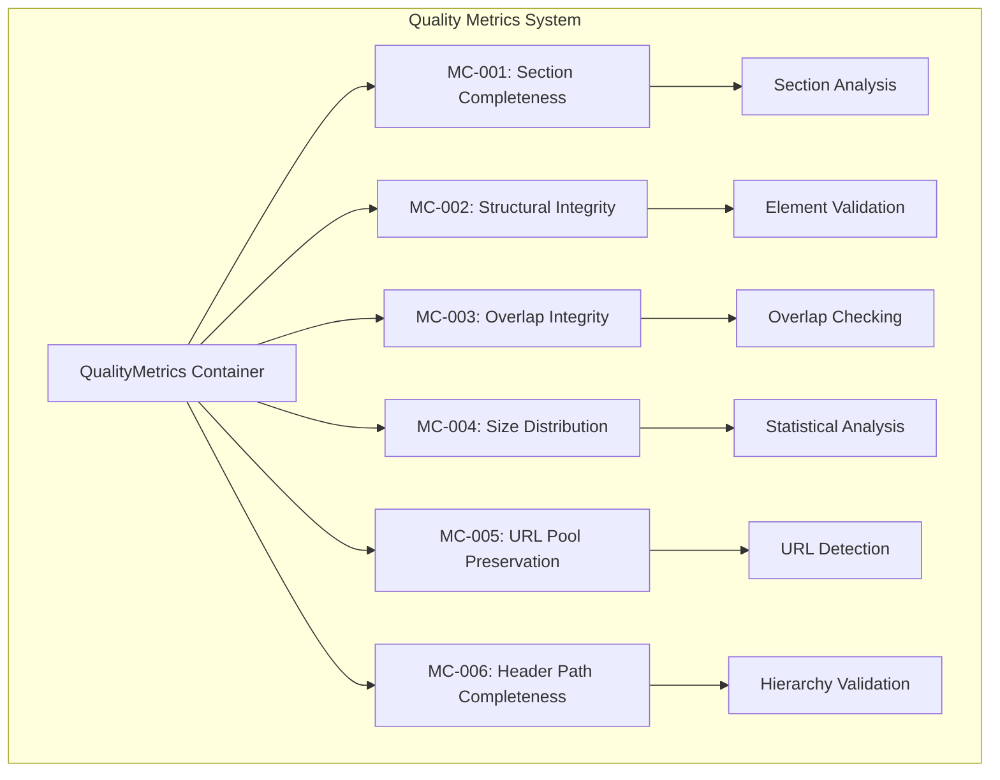
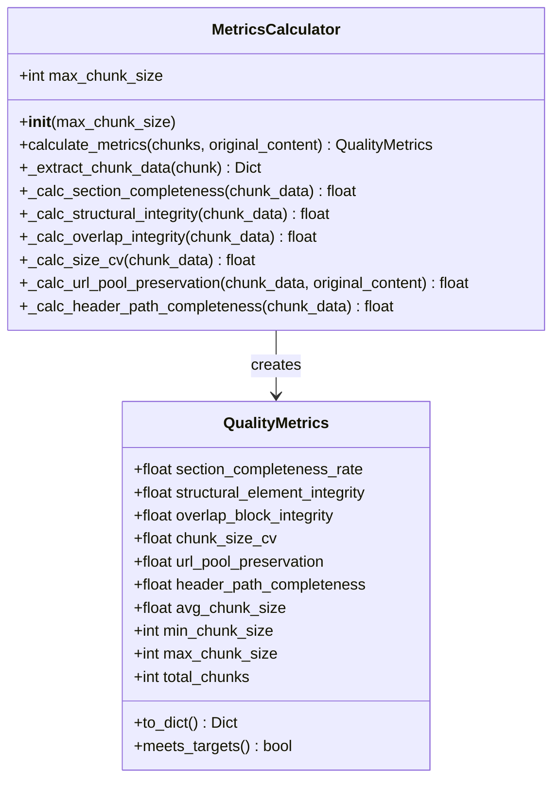
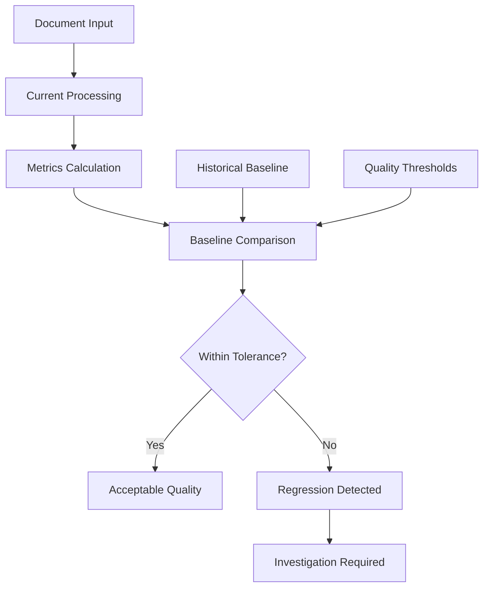
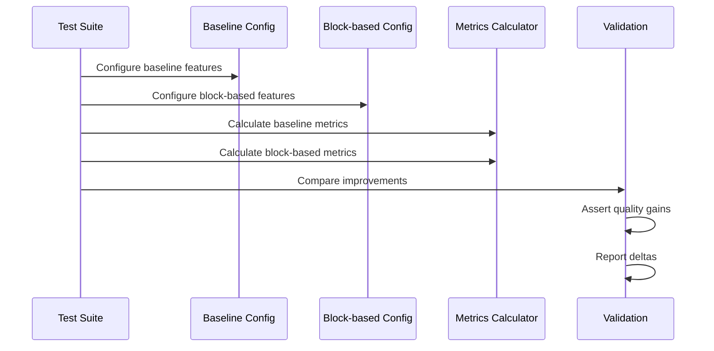
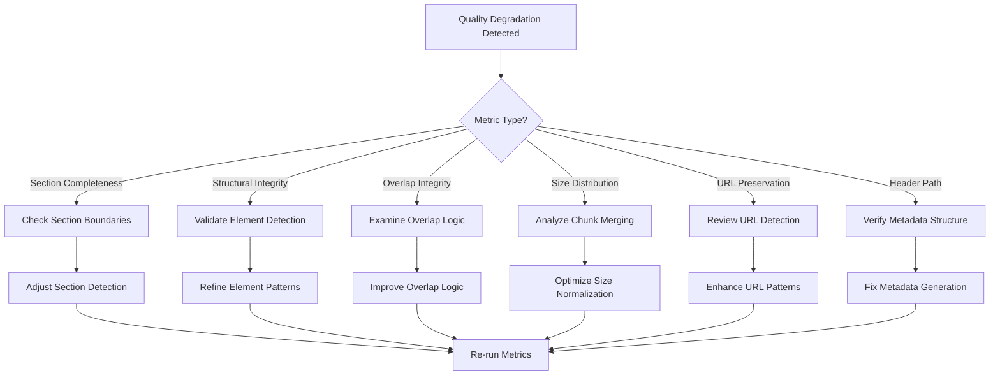

# Quality Metrics

<cite>
**Referenced Files in This Document**
- [tests/quality_metrics.py](file://tests/quality_metrics.py)
- [baseline.json](file://baseline.json)
- [tests/test_quality_improvements.py](file://tests/test_quality_improvements.py)
- [tests/test_baseline_quality.py](file://tests/test_baseline_quality.py)
- [scripts/compare_baseline.py](file://scripts/compare_baseline.py)
- [tests/fixtures/real_documents/career_matrix.md](file://tests/fixtures/real_documents/career_matrix.md)
- [tests/fixtures/real_documents/technical_spec.md](file://tests/fixtures/real_documents/technical_spec.md)
</cite>

## Table of Contents
1. [Introduction](#introduction)
2. [Quality Metrics Overview](#quality-metrics-overview)
3. [Primary Quality Metrics](#primary-quality-metrics)
4. [MetricsCalculator Implementation](#metricscalculator-implementation)
5. [Historical Baselines and Regression Prevention](#historical-baselines-and-regression-prevention)
6. [Quality Improvement Testing](#quality-improvement-testing)
7. [Statistical Methods](#statistical-methods)
8. [Interpreting Metric Results](#interpreting-metric-results)
9. [Troubleshooting Quality Degradation](#troubleshooting-quality-degradation)
10. [Best Practices](#best-practices)

## Introduction

The QualityMetrics system is a comprehensive evaluation framework designed to measure and validate the quality of markdown chunking operations in the Dify Markdown Chunker. This system implements six primary quality metrics (MC-001 through MC-006) that assess different aspects of chunking quality, from structural preservation to size distribution stability. The metrics serve as both validation tools during development and monitoring mechanisms for production deployments.

The system evolved from manual testing approaches to automated, quantitative evaluation, enabling developers to objectively measure improvements and prevent regression in chunking behavior. Each metric targets specific quality characteristics that are crucial for effective RAG (Retrieval-Augmented Generation) systems and document processing workflows.

## Quality Metrics Overview

The QualityMetrics system evaluates chunking quality through six distinct categories, each addressing different aspects of semantic preservation and structural integrity:

**Diagram sources**
- [tests/quality_metrics.py](file://tests/quality_metrics.py#L13-L66)

Each metric operates independently but collectively provides a comprehensive assessment of chunking quality. The system includes additional computed metrics such as average chunk size, minimum/maximum chunk sizes, and total chunk count, which provide context for the primary quality indicators.

**Section sources**
- [tests/quality_metrics.py](file://tests/quality_metrics.py#L13-L66)

## Primary Quality Metrics

### MC-001: Section Completeness Rate

**Metric Description**: Measures the percentage of H2-level sections that remain intact when size permits, specifically when the total size of a section is less than or equal to 120% of the maximum chunk size.

**Calculation Method**: 
- Groups chunks by their section path metadata
- Identifies H2-level sections (second element in path)
- Determines completeness based on whether a section fits within size limits or consists of a single chunk
- Calculates completion rate as complete sections divided by total sections

**Threshold**: Must achieve ≥80% for acceptable quality

**Implementation Details**:
- Uses section_path metadata to identify hierarchical relationships
- Applies 20% size tolerance to accommodate overlap and metadata overhead
- Single-chunk sections are considered complete regardless of size
- Sections with size exceeding 120% of max_chunk_size are evaluated for potential splitting

### MC-002: Structural Element Integrity

**Metric Description**: Measures the percentage of structural elements (lists, tables, code blocks) that are not split mid-element during chunking.

**Calculation Method**:
- Identifies structural elements using regex patterns
- Validates element integrity by checking content boundaries
- Code blocks validated by fence balance
- Lists validated by item continuation
- Tables validated by row and separator preservation

**Threshold**: Must achieve ≥95% for acceptable quality

**Implementation Details**:
- Pattern-based detection for lists, tables, and code blocks
- Heuristic validation for element boundaries
- Handles edge cases like incomplete elements at chunk boundaries
- Accounts for different structural element types and their specific validation rules

### MC-003: Overlap Block Integrity

**Metric Description**: Measures the percentage of overlapping chunks that contain only complete blocks, avoiding mid-block splits.

**Calculation Method**:
- Identifies chunks with overlap metadata
- Validates overlap integrity by checking content boundaries
- Uses heuristics to detect sentence-level splits versus block-level preservation
- Assumes integrity for chunks with positive overlap size and proper content alignment

**Threshold**: Must achieve ≥90% for acceptable quality

**Implementation Details**:
- Relies on overlap_size metadata to identify overlapping chunks
- Uses content analysis to detect sentence-level versus block-level splits
- Applies heuristic rules based on content starting with uppercase letters
- Handles edge cases where overlap metadata may not perfectly indicate block boundaries

### MC-004: Chunk Size Distribution (Coefficient of Variation)

**Metric Description**: Measures the stability of chunk size distribution using the coefficient of variation (CV), calculated as standard deviation divided by mean.

**Calculation Method**:
- Computes standard deviation of all chunk sizes
- Calculates mean chunk size
- Applies CV formula: CV = StdDev / Mean
- Lower values indicate more consistent chunk sizes

**Threshold**: Must achieve <0.5 for acceptable quality

**Implementation Details**:
- Uses statistics module for mathematical calculations
- Handles edge cases with insufficient data (fewer than 2 chunks)
- Provides meaningful results only when multiple chunks are present
- Essential for maintaining consistent processing patterns in downstream systems

### MC-005: URL Pool Preservation

**Metric Description**: Measures the percentage of URL pools (three or more consecutive URLs) that remain intact in a single chunk.

**Calculation Method**:
- Identifies URL pools in original content using regex patterns
- Searches for complete URL pool presence in any chunk
- Counts preserved pools and divides by total pools
- Handles multiline URL sequences and maintains pool integrity

**Threshold**: Must achieve ≥95% for acceptable quality

**Implementation Details**:
- Detects consecutive URLs using URL pattern matching
- Handles multiline URL sequences that span multiple lines
- Preserves pool integrity by requiring complete sequence containment
- Accounts for URL formatting variations and edge cases

### MC-006: Header Path Completeness

**Metric Description**: Measures the percentage of chunks with complete hierarchical paths, ensuring no missing levels in the section hierarchy.

**Calculation Method**:
- Examines section_path and header_path metadata
- Validates that all path elements are present and non-empty
- Special handling for preamble chunks and special cases
- Counts complete paths and divides by total chunks

**Threshold**: Must achieve ≥100% for acceptable quality

**Implementation Details**:
- Validates hierarchical path completeness
- Handles special cases like preamble content
- Ensures proper metadata structure for navigation and processing
- Critical for maintaining document structure in downstream applications

**Section sources**
- [tests/quality_metrics.py](file://tests/quality_metrics.py#L134-L329)

## MetricsCalculator Implementation

The MetricsCalculator class serves as the core engine for quality assessment, implementing all six primary metrics and additional computed statistics:

**Diagram sources**
- [tests/quality_metrics.py](file://tests/quality_metrics.py#L68-L329)

### Key Implementation Features

**Flexible Input Handling**: The calculator accepts both chunk objects and dictionaries, extracting content and metadata appropriately for each format.

**Robust Error Handling**: Each metric calculation includes safeguards for edge cases such as insufficient data, empty inputs, or malformed metadata.

**Statistical Rigor**: Uses appropriate statistical methods for each metric, including coefficient of variation calculation and proper handling of sample sizes.

**Threshold Validation**: Implements the `meets_targets()` method to evaluate whether calculated metrics meet predefined quality thresholds.

**Section sources**
- [tests/quality_metrics.py](file://tests/quality_metrics.py#L68-L121)

## Historical Baselines and Regression Prevention

The QualityMetrics system incorporates historical baselines to prevent regression and maintain consistent quality standards across versions.

### Baseline Storage and Management

The baseline.json file stores historical performance data for various documents, capturing current behavior as reference points:

**Diagram sources**
- [baseline.json](file://baseline.json#L1-L50)

### Regression Detection Mechanisms

**Automated Comparison Scripts**: The system includes comparison tools that automatically compare new results against historical baselines, identifying significant deviations.

**Tolerance-Based Validation**: Accepts reasonable variations within established tolerances while flagging substantial regressions for investigation.

**Document-Specific Baselines**: Maintains separate baseline data for different document types, recognizing that various content structures have different quality expectations.

**Section sources**
- [tests/test_baseline_quality.py](file://tests/test_baseline_quality.py#L21-L298)
- [scripts/compare_baseline.py](file://scripts/compare_baseline.py#L82-L120)

## Quality Improvement Testing

The test_quality_improvements.py module demonstrates how the QualityMetrics system validates enhancements and measures actual improvements:

### Test Structure and Methodology

**Diagram sources**
- [tests/test_quality_improvements.py](file://tests/test_quality_improvements.py#L60-L223)

### Key Testing Features

**Controlled Comparisons**: Uses identical input documents with different configuration settings to isolate the impact of specific improvements.

**Quantitative Measurement**: Provides numerical measurements of improvement across multiple documents and scenarios.

**Summary Reporting**: Generates comprehensive reports showing improvements across all quality metrics for different document types.

**Lenient Thresholds**: Allows for some flexibility in early implementation phases while maintaining regression prevention.

**Section sources**
- [tests/test_quality_improvements.py](file://tests/test_quality_improvements.py#L60-L223)

## Statistical Methods

The QualityMetrics system employs several statistical methods to provide objective quality assessments:

### Coefficient of Variation (MC-004)

**Mathematical Foundation**: CV = Standard Deviation / Mean

**Purpose**: Measures relative variability in chunk sizes, providing insight into consistency of chunking behavior.

**Benefits**:
- Normalized metric unaffected by absolute scale
- Comparable across different document sizes
- Sensitivity to distribution shape changes

**Limitations**:
- Requires minimum sample size (≥2 chunks)
- May be affected by outliers
- Interpretation depends on domain-specific thresholds

### Size Distribution Analysis

**Implementation Approach**: Single-pass merging algorithm for size normalization

**Purpose**: Reduces variance in chunk sizes while maintaining semantic boundaries

**Benefits**:
- Improves consistency for downstream processing
- Maintains semantic integrity
- Reduces computational overhead

**Limitations**:
- May merge semantically distinct content
- Requires careful threshold tuning
- May not apply to all content types equally

**Section sources**
- [tests/quality_metrics.py](file://tests/quality_metrics.py#L245-L260)

## Interpreting Metric Results

Understanding quality metric results requires context about each metric's purpose and typical ranges:

### Quality Score Interpretation

| Metric | Range | Excellent | Good | Needs Improvement | Critical |
|--------|-------|-----------|------|-------------------|----------|
| MC-001 | 0.0-1.0 | ≥0.95 | 0.80-0.95 | 0.60-0.80 | <0.60 |
| MC-002 | 0.0-1.0 | ≥0.98 | 0.95-0.98 | 0.90-0.95 | <0.90 |
| MC-003 | 0.0-1.0 | ≥0.95 | 0.90-0.95 | 0.80-0.90 | <0.80 |
| MC-004 | 0.0-∞ | ≤0.3 | 0.3-0.5 | 0.5-0.7 | >0.7 |
| MC-005 | 0.0-1.0 | ≥0.98 | 0.95-0.98 | 0.90-0.95 | <0.90 |
| MC-006 | 0.0-1.0 | =1.0 | ≥0.95 | 0.80-0.95 | <0.80 |

### Common Interpretation Scenarios

**High Section Completeness, Low Size CV**: Indicates good structural preservation but inconsistent chunk sizes, potentially affecting downstream processing consistency.

**High Structural Integrity, Low URL Preservation**: Suggests excellent element preservation but poor handling of URL sequences, impacting link-related functionality.

**Balanced Scores Across All Metrics**: Indicates overall good quality with no significant weaknesses in any area.

**Section sources**
- [tests/quality_metrics.py](file://tests/quality_metrics.py#L56-L66)

## Troubleshooting Quality Degradation

When quality metrics indicate problems, systematic troubleshooting approaches help identify and resolve issues:

### Diagnostic Workflow

### Specific Troubleshooting Approaches

**Section Completeness Issues**:
- Verify section_path metadata accuracy
- Check maximum chunk size settings
- Review section boundary detection logic
- Analyze content size calculations

**Structural Integrity Problems**:
- Validate regex patterns for element detection
- Check content boundary analysis
- Review element validation heuristics
- Test with various structural element types

**Overlap Integrity Concerns**:
- Examine overlap metadata generation
- Review content boundary detection
- Test with different overlap configurations
- Analyze content alignment logic

**Size Distribution Anomalies**:
- Review chunk merging logic
- Check size calculation accuracy
- Analyze distribution patterns
- Test with various document types

**URL Preservation Issues**:
- Verify URL pattern matching
- Check multiline URL handling
- Review pool detection logic
- Test with various URL formats

**Header Path Problems**:
- Validate metadata generation
- Check hierarchical path construction
- Review special case handling
- Test with complex document structures

**Section sources**
- [tests/test_baseline_quality.py](file://tests/test_baseline_quality.py#L21-L298)

## Best Practices

### Development and Testing

**Baseline Maintenance**: Regularly update baseline.json with current behavior to establish new reference points for future comparisons.

**Incremental Testing**: Implement quality metrics incrementally, focusing on one metric at a time to isolate the impact of changes.

**Document Coverage**: Test with diverse document types to ensure robustness across different content structures.

**Threshold Setting**: Establish realistic thresholds based on historical data and domain requirements.

### Production Monitoring

**Continuous Monitoring**: Implement automated quality checks in production environments to detect degradation early.

**Alert Configuration**: Set up alerts for significant quality metric changes while allowing for normal variation.

**Performance Tracking**: Monitor quality metrics alongside performance metrics to understand trade-offs.

**Regression Prevention**: Use quality metrics as part of deployment validation to prevent regressions.

### Quality Enhancement

**Iterative Improvement**: Use quality metrics to guide iterative improvements, focusing on areas with the greatest impact.

**Comparative Analysis**: Compare different implementations using the same quality metrics to make informed decisions.

**Benchmark Establishment**: Establish benchmarks for different use cases to guide configuration choices.

**Documentation Standards**: Maintain documentation that explains quality metric significance and interpretation guidelines.

The QualityMetrics system provides a comprehensive framework for evaluating and maintaining high-quality markdown chunking. By systematically measuring six key aspects of chunking quality and employing rigorous regression prevention mechanisms, the system enables developers to make informed decisions about improvements while maintaining consistent quality standards across versions and deployments.