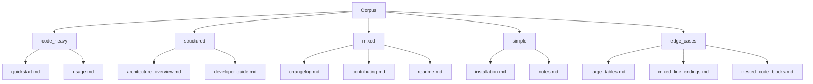
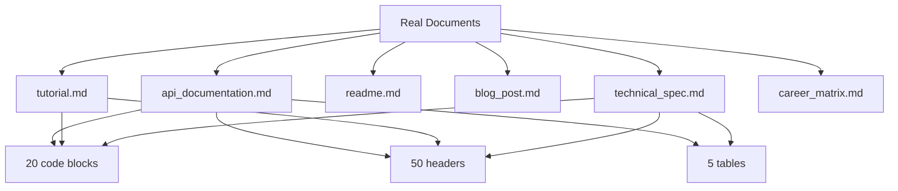
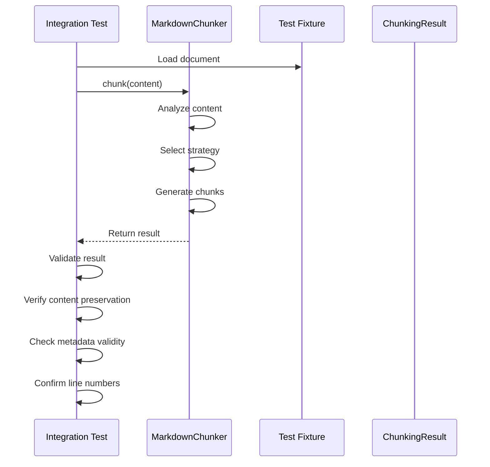

# Test Fixtures

<cite>
**Referenced Files in This Document**   
- [test_full_pipeline_real_docs.py](file://tests/integration/test_full_pipeline_real_docs.py)
- [test_edge_cases_full_pipeline.py](file://tests/integration/test_edge_cases_full_pipeline.py)
- [code_heavy.md](file://tests/fixtures/code_heavy.md)
- [list_heavy.md](file://tests/fixtures/list_heavy.md)
- [mixed.md](file://tests/fixtures/mixed.md)
- [table_heavy.md](file://tests/fixtures/table_heavy.md)
- [edge_cases.md](file://tests/fixtures/edge_cases.md)
- [structural.md](file://tests/fixtures/structural.md)
- [corpus/README.md](file://tests/fixtures/corpus/README.md)
- [real_documents/metadata.json](file://tests/fixtures/real_documents/metadata.json)
- [real_documents/api_documentation.md](file://tests/fixtures/real_documents/api_documentation.md)
- [real_documents/blog_post.md](file://tests/fixtures/real_documents/blog_post.md)
- [real_documents/technical_spec.md](file://tests/fixtures/real_documents/technical_spec.md)
- [real_documents/tutorial.md](file://tests/fixtures/real_documents/tutorial.md)
- [real_documents/readme.md](file://tests/fixtures/real_documents/readme.md)
</cite>

## Table of Contents
1. [Introduction](#introduction)
2. [Test Corpus Organization](#test-corpus-organization)
3. [Real Documents Collection](#real-documents-collection)
4. [Synthetic Test Files](#synthetic-test-files)
5. [Integration Testing with Fixtures](#integration-testing-with-fixtures)
6. [Creating New Fixtures](#creating-new-fixtures)
7. [Fixture Quality Assurance](#fixture-quality-assurance)
8. [Conclusion](#conclusion)

## Introduction

The test fixture system in the markdown-chunker repository provides a comprehensive framework for validating the chunking functionality across diverse Markdown patterns. This documentation explains the organization and purpose of the fixture system, including the corpus collection, real documents, synthetic test files, and their usage in integration tests. The system ensures robust chunking behavior by testing various scenarios from simple to complex edge cases.

## Test Corpus Organization

The test corpus is organized into distinct categories to validate different aspects of the chunking functionality. Each category contains Markdown files that represent specific content patterns and complexity levels.



**Diagram sources**
- [corpus/README.md](file://tests/fixtures/corpus/README.md)

**Section sources**
- [corpus/README.md](file://tests/fixtures/corpus/README.md)

The corpus directory contains five main categories of test documents:

1. **code_heavy/**: Documents with more than 50% code content, including API references, tutorials with code examples, and code snippet collections
2. **structured/**: Documents with hierarchical header structures, such as user guides, architecture documentation, and FAQs
3. **mixed/**: Typical README files and documentation with mixed content patterns
4. **simple/**: Documents with minimal structure, such as notes, todo lists, and simple blog posts
5. **edge_cases/**: Documents that test boundary conditions, including nested code blocks, large tables, mixed line endings, and Unicode-heavy content

The corpus serves as a baseline for regression testing and performance comparison. Scripts are provided to save and compare baseline results across different versions of the chunker.

## Real Documents Collection

The real_documents directory contains authentic Markdown files that represent real-world use cases for the markdown-chunker. These documents are designed to test the system with realistic content patterns and complexity.



**Diagram sources**
- [real_documents/metadata.json](file://tests/fixtures/real_documents/metadata.json)

**Section sources**
- [real_documents/metadata.json](file://tests/fixtures/real_documents/metadata.json)
- [real_documents/api_documentation.md](file://tests/fixtures/real_documents/api_documentation.md)
- [real_documents/blog_post.md](file://tests/fixtures/real_documents/blog_post.md)
- [real_documents/technical_spec.md](file://tests/fixtures/real_documents/technical_spec.md)
- [real_documents/tutorial.md](file://tests/fixtures/real_documents/tutorial.md)
- [real_documents/readme.md](file://tests/fixtures/real_documents/readme.md)

The real_documents collection includes:

- **api_documentation.md**: REST API documentation with code examples, tables, and multiple endpoints
- **tutorial.md**: Step-by-step tutorial with code examples and explanations
- **readme.md**: Project README with badges, examples, and installation instructions
- **blog_post.md**: Technical blog post with code, analysis, and performance metrics
- **technical_spec.md**: Comprehensive technical specification with detailed requirements
- **career_matrix.md**: Career progression matrix with structured data

Each document in the real_documents collection is accompanied by metadata in the metadata.json file that specifies expected characteristics, such as content type, expected chunking strategy, and performance targets. This metadata enables automated validation of chunking behavior and performance.

## Synthetic Test Files

The synthetic test files are specifically designed to validate particular chunking behaviors and edge cases. These files are named according to their purpose and contain content patterns that test specific aspects of the chunking algorithm.

**Section sources**
- [code_heavy.md](file://tests/fixtures/code_heavy.md)
- [list_heavy.md](file://tests/fixtures/list_heavy.md)
- [mixed.md](file://tests/fixtures/mixed.md)
- [table_heavy.md](file://tests/fixtures/table_heavy.md)
- [edge_cases.md](file://tests/fixtures/edge_cases.md)
- [structural.md](file://tests/fixtures/structural.md)

### code_heavy.md

This file contains multiple code blocks in different programming languages (Python, JavaScript, SQL) to test code-focused chunking behavior. The document is designed to validate that:

- Code blocks are preserved intact
- Language-specific syntax is handled correctly
- Code blocks are not split across chunks
- Appropriate chunking strategy is selected for code-heavy content

### list_heavy.md

This file contains various types of lists (unordered, ordered, nested, task lists) to test list-focused chunking behavior. It validates that:

- List structure is preserved
- Nested lists are handled correctly
- Task list checkboxes are maintained
- List items are not split across chunks

### table_heavy.md

This file contains multiple tables with different structures and content to test table-focused chunking behavior. It validates that:

- Tables are preserved intact
- Table alignment and formatting are maintained
- Tables are not split across chunks
- Header rows are properly identified

### mixed.md

This file contains a mix of text, code, lists, and tables to test mixed-content chunking behavior. It validates that:

- Different content types are properly identified
- Appropriate chunking strategy is selected for mixed content
- Transitions between content types are handled correctly
- All elements are preserved in their original form

### structural.md

This file contains a hierarchical structure of headers to test structural chunking behavior. It validates that:

- Header hierarchy is preserved
- Section boundaries are respected
- Appropriate chunking strategy is selected for structured content
- Navigation paths are maintained

### edge_cases.md

This file contains various edge cases to test robustness and error handling. It validates that:

- Malformed Markdown is handled gracefully
- Special characters and Unicode content are preserved
- Very long lines are processed correctly
- Empty sections are handled appropriately

## Integration Testing with Fixtures

The fixture system is used in integration tests to validate the full chunking pipeline across different scenarios. Two primary integration test files demonstrate how the fixtures are utilized.



**Diagram sources**
- [test_full_pipeline_real_docs.py](file://tests/integration/test_full_pipeline_real_docs.py)
- [test_edge_cases_full_pipeline.py](file://tests/integration/test_edge_cases_full_pipeline.py)

**Section sources**
- [test_full_pipeline_real_docs.py](file://tests/integration/test_full_pipeline_real_docs.py)
- [test_edge_cases_full_pipeline.py](file://tests/integration/test_edge_cases_full_pipeline.py)

### test_full_pipeline_real_docs.py

This integration test validates the complete chunking pipeline using real documents from the real_documents directory. The test performs the following validations:

- **Content preservation**: Verifies that no content is lost during chunking by reconstructing the original document from chunks
- **Line number accuracy**: Validates that line numbers in chunks are correct and sequential
- **Metadata validity**: Ensures that chunk metadata contains required fields and valid values
- **Strategy selection**: Confirms that appropriate chunking strategies are selected based on document characteristics
- **Chunk size limits**: Verifies that chunks respect size constraints

The test uses parameterized testing to apply the same validation logic to multiple documents, ensuring consistent behavior across different document types.

### test_edge_cases_full_pipeline.py

This integration test focuses on edge cases and unusual inputs to ensure robustness. The test covers:

- **Empty and minimal documents**: Tests handling of empty strings, whitespace-only content, and single-character documents
- **Very large documents**: Validates performance and memory usage with documents over 1MB in size
- **Malformed Markdown**: Tests graceful handling of unclosed code blocks, mismatched headers, and malformed tables/lists
- **Unicode and special characters**: Ensures proper handling of multilingual content, emojis, and special Markdown characters
- **Mixed line endings**: Validates compatibility with different line ending conventions (LF, CRLF, CR)
- **Deeply nested structures**: Tests handling of deeply nested headers, lists, and blockquotes
- **Extreme configurations**: Verifies behavior with very small or very large chunk sizes and overlap settings

These integration tests ensure that the markdown-chunker can handle a wide range of inputs and edge cases while maintaining data integrity and performance.

## Creating New Fixtures

When creating new fixtures for untested scenarios, follow these guidelines to ensure quality and consistency:

**Section sources**
- [corpus/README.md](file://tests/fixtures/corpus/README.md)
- [real_documents/metadata.json](file://tests/fixtures/real_documents/metadata.json)

### Identifying Gaps

Before creating new fixtures, analyze existing test coverage to identify gaps:

1. Review the corpus categories to ensure all major content patterns are represented
2. Examine the metadata.json file to identify document types or characteristics that are missing
3. Analyze integration test coverage to find untested edge cases or error conditions

### Fixture Creation Guidelines

When creating new fixtures, follow these best practices:

1. **Clear Purpose**: Each fixture should have a clear purpose and test a specific aspect of the chunking behavior
2. **Realistic Content**: Use realistic content patterns that reflect actual usage scenarios
3. **Minimal Scope**: Focus on the specific test case without unnecessary complexity
4. **Documentation**: Include comments or README entries explaining the fixture's purpose
5. **Metadata**: For real_documents, update the metadata.json file with appropriate characteristics and expectations

### Example: Adding a New Edge Case

To add a new edge case for testing nested code blocks within lists:

1. Create a new file in the edge_cases directory:
   ```
   tests/fixtures/corpus/edge_cases/nested_code_in_list.md
   ```

2. Add content that tests the specific scenario:
   ```markdown
   # Nested Code in List
   
   - Main list item
     - Sub-item with code block
       ```python
       def nested_function():
           return "This tests nested code in lists"
       ```
     - Another sub-item
   - Next main item
   ```

3. Update the corpus README to document the new test case:
   ```
   6. **nested_code_in_list/** — nested code blocks within list items
      - Code blocks inside list items
      - Multiple levels of nesting
      - Mixed content within list items
   ```

4. Add metadata to metadata.json if it's a real document type:
   ```json
   {
     "filename": "nested_code_in_list.md",
     "type": "edge_case",
     "description": "Tests nested code blocks within list items",
     "size_kb": 2,
     "expected_strategy": "structural",
     "characteristics": {
       "has_nested_code": true,
       "has_lists": true,
       "code_blocks_count": 1,
       "headers_count": 1,
       "lists_count": 1
     }
   }
   ```

## Fixture Quality Assurance

Maintaining high-quality fixtures is essential for reliable testing. Follow these practices to ensure fixture quality:

**Section sources**
- [test_full_pipeline_real_docs.py](file://tests/integration/test_full_pipeline_real_docs.py)
- [test_edge_cases_full_pipeline.py](file://tests/integration/test_edge_cases_full_pipeline.py)

### Regular Review

Schedule regular reviews of the fixture collection to:

1. Remove obsolete fixtures that no longer test relevant scenarios
2. Update existing fixtures to reflect changes in Markdown standards or usage patterns
3. Verify that fixtures continue to test the intended behavior
4. Ensure metadata accuracy and completeness

### Validation Checks

Implement automated validation checks for fixtures:

1. **Syntax Validation**: Ensure all Markdown files are syntactically valid
2. **Content Verification**: Verify that fixtures contain the expected content patterns
3. **Size Appropriateness**: Ensure files are not excessively large or small for their purpose
4. **Consistency**: Maintain consistent formatting and structure across similar fixture types

### Test Coverage Analysis

Regularly analyze test coverage to ensure the fixture collection provides adequate coverage:

1. **Content Type Coverage**: Verify all major Markdown elements are tested (headers, lists, tables, code blocks, etc.)
2. **Complexity Levels**: Ensure fixtures represent a range of complexity from simple to complex
3. **Edge Case Coverage**: Confirm that common edge cases and error conditions are tested
4. **Performance Scenarios**: Include fixtures that test performance under various conditions

## Conclusion

The test fixture system in the markdown-chunker repository provides a comprehensive framework for validating chunking behavior across diverse scenarios. By organizing fixtures into logical categories, including both synthetic and real-world documents, and using them in integration tests, the system ensures robust and reliable chunking functionality.

The corpus collection with simple, mixed, code-heavy, and edge case scenarios allows for targeted testing of specific chunking behaviors. The real_documents directory with authentic Markdown files ensures the system works with realistic content patterns. Synthetic test files validate specific aspects of the chunking algorithm, while integration tests verify end-to-end functionality.

To maintain the effectiveness of the fixture system, follow the guidelines for creating new fixtures and ensure fixture quality through regular review and validation. This comprehensive approach to testing ensures the markdown-chunker can handle a wide range of inputs while preserving content integrity and meeting performance requirements.