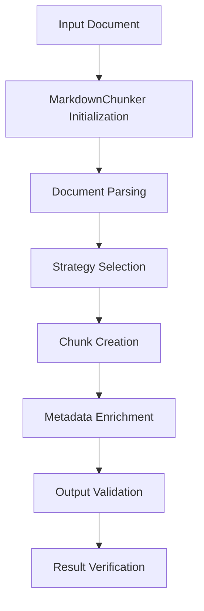
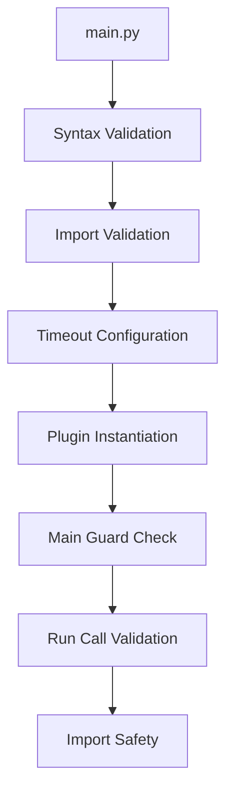
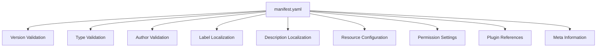
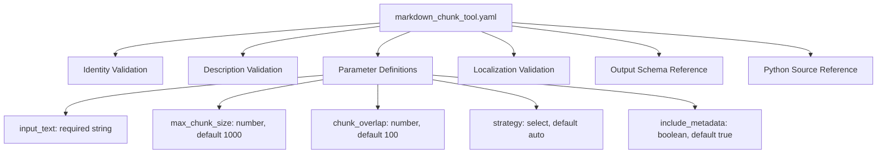
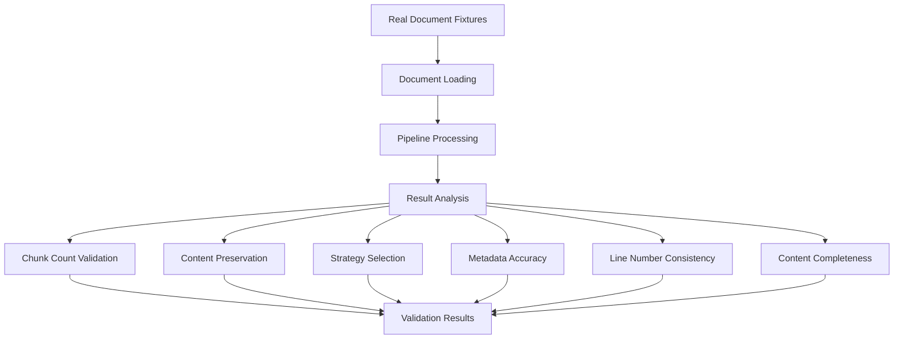
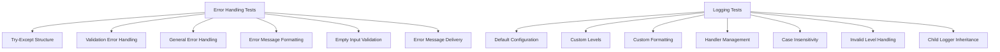

# End-to-End Testing

<cite>
**Referenced Files in This Document**   
- [test_end_to_end.py](file://tests/integration/test_end_to_end.py)
- [test_dify_plugin_integration.py](file://tests/integration/test_dify_plugin_integration.py)
- [test_entry_point.py](file://tests/test_entry_point.py)
- [test_provider_yaml.py](file://tests/test_provider_yaml.py)
- [test_tool_yaml.py](file://tests/test_tool_yaml.py)
- [main.py](file://main.py)
- [manifest.yaml](file://manifest.yaml)
- [provider/markdown_chunker.py](file://provider/markdown_chunker.py)
- [tools/markdown_chunk_tool.py](file://tools/markdown_chunk_tool.py)
- [provider/markdown_chunker.yaml](file://provider/markdown_chunker.yaml)
- [tools/markdown_chunk_tool.yaml](file://tools/markdown_chunk_tool.yaml)
- [tests/integration/test_full_pipeline.py](file://tests/integration/test_full_pipeline.py)
- [tests/integration/test_full_pipeline_real_docs.py](file://tests/integration/test_full_pipeline_real_docs.py)
- [tests/integration/test_edge_cases_full_pipeline.py](file://tests/integration/test_edge_cases_full_pipeline.py)
- [tests/test_error_handling.py](file://tests/test_error_handling.py)
- [tests/test_logging_config.py](file://tests/test_logging_config.py)
</cite>

## Table of Contents
1. [Introduction](#introduction)
2. [Core End-to-End Testing Strategy](#core-end-to-end-testing-strategy)
3. [Dify Plugin Integration Testing](#dify-plugin-integration-testing)
4. [Plugin Entry Point Validation](#plugin-entry-point-validation)
5. [Configuration and Manifest Validation](#configuration-and-manifest-validation)
6. [Tool Behavior and Parameter Validation](#tool-behavior-and-parameter-validation)
7. [Real Document Processing Workflows](#real-document-processing-workflows)
8. [Error Handling and Logging Validation](#error-handling-and-logging-validation)
9. [Performance Under Production Conditions](#performance-under-production-conditions)
10. [Best Practices for End-to-End Testing](#best-practices-for-end-to-end-testing)

## Introduction

The end-to-end testing strategy for the Dify Markdown Chunker plugin ensures comprehensive validation of the complete document processing workflow from input to output. This documentation details how the system validates plugin integration, configuration loading, tool behavior, and complete processing pipelines under realistic deployment scenarios. The testing framework verifies system-level functionality, including error handling, logging, and performance characteristics, ensuring reliable operation in production environments.

The test suite validates the entire processing chain, from the plugin entry point through configuration loading, document parsing, chunking strategies, and final output generation. Tests use real document fixtures to simulate production workloads and verify that the system maintains data integrity, preserves document structure, and produces consistent, predictable results across various document types and edge cases.

**Section sources**
- [test_end_to_end.py](file://tests/integration/test_end_to_end.py#L1-L274)
- [test_full_pipeline.py](file://tests/integration/test_full_pipeline.py#L1-L555)

## Core End-to-End Testing Strategy

The core end-to-end testing strategy validates the complete document processing pipeline through comprehensive integration tests that simulate real-world usage scenarios. The `test_end_to_end.py` module verifies system-level functionality by processing various document types through the entire chunking workflow and validating the results against expected outcomes.

The test suite includes multiple test cases that validate different aspects of the processing pipeline:

- **Document type validation**: Tests process README-style, code-heavy, and table-based documents to ensure proper handling of different content types
- **Configuration validation**: Tests verify that custom configurations are properly applied during processing
- **Metadata completeness**: Tests ensure all chunks contain required metadata fields such as strategy and content type
- **Error handling**: Tests validate graceful handling of empty and minimal inputs
- **Performance validation**: Tests measure processing time to ensure acceptable performance characteristics

The tests use embedded document fixtures to simulate real processing scenarios, verifying that key content is preserved throughout the chunking process. For example, when processing a README document, the tests verify that sections like "Installation" and "License" are preserved in the output chunks.

**Diagram sources**
- [test_end_to_end.py](file://tests/integration/test_end_to_end.py#L96-L273)

**Section sources**
- [test_end_to_end.py](file://tests/integration/test_end_to_end.py#L96-L273)

## Dify Plugin Integration Testing

The Dify plugin integration tests validate the complete interaction between the Markdown Chunker plugin and the Dify platform. The `test_dify_plugin_integration.py` module verifies that the plugin properly integrates with Dify's tool system and handles document processing requests according to platform specifications.

The integration tests validate several critical aspects of plugin behavior:

- **Tool invocation**: Tests verify that the plugin correctly receives and processes tool parameters from Dify
- **Response formatting**: Tests ensure the plugin returns results in the expected format for Dify's UI
- **Error reporting**: Tests validate that error conditions are properly communicated to the Dify interface
- **Parameter handling**: Tests verify that all required parameters are properly processed and validated

The tests simulate the complete plugin lifecycle, from initialization through execution and result return. They verify that the plugin properly handles the Dify tool invocation pattern, including parameter extraction, document processing, and result formatting. The tests also validate that the plugin returns structured results as an array of strings, which is the expected format for Dify's UI components.

**Section sources**
- [test_dify_plugin_integration.py](file://tests/integration/test_dify_plugin_integration.py)

## Plugin Entry Point Validation

The plugin entry point validation tests ensure that the `main.py` file is properly configured and follows Dify plugin conventions. The `test_entry_point.py` module validates the structure and configuration of the plugin's entry point to ensure reliable operation in both development and production environments.

Key validation points include:

- **Syntax validity**: Tests verify that `main.py` has valid Python syntax and can be parsed without errors
- **Required imports**: Tests ensure the necessary Dify plugin imports are present
- **Timeout configuration**: Tests verify that the request timeout is properly configured to 300 seconds
- **Plugin instantiation**: Tests validate that the plugin is properly instantiated with the correct environment configuration
- **Main guard**: Tests ensure the `if __name__ == '__main__'` guard is present to prevent unintended execution
- **Plugin execution**: Tests verify that `plugin.run()` is called within the main guard

The tests also validate that the module can be imported without side effects and that no code executes at the module level outside the main guard. This ensures the plugin can be safely imported and tested without triggering unintended behavior.

**Diagram sources**
- [test_entry_point.py](file://tests/test_entry_point.py#L1-L240)
- [main.py](file://main.py#L1-L31)

**Section sources**
- [test_entry_point.py](file://tests/test_entry_point.py#L1-L240)
- [main.py](file://main.py#L1-L31)

## Configuration and Manifest Validation

The configuration and manifest validation tests ensure that the plugin's configuration files contain all required fields and valid values. The `test_provider_yaml.py` module validates the `provider/markdown_chunker.yaml` file, while the manifest is validated through direct inspection.

Key validation points for the provider YAML include:

- **Identity completeness**: Tests verify that the identity section contains all required fields (author, name, label, description, icon)
- **Localization**: Tests ensure labels and descriptions are provided for all required languages (en_US, zh_Hans, ru_RU)
- **Tags presence**: Tests validate that at least one tag is present in the identity section
- **Tool reference**: Tests verify that the tools list includes the correct tool reference
- **Python source reference**: Tests ensure the Python source path points to the correct implementation file

The `manifest.yaml` file is also validated to ensure it contains all necessary configuration for the plugin, including version information, resource requirements, permission settings, and plugin metadata. The manifest validation ensures the plugin is properly configured for deployment in the Dify environment.

**Diagram sources**
- [test_provider_yaml.py](file://tests/test_provider_yaml.py#L1-L95)
- [manifest.yaml](file://manifest.yaml#L1-L48)
- [provider/markdown_chunker.yaml](file://provider/markdown_chunker.yaml#L1-L23)

**Section sources**
- [test_provider_yaml.py](file://tests/test_provider_yaml.py#L1-L95)
- [manifest.yaml](file://manifest.yaml#L1-L48)
- [provider/markdown_chunker.yaml](file://provider/markdown_chunker.yaml#L1-L23)

## Tool Behavior and Parameter Validation

The tool behavior and parameter validation tests ensure that the Markdown chunking tool functions correctly and handles parameters according to specifications. The `test_tool_yaml.py` module validates the tool's configuration and behavior to ensure reliable operation.

Key validation points include:

- **Identity presence**: Tests verify that the tool identity section contains all required fields
- **Description completeness**: Tests ensure both human and LLM descriptions are present
- **Parameter definitions**: Tests validate that all required parameters are defined with correct types and defaults
- **Input validation**: Tests verify that the input_text parameter is required and properly validated
- **Configuration parameters**: Tests ensure max_chunk_size, chunk_overlap, strategy, and include_metadata parameters are properly defined
- **Localization completeness**: Tests verify that all parameters have localized labels and descriptions
- **Output schema**: Tests ensure the output schema references the correct Dify schema
- **Python source reference**: Tests validate that the tool references the correct implementation file

The tests also validate that parameter options are properly defined, including strategy selection options (auto, code, structural, mixed). This ensures users can select appropriate chunking strategies based on their document types and processing requirements.

**Diagram sources**
- [test_tool_yaml.py](file://tests/test_tool_yaml.py#L1-L188)
- [tools/markdown_chunk_tool.yaml](file://tools/markdown_chunk_tool.yaml#L1-L128)

**Section sources**
- [test_tool_yaml.py](file://tests/test_tool_yaml.py#L1-L188)
- [tools/markdown_chunk_tool.yaml](file://tools/markdown_chunk_tool.yaml#L1-L128)
- [tools/markdown_chunk_tool.py](file://tools/markdown_chunk_tool.py#L1-L157)

## Real Document Processing Workflows

The real document processing workflows are validated through comprehensive integration tests that use actual document fixtures to simulate production scenarios. The test suite processes various real-world documents through the complete pipeline and verifies the results against expected outcomes.

The `test_full_pipeline_real_docs.py` module tests the complete processing pipeline using real documents from the `fixtures/real_documents` directory, including:

- API documentation
- Tutorials
- README files
- Blog posts
- Technical specifications

For each document type, the tests validate:

- **Chunk count**: Tests ensure the number of chunks falls within expected ranges
- **Content preservation**: Tests verify that key content elements are preserved in the output
- **Strategy selection**: Tests validate that appropriate chunking strategies are selected based on document characteristics
- **Metadata accuracy**: Tests ensure all chunks contain valid metadata
- **Line number consistency**: Tests verify that line numbers are accurate and sequential
- **Content completeness**: Tests ensure no content is lost during processing

The tests also validate that specific document elements are properly preserved, such as code blocks in API documentation, tables in blog posts, and badges in README files. This ensures the chunking process maintains the integrity of the original documents while creating appropriately sized chunks for downstream processing.

**Diagram sources**
- [test_full_pipeline_real_docs.py](file://tests/integration/test_full_pipeline_real_docs.py#L1-L346)
- [tests/fixtures/real_documents](file://tests/fixtures/real_documents)

**Section sources**
- [test_full_pipeline_real_docs.py](file://tests/integration/test_full_pipeline_real_docs.py#L1-L346)
- [tests/fixtures/real_documents](file://tests/fixtures/real_documents)

## Error Handling and Logging Validation

The error handling and logging validation tests ensure the system gracefully handles error conditions and provides appropriate logging output. The `test_error_handling.py` and `test_logging_config.py` modules validate these critical aspects of system reliability.

The error handling tests verify:

- **Try-except structure**: Tests ensure proper exception handling is implemented
- **Validation error handling**: Tests verify that input validation errors are properly caught and reported
- **General error handling**: Tests ensure unexpected exceptions are caught and reported
- **Error message formatting**: Tests validate that error messages follow the expected format
- **Empty input validation**: Tests ensure the system properly handles empty or whitespace-only inputs
- **Error message delivery**: Tests verify that errors are returned using the appropriate Dify message mechanism

The logging configuration tests validate:

- **Default configuration**: Tests ensure the logger is properly configured with default settings
- **Custom levels**: Tests verify that custom log levels (INFO, DEBUG, ERROR) are properly applied
- **Custom formatting**: Tests ensure custom log formats are correctly implemented
- **Handler management**: Tests verify that multiple calls to setup_logging don't create duplicate handlers
- **Case insensitivity**: Tests ensure log level parameters are case-insensitive
- **Invalid level handling**: Tests verify that invalid log levels default to WARNING
- **Child logger inheritance**: Tests ensure child loggers inherit parent configuration

These tests ensure the system provides meaningful error messages to users while maintaining detailed logs for debugging and monitoring purposes.

**Diagram sources**
- [test_error_handling.py](file://tests/test_error_handling.py#L1-L111)
- [test_logging_config.py](file://tests/test_logging_config.py#L1-L176)

**Section sources**
- [test_error_handling.py](file://tests/test_error_handling.py#L1-L111)
- [test_logging_config.py](file://tests/test_logging_config.py#L1-L176)
- [tools/markdown_chunk_tool.py](file://tools/markdown_chunk_tool.py#L1-L157)

## Performance Under Production Conditions

The performance validation tests ensure the system operates efficiently under production-like conditions. The test suite includes performance benchmarks and consistency tests that measure processing time and resource usage across various document sizes and complexities.

Key performance tests include:

- **Small document performance**: Tests measure processing time for small documents to ensure responsiveness
- **Large document handling**: Tests verify the system can process large documents (1MB+) within acceptable time limits
- **Performance consistency**: Tests run multiple processing cycles to measure consistency and identify performance variance
- **Edge case performance**: Tests measure performance with documents containing edge cases like very long lines or many small sections
- **Memory usage**: Tests monitor resource consumption to ensure efficient memory usage

The tests establish performance baselines and validate that processing times remain within acceptable thresholds. For small documents, processing should complete in under one second, while larger documents have more generous time limits based on their size and complexity. The performance consistency tests help identify potential performance regressions and ensure reliable operation across different environments.

**Section sources**
- [test_end_to_end.py](file://tests/integration/test_end_to_end.py#L257-L273)
- [test_full_pipeline.py](file://tests/integration/test_full_pipeline.py#L450-L517)
- [test_edge_cases_full_pipeline.py](file://tests/integration/test_edge_cases_full_pipeline.py#L60-L75)

## Best Practices for End-to-End Testing

Based on the comprehensive test suite, several best practices emerge for maintaining reliable end-to-end tests and diagnosing failures in complex workflows:

1. **Use real document fixtures**: Test with actual documents that represent production use cases rather than synthetic examples
2. **Validate complete workflows**: Test the entire processing pipeline from input to output rather than isolated components
3. **Test edge cases**: Include tests for malformed inputs, extreme sizes, and unusual content types
4. **Verify data preservation**: Ensure all content is preserved through the processing pipeline with minimal loss
5. **Validate metadata completeness**: Check that all required metadata fields are present and accurate
6. **Monitor performance**: Include performance tests to catch regressions and ensure acceptable response times
7. **Test error handling**: Verify the system gracefully handles error conditions and provides meaningful feedback
8. **Use consistent test patterns**: Apply consistent testing approaches across different test modules
9. **Validate configuration files**: Test that all configuration files contain required fields and valid values
10. **Test localization**: Ensure all user-facing text is properly localized for supported languages

When diagnosing failures in complex workflows, follow these steps:

1. **Reproduce the failure**: Isolate the specific test case that is failing
2. **Check input validation**: Verify the input meets all requirements and constraints
3. **Examine error messages**: Review any error messages or logs for clues about the failure
4. **Validate intermediate results**: Check the state of the system at various points in the workflow
5. **Compare with expected output**: Identify specific differences between actual and expected results
6. **Test in isolation**: Run the failing test independently to eliminate interference from other tests
7. **Check configuration**: Verify all configuration settings are correct and complete
8. **Review recent changes**: Examine recent code changes that might have introduced the issue

These practices help ensure the reliability and maintainability of the end-to-end test suite, providing confidence in the system's behavior under real-world conditions.

**Section sources**
- [test_end_to_end.py](file://tests/integration/test_end_to_end.py)
- [test_full_pipeline.py](file://tests/integration/test_full_pipeline.py)
- [test_full_pipeline_real_docs.py](file://tests/integration/test_full_pipeline_real_docs.py)
- [test_edge_cases_full_pipeline.py](file://tests/integration/test_edge_cases_full_pipeline.py)