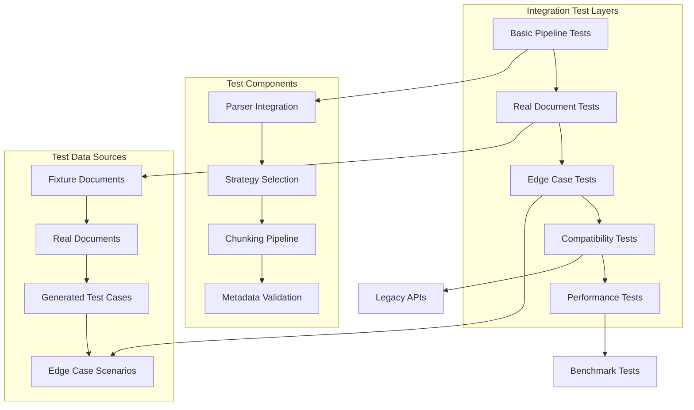
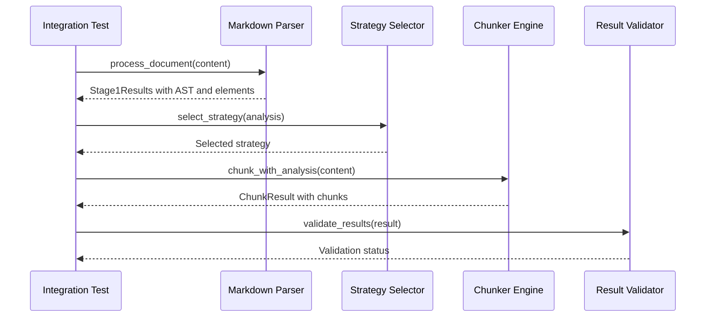
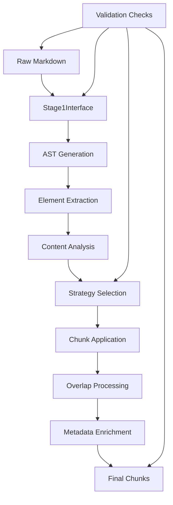
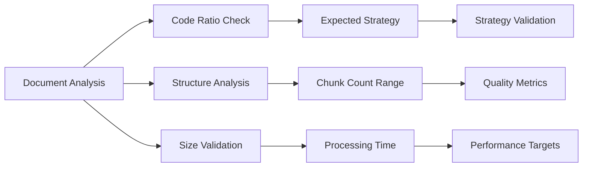
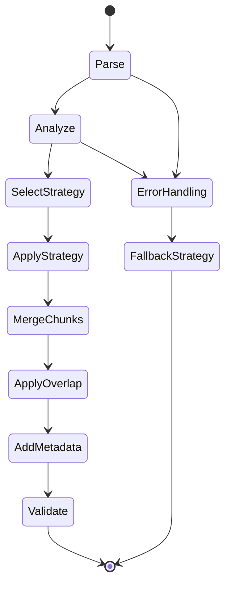
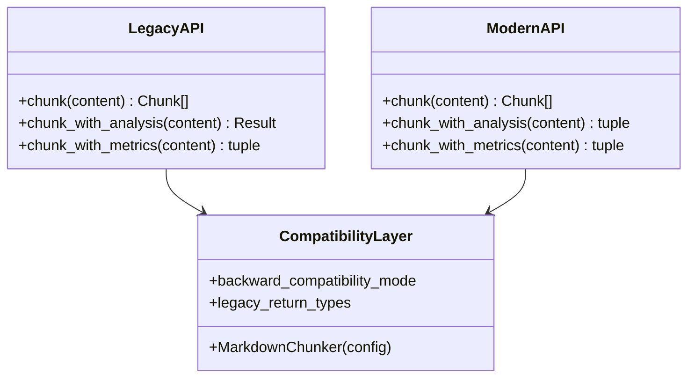
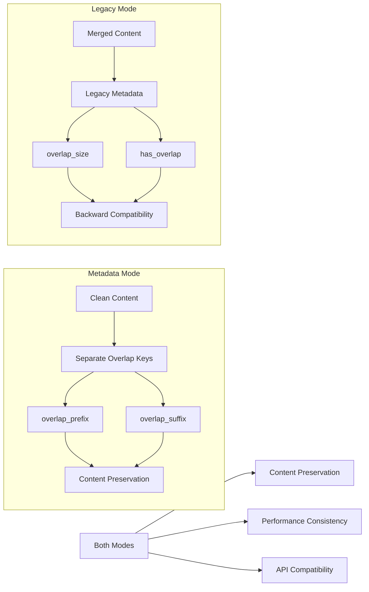
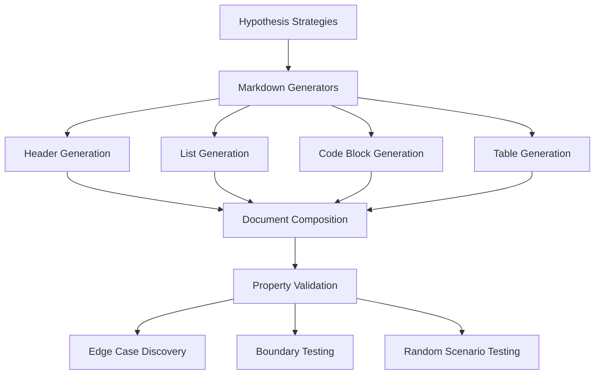
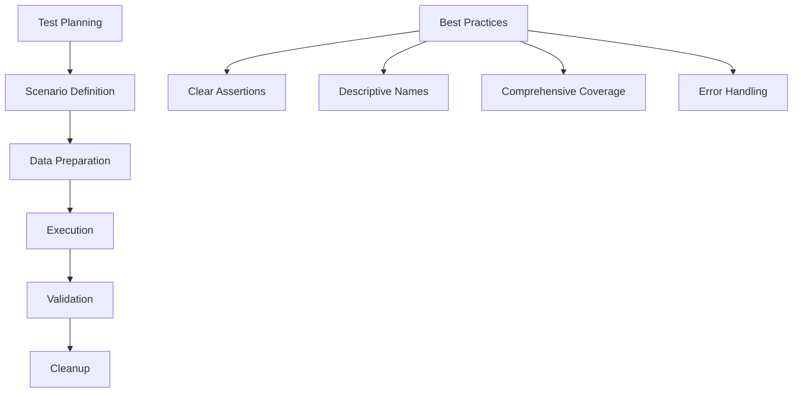
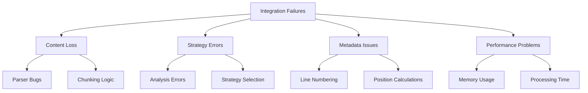

# Integration Testing

<cite>
**Referenced Files in This Document**
- [test_full_pipeline.py](file://tests/integration/test_full_pipeline.py)
- [test_parser_chunker_integration.py](file://tests/integration/test_parser_chunker_integration.py)
- [test_full_pipeline_real_docs.py](file://tests/integration/test_full_pipeline_real_docs.py)
- [test_edge_cases_full_pipeline.py](file://tests/integration/test_edge_cases_full_pipeline.py)
- [test_end_to_end.py](file://tests/integration/test_end_to_end.py)
- [test_overlap_integration.py](file://tests/integration/test_overlap_integration.py)
- [test_backward_compatibility.py](file://tests/api/test_backward_compatibility.py)
- [metadata.json](file://tests/fixtures/real_documents/metadata.json)
- [conftest.py](file://tests/conftest.py)
- [parser.py](file://markdown_chunker_v2/parser.py)
- [chunker.py](file://markdown_chunker_v2/chunker.py)
- [test_integration_fixtures.py](file://tests/test_integration_fixtures.py)
</cite>

## Table of Contents
1. [Introduction](#introduction)
2. [Integration Testing Architecture](#integration-testing-architecture)
3. [Core Integration Test Components](#core-integration-test-components)
4. [Real-World Document Testing](#real-world-document-testing)
5. [End-to-End Pipeline Validation](#end-to-end-pipeline-validation)
6. [Edge Case and Error Handling](#edge-case-and-error-handling)
7. [Backward Compatibility Testing](#backward-compatibility-testing)
8. [Overlap Mode Integration](#overlap-mode-integration)
9. [Testing Strategies and Patterns](#testing-strategies-and-patterns)
10. [Writing New Integration Tests](#writing-new-integration-tests)
11. [Debugging Integration Failures](#debugging-integration-failures)
12. [Best Practices](#best-practices)

## Introduction

Integration testing in the Markdown Chunker project ensures that multiple components work together correctly as a cohesive system. Unlike unit tests that focus on individual components in isolation, integration tests validate the complete data flow from parsing through strategy selection to chunking, using real-world scenarios and edge cases.

The integration testing approach encompasses several key areas:
- **Pipeline Validation**: Ensuring Stage 1 parsing and Stage 2 chunking work seamlessly together
- **Real Document Testing**: Using actual markdown documents to validate end-to-end behavior  
- **Error Recovery**: Testing graceful degradation and fallback mechanisms
- **Backward Compatibility**: Maintaining API compatibility across versions
- **Performance Validation**: Ensuring consistent performance across different document types

## Integration Testing Architecture

The integration testing framework follows a layered approach with distinct test categories:



**Diagram sources**
- [test_full_pipeline.py](file://tests/integration/test_full_pipeline.py#L1-L50)
- [test_full_pipeline_real_docs.py](file://tests/integration/test_full_pipeline_real_docs.py#L1-L50)

**Section sources**
- [test_full_pipeline.py](file://tests/integration/test_full_pipeline.py#L1-L50)
- [test_parser_chunker_integration.py](file://tests/integration/test_parser_chunker_integration.py#L1-L50)

## Core Integration Test Components

### Complete Pipeline Testing

The primary integration test validates the complete processing pipeline from raw markdown through all stages:



**Diagram sources**
- [test_full_pipeline.py](file://tests/integration/test_full_pipeline.py#L156-L200)
- [parser.py](file://markdown_chunker_v2/parser.py#L38-L81)
- [chunker.py](file://markdown_chunker_v2/chunker.py#L107-L128)

The pipeline integration tests verify:
- **Content Preservation**: Ensuring no data loss during processing
- **Strategy Selection**: Correct strategy selection based on document characteristics
- **Metadata Accuracy**: Valid line numbers and chunk metadata
- **Performance Consistency**: Reasonable processing times across runs

**Section sources**
- [test_full_pipeline.py](file://tests/integration/test_full_pipeline.py#L12-L200)

### Parser-Chunker Interface Integration

The parser-chunker integration test focuses on the communication between the Stage 1 parser and Stage 2 chunker:



**Diagram sources**
- [test_parser_chunker_integration.py](file://tests/integration/test_parser_chunker_integration.py#L49-L88)
- [parser.py](file://markdown_chunker_v2/parser.py#L38-L81)

Key validation points include:
- **Stage 1 Usage Monitoring**: Tracking percentage of chunks processed through Stage 1
- **Fallback Rate Monitoring**: Ensuring emergency fallback is used less than 10% of the time
- **Content Type Preservation**: Verifying lists, tables, and code blocks remain intact
- **Task List Formatting**: Ensuring GitHub-style task lists are preserved correctly

**Section sources**
- [test_parser_chunker_integration.py](file://tests/integration/test_parser_chunker_integration.py#L17-L271)

## Real-World Document Testing

### Corpus-Based Testing Strategy

The project maintains a comprehensive corpus of real documents to validate end-to-end behavior:

| Document Type | Purpose | Characteristics | Expected Outcomes |
|---------------|---------|-----------------|-------------------|
| **API Documentation** | Code-heavy scenarios | High code ratio, tables, headers | Code strategy, good chunking |
| **Tutorial** | Mixed content | Balanced text/code | Structural or mixed strategy |
| **README** | Structured documents | Headers, tables, code blocks | Structural strategy |
| **Blog Post** | Text-heavy with tables | Moderate code, tables | Mixed strategy |
| **Technical Specification** | Large structured content | Many headers, code examples | Structural strategy |

**Section sources**
- [metadata.json](file://tests/fixtures/real_documents/metadata.json#L1-L159)
- [test_full_pipeline_real_docs.py](file://tests/integration/test_full_pipeline_real_docs.py#L100-L346)

### Document Characteristic Validation

Each real document type has predefined characteristics and expected outcomes:



**Diagram sources**
- [metadata.json](file://tests/fixtures/real_documents/metadata.json#L8-L101)

The validation framework checks:
- **Content Preservation**: Ensuring 95%+ similarity between original and reconstructed content
- **Line Number Accuracy**: Validating start/end line numbers for each chunk
- **Metadata Completeness**: Verifying all required metadata fields are present
- **Strategy Appropriateness**: Confirming the selected strategy matches expectations

**Section sources**
- [test_full_pipeline_real_docs.py](file://tests/integration/test_full_pipeline_real_docs.py#L49-L98)

## End-to-End Pipeline Validation

### Comprehensive End-to-End Testing

The end-to-end tests validate the complete system with various document types:



**Diagram sources**
- [test_end_to_end.py](file://tests/integration/test_end_to_end.py#L96-L273)

Key test scenarios include:
- **Empty Input Handling**: Graceful processing of empty or whitespace-only documents
- **Minimal Valid Input**: Basic functionality with simple markdown
- **Large Document Processing**: Performance validation with substantial content
- **Mixed Content Types**: Documents containing headers, lists, tables, and code blocks
- **Custom Configuration**: Testing with various chunk size and overlap settings

**Section sources**
- [test_end_to_end.py](file://tests/integration/test_end_to_end.py#L1-L274)

### Quality Assurance Metrics

The integration tests enforce several quality metrics:

| Metric Category | Validation Criteria | Acceptance Threshold |
|-----------------|---------------------|---------------------|
| **Content Loss** | ≥95% similarity | Must be ≥95% |
| **Line Number Accuracy** | Sequential, valid ranges | Must be valid |
| **Metadata Completeness** | All required fields present | Must be complete |
| **Strategy Selection** | Appropriate strategy chosen | Flexible acceptance |
| **Performance** | Reasonable processing time | <1 second for small docs |
| **Fallback Rate** | Emergency fallback <10% | Must be <10% |

## Edge Case and Error Handling

### Comprehensive Edge Case Testing

The edge case testing framework covers extreme scenarios that stress-test the system:


**Diagram sources**
- [test_edge_cases_full_pipeline.py](file://tests/integration/test_edge_cases_full_pipeline.py#L1-L494)

### Error Recovery Mechanisms

The system implements robust error recovery:

- **Graceful Degradation**: Continues processing even with malformed content
- **Fallback Chain**: Progressive fallback to simpler strategies when complex processing fails
- **Content Preservation**: Maintains as much content as possible during error conditions
- **Metadata Integrity**: Ensures metadata remains valid even in error scenarios

**Section sources**
- [test_edge_cases_full_pipeline.py](file://tests/integration/test_edge_cases_full_pipeline.py#L451-L494)

## Backward Compatibility Testing

### API Compatibility Validation

The backward compatibility tests ensure existing API patterns continue to work:



**Diagram sources**
- [test_backward_compatibility.py](file://tests/api/test_backward_compatibility.py#L1-L240)

Key compatibility aspects tested:
- **Method Signatures**: All existing method signatures work correctly
- **Return Types**: Consistent return types across API versions
- **Configuration Options**: Backward-compatible configuration parameters
- **Error Handling**: Same error patterns as legacy API
- **Performance**: Equivalent performance characteristics

**Section sources**
- [test_backward_compatibility.py](file://tests/api/test_backward_compatibility.py#L1-L240)

## Overlap Mode Integration

### Metadata vs Legacy Mode Comparison

The overlap integration tests validate both metadata mode and legacy mode behavior:



**Diagram sources**
- [test_overlap_integration.py](file://tests/integration/test_overlap_integration.py#L1-L200)

### Overlap Validation Criteria

The overlap integration tests verify:
- **Content Separation**: Metadata mode keeps overlap separate from content
- **Consistency**: Overlap prefixes/suffixes match between adjacent chunks
- **Performance**: Both modes maintain reasonable processing speeds
- **API Compatibility**: Seamless switching between modes

**Section sources**
- [test_overlap_integration.py](file://tests/integration/test_overlap_integration.py#L1-L257)

## Testing Strategies and Patterns

### Property-Based Testing Framework

The project employs property-based testing for comprehensive coverage:



**Diagram sources**
- [conftest.py](file://tests/conftest.py#L22-L220)

The property-based testing framework generates:
- **Markdown Headers**: Various levels and content types
- **Lists**: Different item counts and nesting levels
- **Code Blocks**: Multiple languages and complexities
- **Tables**: Varying dimensions and alignments
- **Complete Documents**: Random compositions of all elements

**Section sources**
- [conftest.py](file://tests/conftest.py#L1-L220)

### Fixture-Based Testing

The fixture-based testing approach validates against known-good documents:

| Fixture Type | Purpose | Validation Focus |
|--------------|---------|------------------|
| **code_heavy.md** | Code-focused scenarios | Code block preservation |
| **structural.md** | Hierarchical content | Header structure maintenance |
| **mixed.md** | Variety content | Multi-type content handling |
| **list_heavy.md** | List-centric documents | List formatting accuracy |
| **table_heavy.md** | Table-rich content | Table structure preservation |

**Section sources**
- [test_integration_fixtures.py](file://tests/test_integration_fixtures.py#L1-L83)

## Writing New Integration Tests

### Test Structure Guidelines

When writing new integration tests, follow these structural guidelines:



### Test Implementation Template

```python
def test_scenario_name():
    """Test description with clear purpose."""
    
    # Setup
    chunker = MarkdownChunker()
    test_content = load_test_content()
    
    # Execution
    result = chunker.chunk(test_content, include_analysis=True)
    
    # Validation
    assert result.success, "Processing should succeed"
    assert len(result.chunks) > 0, "Should produce chunks"
    assert result.strategy_used in expected_strategies, "Wrong strategy selected"
    
    # Additional validations
    verify_content_preservation(test_content, result.chunks)
    verify_metadata_integrity(result.chunks)
```

### Test Categories and Patterns

1. **Pipeline Integration Tests**: Validate complete processing flow
2. **Component Interaction Tests**: Test specific component combinations
3. **Real Document Tests**: Use actual documents with known characteristics
4. **Edge Case Tests**: Cover extreme and unusual scenarios
5. **Performance Tests**: Validate processing times and resource usage

## Debugging Integration Failures

### Common Failure Patterns

Integration failures typically fall into several categories:



### Debugging Strategies

1. **Incremental Testing**: Test smaller components individually before full integration
2. **Logging Enhancement**: Add detailed logging around integration points
3. **Test Isolation**: Use isolated test cases to pinpoint failure locations
4. **Data Inspection**: Examine intermediate results at each pipeline stage
5. **Performance Profiling**: Identify bottlenecks in the processing pipeline

### Diagnostic Tools and Techniques

- **Verbose Logging**: Enable detailed logging to trace execution flow
- **Intermediate Validation**: Check results at each pipeline stage
- **Comparative Analysis**: Compare results with known-good scenarios
- **Stress Testing**: Push components to their limits to reveal hidden issues

## Best Practices

### Test Organization and Maintenance

1. **Clear Naming Conventions**: Use descriptive test names that explain the scenario
2. **Comprehensive Documentation**: Document test purposes and expected outcomes
3. **Regular Maintenance**: Update tests when components change
4. **Performance Monitoring**: Track test execution times and resource usage

### Quality Assurance Standards

1. **Coverage Requirements**: Aim for comprehensive coverage of integration scenarios
2. **Regression Prevention**: Use real documents to prevent regression issues
3. **Cross-Version Compatibility**: Ensure tests work across API versions
4. **Resource Efficiency**: Design tests to run efficiently in CI/CD environments

### Continuous Improvement

1. **Test Refactoring**: Regularly improve test structure and readability
2. **New Scenario Discovery**: Continuously add tests for uncovered scenarios
3. **Performance Optimization**: Optimize slow-running integration tests
4. **Documentation Updates**: Keep test documentation synchronized with implementation

The integration testing approach in the Markdown Chunker project provides comprehensive validation of the complete system, ensuring reliable operation across diverse scenarios while maintaining backward compatibility and performance standards.