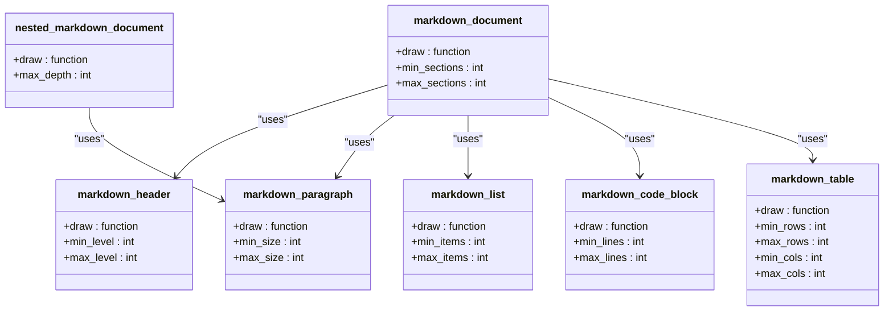
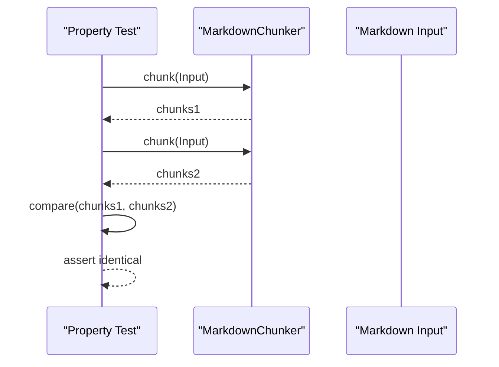
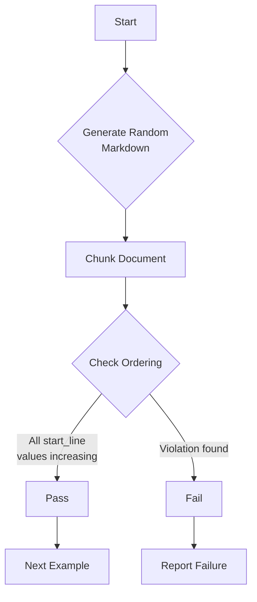
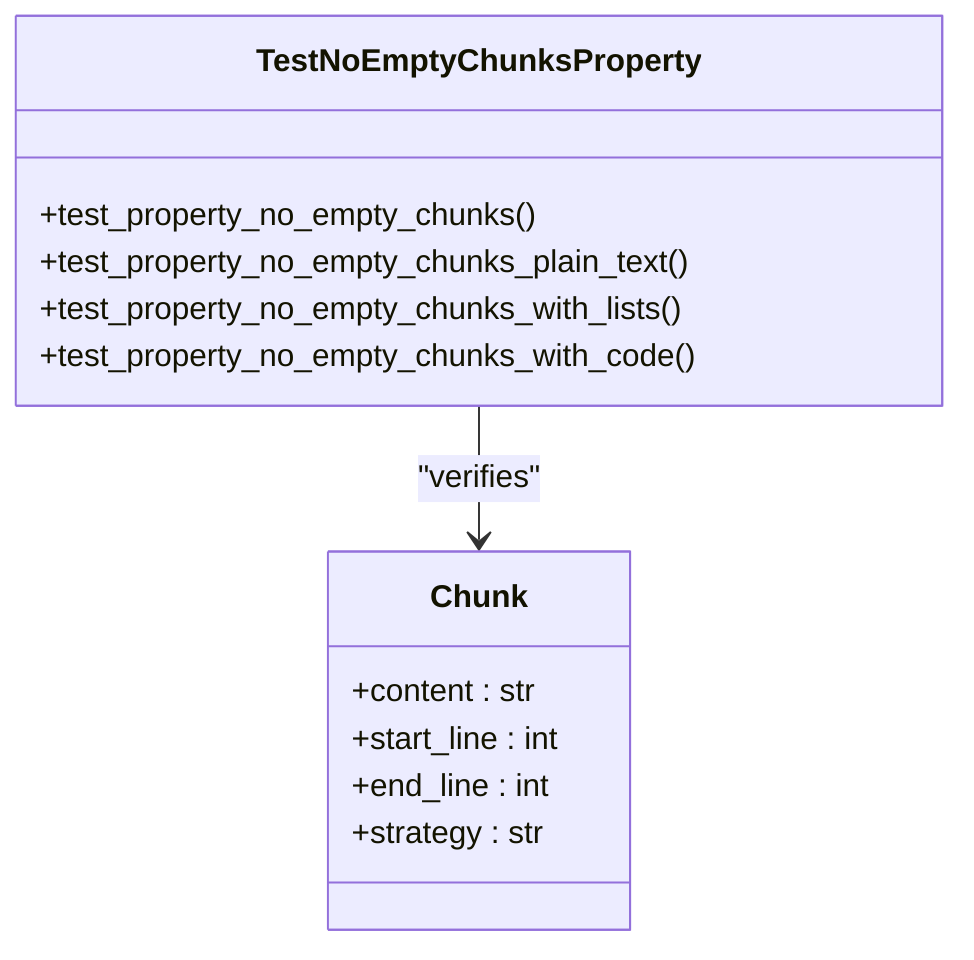
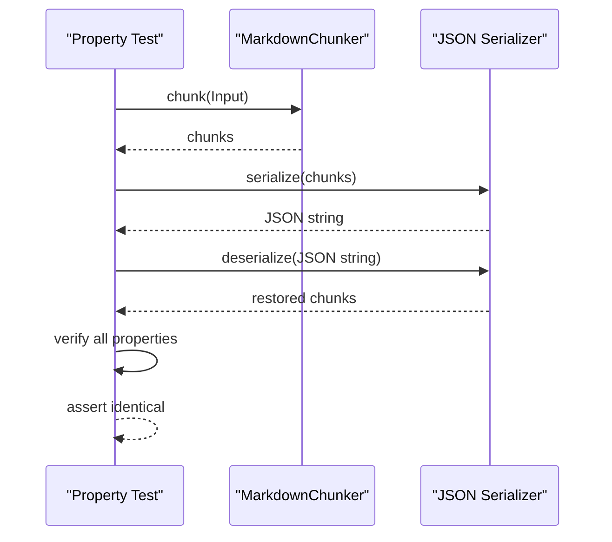
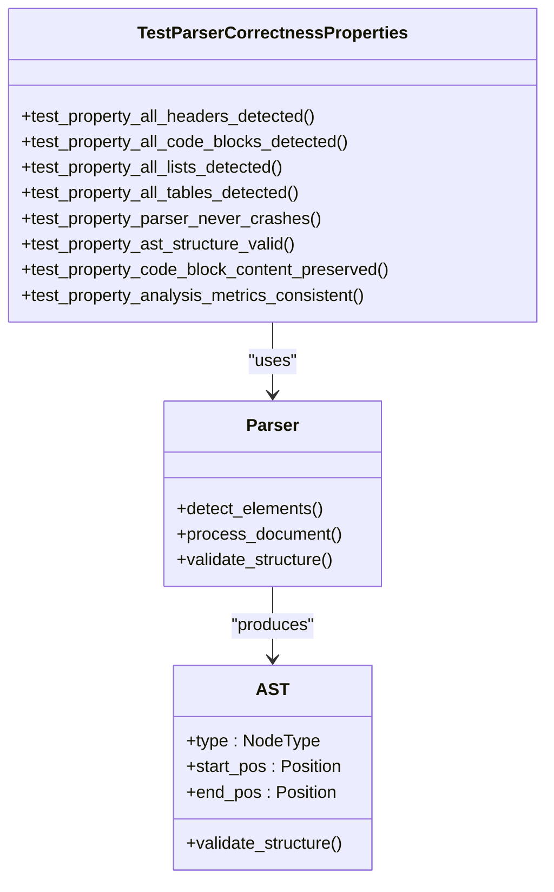
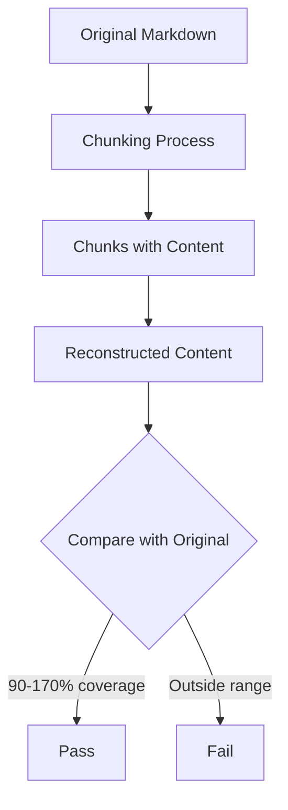

# Property-Based Testing

<cite>
**Referenced Files in This Document**   
- [conftest.py](file://tests/conftest.py)
- [test_idempotence_property.py](file://tests/chunker/test_idempotence_property.py)
- [test_parser_correctness_properties.py](file://tests/parser/test_parser_correctness_properties.py)
- [test_monotonic_ordering_property.py](file://tests/chunker/test_monotonic_ordering_property.py)
- [test_no_empty_chunks_property.py](file://tests/chunker/test_no_empty_chunks_property.py)
- [test_serialization_roundtrip_property.py](file://tests/chunker/test_serialization_roundtrip_property.py)
- [test_data_preservation_properties.py](file://tests/chunker/test_data_preservation_properties.py)
</cite>

## Table of Contents
1. [Introduction](#introduction)
2. [Hypothesis Configuration and Strategy Definitions](#hypothesis-configuration-and-strategy-definitions)
3. [Key Properties Verified](#key-properties-verified)
4. [Idempotence Property](#idempotence-property)
5. [Monotonic Ordering Property](#monotonic-ordering-property)
6. [No Empty Chunks Property](#no-empty-chunks-property)
7. [Serialization Round-Trip Integrity](#serialization-round-trip-integrity)
8. [Parser Correctness Properties](#parser-correctness-properties)
9. [Data Preservation Properties](#data-preservation-properties)
10. [Best Practices for Property-Based Testing](#best-practices-for-property-based-testing)

## Introduction

The property-based testing framework in the markdown-chunker project leverages the Hypothesis library to systematically verify critical invariants across a wide range of randomly generated Markdown inputs. This approach goes beyond traditional example-based testing by automatically generating hundreds of test cases that explore edge cases and boundary conditions that might be missed by manual test design.

The testing framework focuses on verifying fundamental properties that must hold true for any valid Markdown input, regardless of its structure or content. These properties include idempotence, monotonic ordering, absence of empty chunks, serialization integrity, parser correctness, and data preservation. By using property-based testing, the project ensures robustness against regression bugs and validates that the chunking algorithm behaves correctly across diverse input scenarios.

The framework is structured around reusable Hypothesis strategies defined in conftest.py that generate valid Markdown structures, which are then used across multiple test files to verify different properties. This modular approach allows for comprehensive testing while maintaining consistency in input generation.

**Section sources**
- [conftest.py](file://tests/conftest.py#L1-L220)

## Hypothesis Configuration and Strategy Definitions

The property-based testing framework is configured through the conftest.py file, which establishes global Hypothesis settings and defines reusable strategies for generating valid Markdown structures. The configuration ensures thorough testing by increasing the number of generated examples and setting appropriate time limits.



**Diagram sources**
- [conftest.py](file://tests/conftest.py#L23-L220)

The Hypothesis configuration in conftest.py sets the testing profile to execute at least 100 examples per property test with a 5-second deadline, ensuring comprehensive coverage:

```python
settings.register_profile("default", max_examples=100, deadline=5000)
settings.load_profile("default")
```

The framework defines several composite strategies for generating specific Markdown structures:
- `markdown_header`: Generates headers with configurable levels (1-6) and text content
- `markdown_paragraph`: Generates paragraphs with controlled length and character sets
- `markdown_list`: Generates unordered lists with specified item counts
- `markdown_code_block`: Generates fenced code blocks with various languages and line counts
- `markdown_table`: Generates tables with headers, separators, and data rows
- `markdown_document`: Generates complete documents with mixed content types
- `nested_markdown_document`: Generates documents with hierarchical header structures

These strategies use Hypothesis's advanced features like `st.characters` with category whitelisting to ensure generated text contains appropriate characters while filtering out invalid cases. The strategies are designed to produce syntactically valid Markdown that represents realistic document structures.

**Section sources**
- [conftest.py](file://tests/conftest.py#L10-L220)

## Key Properties Verified

The property-based testing framework verifies several critical properties that ensure the reliability and correctness of the Markdown chunking system. These properties represent fundamental invariants that must hold true across all valid inputs, providing strong guarantees about the system's behavior.

The key properties being verified include:
- **Idempotence**: Chunking the same input twice produces identical results
- **Monotonic Ordering**: Chunks appear in the same order as their content in the input
- **No Empty Chunks**: Non-empty input never produces empty chunks
- **Serialization Round-Trip Integrity**: Chunks can be serialized and deserialized without data loss
- **Parser Correctness**: The parser correctly identifies all Markdown elements
- **Data Preservation**: The total content in chunks approximately matches the input

These properties are validated across various input types, chunking strategies, and configuration parameters to ensure comprehensive coverage. The testing approach uses both general strategies that generate diverse Markdown content and specialized strategies that target specific structural elements.

Each property test is designed to be comprehensive, testing not only the primary case but also edge cases and variations in configuration. This multi-layered approach ensures that the system behaves correctly under a wide range of conditions, catching potential bugs that might only manifest in specific scenarios.

**Section sources**
- [test_idempotence_property.py](file://tests/chunker/test_idempotence_property.py#L1-L373)
- [test_monotonic_ordering_property.py](file://tests/chunker/test_monotonic_ordering_property.py#L1-L391)
- [test_no_empty_chunks_property.py](file://tests/chunker/test_no_empty_chunks_property.py#L1-L341)
- [test_serialization_roundtrip_property.py](file://tests/chunker/test_serialization_roundtrip_property.py#L1-L404)
- [test_parser_correctness_properties.py](file://tests/parser/test_parser_correctness_properties.py#L1-L459)
- [test_data_preservation_properties.py](file://tests/chunker/test_data_preservation_properties.py#L1-L374)

## Idempotence Property

The idempotence property ensures that chunking the same input twice with identical configuration produces exactly the same results. This is a critical requirement for reproducibility and predictability in the chunking process.



**Diagram sources**
- [test_idempotence_property.py](file://tests/chunker/test_idempotence_property.py#L100-L126)

The idempotence tests verify that all chunk properties remain consistent across multiple chunking operations, including:
- Content equality
- Start and end line numbers
- Chunking strategy used
- Metadata preservation

The tests use the `chunks_are_identical` helper function to perform comprehensive comparison of chunk lists, checking that both the number of chunks and all individual chunk properties match exactly. This ensures that the chunking process is deterministic and repeatable.

The testing strategy includes multiple test methods that validate idempotence across different input types and configurations:
- General random Markdown content
- Plain text inputs
- List-heavy documents
- Code block content
- Different chunking strategies (structural, sentences, mixed)
- Various chunk size configurations

Each test case generates random input and verifies that repeated chunking operations produce identical results. The tests are configured to run 100-1000 examples per property, ensuring thorough coverage of the input space.

**Section sources**
- [test_idempotence_property.py](file://tests/chunker/test_idempotence_property.py#L1-L373)

## Monotonic Ordering Property

The monotonic ordering property ensures that chunks appear in the same order as their content appears in the input document, with monotonically increasing start_line values. This preserves the logical flow of the original document in the chunked output.



**Diagram sources**
- [test_monotonic_ordering_property.py](file://tests/chunker/test_monotonic_ordering_property.py#L73-L107)

The monotonic ordering tests verify that the chunking process maintains document order by checking that each chunk's start_line is greater than or equal to the previous chunk's start_line. This ensures that content is not reordered during chunking, which could disrupt the logical flow of information.

The primary assertion in the tests checks:
```python
assert curr_start >= prev_start, "Monotonic ordering violated"
```

The testing framework validates this property across various scenarios:
- General random Markdown content
- Plain text inputs
- List-based documents
- Documents with code blocks
- Different chunking strategies
- Various chunk size configurations
- Multiple paragraph documents

The tests also include edge case validation, such as checking that end_line values do not decrease significantly and that no chunk appears before a previous chunk in the document. These additional checks ensure that the ordering property holds even in complex scenarios with overlapping chunks.

The property is tested with up to 1000 examples per test method, providing strong statistical confidence in the ordering guarantee.

**Section sources**
- [test_monotonic_ordering_property.py](file://tests/chunker/test_monotonic_ordering_property.py#L1-L391)

## No Empty Chunks Property

The no empty chunks property ensures that non-empty input never produces empty chunks in the output. This prevents the creation of useless chunks that contain no meaningful content, which could waste resources and complicate downstream processing.



**Diagram sources**
- [test_no_empty_chunks_property.py](file://tests/chunker/test_no_empty_chunks_property.py#L72-L99)

The tests verify that every chunk produced from non-empty input has meaningful content by checking that the chunk's content, when stripped of whitespace, is non-empty:

```python
assert chunk.content.strip(), "Chunk is empty or whitespace-only"
```

This property is validated across multiple input types and configurations:
- General random Markdown content
- Plain text inputs
- List-based documents
- Documents with code blocks
- Different chunking strategies
- Various chunk size configurations
- Single-line inputs
- Headers-only documents

The testing approach ensures that even edge cases like single-line inputs or documents with minimal content do not produce empty chunks. The tests also verify that whitespace-only content is properly handled and does not result in empty chunks.

By enforcing this property, the system guarantees that all generated chunks contain actual content, improving the efficiency and effectiveness of downstream processes that consume the chunked output.

**Section sources**
- [test_no_empty_chunks_property.py](file://tests/chunker/test_no_empty_chunks_property.py#L1-L341)

## Serialization Round-Trip Integrity

The serialization round-trip property ensures that chunks can be serialized to JSON and deserialized back without any data loss. This is critical for systems that need to store, transmit, or persist chunked content.



**Diagram sources**
- [test_serialization_roundtrip_property.py](file://tests/chunker/test_serialization_roundtrip_property.py#L90-L147)

The serialization tests verify that all chunk properties are preserved through the serialization and deserialization process, including:
- Content
- Start and end line numbers
- Chunking strategy
- Metadata (when present)

The test implementation uses a simple serialization function that converts chunks to JSON-compatible dictionaries:

```python
def serialize_chunk(chunk):
    return {
        "content": chunk.content,
        "start_line": chunk.start_line,
        "end_line": chunk.end_line,
        "strategy": chunk.strategy,
        "metadata": chunk.metadata if hasattr(chunk, "metadata") else None,
    }
```

The tests validate the round-trip integrity by:
1. Chunking a random Markdown document
2. Serializing the chunks to JSON
3. Deserializing the JSON back to chunk data
4. Comparing all properties of the original and restored chunks

The framework tests this property across various input types, chunking strategies, and edge cases, including special characters and Unicode content. It also verifies that metadata is properly preserved during serialization, ensuring that all chunk information survives the round-trip process.

**Section sources**
- [test_serialization_roundtrip_property.py](file://tests/chunker/test_serialization_roundtrip_property.py#L1-L404)

## Parser Correctness Properties

The parser correctness properties verify that the Markdown parser accurately identifies and processes all Markdown elements in the input document. This ensures that structural elements like headers, code blocks, lists, and tables are properly recognized and handled.



**Diagram sources**
- [test_parser_correctness_properties.py](file://tests/parser/test_parser_correctness_properties.py#L166-L203)

The parser correctness tests validate several key aspects of parser behavior:

1. **Element Detection Completeness**: Ensures all Markdown elements are detected
   - Headers: Verifies correct count and level detection
   - Code blocks: Confirms all fenced blocks are identified with proper language tags
   - Lists: Validates detection of unordered, ordered, and task lists
   - Tables: Checks that all tables and their headers are properly identified

2. **Parser Robustness**: Verifies the parser never crashes on any input
   - Tests with random text inputs of varying lengths
   - Ensures graceful handling of invalid Markdown
   - Confirms valid results are returned even for malformed input

3. **AST Structure Validity**: Validates the Abstract Syntax Tree structure
   - Checks for valid node positions
   - Verifies parent-child relationships
   - Confirms structural integrity through validation methods

4. **Content Preservation**: Ensures code block content is preserved exactly
   - Validates no whitespace is added or removed
   - Confirms language tags are preserved
   - Checks exact content matching

5. **Analysis Metrics Consistency**: Verifies internal consistency of analysis data
   - Confirms total character and line counts match input
   - Validates ratio values are within proper ranges
   - Ensures element counts match detected elements

These tests use specialized strategies that guarantee the presence of specific Markdown elements, allowing for targeted validation of each parser component.

**Section sources**
- [test_parser_correctness_properties.py](file://tests/parser/test_parser_correctness_properties.py#L1-L459)

## Data Preservation Properties

The data preservation properties ensure that the chunking process maintains the integrity of the original content, with minimal data loss and appropriate handling of whitespace and special characters.



**Diagram sources**
- [test_data_preservation_properties.py](file://tests/chunker/test_data_preservation_properties.py#L72-L116)

The data preservation tests verify that the total content in the output chunks appropriately represents the input content, with a coverage range of 90-170%. This range accounts for:
- Normal whitespace normalization
- Overlap between chunks (which can add up to 70% extra content)
- Edge cases with very short documents (~5% potential data loss)

The primary metric is character coverage:
```python
coverage = output_chars / input_chars
assert 0.90 <= coverage <= 1.70
```

The tests validate data preservation across various content types:
- Plain text: Ensures high preservation rates (≥95%)
- Lists: Verifies all list items appear in output
- Code blocks: Confirms code content is preserved intact
- Mixed content: Validates comprehensive coverage

The framework also tests edge cases like whitespace-only input, single-line inputs, and multiple paragraphs to ensure proper handling across the full spectrum of possible inputs. Special attention is given to Unicode characters, special symbols, and formatting to ensure they are preserved correctly.

By enforcing these data preservation properties, the system guarantees that the chunking process maintains the informational integrity of the original document while allowing for necessary transformations like whitespace normalization and strategic overlap.

**Section sources**
- [test_data_preservation_properties.py](file://tests/chunker/test_data_preservation_properties.py#L1-L374)