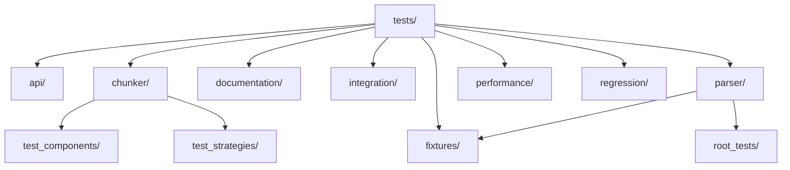

# Test Organization and Structure

<cite>
**Referenced Files in This Document**   
- [pytest.ini](file://pytest.ini)
- [conftest.py](file://tests/conftest.py)
- [test_readme_examples.py](file://tests/documentation/test_readme_examples.py)
- [test_bug_fixes.py](file://tests/chunker/test_bug_fixes.py)
- [test_full_pipeline.py](file://tests/integration/test_full_pipeline.py)
- [test_critical_fixes.py](file://tests/regression/test_critical_fixes.py)
- [test_fallback_manager.py](file://tests/chunker/test_components/test_fallback_manager.py)
- [test_benchmarks.py](file://tests/performance/test_benchmarks.py)
- [code_heavy.md](file://tests/fixtures/code_heavy.md)
- [edge_cases.md](file://tests/fixtures/edge_cases.md)
</cite>

## Table of Contents
1. [Introduction](#introduction)
2. [Test Directory Structure](#test-directory-structure)
3. [Test Categorization and Logical Grouping](#test-categorization-and-logical-grouping)
4. [Pytest Configuration](#pytest-configuration)
5. [Conftest.py and Shared Fixtures](#conftestpy-and-shared-fixtures)
6. [Test Markers and Categorization](#test-markers-and-categorization)
7. [Documentation Validation](#documentation-validation)
8. [Regression Testing](#regression-testing)
9. [Test Organization Guidelines](#test-organization-guidelines)

## Introduction

The test organization in the Dify Markdown Chunker project follows a comprehensive and well-structured approach that reflects the codebase architecture. The testing framework is designed to ensure high code quality, prevent regressions, and maintain documentation accuracy. This document provides a detailed overview of the test organization, directory structure, and the logical grouping of tests into various categories that align with the application's architecture and functionality.

The test suite comprises over 1366 tests that cover unit, integration, parser, chunker, API, and regression scenarios. The organization reflects a multi-layered testing strategy that validates functionality at different levels of the application stack, from individual components to end-to-end workflows. This structured approach enables systematic validation of the markdown parsing and chunking capabilities while ensuring robust error handling and performance characteristics.

## Test Directory Structure

The test directory structure is organized to reflect the application's architecture and facilitate easy navigation and maintenance. The top-level `tests` directory contains several subdirectories that group tests by their scope and functionality:



**Diagram sources**
- [tests/](file://tests/)

**Section sources**
- [tests/](file://tests/)

The directory structure follows a logical grouping that mirrors the application's components:

- **api/**: Contains tests for the API layer, including adapter, error handler, validator, and backward compatibility
- **chunker/**: Houses tests for the chunking functionality, including component tests and strategy-specific tests
- **documentation/**: Contains tests that validate documentation examples
- **fixtures/**: Stores test data and sample markdown documents for various test scenarios
- **integration/**: Contains end-to-end integration tests that validate the complete pipeline
- **parser/**: Contains tests for the markdown parsing functionality
- **performance/**: Contains benchmarks and performance tests
- **regression/**: Contains tests specifically designed to prevent recurrence of known issues

This organization allows developers to quickly locate relevant tests and understand the scope of testing for each component.

## Test Categorization and Logical Grouping

The tests are logically grouped into several categories that reflect different aspects of the application's functionality and testing objectives:

### Unit Tests
Unit tests focus on individual components and functions, validating their behavior in isolation. These tests are primarily located in the component-specific test directories such as `tests/chunker/test_components/` and `tests/parser/`. They verify the correctness of individual functions, classes, and methods, ensuring that each unit of code works as expected.

### Integration Tests
Integration tests validate the interaction between multiple components and the overall workflow of the application. Located in `tests/integration/`, these tests ensure that the different parts of the system work together correctly. The `test_full_pipeline.py` file contains comprehensive integration tests that validate the complete Stage 1 + Stage 2 pipeline, strategy selection, fallback chain, metadata accuracy, and performance consistency.

### Parser Tests
Parser tests, located in `tests/parser/`, focus on the markdown parsing functionality. These tests validate the accuracy of the AST (Abstract Syntax Tree) generation, element detection, and structural analysis. The tests cover various markdown elements including headers, lists, code blocks, tables, and nested structures, ensuring that the parser correctly identifies and processes all markdown syntax.

### Chunker Tests
Chunker tests, located in `tests/chunker/`, validate the chunking functionality and strategy implementation. These tests cover various chunking strategies including code, list, mixed, sentences, structural, and table strategies. The tests ensure that chunks are created according to the specified configuration, maintain content integrity, and preserve structural elements.

### API Tests
API tests, located in `tests/api/`, validate the API layer functionality including backward compatibility, error handling, and validation. These tests ensure that the API contracts are maintained and that deprecated functions continue to work as expected during the transition period.

### Regression Tests
Regression tests, located in `tests/regression/`, are specifically designed to prevent the recurrence of known issues. These tests validate that previously identified bugs and critical fixes continue to work correctly, providing confidence that fixes are permanent and not reintroduced in future changes.

### Performance Tests
Performance tests, located in `tests/performance/`, validate the performance characteristics of the application. These tests measure processing time, memory usage, and consistency across multiple runs, ensuring that the application meets performance requirements and does not introduce performance regressions.

**Section sources**
- [tests/](file://tests/)
- [tests/integration/test_full_pipeline.py](file://tests/integration/test_full_pipeline.py)
- [tests/performance/test_benchmarks.py](file://tests/performance/test_benchmarks.py)

## Pytest Configuration

The pytest configuration is defined in the `pytest.ini` file at the project root. This configuration file controls test discovery, output options, warning filtering, and test markers.

```ini
[pytest]
# Pytest configuration for dify-markdown-chunker plugin

# Test discovery
testpaths = tests
python_files = test_*.py
python_classes = Test*
python_functions = test_*

# Output options
addopts = 
    -v
    --tb=short
    --strict-markers

# Warning filters
filterwarnings =
    # Ignore gevent monkey-patching warning from dify_plugin
    ignore::gevent.monkey.MonkeyPatchWarning
    
    # Ignore Pydantic v1 deprecation warnings from dify_plugin
    ignore:Support for class-based.*:pydantic.warnings.PydanticDeprecatedSince20
    
    # Ignore deprecation warnings for chunk_with_analysis() and chunk_simple()
    # These are expected as we're testing the deprecated API
    ignore:chunk_with_analysis() is deprecated:DeprecationWarning
    ignore:chunk_simple() is deprecated:DeprecationWarning
    
    # Ignore all warnings from dify_plugin (alternative approach)
    # ignore::Warning:dify_plugin.*

# Markers
markers =
    slow: marks tests as slow (deselect with '-m "not slow"')
    integration: marks tests as integration tests
    unit: marks tests as unit tests
    blocker: marks tests that must pass for release (Phase 1 critical fixes)
```

**Diagram sources**
- [pytest.ini](file://pytest.ini)

**Section sources**
- [pytest.ini](file://pytest.ini)

The configuration includes several important settings:

- **Test Discovery**: Specifies that tests should be discovered in the `tests` directory, with test files named `test_*.py`, test classes named `Test*`, and test functions named `test_*`.
- **Output Options**: Configures verbose output (`-v`), short traceback format (`--tb=short`), and strict marker enforcement (`--strict-markers`) to ensure that only defined markers are used.
- **Warning Filters**: Suppresses specific warnings that are expected or irrelevant to the test suite, including gevent monkey-patching warnings, Pydantic deprecation warnings, and deprecation warnings for deprecated API functions.
- **Markers**: Defines custom markers for categorizing tests, including `slow`, `integration`, `unit`, and `blocker`.

The `blocker` marker is particularly important as it identifies tests that must pass for release, typically covering critical fixes from Phase 1 of development. This ensures that the most important functionality is always working correctly.

## Conftest.py and Shared Fixtures

The `conftest.py` file in the `tests/` directory provides shared configuration and fixtures for the test suite. This file is automatically discovered by pytest and its contents are available to all tests in the package.

```python
#!/usr/bin/env python3
"""
Shared test configuration and Hypothesis strategies for property-based testing.

This module provides:
- Hypothesis configuration (100+ iterations per property)
- Reusable markdown generators (headers, lists, code blocks, tables)
"""

from hypothesis import settings
from hypothesis import strategies as st

# Configure Hypothesis globally
settings.register_profile("default", max_examples=100, deadline=5000)
settings.load_profile("default")

# ============================================================================ 
# Markdown Structure Generators
# ============================================================================

@st.composite
def markdown_header(draw, min_level=1, max_level=6):
    """Generate a markdown header."""
    # Implementation details omitted for brevity

@st.composite
def markdown_paragraph(draw, min_size=20, max_size=200):
    """Generate a markdown paragraph."""
    # Implementation details omitted for brevity

@st.composite
def markdown_list(draw, min_items=1, max_items=10):
    """Generate a markdown list."""
    # Implementation details omitted for brevity

@st.composite
def markdown_code_block(draw, min_lines=1, max_lines=10):
    """Generate a markdown code block."""
    # Implementation details omitted for brevity

@st.composite
def markdown_table(draw, min_rows=2, max_rows=5, min_cols=2, max_cols=4):
    """Generate a markdown table."""
    # Implementation details omitted for brevity

@st.composite
def markdown_document(draw, min_sections=1, max_sections=5):
    """Generate a complete markdown document with various structures."""
    # Implementation details omitted for brevity

@st.composite
def nested_markdown_document(draw, max_depth=3):
    """Generate a markdown document with nested headers."""
    # Implementation details omitted for brevity
```

**Section sources**
- [tests/conftest.py](file://tests/conftest.py)

The `conftest.py` file serves several important purposes:

1. **Hypothesis Configuration**: Sets up property-based testing with 100 examples per test and a 5-second deadline to prevent tests from running indefinitely.

2. **Shared Fixtures**: Provides reusable test data generators for various markdown elements including headers, paragraphs, lists, code blocks, tables, and complete documents. These generators use the Hypothesis library to create diverse test cases that cover a wide range of inputs.

3. **Property-Based Testing**: Enables property-based testing by providing strategies for generating valid markdown content with specific characteristics. This allows tests to verify universal properties of the system rather than testing specific examples.

The shared fixtures and generators in `conftest.py` promote test consistency and reduce code duplication across test files. By providing standardized ways to generate test data, they ensure that tests across different modules use consistent data formats and edge cases.

Additionally, there is a `conftest.py` file in the `tests/parser/` directory that provides parser-specific configuration:

```python
"""
Pytest configuration with optional coverage support.

This configuration automatically enables coverage if pytest-cov is available,
but allows tests to run without it if the package is not installed.
"""

import sys

def pytest_configure(config):
    """Configure pytest with optional coverage."""
    try:
        # Check if pytest-cov is available without importing
        __import__("pytest_cov")

        # Only add coverage if not already specified and pytest-cov is available
        if not any("--cov" in arg for arg in sys.argv):
            # Add coverage options programmatically
            config.option.cov = ["stage1"]
            config.option.cov_report = ["html", "term-missing"]
            print("✓ Coverage enabled (pytest-cov available)")

    except ImportError:
        # pytest-cov not available - skip coverage
        print("ℹ Coverage disabled (pytest-cov not available)")

def pytest_addoption(parser):
    """Add custom pytest options."""
    # Don't add --no-cov as it's already provided by pytest-cov
    # Just add our custom options if needed

def pytest_collection_modifyitems(config, items):
    """Modify test collection if needed."""
    # Add any test collection modifications here if needed
```

This parser-specific configuration handles optional coverage reporting, enabling coverage metrics when `pytest-cov` is available but allowing tests to run without it when the package is not installed.

## Test Markers and Categorization

The test suite uses pytest markers to categorize tests and control their execution. The markers are defined in the `pytest.ini` file and include `unit`, `integration`, `slow`, and `blocker`.

### Unit Tests
Unit tests are marked with the `@pytest.mark.unit` decorator and focus on testing individual functions, classes, or methods in isolation. These tests typically have fast execution times and do not depend on external systems or complex setup. They validate the correctness of specific functionality and edge cases.

### Integration Tests
Integration tests are marked with the `@pytest.mark.integration` decorator and validate the interaction between multiple components. These tests ensure that the different parts of the system work together correctly and that data flows properly through the application. The integration tests in `tests/integration/` validate the complete pipeline from markdown input to chunked output.

### Blocker Tests
Blocker tests are marked with the `@pytest.mark.blocker` decorator and represent critical functionality that must work correctly for the system to be considered stable. These tests typically validate fixes for critical bugs or essential functionality that is fundamental to the application's purpose.

For example, in the `test_bug_fixes.py` file, tests are organized to validate specific bug fixes:

```python
class TestBLOCK1_TextConcatenation:
    """Test BLOCK-1: Text concatenation without whitespace preservation."""

    def test_russian_text_concatenation(self):
        """Test the original Russian text bug from the report."""
        # Test implementation details

class TestBLOCK2_WordSplitting:
    """Test BLOCK-2: Word splitting at chunk boundaries."""

    def test_truncate_at_word_boundary(self):
        """Test that truncation doesn't split words."""
        # Test implementation details

class TestBLOCK3_ContentDuplication:
    """Test BLOCK-3: Massive content duplication within and between chunks."""

    def test_internal_duplication_detection(self):
        """Test detection of duplication within a chunk."""
        # Test implementation details
```

**Section sources**
- [pytest.ini](file://pytest.ini)
- [tests/chunker/test_bug_fixes.py](file://tests/chunker/test_bug_fixes.py)

These tests are categorized by the specific bug they address, making it easy to identify which issues are being validated. The test names follow a clear pattern that describes the functionality being tested, promoting readability and maintainability.

The marker system allows for selective test execution based on categories. For example, developers can run only unit tests with `pytest -m unit`, only integration tests with `pytest -m integration`, or exclude slow tests with `pytest -m "not slow"`. This flexibility enables efficient testing workflows during development and continuous integration.

## Documentation Validation

The test suite includes specific tests to ensure documentation accuracy, with the primary file being `test_readme_examples.py` in the `tests/documentation/` directory. This test file validates that all examples in the README.md document work correctly, ensuring that the documentation remains accurate and up-to-date.

```python
#!/usr/bin/env python3
"""
Validate all documentation examples from README.md
"""

def test_basic_stage2_example():
    """Test the basic Stage 2 example from README"""
    # Test implementation details

def test_stage1_basic_example():
    """Test the basic Stage 1 example from README"""
    # Test implementation details

def test_comprehensive_stage2_example():
    """Test the comprehensive Stage 2 example from README"""
    # Test implementation details

def test_stage1_interface_example():
    """Test the Stage 1 interface example from README"""
    # Test implementation details

def test_advanced_stage1_example():
    """Test the advanced Stage 1 example from README"""
    # Test implementation details

def test_block_data_example():
    """Test the working with block data example from README"""
    # Test implementation details

def test_verification_steps():
    """Test the verification steps from README"""
    # Test implementation details
```

**Section sources**
- [tests/documentation/test_readme_examples.py](file://tests/documentation/test_readme_examples.py)

This test file contains several test functions, each validating a specific example from the README documentation:

- **Basic Stage 2 Example**: Tests the fundamental chunking functionality with a simple markdown input
- **Stage 1 Basic Example**: Validates the Stage 1 parser functionality for extracting fenced blocks
- **Comprehensive Stage 2 Example**: Tests a more complex markdown document with multiple elements including code blocks, tables, and lists
- **Stage 1 Interface Example**: Validates the Stage 1 interface for analyzing document structure
- **Advanced Stage 1 Example**: Tests advanced Stage 1 functionality including input normalization and nested block handling
- **Block Data Example**: Validates the properties of extracted code blocks including language, content, position, and nesting information
- **Verification Steps**: Tests the complete verification process described in the documentation

The `test_readme_examples.py` file serves as a living documentation test, ensuring that the examples provided to users actually work as described. This prevents the common problem of documentation becoming outdated or inaccurate as the codebase evolves. By automatically validating the documentation examples, the test suite provides confidence that users can follow the documentation and achieve the expected results.

Additionally, the test file includes a `main()` function that runs all documentation example validations and provides a summary of the results, making it easy to verify documentation accuracy as part of the development workflow.

## Regression Testing

Regression testing is a critical component of the test suite, designed to prevent the recurrence of known issues and ensure that fixes remain effective over time. The regression tests are located in the `tests/regression/` directory and focus on validating that previously identified bugs do not reappear in future versions.

The primary regression test file is `test_critical_fixes.py`, which specifically targets critical fixes that were identified during development:

```python
#!/usr/bin/env python3
"""Validate that P0 critical fixes work correctly."""
from markdown_chunker.chunker import MarkdownChunker

def test_mixed_strategy_lists():
    """Test MixedStrategy uses Stage 1 list data."""
    # Test implementation details

def test_mixed_strategy_tables():
    """Test MixedStrategy uses Stage 1 table data."""
    # Test implementation details

def test_list_strategy_integration():
    """Test ListStrategy uses Stage 1 list items."""
    # Test implementation details

def test_no_attribute_errors():
    """Test that no AttributeErrors occur."""
    # Test implementation details
```

**Section sources**
- [tests/regression/test_critical_fixes.py](file://tests/regression/test_critical_fixes.py)

These tests focus on preventing specific regression scenarios:

1. **Mixed Strategy Issues**: Tests that the MixedStrategy correctly uses Stage 1 list and table data, preventing AttributeError exceptions that could occur if the strategy fails to access required data.

2. **List Strategy Integration**: Validates that the ListStrategy properly integrates with Stage 1 list items, ensuring that list structure is preserved during chunking.

3. **Attribute Error Prevention**: Tests multiple scenarios to ensure that no AttributeError exceptions occur during chunking, which could indicate deeper issues with the strategy implementation.

The regression tests serve as a safety net that catches regressions early in the development process. By specifically testing for previously encountered issues, they provide confidence that fixes are permanent and that the application's stability improves over time rather than deteriorating.

The test organization reflects a proactive approach to quality assurance, where known issues are not just fixed but also protected against future recurrence. This approach is particularly important for critical functionality that could significantly impact users if it were to break.

## Test Organization Guidelines

Based on the analysis of the test suite, the following guidelines should be followed when adding new tests and maintaining organizational clarity:

### Directory Structure
When adding new tests, follow the existing directory structure:
- Place unit tests in the appropriate component directory (e.g., `tests/chunker/test_components/`)
- Place integration tests in `tests/integration/`
- Place parser-specific tests in `tests/parser/`
- Place performance tests in `tests/performance/`
- Place regression tests in `tests/regression/`

### Test Categorization
Categorize tests appropriately using the available markers:
- Use `@pytest.mark.unit` for tests that validate individual functions or methods
- Use `@pytest.mark.integration` for tests that validate workflows across multiple components
- Use `@pytest.mark.blocker` for tests that validate critical functionality or fixes
- Use `@pytest.mark.slow` for tests that have long execution times

### Test Naming
Follow consistent naming conventions:
- Use descriptive test function names that clearly indicate what is being tested
- Prefix test classes with `Test` followed by the feature or component being tested
- Use docstrings to provide additional context about the test purpose

### Test Structure
Follow the Arrange-Act-Assert pattern:
- **Arrange**: Set up the test environment and inputs
- **Act**: Execute the functionality being tested
- **Assert**: Verify the expected outcomes

### Shared Fixtures
Leverage existing fixtures and generators:
- Use the Hypothesis strategies in `conftest.py` for generating test data
- Reuse existing fixtures when possible to avoid duplication
- Add new shared fixtures to `conftest.py` when they will be used across multiple test files

### Documentation Tests
Ensure documentation accuracy:
- Add tests for new examples in the README or other documentation
- Verify that all code examples in documentation work as expected
- Update existing documentation tests when functionality changes

### Regression Prevention
Protect against regressions:
- Add regression tests for any bugs that are fixed
- Ensure that regression tests are specific enough to catch the exact issue
- Include regression tests in the critical path to prevent release of broken functionality

By following these guidelines, new tests will integrate seamlessly with the existing test suite, maintaining organizational clarity and ensuring comprehensive test coverage.

**Section sources**
- [pytest.ini](file://pytest.ini)
- [tests/conftest.py](file://tests/conftest.py)
- [tests/documentation/test_readme_examples.py](file://tests/documentation/test_readme_examples.py)
- [tests/regression/test_critical_fixes.py](file://tests/regression/test_critical_fixes.py)