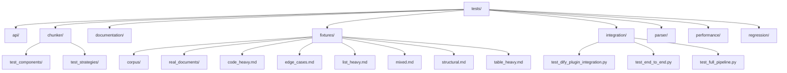
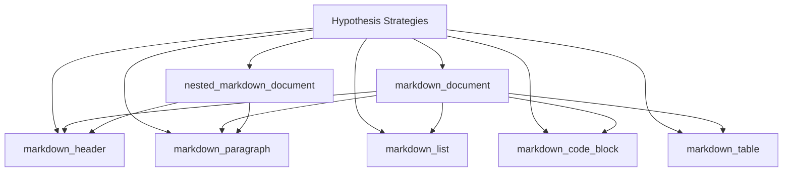

# Testing Strategy

<cite>
**Referenced Files in This Document**   
- [conftest.py](file://tests/conftest.py)
- [pytest.ini](file://pytest.ini)
- [test_dependencies.py](file://tests/test_dependencies.py)
- [test_entry_point.py](file://tests/test_entry_point.py)
- [test_chunker.py](file://tests/chunker/test_chunker.py)
- [test_dify_plugin_integration.py](file://tests/integration/test_dify_plugin_integration.py)
- [test_fallback_manager.py](file://tests/chunker/test_components/test_fallback_manager.py)
- [test_code_strategy.py](file://tests/chunker/test_strategies/test_code_strategy.py)
- [test_benchmarks.py](file://tests/performance/test_benchmarks.py)
- [test_readme_examples.py](file://tests/documentation/test_readme_examples.py)
</cite>

## Table of Contents
1. [Introduction](#introduction)
2. [Testing Framework and Configuration](#testing-framework-and-configuration)
3. [Test Organization and Discovery](#test-organization-and-discovery)
4. [Multi-Layered Testing Approach](#multi-layered-testing-approach)
5. [Property-Based Testing with Hypothesis](#property-based-testing-with-hypothesis)
6. [Component-Specific Testing Patterns](#component-specific-testing-patterns)
7. [Integration and End-to-End Testing](#integration-and-end-to-end-testing)
8. [External Dependency and Interface Validation](#external-dependency-and-interface-validation)
9. [Performance and Benchmark Testing](#performance-and-benchmark-testing)
10. [Documentation and Example Validation](#documentation-and-example-validation)
11. [Best Practices for Writing Tests](#best-practices-for-writing-tests)
12. [Common Testing Challenges](#common-testing-challenges)

## Introduction

The testing strategy for the Dify Markdown Chunker plugin is a comprehensive, multi-layered approach designed to ensure reliability, correctness, and performance across all components of the system. The test suite is built on the pytest framework and encompasses unit tests, integration tests, and end-to-end tests that validate functionality at multiple levels. The strategy emphasizes property-based testing using Hypothesis to generate diverse test cases, ensuring robustness against edge cases and unexpected inputs. Tests are organized by component (parser, chunker, integration) with shared fixtures and configuration managed through conftest.py files at multiple levels of the test hierarchy. This documentation provides a detailed overview of the testing architecture, organization, and best practices that ensure the quality and reliability of the plugin.

## Testing Framework and Configuration

The testing framework is built on pytest, configured through the pytest.ini file which defines test discovery paths, file patterns, and output options. The configuration specifies that tests should be discovered in the "tests" directory, with test files following the "test_*.py" pattern, test classes prefixed with "Test*", and test functions prefixed with "test_". The configuration includes verbose output (-v) and short traceback format (--tb=short) for better readability. Warning filters are configured to ignore specific warnings from dependencies like gevent and Pydantic, as well as deprecation warnings for legacy API functions that are intentionally tested. Custom markers are defined for categorizing tests as "slow", "integration", "unit", or "blocker" (critical for release). The conftest.py file in the root tests directory provides shared configuration and Hypothesis strategies for property-based testing, setting a global maximum of 100 examples per property test with a 5-second deadline. This configuration ensures consistent test execution across the codebase while allowing for optional coverage reporting when pytest-cov is available.

**Section sources**
- [pytest.ini](file://pytest.ini#L1-L38)
- [conftest.py](file://tests/conftest.py#L1-L220)

## Test Organization and Discovery

Tests are organized in a hierarchical structure that mirrors the component architecture of the application, with top-level directories for api, chunker, documentation, fixtures, integration, parser, performance, and regression testing. The chunker directory contains subdirectories for components and strategies, with corresponding test directories that follow the same structure. This organization enables focused testing of specific components while maintaining clear separation of concerns. Test discovery is automated through pytest configuration, which identifies test files based on naming conventions and executes them according to their categorization. The fixtures directory contains sample Markdown documents of varying complexity, including code-heavy, edge-case, mixed-content, simple, and structured documents that are used across multiple test suites. These fixtures provide consistent test data for validating functionality across different scenarios. The integration tests directory contains end-to-end test cases that validate the complete workflow from input to output, ensuring that components work together as expected in real-world scenarios.

**Diagram sources**
- [tests/](file://tests/)
- [tests/fixtures/](file://tests/fixtures/)

## Multi-Layered Testing Approach

The testing strategy employs a multi-layered approach with distinct levels of testing that validate different aspects of the system. Unit tests focus on individual components and functions, verifying their correctness in isolation with mocked dependencies. Integration tests validate the interaction between components, ensuring that data flows correctly through the system and that interfaces are properly implemented. End-to-end tests simulate real-world usage scenarios, validating the complete workflow from input to output. The chunker component, for example, has unit tests that validate individual strategies (code, list, table, structural) in isolation, integration tests that verify the interaction between the chunker and parser components, and end-to-end tests that validate the complete chunking process. This layered approach ensures comprehensive coverage while maintaining test efficiency, as lower-level tests can quickly identify issues in specific components without the overhead of full system execution. The test suite also includes specialized test categories such as performance tests, regression tests, and documentation tests that validate specific quality attributes of the system.

**Section sources**
- [test_chunker.py](file://tests/chunker/test_chunker.py#L1-L305)
- [test_dify_plugin_integration.py](file://tests/integration/test_dify_plugin_integration.py#L1-L398)

## Property-Based Testing with Hypothesis

Property-based testing is implemented using the Hypothesis library, which generates diverse test cases automatically based on defined strategies. The conftest.py file in the root tests directory defines reusable strategies for generating various Markdown structures, including headers, paragraphs, lists, code blocks, tables, and complete documents. These strategies allow tests to validate that the system behaves correctly across a wide range of inputs, not just the specific examples provided by developers. For example, the markdown_document strategy generates complete Markdown documents with various sections, headers, and content types, enabling tests to verify that the chunker handles complex, realistic documents correctly. The nested_markdown_document strategy generates documents with nested headers, testing the system's ability to handle hierarchical structures. These property-based tests are particularly valuable for identifying edge cases and ensuring that the system maintains invariants across different input patterns. By testing properties rather than specific examples, this approach provides stronger guarantees of correctness and robustness.

**Diagram sources**
- [conftest.py](file://tests/conftest.py#L23-L220)

## Component-Specific Testing Patterns

Different components employ specific testing patterns tailored to their functionality and requirements. The chunker component uses mock objects extensively to isolate the component under test from its dependencies, particularly the parser interface. Test cases for the FallbackManager, for example, use mock strategies that can be configured to succeed, fail, or return empty results, allowing comprehensive testing of the fallback chain under various conditions. The CodeStrategy tests validate both the strategy's ability to detect code-heavy content and its chunking behavior, using mock analysis objects with specific code ratios and block counts. The parser component tests focus on the correct extraction of Markdown elements like fenced blocks, headers, and tables, with fixtures that include edge cases such as complex table alignments, nested code blocks, and mixed fence lengths. These component-specific patterns ensure that each part of the system is thoroughly tested according to its unique requirements and failure modes.

**Section sources**
- [test_fallback_manager.py](file://tests/chunker/test_components/test_fallback_manager.py#L1-L371)
- [test_code_strategy.py](file://tests/chunker/test_strategies/test_code_strategy.py#L1-L596)

## Integration and End-to-End Testing

Integration and end-to-end tests validate the complete workflow of the system, ensuring that components work together as expected in realistic scenarios. The integration tests directory contains test cases that simulate the complete Dify plugin workflow, from tool invocation with Dify-style inputs to output format validation. These tests verify that the system handles various input scenarios correctly, including empty input, whitespace-only input, and large documents. The test_dify_plugin_integration.py file contains comprehensive tests that validate the plugin's behavior when invoked through the Dify platform, ensuring that output formats match Dify's expectations and that metadata filtering works end-to-end. The test_full_pipeline.py file validates the complete processing pipeline, from input parsing through chunking to output generation, ensuring that data integrity is maintained throughout the process. These tests also validate error handling scenarios, ensuring that the system provides meaningful error messages when inputs are invalid or processing fails.

**Section sources**
- [test_dify_plugin_integration.py](file://tests/integration/test_dify_plugin_integration.py#L1-L398)
- [test_full_pipeline.py](file://tests/integration/test_full_pipeline.py#L1-L200)

## External Dependency and Interface Validation

The test suite includes specific tests for validating external dependencies and interface contracts. The test_dependencies.py file verifies that all required dependencies are specified in the requirements.txt file and can be imported successfully. This includes checking for the presence of dify_plugin==0.5.0b15, markdown-it-py>=3.0.0, and pydantic>=2.0.0 in the requirements file, as well as verifying that these packages can be imported without errors. The test_entry_point.py file validates the structure and correctness of the main.py entry point, ensuring that it has valid Python syntax, contains required imports, properly configures the timeout, instantiates the plugin correctly, and includes the if __name__ == '__main__' guard. These tests also verify that the module can be imported without executing global code and that it has a descriptive docstring. This comprehensive validation ensures that the plugin meets all interface requirements and can be deployed successfully in the target environment.

**Section sources**
- [test_dependencies.py](file://tests/test_dependencies.py#L1-L95)
- [test_entry_point.py](file://tests/test_entry_point.py#L1-L240)

## Performance and Benchmark Testing

Performance and benchmark tests ensure that the system meets its performance requirements and can handle documents of various sizes efficiently. The test_benchmarks.py file contains performance tests that measure processing time for small, medium, and large documents, with targets for acceptable execution times. These tests create test documents of different sizes and measure the time required to process them, validating that performance remains within acceptable limits. The benchmarking process includes a warm-up phase to account for any initialization overhead, followed by timing measurements for actual processing. Memory usage is also validated to ensure that the system does not have memory leaks or excessive memory consumption. The tests process multiple documents in sequence to check for consistent performance and memory usage patterns. These performance tests are critical for ensuring that the plugin can handle real-world workloads without degrading system performance or consuming excessive resources.

**Section sources**
- [test_benchmarks.py](file://tests/performance/test_benchmarks.py#L1-L319)

## Documentation and Example Validation

The test suite includes tests that validate the accuracy of documentation and examples, ensuring that users can follow the provided guidance successfully. The test_readme_examples.py file contains tests that execute code examples from the README documentation, verifying that they work as described. These tests cover basic and comprehensive examples for both Stage 1 and Stage 2 processing, ensuring that users can reproduce the documented behavior. The tests validate that the chunker can be instantiated, that it processes input correctly, and that the results contain expected properties like chunk count, strategy used, and processing time. They also verify that individual chunks have valid metadata such as content type, line numbers, and size. By automatically testing the documentation examples, this approach ensures that the documentation remains accurate and up-to-date as the code evolves, reducing the risk of users encountering issues when following the provided guidance.

**Section sources**
- [test_readme_examples.py](file://tests/documentation/test_readme_examples.py#L1-L287)

## Best Practices for Writing Tests

The test suite follows several best practices for writing effective and maintainable tests. Tests are organized by component and functionality, with clear naming conventions that describe what is being tested and the expected outcome. Each test focuses on a single aspect of functionality, making it easier to identify the cause of failures. Mock objects are used judiciously to isolate components under test while still validating their interactions with dependencies. Property-based testing is used to generate diverse test cases automatically, increasing coverage and identifying edge cases that might be missed with example-based testing. Tests are categorized using pytest markers to indicate their type (unit, integration, slow) and importance (blocker), allowing for selective execution based on context. The use of shared fixtures and configuration through conftest.py files reduces duplication and ensures consistency across tests. Tests also follow the arrange-act-assert pattern, making their structure clear and their intent easy to understand.

**Section sources**
- [test_chunker.py](file://tests/chunker/test_chunker.py#L1-L305)
- [test_fallback_manager.py](file://tests/chunker/test_components/test_fallback_manager.py#L1-L371)

## Common Testing Challenges

The test suite addresses several common testing challenges, particularly around mocking external dependencies and managing test state. The use of unittest.mock allows tests to simulate various scenarios, such as parser failures or strategy exceptions, without requiring complex setup or external services. The FallbackManager tests, for example, use mock strategies that can be configured to fail or return empty results, enabling comprehensive testing of the fallback chain under various conditions. Managing test state is addressed through pytest fixtures that set up and tear down test environments consistently. The conftest.py files at multiple levels of the test hierarchy provide shared setup and teardown logic, ensuring that tests start with a clean state and do not interfere with each other. The test_entry_point.py file demonstrates sophisticated state management by temporarily modifying sys.path to import the main module and using patch to prevent actual plugin execution while still validating the import process. These approaches ensure that tests are reliable, repeatable, and isolated from each other.

**Section sources**
- [test_entry_point.py](file://tests/test_entry_point.py#L1-L240)
- [test_fallback_manager.py](file://tests/chunker/test_components/test_fallback_manager.py#L1-L371)