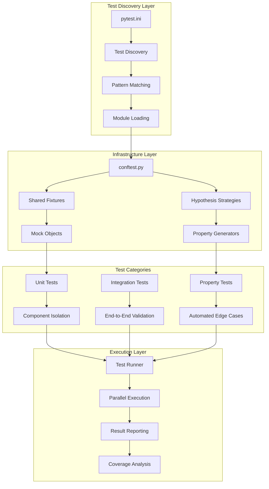
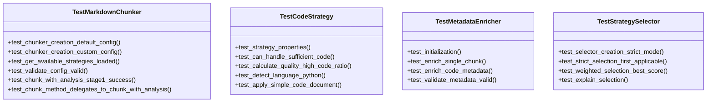
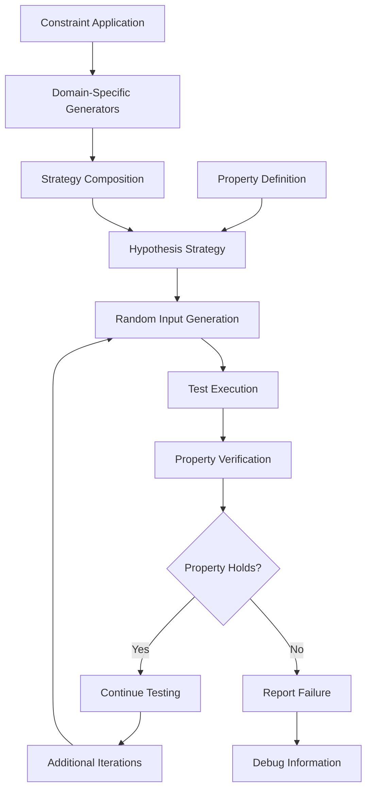

# Unit Testing Strategy

<cite>
**Referenced Files in This Document**
- [pytest.ini](file://pytest.ini)
- [tests/conftest.py](file://tests/conftest.py)
- [tests/chunker/test_chunker.py](file://tests/chunker/test_chunker.py)
- [tests/chunker/test_strategies/test_code_strategy.py](file://tests/chunker/test_strategies/test_code_strategy.py)
- [tests/chunker/test_components/test_metadata_enricher.py](file://tests/chunker/test_components/test_metadata_enricher.py)
- [tests/chunker/test_strategy_selector.py](file://tests/chunker/test_strategy_selector.py)
- [tests/chunker/test_mixed_strategy.py](file://tests/chunker/test_mixed_strategy.py)
- [tests/chunker/test_structural_strategy.py](file://tests/chunker/test_structural_strategy.py)
- [tests/chunker/test_code_strategy_properties.py](file://tests/chunker/test_code_strategy_properties.py)
- [tests/chunker/test_mixed_strategy_properties.py](file://tests/chunker/test_mixed_strategy_properties.py)
- [tests/integration/test_full_pipeline.py](file://tests/integration/test_full_pipeline.py)
- [tests/chunker/test_integration.py](file://tests/chunker/test_integration.py)
- [tests/parser/test_core.py](file://tests/parser/test_core.py)
</cite>

## Table of Contents
1. [Introduction](#introduction)
2. [Testing Framework Architecture](#testing-framework-architecture)
3. [Test Discovery and Execution](#test-discovery-and-execution)
4. [Shared Test Infrastructure](#shared-test-infrastructure)
5. [Unit Test Patterns](#unit-test-patterns)
6. [Property-Based Testing](#property-based-testing)
7. [Component Isolation Strategies](#component-isolation-strategies)
8. [Best Practices](#best-practices)
9. [Edge Case Coverage](#edge-case-coverage)
10. [Performance Considerations](#performance-considerations)
11. [Validation and Quality Assurance](#validation-and-quality-assurance)

## Introduction

The dify-markdown-chunker project employs a comprehensive unit testing strategy that combines traditional unit tests with advanced property-based testing approaches. This dual-layer testing methodology ensures robust validation of core functionality while maintaining flexibility for complex edge cases and boundary conditions.

The testing framework is built around pytest as the primary test runner, utilizing Hypothesis for sophisticated property-based testing that generates thousands of test cases automatically. This approach enables exhaustive validation of chunking algorithms, strategy selection logic, and metadata enrichment processes.

## Testing Framework Architecture

The testing infrastructure follows a layered architecture that separates concerns between unit testing, integration testing, and property-based validation:

**Diagram sources**
- [pytest.ini](file://pytest.ini#L1-L38)
- [tests/conftest.py](file://tests/conftest.py#L1-L220)

**Section sources**
- [pytest.ini](file://pytest.ini#L1-L38)
- [tests/conftest.py](file://tests/conftest.py#L1-L220)

## Test Discovery and Execution

The pytest configuration establishes comprehensive test discovery patterns that automatically locate and execute all test cases across the project structure:

### Test Pattern Configuration

The framework uses flexible pattern matching to discover test files, classes, and functions:

- **File Pattern**: `test_*.py` - Matches all files prefixed with "test_"
- **Class Pattern**: `Test*` - Identifies test classes following pytest conventions
- **Function Pattern**: `test_*` - Recognizes individual test methods

### Execution Control

Test execution incorporates several control mechanisms:

- **Verbose Output**: `-v` flag provides detailed progress reporting
- **Short Tracebacks**: `--tb=short` reduces noise in error reporting
- **Strict Markers**: `--strict-markers` enforces marker validation
- **Warning Filtering**: Automatic suppression of known warnings from external dependencies

### Test Markers

The framework defines specialized markers for different test categories:

- `slow`: Tests requiring extended execution time
- `integration`: Integration and end-to-end tests
- `unit`: Standard unit test cases
- `blocker`: Critical tests essential for release validation

**Section sources**
- [pytest.ini](file://pytest.ini#L1-L38)

## Shared Test Infrastructure

The `conftest.py` module serves as the central hub for shared testing infrastructure, providing reusable fixtures and Hypothesis strategies that enable consistent test data generation across the entire test suite.

### Hypothesis Configuration

Hypothesis is configured with optimized parameters for property-based testing:

- **Max Examples**: 100 iterations per property test
- **Deadline**: 5000ms timeout per test case
- **Global Profile**: Default configuration applied consistently

### Markdown Generator Strategies

The framework provides sophisticated strategies for generating realistic markdown content:

#### Header Generation
Generates hierarchical markdown headers with configurable depth levels (1-6) and content validation to ensure proper formatting and readability.

#### Paragraph Generation  
Creates realistic text paragraphs with character filtering to maintain valid markdown content while avoiding problematic sequences.

#### List Generation
Produces both ordered and unordered lists with configurable item counts and content validation to ensure proper list structure.

#### Code Block Generation
Generates fenced code blocks with language detection support and realistic code content generation for multiple programming languages.

#### Table Generation
Creates well-formed markdown tables with dynamic column and row count, header validation, and proper alignment handling.

#### Document Generation
Combines multiple markdown elements into complete documents with realistic structure and content distribution.

### Advanced Document Generation

The framework includes specialized strategies for complex document scenarios:

- **Nested Documents**: Documents with hierarchical header structures
- **Mixed Content Documents**: Documents combining multiple element types
- **Realistic Scenarios**: Production-like content with varied complexity

**Section sources**
- [tests/conftest.py](file://tests/conftest.py#L1-L220)

## Unit Test Patterns

The project demonstrates sophisticated unit testing patterns that isolate components while maintaining comprehensive coverage of core functionality.

### Test Organization Patterns

#### Class-Based Test Organization
Each major component has dedicated test classes that encapsulate related functionality:

**Diagram sources**
- [tests/chunker/test_chunker.py](file://tests/chunker/test_chunker.py#L38-L305)
- [tests/chunker/test_strategies/test_code_strategy.py](file://tests/chunker/test_strategies/test_code_strategy.py#L15-L596)
- [tests/chunker/test_components/test_metadata_enricher.py](file://tests/chunker/test_components/test_metadata_enricher.py#L11-L372)
- [tests/chunker/test_strategy_selector.py](file://tests/chunker/test_strategy_selector.py#L51-L438)

### Mocking and Dependency Isolation

The framework extensively uses mocking to isolate components during testing:

#### Mock Creation Patterns
- **Specification-based Mocks**: Using `Mock(spec=...)` to ensure interface compliance
- **Attribute Injection**: Dynamically adding required attributes to mocks
- **Behavior Configuration**: Setting up return values and side effects for controlled testing

#### Integration Testing with Mocks
Components are tested in isolation while simulating external dependencies:

- **Parser Interface Mocking**: Simulating Stage 1 processing for Strategy tests
- **Stage 1 Results Mocking**: Providing controlled analysis data for chunking tests
- **External Service Mocking**: Isolating business logic from external dependencies

### Assertion Patterns

The framework employs comprehensive assertion strategies:

#### Type and Attribute Assertions
Verifying component initialization and configuration:
- Object instantiation success
- Property value verification
- Method signature compliance

#### Behavioral Assertions
Testing component behavior under various conditions:
- Success scenario validation
- Failure scenario handling
- Boundary condition testing

#### State Transition Assertions
Ensuring proper state management:
- Initialization state verification
- Processing state transitions
- Cleanup state validation

**Section sources**
- [tests/chunker/test_chunker.py](file://tests/chunker/test_chunker.py#L18-L305)
- [tests/chunker/test_strategies/test_code_strategy.py](file://tests/chunker/test_strategies/test_code_strategy.py#L15-L596)

## Property-Based Testing

The project implements sophisticated property-based testing using Hypothesis to automatically generate test cases that validate fundamental properties of the chunking system.

### Property-Based Testing Architecture

**Diagram sources**
- [tests/chunker/test_code_strategy_properties.py](file://tests/chunker/test_code_strategy_properties.py#L1-L200)
- [tests/chunker/test_mixed_strategy_properties.py](file://tests/chunker/test_mixed_strategy_properties.py#L1-L200)

### Code Strategy Properties

The code strategy property tests validate fundamental correctness properties:

#### Code Block Integrity Property
Ensures that code blocks are never split across chunks, maintaining atomicity:

- **Property**: Each code block appears in exactly one chunk
- **Validation**: Checks chunk containment for all original code blocks
- **Edge Cases**: Handles oversized blocks and partial containment scenarios

#### Code Metadata Preservation Property
Verifies that code chunks receive appropriate metadata:

- **Language Detection**: Ensures proper language identification
- **Function Extraction**: Validates function and class name detection
- **Strategy Attribution**: Confirms strategy metadata assignment

### Mixed Strategy Properties

Mixed strategy property tests validate handling of documents with multiple content types:

#### Multi-Content Type Detection
Tests ability to identify and handle documents with diverse content elements:

- **Content Type Recognition**: Proper identification of code, lists, tables, and text
- **Strategy Selection**: Appropriate strategy choice based on content composition
- **Boundary Preservation**: Maintaining logical section boundaries

#### Content Preservation Across Strategies
Ensures that content remains intact when processed by different strategies:

- **Atomic Sections**: Preventing content fragmentation
- **Metadata Consistency**: Maintaining metadata integrity across strategy transitions
- **Quality Metrics**: Preserving content quality indicators

### Property Test Implementation Patterns

#### Strategy Composition
Advanced strategies combine multiple generators to create realistic test scenarios:

- **Composite Strategies**: Building complex documents from simpler elements
- **Constraint Application**: Applying domain-specific constraints to generated content
- **Validation Integration**: Incorporating validation logic into property definitions

#### Failure Analysis
Property tests include sophisticated failure reporting:

- **Minimal Counterexamples**: Finding the simplest failing case
- **Debug Information**: Providing context for failure investigation
- **Reproduction Scripts**: Enabling easy reproduction of discovered issues

**Section sources**
- [tests/chunker/test_code_strategy_properties.py](file://tests/chunker/test_code_strategy_properties.py#L1-L200)
- [tests/chunker/test_mixed_strategy_properties.py](file://tests/chunker/test_mixed_strategy_properties.py#L1-L200)

## Component Isolation Strategies

The testing framework implements comprehensive isolation strategies to ensure that individual components can be tested independently while maintaining realistic interaction scenarios.

### Strategy Selection Isolation

The StrategySelector component is tested in isolation while simulating various content analysis scenarios:

#### Priority-Based Selection Testing
- **Strict Mode**: Verifies priority-based selection logic
- **Weighted Mode**: Tests combined priority and quality scoring
- **Fallback Behavior**: Validates emergency fallback mechanisms

#### Strategy Validation Testing
- **Configuration Validation**: Ensures proper strategy configuration
- **Duplicate Detection**: Identifies conflicting strategy definitions
- **Completeness Verification**: Validates complete strategy sets

### Metadata Enricher Isolation

The MetadataEnricher component undergoes comprehensive isolation testing:

#### Content-Type Specific Testing
Different content types receive specialized metadata enrichment:

- **Code Metadata**: Language detection, function extraction, and code statistics
- **List Metadata**: Item counting, nesting detection, and structure analysis
- **Table Metadata**: Row/column counting and table statistics
- **Structural Metadata**: Header analysis and document structure metrics

#### Statistical Calculation Testing
Verifies accurate content analysis:

- **Word Counting**: Precise word boundary detection
- **Line Counting**: Reliable line break identification
- **Character Statistics**: Accurate character and average length calculations

### Component Interaction Testing

While components are isolated, the framework also tests their interactions:

#### Pipeline Integration Testing
End-to-end testing validates complete processing pipelines:

- **Stage 1 Integration**: Parser interface testing
- **Strategy Selection**: Dynamic strategy choice based on content analysis
- **Metadata Flow**: Complete metadata enrichment throughout the pipeline

#### Error Handling Integration
Tests error propagation and recovery mechanisms:

- **Failure Cascading**: How failures propagate through the pipeline
- **Graceful Degradation**: Fallback mechanisms and error recovery
- **Error Reporting**: Comprehensive error information and debugging support

**Section sources**
- [tests/chunker/test_strategy_selector.py](file://tests/chunker/test_strategy_selector.py#L51-L438)
- [tests/chunker/test_components/test_metadata_enricher.py](file://tests/chunker/test_components/test_metadata_enricher.py#L11-L372)

## Best Practices

The testing framework embodies several best practices that ensure maintainable, reliable, and comprehensive test suites.

### Test Granularity

#### Component-Level Testing
Individual components receive focused testing that validates specific functionality:

- **Single Responsibility**: Each test focuses on one aspect of component behavior
- **Clear Objectives**: Test goals are clearly defined and measurable
- **Focused Assertions**: Assertions target specific behaviors and outcomes

#### Integration-Level Testing
Higher-level integration tests validate component interactions:

- **End-to-End Scenarios**: Complete workflow validation
- **Cross-Component Dependencies**: Interaction testing between components
- **Pipeline Validation**: Complete processing pipeline verification

### Dependency Management

#### Mock Strategy Consistency
Consistent mocking patterns ensure reliable test isolation:

- **Specification-Based Mocks**: Interface compliance validation
- **Behavioral Mocking**: Controlled behavior simulation
- **State Management**: Mock state consistency across test runs

#### Fixture Reuse
Shared test infrastructure promotes consistency:

- **Reusable Strategies**: Common test data generators
- **Shared Fixtures**: Consistent test environment setup
- **Configuration Management**: Centralized test configuration

### Test Maintenance

#### Clear Naming Conventions
Test methods follow descriptive naming patterns:

- **Descriptive Names**: Method names clearly indicate test purpose
- **Behavioral Focus**: Names emphasize observed behavior rather than implementation
- **Hierarchical Organization**: Test organization reflects functional grouping

#### Documentation Integration
Tests serve as living documentation:

- **Inline Comments**: Explanation of complex test logic
- **Property Documentation**: Clear specification of property-based tests
- **Example Usage**: Demonstrations of component usage patterns

**Section sources**
- [tests/chunker/test_chunker.py](file://tests/chunker/test_chunker.py#L38-L305)
- [tests/chunker/test_strategies/test_code_strategy.py](file://tests/chunker/test_strategies/test_code_strategy.py#L15-L596)

## Edge Case Coverage

The testing framework comprehensively covers edge cases that could impact production reliability and system stability.

### Content Analysis Edge Cases

#### Empty Content Handling
Robust handling of edge cases involving minimal or empty content:

- **Empty Strings**: Graceful handling of zero-length content
- **Whitespace Only**: Proper treatment of whitespace-only documents
- **Malformed Headers**: Validation of malformed header structures

#### Extreme Content Ratios
Testing behavior with extreme content distributions:

- **Pure Code Documents**: Documents with 100% code content
- **Pure Text Documents**: Documents with minimal markup
- **Balanced Mixtures**: Equal distribution across content types

### Strategy Selection Edge Cases

#### Threshold Boundary Conditions
Testing strategy selection at configuration thresholds:

- **Minimum Ratios**: Just meeting minimum content ratio requirements
- **Maximum Ratios**: Approaching maximum content ratio limits
- **Tie Conditions**: Resolving ties between competing strategies

#### Complexity Edge Cases
Handling documents with varying complexity levels:

- **Low Complexity**: Simple documents with minimal structure
- **High Complexity**: Documents with extensive nesting and structure
- **Mixed Complexity**: Documents with varying complexity sections

### Performance Edge Cases

#### Large Document Handling
Testing performance with large-scale content:

- **Memory Constraints**: Handling memory limitations gracefully
- **Processing Timeouts**: Managing long-running operations
- **Resource Exhaustion**: Graceful degradation under resource pressure

#### Concurrent Processing
Testing concurrent operation scenarios:

- **Thread Safety**: Ensuring thread-safe operations
- **Race Conditions**: Detecting and preventing race conditions
- **Resource Contention**: Managing shared resource access

**Section sources**
- [tests/chunker/test_integration.py](file://tests/chunker/test_integration.py#L1-L200)
- [tests/chunker/test_chunker.py](file://tests/chunker/test_chunker.py#L224-L305)

## Performance Considerations

The testing framework incorporates performance considerations that ensure efficient test execution while maintaining comprehensive coverage.

### Test Execution Optimization

#### Parallel Execution
Tests are designed to execute efficiently in parallel:

- **Independent Tests**: Tests that don't share state or resources
- **Resource Isolation**: Proper resource management prevents conflicts
- **Load Balancing**: Even distribution of test execution load

#### Memory Management
Efficient memory usage during test execution:

- **Fixture Cleanup**: Proper cleanup of test resources
- **Object Reuse**: Strategic reuse of expensive objects
- **Garbage Collection**: Minimal garbage collection overhead

### Property Test Performance

#### Strategy Optimization
Optimized strategies for property-based testing:

- **Constraint Filtering**: Early elimination of invalid test cases
- **Generation Efficiency**: Efficient random data generation
- **Validation Optimization**: Fast property validation algorithms

#### Iteration Management
Balanced iteration counts for comprehensive coverage:

- **Reasonable Limits**: Sufficient iterations without excessive runtime
- **Progress Monitoring**: Tracking test progress and completion
- **Timeout Management**: Preventing infinite loops and excessive delays

### Resource Utilization

#### CPU Usage Optimization
Efficient CPU utilization during testing:

- **Algorithmic Efficiency**: Optimized algorithms for test data generation
- **Computational Complexity**: Managing computational requirements
- **Scalability Considerations**: Performance scaling with test complexity

#### I/O Operation Minimization
Reduced I/O operations for faster execution:

- **File Access**: Minimal file system operations
- **Network Calls**: Isolated network-dependent tests
- **External Dependencies**: Reduced external system dependencies

**Section sources**
- [pytest.ini](file://pytest.ini#L1-L38)
- [tests/chunker/test_code_strategy_properties.py](file://tests/chunker/test_code_strategy_properties.py#L96-L200)

## Validation and Quality Assurance

The testing framework implements comprehensive validation mechanisms to ensure code quality and system reliability.

### Automated Quality Metrics

#### Coverage Analysis
Comprehensive code coverage measurement:

- **Line Coverage**: Percentage of executable lines covered
- **Branch Coverage**: Condition coverage for all branches
- **Function Coverage**: Function-level coverage validation

#### Quality Gates
Automated quality checks prevent regressions:

- **Performance Regression**: Detection of performance degradation
- **Bug Regression**: Prevention of previously fixed bugs
- **Compatibility Issues**: Validation of backward compatibility

### Continuous Integration Validation

#### Pipeline Integration
Seamless integration with continuous integration systems:

- **Automated Execution**: Unattended test execution
- **Result Reporting**: Comprehensive test result reporting
- **Failure Notification**: Immediate notification of test failures

#### Artifact Validation
Comprehensive artifact validation:

- **Build Artifacts**: Validation of compiled artifacts
- **Documentation**: Documentation completeness verification
- **Configuration**: Configuration file validation

### Debugging and Diagnostics

#### Test Failure Analysis
Sophisticated failure analysis capabilities:

- **Minimal Counterexamples**: Finding the simplest failing case
- **Context Information**: Rich diagnostic information
- **Reproduction Scripts**: Easy test case reproduction

#### Performance Profiling
Built-in performance profiling capabilities:

- **Execution Timing**: Detailed timing information
- **Resource Usage**: Memory and CPU usage monitoring
- **Bottleneck Identification**: Performance bottleneck detection

**Section sources**
- [tests/integration/test_full_pipeline.py](file://tests/integration/test_full_pipeline.py#L1-L200)
- [tests/chunker/test_integration.py](file://tests/chunker/test_integration.py#L1-L200)