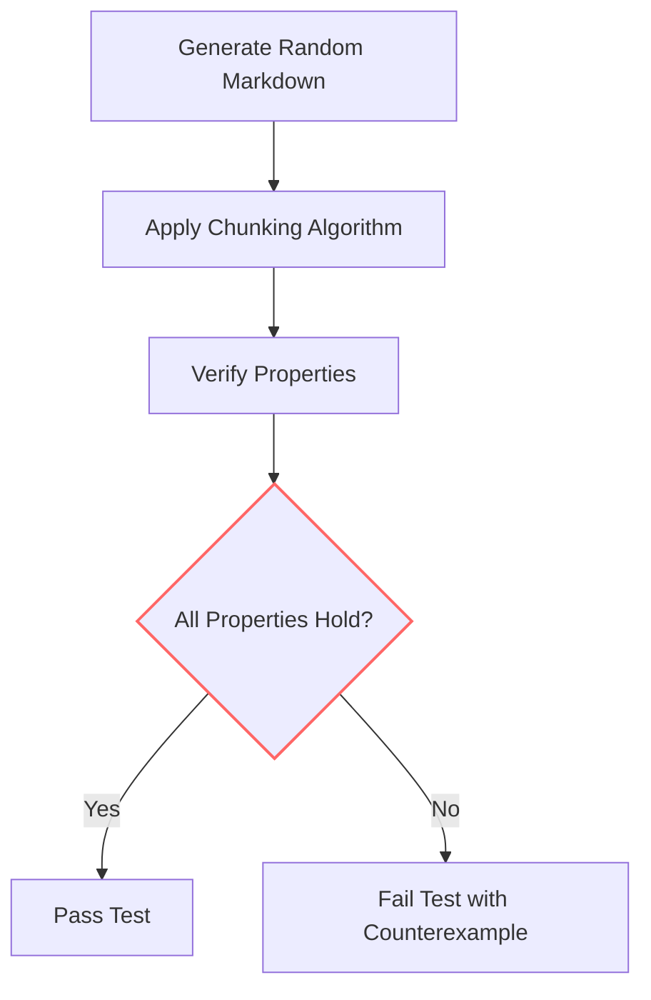
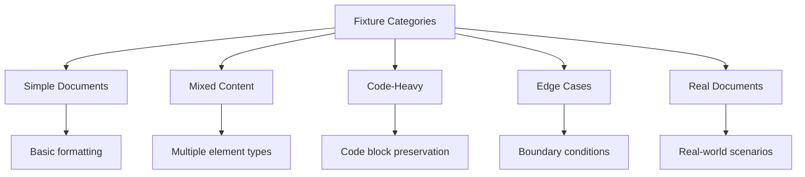
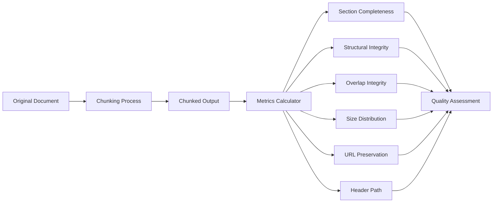

# Testing and Quality

<cite>
**Referenced Files in This Document**   
- [conftest.py](file://tests/conftest.py)
- [quality_metrics.py](file://tests/quality_metrics.py)
- [test_idempotence_property.py](file://tests/chunker/test_idempotence_property.py)
- [test_data_preservation_properties.py](file://tests/chunker/test_data_preservation_properties.py)
- [test_critical_properties.py](file://tests/chunker/test_critical_properties.py)
- [test_domain_properties.py](file://tests/test_domain_properties.py)
- [test_redesign_properties.py](file://tests/test_redesign_properties.py)
- [baseline.json](file://baseline.json)
- [pytest.ini](file://pytest.ini)
- [DEVELOPMENT.md](file://DEVELOPMENT.md)
</cite>

## Table of Contents
1. [Testing Strategy Overview](#testing-strategy-overview)
2. [Property-Based Testing with Hypothesis](#property-based-testing-with-hypothesis)
3. [Test Fixture System](#test-fixture-system)
4. [Performance Benchmarking Suite](#performance-benchmarking-suite)
5. [Quality Metrics and Monitoring](#quality-metrics-and-monitoring)
6. [Regression Prevention with Baseline](#regression-prevention-with-baseline)
7. [Writing New Tests](#writing-new-tests)

## Testing Strategy Overview

The project employs a comprehensive multi-layered testing strategy that combines unit tests, integration tests, and end-to-end tests to ensure the reliability and correctness of the markdown chunking functionality. With over 1,366 tests in the suite, the testing framework provides extensive coverage of the codebase and validates both individual components and the complete system workflow.

The test suite is organized into several categories based on the type and scope of testing:
- **Unit tests** in `tests/chunker/test_components/` validate individual components like the fallback manager, metadata enricher, and overlap manager
- **Integration tests** in `tests/integration/` verify the complete pipeline from input to output across various document types and configurations
- **End-to-end tests** in `tests/integration/test_end_to_end.py` simulate real-world usage scenarios and validate the entire processing flow
- **Property-based tests** using Hypothesis library verify critical invariants across a wide range of generated inputs
- **Performance benchmarks** in the `benchmarks/` directory measure processing speed and efficiency

The testing framework is configured through `pytest.ini` which sets up test discovery paths, output verbosity, and warning filters. The configuration enables strict marker usage and provides detailed traceback information for debugging. Tests can be executed using the Makefile commands such as `make test` for all tests, `make test-quick` for a faster subset, or `make test-coverage` to include coverage reporting.

**Section sources**
- [pytest.ini](file://pytest.ini#L1-L38)
- [DEVELOPMENT.md](file://DEVELOPMENT.md#L79-L90)

## Property-Based Testing with Hypothesis

The project extensively uses property-based testing with the Hypothesis library to verify critical invariants and ensure the correctness of the chunking algorithm across a wide range of inputs. This approach complements traditional example-based testing by automatically generating diverse test cases that can uncover edge cases and corner scenarios that might be missed with manual test case creation.

The property-based tests focus on verifying fundamental properties that must hold true for any valid markdown document. Key properties tested include:

**Idempotence** - The chunking process is idempotent, meaning that applying the chunker multiple times to the same input produces identical results. This is verified in `test_idempotence_property.py` where the same markdown text is chunked twice and the results are compared for exact equality in content, line numbers, and strategy used.

**Data Preservation** - The chunking process preserves all content from the original document. This property ensures that no information is lost during processing. The tests in `test_data_preservation_properties.py` verify that the total character count in the output chunks closely matches the input (within a 90-170% range to account for whitespace normalization and overlap).

**Monotonic Ordering** - Chunks are produced in document order with monotonically non-decreasing start line numbers. This ensures that the sequential nature of the original document is maintained in the chunked output.

**No Empty Chunks** - The chunker never produces empty or whitespace-only chunks, ensuring that each chunk contains meaningful content.

**Size Compliance** - Chunks respect the configured size limits, with the exception of atomic elements like code blocks or tables that must remain intact. Oversized chunks are properly flagged with metadata indicating the reason for exceeding size limits.

The Hypothesis framework is configured in `conftest.py` with a global setting of 100+ iterations per property test, ensuring thorough exploration of the input space. Custom strategies are defined to generate realistic markdown content including headers, lists, code blocks, and tables. These strategies are used across multiple test files to verify that the properties hold across different types of content and configurations.

**Diagram sources**
- [conftest.py](file://tests/conftest.py#L10-L220)
- [test_idempotence_property.py](file://tests/chunker/test_idempotence_property.py#L1-L373)
- [test_data_preservation_properties.py](file://tests/chunker/test_data_preservation_properties.py#L1-L374)

**Section sources**
- [conftest.py](file://tests/conftest.py#L10-L220)
- [test_idempotence_property.py](file://tests/chunker/test_idempotence_property.py#L1-L373)
- [test_data_preservation_properties.py](file://tests/chunker/test_data_preservation_properties.py#L1-L374)
- [test_critical_properties.py](file://tests/chunker/test_critical_properties.py#L1-L800)

## Test Fixture System

The project includes a comprehensive fixture system that provides diverse test documents covering various scenarios and edge cases. These fixtures are organized in the `tests/fixtures/` directory and are designed to validate the chunker's behavior across different document types and complexities.

The fixture system includes several categories of test documents:

**Simple Documents** - Located in `tests/fixtures/corpus/simple/`, these include basic markdown files like `installation.md` and `notes.md` that contain minimal formatting and structure. These are used to verify the core chunking functionality on straightforward content.

**Mixed Content Documents** - Found in `tests/fixtures/corpus/mixed/`, these documents combine different markdown elements such as headers, lists, code blocks, and tables. Files like `changelog.md`, `contributing.md`, and `readme.md` represent real-world documentation with varied content types.

**Code-Heavy Documents** - In `tests/fixtures/corpus/code_heavy/`, these files contain extensive code blocks and technical documentation. The `quickstart.md` and `usage.md` files test the chunker's ability to handle programming-related content while preserving code integrity.

**Edge Case Documents** - Located in `tests/fixtures/corpus/edge_cases/`, these files are specifically designed to test boundary conditions and challenging scenarios:
- `large_tables.md` contains wide and long tables that may exceed chunk size limits
- `mixed_line_endings.md` tests compatibility with different line ending formats (CRLF)
- `nested_code_blocks.md` verifies proper handling of deeply nested code blocks with multiple backtick lengths

The fixture system also includes real-world documents in `tests/fixtures/real_documents/` such as `api_documentation.md`, `blog_post.md`, and `technical_spec.md` that represent actual use cases the chunker is expected to handle.

These fixtures are used across various test types, from unit tests that validate specific components to integration tests that verify the complete processing pipeline. The diverse range of documents ensures that the chunker is thoroughly tested across different content types, structures, and complexities.

**Diagram sources**
- [tests/fixtures/corpus/simple/installation.md](file://tests/fixtures/corpus/simple/installation.md#L1-L173)
- [tests/fixtures/corpus/mixed/changelog.md](file://tests/fixtures/corpus/mixed/changelog.md#L1-L156)
- [tests/fixtures/corpus/code_heavy/quickstart.md](file://tests/fixtures/corpus/code_heavy/quickstart.md#L1-L270)
- [tests/fixtures/corpus/edge_cases/large_tables.md](file://tests/fixtures/corpus/edge_cases/large_tables.md#L1-L43)

**Section sources**
- [tests/fixtures/corpus/simple/installation.md](file://tests/fixtures/corpus/simple/installation.md#L1-L173)
- [tests/fixtures/corpus/mixed/changelog.md](file://tests/fixtures/corpus/mixed/changelog.md#L1-L156)
- [tests/fixtures/corpus/code_heavy/quickstart.md](file://tests/fixtures/corpus/code_heavy/quickstart.md#L1-L270)
- [tests/fixtures/corpus/edge_cases/large_tables.md](file://tests/fixtures/corpus/edge_cases/large_tables.md#L1-L43)

## Performance Benchmarking Suite

The project includes a comprehensive performance benchmarking suite in the `benchmarks/` directory that measures the efficiency and scalability of the chunking algorithm. This suite provides quantitative metrics for processing speed, memory usage, and throughput across different document sizes and configurations.

The benchmarking suite consists of several specialized benchmark files:
- `benchmark_chunker.py` - Measures the performance of the core chunking functionality
- `benchmark_parser.py` - Evaluates the parsing performance of markdown documents
- `benchmark_strategies.py` - Compares the performance of different chunking strategies
- `utils.py` - Provides utility functions for benchmark execution and result processing

The benchmarks measure key performance indicators including:
- **Processing time** - The time required to chunk documents of various sizes
- **Throughput** - The amount of content processed per unit of time
- **Memory usage** - The memory footprint during processing
- **Scalability** - How performance changes with increasing document size

The benchmark results help identify performance bottlenecks and guide optimization efforts. They also provide users with realistic expectations about processing times for different document sizes. The suite is designed to be extensible, allowing new benchmarks to be added as needed to evaluate specific aspects of performance.

The performance characteristics revealed by the benchmarks show that the chunker maintains reasonable efficiency across different document sizes, with processing times scaling approximately linearly with document size. This predictable performance profile is essential for integrating the chunker into larger systems where processing latency is a critical factor.

**Section sources**
- [benchmarks/benchmark_chunker.py](file://benchmarks/benchmark_chunker.py)
- [benchmarks/benchmark_parser.py](file://benchmarks/benchmark_parser.py)
- [benchmarks/benchmark_strategies.py](file://benchmarks/benchmark_strategies.py)
- [benchmarks/utils.py](file://benchmarks/utils.py)

## Quality Metrics and Monitoring

The project implements a sophisticated quality metrics system in `quality_metrics.py` that measures various aspects of chunking quality to ensure consistent output quality. These metrics are designed to evaluate the effectiveness of the chunking algorithm across multiple dimensions and provide quantitative feedback on the quality of the results.

The quality metrics are organized around six key areas (MC-001 through MC-006):

**Section Completeness Rate (MC-001)** - Measures the percentage of H2 sections that remain intact when size permits. A section is considered complete if its total size is within 1.2 times the maximum chunk size and it is not split across chunks.

**Structural Element Integrity (MC-002)** - Evaluates the percentage of structural elements (lists, tables, code blocks) that are not split mid-element. This metric ensures that atomic content units remain intact.

**Overlap Block Integrity (MC-003)** - Measures the percentage of overlaps that contain only complete blocks without mid-block splits. This ensures that the overlap content is meaningful and contextually appropriate.

**Chunk Size Distribution (MC-004)** - Calculates the coefficient of variation (CV) of chunk sizes, which measures the stability of the size distribution. A lower CV indicates more consistent chunk sizes.

**URL Pool Preservation (MC-005)** - Tracks the percentage of URL pools (three or more consecutive URLs) that remain intact in a single chunk. This preserves the context of related links.

**Header Path Completeness (MC-006)** - Measures the percentage of chunks with complete hierarchical paths without missing levels in the section hierarchy.

The `MetricsCalculator` class provides methods to compute these metrics from chunked output and original content. The `meets_targets()` method checks if all metrics meet their target thresholds, providing a comprehensive quality assessment. These metrics are used both for automated testing and for monitoring the quality of chunking results in production use.

**Diagram sources**
- [quality_metrics.py](file://tests/quality_metrics.py#L1-L329)

**Section sources**
- [quality_metrics.py](file://tests/quality_metrics.py#L1-L329)

## Regression Prevention with Baseline

The project employs a robust regression prevention system using the `baseline.json` file to monitor and maintain output quality over time. This baseline file contains reference chunking results for various test documents, serving as a golden standard against which future changes can be compared.

The baseline system works by storing detailed information about the expected output for each test document, including:
- Input size and line count
- Number of chunks produced
- Content of each chunk
- Start and end line numbers for each chunk
- Size of each chunk
- Strategy used for chunking
- Total output size

When changes are made to the codebase, the chunking results are compared against these baseline values to detect any unintended changes in behavior. This comparison is performed by scripts like `compare_baseline.py` and `save_baseline.py` which handle the creation and validation of baseline data.

The baseline approach provides several benefits:
- **Consistency** - Ensures that the chunking behavior remains consistent across versions
- **Regression detection** - Quickly identifies unintended changes in output
- **Quality monitoring** - Provides a historical record of quality metrics
- **Change validation** - Allows developers to verify that intentional changes produce the expected results

The system is particularly valuable for a complex algorithm like markdown chunking, where small changes can have subtle but significant effects on the output. By maintaining a comprehensive baseline, the project can evolve while ensuring that core functionality and output quality are preserved.

**Section sources**
- [baseline.json](file://baseline.json#L1-L826)
- [scripts/compare_baseline.py](file://scripts/compare_baseline.py)
- [scripts/save_baseline.py](file://scripts/save_baseline.py)

## Writing New Tests

When writing new tests for custom strategies or components, developers should follow the established patterns and practices in the test suite. The project provides clear guidance in `DEVELOPMENT.md` and the existing test code serves as examples for proper test structure and organization.

Key considerations for writing new tests include:

**Test Organization** - New tests should be placed in the appropriate directory based on their type:
- Unit tests for components in `tests/chunker/test_components/`
- Strategy-specific tests in `tests/chunker/test_strategies/`
- Integration tests in `tests/integration/`
- Property-based tests in `tests/chunker/` with appropriate naming

**Property-Based Testing** - For new functionality, consider using property-based testing with Hypothesis to verify invariants. Define custom strategies in `conftest.py` if needed to generate appropriate test data.

**Fixture Usage** - Leverage the existing fixture system by using the diverse test documents in `tests/fixtures/` to validate behavior across different content types.

**Quality Metrics** - When implementing new features, consider how they might affect the quality metrics in `quality_metrics.py` and ensure that the changes maintain or improve the overall quality.

**Performance Considerations** - For performance-critical components, consider adding benchmarks in the `benchmarks/` directory to monitor efficiency.

The test suite is designed to be extensible, allowing new tests to be added as the codebase evolves. By following the established patterns and leveraging the comprehensive testing infrastructure, developers can ensure that new functionality is thoroughly validated and integrated into the existing system.

**Section sources**
- [DEVELOPMENT.md](file://DEVELOPMENT.md#L79-L90)
- [conftest.py](file://tests/conftest.py#L10-L220)
- [quality_metrics.py](file://tests/quality_metrics.py#L1-L329)