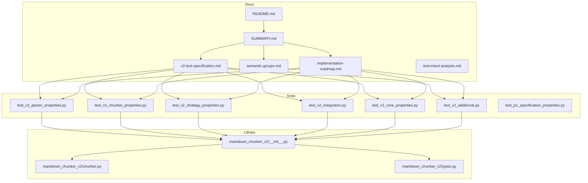
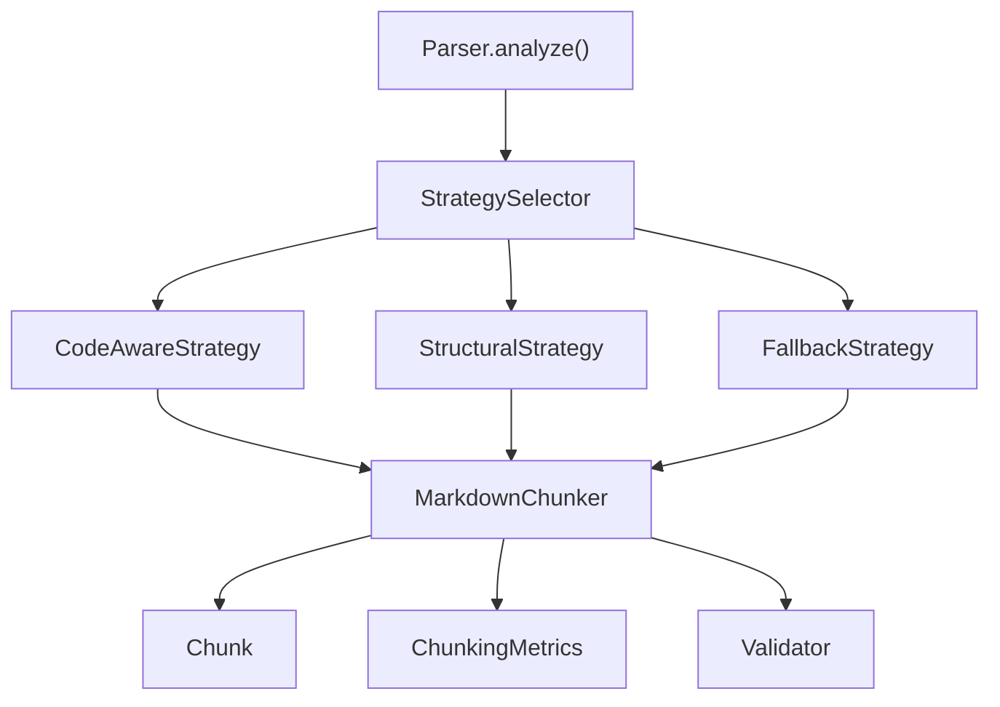
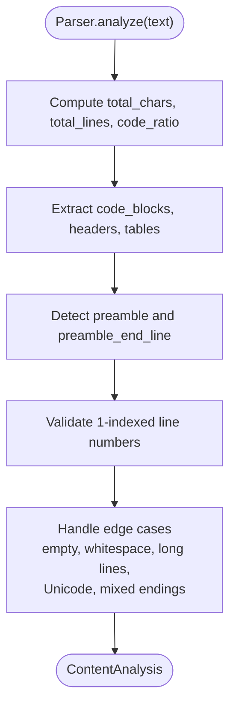
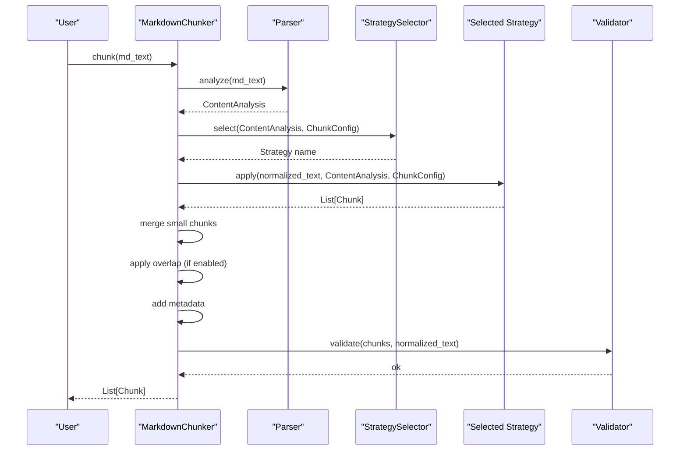
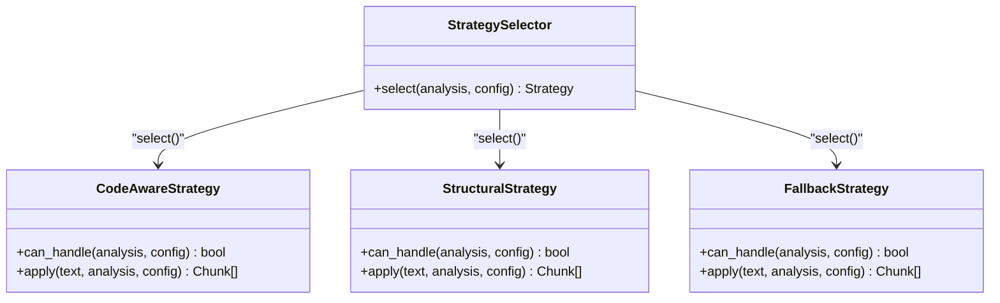
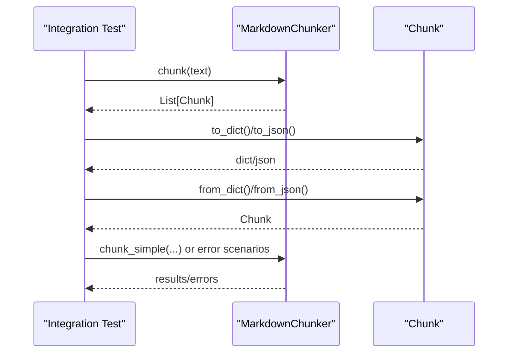
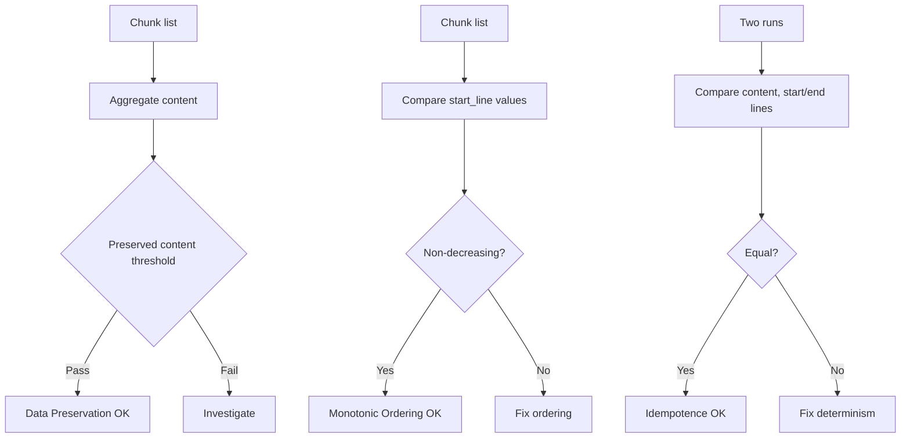
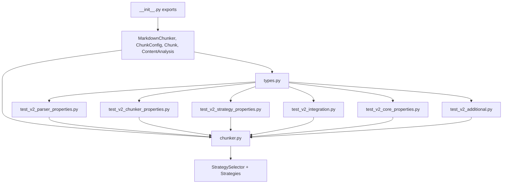

# V2 Test Specification

<cite>
**Referenced Files in This Document**
- [README.md](file://docs/v2-test-specification/README.md)
- [SUMMARY.md](file://docs/v2-test-specification/SUMMARY.md)
- [v2-test-specification.md](file://docs/v2-test-specification/v2-test-specification.md)
- [semantic-groups.md](file://docs/v2-test-specification/semantic-groups.md)
- [implementation-roadmap.md](file://docs/v2-test-specification/implementation-roadmap.md)
- [test-intent-analysis.md](file://docs/v2-test-specification/test-intent-analysis.md)
- [test_v2_parser_properties.py](file://tests/test_v2_parser_properties.py)
- [test_v2_chunker_properties.py](file://tests/test_v2_chunker_properties.py)
- [test_v2_strategy_properties.py](file://tests/test_v2_strategy_properties.py)
- [test_v2_integration.py](file://tests/test_v2_integration.py)
- [test_v2_core_properties.py](file://tests/test_v2_core_properties.py)
- [test_v2_additional.py](file://tests/test_v2_additional.py)
- [test_p1_specification_properties.py](file://tests/test_p1_specification_properties.py)
- [__init__.py](file://markdown_chunker_v2/__init__.py)
- [chunker.py](file://markdown_chunker_v2/chunker.py)
- [types.py](file://markdown_chunker_v2/types.py)
</cite>

## Table of Contents
1. [Introduction](#introduction)
2. [Project Structure](#project-structure)
3. [Core Components](#core-components)
4. [Architecture Overview](#architecture-overview)
5. [Detailed Component Analysis](#detailed-component-analysis)
6. [Dependency Analysis](#dependency-analysis)
7. [Performance Considerations](#performance-considerations)
8. [Troubleshooting Guide](#troubleshooting-guide)
9. [Conclusion](#conclusion)
10. [Appendices](#appendices)

## Introduction
This document presents the V2 Test Specification for the markdown_chunker_v2 library. It consolidates the planned test coverage derived from the legacy test suite analysis and maps each specification to concrete test implementations currently under development. The goal is to ensure the v2 API is robust, deterministic, and fully validated against the intended behavior described in the specifications.

Key aspects:
- The V2 test specification defines 52 specifications grouped into Parser, Chunker, Strategy, Integration, and Property categories.
- The implementation roadmap organizes these into four phases by priority (Critical, High, Medium, Low).
- Existing tests in the repository already cover core properties and several specifications, while others are being implemented.

**Section sources**
- [README.md](file://docs/v2-test-specification/README.md#L1-L119)
- [SUMMARY.md](file://docs/v2-test-specification/SUMMARY.md#L1-L70)

## Project Structure
The V2 test specification is organized around:
- A specification document enumerating 52 specifications with purpose, API, property definitions, inputs, expected outputs, and edge cases.
- A semantic grouping document that categorizes legacy tests into 26 groups aligned with v2 components.
- An implementation roadmap that assigns specifications to phases and tracks progress.
- A test intent analysis document that maps legacy tests to v2 concepts.

Tests are implemented under the tests/ directory, with dedicated files for parser properties, chunker properties, strategy properties, integration tests, core properties, and additional specifications.

**Diagram sources**
- [README.md](file://docs/v2-test-specification/README.md#L91-L119)
- [SUMMARY.md](file://docs/v2-test-specification/SUMMARY.md#L1-L70)
- [v2-test-specification.md](file://docs/v2-test-specification/v2-test-specification.md#L1-L120)
- [implementation-roadmap.md](file://docs/v2-test-specification/implementation-roadmap.md#L140-L153)
- [test_v2_parser_properties.py](file://tests/test_v2_parser_properties.py#L1-L40)
- [test_v2_chunker_properties.py](file://tests/test_v2_chunker_properties.py#L1-L40)
- [test_v2_strategy_properties.py](file://tests/test_v2_strategy_properties.py#L1-L40)
- [test_v2_integration.py](file://tests/test_v2_integration.py#L1-L40)
- [test_v2_core_properties.py](file://tests/test_v2_core_properties.py#L1-L40)
- [test_v2_additional.py](file://tests/test_v2_additional.py#L1-L40)
- [test_p1_specification_properties.py](file://tests/test_p1_specification_properties.py#L1-L40)
- [__init__.py](file://markdown_chunker_v2/__init__.py#L1-L31)
- [chunker.py](file://markdown_chunker_v2/chunker.py#L1-L60)
- [types.py](file://markdown_chunker_v2/types.py#L1-L40)

**Section sources**
- [README.md](file://docs/v2-test-specification/README.md#L64-L119)
- [SUMMARY.md](file://docs/v2-test-specification/SUMMARY.md#L1-L70)
- [implementation-roadmap.md](file://docs/v2-test-specification/implementation-roadmap.md#L140-L153)

## Core Components
The V2 test specification targets the following components:
- Parser.analyze() and ContentAnalysis
- MarkdownChunker and Chunk
- ChunkConfig and configuration validation
- Strategy selection and behavior (CodeAware, Structural, Fallback)
- Integration tests for end-to-end pipeline, serialization, and error recovery
- Core properties: data preservation, monotonic ordering, no empty chunks, idempotence

Existing tests demonstrate coverage for:
- Parser metrics, fenced block extraction, headers, tables, preamble, line number accuracy, and edge cases
- Chunker basic chunking, size constraints, overlap metadata, atomic block preservation, metadata completeness, strategy selection determinism, and config validation
- Strategy selection determinism, code-aware and structural strategies, fallback behavior, and strategy override
- End-to-end pipeline, serialization roundtrip, and error recovery
- Core properties: data preservation, monotonic ordering, no empty chunks, idempotence
- Additional areas: header path accuracy, overlap size constraints, chunk index correctness, content type detection, Unicode handling, line ending normalization, code block language detection, table column counting, chunk size distribution, error message quality, config defaults, config profiles, metadata serialization, API backward compatibility

**Section sources**
- [v2-test-specification.md](file://docs/v2-test-specification/v2-test-specification.md#L1-L120)
- [semantic-groups.md](file://docs/v2-test-specification/semantic-groups.md#L1-L120)
- [test_v2_parser_properties.py](file://tests/test_v2_parser_properties.py#L1-L120)
- [test_v2_chunker_properties.py](file://tests/test_v2_chunker_properties.py#L1-L120)
- [test_v2_strategy_properties.py](file://tests/test_v2_strategy_properties.py#L1-L120)
- [test_v2_integration.py](file://tests/test_v2_integration.py#L1-L120)
- [test_v2_core_properties.py](file://tests/test_v2_core_properties.py#L1-L120)
- [test_v2_additional.py](file://tests/test_v2_additional.py#L1-L120)

## Architecture Overview
The V2 test specification aligns with the simplified v2 architecture:
- Parser.analyze() produces ContentAnalysis used by StrategySelector to pick a strategy.
- MarkdownChunker applies the selected strategy, merges small chunks, applies overlap, adds metadata, and validates results.
- Types define Chunk, ContentAnalysis, FencedBlock, Header, TableBlock, ChunkingMetrics, and ChunkingResult.

**Diagram sources**
- [chunker.py](file://markdown_chunker_v2/chunker.py#L1-L120)
- [types.py](file://markdown_chunker_v2/types.py#L1-L120)
- [test_v2_chunker_properties.py](file://tests/test_v2_chunker_properties.py#L1-L120)
- [test_v2_strategy_properties.py](file://tests/test_v2_strategy_properties.py#L1-L120)

**Section sources**
- [chunker.py](file://markdown_chunker_v2/chunker.py#L1-L120)
- [types.py](file://markdown_chunker_v2/types.py#L1-L120)

## Detailed Component Analysis

### Parser Properties (SPEC-001 to SPEC-007)
- SPEC-001: Content Analysis Metrics Accuracy
- SPEC-002: Fenced Block Extraction Completeness
- SPEC-003: Header Detection Accuracy
- SPEC-004: Table Detection
- SPEC-005: Preamble Detection
- SPEC-006: Line Number Accuracy
- SPEC-007: Parser Edge Cases

Implementation highlights:
- Parser metrics correctness, code ratio bounds, and element counts verified.
- Fenced block extraction checks language detection, boundaries, and empty blocks.
- Header detection validates levels, text extraction, and line numbers.
- Table detection validates presence and column counts.
- Preamble detection verifies preamble flag and end line.
- Line number accuracy ensures 1-indexed positions and correct handling of CRLF/CRLF.
- Edge cases include empty/whitespace-only inputs, very long lines, Unicode, mixed line endings, and unclosed code blocks.

**Diagram sources**
- [test_v2_parser_properties.py](file://tests/test_v2_parser_properties.py#L1-L200)
- [types.py](file://markdown_chunker_v2/types.py#L68-L114)

**Section sources**
- [v2-test-specification.md](file://docs/v2-test-specification/v2-test-specification.md#L16-L120)
- [test_v2_parser_properties.py](file://tests/test_v2_parser_properties.py#L1-L200)

### Chunker Properties (SPEC-008 to SPEC-015)
- SPEC-008: Basic Chunking Produces Valid Chunks
- SPEC-009: Max Chunk Size Enforcement
- SPEC-010: Min Chunk Size Handling
- SPEC-011: Overlap Metadata Correctness
- SPEC-012: Atomic Block Preservation
- SPEC-013: Chunk Metadata Completeness
- SPEC-014: Strategy Selection Determinism
- SPEC-015: Config Validation

Implementation highlights:
- Basic chunking validates non-empty chunks and valid line numbers.
- Size constraints enforce max/min chunk sizes and oversize handling.
- Overlap metadata correctness checks previous/next content and overlap size.
- Atomic block preservation ensures code blocks and tables are not split.
- Metadata completeness verifies strategy, chunk_index, content_type, and header_path.
- Strategy selection determinism ensures consistent strategy choice.
- Config validation enforces parameter constraints and defaults.

**Diagram sources**
- [chunker.py](file://markdown_chunker_v2/chunker.py#L43-L129)
- [test_v2_chunker_properties.py](file://tests/test_v2_chunker_properties.py#L1-L200)

**Section sources**
- [v2-test-specification.md](file://docs/v2-test-specification/v2-test-specification.md#L250-L480)
- [test_v2_chunker_properties.py](file://tests/test_v2_chunker_properties.py#L1-L200)

### Strategy Properties (SPEC-016 to SPEC-019)
- SPEC-016: CodeAwareStrategy Selection
- SPEC-017: StructuralStrategy Selection
- SPEC-018: FallbackStrategy Behavior
- SPEC-019: Strategy Override

Implementation highlights:
- CodeAwareStrategy selection validates thresholds and code/table presence.
- StructuralStrategy selection validates header-based splitting and header_path metadata.
- FallbackStrategy behavior validates plain text handling, paragraph splitting, and size constraints.
- Strategy override ensures forced strategy regardless of content.

**Diagram sources**
- [test_v2_strategy_properties.py](file://tests/test_v2_strategy_properties.py#L1-L200)

**Section sources**
- [v2-test-specification.md](file://docs/v2-test-specification/v2-test-specification.md#L480-L620)
- [test_v2_strategy_properties.py](file://tests/test_v2_strategy_properties.py#L1-L200)

### Integration Properties (SPEC-020 to SPEC-022)
- SPEC-020: End-to-End Pipeline
- SPEC-021: Serialization Roundtrip
- SPEC-022: Error Recovery

Implementation highlights:
- End-to-end pipeline validates content preservation, metadata, and size constraints.
- Serialization roundtrip validates to_dict/from_dict and to_json/from_json.
- Error recovery validates graceful handling of empty input, invalid config, malformed markdown, and large inputs.

**Diagram sources**
- [test_v2_integration.py](file://tests/test_v2_integration.py#L1-L200)
- [types.py](file://markdown_chunker_v2/types.py#L144-L188)

**Section sources**
- [v2-test-specification.md](file://docs/v2-test-specification/v2-test-specification.md#L590-L720)
- [test_v2_integration.py](file://tests/test_v2_integration.py#L1-L200)

### Core Properties (SPEC-023 to SPEC-026)
- SPEC-023: Data Preservation (PROP-1)
- SPEC-024: Monotonic Ordering (PROP-3)
- SPEC-025: No Empty Chunks (PROP-4)
- SPEC-026: Idempotence (PROP-5)

Implementation highlights:
- Data preservation ensures combined chunk content retains significant original content.
- Monotonic ordering validates non-decreasing start_line across chunks.
- No empty chunks ensures each chunk has non-empty content.
- Idempotence validates deterministic chunking results.

**Diagram sources**
- [test_v2_core_properties.py](file://tests/test_v2_core_properties.py#L1-L200)

**Section sources**
- [v2-test-specification.md](file://docs/v2-test-specification/v2-test-specification.md#L666-L800)
- [test_v2_core_properties.py](file://tests/test_v2_core_properties.py#L1-L200)

### Additional Specifications (SPEC-027 to SPEC-052)
- Header path accuracy, overlap size constraints, chunk index correctness, content type detection, Unicode handling, line ending normalization, code block language detection, table column counting, chunk size distribution, error message quality, config defaults, config profiles, metadata serialization, API backward compatibility.

Implementation highlights:
- Header path correctness and slash-start validation.
- Overlap size constraints enforced by config validation.
- Chunk indices validated as sequential.
- Content type detection for text/code/table/mixed.
- Unicode handling across Cyrillic, CJK, and emoji.
- Line ending normalization across CRLF/CR/LF.
- Code block language detection.
- Table column counting.
- Metrics calculation and undersize/oversize counts.
- Error message clarity for invalid parameters.
- Config defaults and preset profiles.
- Metadata serialization and API compatibility helpers.

**Section sources**
- [v2-test-specification.md](file://docs/v2-test-specification/v2-test-specification.md#L776-L851)
- [test_v2_additional.py](file://tests/test_v2_additional.py#L1-L200)

## Dependency Analysis
The V2 test specification depends on:
- The v2 API exports defined in markdown_chunker_v2/__init__.py
- Core types and chunker logic in markdown_chunker_v2/chunker.py and markdown_chunker_v2/types.py
- Test files that exercise Parser, Chunker, Strategies, Integration, Core Properties, and Additional specs

**Diagram sources**
- [__init__.py](file://markdown_chunker_v2/__init__.py#L1-L31)
- [chunker.py](file://markdown_chunker_v2/chunker.py#L1-L120)
- [types.py](file://markdown_chunker_v2/types.py#L1-L120)
- [test_v2_parser_properties.py](file://tests/test_v2_parser_properties.py#L1-L40)
- [test_v2_chunker_properties.py](file://tests/test_v2_chunker_properties.py#L1-L40)
- [test_v2_strategy_properties.py](file://tests/test_v2_strategy_properties.py#L1-L40)
- [test_v2_integration.py](file://tests/test_v2_integration.py#L1-L40)
- [test_v2_core_properties.py](file://tests/test_v2_core_properties.py#L1-L40)
- [test_v2_additional.py](file://tests/test_v2_additional.py#L1-L40)

**Section sources**
- [__init__.py](file://markdown_chunker_v2/__init__.py#L1-L31)
- [chunker.py](file://markdown_chunker_v2/chunker.py#L1-L120)
- [types.py](file://markdown_chunker_v2/types.py#L1-L120)

## Performance Considerations
- Property-based tests use Hypothesis strategies to generate diverse inputs, balancing coverage and runtime.
- Tests avoid excessive filtering and health checks to keep runs efficient.
- Integration tests validate end-to-end behavior without external dependencies.

[No sources needed since this section provides general guidance]

## Troubleshooting Guide
Common issues and resolutions:
- Empty or whitespace-only input: chunk() returns an empty list; tests validate this behavior.
- Invalid configuration parameters: ChunkConfig validation raises ValueError with clear messages; tests assert error messages.
- Unclosed code blocks or malformed tables: Parser handles gracefully; tests include these edge cases.
- Very large inputs: chunk() should handle up to 100KB+; tests validate behavior.
- Unicode content: Parser and chunker support Unicode; tests include Cyrillic, CJK, and emoji.

**Section sources**
- [test_v2_integration.py](file://tests/test_v2_integration.py#L250-L344)
- [test_v2_additional.py](file://tests/test_v2_additional.py#L389-L477)

## Conclusion
The V2 Test Specification provides a comprehensive blueprint for validating the markdown_chunker_v2 API. The repository’s test suite already implements a substantial portion of the planned specifications across Parser, Chunker, Strategy, Integration, Core Properties, and Additional areas. The implementation roadmap and semantic grouping ensure systematic coverage, while property-based tests enhance robustness and reliability.

[No sources needed since this section summarizes without analyzing specific files]

## Appendices

### Appendix A: Specification-to-Test Mapping
- Parser: test_v2_parser_properties.py
- Chunker: test_v2_chunker_properties.py
- Strategy: test_v2_strategy_properties.py
- Integration: test_v2_integration.py
- Core Properties: test_v2_core_properties.py
- Additional: test_v2_additional.py
- Specification validation: test_p1_specification_properties.py

**Section sources**
- [implementation-roadmap.md](file://docs/v2-test-specification/implementation-roadmap.md#L140-L153)
- [test_v2_parser_properties.py](file://tests/test_v2_parser_properties.py#L1-L40)
- [test_v2_chunker_properties.py](file://tests/test_v2_chunker_properties.py#L1-L40)
- [test_v2_strategy_properties.py](file://tests/test_v2_strategy_properties.py#L1-L40)
- [test_v2_integration.py](file://tests/test_v2_integration.py#L1-L40)
- [test_v2_core_properties.py](file://tests/test_v2_core_properties.py#L1-L40)
- [test_v2_additional.py](file://tests/test_v2_additional.py#L1-L40)
- [test_p1_specification_properties.py](file://tests/test_p1_specification_properties.py#L1-L40)