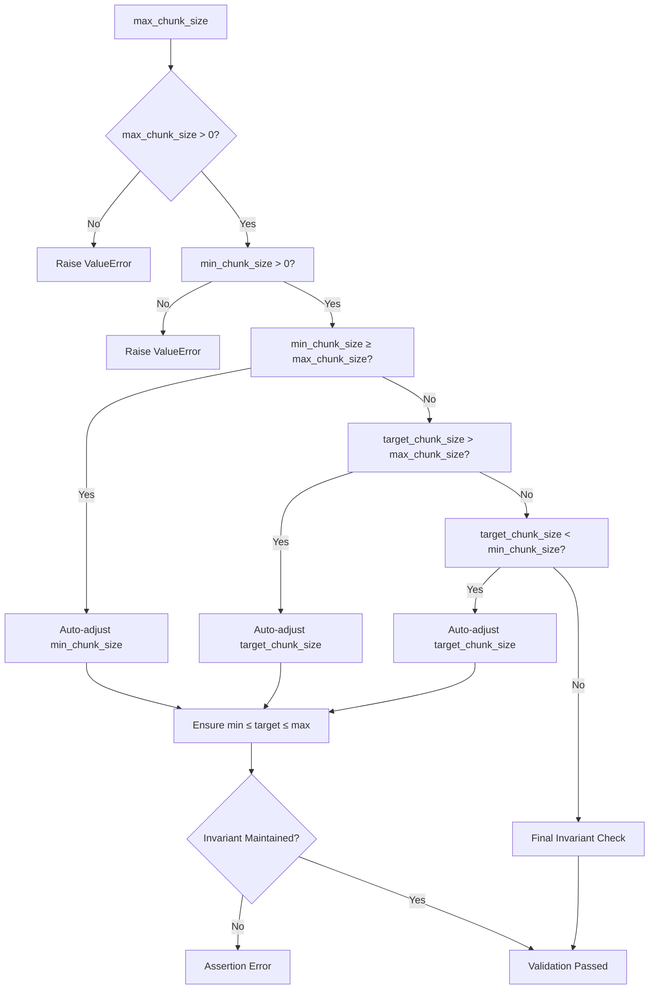
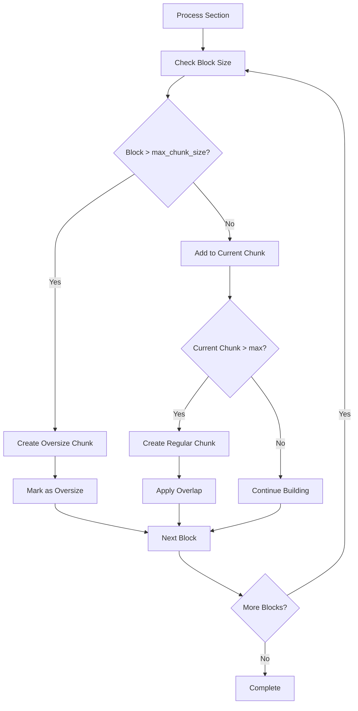
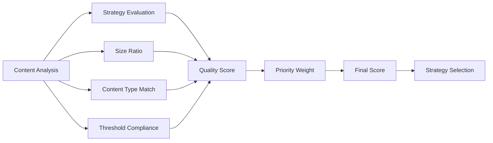

# Chunk Size Configuration

<cite>
**Referenced Files in This Document**
- [types.py](file://markdown_chunker/chunker/types.py)
- [base.py](file://markdown_chunker/chunker/strategies/base.py)
- [structural_strategy.py](file://markdown_chunker/chunker/strategies/structural_strategy.py)
- [selector.py](file://markdown_chunker/chunker/selector.py)
- [validator.py](file://markdown_chunker/chunker/validator.py)
- [errors.py](file://markdown_chunker/chunker/errors.py)
- [test_chunk_config_validation.py](file://tests/chunker/test_chunk_config_validation.py)
- [basic_usage.py](file://examples/basic_usage.py)
- [dify_integration.py](file://examples/dify_integration.py)
</cite>

## Table of Contents
1. [Introduction](#introduction)
2. [Core Configuration Parameters](#core-configuration-parameters)
3. [Size Parameter Interactions](#size-parameter-interactions)
4. [Auto-Adjustment Behavior](#auto-adjustment-behavior)
5. [Oversize Handling and Atomic Blocks](#oversize-handling-and-atomic-blocks)
6. [Character vs Byte Calculations](#character-vs-byte-calculations)
7. [Strategy Selection Impact](#strategy-selection-impact)
8. [Common Configuration Issues](#common-configuration-issues)
9. [Debugging Size-Related Problems](#debugging-size-related-problems)
10. [Best Practices](#best-practices)
11. [Troubleshooting Guide](#troubleshooting-guide)

## Introduction

The chunk size configuration system in the Markdown Chunker provides fine-grained control over how documents are divided into manageable pieces. The `ChunkConfig` class manages three critical size parameters that determine chunking behavior: `max_chunk_size`, `min_chunk_size`, and `target_chunk_size`. These parameters work together to balance document preservation, processing efficiency, and downstream application requirements.

Understanding these parameters is crucial for achieving optimal chunking results, especially when integrating with RAG systems, embedding models, or LLM context windows. The configuration system includes sophisticated auto-adjustment logic and validation to prevent common configuration errors while maintaining data integrity.

## Core Configuration Parameters

### max_chunk_size

The `max_chunk_size` parameter defines the maximum allowable size for individual chunks in characters. This is the primary constraint that prevents chunks from becoming too large to process effectively.

**Default Value:** 4096 characters  
**Range:** Typically 100-10000 characters  
**Impact:** Larger values create fewer, larger chunks with more contextual information, while smaller values produce more chunks with finer granularity.

**Key Characteristics:**
- Applied universally across all chunking strategies
- Can be exceeded only when `allow_oversize=True` for atomic blocks
- Directly influences overlap calculations when enabled
- Affects memory usage during processing

### min_chunk_size

The `min_chunk_size` parameter establishes the minimum acceptable size for chunks in characters. This prevents the creation of excessively small chunks that might fragment meaningful content.

**Default Value:** 512 characters  
**Range:** Typically 50-1000 characters  
**Impact:** Ensures chunks contain sufficient content to be meaningful while allowing flexibility for structural elements.

**Key Characteristics:**
- Used as a lower bound for chunk size validation
- May be adjusted downward when `max_chunk_size` is small
- Critical for maintaining content coherence
- Influences strategy selection decisions

### target_chunk_size

The `target_chunk_size` parameter serves as the ideal chunk size that the chunker aims to achieve when possible. It represents the sweet spot between efficiency and content preservation.

**Default Value:** 2048 characters  
**Range:** Typically 256-4096 characters  
**Impact:** Balances processing overhead with contextual richness, often correlating with optimal embedding or LLM context window sizes.

**Key Characteristics:**
- Primary factor in strategy selection
- Influences overlap size calculations
- Used as baseline for quality scoring
- Often aligned with downstream system requirements

**Section sources**
- [types.py](file://markdown_chunker/chunker/types.py#L497-L1027)

## Size Parameter Interactions

### Invariant Validation

The chunking system maintains a critical invariant relationship between the three size parameters:



**Diagram sources**
- [types.py](file://markdown_chunker/chunker/types.py#L620-L663)

### Auto-Adjustment Logic

The `__post_init__` method implements sophisticated auto-adjustment to maintain the invariant relationship:

1. **Min Chunk Size Adjustment**: When `min_chunk_size ≥ max_chunk_size`, it's automatically reduced to `max(1, max_chunk_size // 2)`
2. **Target Chunk Size Adjustment**: When `target_chunk_size > max_chunk_size`, it's capped at `max_chunk_size`; when `target_chunk_size < min_chunk_size`, it's set to `min_chunk_size`
3. **Final Validation**: An assertion ensures the invariant holds after adjustments

**Section sources**
- [types.py](file://markdown_chunker/chunker/types.py#L620-L663)

## Auto-Adjustment Behavior

### Default Configuration Scenarios

The system handles various edge cases gracefully:

#### Very Small max_chunk_size
When `max_chunk_size` is extremely small (e.g., 10), the system automatically adjusts:
- `min_chunk_size` becomes `max(1, max_chunk_size // 2)` → 5
- `target_chunk_size` equals `max_chunk_size` → 10
- Maintains `min ≤ target ≤ max` invariant

#### Equal Values
Equal values for all three parameters (min, target, max) are explicitly allowed and handled correctly.

#### Extreme Ratios
When `max_chunk_size` is much smaller than the default `min_chunk_size`, the system scales proportionally to maintain reasonable chunking behavior.

**Section sources**
- [test_chunk_config_validation.py](file://tests/chunker/test_chunk_config_validation.py#L48-L108)

## Oversize Handling and Atomic Blocks

### allow_oversize Parameter

The `allow_oversize` flag determines how the system handles chunks that exceed `max_chunk_size` due to indivisible content elements.

**Default Value:** `True`  
**Behavior Impact:** When `False`, the system attempts to split atomic blocks rather than creating oversized chunks.

### Atomic Block Preservation

Certain content types are treated as atomic blocks that cannot be split without losing meaning:

#### Code Blocks
- Identified by triple backticks (``` syntax)
- Preserved as single chunks when `preserve_code_blocks=True`
- Can exceed `max_chunk_size` when `allow_oversize=True`

#### Tables
- Identified by pipe syntax with alignment bars
- Preserved as single chunks when `preserve_tables=True`
- Cannot be split horizontally without breaking structure

#### Lists
- Multi-level lists are preserved as cohesive units
- Individual list items may be split based on content

### Structural Strategy Handling

The structural strategy demonstrates sophisticated oversize handling:



**Diagram sources**
- [structural_strategy.py](file://markdown_chunker/chunker/strategies/structural_strategy.py#L944-L1039)

**Section sources**
- [base.py](file://markdown_chunker/chunker/strategies/base.py#L180-L230)
- [structural_strategy.py](file://markdown_chunker/chunker/strategies/structural_strategy.py#L944-L1039)

## Character vs Byte Calculations

### Character-Based Measurement

All size parameters operate on character counts rather than byte counts, which provides several advantages:

#### Consistent Behavior Across Encodings
- Unicode normalization is handled consistently
- Multi-byte characters (UTF-8) are counted as single characters
- Cross-platform compatibility ensured

#### Practical Implications
- Predictable chunk sizes regardless of character encoding
- Simplified configuration for international content
- Consistent behavior across different systems

### Size Calculation Examples

Consider this comparison:

```python
# Character count (what matters for chunking)
text = "café"  # 4 characters, 5 bytes in UTF-8
print(len(text))  # 4 (correct for chunking)

# Byte count (irrelevant for chunking)
import sys
print(sys.getsizeof(text))  # 53 bytes (Python internal overhead)
```

### Memory vs Storage Considerations

While chunk sizes are measured in characters, actual memory usage depends on encoding:
- ASCII content: 1 byte per character
- UTF-8 content: 1-4 bytes per character
- The chunker focuses on logical content size, not storage overhead

**Section sources**
- [types.py](file://markdown_chunker/chunker/types.py#L569-L570)

## Strategy Selection Impact

### Strategy Thresholds and Size Correlation

Different chunking strategies have varying sensitivity to size configuration:

#### Code Strategy
- Triggered when `code_ratio_threshold` exceeded
- `min_code_blocks` requirement influences when strategy activates
- Larger `max_chunk_size` allows more complete code examples

#### List Strategy
- Requires `list_count_threshold` list items
- `preserve_list_hierarchy` affects how lists are chunked
- Size impacts how deeply nested lists are preserved

#### Structural Strategy
- Uses `header_count_threshold` for activation
- Directly influenced by size parameters
- Handles section boundaries based on available space

### Quality Scoring and Size Factors

Each strategy calculates quality scores that consider size appropriateness:



**Diagram sources**
- [selector.py](file://markdown_chunker/chunker/selector.py#L110-L132)

**Section sources**
- [selector.py](file://markdown_chunker/chunker/selector.py#L110-L132)

## Common Configuration Issues

### Invalid Size Combinations

Several configuration combinations violate the size invariant and require correction:

#### Case 1: min_chunk_size > max_chunk_size
**Problem:** `min_chunk_size` exceeds `max_chunk_size`
**Solution:** Automatically adjusted to `max(1, max_chunk_size // 2)`

#### Case 2: target_chunk_size > max_chunk_size
**Problem:** Target exceeds maximum allowed size
**Solution:** Automatically capped to `max_chunk_size`

#### Case 3: target_chunk_size < min_chunk_size
**Problem:** Target falls below minimum acceptable size
**Solution:** Automatically set to `min_chunk_size`

### Percentage Validation Issues

Non-standard percentage values cause validation failures:

#### Invalid overlap_percentage
- Range: 0.0 to 1.0
- Exceeding bounds raises `ValueError`

#### Invalid Strategy Thresholds
- `code_ratio_threshold`: 0.0 to 1.0
- `list_ratio_threshold`: 0.0 to 1.0
- `table_ratio_threshold`: 0.0 to 1.0

### Positive Value Requirements

Negative or zero values for size parameters are rejected:

#### Invalid Size Parameters
- `max_chunk_size ≤ 0`: Raises "max_chunk_size must be positive"
- `min_chunk_size ≤ 0`: Raises "min_chunk_size must be positive"

**Section sources**
- [test_chunk_config_validation.py](file://tests/chunker/test_chunk_config_validation.py#L118-L171)

## Debugging Size-Related Problems

### Validation Error Diagnosis

When encountering size-related errors, follow this diagnostic process:

#### Step 1: Check Parameter Values
```python
config = ChunkConfig(max_chunk_size=1000, min_chunk_size=1500)
# This will fail with: AssertionError: Size invariant violated
```

#### Step 2: Examine Auto-Adjustment Results
```python
config = ChunkConfig(max_chunk_size=500)
print(f"Original max: 500, Adjusted: {config.max_chunk_size}")
print(f"Original min: 512, Adjusted: {config.min_chunk_size}")
```

#### Step 3: Validate Configuration
```python
try:
    config = ChunkConfig(max_chunk_size=1000, min_chunk_size=300, target_chunk_size=200)
    print("Configuration valid")
except ValueError as e:
    print(f"Validation error: {e}")
```

### Oversize Chunk Analysis

When chunks exceed expectations:

#### Check allow_oversize Setting
```python
config = ChunkConfig(max_chunk_size=1000, allow_oversize=False)
# Large atomic blocks will cause issues
```

#### Monitor Chunk Metadata
```python
result = chunker.chunk_with_analysis(document)
for chunk in result.chunks:
    if chunk.size > config.max_chunk_size:
        print(f"Oversize chunk: {chunk.size} chars")
        print(f"Metadata: {chunk.metadata}")
```

### Performance Impact Analysis

Large chunks may impact performance differently:

#### Memory Usage Patterns
- Larger chunks require more memory during processing
- Fewer chunks reduce overhead but increase individual processing time
- Balance depends on available system resources

#### Processing Time Considerations
- Very small chunks increase overhead from chunk management
- Moderate chunks optimize for most use cases
- Strategy selection timing increases with document complexity

**Section sources**
- [validator.py](file://markdown_chunker/chunker/validator.py#L314-L354)

## Best Practices

### RAG System Configuration

For Retrieval-Augmented Generation applications:

#### Optimal Settings
```python
config = ChunkConfig(
    max_chunk_size=1536,      # Fits GPT-3.5 context
    min_chunk_size=200,       # Prevents fragmentation
    overlap_size=200,         # Maintains context
    enable_overlap=True       # Essential for RAG
)
```

#### Strategy Selection
- Use `for_dify_rag()` factory method
- Consider `allow_oversize=False` for strict compliance
- Monitor overlap effectiveness in retrieval quality

### Embedding Model Optimization

For semantic search and embedding generation:

#### Recommended Configuration
```python
config = ChunkConfig.for_chat_context()
# or manually:
config = ChunkConfig(
    max_chunk_size=1024,      # Fits most embedding models
    min_chunk_size=100,       # Sufficient for meaningful content
    overlap_size=100,         # Minimal overlap
    enable_overlap=True       # For context continuity
)
```

### Large Document Processing

For processing lengthy documents efficiently:

#### High-Throughput Settings
```python
config = ChunkConfig.for_large_documents()
# or:
config = ChunkConfig(
    max_chunk_size=8192,      # Large chunks for efficiency
    min_chunk_size=1024,      # Prevents tiny fragments
    overlap_size=100,         # Minimal overlap
    enable_overlap=False,     # Reduces processing overhead
    enable_streaming=True     # Memory-efficient processing
)
```

### Development and Testing

For development environments and experimentation:

#### Flexible Configuration
```python
config = ChunkConfig(
    max_chunk_size=200,       # Small chunks for testing
    min_chunk_size=50,        # Minimal size enforcement
    enable_overlap=True,      # For context testing
    overlap_size=30           # Small overlap for testing
)
```

**Section sources**
- [basic_usage.py](file://examples/basic_usage.py#L115-L137)
- [dify_integration.py](file://examples/dify_integration.py#L76-L82)

## Troubleshooting Guide

### Configuration Validation Failures

#### Problem: "Size invariant violated"
**Cause:** Auto-adjustment resulted in invalid configuration
**Solution:** Review parameter relationships and ensure `min_chunk_size ≤ target_chunk_size ≤ max_chunk_size`

#### Problem: "max_chunk_size must be positive"
**Cause:** Negative or zero value provided
**Solution:** Use positive integer values greater than zero

#### Problem: "overlap_percentage must be between 0.0 and 1.0"
**Cause:** Percentage value outside valid range
**Solution:** Ensure overlap_percentage is between 0.0 and 1.0

### Chunking Behavior Issues

#### Problem: Unexpected chunk sizes
**Diagnosis Steps:**
1. Check `allow_oversize` setting
2. Verify atomic block preservation flags
3. Examine strategy selection results
4. Review content analysis metrics

#### Problem: Too many small chunks
**Solutions:**
1. Increase `max_chunk_size`
2. Decrease `min_chunk_size`
3. Adjust strategy thresholds
4. Consider `allow_oversize=False` for atomic blocks

#### Problem: Too few large chunks
**Solutions:**
1. Decrease `max_chunk_size`
2. Increase `min_chunk_size`
3. Adjust strategy selection criteria
4. Enable overlap for better coverage

### Performance Optimization

#### Memory Usage Issues
**Symptoms:** Out of memory errors during chunking
**Solutions:**
1. Reduce `max_chunk_size`
2. Enable `enable_streaming`
3. Use `for_large_documents()` profile
4. Process documents in smaller batches

#### Processing Time Problems
**Symptoms:** Slow chunking performance
**Solutions:**
1. Increase `max_chunk_size` for fewer chunks
2. Disable overlap when not needed
3. Use appropriate factory profiles
4. Consider strategy override for specific content types

### Integration-Specific Issues

#### RAG System Compatibility
**Common Problems:**
- Chunk sizes exceeding embedding model limits
- Missing context due to insufficient overlap
- Poor retrieval quality from suboptimal chunking

**Solutions:**
- Align `max_chunk_size` with embedding model context
- Use RAG-optimized profiles
- Monitor retrieval performance metrics

#### LLM Context Window Alignment
**Common Problems:**
- Chunks too large for LLM context
- Chunks too small for meaningful context
- Inconsistent chunk sizes across documents

**Solutions:**
- Use context window-specific profiles
- Implement dynamic sizing based on LLM requirements
- Test chunking with representative documents

**Section sources**
- [errors.py](file://markdown_chunker/chunker/errors.py#L111-L210)
- [validator.py](file://markdown_chunker/chunker/validator.py#L314-L354)