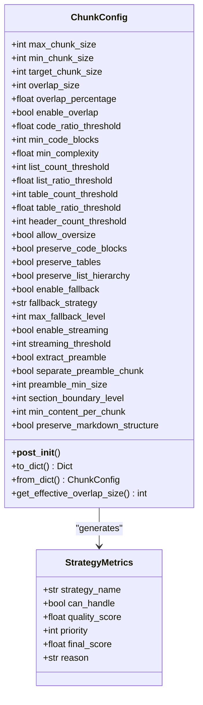
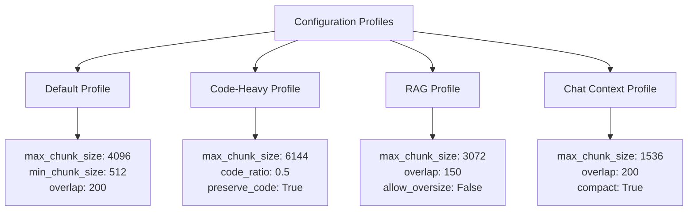
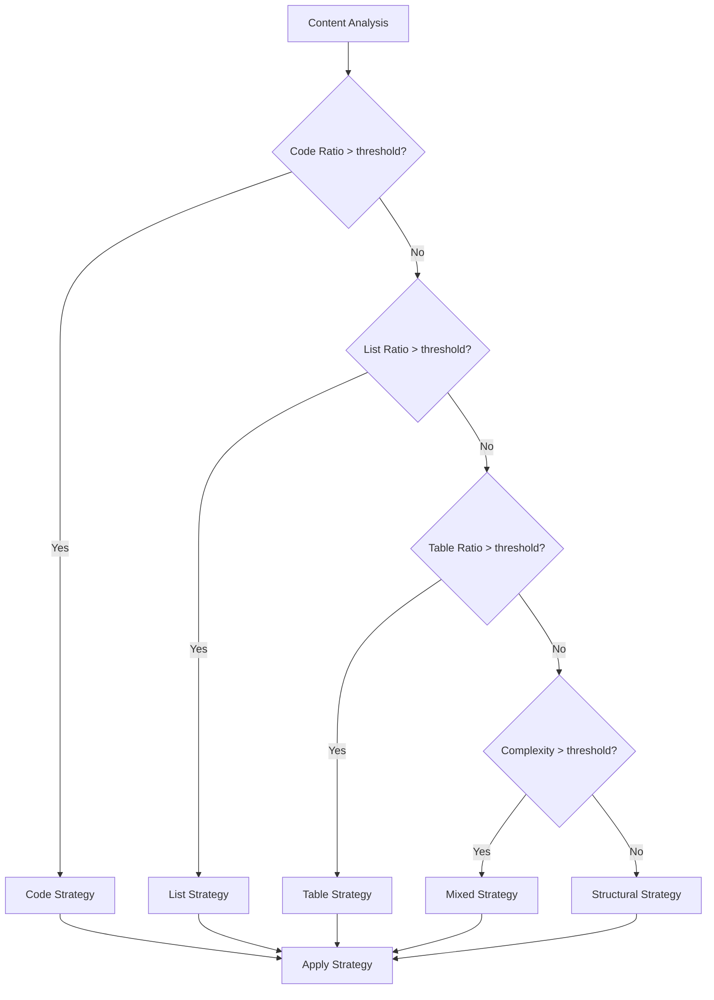
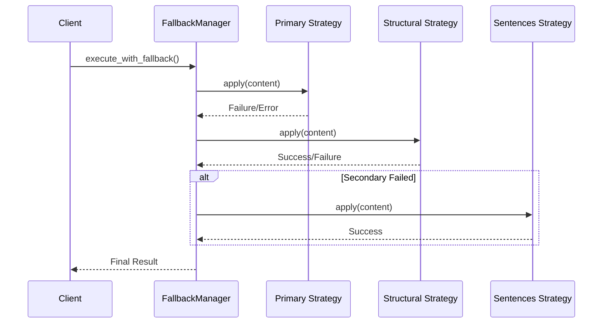
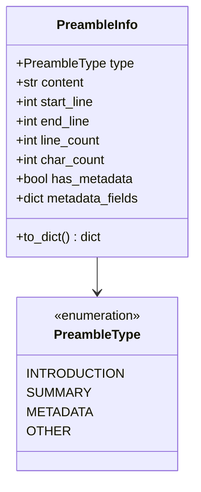
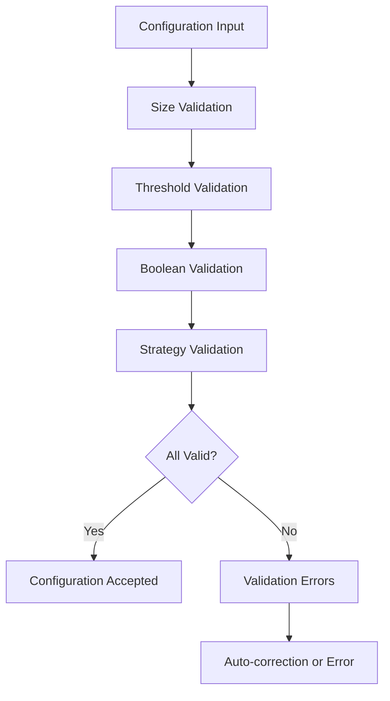

# Configuration Problems

<cite>
**Referenced Files in This Document**
- [types.py](file://markdown_chunker/chunker/types.py)
- [validator.py](file://markdown_chunker/chunker/validator.py)
- [selector.py](file://markdown_chunker/chunker/selector.py)
- [test_chunk_config_validation.py](file://tests/chunker/test_chunk_config_validation.py)
- [test_config_profiles.py](file://tests/chunker/test_config_profiles.py)
- [test_fallback_manager.py](file://tests/chunker/test_components/test_fallback_manager.py)
- [basic_usage.py](file://examples/basic_usage.py)
- [api_usage.py](file://examples/api_usage.py)
- [dify_integration.py](file://examples/dify_integration.py)
- [preamble.py](file://markdown_chunker/parser/preamble.py)
</cite>

## Table of Contents
1. [Introduction](#introduction)
2. [Understanding ChunkConfig](#understanding-chunkconfig)
3. [Common Configuration Issues](#common-configuration-issues)
4. [Configuration Profiles](#configuration-profiles)
5. [Strategy Selection Configuration](#strategy-selection-configuration)
6. [Fallback Settings](#fallback-settings)
7. [Preamble Extraction Options](#preamble-extraction-options)
8. [Configuration Validation](#configuration-validation)
9. [Debugging Configuration Issues](#debugging-configuration-issues)
10. [Best Practices](#best-practices)
11. [Troubleshooting Guide](#troubleshooting-guide)

## Introduction

The Markdown Chunker provides a sophisticated configuration system through the `ChunkConfig` object that controls all aspects of document chunking behavior. Proper configuration is essential for achieving optimal chunking results, whether you're processing technical documentation, building RAG systems, or integrating with AI platforms like Dify.

This documentation addresses common configuration problems users encounter and provides solutions for validating and debugging configuration issues.

## Understanding ChunkConfig

The `ChunkConfig` class serves as the central configuration object for all chunking operations. It provides fine-grained control over size limits, strategy selection thresholds, overlap settings, and behavior flags.

### Core Configuration Parameters



**Diagram sources**
- [types.py](file://markdown_chunker/chunker/types.py#L498-L1061)

**Section sources**
- [types.py](file://markdown_chunker/chunker/types.py#L498-L1061)

## Common Configuration Issues

### Invalid Chunk Sizes

**Problem**: Setting `max_chunk_size` smaller than `min_chunk_size` or using negative values.

**Symptoms**:
- Configuration validation errors
- Runtime exceptions during chunking
- Unexpected chunk splitting behavior

**Solution**: Ensure proper size relationships and positive values.

```python
# INVALID - Will cause validation errors
config = ChunkConfig(max_chunk_size=200, min_chunk_size=500)

# VALID - Correct size relationships
config = ChunkConfig(max_chunk_size=2000, min_chunk_size=200)
```

**Auto-correction behavior**: The configuration automatically adjusts invalid values to maintain proper relationships.

### Unsupported Strategy Names

**Problem**: Specifying non-existent strategy names in configuration.

**Symptoms**:
- Strategy selection failures
- `StrategyNotFoundError` exceptions
- Fallback to default strategies

**Solution**: Use only valid strategy names from the `StrategyType` enumeration.

### Conflicting Settings

**Problem**: Settings that contradict each other or lead to impossible configurations.

**Common conflicts**:
- `allow_oversize=False` with very small `max_chunk_size`
- `enable_overlap=True` with `overlap_size=0`
- `preserve_code_blocks=False` with code-heavy documents

**Section sources**
- [test_chunk_config_validation.py](file://tests/chunker/test_chunk_config_validation.py#L150-L207)

## Configuration Profiles

The system provides predefined configuration profiles optimized for specific use cases. These profiles serve as excellent starting points and demonstrate best practices.

### Available Profiles

| Profile | Use Case | Key Characteristics |
|---------|----------|-------------------|
| `default()` | General documents | Balanced settings (4096 max, 2048 target) |
| `for_code_heavy()` | Technical documentation | Larger chunks, aggressive code detection |
| `for_dify_rag()` | RAG systems | Moderate chunks, overlap enabled |
| `for_chat_context()` | LLM contexts | Small chunks, context preservation |
| `for_search_indexing()` | Search applications | Small chunks with overlap |
| `for_fast_processing()` | Batch processing | Large chunks, minimal overlap |

### Profile Comparison



**Diagram sources**
- [types.py](file://markdown_chunker/chunker/types.py#L695-L1061)

**Section sources**
- [test_config_profiles.py](file://tests/chunker/test_config_profiles.py#L1-70)

## Strategy Selection Configuration

Strategy selection determines which chunking algorithm is used based on content analysis. Proper configuration ensures optimal strategy selection.

### Threshold Configuration

| Parameter | Purpose | Typical Range | Impact |
|-----------|---------|---------------|---------|
| `code_ratio_threshold` | Code content detection | 0.3-0.8 | Higher values favor code strategy |
| `list_ratio_threshold` | List content detection | 0.5-0.8 | Higher values favor list strategy |
| `table_ratio_threshold` | Table content detection | 0.3-0.6 | Higher values favor table strategy |
| `min_complexity` | Mixed content detection | 0.2-0.5 | Higher values favor mixed strategy |
| `header_count_threshold` | Structural content detection | 2-5 | Higher values favor structural strategy |

### Strategy Selection Flow



**Diagram sources**
- [selector.py](file://markdown_chunker/chunker/selector.py#L58-L134)

**Section sources**
- [selector.py](file://markdown_chunker/chunker/selector.py#L58-L134)

## Fallback Settings

The fallback system provides robust error handling when primary strategies fail. Proper fallback configuration ensures reliable chunking even with challenging content.

### Fallback Configuration Options

| Setting | Purpose | Default | Impact |
|---------|---------|---------|---------|
| `enable_fallback` | Enable/disable fallback system | `True` | Prevents strategy selection failures |
| `fallback_strategy` | Primary fallback strategy | `"sentences"` | Used when primary fails |
| `max_fallback_level` | Maximum fallback depth | `4` | Controls fallback complexity |

### Fallback Levels



**Diagram sources**
- [test_fallback_manager.py](file://tests/chunker/test_components/test_fallback_manager.py#L70-L370)

**Section sources**
- [test_fallback_manager.py](file://tests/chunker/test_components/test_fallback_manager.py#L70-L370)

## Preamble Extraction Options

Preamble extraction allows you to handle introductory content separately from the main document body.

### Preamble Configuration Parameters

| Parameter | Purpose | Default | Notes |
|-----------|---------|---------|-------|
| `extract_preamble` | Enable preamble extraction | `True` | Extracts content before first header |
| `separate_preamble_chunk` | Create separate preamble chunk | `False` | Otherwise prepends to first chunk |
| `preamble_min_size` | Minimum preamble size | `10` | Characters |

### Preamble Types



**Diagram sources**
- [preamble.py](file://markdown_chunker/parser/preamble.py#L45-L342)

**Section sources**
- [preamble.py](file://markdown_chunker/parser/preamble.py#L45-L342)

## Configuration Validation

The system provides comprehensive validation to catch configuration errors early.

### Validation Categories

1. **Size Validation**: Ensures proper size relationships
2. **Threshold Validation**: Validates percentage and ratio values
3. **Boolean Validation**: Ensures valid boolean settings
4. **Strategy Validation**: Verifies strategy names and configurations

### Validation Process



**Diagram sources**
- [test_chunk_config_validation.py](file://tests/chunker/test_chunk_config_validation.py#L150-L207)

**Section sources**
- [test_chunk_config_validation.py](file://tests/chunker/test_chunk_config_validation.py#L150-L207)

## Debugging Configuration Issues

### Effective Configuration Inspection

To debug configuration issues, examine the effective configuration after validation:

```python
config = ChunkConfig(max_chunk_size=500)  # Invalid
print(f"Max chunk size: {config.max_chunk_size}")  # Auto-corrected
print(f"Min chunk size: {config.min_chunk_size}")  # Auto-corrected
print(f"Target chunk size: {config.target_chunk_size}")  # Auto-corrected
```

### Strategy Selection Debugging

Use the strategy selector to understand why specific strategies were chosen:

```python
from markdown_chunker.chunker import StrategySelector
from markdown_chunker.parser.types import ContentAnalysis

# Get strategy selection explanation
explanation = selector.explain_selection(analysis, config)
print(f"Selected strategy: {explanation['selected_strategy']}")
print(f"Reason: {explanation['strategy_evaluation'][0]['reason']}")
```

### Fallback Debugging

Monitor fallback usage to identify problematic content:

```python
result = chunker.chunk_with_analysis(document)
if result.fallback_used:
    print(f"Fallback used at level {result.fallback_level}")
    print(f"Final strategy: {result.strategy_used}")
```

**Section sources**
- [selector.py](file://markdown_chunker/chunker/selector.py#L181-L224)

## Best Practices

### Configuration Guidelines

1. **Start with Profiles**: Use predefined profiles as starting points
2. **Validate Early**: Test configurations with representative documents
3. **Monitor Results**: Track chunk distribution and strategy usage
4. **Adjust Gradually**: Make incremental changes to understand impact

### Common Patterns

```python
# For technical documentation
config = ChunkConfig.for_code_heavy()

# For RAG systems
config = ChunkConfig.for_dify_rag()

# For chat/LLM contexts
config = ChunkConfig.for_chat_context()

# For search applications
config = ChunkConfig.for_search_indexing()
```

### Performance Considerations

- **Large Documents**: Enable streaming for documents > 10MB
- **Fast Processing**: Use `for_fast_processing()` profile
- **Memory Efficiency**: Adjust chunk sizes based on available memory

## Troubleshooting Guide

### Problem: Configuration Validation Errors

**Symptoms**: `ValueError` exceptions during configuration creation

**Solutions**:
1. Check size relationships: `max_chunk_size >= min_chunk_size`
2. Validate percentage values: 0.0 ≤ value ≤ 1.0
3. Ensure positive values for size parameters

### Problem: Unexpected Strategy Selection

**Symptoms**: Document uses unexpected chunking strategy

**Diagnosis Steps**:
1. Check content analysis metrics
2. Review strategy thresholds
3. Examine content characteristics

### Problem: Fallback Activation

**Symptoms**: `fallback_used=True` in results

**Causes and Solutions**:
1. **Primary Strategy Failure**: Review strategy-specific error messages
2. **Content Complexity**: Increase `max_fallback_level`
3. **Resource Constraints**: Enable streaming for large documents

### Problem: Poor Chunk Quality

**Symptoms**: Uneven chunk sizes or poor semantic grouping

**Solutions**:
1. Adjust strategy thresholds
2. Modify chunk size parameters
3. Enable appropriate preservation flags
4. Use domain-specific configuration profiles

### Problem: Memory Issues with Large Documents

**Symptoms**: Out of memory errors or slow processing

**Solutions**:
1. Enable streaming: `enable_streaming=True`
2. Reduce `max_chunk_size`
3. Use `for_large_documents()` profile
4. Process documents in batches

**Section sources**
- [basic_usage.py](file://examples/basic_usage.py#L115-L137)
- [api_usage.py](file://examples/api_usage.py#L56-L80)