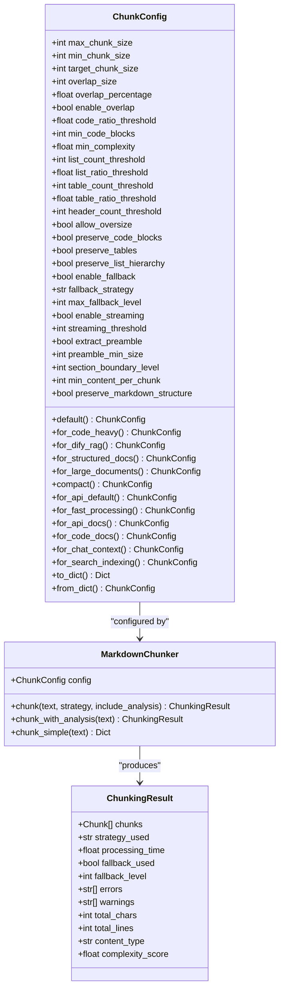
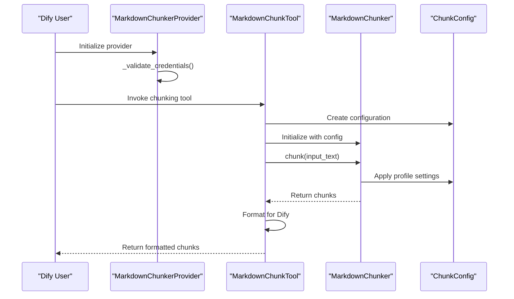
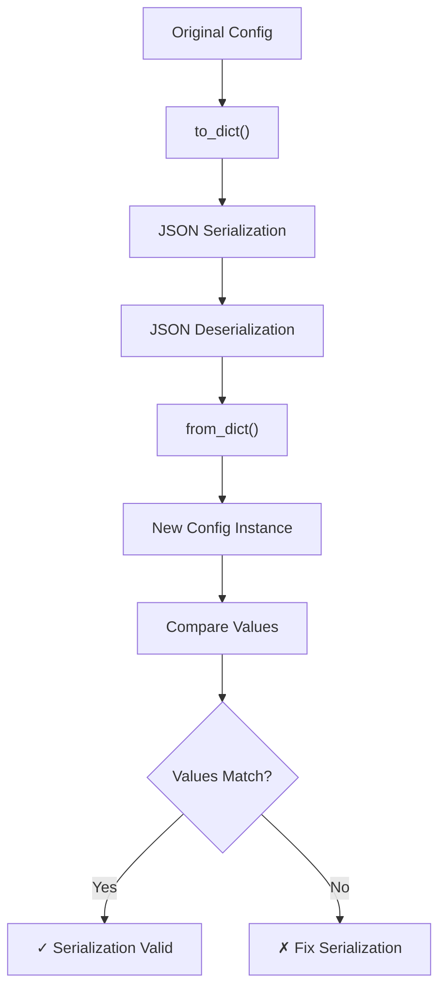

# Configuration Profiles

<cite>
**Referenced Files in This Document**
- [markdown_chunker/__init__.py](file://markdown_chunker/__init__.py)
- [markdown_chunker/chunker/types.py](file://markdown_chunker/chunker/types.py)
- [provider/markdown_chunker.py](file://provider/markdown_chunker.py)
- [provider/markdown_chunker.yaml](file://provider/markdown_chunker.yaml)
- [tools/markdown_chunk_tool.py](file://tools/markdown_chunk_tool.py)
- [tools/markdown_chunk_tool.yaml](file://tools/markdown_chunk_tool.yaml)
- [examples/dify_integration.py](file://examples/dify_integration.py)
- [examples/basic_usage.py](file://examples/basic_usage.py)
- [examples/rag_integration.py](file://examples/rag_integration.py)
- [tests/chunker/test_config_profiles.py](file://tests/chunker/test_config_profiles.py)
- [tests/chunker/test_serialization.py](file://tests/chunker/test_serialization.py)
- [tests/chunker/test_serialization_roundtrip_property.py](file://tests/chunker/test_serialization_roundtrip_property.py)
</cite>

## Table of Contents
1. [Introduction](#introduction)
2. [Configuration Profile Architecture](#configuration-profile-architecture)
3. [Factory Method Overview](#factory-method-overview)
4. [Detailed Profile Analysis](#detailed-profile-analysis)
5. [Dify Integration Profiles](#dify-integration-profiles)
6. [Custom Parameter Overrides](#custom-parameter-overrides)
7. [Serialization and Deserialization](#serialization-and-deserialization)
8. [Common Issues and Troubleshooting](#common-issues-and-troubleshooting)
9. [Best Practices](#best-practices)
10. [Performance Considerations](#performance-considerations)

## Introduction

The Python Markdown Chunker provides a sophisticated configuration profile system that enables developers to optimize document chunking for specific use cases. Configuration profiles are pre-defined sets of parameters that represent optimized settings for common scenarios, particularly beneficial when integrating with RAG (Retrieval-Augmented Generation) systems like Dify.

These profiles encapsulate the complex interplay between chunk size, overlap settings, strategy selection thresholds, and content preservation behaviors, allowing users to achieve optimal results without manual tuning of individual parameters.

## Configuration Profile Architecture

The configuration profile system is built around the `ChunkConfig` class, which serves as the foundation for all chunking behavior. The class provides multiple factory methods that return pre-configured instances optimized for specific use cases.



**Diagram sources**
- [markdown_chunker/chunker/types.py](file://markdown_chunker/chunker/types.py#L498-L1061)

**Section sources**
- [markdown_chunker/chunker/types.py](file://markdown_chunker/chunker/types.py#L498-L1061)

## Factory Method Overview

The `ChunkConfig` class provides 15 factory methods, each optimized for specific use cases. These methods serve as shortcuts to configure the chunker for common scenarios without requiring manual parameter tuning.

| Factory Method | Purpose | Key Characteristics |
|----------------|---------|-------------------|
| `default()` | General-purpose configuration | Balanced settings for most documents |
| `for_code_heavy()` | Code documentation | Large chunks, aggressive code detection |
| `for_dify_rag()` | Dify RAG systems | Moderate chunks with overlap |
| `for_structured_docs()` | Well-organized docs | Respect document hierarchy |
| `for_large_documents()` | Big documents | Streaming support, large chunks |
| `compact()` | Fine-grained chunks | Small chunks for precision |
| `for_api_default()` | API usage | Balanced API-friendly settings |
| `for_fast_processing()` | High throughput | Minimal overlap, large chunks |
| `for_api_docs()` | API documentation | Structured content optimization |
| `for_code_docs()` | Pure code docs | Code-focused settings |
| `for_chat_context()` | LLM context | Small chunks for chat |
| `for_search_indexing()` | Search applications | Small chunks with overlap |

**Section sources**
- [markdown_chunker/chunker/types.py](file://markdown_chunker/chunker/types.py#L667-L1061)

## Detailed Profile Analysis

### Code-Heavy Profile (`for_code_heavy()`)

Optimized for technical documentation containing extensive code examples and API references.

**Key Parameters:**
- `max_chunk_size`: 6144 (larger for complete code blocks)
- `target_chunk_size`: 3072
- `code_ratio_threshold`: 0.5 (more aggressive detection)
- `min_code_blocks`: 2
- `overlap_size`: 300 (larger for code context)
- `preserve_code_blocks`: True

**Use Cases:**
- API documentation with multiple code examples
- Technical tutorials with extensive code samples
- Software development guides
- Library reference documentation

**Section sources**
- [markdown_chunker/chunker/types.py](file://markdown_chunker/chunker/types.py#L695-L729)

### Dify RAG Profile (`for_dify_rag()`)

Specifically optimized for integration with Dify's RAG system, balancing chunk size for embedding models and maintaining contextual information.

**Key Parameters:**
- `max_chunk_size`: 3072 (optimal for embedding models)
- `min_chunk_size`: 256
- `target_chunk_size`: 1536
- `overlap_size`: 150
- `enable_overlap`: True
- `preserve_code_blocks`: True
- `preserve_list_hierarchy`: True
- `allow_oversize`: False

**Integration Benefits:**
- Compatible with Dify's embedding requirements
- Maintains semantic coherence across chunks
- Preserves important structural elements
- Prevents oversized chunks that could cause embedding issues

**Section sources**
- [markdown_chunker/chunker/types.py](file://markdown_chunker/chunker/types.py#L888-L905)

### Structured Documents Profile (`for_structured_docs()`)

Balanced configuration for well-organized documentation with clear sections, headers, and lists.

**Key Parameters:**
- `max_chunk_size`: 3072
- `target_chunk_size`: 1536
- `header_count_threshold`: 2 (aggressive structural detection)
- `preserve_list_hierarchy`: True
- `overlap_size`: 150

**Optimization Focus:**
- Respects markdown hierarchy
- Smaller chunks for better section granularity
- Preserves list structure
- Balanced overlap for context maintenance

**Section sources**
- [markdown_chunker/chunker/types.py](file://markdown_chunker/chunker/types.py#L741-L781)

### Fast Processing Profile (`for_fast_processing()`)

Designed for maximum throughput with minimal computational overhead.

**Key Parameters:**
- `max_chunk_size`: 8192 (largest chunks)
- `min_chunk_size`: 1024
- `target_chunk_size`: 4096
- `overlap_size`: 100
- `enable_overlap`: False
- `enable_streaming`: True

**Performance Optimizations:**
- Minimal overlap reduces processing overhead
- Streaming support for large documents
- Larger chunks reduce total chunk count
- Faster processing for batch operations

**Section sources**
- [markdown_chunker/chunker/types.py](file://markdown_chunker/chunker/types.py#L908-L923)

### Compact Profile (`compact()`)

Creates smaller, more numerous chunks for fine-grained processing.

**Key Parameters:**
- `max_chunk_size`: 2048
- `min_chunk_size`: 256
- `target_chunk_size`: 1024
- `overlap_size`: 100

**Use Cases:**
- Detailed search indexing
- Precise context extraction
- Semantic search applications
- Applications requiring high granularity

**Section sources**
- [markdown_chunker/chunker/types.py](file://markdown_chunker/chunker/types.py#L827-L862)

## Dify Integration Profiles

### Provider Configuration

The Dify integration is implemented through a provider system that exposes the chunker as a tool within the Dify platform.



**Diagram sources**
- [provider/markdown_chunker.py](file://provider/markdown_chunker.py#L15-L36)
- [tools/markdown_chunk_tool.py](file://tools/markdown_chunk_tool.py#L83-L178)

### Tool Parameters and Configuration

The Dify tool accepts several parameters that can be combined with profile configurations:

| Parameter | Type | Default | Description |
|-----------|------|---------|-------------|
| `input_text` | string | Required | Markdown content to chunk |
| `max_chunk_size` | number | 1000 | Maximum chunk size in characters |
| `chunk_overlap` | number | 100 | Characters to overlap between chunks |
| `strategy` | select | auto | Chunking strategy (auto/code/structural/mixed) |
| `include_metadata` | boolean | true | Include structural metadata |

**Section sources**
- [tools/markdown_chunk_tool.yaml](file://tools/markdown_chunk_tool.yaml#L24-L118)

## Custom Parameter Overrides

While factory methods provide optimized defaults, users can easily override specific parameters while retaining the benefits of profile configurations.

### Override Patterns

```python
# Pattern 1: Start with profile, then override specific parameters
config = ChunkConfig.for_dify_rag()
config.max_chunk_size = 2500  # Reduce chunk size for smaller embeddings
config.overlap_size = 100     # Reduce overlap for efficiency

# Pattern 2: Create custom profile based on existing one
def create_custom_rag_config():
    base_config = ChunkConfig.for_dify_rag()
    base_config.max_chunk_size = 2000
    base_config.enable_overlap = False
    return base_config

# Pattern 3: Combine with manual configuration
custom_config = ChunkConfig(
    max_chunk_size=1500,
    overlap_size=50,
    **ChunkConfig.for_code_heavy().__dict__
)
```

### Parameter Precedence

When combining profile settings with custom parameters, the custom parameters take precedence:

1. Profile default values
2. Custom parameter overrides
3. Runtime parameter adjustments

**Section sources**
- [examples/basic_usage.py](file://examples/basic_usage.py#L115-L137)

## Serialization and Deserialization

The configuration system supports JSON serialization for persistence and configuration management.

### Serialization Features

```python
# Convert configuration to dictionary
config = ChunkConfig.for_dify_rag()
config_dict = config.to_dict()

# Save to file
with open('config.json', 'w') as f:
    json.dump(config_dict, f, indent=2)

# Load from file
with open('config.json', 'r') as f:
    loaded_dict = json.load(f)
    loaded_config = ChunkConfig.from_dict(loaded_dict)
```

### Round-Trip Validation

The system includes comprehensive testing for serialization round-trip guarantees:



**Diagram sources**
- [tests/chunker/test_serialization.py](file://tests/chunker/test_serialization.py#L1-L50)

**Section sources**
- [markdown_chunker/chunker/types.py](file://markdown_chunker/chunker/types.py#L1003-L1028)
- [tests/chunker/test_serialization.py](file://tests/chunker/test_serialization.py#L1-L50)

## Common Issues and Troubleshooting

### Incorrect Profile Selection

**Problem:** Choosing a profile that doesn't match the document characteristics.

**Symptoms:**
- Unbalanced chunk sizes
- Poor semantic coherence
- Inappropriate strategy selection

**Solutions:**
```python
# Check document characteristics
def analyze_document_characteristics(text):
    config = ChunkConfig.for_api_default()
    chunker = MarkdownChunker(config)
    result = chunker.chunk_with_analysis(text)
    
    print(f"Content type: {result.content_type}")
    print(f"Complexity score: {result.complexity_score}")
    print(f"Strategy used: {result.strategy_used}")
    
    # Choose appropriate profile based on analysis
    if result.content_type == "code":
        return ChunkConfig.for_code_heavy()
    elif result.complexity_score > 0.7:
        return ChunkConfig.for_structured_docs()
    else:
        return ChunkConfig.for_dify_rag()

# Use analysis to select profile
recommended_config = analyze_document_characteristics(document_text)
chunker = MarkdownChunker(recommended_config)
```

### Profile Loading Issues

**Problem:** Configuration not loading correctly or causing runtime errors.

**Common Causes:**
- Invalid parameter combinations
- Memory constraints with large profiles
- Incompatible parameter values

**Diagnostic Steps:**
```python
# Validate configuration before use
def validate_config(config):
    try:
        # Test with small document
        test_text = "# Test\nContent"
        chunker = MarkdownChunker(config)
        result = chunker.chunk(test_text)
        
        print(f"✓ Configuration valid")
        print(f"  Created {len(result.chunks)} chunks")
        return True
        
    except Exception as e:
        print(f"✗ Configuration error: {e}")
        return False

# Test all profiles
profiles = [
    ChunkConfig.for_dify_rag(),
    ChunkConfig.for_code_heavy(),
    ChunkConfig.for_structured_docs()
]

for profile in profiles:
    print(f"Testing {profile.__class__.__name__}:")
    validate_config(profile)
    print()
```

### Unexpected Behavior with Custom Overrides

**Problem:** Custom parameter overrides causing unintended side effects.

**Debugging Approach:**
```python
# Track parameter inheritance
def debug_profile_inheritance(base_profile, overrides):
    print(f"Base Profile: {base_profile.__class__.__name__}")
    print("Parameters:")
    
    # Show all parameters from base profile
    base_params = base_profile.__dict__
    for param, value in base_params.items():
        print(f"  {param}: {value}")
    
    # Show overrides
    print("\nOverrides:")
    for param, value in overrides.items():
        print(f"  {param}: {value}")
    
    # Show final configuration
    print("\nFinal Configuration:")
    final_config = base_profile.__class__(**overrides)
    final_params = final_config.__dict__
    for param, value in final_params.items():
        print(f"  {param}: {value}")

# Example usage
base = ChunkConfig.for_dify_rag()
overrides = {"max_chunk_size": 2500, "overlap_size": 100}
debug_profile_inheritance(base, overrides)
```

**Section sources**
- [tests/chunker/test_config_profiles.py](file://tests/chunker/test_config_profiles.py#L1-L70)

## Best Practices

### Profile Selection Guidelines

1. **Use Profiles as Starting Points**: Factory methods provide optimized defaults that should be adjusted based on specific needs.

2. **Consider Document Type**: Match profile characteristics to document structure:
   - Code-heavy documents → `for_code_heavy()`
   - API documentation → `for_api_docs()`
   - General documentation → `for_structured_docs()`
   - RAG systems → `for_dify_rag()`

3. **Test with Representative Data**: Always validate profile selection with actual documents.

4. **Monitor Performance Impact**: Different profiles have varying computational costs.

### Integration Best Practices

1. **Persistent Configuration**: Store frequently used configurations for consistency.

2. **Environment-Specific Profiles**: Use different profiles for development vs production.

3. **Fallback Strategies**: Implement graceful degradation when profiles fail.

4. **Monitoring and Logging**: Track chunking performance and quality metrics.

### Dify-Specific Recommendations

1. **Profile Consistency**: Use `for_dify_rag()` for consistent integration.

2. **Metadata Filtering**: Leverage the tool's metadata filtering for RAG optimization.

3. **Overlap Tuning**: Adjust overlap based on embedding model requirements.

4. **Chunk Size Alignment**: Align chunk sizes with embedding model token limits.

**Section sources**
- [examples/dify_integration.py](file://examples/dify_integration.py#L1-L200)
- [examples/rag_integration.py](file://examples/rag_integration.py#L1-L200)

## Performance Considerations

### Memory Usage Patterns

Different profiles exhibit varying memory usage patterns:

| Profile | Memory Impact | Reason |
|---------|---------------|--------|
| `for_code_heavy()` | Higher | Larger chunks with preserved code blocks |
| `for_dify_rag()` | Moderate | Balanced chunks with overlap |
| `for_fast_processing()` | Lower | Minimal overlap, larger chunks |
| `compact()` | Higher | More chunks require more tracking |

### Processing Speed Optimization

```python
# Fastest processing (minimal overlap)
config = ChunkConfig.for_fast_processing()

# Balanced approach
config = ChunkConfig.for_dify_rag()

# Highest quality (more overlap)
config = ChunkConfig.for_code_heavy()
```

### Scalability Guidelines

1. **Large Documents**: Use `for_large_documents()` with streaming enabled.

2. **High Volume Processing**: Consider `for_fast_processing()` for batch operations.

3. **Quality-Critical Applications**: Use profiles with higher overlap for better context preservation.

**Section sources**
- [markdown_chunker/chunker/types.py](file://markdown_chunker/chunker/types.py#L800-L825)