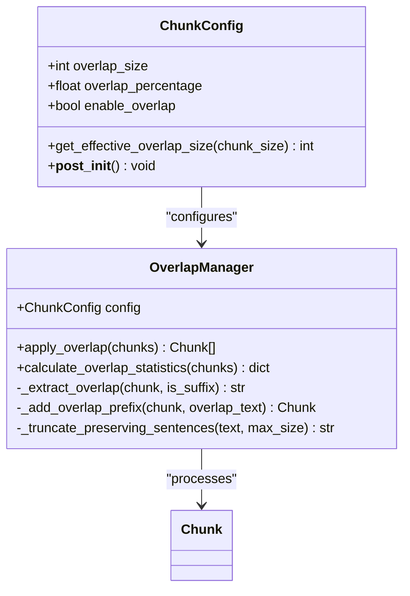
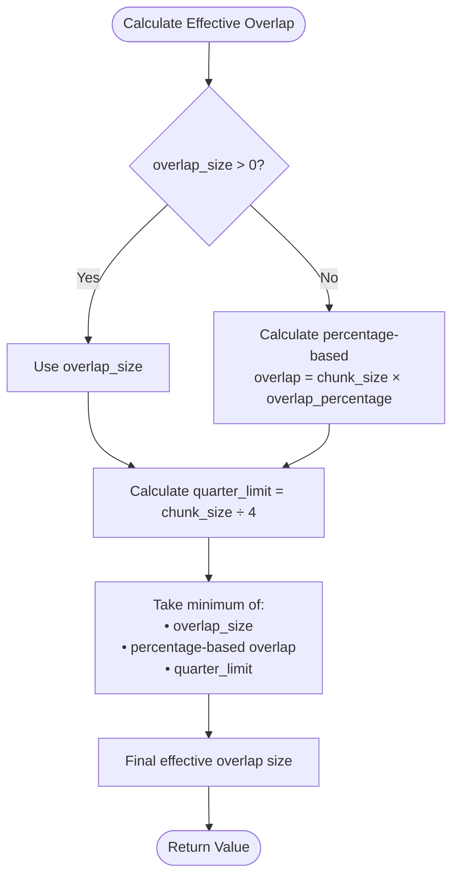
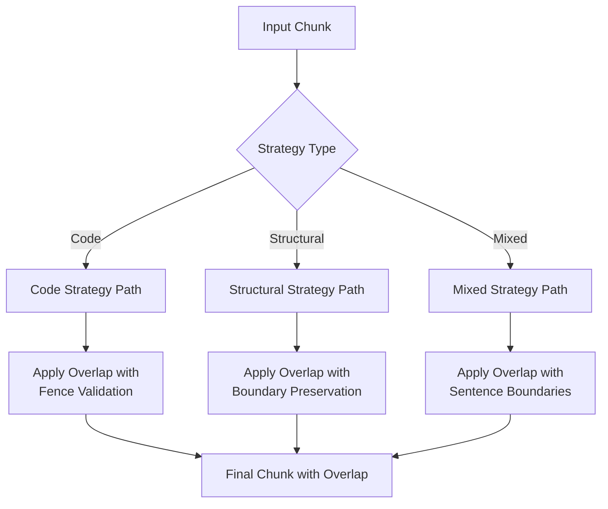
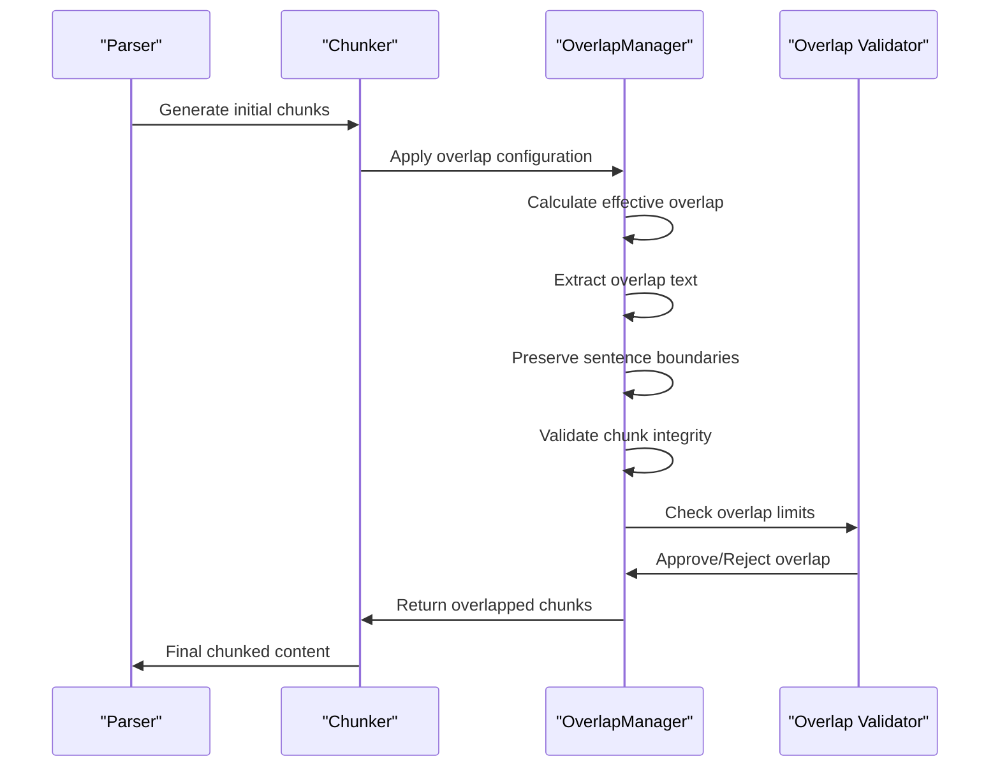

# Overlap Configuration

<cite>
**Referenced Files in This Document**
- [markdown_chunker/chunker/types.py](file://markdown_chunker/chunker/types.py)
- [markdown_chunker/chunker/components/overlap_manager.py](file://markdown_chunker/chunker/components/overlap_manager.py)
- [tests/chunker/test_components/test_overlap_manager.py](file://tests/chunker/test_components/test_overlap_manager.py)
- [tests/chunker/test_overlap_properties.py](file://tests/chunker/test_overlap_properties.py)
- [tests/chunker/test_chunk_config_validation.py](file://tests/chunker/test_chunk_config_validation.py)
- [examples/rag_integration.py](file://examples/rag_integration.py)
- [markdown_chunker/api/validator.py](file://markdown_chunker/api/validator.py)
</cite>

## Table of Contents
1. [Introduction](#introduction)
2. [Core Configuration Parameters](#core-configuration-parameters)
3. [Effective Overlap Calculation](#effective-overlap-calculation)
4. [Configuration Profiles](#configuration-profiles)
5. [Common Configuration Errors](#common-configuration-errors)
6. [Overlap Interaction with Strategies](#overlap-interaction-with-strategies)
7. [Performance Considerations](#performance-considerations)
8. [Troubleshooting Guide](#troubleshooting-guide)
9. [Best Practices](#best-practices)
10. [Implementation Details](#implementation-details)

## Introduction

Overlap configuration in the markdown chunker system is crucial for maintaining context continuity when processing documents in chunks. The overlap mechanism creates contextual connections between adjacent chunks, which is particularly important for RAG (Retrieval-Augmented Generation) applications and semantic search systems.

The overlap system operates through three primary configuration parameters: `overlap_size`, `overlap_percentage`, and `enable_overlap`. These parameters work together to determine how much content from the end of one chunk is included at the beginning of the next chunk, preserving important contextual information.

## Core Configuration Parameters

### overlap_size
The fixed-size overlap in characters. This parameter takes precedence when both `overlap_size` and `overlap_percentage` are configured.

### overlap_percentage
The percentage-based overlap relative to the source chunk size. This serves as a fallback when `overlap_size` is not specified or when it would produce an excessively large overlap.

### enable_overlap
A boolean flag that controls whether overlap processing is enabled. When disabled, chunks are processed normally without any overlap.



**Diagram sources**
- [markdown_chunker/chunker/types.py](file://markdown_chunker/chunker/types.py#L498-L1001)
- [markdown_chunker/chunker/components/overlap_manager.py](file://markdown_chunker/chunker/components/overlap_manager.py#L13-L447)

**Section sources**
- [markdown_chunker/chunker/types.py](file://markdown_chunker/chunker/types.py#L516-L520)

## Effective Overlap Calculation

The effective overlap size is calculated using the `get_effective_overlap_size()` method, which implements a sophisticated algorithm to determine the optimal overlap for each chunk.

### Calculation Algorithm

The effective overlap size is determined by taking the minimum of three values:

1. **Fixed overlap size** (`overlap_size`): The configured fixed overlap in characters
2. **Percentage-based overlap** (`chunk_size × overlap_percentage`): Dynamic overlap based on chunk size
3. **Quarter limit** (`chunk_size ÷ 4`): Safety limit preventing excessive overlap



**Diagram sources**
- [markdown_chunker/chunker/types.py](file://markdown_chunker/chunker/types.py#L996-L1001)

### Implementation Details

The calculation follows these rules:

- **Priority Order**: Fixed size (`overlap_size`) takes precedence over percentage-based calculation
- **Safety Limits**: The result is never greater than 25% of the source chunk size
- **Minimum Bound**: Returns 0 if all calculations result in zero or negative values

**Section sources**
- [markdown_chunker/chunker/types.py](file://markdown_chunker/chunker/types.py#L996-L1001)

## Configuration Profiles

The system provides several pre-configured profiles optimized for different use cases:

### RAG Configuration Profile

Optimized for Retrieval-Augmented Generation applications with moderate chunk sizes and balanced overlap.

| Parameter | Value | Purpose |
|-----------|-------|---------|
| `max_chunk_size` | 3072 | Moderate chunk size for semantic search |
| `min_chunk_size` | 256 | Minimum size for flexibility |
| `overlap_size` | 150 | Fixed overlap for context preservation |
| `enable_overlap` | True | Required for RAG context |
| `code_ratio_threshold` | 0.6 | Balanced code detection |

### Search Indexing Profile

Designed for search engine applications with smaller chunks and strategic overlap.

| Parameter | Value | Purpose |
|-----------|-------|---------|
| `max_chunk_size` | 1024 | Small chunks for granular search |
| `overlap_size` | 100 | Conservative overlap |
| `enable_overlap` | True | Context preservation |
| `preserve_code_blocks` | False | Search-focused processing |

### Code-Heavy Profile

Optimized for technical documentation with larger chunks and increased overlap.

| Parameter | Value | Purpose |
|-----------|-------|---------|
| `max_chunk_size` | 6144 | Large chunks for code blocks |
| `overlap_size` | 300 | Extended overlap for code context |
| `preserve_code_blocks` | True | Maintain code integrity |

**Section sources**
- [markdown_chunker/chunker/types.py](file://markdown_chunker/chunker/types.py#L888-L905)
- [markdown_chunker/chunker/types.py](file://markdown_chunker/chunker/types.py#L980-L990)
- [markdown_chunker/chunker/types.py](file://markdown_chunker/chunker/types.py#L730-L738)

## Common Configuration Errors

### Invalid Percentage Values

**Problem**: Setting `overlap_percentage` outside the valid range (0.0-1.0)

**Error Message**: `"overlap_percentage must be between 0.0 and 1.0"`

**Solution**: Ensure percentage values are within the valid range:
```python
# Correct
config = ChunkConfig(overlap_percentage=0.1)  # 10%

# Incorrect - will raise ValueError
config = ChunkConfig(overlap_percentage=1.5)
config = ChunkConfig(overlap_percentage=-0.1)
```

### Negative Overlap Size

**Problem**: Setting `overlap_size` to a negative value

**Error Message**: `"overlap_size cannot be negative"`

**Solution**: Use non-negative values for overlap size:
```python
# Correct
config = ChunkConfig(overlap_size=100)

# Incorrect - will raise validation error
config = ChunkConfig(overlap_size=-50)
```

### Type Validation Issues

**Problem**: Providing incorrect data types for overlap parameters

**Error Messages**:
- `"overlap_size must be integer, got float"`
- `"overlap_size must be integer, got str"`

**Solution**: Ensure proper data types:
```python
# Correct
config = ChunkConfig(overlap_size=100)

# Incorrect - will raise validation error
config = ChunkConfig(overlap_size=100.5)
config = ChunkConfig(overlap_size="100")
```

**Section sources**
- [tests/chunker/test_chunk_config_validation.py](file://tests/chunker/test_chunk_config_validation.py#L119-L156)
- [markdown_chunker/api/validator.py](file://markdown_chunker/api/validator.py#L187-L203)

## Overlap Interaction with Strategies

Different chunking strategies handle overlap differently based on content type and structure:

### Code Strategy
- **Preservation Priority**: High priority for code block integrity
- **Overlap Handling**: May skip overlap if it would break code fences
- **Use Case**: Technical documentation with extensive code examples

### Structural Strategy  
- **Header Preservation**: Maintains section boundaries across overlap
- **Context Continuity**: Ensures smooth transitions between sections
- **Use Case**: Documentation with clear hierarchical structure

### Mixed Strategy
- **Balanced Approach**: Combines text and code content carefully
- **Sentence Boundary**: Preserves natural language flow
- **Use Case**: Documents with varied content types



**Diagram sources**
- [markdown_chunker/chunker/components/overlap_manager.py](file://markdown_chunker/chunker/components/overlap_manager.py#L81-L96)

**Section sources**
- [markdown_chunker/chunker/components/overlap_manager.py](file://markdown_chunker/chunker/components/overlap_manager.py#L81-L96)

## Performance Considerations

### Memory Usage Impact

Large overlap sizes can significantly impact memory usage, especially for documents with many chunks:

- **Memory Growth**: Overlap adds approximately `overlap_size × number_of_chunks` to memory usage
- **Processing Time**: Larger overlaps increase processing time due to text manipulation
- **Chunk Size Limit**: The system enforces a 50% limit on overlap relative to chunk size

### Optimization Strategies

1. **Size-Based Limits**: The system automatically limits overlap to 45% of chunk content
2. **Percentage Constraints**: Prevents excessive overlap for small chunks
3. **Safety Checks**: Validates overlap doesn't exceed available space

### Performance Monitoring

Monitor these metrics to optimize overlap configuration:

- **Overlap Ratio**: Percentage of content that is overlap
- **Processing Time**: Time spent on overlap operations
- **Memory Usage**: Additional memory consumed by overlap

**Section sources**
- [markdown_chunker/chunker/components/overlap_manager.py](file://markdown_chunker/chunker/components/overlap_manager.py#L332-L340)
- [markdown_chunker/chunker/components/overlap_manager.py](file://markdown_chunker/chunker/components/overlap_manager.py#L136-L140)

## Troubleshooting Guide

### Missing Overlap

**Symptoms**: Chunks appear without overlap despite configuration

**Diagnosis Steps**:
1. Verify `enable_overlap` is set to `True`
2. Check if overlap size is greater than 0
3. Confirm chunk list has at least 2 chunks

**Solutions**:
```python
# Ensure overlap is enabled
config = ChunkConfig(
    enable_overlap=True,  # Must be True
    overlap_size=50       # Must be > 0
)

# Verify chunk count
if len(chunks) < 2:
    # Single chunk - no overlap possible
    pass
```

### Excessive Overlap

**Symptoms**: Chunks with unexpectedly large overlap content

**Causes**:
- Very large `overlap_size` values
- High `overlap_percentage` values
- Small source chunks triggering quarter limits

**Solutions**:
```python
# Reduce overlap size
config = ChunkConfig(overlap_size=100)  # Instead of 500

# Use percentage instead of fixed size
config = ChunkConfig(overlap_percentage=0.1)  # 10% of chunk size

# Increase chunk size to reduce percentage impact
config = ChunkConfig(max_chunk_size=4096)  # Larger chunks
```

### Performance Issues

**Symptoms**: Slow processing with overlap enabled

**Diagnostic Approach**:
1. Monitor overlap ratio statistics
2. Check chunk size distribution
3. Analyze memory usage patterns

**Optimization Techniques**:
```python
# Optimize for performance
config = ChunkConfig(
    overlap_size=50,           # Conservative fixed size
    overlap_percentage=0.05,   # 5% for small chunks
    enable_overlap=True        # Still enabled
)

# Use streaming for large documents
config = ChunkConfig(
    enable_streaming=True,
    max_chunk_size=8192
)
```

**Section sources**
- [tests/chunker/test_components/test_overlap_manager.py](file://tests/chunker/test_components/test_overlap_manager.py#L44-L50)
- [markdown_chunker/chunker/components/overlap_manager.py](file://markdown_chunker/chunker/components/overlap_manager.py#L47-L58)

## Best Practices

### RAG Applications

For Retrieval-Augmented Generation systems:

```python
# Recommended configuration
config = ChunkConfig(
    max_chunk_size=3072,      # Moderate size for semantic search
    overlap_size=150,         # Fixed overlap for consistency
    enable_overlap=True,      # Essential for RAG
    code_ratio_threshold=0.6, # Balanced code detection
    allow_oversize=False      # Prevent oversized chunks
)
```

### Search Indexing

For search engine applications:

```python
# Recommended configuration  
config = ChunkConfig(
    max_chunk_size=1024,      # Small chunks for granular search
    overlap_size=100,         # Conservative overlap
    enable_overlap=True,      # Context preservation
    code_ratio_threshold=0.4, # Lower code threshold
    preserve_code_blocks=False # Search-focused
)
```

### Performance-Critical Applications

For high-throughput systems:

```python
# Recommended configuration
config = ChunkConfig(
    max_chunk_size=8192,      # Larger chunks reduce overhead
    overlap_size=100,         # Minimal overlap
    enable_overlap=False,     # Disable for speed
    enable_streaming=True,    # Memory efficiency
    allow_oversize=True       # Handle large elements
)
```

### Content-Aware Configuration

Adjust overlap based on content characteristics:

- **Code-Dense Documents**: Higher overlap (200-300) to preserve context
- **Text-Heavy Documents**: Moderate overlap (100-150) for readability
- **Mixed Content**: Balanced approach (150-200) for versatility

**Section sources**
- [examples/rag_integration.py](file://examples/rag_integration.py#L13-L30)
- [markdown_chunker/chunker/types.py](file://markdown_chunker/chunker/types.py#L888-L905)

## Implementation Details

### Post-Processing Pipeline

The overlap system operates during the post-processing phase of chunking:



**Diagram sources**
- [markdown_chunker/chunker/components/overlap_manager.py](file://markdown_chunker/chunker/components/overlap_manager.py#L37-L79)

### Sentence Boundary Preservation

The overlap system intelligently preserves sentence boundaries:

1. **Pattern Detection**: Uses regex to identify sentence endings
2. **Boundary Analysis**: Splits text into meaningful sentence units
3. **Size Management**: Ensures overlap respects configured limits
4. **Fallback Handling**: Gracefully handles text without clear boundaries

### Error Handling and Recovery

The system implements robust error handling:

- **Unbalanced Code Fences**: Detects and skips problematic overlap
- **Size Violations**: Automatically truncates excessive overlap
- **Integrity Checks**: Validates chunk structure after overlap addition
- **Graceful Degradation**: Falls back to minimal overlap when needed

**Section sources**
- [markdown_chunker/chunker/components/overlap_manager.py](file://markdown_chunker/chunker/components/overlap_manager.py#L110-L154)
- [markdown_chunker/chunker/components/overlap_manager.py](file://markdown_chunker/chunker/components/overlap_manager.py#L380-L403)