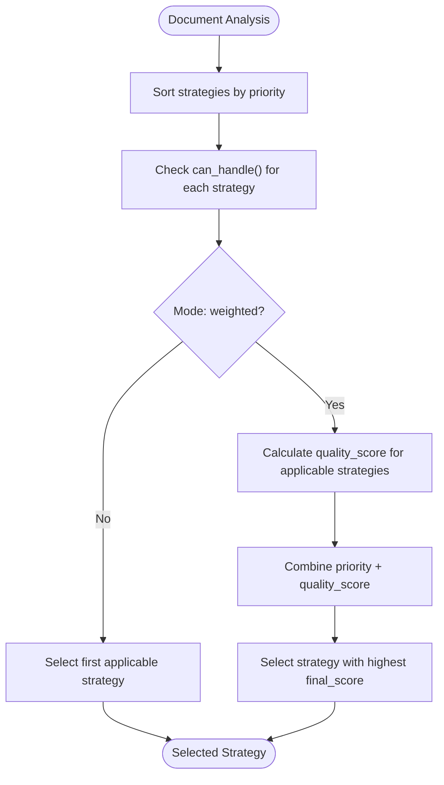
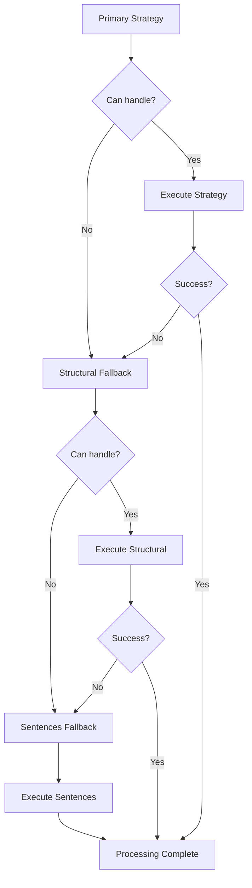

# Strategy Selection Configuration

<cite>
**Referenced Files in This Document**   
- [selector.py](file://markdown_chunker/chunker/selector.py)
- [types.py](file://markdown_chunker/chunker/types.py)
- [orchestrator.py](file://markdown_chunker/chunker/orchestrator.py)
- [fallback_manager.py](file://markdown_chunker/chunker/components/fallback_manager.py)
- [code_strategy.py](file://markdown_chunker/chunker/strategies/code_strategy.py)
- [mixed_strategy.py](file://markdown_chunker/chunker/strategies/mixed_strategy.py)
- [list_strategy.py](file://markdown_chunker/chunker/strategies/list_strategy.py)
- [table_strategy.py](file://markdown_chunker/chunker/strategies/table_strategy.py)
- [structural_strategy.py](file://markdown_chunker/chunker/strategies/structural_strategy.py)
</cite>

## Table of Contents
1. [Introduction](#introduction)
2. [Threshold Parameters](#threshold-parameters)
3. [Strategy Scoring System](#strategy-scoring-system)
4. [Common Configuration Issues](#common-configuration-issues)
5. [Document Type Tuning Examples](#document-type-tuning-examples)
6. [Troubleshooting Strategy Selection](#troubleshooting-strategy-selection)
7. [Debugging Strategy Decisions](#debugging-strategy-decisions)
8. [Conclusion](#conclusion)

## Introduction
The strategy selection system in the Markdown chunker automatically determines the optimal approach for processing documents based on their content characteristics. This configuration-driven system evaluates document features such as code ratio, list count, table count, and header count to select the most appropriate chunking strategy. The system supports both strict priority-based selection and weighted scoring modes, with comprehensive fallback mechanisms to ensure reliable processing across diverse document types.

**Section sources**
- [selector.py](file://markdown_chunker/chunker/selector.py#L1-L322)
- [types.py](file://markdown_chunker/chunker/types.py#L1-L800)

## Threshold Parameters
The strategy selection process relies on several threshold parameters that control when specific strategies are activated. These thresholds are validated during configuration initialization to ensure they fall within acceptable ranges.

### Code Ratio Threshold
The `code_ratio_threshold` parameter determines the minimum proportion of code content required for the CodeStrategy to be considered. This float value must be between 0.0 and 1.0, representing the percentage of the document that consists of code blocks. When a document's code ratio meets or exceeds this threshold and contains sufficient code blocks (as defined by `min_code_blocks`), the CodeStrategy becomes eligible for selection.

```python
# Validation in ChunkConfig.__post_init__
if not (0.0 <= self.code_ratio_threshold <= 1.0):
    raise ValueError("code_ratio_threshold must be between 0.0 and 1.0")
```

### List Count Threshold
The `list_count_threshold` specifies the minimum number of list elements required for the ListStrategy to be applicable. This integer parameter works in conjunction with `list_ratio_threshold` to identify list-heavy documents. The ListStrategy can handle a document if either the list count meets or exceeds this threshold OR the list ratio meets or exceeds the ratio threshold.

### Table Count Threshold
The `table_count_threshold` defines the minimum number of tables needed for the TableStrategy to be considered. Similar to the list threshold, this integer value works with `table_ratio_threshold` to identify table-dense documents. Documents with fewer tables than this threshold will not be processed by the TableStrategy, even if they have a high table-to-text ratio.

### Header Count Threshold
The `header_count_threshold` parameter sets the minimum number of headers required for the StructuralStrategy to be applicable. This threshold helps identify well-structured documents with clear section organization. Documents with header counts below this threshold will not use the StructuralStrategy, regardless of their overall structure.

**Section sources**
- [types.py](file://markdown_chunker/chunker/types.py#L579-L612)
- [code_strategy.py](file://markdown_chunker/chunker/strategies/code_strategy.py#L109-L134)
- [list_strategy.py](file://markdown_chunker/chunker/strategies/list_strategy.py#L89-L100)

## Strategy Scoring System
The strategy selection system employs a sophisticated scoring mechanism that combines priority ranking with quality assessment to determine the optimal chunking approach.

### Priority and Quality Combination
Each strategy has a priority value (lower numbers indicate higher priority) and calculates a quality score based on document characteristics. The final selection score combines these factors, allowing higher-priority strategies to win even with slightly lower quality scores. This ensures that specialized strategies like CodeStrategy (priority 1) are preferred when appropriate, while still allowing lower-priority strategies to win when they provide significantly better quality.



**Diagram sources**
- [selector.py](file://markdown_chunker/chunker/selector.py#L74-L77)
- [selector.py](file://markdown_chunker/chunker/selector.py#L100-L133)

### Quality Score Calculation
Each strategy implements its own `calculate_quality()` method that returns a score between 0.0 and 1.0. The CodeStrategy, for example, considers code ratio, number of code blocks, and language diversity when calculating quality. The MixedStrategy evaluates content balance and element diversity. These quality scores are then combined with priority to produce the final selection score.

```python
# Example from CodeStrategy.calculate_quality()
score = 0.0
if analysis.code_ratio >= 0.85:
    score += 0.8
elif analysis.code_ratio >= 0.7:
    score += 0.6
```

### Minimum Complexity for Mixed Strategy
The `min_complexity` parameter specifically affects the MixedStrategy by setting the minimum complexity score required for this strategy to be applicable. This threshold prevents the MixedStrategy from being selected for simple documents that would be better handled by more specialized strategies. The complexity score is derived from the document's structural and content diversity, with higher values indicating more complex, mixed-content documents.

**Section sources**
- [selector.py](file://markdown_chunker/chunker/selector.py#L100-L133)
- [mixed_strategy.py](file://markdown_chunker/chunker/strategies/mixed_strategy.py#L109-L118)
- [types.py](file://markdown_chunker/chunker/types.py#L587)

## Common Configuration Issues
Several common issues can arise when configuring the strategy selection system, particularly around threshold conflicts and fallback settings.

### Conflicting Thresholds
Conflicting thresholds occur when multiple strategies have overlapping eligibility criteria, potentially leading to suboptimal strategy selection. For example, a document with both high code ratio and many tables might qualify for both CodeStrategy and TableStrategy. The system resolves these conflicts through priority ordering in strict mode or through the weighted scoring system in weighted mode.

To avoid unexpected behavior, ensure that threshold values are set appropriately for your use case:
- Set `code_ratio_threshold` high enough (e.g., 0.7) to prevent CodeStrategy from activating on documents with moderate code content
- Adjust `list_count_threshold` and `list_ratio_threshold` to match typical document patterns
- Ensure `header_count_threshold` reflects the minimum structure you expect in documents intended for structural chunking

### Invalid Fallback Strategy Names
The `fallback_strategy` parameter must reference an existing strategy name. The system validates this during initialization, but configuration errors can still occur. The default value is "sentences", which refers to the SentencesStrategy. If this strategy is not available in the configured strategy list, the system will raise a validation error.

```python
# Validation in StrategySelector.validate_strategies()
fallback_strategies = [s for s in self.strategies if s.name == "sentences"]
if not fallback_strategies:
    issues.append("No fallback strategy (SentencesStrategy) configured")
```

### Priority Conflicts
Strategy priorities must be unique to ensure deterministic selection behavior. The system validates this and will report "Duplicate strategy priorities detected" if conflicts exist. The fallback strategy (SentencesStrategy) should have the lowest priority (highest numerical value) to ensure it only activates when other strategies fail or are not applicable.

**Section sources**
- [selector.py](file://markdown_chunker/chunker/selector.py#L225-L257)
- [fallback_manager.py](file://markdown_chunker/chunker/components/fallback_manager.py#L47-L58)

## Document Type Tuning Examples
Different document types require different threshold configurations to achieve optimal chunking results. The system provides factory methods for common scenarios, but custom tuning may be necessary for specific use cases.

### Code-Heavy Documents
For technical documentation, API references, or tutorials with extensive code examples, use the `for_code_heavy()` configuration profile. This profile lowers the `code_ratio_threshold` to 0.5 and reduces `min_code_blocks` to 2, making the CodeStrategy more aggressive in its detection. It also increases the `max_chunk_size` to 6144 characters to accommodate larger code blocks.

```python
# Configuration for code-heavy documents
config = ChunkConfig.for_code_heavy()
# - code_ratio_threshold: 0.5
# - min_code_blocks: 2
# - max_chunk_size: 6144
# - overlap_size: 300
```

### Structured Documents
For well-organized documentation with clear sections and hierarchies, use the `for_structured_docs()` profile. This configuration lowers the `header_count_threshold` to 2, making the StructuralStrategy more sensitive to document structure. It also reduces chunk sizes for better section granularity and increases overlap to maintain context between sections.

```python
# Configuration for structured documents
config = ChunkConfig.for_structured_docs()
# - header_count_threshold: 2
# - max_chunk_size: 3072
# - target_chunk_size: 1536
# - overlap_size: 150
```

### Mixed Content Documents
For documents containing a balanced mix of text, code, lists, and tables, the default configuration often works well. However, you may need to adjust the `min_complexity` threshold based on your content. Lower values (e.g., 0.2) make the MixedStrategy more sensitive to mixed content, while higher values (e.g., 0.5) require more complex documents before activating.

**Section sources**
- [types.py](file://markdown_chunker/chunker/types.py#L694-L738)
- [types.py](file://markdown_chunker/chunker/types.py#L740-L781)
- [mixed_strategy.py](file://markdown_chunker/chunker/strategies/mixed_strategy.py#L109-L118)

## Troubleshooting Strategy Selection
When encountering unexpected strategy selection behavior, follow these troubleshooting steps to diagnose and resolve issues.

### Unexpected Strategy Selection
If the system selects a different strategy than expected, first verify the content analysis metrics. Use the `explain_selection()` method to get detailed information about why a particular strategy was chosen:

```python
explanation = selector.explain_selection(analysis, config)
print(f"Selected: {explanation['selected_strategy']}")
print(f"Mode: {explanation['selection_mode']}")
for strategy in explanation['strategy_evaluation']:
    print(f"{strategy['name']}: can_handle={strategy['can_handle']}, "
          f"quality={strategy['quality_score']:.3f}, "
          f"final_score={strategy['final_score']:.3f}")
```

Check that your threshold values are appropriate for the document content. A common issue is having thresholds that are too permissive, causing specialized strategies to activate on documents that don't truly warrant them.

### Fallback Mechanism Issues
When the fallback mechanism activates unexpectedly, investigate the root cause by examining the error messages in the `ChunkingResult`. The fallback system has three levels:
1. Primary strategy (selected by strategy selector)
2. Structural fallback (for specialized strategies that fail)
3. Sentences fallback (universal fallback)

If fallback is occurring, determine whether it's due to:
- Strategy eligibility (can_handle() returns False)
- Strategy application failure (apply() raises an exception)
- Empty results (apply() returns no chunks)

Ensure that `enable_fallback` is set to `True` and that the fallback strategies are properly configured in the strategy list.



**Diagram sources**
- [fallback_manager.py](file://markdown_chunker/chunker/components/fallback_manager.py#L60-L175)
- [orchestrator.py](file://markdown_chunker/chunker/orchestrator.py#L272-L274)

**Section sources**
- [fallback_manager.py](file://markdown_chunker/chunker/components/fallback_manager.py#L60-L175)
- [orchestrator.py](file://markdown_chunker/chunker/orchestrator.py#L272-L274)

## Debugging Strategy Decisions
To debug strategy selection decisions, leverage the system's built-in diagnostic capabilities and content analysis metrics.

### Using Content Analysis Metrics
The Stage 1 content analysis provides detailed metrics about document characteristics that drive strategy selection:

```python
# Available content analysis metrics
analysis.content_type
analysis.code_ratio
analysis.code_block_count
analysis.list_count
analysis.table_count
analysis.header_count
analysis.complexity_score
analysis.has_mixed_content
```

Compare these metrics against your threshold values to understand why a strategy was or wasn't selected. For example, if the CodeStrategy wasn't selected despite visible code blocks, check whether the `code_ratio` meets the `code_ratio_threshold` and whether `code_block_count` meets `min_code_blocks`.

### Strategy Validation
Use the `validate_strategies()` method to check for configuration issues:

```python
issues = selector.validate_strategies()
if issues:
    for issue in issues:
        print(f"Configuration issue: {issue}")
```

This method checks for common problems like duplicate priorities, missing fallback strategies, and duplicate strategy names.

### Selection Explanation
The `explain_selection()` method provides a comprehensive breakdown of the decision process:

```python
explanation = selector.explain_selection(analysis, config)
# Returns dict with:
# - selected_strategy
# - selection_mode
# - content_analysis metrics
# - strategy_evaluation (all strategies with scores and reasons)
```

This explanation helps identify whether the selection was driven by priority (strict mode) or by the weighted combination of priority and quality (weighted mode).

**Section sources**
- [selector.py](file://markdown_chunker/chunker/selector.py#L181-L223)
- [selector.py](file://markdown_chunker/chunker/selector.py#L225-L257)

## Conclusion
The strategy selection configuration system provides fine-grained control over how documents are chunked based on their content characteristics. By understanding and properly tuning the threshold parameters—`code_ratio_threshold`, `list_count_threshold`, `table_count_threshold`, and `header_count_threshold`—you can optimize the system for different document types. The scoring system balances strategy priority with content-specific quality assessment, while comprehensive fallback mechanisms ensure reliable processing. When troubleshooting issues, leverage the diagnostic methods like `explain_selection()` and `validate_strategies()` to understand the decision process and identify configuration problems.