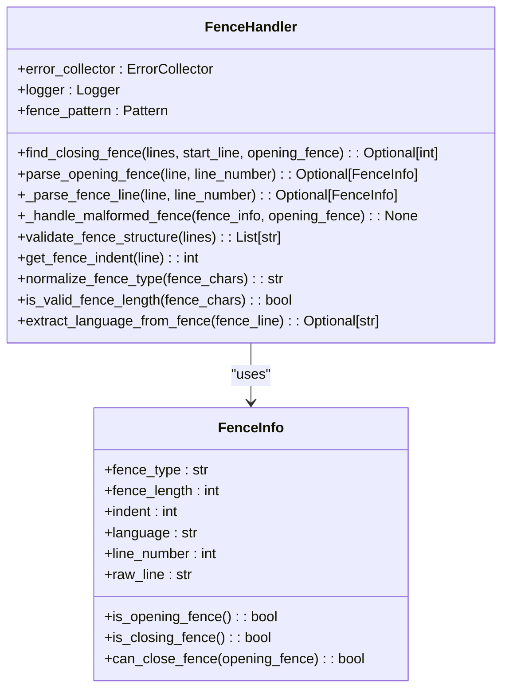
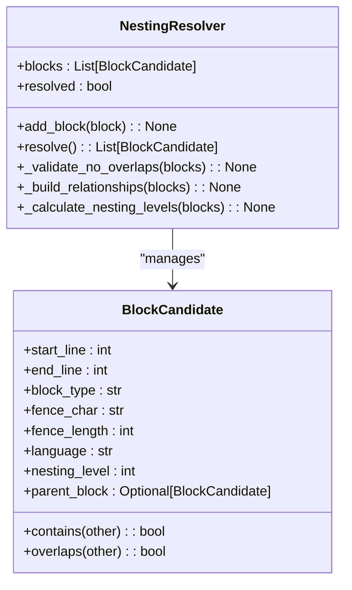
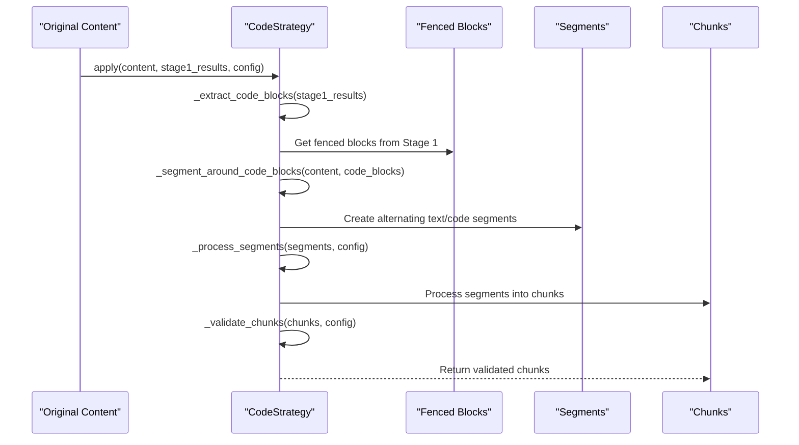
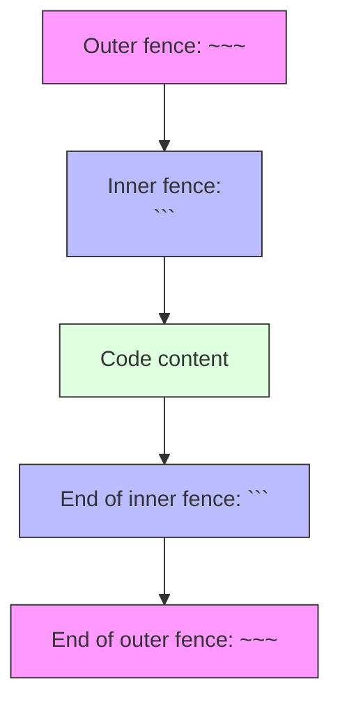
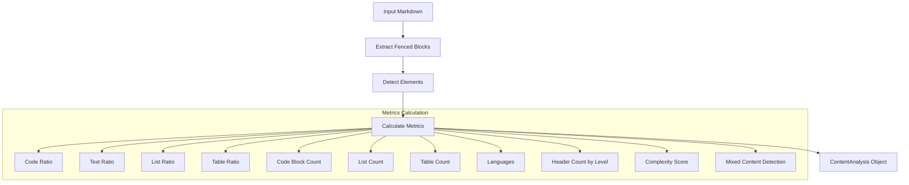
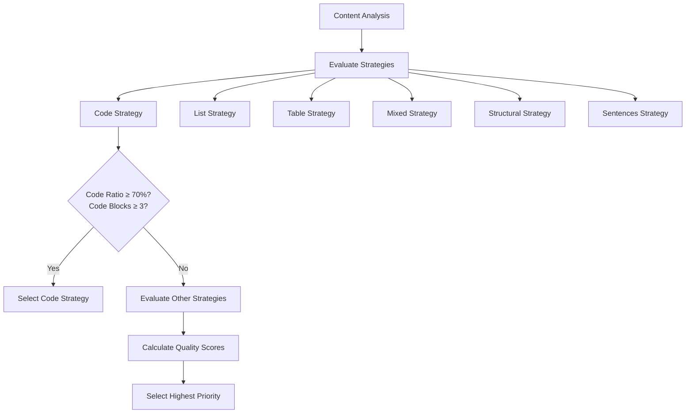

# Code Block Issues

<cite>
**Referenced Files in This Document**   
- [code_strategy.py](file://markdown_chunker/chunker/strategies/code_strategy.py)
- [fence_handler.py](file://markdown_chunker/parser/fence_handler.py)
- [nesting_resolver.py](file://markdown_chunker/parser/nesting_resolver.py)
- [edge_cases.md](file://tests/fixtures/edge_cases.md)
- [code_heavy.md](file://tests/fixtures/code_heavy.md)
- [mixed_fence_lengths.md](file://tests/parser/fixtures/edge_cases/mixed_fence_lengths.md)
- [nested_fences.md](file://tests/parser/fixtures/edge_cases/nested_fences.md)
- [unclosed_fence.md](file://tests/parser/fixtures/edge_cases/unclosed_fence.md)
- [headers_in_code.md](file://tests/parser/fixtures/edge_cases/headers_in_code.md)
- [test_code_strategy.py](file://tests/chunker/test_strategies/test_code_strategy.py)
- [test_nested_fence_handling.py](file://tests/parser/test_nested_fence_handling.py)
- [test_fenced_block_extractor.py](file://tests/parser/test_fenced_block_extractor.py)
</cite>

## Table of Contents
1. [Introduction](#introduction)
2. [Code Block Parsing and Nesting](#code-block-parsing-and-nesting)
3. [Code Strategy Implementation](#code-strategy-implementation)
4. [Common Code Block Issues](#common-code-block-issues)
5. [Edge Case Handling](#edge-case-handling)
6. [Content Analysis and Strategy Selection](#content-analysis-and-strategy-selection)
7. [Recommendations for Code-Heavy Documents](#recommendations-for-code-heavy-documents)
8. [Conclusion](#conclusion)

## Introduction

This document provides a comprehensive analysis of code block issues in markdown chunking, focusing on how the parser identifies and preserves code blocks with proper nesting. It covers handling of mixed fence lengths, nested fences, and indentation variations, along with common issues like code blocks being split across chunks, language detection problems, and incorrect line numbering. The document also addresses edge cases such as unclosed fences, headers within code blocks, and task lists in code sections, providing solutions and recommendations for structuring code-heavy documents to ensure optimal chunking results.

**Section sources**
- [code_strategy.py](file://markdown_chunker/chunker/strategies/code_strategy.py#L1-L625)
- [fence_handler.py](file://markdown_chunker/parser/fence_handler.py#L1-L306)
- [nesting_resolver.py](file://markdown_chunker/parser/nesting_resolver.py#L1-L273)

## Code Block Parsing and Nesting

The markdown chunker implements a sophisticated system for parsing and handling code blocks, ensuring proper nesting and preservation of code structure. The parser uses a combination of fence detection, nesting resolution, and indentation handling to correctly process code blocks according to Markdown specification.

### Fence Detection and Validation

The `FenceHandler` class is responsible for detecting and validating code block fences in markdown documents. It uses regular expressions to identify fence patterns and validates their structure according to Markdown specifications.



**Diagram sources**
- [fence_handler.py](file://markdown_chunker/parser/fence_handler.py#L18-L306)

The `FenceInfo` class captures essential information about a fence, including its type (``` or ~~~), length, indentation level, language identifier, line number, and raw line content. The `FenceHandler` class uses this information to validate fence structure and handle edge cases.

Key validation rules include:
- Closing fences must be at least as long as opening fences
- Closing fences cannot be more indented than opening fences
- Fences must have consistent types (``` or ~~~)
- Proper nesting must be maintained

When unclosed fences are detected, the system generates warnings and attempts to extract the complete code block content:

```python
# Example from fence_handler.py
def find_closing_fence(
    self, lines: List[str], start_line: int, opening_fence: FenceInfo
) -> Optional[int]:
    """
    Find closing fence with proper indentation and specification compliance.
    
    Returns:
        Line number of closing fence (0-based) or None if not found
    """
    for i in range(start_line, len(lines)):
        line = lines[i]
        fence_info = self._parse_fence_line(line, i + 1)
        
        if fence_info:
            if fence_info.can_close_fence(opening_fence):
                return i
            elif fence_info.fence_type == opening_fence.fence_type:
                self._handle_malformed_fence(fence_info, opening_fence)
    
    # No closing fence found - add warning
    location = SourceLocation(
        line=opening_fence.line_number, column=opening_fence.indent
    )
    self.error_collector.add_warning(
        f"Unclosed {opening_fence.fence_type} fence starting at "
        f"line {opening_fence.line_number}",
        category="fence_parsing",
        location=location,
        details=f"Fence type: {opening_fence.fence_type}, "
        f"length: {opening_fence.fence_length}, "
        f"indent: {opening_fence.indent}",
    )
    return None
```

**Section sources**
- [fence_handler.py](file://markdown_chunker/parser/fence_handler.py#L70-L122)

### Nesting Resolution

The `NestingResolver` class handles nested code blocks, building parent-child relationships and calculating nesting levels. This ensures that nested fences are properly contained within outer blocks rather than being treated as separate entities.



**Diagram sources**
- [nesting_resolver.py](file://markdown_chunker/parser/nesting_resolver.py#L16-L273)

The nesting resolution process follows these steps:
1. Sort blocks by start line, then by end line (descending)
2. Validate no overlapping blocks exist
3. Build parent-child relationships
4. Calculate nesting levels

This approach ensures that inner fence markers are treated as content rather than separate blocks, preventing the creation of "phantom blocks" in nested structures.

**Section sources**
- [nesting_resolver.py](file://markdown_chunker/parser/nesting_resolver.py#L97-L124)

## Code Strategy Implementation

The `CodeStrategy` class is designed to handle documents with large amounts of code, preserving code block atomicity while maintaining context with surrounding text. This strategy has the highest priority (1) and is selected when content meets specific criteria.

### Strategy Selection Criteria

The code strategy is selected based on two primary criteria:
- High code ratio (≥70% by default)
- Sufficient code blocks (≥3 by default)

```python
def can_handle(self, analysis: ContentAnalysis, config: ChunkConfig) -> bool:
    """
    Check if strategy can handle the content.
    
    Requires:
    - High code ratio (≥70% by default, configurable via code_ratio_threshold)
    - Sufficient code blocks (≥3 by default, configurable via min_code_blocks)
    """
    return (
        analysis.code_ratio >= config.code_ratio_threshold
        and analysis.code_block_count >= config.min_code_blocks
    )
```

The quality score for the code strategy is calculated based on:
- Code ratio contribution (≥85%: 0.8, ≥70%: 0.6, ≥50%: 0.3)
- Code block count contribution (≥10: +0.2, ≥5: +0.15, ≥3: +0.1)
- Multiple programming languages bonus (+0.1)

**Section sources**
- [code_strategy.py](file://markdown_chunker/chunker/strategies/code_strategy.py#L109-L185)

### Code Block Processing

The code strategy processes content by segmenting it around code blocks and preserving their atomicity. Code segments are never split, even if they exceed the maximum chunk size, to maintain code integrity.



**Diagram sources**
- [code_strategy.py](file://markdown_chunker/chunker/strategies/code_strategy.py#L187-L217)

The processing workflow includes:
1. Extract code blocks from Stage 1 results
2. Segment content around code blocks
3. Process segments into chunks
4. Validate chunks

Text segments may be split if they exceed the maximum chunk size, but code segments are always kept atomic.

**Section sources**
- [code_strategy.py](file://markdown_chunker/chunker/strategies/code_strategy.py#L187-L217)

### Language Detection and Metadata Extraction

The code strategy includes sophisticated language detection and metadata extraction capabilities. It uses pattern matching to identify programming languages and extract function and class names.

```python
LANGUAGE_PATTERNS = {
    "python": [
        r"\bdef\s+\w+",
        r"\bclass\s+\w+",
        r"\bimport\s+\w+",
        r"\bfrom\s+\w+",
    ],
    "javascript": [
        r"\bfunction\s+\w+",
        r"\bconst\s+\w+",
        r"\blet\s+\w+",
        r"\bvar\s+\w+",
    ],
    # ... other languages
}

def _detect_language(self, code_content: str) -> Optional[str]:
    """Detect programming language from code content."""
    for language, patterns in self.LANGUAGE_PATTERNS.items():
        for pattern in patterns:
            if re.search(pattern, code_content, re.IGNORECASE):
                return language
    return None
```

Function and class names are extracted using language-specific patterns:

```python
FUNCTION_PATTERNS = {
    "python": r"\bdef\s+(\w+)\s*\(",
    "javascript": r"\bfunction\s+(\w+)\s*\(",
    "java": r"\b(?:public|private|protected)?\s*(?:static)?\s*\w+\s+(\w+)\s*\(",
    # ... other languages
}

CLASS_PATTERNS = {
    "python": r"\bclass\s+(\w+)",
    "javascript": r"\bclass\s+(\w+)",
    "java": r"\b(?:public|private)?\s*class\s+(\w+)",
    # ... other languages
}
```

**Section sources**
- [code_strategy.py](file://markdown_chunker/chunker/strategies/code_strategy.py#L57-L97)

## Common Code Block Issues

This section addresses common issues encountered when processing code blocks in markdown documents and how the system handles them.

### Code Blocks Split Across Chunks

One common issue is code blocks being split across chunks, which can break code syntax and make it difficult to understand. The code strategy prevents this by treating code blocks as atomic units that cannot be split.

When a code block exceeds the maximum chunk size, it is allowed to create an oversized chunk with appropriate metadata:

```python
# In _create_code_chunk method
if len(segment.content) > config.max_chunk_size:
    metadata["allow_oversize"] = True
    metadata["oversize_reason"] = "code_block_atomicity"
```

This ensures that complete code blocks are preserved intact, even if they exceed normal size limits.

**Section sources**
- [code_strategy.py](file://markdown_chunker/chunker/strategies/code_strategy.py#L428-L432)

### Language Detection Problems

Language detection can fail when code blocks lack language identifiers or contain ambiguous syntax. The system addresses this through:

1. **Language identifiers in fences**: When a language is specified in the opening fence (e.g., ```python), it is used directly.
2. **Pattern-based detection**: When no language is specified, the system analyzes code content using language-specific patterns.
3. **Fallback to content analysis**: The overall document's language distribution can inform detection.

The system also handles cases where language detection fails by setting the language to "unknown" rather than failing entirely.

**Section sources**
- [code_strategy.py](file://markdown_chunker/chunker/strategies/code_strategy.py#L532-L547)

### Incorrect Line Numbering

Maintaining accurate line numbering is crucial for code block processing. The system calculates line numbers based on character positions in the original content:

```python
def _calculate_line_number(self, content: str, position: int) -> int:
    """Calculate line number for a character position."""
    return content[:position].count("\n") + 1
```

This ensures that line numbers in the output chunks correspond accurately to the original document, which is important for error reporting and code referencing.

**Section sources**
- [code_strategy.py](file://markdown_chunker/chunker/strategies/code_strategy.py#L591-L602)

## Edge Case Handling

This section examines how the system handles various edge cases in code block processing, using examples from the test fixtures.

### Mixed Fence Lengths

Documents may contain fences of different lengths, which can create parsing challenges. The system handles mixed fence lengths by treating longer fences as the outer container.

For example, in a document with four backticks containing three backticks:

``````
````
code
```
``````
``````

The system correctly identifies the outer block with four backticks and treats the inner three-backtick sequence as content within the outer block, not as a separate code block.

**Section sources**
- [mixed_fence_lengths.md](file://tests/parser/fixtures/edge_cases/mixed_fence_lengths.md#L1-L19)
- [test_nested_fence_handling.py](file://tests/parser/test_nested_fence_handling.py#L149-L167)

### Nested Fences

Nested fences with different types (e.g., ``` containing ~~~) are handled by treating the outer fence as the container and the inner fence as content.



**Diagram sources**
- [nested_fences.md](file://tests/parser/fixtures/edge_cases/nested_fences.md#L1-L9)
- [test_nested_fence_handling.py](file://tests/parser/test_nested_fence_handling.py#L40-L75)

The system ensures that inner fence markers do not create phantom blocks by validating that closing fences meet the criteria for closing the current opening fence.

### Unclosed Fences

Unclosed fences are a common issue in markdown documents. The system handles unclosed fences by:

1. Detecting the unclosed fence during validation
2. Generating a warning in the error collector
3. Attempting to extract the complete code block content
4. Preserving the content as a single block

```python
# Example from unclosed_fence.md
```python
def function():
    return "unclosed code"
# Note: This fence is not closed!
```

In this case, the system will detect that the fence is unclosed, generate a warning, but still extract the complete code block content for processing.

**Section sources**
- [unclosed_fence.md](file://tests/parser/fixtures/edge_cases/unclosed_fence.md#L1-L8)
- [test_fenced_block_extractor.py](file://tests/parser/test_fenced_block_extractor.py#L50-L60)

### Headers Within Code Blocks

Headers within code blocks (lines starting with #) should be treated as code comments, not as markdown headers. The system handles this by processing code blocks as atomic units that are not subject to header detection.

```python
# Example from headers_in_code.md
# This is not a header
def function():
    # This is a comment
    pass
```

The parser correctly identifies that the # symbol within a code block is part of the code content, not a markdown header, preserving the code block's integrity.

**Section sources**
- [headers_in_code.md](file://tests/parser/fixtures/edge_cases/headers_in_code.md#L1-L14)
- [test_code_strategy.py](file://tests/chunker/test_strategies/test_code_strategy.py#L224-L253)

### Task Lists in Code Sections

Task lists within code sections should be preserved as code content rather than being processed as markdown task lists. The system handles this by treating code blocks as atomic units that are not subject to list detection.

When a task list appears within a code block, it is preserved as literal text within the code block, maintaining the code's syntax and structure.

## Content Analysis and Strategy Selection

Understanding how the system analyzes content and selects the appropriate strategy is crucial for troubleshooting code block issues.

### Content Analysis Process

The content analysis process extracts key metrics from the markdown document to inform strategy selection:



**Diagram sources**
- [analyzer.py](file://markdown_chunker/parser/analyzer.py#L27-L200)

The `ContentAnalyzer` class performs this analysis, calculating metrics such as code ratio, text ratio, list ratio, and table ratio based on character counts. It also identifies programming languages used in code blocks and detects mixed content types.

**Section sources**
- [analyzer.py](file://markdown_chunker/parser/analyzer.py#L18-L200)

### Strategy Selection Logic

The strategy selection process evaluates multiple strategies and selects the most appropriate one based on content analysis:



**Diagram sources**
- [selector.py](file://markdown_chunker/chunker/selector.py#L166-L193)

The system evaluates all available strategies, calculates quality scores, and selects the strategy with the highest priority that can handle the content. For code-heavy documents, the code strategy has the highest priority (1).

**Section sources**
- [selector.py](file://markdown_chunker/chunker/selector.py#L166-L193)

### Interpreting Content Analysis Data

To understand why a particular strategy was selected or not selected, examine the content analysis data:

```python
# Example content analysis data
ContentAnalysis(
    total_chars=1500,
    total_lines=50,
    code_ratio=0.75,
    text_ratio=0.20,
    code_block_count=5,
    list_count=2,
    table_count=1,
    languages={'python': 3, 'javascript': 2},
    content_type='code_heavy',
    complexity_score=0.85,
    has_mixed_content=False,
    # ... other fields
)
```

Key indicators for code strategy selection:
- `code_ratio` ≥ 0.7 (70%)
- `code_block_count` ≥ 3
- `has_mixed_content` is False
- Multiple programming languages present

If the code strategy was not selected despite apparent code-heavy content, check:
- Whether code blocks were properly detected
- Whether the code ratio meets the threshold
- Whether there are sufficient code blocks
- Whether mixed content is interfering with strategy selection

**Section sources**
- [analyzer.py](file://markdown_chunker/parser/analyzer.py#L27-L200)
- [code_strategy.py](file://markdown_chunker/chunker/strategies/code_strategy.py#L109-L134)

## Recommendations for Code-Heavy Documents

To ensure optimal chunking results for code-heavy documents, follow these recommendations:

### Structure Documents for Optimal Parsing

1. **Use consistent fence lengths**: Stick to three backticks (```) for code blocks to avoid parsing issues with mixed fence lengths.
2. **Specify language identifiers**: Always include the programming language after the opening fence (e.g., ```python) to ensure proper syntax highlighting and language detection.
3. **Close all fences**: Ensure every opening fence has a corresponding closing fence to prevent unclosed block issues.
4. **Minimize nested fences**: While the system handles nested fences, avoiding deep nesting improves readability and reduces parsing complexity.

### Optimize for Strategy Selection

1. **Ensure sufficient code content**: Maintain a code ratio of at least 70% to trigger the code strategy.
2. **Include multiple code blocks**: Have at least three code blocks in your document to meet the minimum requirement.
3. **Use descriptive comments**: Include comments that help with language detection and context preservation.
4. **Balance code and explanation**: Provide adequate text explanations around code blocks to maintain context.

### Handle Edge Cases Proactively

1. **Test with edge cases**: Verify your documents handle mixed fence lengths, nested fences, and unclosed fences correctly.
2. **Validate line numbering**: Ensure line numbers are preserved correctly in the output chunks.
3. **Check language detection**: Verify that the system correctly identifies programming languages, especially in documents with multiple languages.
4. **Review chunk boundaries**: Examine how chunks are split to ensure code blocks remain intact and context is preserved.

## Conclusion

The markdown chunker provides robust handling of code blocks through sophisticated parsing, nesting resolution, and strategy selection. By understanding how the system identifies and preserves code blocks, handles edge cases, and selects appropriate strategies based on content analysis, users can structure their documents to achieve optimal chunking results. The key principles are preserving code block atomicity, maintaining accurate line numbering, and ensuring proper nesting, all while providing sufficient context through surrounding text. Following the recommendations outlined in this document will help ensure that code-heavy documents are processed correctly and efficiently.