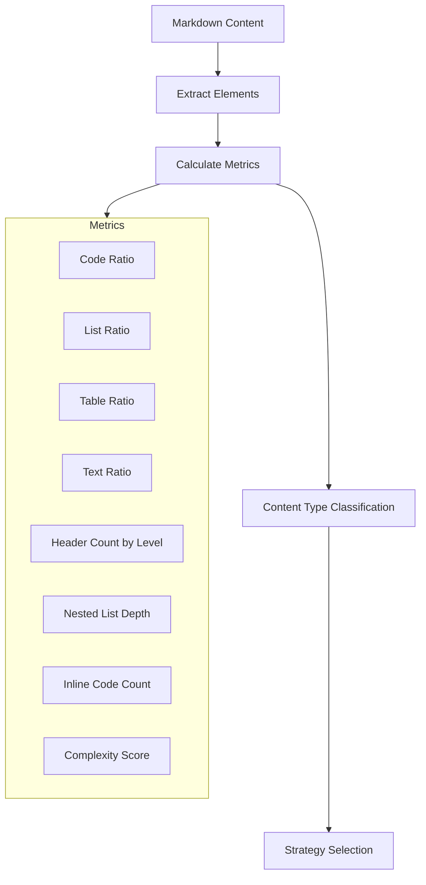
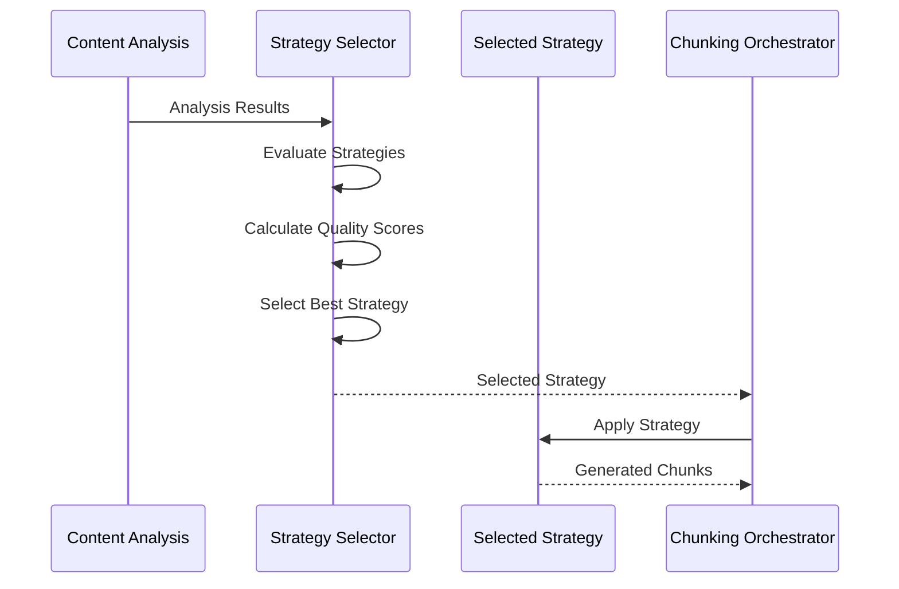

# Content-Specific Issues

<cite>
**Referenced Files in This Document**   
- [analyzer.py](file://markdown_chunker/parser/analyzer.py)
- [orchestrator.py](file://markdown_chunker/chunker/orchestrator.py)
- [selector.py](file://markdown_chunker/chunker/selector.py)
- [code_strategy.py](file://markdown_chunker/chunker/strategies/code_strategy.py)
- [list_strategy.py](file://markdown_chunker/chunker/strategies/list_strategy.py)
- [table_strategy.py](file://markdown_chunker/chunker/strategies/table_strategy.py)
- [edge_cases.md](file://tests/fixtures/edge_cases.md)
- [mixed.md](file://tests/fixtures/mixed.md)
- [mixed_fence_lengths.md](file://tests/parser/fixtures/edge_cases/mixed_fence_lengths.md)
- [nested_fences.md](file://tests/parser/fixtures/edge_cases/nested_fences.md)
- [headers_in_code.md](file://tests/parser/fixtures/edge_cases/headers_in_code.md)
- [deep_nested_list.md](file://tests/parser/fixtures/edge_cases/deep_nested_list.md)
- [mixed_list_types.md](file://tests/parser/fixtures/edge_cases/mixed_list_types.md)
</cite>

## Table of Contents
1. [Introduction](#introduction)
2. [Content Analysis Phase](#content-analysis-phase)
3. [Strategy Selection Process](#strategy-selection-process)
4. [Troubleshooting Content-Specific Issues](#troubleshooting-content-specific-issues)
5. [Edge Cases and Complex Structures](#edge-cases-and-complex-structures)
6. [Preprocessing Recommendations](#preprocessing-recommendations)
7. [Conclusion](#conclusion)

## Introduction

This document provides comprehensive guidance for troubleshooting issues related to specific content types and structures in the markdown-chunker system. The system analyzes markdown content to determine the optimal chunking strategy based on content characteristics. This analysis phase is critical for preserving structural integrity when splitting content into chunks, particularly for complex markdown elements like code blocks, tables, and nested lists.

The document explains how the content analysis phase determines strategy selection, how to interpret analysis results, and provides solutions for common issues such as empty chunks, lost content, or incorrect header paths. It also documents known edge cases with complex markdown structures and provides recommendations for preprocessing content to avoid common issues.

**Section sources**
- [analyzer.py](file://markdown_chunker/parser/analyzer.py#L1-L499)

## Content Analysis Phase

The content analysis phase is the foundation of the chunking system's decision-making process. It examines the markdown document to extract metrics and characteristics that inform strategy selection. The `ContentAnalyzer` class performs comprehensive analysis of the document, calculating various metrics that determine which chunking strategy is most appropriate.

The analysis process begins by extracting fundamental elements from the markdown content:
- Code blocks (fenced and indented)
- Lists (ordered, unordered, and task lists)
- Tables
- Headers
- Inline code elements

From these elements, the analyzer calculates key metrics:



**Diagram sources**
- [analyzer.py](file://markdown_chunker/parser/analyzer.py#L18-L206)

The analyzer calculates content ratios by measuring the character count of each content type relative to the total document size. These ratios are crucial for determining the document's primary content type:

- **Code ratio**: Percentage of content that is code (fenced blocks and indented code)
- **List ratio**: Percentage of content that is list items
- **Table ratio**: Percentage of content that is table data
- **Text ratio**: Percentage of content that is prose text

Additional structural metrics include:
- Maximum header depth (highest level header used)
- Nested list depth (maximum indentation level of lists)
- Average and maximum line length
- Count of empty lines and indented lines
- Punctuation ratio and special character frequency

The analyzer also extracts programming languages used in code blocks and counts their occurrences, which helps in selecting the appropriate code strategy when multiple languages are present.

One of the most important outputs of the analysis phase is the content type classification, which categorizes documents as:
- **code_heavy**: Documents with ≥70% code content
- **list_heavy**: Documents with ≥60% list content
- **mixed**: Documents with multiple significant content types
- **primary**: Documents dominated by prose text

This classification directly informs the strategy selection process, ensuring that the most appropriate chunking approach is used for each document type.

**Section sources**
- [analyzer.py](file://markdown_chunker/parser/analyzer.py#L18-L206)

## Strategy Selection Process

The strategy selection process uses the results from the content analysis phase to determine the optimal chunking approach for a given document. The `StrategySelector` class implements a priority-based system that evaluates available strategies and selects the best fit based on the document's characteristics.



**Diagram sources**
- [selector.py](file://markdown_chunker/chunker/selector.py#L19-L322)
- [orchestrator.py](file://markdown_chunker/chunker/orchestrator.py#L23-L340)

The selection process operates in two modes:
- **Strict mode**: Selects the first applicable strategy by priority order
- **Weighted mode**: Evaluates all applicable strategies and selects the one with the highest combined score based on priority and quality metrics

Each strategy implements a `can_handle` method that determines whether it can process the given content based on the analysis results. For example, the `CodeStrategy` requires:
- Code ratio ≥ 70% (configurable via `code_ratio_threshold`)
- At least 3 code blocks (configurable via `min_code_blocks`)

When a strategy can handle the content, it calculates a quality score that reflects how well it can process the document. The quality score considers factors such as:
- For code-heavy documents: code ratio, number of code blocks, and multiple programming languages
- For list-heavy documents: list count, list ratio, and nested list structures
- For table-heavy documents: table count and table ratio

The selection process also includes validation to ensure the strategy configuration is correct:
- Checks for duplicate strategy priorities
- Verifies that a fallback strategy (SentencesStrategy) is configured
- Ensures strategy names are unique

The orchestrator coordinates the entire process, running the content analysis, selecting the appropriate strategy, and applying it to generate chunks. If the selected strategy fails or returns empty results, the orchestrator triggers the fallback mechanism to ensure chunks are always produced.

The system provides an `explain_selection` method that returns a detailed explanation of why a particular strategy was selected, including:
- The selected strategy name
- Selection mode used
- Key content analysis metrics
- Evaluation of all strategies with their quality scores
- Reasoning for selection or rejection of each strategy

This transparency allows users to understand and debug the strategy selection process when unexpected behavior occurs.

**Section sources**
- [selector.py](file://markdown_chunker/chunker/selector.py#L19-L322)
- [orchestrator.py](file://markdown_chunker/chunker/orchestrator.py#L23-L340)

## Troubleshooting Content-Specific Issues

This section addresses common issues that can occur when chunking specific content types and provides solutions for each problem.

### Code Block Issues

**Problem: Code blocks being split incorrectly**
Code blocks should never be split across chunks, as this breaks syntax and makes the code unusable. The `CodeStrategy` ensures code blocks remain atomic by:

1. Extracting complete code blocks with their fences
2. Preserving the entire code block in a single chunk
3. Allowing oversize chunks when necessary to maintain code integrity

If code blocks are being split, check:
- Ensure the document qualifies for the CodeStrategy (≥70% code ratio, ≥3 code blocks)
- Verify that code fences are properly closed
- Check for mixed fence lengths that might confuse the parser

**Problem: Headers appearing inside code blocks**
Headers within code blocks (e.g., commented headers in source code) should not be treated as markdown headers. The system handles this by:

1. Processing code blocks as literal content during analysis
2. Not extracting headers from within fenced code blocks
3. Preserving the code content exactly as written

Example from `headers_in_code.md`:
````markdown
# Real Header

```python
# This is not a header
def function():
    pass
```
````
The header inside the code block is preserved as code content, not as a markdown header.

### Table Issues

**Problem: Tables not being preserved**
Tables should maintain their structure when chunked. The `TableStrategy` preserves tables by:

1. Detecting complete tables (header, separator, and rows)
2. Keeping small tables intact in single chunks
3. Splitting large tables by rows while duplicating headers

If tables are being broken:
- Ensure the table has a proper separator line (e.g., `|---|---|`)
- Verify that all rows have the correct number of columns
- Check for nested tables which may require special handling

### List Issues

**Problem: Lists being broken across chunks**
Lists should maintain their hierarchy and parent-child relationships. The `ListStrategy` preserves list structure by:

1. Building a hierarchical tree of list items
2. Grouping related items together
3. Duplicating parent items when splitting large lists

The strategy handles various list types:
- Ordered lists (1., 2., 3.)
- Unordered lists (-, *, +)
- Task lists (- [x], - [ ])

**Problem: Nested lists losing indentation**
Nested lists should preserve their indentation levels. The system tracks the level of each list item and reconstructs the proper indentation when creating chunks.

Example from `deep_nested_list.md`:
```markdown
- Level 1
  - Level 2
    - Level 3
      - Level 4
        - Level 5
          - Level 6
            Deep nesting!
```
All indentation levels are preserved in the chunking process.

### Empty Chunks and Lost Content

**Problem: Empty chunks being generated**
Empty chunks can occur when:
- A strategy returns no chunks for valid content
- There are parsing errors in the content analysis phase
- The content contains only whitespace or insignificant elements

Solutions:
1. The system includes a fallback mechanism that triggers when a strategy returns empty results
2. The fallback manager attempts alternative strategies until chunks are produced
3. Empty content is filtered out before chunking begins

**Problem: Content being lost during chunking**
Content loss can occur due to:
- Improper handling of content between structural elements
- Errors in calculating content boundaries
- Issues with line numbering and position tracking

The system prevents content loss by:
1. Processing content in document order
2. Tracking start and end positions of all elements
3. Including text segments between code blocks, lists, and tables
4. Sorting chunks by document position before returning results

### Incorrect Header Paths

**Problem: Header paths not reflecting document structure**
Header paths should accurately represent the document's hierarchy. Issues can occur when:
- Headers are not properly detected during analysis
- The nesting resolver fails to establish parent-child relationships
- There are inconsistencies in header levels

The system ensures accurate header paths by:
1. Detecting all headers during the content analysis phase
2. Building a hierarchical structure based on header levels
3. Validating header sequences to prevent illogical progressions

**Section sources**
- [code_strategy.py](file://markdown_chunker/chunker/strategies/code_strategy.py#L42-L625)
- [list_strategy.py](file://markdown_chunker/chunker/strategies/list_strategy.py#L58-L800)
- [table_strategy.py](file://markdown_chunker/chunker/strategies/table_strategy.py#L56-L466)
- [edge_cases.md](file://tests/fixtures/edge_cases.md#L1-L62)
- [mixed.md](file://tests/fixtures/mixed.md#L1-L51)

## Edge Cases and Complex Structures

This section documents known edge cases with complex markdown structures and how the system handles them.

### Mixed Fence Lengths

Documents with mixed fence lengths can cause parsing issues. The system handles this by:

1. Detecting the opening fence length and finding the matching closing fence
2. Preserving the exact fence length used in the original content
3. Not normalizing fence lengths across the document

Example from `mixed_fence_lengths.md`:
```````markdown
Four backticks:

````
Three backticks:
```
code
```
````

Five backticks:

`````
Code with four:
````
code
````
`````
```````
Each code block is properly identified and preserved with its original fence length.

### Nested Fences

Nested fences with different delimiters are handled by:
1. Processing the outermost fence first
2. Treating inner fences as literal content
3. Preserving the complete nested structure

Example from `nested_fences.md`:
````markdown
Outer fence:

~~~
```
code inside
```
~~~
````
The inner triple backticks are treated as content within the outer tilde fence.

### Headers in Code Blocks

Headers that appear within code blocks are preserved as code content, not parsed as markdown headers. This prevents false positive header detection.

### Mixed List Types

Documents with mixed list types are handled by:
1. Detecting each list item's type independently
2. Preserving the original markers (-, *, +, 1., 2., etc.)
3. Maintaining proper indentation for nested items

Example from `mixed_list_types.md`:
```markdown
- Unordered item
- Another item
  1. Nested ordered item
  2. Another nested item
- Back to unordered
```
The hierarchy and list types are preserved in the chunking process.

### Empty and Malformed Elements

The system handles empty sections and malformed elements by:
- Skipping empty sections that contain only whitespace
- Attempting to repair malformed code blocks by finding the closing fence
- Preserving content after malformed elements
- Logging warnings for malformed content

Example from `edge_cases.md`:
```markdown
## Empty Sections

### Empty Subsection

### Another Empty Subsection
```
Empty sections are detected but not included in chunks unless they contain meaningful content.

The fallback system ensures that even with malformed content, the chunking process completes successfully by:
1. Attempting the primary strategy
2. Falling back to alternative strategies if the primary fails
3. Using the sentences strategy as a last resort
4. Returning meaningful error information when chunks cannot be generated

**Section sources**
- [mixed_fence_lengths.md](file://tests/parser/fixtures/edge_cases/mixed_fence_lengths.md#L1-L19)
- [nested_fences.md](file://tests/parser/fixtures/edge_cases/nested_fences.md#L1-L9)
- [headers_in_code.md](file://tests/parser/fixtures/edge_cases/headers_in_code.md#L1-L14)
- [deep_nested_list.md](file://tests/parser/fixtures/edge_cases/deep_nested_list.md#L1-L9)
- [mixed_list_types.md](file://tests/parser/fixtures/edge_cases/mixed_list_types.md#L1-L7)
- [edge_cases.md](file://tests/fixtures/edge_cases.md#L1-L62)

## Preprocessing Recommendations

To avoid common issues and ensure optimal chunking results, follow these preprocessing recommendations:

### Content Structure Guidelines

1. **Use consistent formatting**:
   - Maintain consistent indentation (spaces vs. tabs)
   - Use uniform fence lengths for code blocks
   - Keep header levels logical and sequential

2. **Properly close all elements**:
   - Ensure all code blocks have closing fences
   - Close all list items properly
   - Complete all table structures with proper separators

3. **Avoid excessive nesting**:
   - Limit list nesting to 5-6 levels for better readability
   - Break large tables into smaller ones when possible
   - Use sections and headers to organize content instead of deep nesting

### Optimization for Specific Content Types

**For code-heavy documents**:
- Include language identifiers for code blocks (e.g., ```python)
- Keep function and class definitions intact
- Add comments to explain complex code sections
- Use meaningful function and variable names

**For list-heavy documents**:
- Use consistent list markers within each list
- Maintain proper indentation for nested items
- Include descriptive text for list items
- Use task lists for checklists with clear status indicators

**For table-heavy documents**:
- Always include a separator line (e.g., |---|---|)
- Ensure all rows have the same number of columns
- Use clear and concise header names
- Avoid overly wide tables that exceed typical display widths

### Validation and Testing

Before processing important documents:
1. Validate the markdown syntax using a linter
2. Test chunking with a small sample of the content
3. Review the generated chunks for structural integrity
4. Check that all content is preserved and properly organized

Use the system's analysis and explanation features to understand how the content will be processed:
- Examine the content analysis metrics
- Review the strategy selection explanation
- Verify that the expected strategy is being used

### Handling Edge Cases

When working with complex or edge case content:
- Consider preprocessing to simplify problematic structures
- Split extremely large documents into smaller sections
- Normalize inconsistent formatting before chunking
- Add metadata or annotations to guide the chunking process

By following these recommendations, you can ensure that your markdown content is processed effectively and that the resulting chunks maintain the integrity and usability of the original content.

**Section sources**
- [analyzer.py](file://markdown_chunker/parser/analyzer.py#L18-L206)
- [selector.py](file://markdown_chunker/chunker/selector.py#L19-L322)
- [edge_cases.md](file://tests/fixtures/edge_cases.md#L1-L62)

## Conclusion

The markdown-chunker system uses a sophisticated content analysis phase to determine the optimal strategy for processing different types of markdown content. By analyzing document characteristics such as code ratio, list density, and structural complexity, the system selects the most appropriate chunking strategy to preserve content integrity.

Understanding the analysis metrics and strategy selection process is crucial for troubleshooting issues with specific content types. The system handles common problems like split code blocks, broken tables, and fragmented lists through specialized strategies that maintain structural relationships and content coherence.

For complex edge cases such as mixed fence lengths, nested fences, and headers in code blocks, the system employs robust parsing techniques to preserve the original content structure. The fallback mechanism ensures that even with malformed content, the chunking process completes successfully.

By following the preprocessing recommendations outlined in this document, users can optimize their markdown content for the best possible chunking results. This includes maintaining consistent formatting, properly closing all elements, and avoiding excessive nesting that can complicate the chunking process.

The transparency of the strategy selection process, including the ability to examine analysis metrics and selection reasoning, provides valuable insights for debugging and optimizing content processing workflows.

**Section sources**
- [analyzer.py](file://markdown_chunker/parser/analyzer.py#L18-L206)
- [selector.py](file://markdown_chunker/chunker/selector.py#L19-L322)
- [orchestrator.py](file://markdown_chunker/chunker/orchestrator.py#L23-L340)