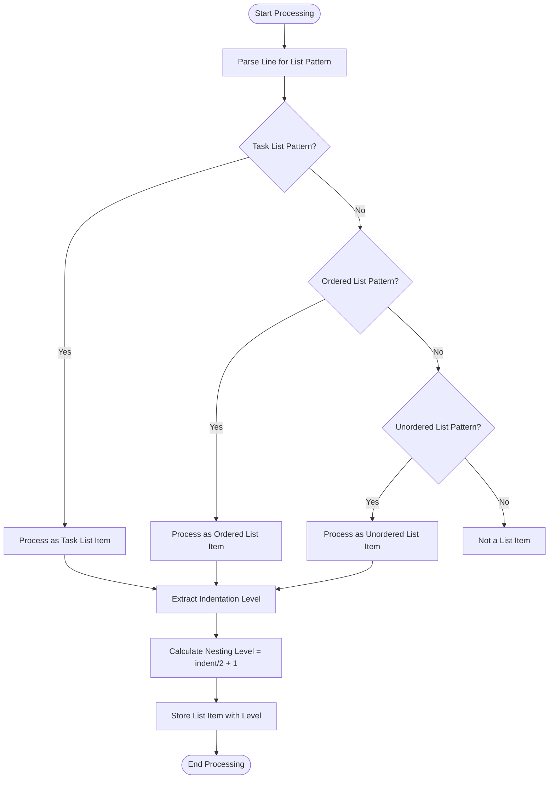
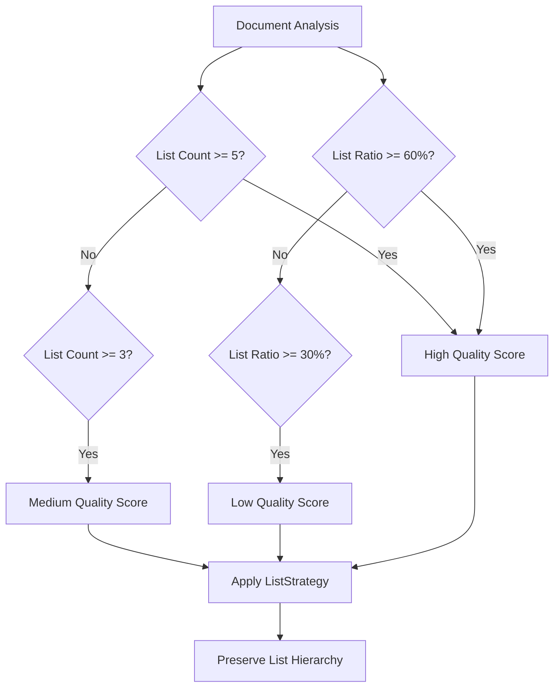
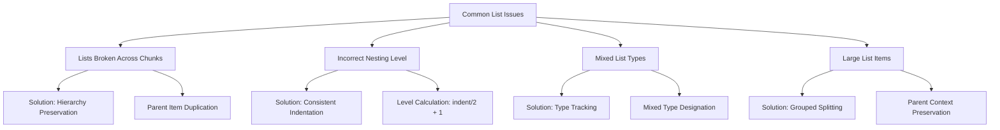
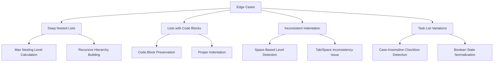
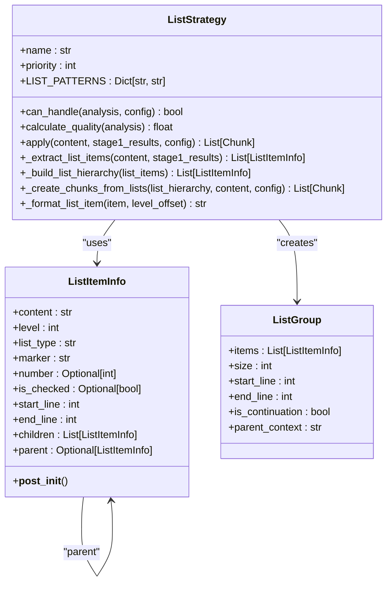
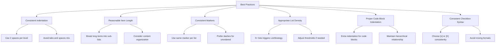

# List Issues

<cite>
**Referenced Files in This Document**   
- [list_strategy.py](file://markdown_chunker/chunker/strategies/list_strategy.py)
- [test_list_strategy.py](file://tests/chunker/test_strategies/test_list_strategy.py)
- [test_list_strategy_properties.py](file://tests/chunker/test_list_strategy_properties.py)
- [config.py](file://markdown_chunker/parser/config.py)
- [types.py](file://markdown_chunker/parser/types.py)
- [mixed_list_types.md](file://tests/parser/fixtures/edge_cases/mixed_list_types.md)
- [deep_nested_list.md](file://tests/parser/fixtures/edge_cases/deep_nested_list.md)
- [task_list.md](file://tests/parser/fixtures/edge_cases/task_list.md)
- [list_heavy.md](file://tests/fixtures/list_heavy.md)
- [list_in_list.md](file://tests/parser/fixtures/nested/list_in_list.md)
- [code_in_list.md](file://tests/parser/fixtures/nested/code_in_list.md)
- [tabs_vs_spaces.md](file://tests/parser/fixtures/edge_cases/tabs_vs_spaces.md)
</cite>

## Table of Contents
1. [Introduction](#introduction)
2. [List Parsing and Identification](#list-parsing-and-identification)
3. [List Strategy Selection](#list-strategy-selection)
4. [Common List Chunking Issues](#common-list-chunking-issues)
5. [Edge Cases in List Processing](#edge-cases-in-list-processing)
6. [List Structure Preservation](#list-structure-preservation)
7. [Recommendations for List Integrity](#recommendations-for-list-integrity)
8. [Conclusion](#conclusion)

## Introduction

The markdown chunker processes list structures with specialized handling to maintain hierarchy, nesting, and content integrity during the chunking process. This document details how the parser identifies and preserves various list types, including ordered, unordered, and task lists, while addressing common issues that arise during chunking. The system uses a dedicated ListStrategy for documents with significant list content, ensuring that parent-child relationships remain intact and that list items are not improperly split across chunks.

The chunking process analyzes list count and ratio to determine the appropriate strategy, with specific thresholds for when the ListStrategy should be applied. This documentation covers the complete lifecycle of list processing, from initial identification through final chunk creation, including handling of complex edge cases like deep nesting, mixed list types, and inconsistent indentation.

**Section sources**
- [list_strategy.py](file://markdown_chunker/chunker/strategies/list_strategy.py#L1-L853)
- [config.py](file://markdown_chunker/parser/config.py#L1-L379)

## List Parsing and Identification

The parser identifies list structures through pattern matching and hierarchical analysis. The ListStrategy uses regular expressions to detect three primary list types: ordered, unordered, and task lists. Each list type has a specific pattern that the parser matches against each line of the markdown content.

For unordered lists, the pattern `^(\s*)([-*+])\s+(.+)$` matches lines that begin with a dash, asterisk, or plus sign, capturing the indentation, marker, and content. Ordered lists are identified by the pattern `^(\s*)(\d+)\.\s+(.+)$`, which matches lines starting with a number followed by a period. Task lists use the pattern `^(\s*)([-*+])\s+\[([ xX])\]\s+(.+)$` to detect checkbox syntax with completed or incomplete tasks.

The parser calculates list nesting level based on indentation, assuming two spaces per nesting level. This calculation is critical for maintaining the hierarchical structure of nested lists. The level is determined by dividing the number of leading spaces by two and adding one. This approach ensures consistent nesting level assignment across the document.



**Diagram sources**
- [list_strategy.py](file://markdown_chunker/chunker/strategies/list_strategy.py#L73-L77)
- [list_strategy.py](file://markdown_chunker/chunker/strategies/list_strategy.py#L305-L306)

**Section sources**
- [list_strategy.py](file://markdown_chunker/chunker/strategies/list_strategy.py#L73-L349)
- [types.py](file://markdown_chunker/parser/types.py#L288-L309)

## List Strategy Selection

The ListStrategy is selected based on two primary metrics: list count and list ratio. A document qualifies for the ListStrategy if it contains at least 5 lists (configurable via `list_count_threshold`) or if list content comprises at least 60% of the document (configurable via `list_ratio_threshold`). These thresholds are defined in the configuration system and can be adjusted based on specific use cases.

The strategy selection process evaluates the ContentAnalysis object, which contains comprehensive metrics about the document's composition. The `can_handle` method in ListStrategy checks whether the document meets the criteria for list-heavy processing:

```python
def can_handle(self, analysis: ContentAnalysis, config: ChunkConfig) -> bool:
    return (
        analysis.list_count >= config.list_count_threshold
        or analysis.list_ratio >= config.list_ratio_threshold
    )
```

When both conditions are considered, the strategy applies if either threshold is met, providing flexibility for documents that may have many short lists or fewer but longer lists. The quality score calculation further refines this selection by giving higher scores to documents with more lists, higher list ratios, and nested list structures.

The quality score is calculated on a scale from 0.0 to 1.0, with contributions from multiple factors:
- List count: 0.8 for 10+ lists, 0.6 for 5-9 lists, 0.4 for 3-4 lists
- List ratio: 0.3 for 70%+, 0.2 for 50-69%, 0.1 for 30-49%
- Nested lists bonus: additional 0.2 if nested lists are present

This scoring system ensures that documents with complex list structures receive priority for the ListStrategy, which is specifically designed to preserve these hierarchies.



**Diagram sources**
- [list_strategy.py](file://markdown_chunker/chunker/strategies/list_strategy.py#L89-L133)
- [config.py](file://markdown_chunker/parser/config.py#L20-L21)

**Section sources**
- [list_strategy.py](file://markdown_chunker/chunker/strategies/list_strategy.py#L89-L133)
- [types.py](file://markdown_chunker/parser/types.py#L462-L469)

## Common List Chunking Issues

Several common issues can arise when chunking markdown documents with list structures. The most frequent problems include lists being broken across chunks, incorrect nesting level preservation, and mixed list types within the same document.

When lists are broken across chunks, the hierarchical relationship between parent and child items can be lost, disrupting the logical flow of information. The ListStrategy addresses this by building a complete hierarchy of list items before chunking, ensuring that parent items are duplicated when necessary to maintain context in continuation chunks.

Incorrect nesting level preservation often occurs when indentation is inconsistent or when tabs and spaces are mixed. The current implementation assumes two spaces per nesting level, which can lead to incorrect level calculations when tabs are used or when non-standard indentation is applied. This assumption works well for consistently formatted documents but can fail with irregular indentation patterns.

Mixed list types within a single document present another challenge. Documents may contain unordered lists, ordered lists, and task lists in close proximity, sometimes with nested items of different types. The ListStrategy handles this by treating each list item independently while preserving its type information in the metadata. When chunking mixed lists, the system creates a "mixed" list type designation when multiple list types are present in the same chunk.

The chunking process also faces challenges with large list items that exceed the maximum chunk size. In such cases, the system splits the list while preserving parent context through the `parent_context` field in ListGroup objects. This ensures that continuation chunks maintain the necessary context from higher-level list items.



**Diagram sources**
- [list_strategy.py](file://markdown_chunker/chunker/strategies/list_strategy.py#L518-L587)
- [list_strategy.py](file://markdown_chunker/chunker/strategies/list_strategy.py#L589-L604)

**Section sources**
- [list_strategy.py](file://markdown_chunker/chunker/strategies/list_strategy.py#L454-L587)
- [test_list_strategy.py](file://tests/chunker/test_strategies/test_list_strategy.py#L628-L663)

## Edge Cases in List Processing

The markdown chunker must handle various edge cases that test the robustness of list processing. These include deep nested lists, lists containing code blocks or tables, and lists with inconsistent indentation (tabs vs spaces).

Deep nested lists, such as those with 5 or more levels of indentation, challenge the system's ability to preserve hierarchy. The ListStrategy handles deep nesting by recursively calculating the maximum nesting level and using this information to maintain proper indentation in the output chunks. The `_calculate_max_nesting` method traverses the entire list hierarchy to determine the deepest level, ensuring that formatting remains consistent.

Lists containing code blocks present a complex scenario where block-level elements are embedded within list items. The system preserves these code blocks by treating them as content within the list item, maintaining the relationship between the list structure and the code content. When a code block appears within a list item, it is included in the item's content and properly indented to reflect its position within the list hierarchy.

Inconsistent indentation, particularly the mixing of tabs and spaces, creates challenges for level detection. The current implementation assumes two spaces per level, which can lead to incorrect nesting calculations when tabs are present. Documents with mixed indentation may have list levels interpreted incorrectly, potentially flattening nested structures or creating artificial nesting.

Task lists with varying checkbox syntax (e.g., `[x]`, `[X]`, `[ ]`) are handled consistently by normalizing the checked state to a boolean value. The parser recognizes both lowercase and uppercase 'x' as indicators of completed tasks, ensuring consistent processing regardless of the specific syntax used.



**Diagram sources**
- [deep_nested_list.md](file://tests/parser/fixtures/edge_cases/deep_nested_list.md#L1-L9)
- [code_in_list.md](file://tests/parser/fixtures/nested/code_in_list.md#L1-L13)
- [tabs_vs_spaces.md](file://tests/parser/fixtures/edge_cases/tabs_vs_spaces.md#L1-L11)
- [task_list.md](file://tests/parser/fixtures/edge_cases/task_list.md#L1-L6)

**Section sources**
- [list_strategy.py](file://markdown_chunker/chunker/strategies/list_strategy.py#L778-L794)
- [list_strategy.py](file://markdown_chunker/chunker/strategies/list_strategy.py#L301-L316)
- [list_strategy.py](file://markdown_chunker/chunker/strategies/list_strategy.py#L305-L306)

## List Structure Preservation

The ListStrategy employs several mechanisms to preserve list structure during chunking. The core approach involves building a hierarchical tree of list items before creating chunks, ensuring that parent-child relationships are maintained throughout the process.

The `_build_list_hierarchy` method constructs this tree by processing list items in document order and using a stack to track the current parent at each nesting level. When an item with a lower or equal level is encountered, parent items are popped from the stack until the appropriate parent is found. This algorithm correctly handles the hierarchical nature of nested lists, creating a tree structure that reflects the original document's organization.

For chunk creation, the strategy groups related list items together to avoid creating micro-chunks with single items. The `_create_chunks_from_lists` method implements this by grouping multiple root items together when they fit within the size constraints. This approach prevents the creation of numerous small chunks, improving the usability of the chunked output.

When a list item is too large to fit within a single chunk, the system splits it while preserving parent context. The `_group_list_items` method creates ListGroup objects that include a `parent_context` string containing the formatted parent item. This context is added to continuation chunks, ensuring that readers maintain awareness of the hierarchical position within the list structure.

Metadata preservation is another critical aspect of list structure maintenance. Each chunk includes metadata about the list type, item count, maximum nesting level, and whether nested items are present. This information allows downstream applications to understand the nature of the content without re-parsing the markdown.



**Diagram sources**
- [list_strategy.py](file://markdown_chunker/chunker/strategies/list_strategy.py#L27-L44)
- [list_strategy.py](file://markdown_chunker/chunker/strategies/list_strategy.py#L58-L788)
- [list_strategy.py](file://markdown_chunker/chunker/strategies/list_strategy.py#L538-L587)

**Section sources**
- [list_strategy.py](file://markdown_chunker/chunker/strategies/list_strategy.py#L373-L407)
- [list_strategy.py](file://markdown_chunker/chunker/strategies/list_strategy.py#L454-L587)
- [list_strategy.py](file://markdown_chunker/chunker/strategies/list_strategy.py#L730-L759)

## Recommendations for List Integrity

To maintain list integrity during the chunking process, several best practices should be followed when structuring lists in markdown documents.

First, use consistent indentation with spaces rather than tabs. The system assumes two spaces per nesting level, so using exactly two spaces for each level of indentation ensures accurate hierarchy preservation. Avoid mixing tabs and spaces, as this can lead to incorrect nesting level calculations.

Second, keep list items within reasonable length limits to avoid chunking issues. When list items contain substantial content, consider breaking them into sub-lists or separate sections. This approach not only improves chunking behavior but also enhances readability.

Third, use consistent list markers within each list. While the system can handle mixed markers, maintaining consistency (e.g., using only dashes for unordered lists) improves parsing reliability and visual clarity.

For documents with complex list structures, consider the overall list density. Documents with five or more lists or where lists comprise more than 60% of the content will trigger the ListStrategy, which is optimized for preserving list hierarchies. If your document has significant list content but falls below these thresholds, you may want to adjust the configuration settings to ensure the ListStrategy is applied.

When embedding code blocks or other block elements within list items, ensure proper indentation to maintain the hierarchical relationship. Code blocks should be indented an additional level beyond the list item content to clearly indicate their containment within the list item.

Finally, for task lists, use consistent checkbox syntax. While the parser recognizes both `[x]` and `[X]` as completed tasks, choosing one format and using it consistently improves readability and reduces potential parsing ambiguities.



**Diagram sources**
- [config.py](file://markdown_chunker/parser/config.py#L20-L21)
- [list_strategy.py](file://markdown_chunker/chunker/strategies/list_strategy.py#L305-L306)
- [list_strategy.py](file://markdown_chunker/chunker/strategies/list_strategy.py#L310-L311)

**Section sources**
- [list_strategy.py](file://markdown_chunker/chunker/strategies/list_strategy.py#L73-L77)
- [config.py](file://markdown_chunker/parser/config.py#L20-L21)
- [list_strategy.py](file://markdown_chunker/chunker/strategies/list_strategy.py#L305-L306)

## Conclusion

The markdown chunker's ListStrategy provides robust handling of list structures, preserving hierarchy, nesting, and content integrity through sophisticated parsing and chunking algorithms. By analyzing list count and ratio, the system determines when to apply specialized list processing, ensuring optimal handling of list-heavy documents.

The implementation successfully addresses common issues like lists being broken across chunks and incorrect nesting level preservation through hierarchical tree building and context preservation in continuation chunks. It handles various edge cases, including deep nesting, mixed list types, and embedded code blocks, though challenges remain with inconsistent indentation patterns that mix tabs and spaces.

For optimal results, authors should structure their lists with consistent indentation using spaces, maintain reasonable item lengths, and use consistent markers within each list. These practices ensure that the chunking process preserves the intended structure and meaning of list content.

The comprehensive test suite, including property-based testing, validates that list structure is preserved across various scenarios, providing confidence in the reliability of the chunking process for list-containing documents.

**Section sources**
- [list_strategy.py](file://markdown_chunker/chunker/strategies/list_strategy.py#L1-L853)
- [test_list_strategy_properties.py](file://tests/chunker/test_list_strategy_properties.py#L1-L386)
- [test_list_strategy.py](file://tests/chunker/test_strategies/test_list_strategy.py#L1-L802)