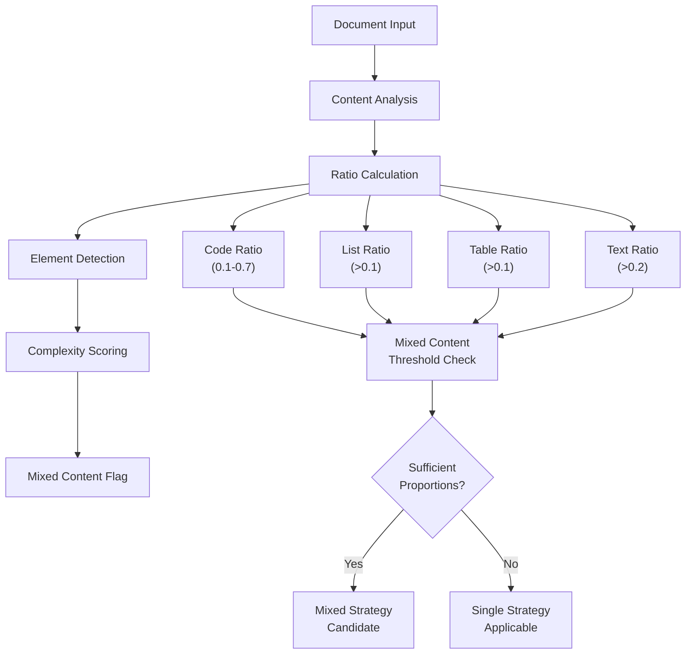
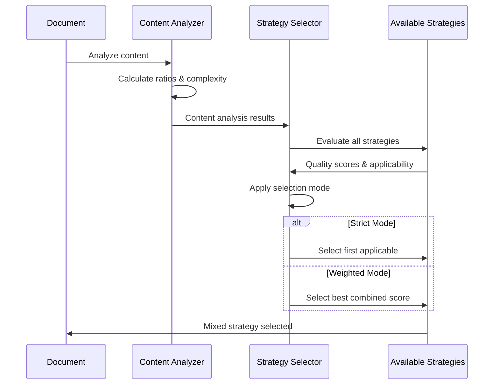
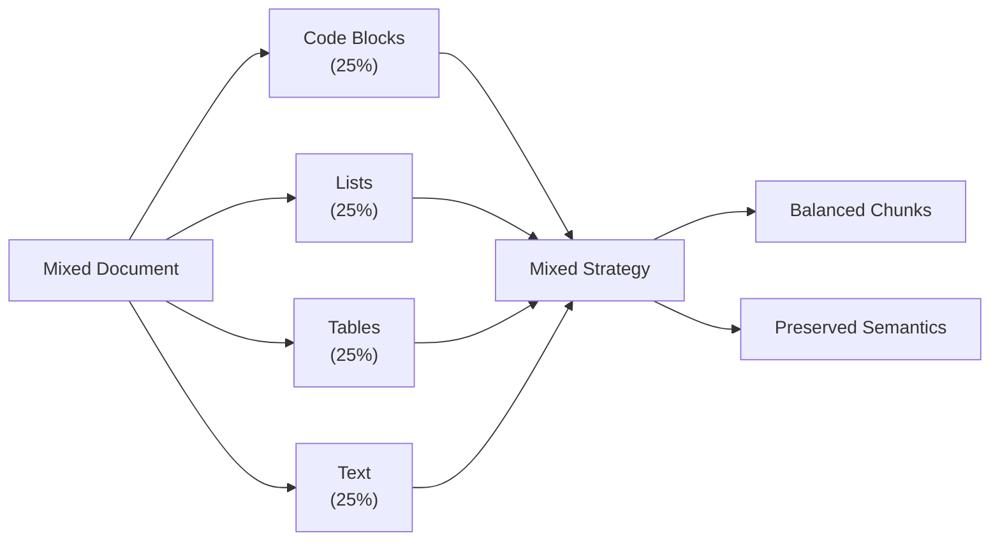

# Mixed Content Issues

<cite>
**Referenced Files in This Document**
- [mixed_strategy.py](file://markdown_chunker/chunker/strategies/mixed_strategy.py)
- [selector.py](file://markdown_chunker/chunker/selector.py)
- [analyzer.py](file://markdown_chunker/parser/analyzer.py)
- [test_mixed_strategy_properties.py](file://tests/chunker/test_mixed_strategy_properties.py)
- [test_mixed_strategy_stage1_integration.py](file://tests/chunker/test_mixed_strategy_stage1_integration.py)
- [mixed.md](file://tests/fixtures/mixed.md)
- [list_heavy.md](file://tests/fixtures/list_heavy.md)
- [code_heavy.md](file://tests/fixtures/code_heavy.md)
- [table_heavy.md](file://tests/fixtures/table_heavy.md)
- [config.py](file://markdown_chunker/parser/config.py)
</cite>

## Table of Contents
1. [Introduction](#introduction)
2. [Understanding Mixed Content Detection](#understanding-mixed-content-detection)
3. [Strategy Selection Process](#strategy-selection-process)
4. [Common Mixed Content Issues](#common-mixed-content-issues)
5. [Edge Cases and Complex Scenarios](#edge-cases-and-complex-scenarios)
6. [Using explain_selection for Debugging](#using-explain_selection-for-debugging)
7. [Configuration and Threshold Tuning](#configuration-and-threshold-tuning)
8. [Best Practices and Solutions](#best-practices-and-solutions)
9. [Troubleshooting Guide](#troubleshooting-guide)
10. [Conclusion](#conclusion)

## Introduction

Mixed content documents present unique challenges in markdown chunking because they contain multiple content types (code blocks, lists, tables, text) that require different handling strategies. The markdown chunker employs sophisticated algorithms to detect mixed content, evaluate strategy suitability, and apply appropriate chunking approaches while preserving semantic relationships between different content elements.

This document explores the complexities of mixed content detection, strategy selection mechanisms, common issues that arise, and provides practical solutions for optimizing chunking performance with mixed content documents.

## Understanding Mixed Content Detection

### Content Analysis Framework

The system uses a comprehensive content analysis framework to detect mixed content characteristics:



**Diagram sources**
- [analyzer.py](file://markdown_chunker/parser/analyzer.py#L223-L244)
- [mixed_strategy.py](file://markdown_chunker/chunker/strategies/mixed_strategy.py#L99-L118)

### Detection Algorithm

The mixed content detection algorithm evaluates multiple factors:

1. **Content Type Ratios**: Each content type (code, lists, tables, text) must meet specific proportion thresholds
2. **Element Diversity**: Presence of multiple distinct content types
3. **Complexity Score**: Overall document complexity based on structural elements
4. **Dominance Checks**: Prevention of inappropriate strategy selection when one content type dominates

**Section sources**
- [analyzer.py](file://markdown_chunker/parser/analyzer.py#L223-L244)
- [mixed_strategy.py](file://markdown_chunker/chunker/strategies/mixed_strategy.py#L99-L118)

## Strategy Selection Process

### Priority-Based Selection

The strategy selection follows a priority-based system with quality scoring:



**Diagram sources**
- [selector.py](file://markdown_chunker/chunker/selector.py#L58-L78)
- [mixed_strategy.py](file://markdown_chunker/chunker/strategies/mixed_strategy.py#L120-L171)

### Strategy Evaluation Criteria

Each strategy undergoes evaluation based on:

1. **Can Handle**: Whether the strategy can process the detected content types
2. **Quality Score**: Based on content balance, diversity, and appropriateness
3. **Final Score**: Combined priority and quality for weighted selection

**Section sources**
- [selector.py](file://markdown_chunker/chunker/selector.py#L100-L120)
- [mixed_strategy.py](file://markdown_chunker/chunker/strategies/mixed_strategy.py#L120-L171)

## Common Mixed Content Issues

### Issue 1: Inappropriate Strategy Selection

**Problem**: The system selects a single-content-type strategy (like code or list strategy) for documents containing multiple content types.

**Symptoms**:
- Content type misclassification
- Loss of semantic relationships
- Poor chunk quality
- Missing content elements

**Root Cause**: Insufficient mixed content detection thresholds or incorrect ratio calculations.

**Solution**: Adjust detection thresholds and improve content analysis accuracy.

### Issue 2: Content Type Misclassification

**Problem**: Different content types are incorrectly identified or grouped.

**Symptoms**:
- Code blocks treated as text
- Lists improperly parsed
- Tables with incorrect structure
- Headers misclassified

**Root Cause**: Stage 1 parsing failures or regex fallback limitations.

**Solution**: Implement robust fallback mechanisms and enhance parsing accuracy.

### Issue 3: Imbalanced Content Distribution

**Problem**: Uneven distribution of content types leads to suboptimal chunking.

**Symptoms**:
- Overly large chunks containing multiple content types
- Small chunks with incomplete content
- Poor semantic coherence

**Root Cause**: Inadequate balancing algorithms or incorrect size calculations.

**Solution**: Optimize chunk sizing algorithms and improve content grouping logic.

**Section sources**
- [test_mixed_strategy_properties.py](file://tests/chunker/test_mixed_strategy_properties.py#L200-L335)

## Edge Cases and Complex Scenarios

### Evenly Distributed Content Types

Documents with roughly equal proportions of different content types present unique challenges:



**Diagram sources**
- [mixed_strategy.py](file://markdown_chunker/chunker/strategies/mixed_strategy.py#L140-L170)

### Conflicting Content Signals

Documents where content types have conflicting characteristics:

**Example**: Code blocks interspersed with extensive text, requiring careful semantic preservation.

**Handling Approach**:
- Preserve code block integrity
- Maintain text readability
- Ensure logical section boundaries

### Documents Without Clear Strategy Profiles

**Challenge**: Documents that don't fit neatly into any single strategy category.

**Solution**: Enhanced detection algorithms and flexible fallback mechanisms.

**Section sources**
- [test_mixed_strategy_stage1_integration.py](file://tests/chunker/test_mixed_strategy_stage1_integration.py#L169-L268)

## Using explain_selection for Debugging

### Understanding Strategy Selection Decisions

The `explain_selection` method provides detailed insights into strategy selection decisions:

```python
# Example usage
from markdown_chunker.chunker import MarkdownChunker
from markdown_chunker.chunker.types import ChunkConfig

chunker = MarkdownChunker()
analysis = chunker.analyze_content(document)
explanation = chunker.explain_selection(analysis)

print(f"Selected strategy: {explanation['selected_strategy']}")
print(f"Selection mode: {explanation['selection_mode']}")

# Examine content analysis
content_analysis = explanation['content_analysis']
print(f"Code ratio: {content_analysis['code_ratio']:.2%}")
print(f"List count: {content_analysis['list_count']}")
print(f"Table count: {content_analysis['table_count']}")
print(f"Complexity score: {content_analysis['complexity_score']:.2}")

# Review strategy evaluations
for strategy_info in explanation['strategy_evaluation']:
    print(f"Strategy: {strategy_info['name']}")
    print(f"Priority: {strategy_info['priority']}")
    print(f"Quality score: {strategy_info['quality_score']:.2}")
    print(f"Final score: {strategy_info['final_score']:.2}")
    print(f"Reason: {strategy_info['reason']}")
```

### Interpreting Selection Results

**Key Metrics to Analyze**:
- **Content Type Ratios**: Understand how content is distributed
- **Complexity Score**: Assess overall document complexity
- **Strategy Scores**: Compare different strategy options
- **Selection Reason**: Identify why a particular strategy was chosen

**Section sources**
- [selector.py](file://markdown_chunker/chunker/selector.py#L181-L223)

## Configuration and Threshold Tuning

### Key Configuration Parameters

Several parameters influence mixed content detection and strategy selection:

| Parameter | Default | Purpose | Tuning Guidance |
|-----------|---------|---------|-----------------|
| `code_ratio_threshold` | 0.7 | Maximum code dominance | Lower for mixed content |
| `list_ratio_threshold` | 0.6 | Maximum list dominance | Adjust based on content type |
| `mixed_content_threshold` | 0.3 | Minimum mixed content | Increase for complex documents |
| `min_complexity` | 0.3 | Minimum complexity score | Higher for detailed documents |

### Threshold Adjustment Strategies

**For Code-Dominant Mixed Content**:
```python
config = ChunkConfig(
    max_chunk_size=2000,
    code_ratio_threshold=0.5,  # Allow more mixed content
    min_complexity=0.4,        # Enable more complex documents
)
```

**For List-Dominant Mixed Content**:
```python
config = ChunkConfig(
    max_chunk_size=1500,
    list_ratio_threshold=0.5,  # Reduce list dominance threshold
    min_complexity=0.5,        # Require higher complexity
)
```

**Section sources**
- [config.py](file://markdown_chunker/parser/config.py#L280-L320)

## Best Practices and Solutions

### Document Preparation Guidelines

1. **Clear Section Boundaries**: Use headers to separate different content types
2. **Consistent Formatting**: Maintain consistent indentation and spacing
3. **Logical Organization**: Arrange content in meaningful sequences

### Implementation Best Practices

1. **Robust Error Handling**: Implement comprehensive fallback mechanisms
2. **Content Validation**: Verify content integrity before processing
3. **Performance Monitoring**: Track chunking performance metrics

### Testing and Validation

**Property-Based Testing**:
```python
@given(document=mixed_document(min_sections=3, max_sections=5))
def test_mixed_content_detection(document):
    config = ChunkConfig(max_chunk_size=2000)
    chunker = MarkdownChunker(config)
    
    result = chunker.chunk(document, include_analysis=True)
    
    # Verify content preservation
    assert len(result.chunks) > 0
    assert all(chunk.content.strip() for chunk in result.chunks)
```

**Section sources**
- [test_mixed_strategy_properties.py](file://tests/chunker/test_mixed_strategy_properties.py#L196-L235)

## Troubleshooting Guide

### Problem: Mixed Strategy Not Selected

**Symptoms**: Single-content-type strategy used for mixed document

**Diagnosis Steps**:
1. Check content analysis ratios
2. Verify complexity score
3. Review strategy applicability

**Solutions**:
```python
# Enable debug logging
import logging
logging.getLogger('markdown_chunker').setLevel(logging.DEBUG)

# Adjust thresholds
config = ChunkConfig(
    code_ratio_threshold=0.6,  # Reduce code dominance threshold
    min_complexity=0.2,        # Lower complexity requirement
)

# Use explain_selection
explanation = chunker.explain_selection(analysis)
print(explanation)
```

### Problem: Poor Chunk Quality

**Symptoms**: Irregular chunk sizes, missing content, poor semantics

**Diagnosis**:
1. Analyze chunk distribution
2. Check content preservation
3. Review strategy selection

**Solutions**:
```python
# Adjust chunking parameters
config = ChunkConfig(
    max_chunk_size=1500,       # Reduce chunk size
    target_chunk_size=1000,    # Target smaller chunks
    overlap_size=100,          # Add overlap for context
)

# Enable detailed logging
chunker = MarkdownChunker(config)
result = chunker.chunk(document, include_analysis=True)

# Analyze results
for i, chunk in enumerate(result.chunks):
    print(f"Chunk {i}: {len(chunk.content)} chars")
    print(f"Metadata: {chunk.metadata}")
```

### Problem: Performance Issues

**Symptoms**: Slow processing, memory usage, timeout errors

**Optimization Strategies**:
1. **Reduce Document Size**: Split large documents
2. **Adjust Thresholds**: Lower complexity requirements
3. **Enable Caching**: Cache analysis results
4. **Parallel Processing**: Use concurrent processing where possible

**Section sources**
- [test_mixed_strategy_stage1_integration.py](file://tests/chunker/test_mixed_strategy_stage1_integration.py#L312-L399)

## Conclusion

Mixed content issues in markdown chunking require sophisticated detection and strategy selection mechanisms. The system's approach combines content analysis, quality scoring, and flexible fallback mechanisms to handle complex documents effectively.

Key takeaways for successful mixed content handling:

1. **Comprehensive Analysis**: Use multiple detection criteria for accurate content identification
2. **Flexible Selection**: Implement both strict and weighted strategy selection modes
3. **Robust Fallbacks**: Ensure reliable processing even with parsing failures
4. **Performance Optimization**: Balance quality with processing speed
5. **Debugging Tools**: Utilize explain_selection for troubleshooting

By understanding these mechanisms and following the recommended practices, developers can effectively handle mixed content documents and achieve optimal chunking results for diverse markdown content types.