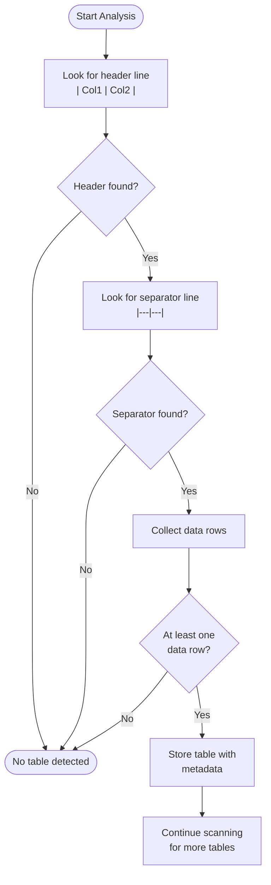
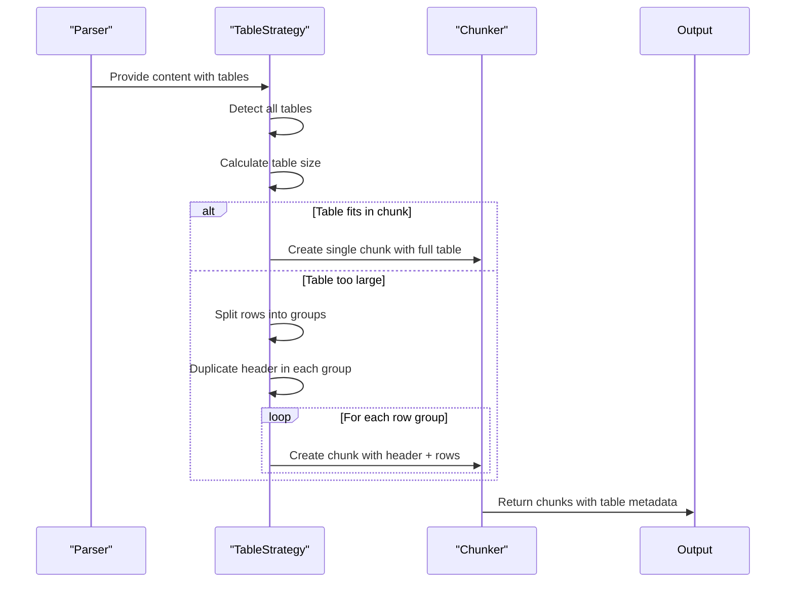
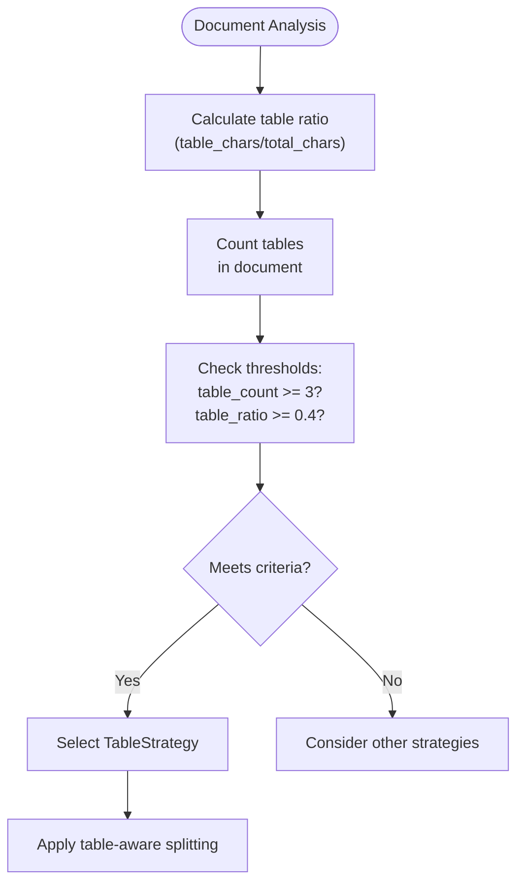

# Table Issues

<cite>
**Referenced Files in This Document**   
- [table_strategy.py](file://markdown_chunker/chunker/strategies/table_strategy.py)
- [test_table_strategy.py](file://tests/chunker/test_strategies/test_table_strategy.py)
- [test_table_strategy_properties.py](file://tests/chunker/test_table_strategy_properties.py)
- [analyzer.py](file://markdown_chunker/parser/analyzer.py)
- [elements.py](file://markdown_chunker/parser/elements.py)
- [types.py](file://markdown_chunker/chunker/types.py)
- [table_heavy.md](file://tests/fixtures/table_heavy.md)
- [complex_table.md](file://tests/parser/fixtures/edge_cases/complex_table.md)
- [table_alignments.md](file://tests/parser/fixtures/edge_cases/table_alignments.md)
- [table_without_headers.md](file://tests/parser/fixtures/edge_cases/table_without_headers.md)
- [table_in_list.md](file://tests/parser/fixtures/nested/table_in_list.md)
</cite>

## Table of Contents
1. [Introduction](#introduction)
2. [Table Detection and Analysis](#table-detection-and-analysis)
3. [Table Strategy Implementation](#table-strategy-implementation)
4. [Common Table Chunking Issues](#common-table-chunking-issues)
5. [Edge Cases and Complex Tables](#edge-cases-and-complex-tables)
6. [Table Ratio and Strategy Selection](#table-ratio-and-strategy-selection)
7. [Best Practices for Table Formatting](#best-practices-for-table-formatting)
8. [Troubleshooting Guide](#troubleshooting-guide)

## Introduction

The markdown chunker handles table-related content through a specialized TableStrategy that preserves table structure while managing chunk size constraints. This document explains how tables are detected, analyzed, and chunked, focusing on the challenges of maintaining data integrity across chunks. The system uses content analysis to determine table ratio and count, which influences strategy selection for optimal table handling. Various test fixtures demonstrate challenging table structures and their expected behavior during chunking.

## Table Detection and Analysis

The parser detects tables through pattern matching on markdown content. A valid table requires a header line followed by a separator line with alignment indicators (dashes and pipes), then one or more data rows. The detection process identifies tables by looking for the pattern of header, separator, and row lines, ensuring at least one data row exists. Tables without data rows are ignored during processing.



**Diagram sources**
- [table_strategy.py](file://markdown_chunker/chunker/strategies/table_strategy.py#L156-L210)
- [elements.py](file://markdown_chunker/parser/elements.py#L188-L254)

**Section sources**
- [table_strategy.py](file://markdown_chunker/chunker/strategies/table_strategy.py#L70-L210)
- [elements.py](file://markdown_chunker/parser/elements.py#L188-L254)

## Table Strategy Implementation

The TableStrategy processes tables by either preserving them intact or splitting them by rows when they exceed size constraints. When a table is split, the header and separator are duplicated in each chunk to maintain readability and context. The strategy calculates the optimal number of rows per chunk based on the average row size and available space after accounting for header overhead.



**Diagram sources**
- [table_strategy.py](file://markdown_chunker/chunker/strategies/table_strategy.py#L227-L344)
- [test_table_strategy.py](file://tests/chunker/test_strategies/test_table_strategy.py#L248-L275)

**Section sources**
- [table_strategy.py](file://markdown_chunker/chunker/strategies/table_strategy.py#L227-L412)

## Common Table Chunking Issues

Several common issues can occur when chunking tables in markdown documents. The most frequent problem is tables being split across chunks without proper header preservation, which can make the data difficult to interpret. Another issue is incorrect header preservation, where the header row is missing or incomplete in split chunks. Alignment issues can also occur when column alignment specifications are not properly maintained during chunking.

Large tables may be split mid-row rather than between rows, breaking the table structure. This is prevented by the TableStrategy, which only splits tables between complete rows. Wide tables with many columns may exceed chunk size limits, requiring special handling through oversize allowance. The system addresses this by marking wide tables as oversize when they cannot be split without compromising data integrity.

**Section sources**
- [test_table_strategy_properties.py](file://tests/chunker/test_table_strategy_properties.py#L123-L346)
- [test_table_strategy.py](file://tests/chunker/test_strategies/test_table_strategy.py#L493-L527)

## Edge Cases and Complex Tables

The system handles various edge cases and complex table structures. Tables without headers are processed by treating the first data row as a header for consistency. Deeply nested tables, such as tables within list items, are preserved as complete units. Tables within lists maintain their indentation and structural relationship to the parent list.

Complex tables with alignment specifications (left, center, right) are preserved with their formatting intact. The parser correctly interprets alignment markers in the separator row and maintains them in the output chunks. Merged cells are not explicitly supported in standard markdown tables, so the system treats each cell as independent.

```mermaid
erDiagram
TABLE ||--o{ ROW : contains
ROW ||--o{ CELL : contains
TABLE ||--o{ HEADER : has
HEADER ||--o{ CELL : contains
TABLE ||--o{ SEPARATOR : has
SEPARATOR ||--o{ ALIGNMENT : specifies
class TABLE {
+start_line
+end_line
+column_count
+header
+separator
}
class ROW {
+content
+line_number
}
class CELL {
+content
+alignment
}
class HEADER {
+content
}
class SEPARATOR {
+content
}
class ALIGNMENT {
+left
+center
+right
}
```

**Diagram sources**
- [table_alignments.md](file://tests/parser/fixtures/edge_cases/table_alignments.md)
- [table_without_headers.md](file://tests/parser/fixtures/edge_cases/table_without_headers.md)
- [table_in_list.md](file://tests/parser/fixtures/nested/table_in_list.md)

**Section sources**
- [elements.py](file://markdown_chunker/parser/elements.py#L255-L278)
- [test_table_strategy.py](file://tests/chunker/test_strategies/test_table_strategy.py#L596-L620)

## Table Ratio and Strategy Selection

The content analysis determines table ratio and count to influence strategy selection. The TableStrategy is selected when a document contains at least three tables or when tables comprise at least 40% of the content by default. These thresholds are configurable through the ChunkConfig parameters `table_count_threshold` and `table_ratio_threshold`.

The quality score for the TableStrategy increases with higher table count and ratio. Documents with five or more tables receive the highest quality score (0.8), while those with two tables receive a moderate score (0.4). Similarly, documents with 50% or more table content receive an additional 0.3 to their quality score. This scoring system ensures that table-heavy documents are processed with the most appropriate strategy.



**Diagram sources**
- [analyzer.py](file://markdown_chunker/parser/analyzer.py#L50-L60)
- [table_strategy.py](file://markdown_chunker/chunker/strategies/table_strategy.py#L85-L96)

**Section sources**
- [analyzer.py](file://markdown_chunker/parser/analyzer.py#L50-L60)
- [table_strategy.py](file://markdown_chunker/chunker/strategies/table_strategy.py#L85-L125)

## Best Practices for Table Formatting

To avoid chunking issues and ensure data integrity, follow these best practices for table formatting. Use consistent indentation and spacing in tables to prevent parsing errors. Ensure each table has a proper separator line with alignment indicators. Include at least one data row in each table, as tables without data rows are ignored by the parser.

For large tables, consider the chunk size constraints when designing the table structure. Very wide tables with many columns may exceed chunk size limits, so consider splitting such tables into multiple narrower tables when possible. Maintain consistent column counts across all rows in a table to prevent structural issues during chunking.

When embedding tables within lists, ensure proper indentation (two spaces per nesting level) to maintain the hierarchical relationship. Avoid placing complex content like code blocks within table cells, as this can complicate parsing and chunking. Use simple, clear headers that accurately describe the column content.

**Section sources**
- [table_heavy.md](file://tests/fixtures/table_heavy.md)
- [test_table_strategy.py](file://tests/chunker/test_strategies/test_table_strategy.py#L449-L474)

## Troubleshooting Guide

When encountering table chunking issues, first verify that the table follows standard markdown syntax with proper header, separator, and row lines. Check that the table has at least one data row, as tables without data rows are not processed. If tables are being split unexpectedly, review the chunk size configuration and consider adjusting the `max_chunk_size` parameter.

For tables that should be processed by the TableStrategy but aren't, verify that the document meets the threshold requirements of at least three tables or 40% table content by default. Check the content analysis output to confirm the table count and ratio calculations. If tables appear to be split mid-row, this indicates a processing error, as the TableStrategy should only split between complete rows.

When tables lose their formatting during chunking, ensure that alignment indicators in the separator row are preserved. The system should maintain left (`:---`), center (`:---:`), and right (`---:`) alignment specifications in all chunks. If header duplication is not occurring in split tables, verify that the `is_split` metadata is correctly set and that the header reconstruction logic is functioning properly.

**Section sources**
- [test_table_strategy_properties.py](file://tests/chunker/test_table_strategy_properties.py#L123-L385)
- [test_table_strategy.py](file://tests/chunker/test_strategies/test_table_strategy.py#L248-L275)
- [table_strategy.py](file://markdown_chunker/chunker/strategies/table_strategy.py#L379-L411)