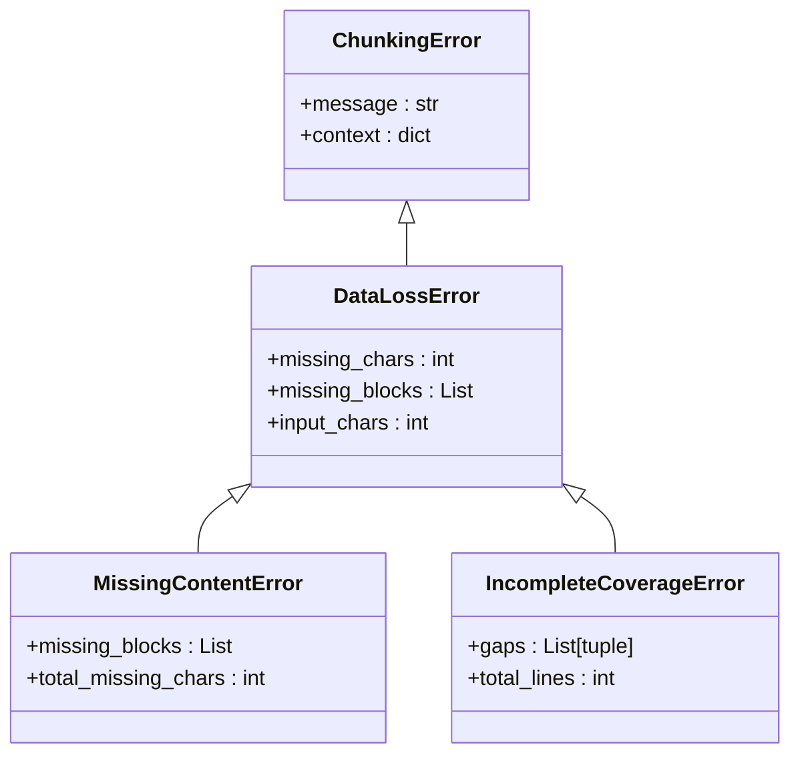
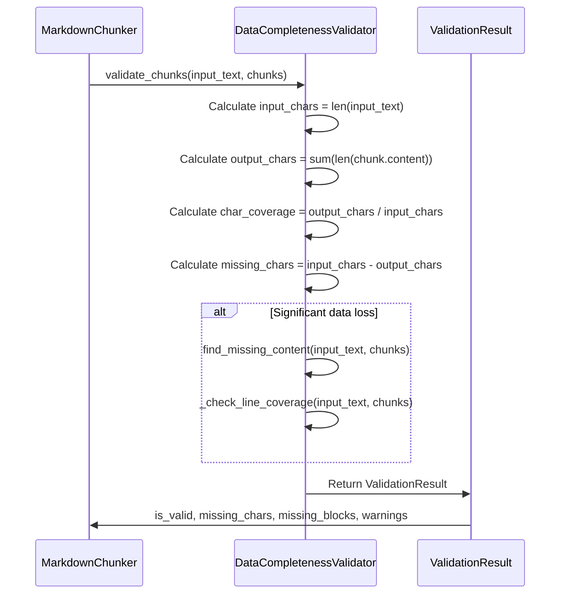
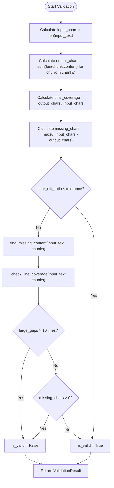
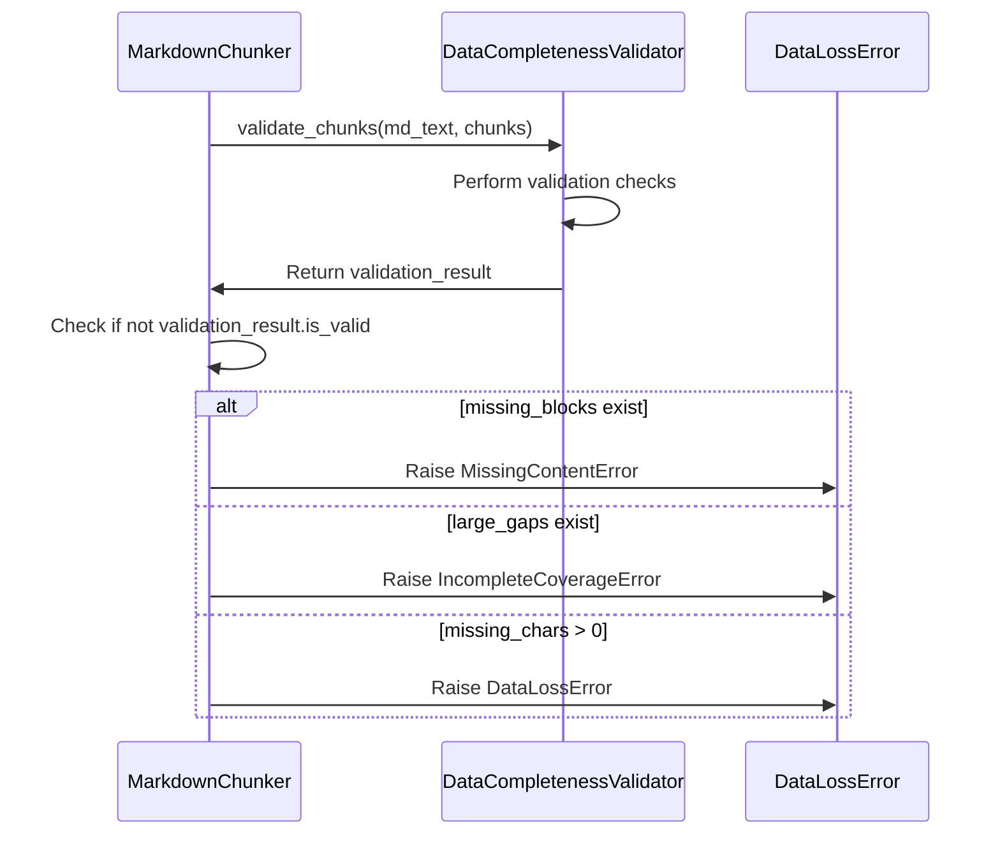
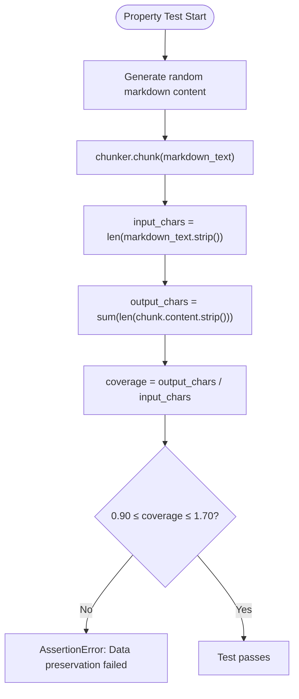

# Data Loss and Integrity Errors

<cite>
**Referenced Files in This Document**   
- [errors.py](file://markdown_chunker/chunker/errors.py)
- [validator.py](file://markdown_chunker/chunker/validator.py)
- [core.py](file://markdown_chunker/chunker/core.py)
- [test_error_types.py](file://tests/chunker/test_error_types.py)
- [test_data_completeness_validator.py](file://tests/chunker/test_data_completeness_validator.py)
- [test_data_preservation_properties.py](file://tests/chunker/test_data_preservation_properties.py)
</cite>

## Table of Contents
1. [Introduction](#introduction)
2. [DataLossError and Error Hierarchy](#datalosseror-and-error-hierarchy)
3. [Integrity Validation Mechanism](#integrity-validation-mechanism)
4. [Error Detection and Calculation](#error-detection-and-calculation)
5. [Validation Phase and Error Raising](#validation-phase-and-error-raising)
6. [Property-Based Testing](#property-based-testing)
7. [Troubleshooting Data Loss Errors](#troubleshooting-data-loss-errors)
8. [Conclusion](#conclusion)

## Introduction
The markdown chunker implements robust data integrity checking mechanisms to ensure that no content is lost during the chunking process. This document details the DataLossError exception and related validation components that detect and report discrepancies between input content and generated chunks. The system provides comprehensive error reporting with forensic details to help developers identify and resolve content omission issues.

## DataLossError and Error Hierarchy

The DataLossError exception is part of a comprehensive error hierarchy designed to provide specific and actionable feedback when data integrity issues occur during chunking operations. This error is raised when the system detects discrepancies between the original input content and the generated chunks, such as missing characters or blocks.

The error hierarchy is structured to provide increasingly specific information about data loss scenarios:

**Diagram sources**
- [errors.py](file://markdown_chunker/chunker/errors.py#L111-L185)

**Section sources**
- [errors.py](file://markdown_chunker/chunker/errors.py#L111-L185)
- [test_error_types.py](file://tests/chunker/test_error_types.py#L135-L186)

## Integrity Validation Mechanism

The integrity checking system is centered around the DataCompletenessValidator class, which performs comprehensive validation to ensure that all input content is preserved in the output chunks. The validator operates as a critical component in the chunking pipeline, checking for data loss after chunk generation.

The validation process occurs in multiple stages, comparing character counts, identifying missing content blocks, and checking line coverage gaps. The validator is designed to be tolerant of minor whitespace normalization differences while detecting significant data loss.

**Diagram sources**
- [validator.py](file://markdown_chunker/chunker/validator.py#L53-L353)
- [core.py](file://markdown_chunker/chunker/core.py#L302-L326)

**Section sources**
- [validator.py](file://markdown_chunker/chunker/validator.py#L53-L353)

## Error Detection and Calculation

The system detects data loss by comparing the total number of characters in the input text with the sum of characters in all generated chunks. When discrepancies are found, the validator calculates the loss percentage and identifies specific missing content blocks for forensic analysis.

The loss percentage is calculated using the formula: `(missing_chars / input_chars) * 100`. This percentage provides a clear indication of the severity of data loss relative to the original input size.

**Diagram sources**
- [validator.py](file://markdown_chunker/chunker/validator.py#L105-L116)
- [errors.py](file://markdown_chunker/chunker/errors.py#L128-L135)

**Section sources**
- [validator.py](file://markdown_chunker/chunker/validator.py#L90-L151)
- [errors.py](file://markdown_chunker/chunker/errors.py#L114-L140)

## Validation Phase and Error Raising

The validation phase is integrated into the chunking pipeline as a critical quality check. After chunks are generated by the selected strategy, the DataCompletenessValidator performs its analysis and can raise appropriate errors based on the findings.

The validation occurs in the core chunking process, specifically during what is labeled as "Stage 4.5" in the code. If validation fails, specific error types are raised based on the nature of the data loss detected:

**Diagram sources**
- [core.py](file://markdown_chunker/chunker/core.py#L302-L326)
- [validator.py](file://markdown_chunker/chunker/validator.py#L330-L353)

**Section sources**
- [core.py](file://markdown_chunker/chunker/core.py#L302-L326)
- [validator.py](file://markdown_chunker/chunker/validator.py#L330-L353)

## Property-Based Testing

The system includes comprehensive property-based tests that intentionally trigger data loss conditions to verify the integrity checking mechanisms. These tests use the Hypothesis library to generate random markdown content and validate that the chunking process preserves data within acceptable tolerance levels.

The tests verify multiple aspects of data preservation:
- Character count preservation across various content types
- Complete preservation of plain text content
- Preservation of list items and code block content
- Handling of edge cases like whitespace-only input

**Diagram sources**
- [test_data_preservation_properties.py](file://tests/chunker/test_data_preservation_properties.py#L74-L116)
- [test_data_completeness_validator.py](file://tests/chunker/test_data_completeness_validator.py#L114-L132)

**Section sources**
- [test_data_preservation_properties.py](file://tests/chunker/test_data_preservation_properties.py#L1-L373)
- [test_data_completeness_validator.py](file://tests/chunker/test_data_completeness_validator.py#L97-L132)

## Troubleshooting Data Loss Errors

When developers encounter DataLossError or related exceptions, several troubleshooting steps can help identify and resolve the underlying issues:

### Common Causes and Solutions
1. **Parser Bugs**: Issues in the markdown parser may cause content to be omitted during AST construction.
   - Check the parser's handling of edge cases like nested fences or complex table structures.
   - Verify that all content types (code blocks, lists, tables) are properly extracted.

2. **Strategy Edge Cases**: Specific chunking strategies may have edge cases that lead to content omission.
   - Review the strategy implementation for boundary condition handling.
   - Test with various content types to identify strategy-specific issues.

3. **Configuration Issues**: Incorrect configuration parameters may lead to content being filtered out.
   - Verify chunk size settings are appropriate for the content.
   - Check overlap settings and their impact on content preservation.

### Using Error Context for Root Cause Analysis
The DataLossError and its subclasses provide rich context for debugging:

- **missing_chars**: Indicates the total number of characters lost, helping assess the severity.
- **missing_blocks**: Provides forensic details about lost content, including line numbers and content previews.
- **input_chars**: Allows calculation of loss percentage for impact assessment.

Developers should examine the missing_blocks information to identify patterns in the lost content, which can point to specific parser or strategy issues. The line coverage gaps can reveal systematic issues in how content is being processed.

**Section sources**
- [errors.py](file://markdown_chunker/chunker/errors.py#L111-L185)
- [validator.py](file://markdown_chunker/chunker/validator.py#L153-L225)
- [test_error_types.py](file://tests/chunker/test_error_types.py#L138-L163)

## Conclusion
The markdown chunker's data integrity system provides robust protection against content loss during the chunking process. The DataLossError exception and related validation mechanisms work together to detect discrepancies between input content and generated chunks, providing detailed forensic information for troubleshooting. By calculating loss percentages and identifying specific missing content blocks, the system enables developers to quickly diagnose and resolve issues that could compromise data preservation guarantees. The integration of property-based testing further ensures that the integrity checking mechanisms are thoroughly validated across a wide range of scenarios.