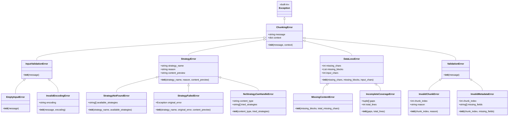

# Error Types and Handling

<cite>
**Referenced Files in This Document**
- [errors.py](file://markdown_chunker/chunker/errors.py)
- [test_error_types.py](file://tests/chunker/test_error_types.py)
- [error_handler.py](file://markdown_chunker/api/error_handler.py)
- [test_error_handler.py](file://tests/api/test_error_handler.py)
- [test_strategy_error_handling.py](file://tests/chunker/test_strategy_error_handling.py)
- [core.py](file://markdown_chunker/chunker/core.py)
- [base.py](file://markdown_chunker/chunker/strategies/base.py)
- [test_error_handling.py](file://tests/test_error_handling.py)
</cite>

## Table of Contents
1. [Introduction](#introduction)
2. [Error Hierarchy Overview](#error-hierarchy-overview)
3. [Base Error Class](#base-error-class)
4. [Input Validation Errors](#input-validation-errors)
5. [Strategy Errors](#strategy-errors)
6. [Data Loss Errors](#data-loss-errors)
7. [Validation Errors](#validation-errors)
8. [Error Handling in Practice](#error-handling-in-practice)
9. [API Error Handler](#api-error-handler)
10. [Error Context Collection](#error-context-collection)
11. [Best Practices for Error Handling](#best-practices-for-error-handling)
12. [Debugging and Troubleshooting](#debugging-and-troubleshooting)

## Introduction

The Dify Markdown Chunker implements a comprehensive error handling system built around a hierarchical error structure. This system provides targeted error types that offer specific context about failures in the chunking pipeline, enabling developers to write robust applications that can gracefully handle various failure scenarios.

The error system is designed with several key principles:
- **Specificity**: Each error type provides detailed context about the failure
- **Hierarchical Organization**: Related errors share common base classes
- **Context Preservation**: Errors carry additional metadata for debugging
- **API Consistency**: Standardized error responses for external consumption

## Error Hierarchy Overview

The error system follows a clear inheritance hierarchy that organizes errors by domain and severity:



**Diagram sources**
- [errors.py](file://markdown_chunker/chunker/errors.py#L11-L210)

**Section sources**
- [errors.py](file://markdown_chunker/chunker/errors.py#L11-L210)
- [test_error_types.py](file://tests/chunker/test_error_types.py#L227-L272)

## Base Error Class

### ChunkingError

The `ChunkingError` class serves as the foundation for all chunking-related exceptions. It provides a standardized structure for error messages and context preservation.

**Key Features:**
- **Message Storage**: Stores the primary error message
- **Context Dictionary**: Provides additional metadata for debugging
- **Inheritance Support**: Serves as the base for all specialized error types

**Constructor Parameters:**
- `message` (str): Human-readable error description
- `context` (Optional[dict]): Additional context information

**Usage Example:**
```python
# Basic error creation
error = ChunkingError("Chunking failed")

# Error with context
context = {"file": "document.md", "line": 42}
error = ChunkingError("Processing failed", context=context)
```

**Section sources**
- [errors.py](file://markdown_chunker/chunker/errors.py#L11-L25)

## Input Validation Errors

### InputValidationError

Base class for all input validation failures. This category encompasses errors related to the quality and format of input data.

### EmptyInputError

Raised when the input content is empty or contains only whitespace.

**Characteristics:**
- **Default Message**: "Input is empty or whitespace-only"
- **Use Case**: Early validation before processing begins
- **Prevention**: Validate input length and content before chunking

**Example Scenarios:**
- Empty string passed to chunker
- String containing only spaces, tabs, or newlines
- Null or None input values

### InvalidEncodingError

Raised when the input has invalid or unsupported encoding.

**Characteristics:**
- **Additional Attribute**: `encoding` (str) - The problematic encoding
- **Use Case**: Encoding detection and validation failures
- **Resolution**: Convert to UTF-8 or handle encoding issues

**Example Scenarios:**
- Binary data interpreted as text
- Malformed UTF-8 sequences
- Unsupported character encodings

**Section sources**
- [errors.py](file://markdown_chunker/chunker/errors.py#L27-L46)
- [test_error_types.py](file://tests/chunker/test_error_types.py#L51-L77)

## Strategy Errors

### StrategyError

Base class for all strategy-related failures. Strategies are the core algorithms that determine how content is split into chunks.

**Key Attributes:**
- `strategy_name` (str): Name of the strategy that failed
- `reason` (str): Explanation of the failure
- `content_preview` (Optional[str]): First 100 characters of content for debugging

### StrategyNotFoundError

Raised when a requested strategy doesn't exist in the available strategy registry.

**Characteristics:**
- **Additional Attribute**: `available_strategies` (List[str]) - List of valid strategies
- **Use Case**: Strategy selection validation
- **Resolution**: Use one of the available strategies or implement a custom strategy

**Available Strategies:**
- `"code"` - Code-heavy documents
- `"mixed"` - Mixed content with diverse elements  
- `"list"` - List-heavy documents
- `"table"` - Table-heavy documents
- `"structural"` - Well-structured documents with headers
- `"sentences"` - Simple text documents

### StrategyFailedError

Raised when a strategy executes but encounters an unexpected error during processing.

**Characteristics:**
- **Additional Attribute**: `original_error` (Exception) - The underlying exception
- **Use Case**: Strategy implementation bugs or runtime failures
- **Resolution**: Debug the strategy implementation or use fallback strategies

**Example Scenario:**
```python
# Original error is wrapped with strategy context
original_error = ValueError("Invalid content format")
strategy_error = StrategyFailedError("code", original_error)
# Error message: "Strategy 'code' failed: ValueError: Invalid content format"
```

### NoStrategyCanHandleError

Raised when no available strategy can process the given content type.

**Characteristics:**
- **Additional Attributes**: 
  - `content_type` (str): Detected content type
  - `tried_strategies` (List[str]): Strategies attempted
- **Use Case**: Content analysis failures
- **Resolution**: Implement custom strategy or adjust content preprocessing

**Section sources**
- [errors.py](file://markdown_chunker/chunker/errors.py#L48-L109)
- [test_error_types.py](file://tests/chunker/test_error_types.py#L79-L134)

## Data Loss Errors

### DataLossError

Base class for all data integrity violations during chunking. These errors indicate that the chunking process has resulted in missing or incomplete content.

**Key Features:**
- **Percentage Calculation**: Automatically calculates loss percentage when input size is known
- **Block Tracking**: Can track specific missing content blocks
- **Context Information**: Provides insights into what was lost

### MissingContentError

Specialized error for missing specific content blocks.

**Characteristics:**
- **Additional Attribute**: `missing_blocks` (List) - List of missing content blocks
- **Use Case**: Content extraction failures
- **Resolution**: Investigate content extraction logic or strategy selection

### IncompleteCoverageError

Raised when line coverage is incomplete with significant gaps.

**Characteristics:**
- **Additional Attributes**:
  - `gaps` (List[tuple]): List of (start_line, end_line) tuples
  - `total_lines` (int): Total number of lines in input
- **Use Case**: Line-based content analysis failures
- **Resolution**: Review content boundaries and chunking logic

**Section sources**
- [errors.py](file://markdown_chunker/chunker/errors.py#L111-L176)
- [test_error_types.py](file://tests/chunker/test_error_types.py#L135-L186)

## Validation Errors

### ValidationError

Base class for all validation failures in chunk structure and metadata.

### InvalidChunkError

Raised when individual chunks fail validation criteria.

**Characteristics:**
- **Additional Attribute**: `chunk_index` (int) - Index of the invalid chunk
- **Additional Attribute**: `reason` (str) - Specific validation failure reason
- **Use Case**: Chunk post-processing validation
- **Resolution**: Fix chunk generation logic or validation criteria

### InvalidMetadataError

Raised when chunk metadata is incomplete or invalid.

**Characteristics:**
- **Additional Attribute**: `chunk_index` (int) - Index of chunk with invalid metadata
- **Additional Attribute**: `missing_fields` (Optional[List[str]]) - List of missing required fields
- **Use Case**: Metadata generation and validation failures
- **Resolution**: Ensure all required metadata fields are populated

**Section sources**
- [errors.py](file://markdown_chunker/chunker/errors.py#L178-L210)
- [test_error_types.py](file://tests/chunker/test_error_types.py#L188-L226)

## Error Handling in Practice

### Strategy Selection Error Handling

The system distinguishes between validation errors (like invalid strategy names) and processing errors (like strategy failures):

```python
# Strategy selection validation (raises StrategySelectionError)
try:
    chunker.chunk("# Test", strategy="invalid_name")
except StrategySelectionError as e:
    # Handle invalid strategy name
    available = e.available_strategies
    # Use fallback strategy or inform user

# Strategy processing error (uses fallback mechanisms)
try:
    chunker.chunk(broken_content, strategy="code")
except StrategyFailedError as e:
    # Strategy failed, fallback to other strategies
    original_error = e.original_error
    strategy_name = e.strategy_name
```

### Error Propagation Patterns

The chunker implements sophisticated error propagation:

1. **Early Validation**: Strategy names are validated before processing
2. **Graceful Degradation**: Failed strategies trigger fallback mechanisms
3. **Context Preservation**: Error context is maintained throughout the stack

**Section sources**
- [test_strategy_error_handling.py](file://tests/chunker/test_strategy_error_handling.py#L19-L175)
- [core.py](file://markdown_chunker/chunker/core.py#L156-L200)

## API Error Handler

### APIErrorHandler

The `APIErrorHandler` provides standardized error responses for web APIs, converting internal exceptions into consistent JSON responses.

**Key Features:**
- **Error Classification**: Categorizes different exception types
- **Standardized Responses**: Produces consistent error structures
- **Context Preservation**: Maintains error context in responses
- **Traceback Control**: Optional stack trace inclusion

### Error Response Structure

Each error response follows a consistent structure:

```json
{
  "success": false,
  "errors": ["Error description"],
  "metadata": {
    "error_type": "ErrorClassName",
    "error_code": "ERROR_CODE",
    "details": {
      "exception_type": "ExceptionName",
      "exception_message": "Original error message",
      "context": {...},
      "traceback": "...stack trace..."
    }
  }
}
```

### Error Type Mapping

The handler maps specific exception types to standardized error codes:

| Exception Type | Error Code | Description |
|---------------|------------|-------------|
| `StrategySelectionError` | `INVALID_STRATEGY` | Invalid strategy name |
| `ConfigurationError` | `INVALID_CONFIGURATION` | Bad configuration |
| `ChunkingError` | `CHUNKING_FAILED` | General chunking failure |
| `ValueError` | `INVALID_VALUE` | Invalid parameter values |
| `TypeError` | `INVALID_TYPE` | Type mismatch errors |
| Other Exceptions | `INTERNAL_ERROR` | Unexpected failures |

**Section sources**
- [error_handler.py](file://markdown_chunker/api/error_handler.py#L18-L235)
- [test_error_handler.py](file://tests/api/test_error_handler.py#L13-L262)

## Error Context Collection

### Context Preservation Mechanism

The error system maintains rich context information to aid debugging:

**Context Fields:**
- **File Information**: Source file and line numbers
- **Operation Details**: Current operation being performed
- **Parameter Values**: Input parameters and their values
- **System State**: Internal state at time of error

**Example Usage:**
```python
# Creating error with context
context = {
    "file": "document.md",
    "line": 42,
    "operation": "chunking",
    "strategy": "code",
    "chunk_size": 4096
}

error = ChunkingError("Processing failed", context=context)

# Later, when handling the error
try:
    # Some chunking operation
    pass
except ChunkingError as e:
    # Access preserved context
    file_name = e.context.get("file")
    operation = e.context.get("operation")
    # Use context for logging or error reporting
```

### Content Preview Feature

Many strategy errors include content previews to help identify problematic content:

```python
# Strategy error with content preview
error = StrategyFailedError(
    "code", 
    ValueError("Syntax error"), 
    content_preview="def function(param1, param2):"
)
# Error message includes: "Strategy 'code' failed: ValueError: Syntax error<br/>Content preview: def function(param1, param2):"
```

**Section sources**
- [errors.py](file://markdown_chunker/chunker/errors.py#L14-L25)
- [error_handler.py](file://markdown_chunker/api/error_handler.py#L161-L176)

## Best Practices for Error Handling

### Catching Specific Errors

Always catch the most specific error type possible:

```python
# Good: Catch specific error types
try:
    result = chunker.chunk(input_text, strategy="code")
except StrategyNotFoundError as e:
    # Handle invalid strategy
    available = e.available_strategies
    result = chunker.chunk(input_text, strategy="structural")
except StrategyFailedError as e:
    # Handle strategy execution failure
    logger.error(f"Strategy {e.strategy_name} failed: {e.reason}")
    result = chunker.chunk(input_text, strategy="sentences")
except ChunkingError as e:
    # Handle general chunking failures
    logger.error(f"Chunking failed: {e.message}")
    # Implement fallback logic
```

### Graceful Degradation

Implement fallback strategies when primary strategies fail:

```python
def safe_chunk_with_fallback(text, preferred_strategy):
    strategies = [preferred_strategy, "structural", "sentences"]
    
    for strategy in strategies:
        try:
            return chunker.chunk(text, strategy=strategy)
        except StrategyFailedError:
            continue
    
    # All strategies failed, use emergency fallback
    return chunker.chunk(text, strategy="sentences")
```

### Error Logging and Monitoring

Implement comprehensive error logging:

```python
import logging

logger = logging.getLogger(__name__)

try:
    chunks = chunker.chunk(document, strategy="code")
except ChunkingError as e:
    logger.error(f"Chunking failed: {e.message}", extra=e.context)
    # Send to monitoring system
    # Notify administrators
    # Return graceful error response
```

### Client-Side Error Handling

Provide clear error messages to clients:

```python
def chunk_document_safe(text, strategy=None):
    try:
        result = chunker.chunk_with_analysis(text, strategy=strategy)
        return {
            "success": True,
            "chunks": result.chunks,
            "analysis": result.analysis
        }
    except StrategyNotFoundError as e:
        return {
            "success": False,
            "error": f"Invalid strategy '{e.strategy_name}'. Available: {', '.join(e.available_strategies)}"
        }
    except StrategyFailedError as e:
        return {
            "success": False,
            "error": f"Strategy '{e.strategy_name}' failed: {e.reason}"
        }
    except ChunkingError as e:
        return {
            "success": False,
            "error": f"Chunking failed: {e.message}"
        }
```

## Debugging and Troubleshooting

### Interpreting Error Messages

Understanding error message structure helps quick diagnosis:

**Basic Pattern**: `"[Error Type]: [Description]"`
- **EmptyInputError**: "Input is empty or whitespace-only"
- **StrategyNotFoundError**: "Strategy 'invalid' not found. Available strategies: code, mixed, list, table, structural, sentences"
- **StrategyFailedError**: "Strategy 'code' failed: ValueError: Invalid syntax"
- **DataLossError**: "Data loss detected: 150 chars missing (5.0% of input)"

### Stack Trace Analysis

Enable detailed error reporting for debugging:

```python
# Enable traceback in development
handler = APIErrorHandler(include_traceback=True)

# Production should disable tracebacks
handler = APIErrorHandler(include_traceback=False)
```

### Common Error Scenarios

**Input Validation Issues:**
- Empty documents: Use `EmptyInputError`
- Encoding problems: Check `InvalidEncodingError.encoding`
- Malformed content: Review content preprocessing

**Strategy Selection Issues:**
- Invalid strategy names: Check available strategies
- Strategy failures: Review strategy implementation
- No strategy can handle content: Consider custom strategies

**Data Integrity Issues:**
- Missing content: Investigate extraction logic
- Incomplete coverage: Review chunk boundaries
- Validation failures: Check chunk generation

### Diagnostic Tools

Use the error context for diagnostics:

```python
# Extract diagnostic information
def diagnose_error(error):
    print(f"Error Type: {type(error).__name__}")
    print(f"Message: {error.message}")
    
    if hasattr(error, 'context') and error.context:
        print("Context:")
        for key, value in error.context.items():
            print(f"  {key}: {value}")
    
    if hasattr(error, 'strategy_name'):
        print(f"Strategy: {error.strategy_name}")
    
    if hasattr(error, 'original_error'):
        print(f"Original Error: {type(error.original_error).__name__}: {error.original_error}")
```

### Performance Impact Considerations

Error handling should minimize performance impact:

- **Early Validation**: Catch input errors before expensive processing
- **Selective Logging**: Use appropriate log levels
- **Context Limitation**: Avoid storing large objects in error context
- **Fallback Efficiency**: Choose efficient fallback strategies

**Section sources**
- [test_error_handling.py](file://tests/test_error_handling.py#L1-L111)
- [test_error_types.py](file://tests/chunker/test_error_types.py#L274-L312)