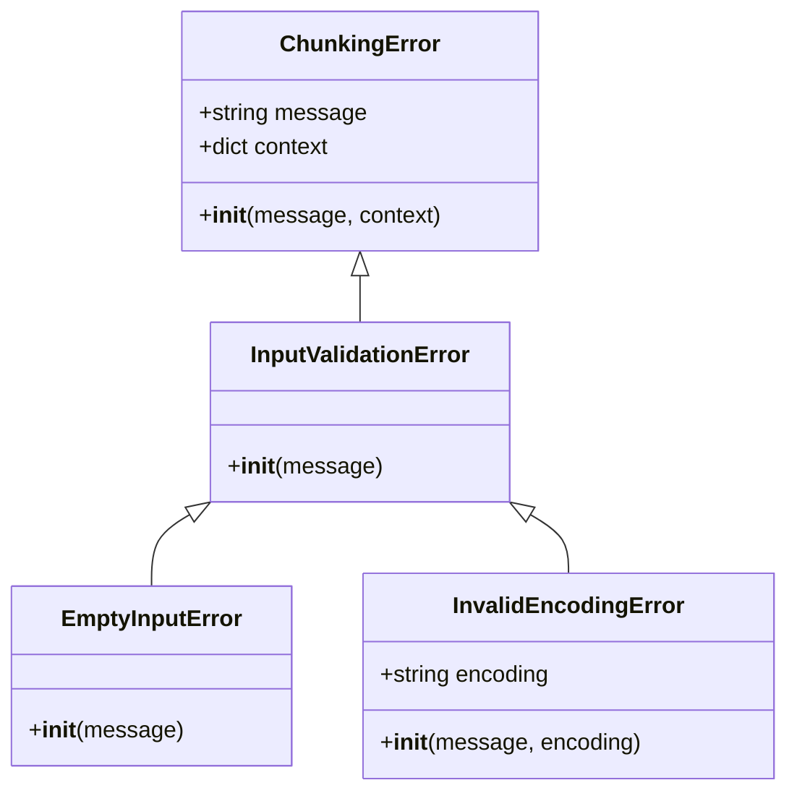
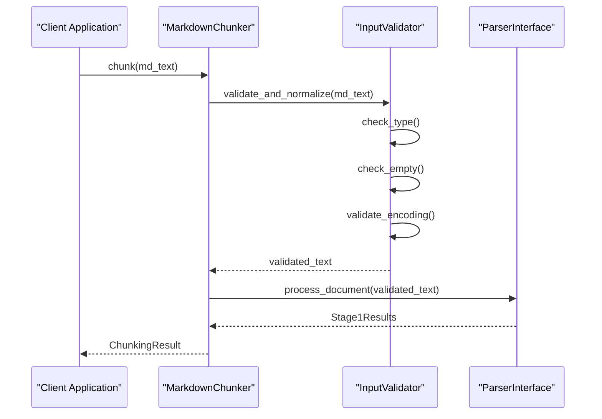
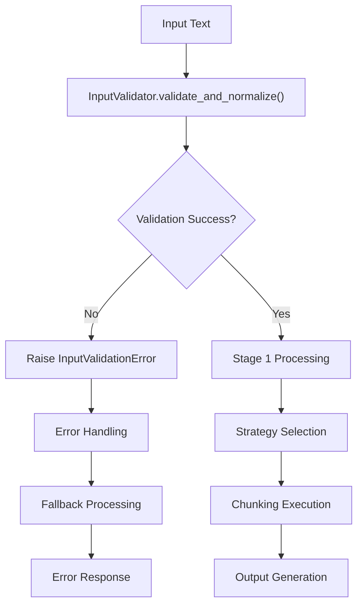

# Input Validation Errors

<cite>
**Referenced Files in This Document**
- [markdown_chunker/chunker/errors.py](file://markdown_chunker/chunker/errors.py)
- [markdown_chunker/parser/validation.py](file://markdown_chunker/parser/validation.py)
- [markdown_chunker/chunker/validator.py](file://markdown_chunker/chunker/validator.py)
- [markdown_chunker/chunker/core.py](file://markdown_chunker/chunker/core.py)
- [markdown_chunker/chunker/orchestrator.py](file://markdown_chunker/chunker/orchestrator.py)
- [tests/chunker/test_error_types.py](file://tests/chunker/test_error_types.py)
- [tests/parser/test_validation_new.py](file://tests/parser/test_validation_new.py)
- [tests/integration/test_dify_plugin_integration.py](file://tests/integration/test_dify_plugin_integration.py)
</cite>

## Table of Contents
1. [Introduction](#introduction)
2. [Error Hierarchy Overview](#error-hierarchy-overview)
3. [InputValidationError Base Class](#inputvalidationerror-base-class)
4. [Specific Input Validation Errors](#specific-input-validation-errors)
5. [Error Conditions and Triggers](#error-conditions-and-triggers)
6. [Context Data and Debugging](#context-data-and-debugging)
7. [Test Suite Examples](#test-suite-examples)
8. [Best Practices for Defensive Programming](#best-practices-for-defensive-programming)
9. [Integration with Chunking Pipeline](#integration-with-chunking-pipeline)
10. [Troubleshooting Guide](#troubleshooting-guide)

## Introduction

The markdown chunker's error handling system employs a sophisticated hierarchy of specialized exceptions designed to provide precise error identification and comprehensive debugging information during the initial parsing and validation phase. The InputValidationError hierarchy serves as the foundation for handling input-related exceptions, offering granular error classification and contextual debugging capabilities.

This system replaces generic exception handling with specific, actionable error types that enable developers to implement targeted error recovery strategies and provide meaningful feedback to users. The hierarchy includes InputValidationError as the base class, with EmptyInputError and InvalidEncodingError as its primary subclasses, each addressing distinct validation failure scenarios.

## Error Hierarchy Overview

The InputValidationError hierarchy follows a structured inheritance pattern that enables both broad and specific error handling approaches:



**Diagram sources**
- [markdown_chunker/chunker/errors.py](file://markdown_chunker/chunker/errors.py#L11-L46)

**Section sources**
- [markdown_chunker/chunker/errors.py](file://markdown_chunker/chunker/errors.py#L11-L46)

## InputValidationError Base Class

InputValidationError serves as the foundational exception class for all input validation failures within the markdown chunking pipeline. This base class inherits from ChunkingError and provides the essential framework for capturing validation-related errors while maintaining consistency with the broader error handling architecture.

### Key Characteristics

The InputValidationError class maintains several important design principles:

- **Inheritance Hierarchy**: As a subclass of ChunkingError, it participates in the unified error handling system used throughout the chunking pipeline
- **Minimal Implementation**: The class intentionally leaves implementation details to its subclasses, focusing on establishing the validation error category
- **Context Preservation**: Inherits the context dictionary capability from ChunkingError for debugging and diagnostic purposes
- **Extensibility**: Provides a clean extension point for future input validation error types

### Usage Pattern

InputValidationError acts as a marker interface that allows catch-all handlers to identify validation-related failures without requiring specific subclass knowledge:

```python
# Example usage pattern for InputValidationError
try:
    # Input validation operation
    validate_input(input_text)
except InputValidationError as e:
    # Handle all input validation errors generically
    logger.warning(f"Input validation failed: {e.message}")
    # Implement fallback or recovery logic
```

**Section sources**
- [markdown_chunker/chunker/errors.py](file://markdown_chunker/chunker/errors.py#L27-L30)

## Specific Input Validation Errors

### EmptyInputError

EmptyInputError represents the scenario where input validation detects empty or whitespace-only content that cannot be processed meaningfully by the chunking system. This error type addresses the fundamental requirement that valid input must contain substantial content beyond mere whitespace or empty strings.

#### Trigger Conditions

EmptyInputError is raised under the following conditions:

- **Null Input**: When the input parameter is explicitly None
- **Empty String**: When the input string contains only whitespace characters
- **Whitespace-Only Content**: When the input consists solely of spaces, tabs, or newline characters
- **Trimmed Empty Content**: When whitespace-only content becomes empty after trimming

#### Implementation Details

The EmptyInputError constructor accepts an optional custom message parameter, defaulting to "Input is empty or whitespace-only" to provide clear, user-friendly error communication.

#### Recovery Strategies

Applications encountering EmptyInputError should consider the following recovery approaches:

- **User Feedback**: Inform users that input must contain meaningful content
- **Default Content**: Provide default documentation or template content
- **Input Validation**: Implement pre-processing validation to catch empty inputs early
- **Graceful Degradation**: Return empty results or placeholder content when appropriate

**Section sources**
- [markdown_chunker/chunker/errors.py](file://markdown_chunker/chunker/errors.py#L33-L38)

### InvalidEncodingError

InvalidEncodingError handles encoding-related validation failures, specifically addressing situations where input text cannot be properly interpreted as UTF-8 encoded content. This error type is crucial for ensuring data integrity and preventing processing errors caused by malformed character encoding.

#### Trigger Conditions

InvalidEncodingError is raised when:

- **UTF-8 Validation Failure**: The input text contains invalid UTF-8 byte sequences
- **Character Encoding Issues**: The text includes characters that cannot be represented in UTF-8
- **Binary Data Interference**: Non-textual binary data is mistakenly treated as text
- **Mixed Encoding Scenarios**: Partially corrupted or inconsistently encoded content

#### Encoding Information Capture

The error captures the specific encoding type that caused the validation failure, enabling targeted debugging and resolution:

```python
# Example of InvalidEncodingError with encoding information
error = InvalidEncodingError("Invalid UTF-8 sequence", encoding="utf-16")
# error.encoding would be "utf-16"
```

#### Resolution Approaches

Applications should implement encoding-aware validation and conversion strategies:

- **Encoding Detection**: Use libraries like `chardet` or `charset-normalizer` for automatic encoding detection
- **Fallback Processing**: Attempt processing with alternative encodings when UTF-8 fails
- **Data Sanitization**: Clean or repair corrupted encoding before processing
- **User Communication**: Inform users about encoding requirements and limitations

**Section sources**
- [markdown_chunker/chunker/errors.py](file://markdown_chunker/chunker/errors.py#L40-L46)

## Error Conditions and Triggers

### Initial Parsing Phase

The markdown chunker's input validation occurs during the initial parsing phase, immediately after receiving input but before any chunking strategies are applied. This early validation prevents unnecessary processing of invalid inputs and provides immediate feedback to clients.

#### Validation Pipeline

The input validation follows a structured pipeline:

1. **Type Validation**: Ensures input is either string or None
2. **Empty Content Check**: Identifies and rejects empty or whitespace-only content
3. **Encoding Verification**: Validates UTF-8 compatibility
4. **Size Constraints**: Checks against maximum input size limits
5. **Content Sanitization**: Normalizes line endings and removes invalid characters

#### Integration with Parser Interface

The validation system integrates seamlessly with the ParserInterface, which serves as the primary entry point for markdown processing:



**Diagram sources**
- [markdown_chunker/chunker/core.py](file://markdown_chunker/chunker/core.py#L156-L264)
- [markdown_chunker/parser/validation.py](file://markdown_chunker/parser/validation.py#L36-L58)

**Section sources**
- [markdown_chunker/parser/validation.py](file://markdown_chunker/parser/validation.py#L36-L124)

## Context Data and Debugging

### Error Context Capture

Both EmptyInputError and InvalidEncodingError inherit the context dictionary capability from ChunkingError, enabling comprehensive debugging information capture. This context data proves invaluable for diagnosing validation failures and implementing effective error recovery strategies.

#### Context Information Types

Common context information captured includes:

- **File Information**: Source file name or identifier
- **Line Numbers**: Specific line numbers where validation failed
- **Content Preview**: Sample of problematic content
- **Processing Stage**: Stage of processing where error occurred
- **System Environment**: Relevant system or configuration details

#### Debugging Examples

The context system enables sophisticated debugging scenarios:

```python
# Example context data for EmptyInputError
context = {
    "file": "documentation.md",
    "line": 42,
    "column": 15,
    "content_preview": "...",
    "processing_stage": "initial_validation"
}

error = EmptyInputError("Input is empty or whitespace-only", context=context)
```

#### Logging Integration

The context data integrates seamlessly with logging systems, providing structured error reporting:

```python
# Example logging integration
logger.error(f"Validation failed: {error.message}", extra=error.context)
```

**Section sources**
- [markdown_chunker/chunker/errors.py](file://markdown_chunker/chunker/errors.py#L14-L25)

## Test Suite Examples

### Unit Test Patterns

The test suite demonstrates comprehensive coverage of InputValidationError scenarios, providing practical examples of error triggering and handling:

#### EmptyInputError Tests

The test suite validates EmptyInputError behavior across various scenarios:

```python
# Test empty input detection
def test_empty_input_error():
    error = EmptyInputError()
    assert isinstance(error, InputValidationError)
    assert "empty" in str(error).lower()

# Test custom message handling
def test_empty_input_error_custom_message():
    error = EmptyInputError("Custom empty message")
    assert "Custom empty message" in str(error)
```

#### InvalidEncodingError Tests

InvalidEncodingError testing covers encoding validation scenarios:

```python
# Test encoding error with specific encoding
def test_invalid_encoding_error():
    error = InvalidEncodingError("Bad encoding", encoding="utf-16")
    assert isinstance(error, InputValidationError)
    assert error.encoding == "utf-16"
    assert "Bad encoding" in str(error)
```

#### Integration Test Examples

The test suite includes integration tests that demonstrate error handling in realistic scenarios:

```python
# Test empty input error in plugin integration
def test_empty_input_error(self, tool_instance):
    tool_parameters = {
        "input_text": "",
        "max_chunk_size": 1000,
    }
    
    messages = list(tool_instance._invoke(tool_parameters))
    assert len(messages) == 1
    message = messages[0]
    assert "Error" in message.message.text
    assert "empty" in message.message.text.lower()
```

**Section sources**
- [tests/chunker/test_error_types.py](file://tests/chunker/test_error_types.py#L54-L77)
- [tests/integration/test_dify_plugin_integration.py](file://tests/integration/test_dify_plugin_integration.py#L131-L147)

## Best Practices for Defensive Programming

### Input Validation Strategies

Implementing robust input validation requires a multi-layered approach that combines early detection with graceful error handling:

#### Pre-Processing Validation

```python
# Example defensive programming pattern
def validate_input_safely(input_text: str) -> str:
    """Validate input comprehensively before processing."""
    
    # Type checking
    if not isinstance(input_text, str):
        raise TypeError(f"Expected string, got {type(input_text)}")
    
    # Null handling
    if input_text is None:
        return ""  # Convert None to empty string
    
    # Whitespace validation
    if not input_text.strip():
        raise EmptyInputError("Input contains only whitespace")
    
    # Encoding validation
    try:
        input_text.encode("utf-8")
    except UnicodeEncodeError:
        raise InvalidEncodingError("Input contains invalid UTF-8 characters")
    
    return input_text
```

#### Error Handling Patterns

Implement comprehensive error handling that provides meaningful feedback:

```python
# Example error handling pattern
def safe_chunk_processing(input_text: str, chunker: MarkdownChunker):
    """Process input with comprehensive error handling."""
    
    try:
        # Validate input
        validated_text = validate_input_safely(input_text)
        
        # Process with chunker
        result = chunker.chunk(validated_text)
        return result
        
    except EmptyInputError as e:
        logger.warning(f"Empty input detected: {e.message}")
        return {"status": "empty", "chunks": []}
        
    except InvalidEncodingError as e:
        logger.error(f"Encoding error: {e.message}, encoding: {e.encoding}")
        return {"status": "encoding_error", "error": str(e)}
        
    except InputValidationError as e:
        logger.error(f"Input validation failed: {e.message}")
        return {"status": "validation_error", "error": str(e)}
        
    except Exception as e:
        logger.exception(f"Unexpected error during chunking: {e}")
        return {"status": "error", "error": str(e)}
```

#### Client Application Patterns

Client applications should implement layered validation:

1. **UI-Level Validation**: Prevent empty inputs at the user interface level
2. **API-Level Validation**: Validate inputs before reaching the chunking service
3. **Service-Level Validation**: Implement comprehensive validation within the service
4. **Fallback Mechanisms**: Provide graceful degradation for validation failures

### Performance Considerations

Input validation should balance thoroughness with performance:

- **Early Termination**: Stop validation as soon as a failure is detected
- **Caching**: Cache validation results for repeated inputs
- **Streaming Validation**: Validate inputs incrementally for large documents
- **Resource Limits**: Implement timeouts and memory limits for validation operations

## Integration with Chunking Pipeline

### Pipeline Integration Points

The InputValidationError hierarchy integrates at multiple points within the chunking pipeline, ensuring comprehensive error coverage:

#### Stage 1 Processing

Stage 1 processing serves as the primary integration point for input validation:



**Diagram sources**
- [markdown_chunker/chunker/orchestrator.py](file://markdown_chunker/chunker/orchestrator.py#L56-L118)

#### Error Propagation

Errors propagate through the pipeline according to established patterns:

1. **Local Handling**: Errors are caught and handled at the validation boundary
2. **Pipeline Termination**: Validation failures terminate the pipeline early
3. **Fallback Activation**: Some validation failures trigger fallback mechanisms
4. **Error Reporting**: Comprehensive error information is captured and reported

#### Component Interaction

Different components interact with input validation in specific ways:

- **ParserInterface**: Calls InputValidator.validate_and_normalize() before processing
- **ChunkingOrchestrator**: Receives validated input and proceeds with strategy selection
- **StrategySelector**: Operates on validated content with confidence in input quality
- **FallbackManager**: Activated when validation or processing failures occur

**Section sources**
- [markdown_chunker/chunker/orchestrator.py](file://markdown_chunker/chunker/orchestrator.py#L120-L168)

## Troubleshooting Guide

### Common Error Scenarios

#### Empty Input Detection

**Symptoms**: EmptyInputError raised during chunking operations

**Causes**:
- User submitted blank form fields
- API received null or empty parameters
- File upload resulted in empty content
- Network transmission corruption

**Solutions**:
- Implement pre-submission validation
- Provide clear error messages for empty inputs
- Offer default content templates
- Implement retry mechanisms for network issues

#### Encoding Issues

**Symptoms**: InvalidEncodingError with specific encoding information

**Causes**:
- Binary data mistakenly treated as text
- Mixed encoding within the same document
- Corrupted file transfers
- Character set mismatches

**Solutions**:
- Implement automatic encoding detection
- Provide encoding conversion utilities
- Validate file types before processing
- Implement fallback encoding strategies

#### Performance Issues

**Symptoms**: Slow validation or timeout errors

**Causes**:
- Very large input files
- Malformed content causing infinite loops
- Insufficient system resources
- Network latency affecting validation

**Solutions**:
- Implement streaming validation for large files
- Set reasonable timeout limits
- Optimize validation algorithms
- Monitor resource usage during validation

### Debugging Techniques

#### Log Analysis

Enable detailed logging to capture validation context:

```python
import logging

# Configure logging for validation debugging
logging.basicConfig(level=logging.DEBUG)
logger = logging.getLogger("markdown_chunker.validation")

# Enable debug logging for specific modules
logging.getLogger("markdown_chunker.parser.validation").setLevel(logging.DEBUG)
```

#### Context Inspection

Examine error context for debugging insights:

```python
# Example debugging pattern
try:
    result = chunker.chunk(input_text)
except InputValidationError as e:
    logger.error(f"Validation failed: {e.message}")
    logger.debug(f"Error context: {e.context}")
    # Analyze context for debugging clues
```

#### Test Case Analysis

Create focused test cases to isolate validation issues:

```python
# Test case for empty input
def test_empty_input_debugging():
    test_cases = [
        "",           # Empty string
        "   \n\t",    # Whitespace only
        None,         # Null value
        " ",          # Single space
    ]
    
    for i, test_case in enumerate(test_cases):
        try:
            validate_input_safely(test_case)
        except EmptyInputError as e:
            logger.info(f"Test case {i}: EmptyInputError - {e.message}")
        except Exception as e:
            logger.error(f"Test case {i}: Unexpected error - {e}")
```

### Monitoring and Alerting

Implement monitoring for validation error rates:

- **Error Rate Tracking**: Monitor the frequency of validation errors
- **Pattern Analysis**: Identify recurring validation failure patterns
- **Performance Metrics**: Track validation processing times
- **Alert Systems**: Set up alerts for unusual error patterns

**Section sources**
- [markdown_chunker/parser/validation.py](file://markdown_chunker/parser/validation.py#L143-L190)