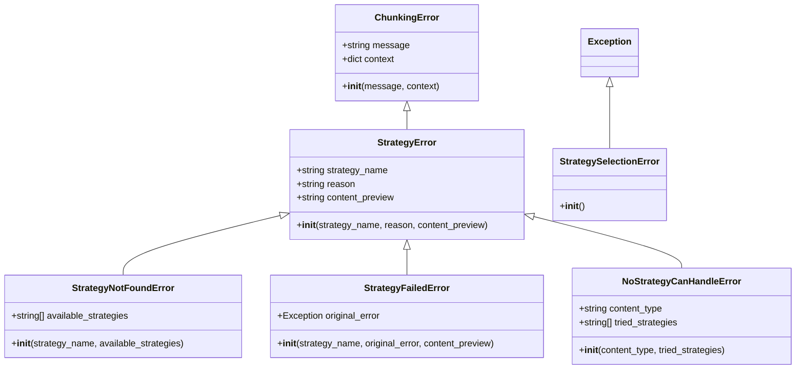
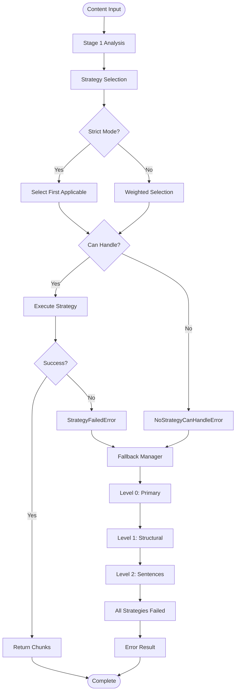
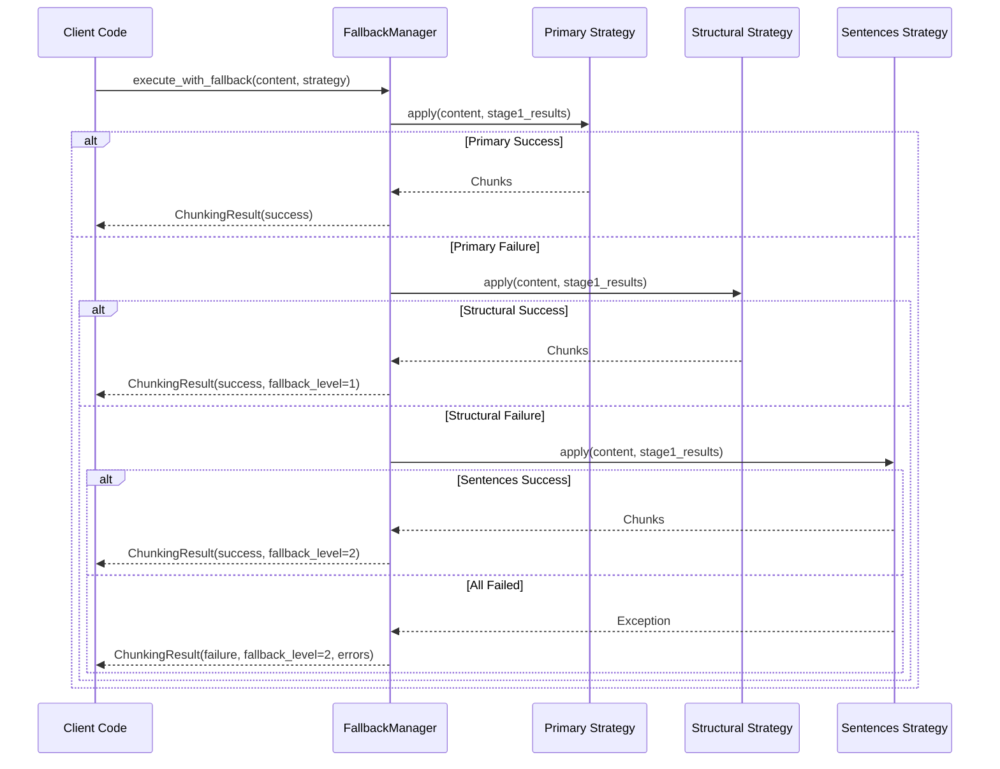

# Strategy Execution Errors

<cite>
**Referenced Files in This Document**
- [errors.py](file://markdown_chunker/chunker/errors.py)
- [selector.py](file://markdown_chunker/chunker/selector.py)
- [fallback_manager.py](file://markdown_chunker/chunker/components/fallback_manager.py)
- [test_strategy_error_handling.py](file://tests/chunker/test_strategy_error_handling.py)
- [test_fallback_manager.py](file://tests/chunker/test_components/test_fallback_manager.py)
- [orchestrator.py](file://markdown_chunker/chunker/orchestrator.py)
- [core.py](file://markdown_chunker/chunker/core.py)
- [error_handler.py](file://markdown_chunker/api/error_handler.py)
- [edge_cases_full_pipeline.py](file://tests/integration/test_edge_cases_full_pipeline.py)
</cite>

## Table of Contents
1. [Introduction](#introduction)
2. [StrategyError Hierarchy](#strategyerror-hierarchy)
3. [Error Types and Parameters](#error-types-and-parameters)
4. [Strategy Selection and Fallback Mechanism](#strategy-selection-and-fallback-mechanism)
5. [Error Handling in Practice](#error-handling-in-practice)
6. [Debugging and Diagnostics](#debugging-and-diagnostics)
7. [Application-Level Error Handling](#application-level-error-handling)
8. [Best Practices](#best-practices)
9. [Troubleshooting Guide](#troubleshooting-guide)

## Introduction

The StrategyError family of exceptions provides comprehensive error handling for strategy execution failures in the markdown chunker. These exceptions extend the base `ChunkingError` to offer context-specific information about why a particular chunking strategy failed, enabling effective debugging and fallback mechanisms.

The error system operates on a hierarchical model where different types of strategy failures are categorized and handled appropriately, from missing strategies to execution failures and content handling limitations.

## StrategyError Hierarchy

The StrategyError system follows a structured inheritance pattern that allows for precise error categorization and handling:



**Diagram sources**
- [errors.py](file://markdown_chunker/chunker/errors.py#L48-L109)
- [selector.py](file://markdown_chunker/chunker/selector.py#L19-L21)

**Section sources**
- [errors.py](file://markdown_chunker/chunker/errors.py#L48-L109)

## Error Types and Parameters

### StrategyError

The base StrategyError captures fundamental information about strategy failures:

| Parameter | Type | Purpose | Example |
|-----------|------|---------|---------|
| `strategy_name` | string | Name of the failing strategy | `"code"`, `"structural"` |
| `reason` | string | Human-readable failure description | `"Syntax error in code block"` |
| `content_preview` | string | First 100 characters of content | `"def function():\n    return True"` |

### StrategyNotFoundError

Occurs when a requested strategy doesn't exist in the available strategy pool:

| Parameter | Type | Purpose | Example |
|-----------|------|---------|---------|
| `strategy_name` | string | Requested strategy that wasn't found | `"invalid_strategy"` |
| `available_strategies` | List[string] | Complete list of available strategies | `["code", "mixed", "list", "table", "structural", "sentences"]` |

### StrategyFailedError

Captures execution failures within a strategy:

| Parameter | Type | Purpose | Example |
|-----------|------|---------|---------|
| `strategy_name` | string | Strategy that failed | `"structural"` |
| `original_error` | Exception | The underlying exception that caused failure | `ValueError("Invalid header depth")` |
| `content_preview` | string | Content that triggered the failure | `"# Header\n\nContent"` |

### NoStrategyCanHandleError

Indicates that no available strategy can process the content type:

| Parameter | Type | Purpose | Example |
|-----------|------|---------|---------|
| `content_type` | string | Detected content type | `"unknown"` |
| `tried_strategies` | List[string] | Strategies attempted | `["code", "mixed", "list", "table", "structural", "sentences"]` |

**Section sources**
- [errors.py](file://markdown_chunker/chunker/errors.py#L48-L109)

## Strategy Selection and Fallback Mechanism

The StrategySelector interacts with these errors during automatic strategy selection and fallback handling through a sophisticated multi-level system:



**Diagram sources**
- [selector.py](file://markdown_chunker/chunker/selector.py#L58-L133)
- [fallback_manager.py](file://markdown_chunker/chunker/components/fallback_manager.py#L60-L175)

### Strategy Selection Modes

The StrategySelector operates in two modes:

#### Strict Mode
- Selects the first strategy that can handle the content
- Uses priority ordering for deterministic selection
- Raises `StrategySelectionError` if no strategy can handle

#### Weighted Mode  
- Evaluates all applicable strategies with quality scoring
- Selects the strategy with highest combined priority + quality score
- Provides optimal strategy selection based on content characteristics

**Section sources**
- [selector.py](file://markdown_chunker/chunker/selector.py#L37-L78)

## Error Handling in Practice

### Integration Test Scenarios

The system demonstrates robust error handling through various integration test scenarios:

#### Unsupported Content Types
When content contains elements that confuse strategy heuristics, the system gracefully degrades:

```python
# Scenario: Malformed markdown structure
content = """
# Title

```python
def test():
    return True
Unclosed code block
"""

# Expected: Falls back to sentences strategy
# Error: NoStrategyCanHandleError with tried strategies
```

#### Malformed Structures
Complex nesting or malformed elements trigger fallback mechanisms:

```python
# Scenario: Deeply nested structures
content = """
# Title

> Blockquote
>> Nested blockquote
>>> Deeply nested
>>>> Too deep
"""

# Expected: Structural strategy may fail, falls back to sentences
```

#### Fallback Chain Exhaustion
When all strategies fail, the system returns an error result:

```python
# Scenario: Extremely malformed content
content = "x" * 10000  # Very long unstructured text

# Expected: All strategies fail, returns empty result with errors
```

**Section sources**
- [test_edge_cases_full_pipeline.py](file://tests/integration/test_edge_cases_full_pipeline.py#L451-L494)

### Fallback Manager Implementation

The FallbackManager implements a three-level fallback system:



**Diagram sources**
- [fallback_manager.py](file://markdown_chunker/chunker/components/fallback_manager.py#L60-L175)

**Section sources**
- [fallback_manager.py](file://markdown_chunker/chunker/components/fallback_manager.py#L31-L310)

## Debugging and Diagnostics

### Content Preview Field

The `content_preview` parameter is crucial for debugging strategy failures:

#### Effective Debugging Patterns

1. **Syntax Errors**: Preview shows the problematic code
   ```python
   # Error: StrategyFailedError("code", ValueError("Invalid syntax"))
   # content_preview: "def function(param\n    return None"
   ```

2. **Structure Issues**: Preview reveals problematic markdown
   ```python
   # Error: StrategyFailedError("structural", ValueError("Invalid header"))
   # content_preview: "# Header\n\nMissing content\n## Subheader"
   ```

3. **Content Type Detection**: Helps understand why strategies reject content
   ```python
   # Error: NoStrategyCanHandleError("unknown", ["code", "mixed"])
   # content_preview: "This is plain text without markdown"
   ```

### Error Message Analysis

Each error type provides specific diagnostic information:

#### StrategyNotFoundError Messages
```
"Strategy 'invalid' not found. Available strategies: code, mixed, list, table, structural, sentences"
```

#### StrategyFailedError Messages  
```
"Strategy 'structural' failed: ValueError: Invalid header depth at line 15"
```

#### NoStrategyCanHandleError Messages
```
"No strategy can handle content type 'unknown'. Tried: code, mixed, list, table, structural, sentences"
```

**Section sources**
- [test_error_types.py](file://tests/chunker/test_error_types.py#L91-L122)

## Application-Level Error Handling

### Catching Strategy Errors

Applications should handle strategy errors appropriately:

```python
from markdown_chunker.chunker.errors import (
    StrategyNotFoundError, 
    StrategyFailedError, 
    NoStrategyCanHandleError,
    StrategySelectionError
)

try:
    chunks = chunker.chunk(content, strategy="custom")
except StrategyNotFoundError as e:
    # Handle missing strategy
    available = e.available_strategies
    logger.error(f"Strategy not found: {e.strategy_name}. Available: {available}")
    # Fall back to automatic selection
    chunks = chunker.chunk(content)
    
except StrategyFailedError as e:
    # Handle strategy execution failure
    logger.error(f"Strategy {e.strategy_name} failed: {e.reason}")
    # Retry with modified configuration
    config = ChunkConfig(max_chunk_size=e.content_preview.count('\n') * 100)
    chunks = chunker.chunk(content, config=config)
    
except NoStrategyCanHandleError as e:
    # Handle content type issues
    logger.error(f"No strategy can handle {e.content_type}: {e.tried_strategies}")
    # Manual strategy selection
    chunks = chunker.chunk(content, strategy="sentences")
```

### Retry Logic with Modified Configurations

```python
def robust_chunking(chunker, content, initial_strategy=None):
    """Attempt chunking with intelligent retry logic."""
    
    # Try with specified strategy first
    try:
        return chunker.chunk(content, strategy=initial_strategy)
    except StrategyFailedError as e:
        # Reduce chunk size for complex content
        if "complex" in e.reason.lower():
            config = ChunkConfig(max_chunk_size=2048)
            return chunker.chunk(content, config=config)
    
    # Try automatic selection
    try:
        return chunker.chunk(content)
    except StrategySelectionError:
        # Last resort: use sentences strategy
        return chunker.chunk(content, strategy="sentences")
```

### Manual Strategy Selection

```python
def select_best_strategy(chunker, content):
    """Select optimal strategy based on content analysis."""
    
    # Get strategy recommendations
    strategies = chunker.get_available_strategies()
    analysis = chunker.analyze_content(content)
    
    # Choose strategy based on content characteristics
    if analysis.code_ratio > 0.7:
        return "code"
    elif analysis.list_count > 5:
        return "list"
    elif analysis.table_count > 3:
        return "table"
    else:
        return "auto"  # Let system decide
```

**Section sources**
- [test_strategy_error_handling.py](file://tests/chunker/test_strategy_error_handling.py#L16-L175)

## Best Practices

### Error Prevention

1. **Validate Strategy Names**: Always check strategy availability before use
   ```python
   available = chunker.get_available_strategies()
   if strategy_name not in available:
       raise StrategyNotFoundError(strategy_name, available)
   ```

2. **Provide Content Previews**: Include content previews in error messages for debugging
   ```python
   preview = content[:100] if len(content) > 100 else content
   raise StrategyFailedError(strategy_name, original_error, preview)
   ```

3. **Configure Fallback Chains**: Ensure fallback strategies are properly configured
   ```python
   # Verify fallback strategy is available
   fallback_strategies = [s for s in strategies if s.name == "sentences"]
   assert fallback_strategies, "Fallback strategy required"
   ```

### Error Recovery Strategies

1. **Progressive Degradation**: Start with specialized strategies, fall back to general ones
2. **Adaptive Configuration**: Modify chunking parameters based on content characteristics
3. **Manual Intervention**: Allow users to override automatic strategy selection

### Monitoring and Logging

1. **Log Strategy Failures**: Track which strategies fail and why
2. **Monitor Fallback Usage**: Understand when fallback mechanisms activate
3. **Measure Performance Impact**: Track processing time differences between strategies

## Troubleshooting Guide

### Common Issues and Solutions

#### Issue: StrategyNotFoundError
**Symptoms**: "Strategy not found" errors with available strategies list
**Causes**: 
- Typographical errors in strategy names
- Strategy not properly registered
- Case sensitivity issues

**Solutions**:
```python
# Check available strategies
available = chunker.get_available_strategies()
print(f"Available strategies: {available}")

# Use case-insensitive matching
requested = "Code".lower()
available_lower = [s.lower() for s in available]
if requested in available_lower:
    strategy = available[available_lower.index(requested)]
    chunks = chunker.chunk(content, strategy=strategy)
```

#### Issue: StrategyFailedError
**Symptoms**: Specific strategy fails with execution errors
**Causes**:
- Malformed content structure
- Resource constraints (memory, time)
- Algorithmic limitations

**Solutions**:
```python
# Reduce chunk size for complex content
config = ChunkConfig(max_chunk_size=min(2048, len(content) // 2))
chunks = chunker.chunk(content, config=config)

# Switch to simpler strategy
chunks = chunker.chunk(content, strategy="sentences")
```

#### Issue: NoStrategyCanHandleError
**Symptoms**: No strategies can process content
**Causes**:
- Content type detection failures
- Extremely unusual content structure
- Algorithmic limitations

**Solutions**:
```python
# Manual strategy selection
chunks = chunker.chunk(content, strategy="sentences")  # Universal fallback

# Content preprocessing
preprocessed = preprocess_content(content)
chunks = chunker.chunk(preprocessed)
```

### Performance Optimization

1. **Strategy Caching**: Cache strategy selection results for repeated content
2. **Early Termination**: Stop strategy evaluation when obvious failures occur
3. **Resource Monitoring**: Track memory and CPU usage during strategy execution

**Section sources**
- [test_strategy_error_handling.py](file://tests/chunker/test_strategy_error_handling.py#L16-L175)
- [error_handler.py](file://markdown_chunker/api/error_handler.py#L51-L79)