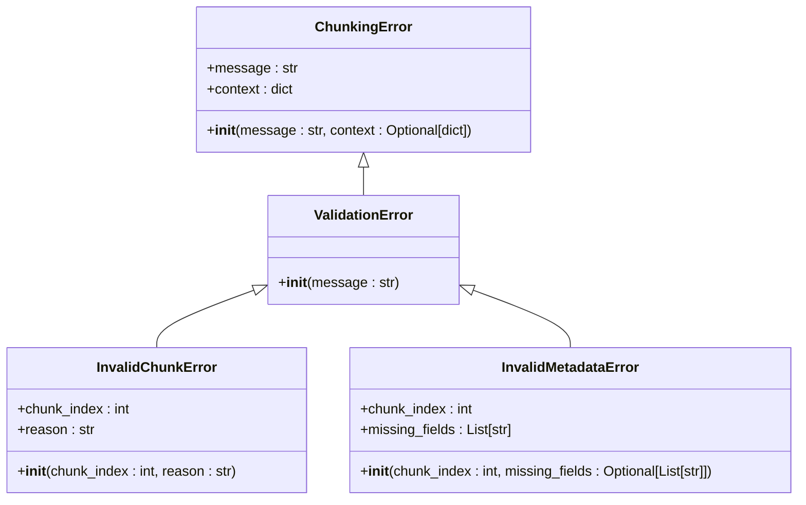
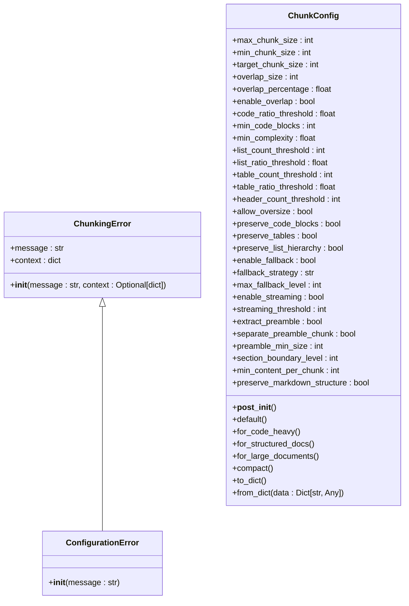
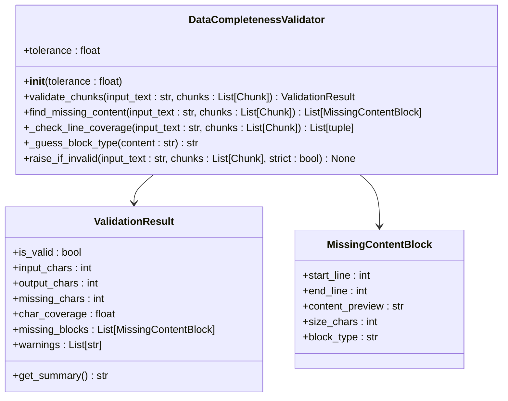

# Validation and Configuration Errors

<cite>
**Referenced Files in This Document**   
- [markdown_chunker/chunker/errors.py](file://markdown_chunker/chunker/errors.py)
- [markdown_chunker/chunker/types.py](file://markdown_chunker/chunker/types.py)
- [markdown_chunker/chunker/validator.py](file://markdown_chunker/chunker/validator.py)
- [markdown_chunker/api/validator.py](file://markdown_chunker/api/validator.py)
- [markdown_chunker/chunker/core.py](file://markdown_chunker/chunker/core.py)
- [tests/chunker/test_error_types.py](file://tests/chunker/test_error_types.py)
- [tests/chunker/test_chunk_config_validation.py](file://tests/chunker/test_chunk_config_validation.py)
- [tests/api/test_validator.py](file://tests/api/test_validator.py)
</cite>

## Table of Contents
1. [Introduction](#introduction)
2. [ValidationError and Its Subclasses](#validationerror-and-its-subclasses)
3. [ConfigurationError and Configuration Validation](#configurationerror-and-configuration-validation)
4. [Integration with Pydantic and ChunkConfig Initialization](#integration-with-pydantic-and-chunkconfig-initialization)
5. [Unit Test Examples](#unit-test-examples)
6. [Best Practices for Configuration and Error Handling](#best-practices-for-configuration-and-error-handling)
7. [Validator Component and Custom Validation](#validator-component-and-custom-validation)

## Introduction
The markdown chunker implements a comprehensive error handling system to ensure robust processing of Markdown documents. This document focuses on two critical error types: `ValidationError` and `ConfigurationError`. These exceptions play vital roles in maintaining data integrity and ensuring proper configuration of the chunking process. The system uses these errors to report failures in post-processing validation checks and to handle invalid configuration parameters, respectively. Understanding these error types is essential for developers working with the markdown chunker, as they provide clear feedback on issues that may arise during document processing and configuration.

**Section sources**
- [markdown_chunker/chunker/errors.py](file://markdown_chunker/chunker/errors.py#L178-L209)
- [markdown_chunker/chunker/types.py](file://markdown_chunker/chunker/types.py#L498-L665)

## ValidationError and Its Subclasses
The `ValidationError` class is a fundamental component of the markdown chunker's error handling system, serving as the base exception for all validation failures that occur during the chunking process. This exception inherits from `ChunkingError`, which itself extends Python's built-in `Exception` class, creating a clear hierarchy for error types within the system.

`ValidationError` is specifically designed to handle post-processing validation checks that ensure the integrity and correctness of generated chunks. When the chunking process completes, various validation rules are applied to verify that the resulting chunks meet the required standards. If any of these checks fail, a `ValidationError` or one of its subclasses is raised to indicate the specific nature of the validation failure.

Two primary subclasses of `ValidationError` are implemented in the system: `InvalidChunkError` and `InvalidMetadataError`. The `InvalidChunkError` is raised when a chunk has invalid structure or content, such as when chunk boundaries are incorrect or when essential content is missing. This error includes attributes for the chunk index and the reason for invalidity, providing detailed information about the specific chunk that failed validation.

The `InvalidMetadataError` is used when chunk metadata is found to be invalid or incomplete. This error occurs when required metadata fields are missing from a chunk, which can compromise the ability to properly interpret or use the chunk in downstream applications. Like `InvalidChunkError`, it includes the chunk index and a list of missing fields, allowing developers to quickly identify and address metadata issues.

These validation errors are crucial for maintaining data integrity throughout the chunking process. They ensure that no data is lost or corrupted during the transformation from raw Markdown to structured chunks, and that all chunks contain the necessary metadata for proper interpretation and use.

**Diagram sources**
- [markdown_chunker/chunker/errors.py](file://markdown_chunker/chunker/errors.py#L178-L209)

**Section sources**
- [markdown_chunker/chunker/errors.py](file://markdown_chunker/chunker/errors.py#L178-L209)
- [tests/chunker/test_error_types.py](file://tests/chunker/test_error_types.py#L188-L225)

## ConfigurationError and Configuration Validation
The `ConfigurationError` class is a specialized exception that extends `ChunkingError` and is specifically designed to handle issues related to invalid configuration parameters in the markdown chunker. This error type plays a critical role in ensuring that the chunking process is initialized with valid and appropriate settings, preventing potential issues that could arise from misconfiguration.

`ConfigurationError` is raised during the initialization of `ChunkConfig`, the dataclass that defines all configuration parameters for the chunking process. When invalid values are provided for configuration parameters, this exception is triggered to prevent the creation of an improperly configured chunker instance. The types of configuration issues that trigger `ConfigurationError` include out-of-bounds chunk sizes, negative overlap values, and incompatible strategy thresholds.

The validation of configuration parameters occurs in the `__post_init__` method of the `ChunkConfig` class. This method performs comprehensive validation of all configuration parameters after the object is initialized. For example, it checks that `max_chunk_size` is positive, that `min_chunk_size` is positive, and that the relationship `min_chunk_size ≤ target_chunk_size ≤ max_chunk_size` is maintained. It also validates percentage values such as `overlap_percentage`, `code_ratio_threshold`, `list_ratio_threshold`, and `table_ratio_threshold` to ensure they fall within the valid range of 0.0 to 1.0.

In addition to raising `ConfigurationError` for invalid values, the system implements auto-adjustment logic to handle certain edge cases. For instance, if `min_chunk_size` is greater than `max_chunk_size`, the system automatically adjusts `min_chunk_size` to be half of `max_chunk_size` (with a minimum value of 1). Similarly, if `target_chunk_size` exceeds `max_chunk_size`, it is automatically adjusted down to match `max_chunk_size`. This auto-adjustment helps prevent configuration errors while maintaining the integrity of the chunking process.

The API-level validation also contributes to configuration error handling. The `api/validator.py` module contains methods that validate configuration parameters before they are used to create a `ChunkConfig` instance. These validations check for proper data types and value ranges, appending specific error messages to a list of errors when validation fails. This multi-layered approach to configuration validation ensures that invalid configurations are caught early in the process, providing clear feedback to users and preventing potential issues during chunking.

**Diagram sources**
- [markdown_chunker/chunker/core.py](file://markdown_chunker/chunker/core.py#L778-L779)
- [markdown_chunker/chunker/types.py](file://markdown_chunker/chunker/types.py#L498-L665)

**Section sources**
- [markdown_chunker/chunker/core.py](file://markdown_chunker/chunker/core.py#L778-L779)
- [markdown_chunker/chunker/types.py](file://markdown_chunker/chunker/types.py#L621-L665)
- [markdown_chunker/api/validator.py](file://markdown_chunker/api/validator.py#L155-L185)
- [tests/chunker/test_chunk_config_validation.py](file://tests/chunker/test_chunk_config_validation.py#L16-L117)

## Integration with Pydantic and ChunkConfig Initialization
The markdown chunker integrates validation mechanisms into the `ChunkConfig` initialization process, leveraging Python's dataclass `__post_init__` method to perform comprehensive validation of configuration parameters. While the system does not explicitly use Pydantic, it implements similar validation principles through the `__post_init__` method of the `ChunkConfig` dataclass.

During `ChunkConfig` initialization, the `__post_init__` method automatically executes after the object is created, providing an opportunity to validate and potentially adjust configuration parameters. This method performs several critical validation checks to ensure the integrity of the configuration. It verifies that `max_chunk_size` and `min_chunk_size` are positive values, and if `min_chunk_size` is greater than `max_chunk_size`, it automatically adjusts `min_chunk_size` to half of `max_chunk_size` (with a minimum value of 1).

The method also validates percentage-based parameters such as `overlap_percentage`, `code_ratio_threshold`, `list_ratio_threshold`, and `table_ratio_threshold` to ensure they fall within the valid range of 0.0 to 1.0. If any of these values are outside this range, a `ValueError` is raised with a descriptive message. Additionally, the method checks that `target_chunk_size` falls within the bounds defined by `min_chunk_size` and `max_chunk_size`, automatically adjusting it if necessary.

The validation process also includes checks for Phase 2 parameters such as `section_boundary_level`, which must be between 1 and 6 (corresponding to Markdown header levels), and `min_content_per_chunk`, which must be non-negative. After all validations and adjustments, the method performs a final invariant check to ensure that `min_chunk_size ≤ target_chunk_size ≤ max_chunk_size`, raising an `AssertionError` if this condition is violated.

This comprehensive validation approach ensures that `ChunkConfig` instances are always created with valid and consistent parameters, preventing potential issues during the chunking process. The use of factory methods like `default()`, `for_code_heavy()`, `for_structured_docs()`, and `for_large_documents()` further enhances the reliability of configuration by providing pre-validated configuration profiles for common use cases.

**Section sources**
- [markdown_chunker/chunker/types.py](file://markdown_chunker/chunker/types.py#L621-L665)
- [tests/chunker/test_chunk_config_validation.py](file://tests/chunker/test_chunk_config_validation.py#L16-L117)

## Unit Test Examples
The markdown chunker includes comprehensive unit tests that demonstrate various scenarios involving `ValidationError` and `ConfigurationError`. These tests provide valuable examples of invalid configurations and their corresponding error messages, helping developers understand how to properly configure the system and handle potential errors.

For `ConfigurationError`, the tests in `test_chunk_config_validation.py` demonstrate several failure scenarios. When `max_chunk_size` is set to zero or a negative value, a `ValueError` is raised with the message "max_chunk_size must be positive". Similarly, when `min_chunk_size` is zero or negative, the same type of error occurs. The tests also verify that percentage values like `overlap_percentage` must be between 0.0 and 1.0, with appropriate error messages when this constraint is violated.

The API validator tests in `test_validator.py` provide additional examples of configuration validation. When `max_chunk_size` exceeds the maximum allowed value (100,000), an error is generated indicating that the value is too large. If `min_chunk_size` is below the minimum threshold (10), a validation error is raised. The tests also check for proper data types, generating errors when non-integer values are provided for parameters that require integers.

For `ValidationError`, the tests in `test_error_types.py` demonstrate how these exceptions are raised and handled. The `test_invalid_chunk_error` method shows that `InvalidChunkError` is properly initialized with a chunk index and reason, and that the error message includes both pieces of information. Similarly, `test_invalid_metadata_error` verifies that `InvalidMetadataError` correctly handles cases where specific fields are missing from chunk metadata.

These unit tests not only validate the error handling system but also serve as practical examples for developers. They illustrate the exact error messages that will be generated for various invalid configurations, making it easier to diagnose and fix issues in real-world applications. The tests also demonstrate proper error handling patterns, such as catching specific error types and verifying that error context is preserved.

**Section sources**
- [tests/chunker/test_chunk_config_validation.py](file://tests/chunker/test_chunk_config_validation.py#L118-L157)
- [tests/api/test_validator.py](file://tests/api/test_validator.py#L38-L121)
- [tests/chunker/test_error_types.py](file://tests/chunker/test_error_types.py#L197-L225)

## Best Practices for Configuration and Error Handling
To ensure reliable operation of the markdown chunker, developers should follow several best practices for configuration and error handling. First, it is recommended to use the factory methods provided by `ChunkConfig` rather than manually specifying all parameters. Methods like `default()`, `for_code_heavy()`, `for_structured_docs()`, and `for_large_documents()` provide pre-validated configuration profiles optimized for specific use cases, reducing the risk of configuration errors.

When creating custom configurations, developers should ensure that all size parameters are positive and that the relationship `min_chunk_size ≤ target_chunk_size ≤ max_chunk_size` is maintained. Percentage values should be specified as floats between 0.0 and 1.0. It is also important to validate configuration parameters before passing them to the chunker, either by using the API validator or by implementing similar validation logic in the application.

For error handling, applications should catch specific error types rather than using broad exception handlers. This allows for more targeted error recovery and better user feedback. For example, `ConfigurationError` might prompt the user to review their settings, while `ValidationError` could trigger a data integrity check. The error context provided with `ChunkingError` instances should be preserved and logged for debugging purposes.

Applications should also implement proper fallback strategies when chunking fails. The markdown chunker includes a fallback mechanism that can be configured through `ChunkConfig`, but applications may want to implement additional fallbacks at the application level. This could include retrying with different configuration parameters or falling back to simpler chunking methods.

Finally, developers should validate the output of the chunking process using the built-in validation tools. The `DataCompletenessValidator` can be used to verify that no data is lost during chunking, and custom validation rules can be implemented to check for application-specific requirements. Regular testing with edge cases and invalid inputs helps ensure that the error handling system works as expected in production environments.

**Section sources**
- [markdown_chunker/chunker/types.py](file://markdown_chunker/chunker/types.py#L667-L798)
- [markdown_chunker/chunker/validator.py](file://markdown_chunker/chunker/validator.py#L61-L354)
- [markdown_chunker/api/validator.py](file://markdown_chunker/api/validator.py#L155-L185)

## Validator Component and Custom Validation
The validator component in the markdown chunker plays a crucial role in ensuring data completeness and integrity throughout the chunking process. The primary validator class, `DataCompletenessValidator`, is responsible for verifying that all input content is properly represented in the output chunks, with minimal data loss or corruption.

This validator performs several key checks to ensure data completeness. It compares the total character count of the input text with the sum of characters in all output chunks, allowing for a configurable tolerance (default 5%) to account for whitespace normalization differences. It also checks for gaps in line coverage, identifying any large sections of the input that are not represented in the output chunks. Additionally, it attempts to identify specific content blocks that are missing from the chunks, providing detailed information about the type and location of missing content.

The validator can be configured with a tolerance parameter that determines how much difference is allowed between input and output character counts. This tolerance accounts for minor formatting differences that may occur during the chunking process. When validation fails, the validator raises appropriate error types such as `DataLossError`, `MissingContentError`, or `IncompleteCoverageError`, depending on the nature of the issue.

The system also supports custom validation rules through the extensible error hierarchy. Developers can create additional subclasses of `ValidationError` or `ChunkingError` to handle application-specific validation requirements. These custom validation rules can be integrated into the chunking process by extending the validator component or by implementing validation logic in custom strategies.

The validator component is tightly integrated with the chunking process, with validation checks performed at multiple stages. During strategy execution, chunks are validated to ensure they meet basic requirements such as non-empty content and valid line numbers. After chunking is complete, the `DataCompletenessValidator` performs a comprehensive check of the entire output. This multi-layered validation approach ensures that data integrity is maintained throughout the entire chunking pipeline.

**Diagram sources**
- [markdown_chunker/chunker/validator.py](file://markdown_chunker/chunker/validator.py#L53-L354)

**Section sources**
- [markdown_chunker/chunker/validator.py](file://markdown_chunker/chunker/validator.py#L53-L354)
- [markdown_chunker/chunker/errors.py](file://markdown_chunker/chunker/errors.py#L111-L176)