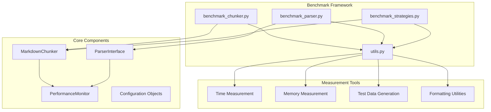
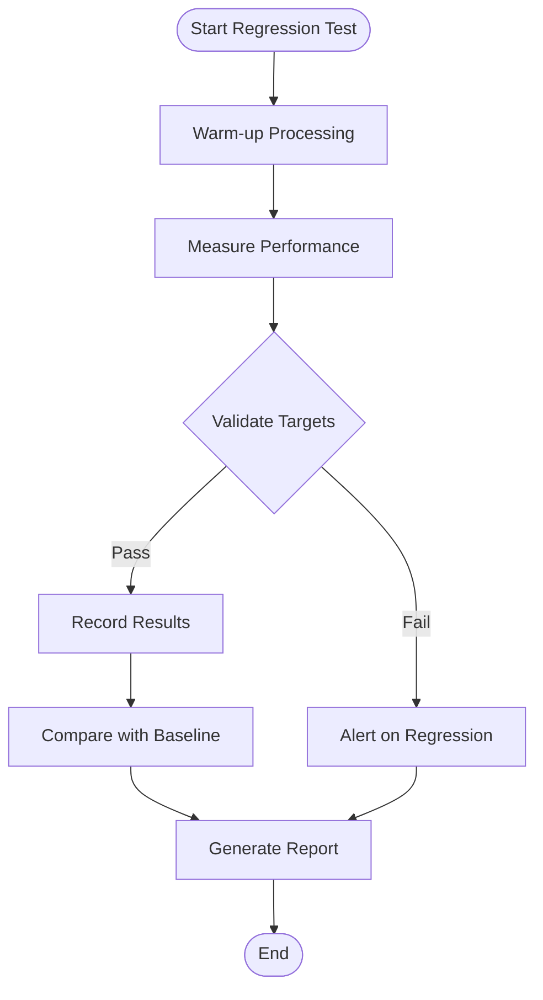

# Benchmarking Tools

<cite>
**Referenced Files in This Document**
- [benchmarks/benchmark_chunker.py](file://benchmarks/benchmark_chunker.py)
- [benchmarks/benchmark_parser.py](file://benchmarks/benchmark_parser.py)
- [benchmarks/benchmark_strategies.py](file://benchmarks/benchmark_strategies.py)
- [benchmarks/utils.py](file://benchmarks/utils.py)
- [markdown_chunker/chunker/performance.py](file://markdown_chunker/chunker/performance.py)
- [tests/performance/test_benchmarks.py](file://tests/performance/test_benchmarks.py)
- [tests/chunker/test_performance_benchmarks.py](file://tests/chunker/test_performance_benchmarks.py)
- [README.md](file://README.md)
- [main.py](file://main.py)
</cite>

## Table of Contents
1. [Introduction](#introduction)
2. [Benchmarking Architecture](#benchmarking-architecture)
3. [Core Benchmark Scripts](#core-benchmark-scripts)
4. [Performance Metrics and Measurements](#performance-metrics-and-measurements)
5. [Running Benchmarks](#running-benchmarks)
6. [Interpreting Results](#interpreting-results)
7. [Performance Regression Testing](#performance-regression-testing)
8. [Configuration and Environment Setup](#configuration-and-environment-setup)
9. [Common Issues and Troubleshooting](#common-issues-and-troubleshooting)
10. [Best Practices](#best-practices)

## Introduction

The Dify Markdown Chunker provides a comprehensive benchmarking framework designed to measure and compare performance improvements across different document sizes, content types, and configuration scenarios. These tools enable developers to:

- Evaluate chunking performance under various conditions
- Identify performance regressions and improvements
- Compare different chunking strategies
- Validate configuration changes impact on performance
- Establish performance baselines for regression testing

The benchmarking system consists of three primary scripts that measure different aspects of the chunking pipeline, along with utility functions for consistent measurement and reporting.

## Benchmarking Architecture

The benchmarking framework follows a modular architecture with clear separation of concerns:



**Diagram sources**
- [benchmarks/benchmark_chunker.py](file://benchmarks/benchmark_chunker.py#L1-L195)
- [benchmarks/benchmark_parser.py](file://benchmarks/benchmark_parser.py#L1-L62)
- [benchmarks/benchmark_strategies.py](file://benchmarks/benchmark_strategies.py#L1-L96)
- [benchmarks/utils.py](file://benchmarks/utils.py#L1-L259)

**Section sources**
- [benchmarks/benchmark_chunker.py](file://benchmarks/benchmark_chunker.py#L1-L195)
- [benchmarks/benchmark_parser.py](file://benchmarks/benchmark_parser.py#L1-L62)
- [benchmarks/benchmark_strategies.py](file://benchmarks/benchmark_strategies.py#L1-L96)

## Core Benchmark Scripts

### Benchmark Chunker Script

The main benchmark script measures the complete chunking pipeline performance across different document sizes and content types.

#### Key Features:
- **Size-based benchmarking**: Tests documents ranging from 1KB to 500KB
- **Content type analysis**: Evaluates performance across text, code, mixed, list, and table content
- **Comprehensive metrics**: Time, throughput, chunk count, and memory usage
- **JSON output**: Structured results for automated analysis

#### Benchmark Categories:
1. **Document Size Performance**: Measures scaling characteristics
2. **Content Type Efficiency**: Compares strategy effectiveness
3. **Strategy Comparison**: Individual strategy performance

**Section sources**
- [benchmarks/benchmark_chunker.py](file://benchmarks/benchmark_chunker.py#L27-L195)

### Benchmark Parser Script

Focuses on measuring Stage 1 parser performance, which handles content analysis and element detection.

#### Key Metrics:
- **Processing Time**: Time to analyze document structure
- **Element Count**: Number of detected markdown elements
- **Scalability**: Performance across different document sizes

**Section sources**
- [benchmarks/benchmark_parser.py](file://benchmarks/benchmark_parser.py#L17-L62)

### Benchmark Strategies Script

Evaluates individual chunking strategies in isolation to understand their performance characteristics.

#### Strategy Coverage:
- **Code Strategy**: Optimized for code-heavy documents
- **Mixed Strategy**: Balanced approach for varied content
- **List Strategy**: Preserves list structures
- **Table Strategy**: Handles tabular data efficiently
- **Structural Strategy**: Follows document hierarchy
- **Sentences Strategy**: Fallback sentence-based approach

**Section sources**
- [benchmarks/benchmark_strategies.py](file://benchmarks/benchmark_strategies.py#L19-L96)

## Performance Metrics and Measurements

The benchmarking framework captures four primary performance metrics:

### Time Metrics
- **Execution Time**: Total time to process a document
- **Processing Speed**: Documents per second
- **Strategy Selection Time**: Time for strategy analysis

### Throughput Metrics
- **Data Throughput**: Bytes processed per second (KB/s)
- **Chunk Throughput**: Chunks generated per second
- **Memory Throughput**: Memory usage efficiency

### Resource Metrics
- **Peak Memory Usage**: Maximum memory consumption during processing
- **Memory Efficiency**: Memory usage relative to document size
- **Cache Hit Rates**: Effectiveness of caching mechanisms

### Quality Metrics
- **Chunk Count**: Number of resulting chunks
- **Average Chunk Size**: Mean size of generated chunks
- **Strategy Usage**: Distribution of strategy selections

**Section sources**
- [benchmarks/utils.py](file://benchmarks/utils.py#L245-L259)

## Running Benchmarks

### Prerequisites
Ensure you have the development environment set up with all dependencies installed:

```bash
# Navigate to project root
cd dify-markdown-chunker

# Activate virtual environment
source venv/bin/activate

# Install development dependencies
pip install -r requirements.txt
```

### Running Individual Benchmarks

#### 1. Main Chunker Benchmark
```bash
python -m benchmarks.benchmark_chunker
```

This runs comprehensive benchmarks including:
- Document size performance (1KB to 500KB)
- Content type efficiency analysis
- Strategy comparison results
- JSON output generation

#### 2. Parser Benchmark
```bash
python -m benchmarks.benchmark_parser
```

Focuses on Stage 1 parser performance:
- Element detection speed
- Scalability across document sizes
- Memory usage patterns

#### 3. Strategy Benchmark
```bash
python -m benchmarks.benchmark_strategies
```

Evaluates individual strategy performance:
- Isolated strategy execution
- Cross-content type comparisons
- Performance consistency analysis

### Batch Benchmark Execution

For comprehensive performance analysis, run all benchmarks:

```bash
# Run all benchmarks sequentially
python -m benchmarks.benchmark_chunker && \
python -m benchmarks.benchmark_parser && \
python -m benchmarks.benchmark_strategies
```

### Benchmark Output Format

All benchmarks generate structured JSON output with the following structure:

```json
{
  "timestamp": "2024-01-01T12:00:00",
  "version": "1.4.0",
  "by_size": [
    {
      "label": "small",
      "size_kb": 1,
      "actual_size_bytes": 1024,
      "time_seconds": 0.001,
      "throughput_kbps": 1024.0,
      "chunks_count": 6,
      "memory_mb": 1.2
    }
  ],
  "by_content_type": [
    {
      "content_type": "text",
      "time_seconds": 0.002,
      "strategy_used": "structural",
      "chunks_count": 12,
      "avg_chunk_size": 850
    }
  ]
}
```

**Section sources**
- [benchmarks/benchmark_chunker.py](file://benchmarks/benchmark_chunker.py#L150-L166)

## Interpreting Results

### Performance Characteristics Analysis

#### Document Size Scaling
- **Linear Scaling**: Ideal scenario where performance scales predictably
- **Non-linear Behavior**: Indicates bottlenecks or optimization opportunities
- **Memory Growth**: Monitor memory usage trends across document sizes

#### Content Type Efficiency
- **Strategy Suitability**: Different content types favor different strategies
- **Processing Overhead**: Understand the cost of strategy selection
- **Quality Trade-offs**: Balance speed against chunk quality

#### Strategy Performance Comparison
- **Relative Speed**: Compare strategies across different content types
- **Resource Usage**: Evaluate memory and CPU consumption
- **Consistency**: Check performance stability across runs

### Performance Regression Detection

#### Baseline Establishment
1. **Baseline Measurement**: Record performance with known good configurations
2. **Threshold Setting**: Define acceptable performance ranges
3. **Monitoring Integration**: Incorporate benchmarks into CI/CD pipelines

#### Regression Indicators
- **Significant Time Increases**: >10% degradation in processing time
- **Memory Leaks**: Increasing memory usage across iterations
- **Strategy Failures**: Unexpected strategy selection failures
- **Quality Degradation**: Changes in chunk quality metrics

### Optimization Opportunities

#### Bottleneck Identification
- **Parser Bottlenecks**: Slow element detection or analysis
- **Strategy Selection**: Excessive time spent choosing strategies
- **Memory Pressure**: High memory usage causing slowdowns
- **I/O Bound Operations**: File system or network dependencies

#### Configuration Impact
- **Chunk Size Effects**: Optimal chunk size for different document types
- **Strategy Preferences**: Automatic strategy selection effectiveness
- **Caching Benefits**: Cache hit rates and effectiveness
- **Parallel Processing**: Multi-threading benefits

**Section sources**
- [tests/performance/test_benchmarks.py](file://tests/performance/test_benchmarks.py#L1-L319)

## Performance Regression Testing

### Automated Regression Checks

The framework includes automated regression testing to prevent performance degradation:

#### Test Categories
1. **Small Document Tests**: < 1KB documents (< 0.1s target)
2. **Medium Document Tests**: ~50KB documents (< 1.0s target)
3. **Large Document Tests**: ~500KB documents (< 5.0s target)
4. **Memory Usage Validation**: Consistent memory consumption
5. **Performance Consistency**: Low variance across runs

#### Regression Detection Logic



**Diagram sources**
- [tests/performance/test_benchmarks.py](file://tests/performance/test_benchmarks.py#L152-L200)

### Continuous Integration Integration

#### CI Pipeline Integration
1. **Pre-commit Hooks**: Run benchmarks before code commits
2. **Pull Request Checks**: Validate performance impact of changes
3. **Nightly Builds**: Comprehensive performance regression testing
4. **Release Validation**: Ensure performance meets requirements

#### Performance Monitoring
- **Trend Analysis**: Track performance trends over time
- **Anomaly Detection**: Identify unexpected performance changes
- **Automated Alerts**: Notify teams of performance regressions
- **Historical Comparison**: Compare against previous releases

**Section sources**
- [tests/chunker/test_performance_benchmarks.py](file://tests/chunker/test_performance_benchmarks.py#L152-L560)

## Configuration and Environment Setup

### Benchmark Environment Requirements

#### Hardware Considerations
- **CPU**: Multi-core processors for parallel processing
- **Memory**: Sufficient RAM for large document testing
- **Storage**: Fast SSD for reduced I/O latency
- **Network**: Stable connections for external dependencies

#### Software Dependencies
- **Python 3.12+**: Required runtime environment
- **Virtual Environment**: Isolated benchmark execution
- **Development Dependencies**: All testing and benchmarking tools
- **System Libraries**: Native libraries for optimal performance

### Configuration Options

#### Benchmark Configuration
```python
# Example benchmark configuration
benchmark_config = {
    "run_benchmarks": True,
    "include_memory_usage": True,
    "iterations": 5,
    "warmup_iterations": 2,
    "test_cases": ["small", "medium", "large"]
}
```

#### Performance Monitoring
- **Enable Monitoring**: Track detailed performance metrics
- **Memory Tracking**: Monitor memory usage patterns
- **Strategy Analysis**: Detailed strategy performance data
- **Output Formatting**: Structured JSON or CSV output

### Environment Variables

#### Benchmark Control
- `BENCHMARK_ITERATIONS`: Number of benchmark runs
- `BENCHMARK_WARMUP`: Warm-up iteration count
- `BENCHMARK_OUTPUT`: Output format (JSON, CSV, console)
- `BENCHMARK_VERBOSE`: Verbose output flag

#### Performance Tuning
- `CHUNKER_CACHE_SIZE`: Cache size for benchmarking
- `CHUNKER_MAX_CHUNK_SIZE`: Maximum chunk size for tests
- `CHUNKER_STRATEGY_TIMEOUT`: Strategy selection timeout

**Section sources**
- [markdown_chunker/chunker/performance.py](file://markdown_chunker/chunker/performance.py#L1-L243)

## Common Issues and Troubleshooting

### Inconsistent Benchmark Results

#### Causes and Solutions

1. **System Load Variations**
   - **Issue**: Other processes affecting benchmark timing
   - **Solution**: Run benchmarks in isolated environments
   - **Prevention**: Use dedicated benchmark machines

2. **Memory Pressure**
   - **Issue**: Garbage collection affecting timing
   - **Solution**: Increase memory allocation for benchmarks
   - **Prevention**: Monitor memory usage patterns

3. **Disk I/O Variations**
   - **Issue**: File system caching affecting results
   - **Solution**: Use in-memory test data
   - **Prevention**: Test with synthetic data generators

#### Measurement Accuracy Improvements
- **Multiple Iterations**: Run benchmarks multiple times
- **Warm-up Periods**: Allow system to stabilize
- **Statistical Analysis**: Use mean and median values
- **Outlier Removal**: Filter extreme values

### Memory-Related Issues

#### Memory Leaks
- **Detection**: Monitor memory usage across iterations
- **Causes**: Unclosed resources, circular references
- **Solutions**: Proper resource cleanup, garbage collection tuning

#### Memory Limitations
- **Symptoms**: Out-of-memory errors during testing
- **Solutions**: Reduce test document sizes, optimize memory usage
- **Prevention**: Monitor memory usage patterns

### Performance Variability

#### Identifying Root Causes
1. **Profile the Code**: Use profiling tools to identify bottlenecks
2. **Isolate Components**: Test individual components separately
3. **Compare Configurations**: Test different configuration options
4. **Hardware Analysis**: Check CPU and memory utilization

#### Optimization Strategies
- **Caching**: Implement effective caching mechanisms
- **Parallel Processing**: Utilize multi-core processors
- **Algorithm Optimization**: Improve algorithmic complexity
- **Resource Management**: Optimize memory and CPU usage

### Benchmark Data Interpretation

#### Statistical Analysis
- **Mean Values**: Average performance across runs
- **Standard Deviation**: Measure of performance consistency
- **Percentiles**: Distribution of performance values
- **Trend Analysis**: Performance changes over time

#### Reporting and Visualization
- **Performance Charts**: Visualize performance trends
- **Comparison Tables**: Compare different configurations
- **Regression Reports**: Identify performance changes
- **Automated Dashboards**: Monitor performance continuously

**Section sources**
- [benchmarks/utils.py](file://benchmarks/utils.py#L12-L76)

## Best Practices

### Benchmark Design Principles

#### Reliable Measurements
1. **Controlled Environment**: Minimize external influences
2. **Reproducible Conditions**: Standardize hardware and software
3. **Multiple Runs**: Use statistical significance
4. **Warm-up Periods**: Allow system stabilization

#### Comprehensive Coverage
1. **Document Sizes**: Test across realistic size ranges
2. **Content Types**: Include diverse content patterns
3. **Configuration Variants**: Test different settings
4. **Edge Cases**: Handle boundary conditions

### Performance Testing Guidelines

#### Test Planning
- **Define Objectives**: Clear performance goals and targets
- **Select Metrics**: Choose relevant performance indicators
- **Establish Baselines**: Document current performance levels
- **Set Thresholds**: Define acceptable performance ranges

#### Test Execution
- **Isolated Testing**: Run tests in controlled environments
- **Consistent Hardware**: Use standardized testing infrastructure
- **Environment Cleanup**: Reset system state between tests
- **Data Validation**: Verify test data integrity

#### Result Analysis
- **Statistical Significance**: Use appropriate statistical methods
- **Trend Analysis**: Track performance over time
- **Root Cause Analysis**: Investigate performance anomalies
- **Actionable Insights**: Identify optimization opportunities

### Integration with Development Workflow

#### Continuous Integration
- **Automated Testing**: Integrate benchmarks into CI/CD pipelines
- **Performance Gates**: Block deployments with performance regressions
- **Historical Tracking**: Maintain performance history
- **Alert Systems**: Notify teams of performance issues

#### Development Practices
- **Performance Reviews**: Regular performance assessment
- **Code Optimization**: Focus on performance-critical code
- **Testing Automation**: Automate performance testing
- **Documentation**: Maintain performance documentation

### Maintenance and Updates

#### Benchmark Maintenance
- **Regular Updates**: Keep benchmarks current with code changes
- **Performance Monitoring**: Continuously monitor system performance
- **Tool Updates**: Maintain benchmarking tools and dependencies
- **Documentation**: Keep performance documentation up-to-date

#### Evolutionary Improvement
- **Benchmark Enhancement**: Improve benchmark coverage and accuracy
- **Tool Development**: Develop specialized benchmarking tools
- **Performance Research**: Stay current with performance optimization techniques
- **Community Contribution**: Share benchmarking insights and tools

**Section sources**
- [tests/performance/test_benchmarks.py](file://tests/performance/test_benchmarks.py#L268-L319)