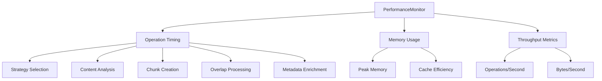
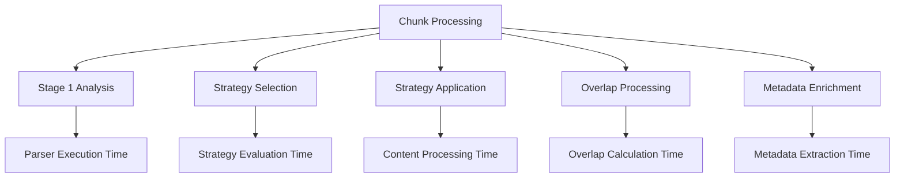
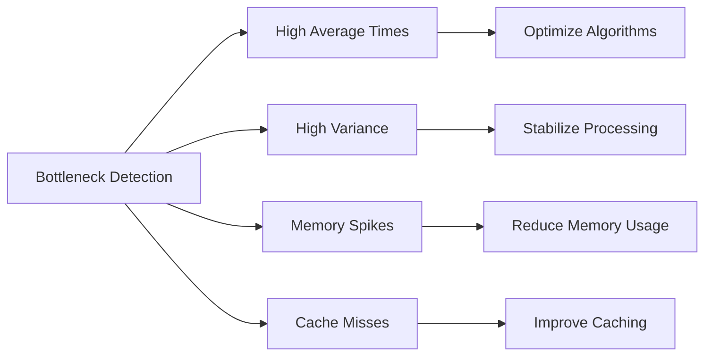

# Performance Issues

<cite>
**Referenced Files in This Document**
- [markdown_chunker/chunker/performance.py](file://markdown_chunker/chunker/performance.py)
- [markdown_chunker/chunker/core.py](file://markdown_chunker/chunker/core.py)
- [markdown_chunker/chunker/orchestrator.py](file://markdown_chunker/chunker/orchestrator.py)
- [markdown_chunker/chunker/strategies/base.py](file://markdown_chunker/chunker/strategies/base.py)
- [markdown_chunker/chunker/strategies/code_strategy.py](file://markdown_chunker/chunker/strategies/code_strategy.py)
- [markdown_chunker/chunker/strategies/mixed_strategy.py](file://markdown_chunker/chunker/strategies/mixed_strategy.py)
- [benchmarks/benchmark_chunker.py](file://benchmarks/benchmark_chunker.py)
- [benchmarks/benchmark_strategies.py](file://benchmarks/benchmark_strategies.py)
- [benchmarks/utils.py](file://benchmarks/utils.py)
- [examples/basic_usage.py](file://examples/basic_usage.py)
- [examples/api_usage.py](file://examples/api_usage.py)
- [tests/chunker/test_performance.py](file://tests/chunker/test_performance.py)
</cite>

## Table of Contents
1. [Introduction](#introduction)
2. [Performance Monitoring Features](#performance-monitoring-features)
3. [Built-in Performance Metrics](#built-in-performance-metrics)
4. [Diagnosing Performance Bottlenecks](#diagnosing-performance-bottlenecks)
5. [Optimization Strategies](#optimization-strategies)
6. [Common Performance Issues](#common-performance-issues)
7. [Benchmarking Tools](#benchmarking-tools)
8. [Practical Examples](#practical-examples)
9. [Best Practices](#best-practices)
10. [Troubleshooting Guide](#troubleshooting-guide)

## Introduction

The markdown chunker provides comprehensive performance monitoring and optimization capabilities designed to help developers diagnose and resolve performance bottlenecks in their chunking workflows. This system enables detailed tracking of timing metrics, memory usage, and operational efficiency across all stages of the chunking process.

The performance monitoring system is built around several key components:
- **PerformanceMonitor**: Records and tracks timing metrics for all operations
- **PerformanceOptimizer**: Provides intelligent caching and optimization decisions
- **ChunkCache**: Prevents redundant processing of identical content
- **StrategyCache**: Optimizes strategy instantiation and reuse
- **MemoryEfficientProcessor**: Handles large documents with controlled memory usage

## Performance Monitoring Features

### Enabling Performance Monitoring

Performance monitoring is disabled by default to minimize overhead. Enable it when diagnosing performance issues:

```python
from markdown_chunker import MarkdownChunker

# Enable performance monitoring
chunker = MarkdownChunker(enable_performance_monitoring=True)

# Process documents normally
result = chunker.chunk(large_document)

# Get performance statistics
stats = chunker.get_performance_stats()
print(f"Average chunk time: {stats['chunk']['avg_time']:.3f}s")
```

### Key Monitoring Capabilities

The performance monitoring system tracks metrics across multiple dimensions:



**Diagram sources**
- [markdown_chunker/chunker/performance.py](file://markdown_chunker/chunker/performance.py#L32-L82)

**Section sources**
- [markdown_chunker/chunker/core.py](file://markdown_chunker/chunker/core.py#L65-L81)
- [markdown_chunker/chunker/performance.py](file://markdown_chunker/chunker/performance.py#L32-L82)

## Built-in Performance Metrics

### Available Metrics

The performance monitoring system captures comprehensive metrics for each operation:

| Metric Category | Details | Purpose |
|----------------|---------|---------|
| **Timing Metrics** | `count`, `total_time`, `avg_time`, `min_time`, `max_time` | Track execution duration |
| **Throughput Metrics** | `throughput` (bytes/second), `avg_size` | Measure processing efficiency |
| **Cache Metrics** | Cache hit rates, cache size, eviction patterns | Optimize caching strategies |
| **Memory Metrics** | Peak memory usage, allocation patterns | Monitor memory consumption |

### Operation-Specific Metrics

The system tracks metrics for key operations:



**Diagram sources**
- [markdown_chunker/chunker/orchestrator.py](file://markdown_chunker/chunker/orchestrator.py#L55-L118)

### Getting Performance Statistics

Access detailed performance statistics using the monitoring API:

```python
# Get all performance metrics
stats = chunker.get_performance_stats()

# Access specific operation metrics
chunk_stats = stats.get('chunk', {})
strategy_stats = stats.get('strategy_selection', {})

# Interpret timing data
if chunk_stats.get('max_time', 0) > 1.0:
    print("Warning: Slow chunking detected")
    
if strategy_stats.get('avg_time', 0) > 0.1:
    print("Warning: Strategy selection taking too long")
```

**Section sources**
- [markdown_chunker/chunker/core.py](file://markdown_chunker/chunker/core.py#L661-L706)
- [markdown_chunker/chunker/performance.py](file://markdown_chunker/chunker/performance.py#L51-L82)

## Diagnosing Performance Bottlenecks

### Identifying Slow Operations

Use the performance monitoring system to identify bottlenecks:

```python
# Enable monitoring
chunker = MarkdownChunker(enable_performance_monitoring=True)

# Process multiple documents
for doc in documents:
    chunker.chunk(doc)

# Analyze performance bottlenecks
stats = chunker.get_performance_stats()

# Identify slow operations
slow_ops = [(op, data['avg_time']) for op, data in stats.items() 
           if data.get('avg_time', 0) > 0.1]

for op, avg_time in sorted(slow_ops, key=lambda x: x[1], reverse=True):
    print(f"{op}: {avg_time:.3f}s average")
```

### Common Bottleneck Patterns



### Performance Analysis Workflow

1. **Baseline Establishment**: Measure performance with monitoring enabled
2. **Bottleneck Identification**: Compare operation times and identify outliers
3. **Root Cause Analysis**: Examine content characteristics causing delays
4. **Optimization Implementation**: Apply targeted optimizations
5. **Validation**: Measure improvements with continued monitoring

**Section sources**
- [tests/chunker/test_performance.py](file://tests/chunker/test_performance.py#L343-L447)

## Optimization Strategies

### Strategy Selection Optimization

Different strategies have varying performance characteristics:

```python
# Strategy performance comparison
strategies = ["code", "mixed", "list", "table", "structural", "sentences"]

for strategy in strategies:
    try:
        result = chunker.chunk(document, strategy=strategy)
        stats = chunker.get_performance_stats()
        strategy_stats = stats.get(f'{strategy}_apply', {})
        print(f"{strategy}: {strategy_stats.get('avg_time', 0):.3f}s")
    except Exception as e:
        print(f"{strategy}: Error - {e}")
```

### Content-Type Specific Optimizations

Different content types benefit from different optimization approaches:

| Content Type | Recommended Strategy | Optimization Tips |
|-------------|---------------------|-------------------|
| **Code-heavy** | `code` strategy | Enable code-specific parsing, disable overlap |
| **Mixed content** | `mixed` strategy | Use semantic boundary splitting |
| **List-heavy** | `list` strategy | Preserve list atomicity |
| **Table-heavy** | `table` strategy | Maintain table structure |
| **Text-only** | `sentences` strategy | Sentence-based splitting |

### Configuration-Based Optimizations

```python
from markdown_chunker import ChunkConfig

# High-performance configuration
fast_config = ChunkConfig(
    max_chunk_size=2048,      # Smaller chunks for better granularity
    min_chunk_size=256,       # Reduce minimum size
    enable_overlap=False,     # Disable overlap processing
    allow_oversize=True       # Allow larger chunks when needed
)

# Memory-efficient configuration  
memory_config = ChunkConfig(
    max_chunk_size=1024,      # Very small chunks
    enable_overlap=False,     # Minimal overlap overhead
    extract_preamble=False    # Disable preamble extraction
)

chunker = MarkdownChunker(fast_config)
```

### Caching Strategy Optimization

```python
# Clear caches when switching configurations
chunker.clear_caches()

# Monitor cache effectiveness
stats = chunker.get_performance_stats()
cache_hits = stats.get('cache_hit_rate', 0)
print(f"Cache hit rate: {cache_hits:.1%}")
```

**Section sources**
- [markdown_chunker/chunker/performance.py](file://markdown_chunker/chunker/performance.py#L210-L242)
- [markdown_chunker/chunker/strategies/base.py](file://markdown_chunker/chunker/strategies/base.py#L96-L127)

## Common Performance Issues

### High Memory Usage with Large Documents

Large documents can cause memory pressure during processing:

```python
# Problem: Large document causes memory issues
large_document = "..." * 1000000  # 1MB+ document

# Solution: Use memory-efficient processing
chunker = MarkdownChunker()
chunker.memory_processor.estimate_memory_usage(large_document)  # ~1.5MB

# Alternative: Process in smaller chunks
processor = MemoryEfficientProcessor(chunk_size=50000)  # 50KB chunks
results = processor.process_in_chunks(large_document, chunker.chunk)
```

### Slow Processing of Complex Markdown Structures

Complex nested structures require more processing time:

```python
# Problem: Deeply nested lists or tables
complex_document = """
# Deeply Nested Structure

- Level 1
  - Level 2
    - Level 3
      - Level 4
        - Level 5
          - Level 6
"""

# Solution: Use appropriate strategy
chunker = MarkdownChunker()
result = chunker.chunk(complex_document, strategy="mixed")

# Monitor processing time
stats = chunker.get_performance_stats()
print(f"Processing time: {stats.get('chunk', {}).get('avg_time', 0):.3f}s")
```

### Inefficient Strategy Selection

Poor strategy selection can lead to suboptimal performance:

```python
# Problem: Wrong strategy for content type
code_document = """
```python
def function():
    return "optimized"
```
"""

# Solution: Let system choose strategy
chunker = MarkdownChunker()
result = chunker.chunk(code_document)  # Automatically uses code strategy

# Or force optimal strategy
result = chunker.chunk(code_document, strategy="code")
```

### Cache Inefficiency

Inadequate caching can lead to repeated processing:

```python
# Problem: Same content processed multiple times
chunker = MarkdownChunker()

# Solution: Monitor and optimize caching
for i in range(10):
    chunker.chunk(repeated_content)

stats = chunker.get_performance_stats()
cache_efficiency = stats.get('cache_efficiency', 0)
print(f"Cache efficiency: {cache_efficiency:.1%}")

# Clear cache when configurations change
chunker.clear_caches()
```

**Section sources**
- [markdown_chunker/chunker/performance.py](file://markdown_chunker/chunker/performance.py#L184-L210)
- [tests/chunker/test_performance.py](file://tests/chunker/test_performance.py#L229-L280)

## Benchmarking Tools

### Built-in Benchmark Suite

The chunker includes comprehensive benchmarking tools:

```python
# Run size-based benchmarks
from benchmarks.benchmark_chunker import benchmark_by_size

results = benchmark_by_size()
for result in results:
    print(f"{result['label']}: {result['time_seconds']:.3f}s, "
          f"{result['throughput_kbps']:.1f} KB/s")

# Run content-type benchmarks
from benchmarks.benchmark_chunker import benchmark_by_content_type

results = benchmark_by_content_type()
for result in results:
    print(f"{result['content_type']}: {result['time_seconds']:.3f}s, "
          f"{result['strategy_used']}, "
          f"{result['avg_chunk_size']:.0f} chars")
```

### Strategy Performance Benchmarks

Compare individual strategy performance:

```python
# Benchmark all strategies
from benchmarks.benchmark_strategies import benchmark_strategies

results = benchmark_strategies()
for result in results:
    print(f"{result['strategy']:10} {result['time_seconds']:8.3f}s "
          f"{result['chunks_count']:4} chunks "
          f"{result['avg_chunk_size']:8.0f} chars")
```

### Custom Benchmarking

Create custom benchmarks for specific use cases:

```python
from benchmarks.utils import measure_all, generate_markdown_document

# Custom benchmark
def benchmark_custom_scenario():
    chunker = MarkdownChunker(enable_performance_monitoring=True)
    
    # Generate test data
    content = generate_markdown_document(50, "mixed")
    
    # Measure performance
    metrics = measure_all(chunker.chunk, content)
    
    print(f"Processing time: {metrics['time']:.3f}s")
    print(f"Memory usage: {metrics['memory_mb']:.1f} MB")
    print(f"Chunks generated: {len(metrics['result'])}")
    
    # Get detailed stats
    stats = chunker.get_performance_stats()
    print(f"Total operations: {sum(s.get('count', 0) for s in stats.values())}")

benchmark_custom_scenario()
```

**Section sources**
- [benchmarks/benchmark_chunker.py](file://benchmarks/benchmark_chunker.py#L27-L195)
- [benchmarks/benchmark_strategies.py](file://benchmarks/benchmark_strategies.py#L19-L96)
- [benchmarks/utils.py](file://benchmarks/utils.py#L51-L77)

## Practical Examples

### Performance Monitoring Setup

```python
from markdown_chunker import MarkdownChunker, ChunkConfig

# Configure for performance monitoring
config = ChunkConfig(
    max_chunk_size=4096,
    enable_overlap=True
)

chunker = MarkdownChunker(config, enable_performance_monitoring=True)

# Process documents and collect metrics
documents = [
    "# Short Document\nContent here.",
    "# Long Document\n" + ("Content " * 1000),
    "# Code Document\n```python\ndef func():\n    pass\n```"
]

for doc in documents:
    result = chunker.chunk(doc)
    print(f"Processed {len(doc)} chars in {result.processing_time:.3f}s")

# Analyze performance
stats = chunker.get_performance_stats()
print("\nPerformance Analysis:")
for op, data in stats.items():
    if data:
        print(f"{op}: {data['avg_time']:.3f}s avg, {data['count']} ops")
```

### Optimization Workflow Example

```python
def diagnose_and_optimize(chunker, document):
    """Complete performance diagnosis and optimization workflow."""
    
    # Step 1: Baseline measurement
    print("=== Baseline Measurement ===")
    baseline_stats = chunker.get_performance_stats()
    
    # Step 2: Identify bottlenecks
    print("\n=== Performance Bottlenecks ===")
    slow_ops = [(op, data['avg_time']) for op, data in baseline_stats.items() 
               if data.get('avg_time', 0) > 0.1]
    
    for op, avg_time in sorted(slow_ops, key=lambda x: x[1], reverse=True):
        print(f"  {op}: {avg_time:.3f}s")
    
    # Step 3: Apply optimizations
    print("\n=== Applying Optimizations ===")
    
    # Optimization 1: Adjust chunk size
    optimized_config = ChunkConfig(
        max_chunk_size=2048,  # Reduce chunk size
        min_chunk_size=256,   # Increase minimum
        enable_overlap=False  # Disable overlap
    )
    
    optimized_chunker = MarkdownChunker(optimized_config)
    
    # Optimization 2: Force optimal strategy
    content_analysis = optimized_chunker.stage1.process_document(document)
    optimal_strategy = optimized_chunker._strategy_selector.select_strategy(
        content_analysis.analysis, optimized_config
    )
    
    print(f"Optimal strategy: {optimal_strategy.name}")
    
    # Step 4: Measure improvements
    print("\n=== Performance Improvements ===")
    optimized_result = optimized_chunker.chunk(document)
    
    improved_stats = optimized_chunker.get_performance_stats()
    for op, data in improved_stats.items():
        if op in baseline_stats:
            baseline_avg = baseline_stats[op].get('avg_time', 0)
            improved_avg = data.get('avg_time', 0)
            improvement = ((baseline_avg - improved_avg) / baseline_avg * 100) if baseline_avg > 0 else 0
            print(f"  {op}: {baseline_avg:.3f}s → {improved_avg:.3f}s ({improvement:+.1f}%)")
    
    return optimized_result
```

### Memory-Efficient Processing

```python
from markdown_chunker.chunker.performance import MemoryEfficientProcessor

def process_large_documents_efficiently(large_documents):
    """Process large documents with memory efficiency."""
    
    chunker = MarkdownChunker()
    processor = MemoryEfficientProcessor(chunk_size=100000)  # 100KB chunks
    
    results = []
    
    for doc in large_documents:
        # Estimate memory usage
        estimated_memory = processor.estimate_memory_usage(doc)
        print(f"Estimated memory: {estimated_memory:,} bytes")
        
        # Process in chunks
        doc_results = processor.process_in_chunks(doc, chunker.chunk)
        results.extend(doc_results)
    
    return results

# Example usage
large_docs = [generate_large_document() for _ in range(5)]
results = process_large_documents_efficiently(large_docs)
```

**Section sources**
- [examples/basic_usage.py](file://examples/basic_usage.py#L1-L364)
- [examples/api_usage.py](file://examples/api_usage.py#L1-L356)

## Best Practices

### Monitoring Best Practices

1. **Enable Monitoring Selectively**: Turn on performance monitoring only when diagnosing issues
2. **Baseline Regularly**: Establish performance baselines before making changes
3. **Monitor Key Operations**: Focus on chunk creation, strategy selection, and overlap processing
4. **Track Throughput**: Monitor bytes processed per second for efficiency metrics

### Optimization Best Practices

1. **Choose Appropriate Strategies**: Let the system select strategies automatically when possible
2. **Configure for Content Type**: Use configuration profiles suited to your content
3. **Balance Chunk Sizes**: Larger chunks are faster but less granular
4. **Minimize Overhead**: Disable features like overlap when not needed

### Caching Best Practices

1. **Clear Caches When Configuring**: Reset caches when changing chunking parameters
2. **Monitor Cache Efficiency**: Track cache hit rates to optimize caching strategies
3. **Use Appropriate Cache Sizes**: Balance memory usage with caching benefits
4. **Consider Content Similarity**: Leverage caching for similar documents

### Memory Management Best Practices

1. **Process Large Documents in Chunks**: Use MemoryEfficientProcessor for very large content
2. **Monitor Memory Usage**: Track peak memory consumption during processing
3. **Optimize for Your Hardware**: Adjust chunk sizes based on available memory
4. **Clear Resources**: Call `clear_caches()` when switching between different document types

## Troubleshooting Guide

### Performance Issues Diagnosis

| Symptom | Possible Cause | Solution |
|---------|---------------|----------|
| **Very slow processing** | Large documents, complex content | Use MemoryEfficientProcessor, adjust chunk size |
| **High memory usage** | Large documents, poor caching | Enable memory-efficient processing, optimize cache |
| **Inconsistent performance** | Variable content complexity | Use consistent strategies, monitor variance |
| **Slow strategy selection** | Complex content analysis | Pre-analyze content, use manual strategy selection |

### Common Error Scenarios

```python
# Error: Performance monitoring disabled
try:
    stats = chunker.get_performance_stats()
except AttributeError:
    print("Enable performance monitoring: MarkdownChunker(enable_performance_monitoring=True)")

# Error: Strategy not found
try:
    result = chunker.chunk(document, strategy="invalid")
except ValueError as e:
    print(f"Available strategies: {chunker.get_available_strategies()}")

# Error: Memory issues with large documents
try:
    result = chunker.chunk(large_document)
except MemoryError:
    # Use memory-efficient processing
    processor = MemoryEfficientProcessor(chunk_size=50000)
    results = processor.process_in_chunks(large_document, chunker.chunk)
```

### Performance Tuning Checklist

- [ ] Enable performance monitoring for diagnostics
- [ ] Establish baseline performance metrics
- [ ] Identify bottleneck operations
- [ ] Apply targeted optimizations
- [ ] Measure improvements
- [ ] Monitor ongoing performance
- [ ] Clear caches when configurations change
- [ ] Consider content-specific optimizations

**Section sources**
- [tests/chunker/test_performance.py](file://tests/chunker/test_performance.py#L321-L340)