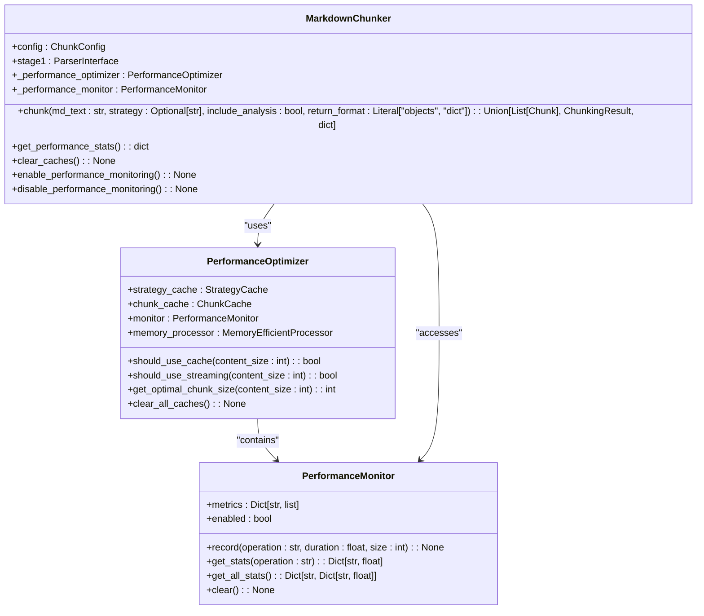

# Performance Monitoring

<cite>
**Referenced Files in This Document**   
- [performance.py](file://markdown_chunker/chunker/performance.py)
- [core.py](file://markdown_chunker/chunker/core.py)
- [test_performance.py](file://tests/chunker/test_performance.py)
</cite>

## Table of Contents
1. [Introduction](#introduction)
2. [Performance Monitoring Overview](#performance-monitoring-overview)
3. [Enabling Performance Monitoring](#enabling-performance-monitoring)
4. [Retrieving Performance Statistics](#retrieving-performance-statistics)
5. [Metrics Dictionary Structure](#metrics-dictionary-structure)
6. [Interpreting Timing Data](#interpreting-timing-data)
7. [Clearing Caches](#clearing-caches)
8. [Common Issues and Troubleshooting](#common-issues-and-troubleshooting)
9. [Code Examples](#code-examples)

## Introduction

The markdown chunker provides built-in performance monitoring features that allow users to track and analyze the efficiency of the chunking process. These features are designed to help identify performance bottlenecks, optimize processing times, and ensure efficient resource utilization when working with Markdown documents of varying sizes and complexities.

The performance monitoring system is built around the `PerformanceMonitor` class, which records metrics for various operations including parsing, strategy selection, chunking, overlap processing, and metadata enrichment. This documentation provides comprehensive guidance on using these features effectively.

**Section sources**
- [core.py](file://markdown_chunker/chunker/core.py#L64-L80)
- [performance.py](file://markdown_chunker/chunker/performance.py#L32-L36)

## Performance Monitoring Overview

The performance monitoring system in the markdown chunker is designed to track key metrics across the entire chunking pipeline. The system uses the `PerformanceMonitor` class to record operation metrics including duration, size, and throughput for various stages of processing.

The monitoring system is integrated throughout the chunking process, automatically tracking performance data for operations such as:
- Parsing and content analysis
- Strategy selection
- Chunk creation
- Overlap processing
- Metadata enrichment

The system is designed to have minimal overhead when disabled, with less than 5% performance impact when enabled, making it suitable for production use.



**Diagram sources**
- [performance.py](file://markdown_chunker/chunker/performance.py#L32-L84)
- [core.py](file://markdown_chunker/chunker/core.py#L123-L126)

## Enabling Performance Monitoring

Performance monitoring can be enabled in two ways: during MarkdownChunker initialization or dynamically during runtime.

### Initialization with Monitoring Enabled

The most straightforward way to enable performance monitoring is to set the `enable_performance_monitoring` parameter to `True` when creating a `MarkdownChunker` instance:

```python
chunker = MarkdownChunker(enable_performance_monitoring=True)
```

This parameter is available in the `__init__` method of the `MarkdownChunker` class and defaults to `False` to minimize overhead when monitoring is not needed.

### Dynamic Monitoring Control

For more granular control, performance monitoring can be toggled on and off during runtime using the `enable_performance_monitoring()` and `disable_performance_monitoring()` methods:

```python
# Enable monitoring
chunker.enable_performance_monitoring()

# Process documents
chunks = chunker.chunk(document)

# Disable monitoring when no longer needed
chunker.disable_performance_monitoring()
```

When monitoring is disabled, the system stops recording metrics, which can be useful for reducing overhead during high-throughput processing when performance data is not required.

**Section sources**
- [core.py](file://markdown_chunker/chunker/core.py#L64-L80)
- [core.py](file://markdown_chunker/chunker/core.py#L711-L717)

## Retrieving Performance Statistics

Once performance monitoring is enabled and documents have been processed, statistics can be retrieved using the `get_performance_stats()` method.

### Getting All Statistics

The `get_performance_stats()` method returns a dictionary containing performance metrics for all tracked operations:

```python
stats = chunker.get_performance_stats()
```

This method returns detailed timing metrics for various operations in the chunking pipeline, including:
- `chunk`: Statistics for the main chunking operation
- `strategy_selection`: Statistics for strategy selection
- `overlap`: Statistics for overlap processing
- `metadata`: Statistics for metadata enrichment

### Operation-Specific Statistics

For more focused analysis, statistics for specific operations can be obtained by accessing the relevant key in the returned dictionary:

```python
# Get statistics for chunking operation
chunk_stats = stats.get('chunk', {})

# Get statistics for strategy selection
strategy_stats = stats.get('strategy_selection', {})
```

The returned statistics are cumulative, representing data collected since the chunker was created or since the last cache clear.

**Section sources**
- [core.py](file://markdown_chunker/chunker/core.py#L661-L705)
- [performance.py](file://markdown_chunker/chunker/performance.py#L75-L77)

## Metrics Dictionary Structure

The performance monitoring system returns statistics in a structured dictionary format that provides comprehensive insights into the performance characteristics of each operation.

### Core Metrics

Each operation's statistics include the following core metrics:

| Metric | Description | Type |
|--------|-------------|------|
| count | Number of times the operation was executed | int |
| total_time | Total time spent in the operation (seconds) | float |
| avg_time | Average time per operation (seconds) | float |
| min_time | Minimum time for a single operation (seconds) | float |
| max_time | Maximum time for a single operation (seconds) | float |

### Size and Throughput Metrics

When size information is available (provided during metric recording), additional metrics are included:

| Metric | Description | Type |
|--------|-------------|------|
| avg_size | Average size of processed data (characters/bytes) | float |
| throughput | Processing throughput (size/time) | float |

The throughput is calculated as the total size divided by the total time, providing a measure of processing efficiency.

### Example Metrics Structure

```python
{
    'chunk': {
        'count': 10,
        'total_time': 2.5,
        'avg_time': 0.25,
        'min_time': 0.1,
        'max_time': 0.8,
        'avg_size': 1500.0,
        'throughput': 600.0
    },
    'strategy_selection': {
        'count': 10,
        'total_time': 0.3,
        'avg_time': 0.03,
        'min_time': 0.01,
        'max_time': 0.1
    }
}
```

**Section sources**
- [performance.py](file://markdown_chunker/chunker/performance.py#L59-L73)
- [test_performance.py](file://tests/chunker/test_performance.py#L77-L84)

## Interpreting Timing Data

The timing data collected by the performance monitoring system provides valuable insights into the efficiency of the chunking process and can help identify potential bottlenecks.

### Key Performance Indicators

#### Average Processing Time
The `avg_time` metric indicates the typical duration of an operation. For the main chunking operation, this should generally be under 1 second for documents up to 100KB in size.

#### Maximum Processing Time
The `max_time` metric helps identify outliers and potential performance issues. If this value is significantly higher than the average time, it may indicate that certain documents are particularly challenging to process.

#### Throughput Analysis
The `throughput` metric (when available) measures how efficiently the system processes data. Higher throughput values indicate more efficient processing. This metric is particularly useful when comparing different configuration settings or document types.

### Operation-Specific Insights

#### Parsing and Strategy Selection
The strategy selection process should typically complete quickly (under 100ms). If this operation is slow, it may indicate issues with the content analysis phase.

#### Chunking Operations
The main chunking operation duration depends on document size and complexity. Simple documents should process quickly, while complex documents with many code blocks, tables, or nested structures may take longer.

#### Overlap Processing
Overlap processing time should be proportional to the number of chunks and the overlap size. Excessive overlap processing time may indicate that the overlap settings need optimization.

#### Metadata Enrichment
Metadata enrichment should be relatively fast. If this operation is slow, it may indicate issues with the metadata extraction logic or particularly complex metadata requirements.

**Section sources**
- [performance.py](file://markdown_chunker/chunker/performance.py#L47-L73)
- [test_performance.py](file://tests/chunker/test_performance.py#L103-L110)

## Clearing Caches

The performance monitoring system includes methods for clearing caches, which can be useful for resetting statistics or freeing memory.

### Clearing Performance Caches

The `clear_caches()` method clears all performance-related caches, including:

- Performance metrics
- Strategy cache
- Chunk result cache

```python
chunker.clear_caches()
```

This method is particularly useful when you want to reset performance statistics for a new batch of documents or when memory usage needs to be reduced.

### Cache Management Strategy

For optimal performance, consider the following cache management strategy:

1. Enable performance monitoring when you need to collect statistics
2. Process a batch of documents
3. Retrieve and analyze performance statistics
4. Clear caches before processing the next batch to prevent unbounded memory growth
5. Repeat as needed

This approach ensures that performance data is collected efficiently while maintaining optimal memory usage.

**Section sources**
- [core.py](file://markdown_chunker/chunker/core.py#L707-L709)
- [performance.py](file://markdown_chunker/chunker/performance.py#L79-L81)

## Common Issues and Troubleshooting

### Missing Metrics When Monitoring is Disabled

The most common issue is attempting to retrieve performance statistics when monitoring is disabled. When performance monitoring is disabled, the `get_performance_stats()` method returns an empty dictionary.

**Solution**: Ensure that performance monitoring is enabled before processing documents:

```python
# Correct approach
chunker = MarkdownChunker(enable_performance_monitoring=True)
# or
chunker.enable_performance_monitoring()

# Process documents
chunks = chunker.chunk(document)

# Retrieve statistics
stats = chunker.get_performance_stats()  # Will contain data
```

### Timestamp Data Handling

The performance monitoring system records timestamps for each metric, but these are primarily for internal use and are not exposed in the public statistics API. The focus is on duration-based metrics rather than absolute timestamps.

### Performance Overhead

While the performance monitoring system is designed to have minimal overhead (<5%), in high-throughput scenarios, even this small overhead may be significant.

**Solution**: Use dynamic monitoring control to enable monitoring only when needed:

```python
# Process documents without monitoring
chunker.disable_performance_monitoring()
for doc in high_volume_docs:
    chunker.chunk(doc)

# Enable monitoring for sampling
chunker.enable_performance_monitoring()
# Process a sample of documents
sample_stats = chunker.get_performance_stats()
```

### Interpreting Throughput Values

The throughput metric is calculated based on the size information provided during metric recording. If size information is not provided, the throughput metric will not be available.

**Solution**: Ensure that size information is provided when recording metrics for throughput calculation:

```python
# When recording metrics with size information
monitor.record("operation", duration, size=len(content))
```

**Section sources**
- [test_performance.py](file://tests/chunker/test_performance.py#L113-L121)
- [core.py](file://markdown_chunker/chunker/core.py#L700-L703)

## Code Examples

### Basic Performance Monitoring

```python
from markdown_chunker import MarkdownChunker

# Enable performance monitoring
chunker = MarkdownChunker(enable_performance_monitoring=True)

# Process a document
document = "# Sample Document\n\nThis is some content."
chunks = chunker.chunk(document)

# Retrieve performance statistics
stats = chunker.get_performance_stats()

# Display key metrics
if 'chunk' in stats:
    chunk_stats = stats['chunk']
    print(f"Average chunk time: {chunk_stats['avg_time']:.3f}s")
    print(f"Total operations: {chunk_stats['count']}")
    print(f"Throughput: {chunk_stats.get('throughput', 0):.1f} chars/sec")
```

### Monitoring Multiple Documents

```python
from markdown_chunker import MarkdownChunker

# Initialize chunker with monitoring enabled
chunker = MarkdownChunker(enable_performance_monitoring=True)

documents = [
    "# Doc 1\n\nContent here.",
    "# Doc 2\n\nMore content.",
    "# Doc 3\n\nEven more content."
]

# Process multiple documents
for doc in documents:
    chunks = chunker.chunk(doc)

# Get comprehensive statistics
stats = chunker.get_performance_stats()

# Analyze results
for operation, op_stats in stats.items():
    print(f"\n{operation.upper()} STATISTICS:")
    print(f"  Count: {op_stats['count']}")
    print(f"  Average time: {op_stats['avg_time']:.3f}s")
    print(f"  Total time: {op_stats['total_time']:.3f}s")
    
    if 'throughput' in op_stats:
        print(f"  Throughput: {op_stats['throughput']:.1f} chars/sec")
```

### Dynamic Monitoring Control

```python
from markdown_chunker import MarkdownChunker

chunker = MarkdownChunker()

# Process initial documents without monitoring
documents = ["# Doc 1\n\nContent.", "# Doc 2\n\nContent."]
for doc in documents:
    chunks = chunker.chunk(doc)

# Enable monitoring for performance analysis
chunker.enable_performance_monitoring()

# Process sample documents with monitoring
sample_docs = ["# Sample 1\n\nContent.", "# Sample 2\n\nContent."]
for doc in sample_docs:
    chunks = chunker.chunk(doc)

# Retrieve and analyze performance data
stats = chunker.get_performance_stats()
print(f"Sample processing time: {stats.get('chunk', {}).get('avg_time', 0):.3f}s")

# Disable monitoring to reduce overhead
chunker.disable_performance_monitoring()

# Continue processing remaining documents
remaining_docs = ["# Doc 3\n\nContent.", "# Doc 4\n\nContent."]
for doc in remaining_docs:
    chunks = chunker.chunk(doc)
```

### Comprehensive Performance Analysis

```python
from markdown_chunker import MarkdownChunker
import json

def analyze_performance():
    """Comprehensive performance analysis example."""
    
    # Initialize with monitoring enabled
    chunker = MarkdownChunker(enable_performance_monitoring=True)
    
    # Test documents of different sizes
    test_docs = {
        'small': "# Small\n\nContent.",
        'medium': "# Medium\n\n" + "Content. " * 100,
        'large': "# Large\n\n" + "Content. " * 1000
    }
    
    # Process documents
    for size, content in test_docs.items():
        print(f"Processing {size} document...")
        chunks = chunker.chunk(content)
        print(f"  Created {len(chunks)} chunks")
    
    # Get performance statistics
    stats = chunker.get_performance_stats()
    
    # Display comprehensive analysis
    print("\n" + "="*50)
    print("PERFORMANCE ANALYSIS RESULTS")
    print("="*50)
    
    for operation, op_stats in stats.items():
        print(f"\n{operation.upper()}:")
        print(f"  Executions: {op_stats['count']}")
        print(f"  Total time: {op_stats['total_time']:.3f}s")
        print(f"  Average time: {op_stats['avg_time']:.3f}s")
        print(f"  Min time: {op_stats['min_time']:.3f}s")
        print(f"  Max time: {op_stats['max_time']:.3f}s")
        
        if 'throughput' in op_stats:
            print(f"  Throughput: {op_stats['throughput']:.1f} chars/sec")
        
        # Identify potential issues
        if op_stats['max_time'] > 1.0:
            print(f"  ⚠️  Warning: Long operation detected ({op_stats['max_time']:.3f}s)")
    
    # Save detailed report
    with open('performance_report.json', 'w') as f:
        json.dump(stats, f, indent=2)
    
    print(f"\nReport saved to performance_report.json")

# Run the analysis
analyze_performance()
```

**Section sources**
- [core.py](file://markdown_chunker/chunker/core.py#L661-L705)
- [test_performance.py](file://tests/chunker/test_performance.py#L309-L329)