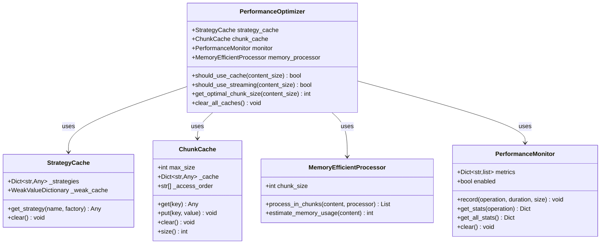
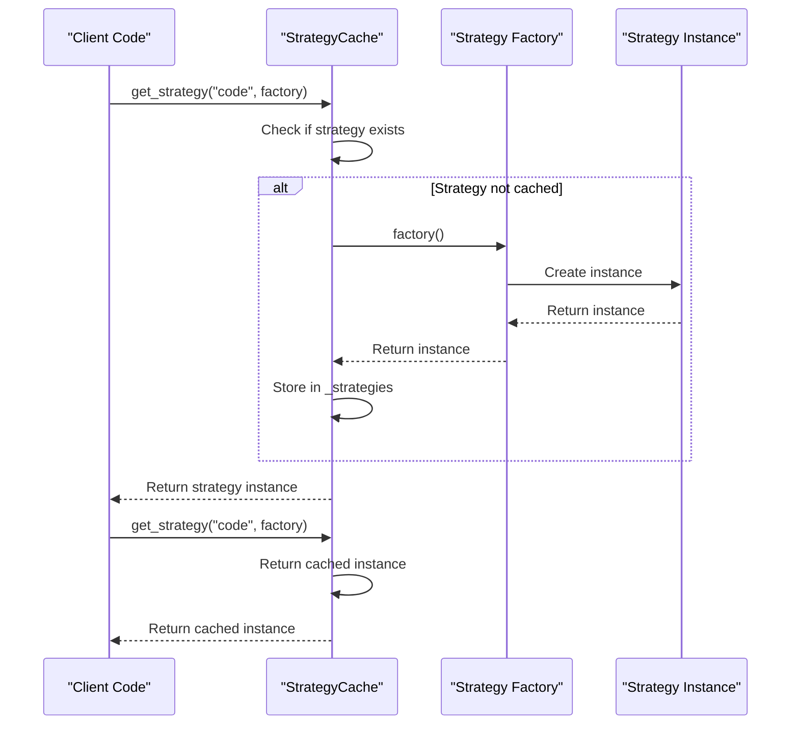
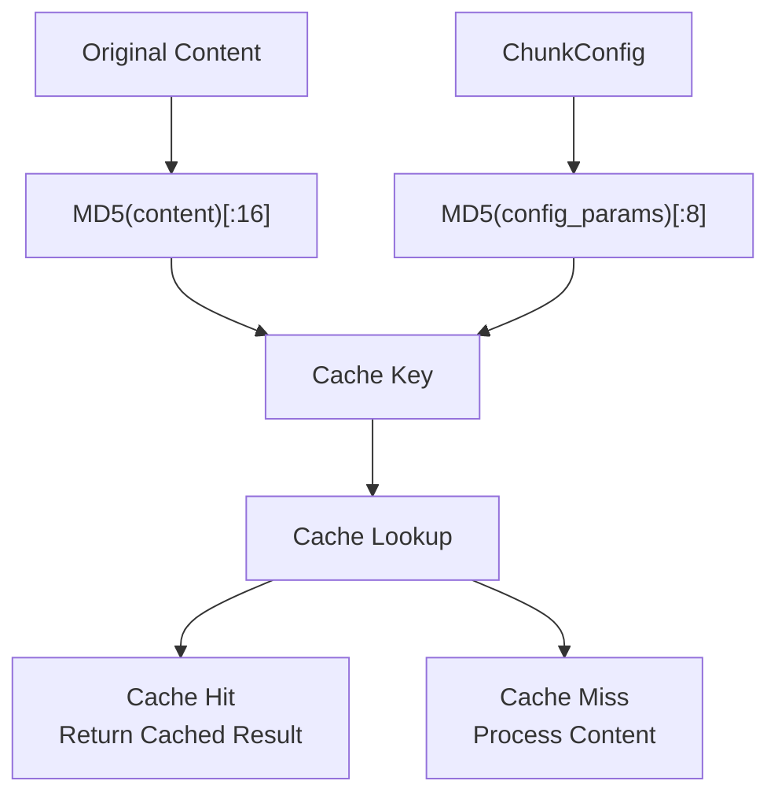
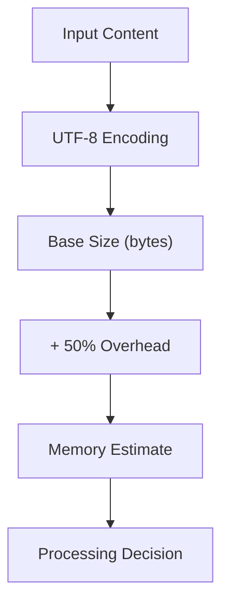
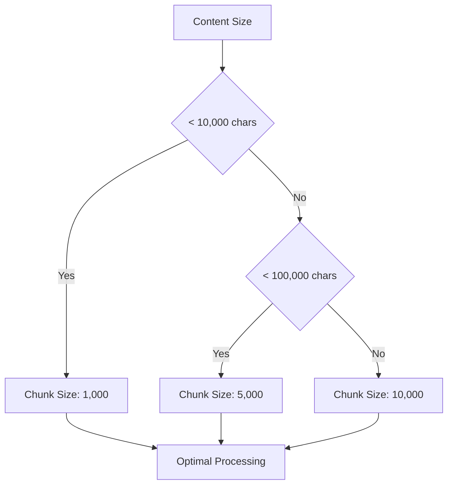
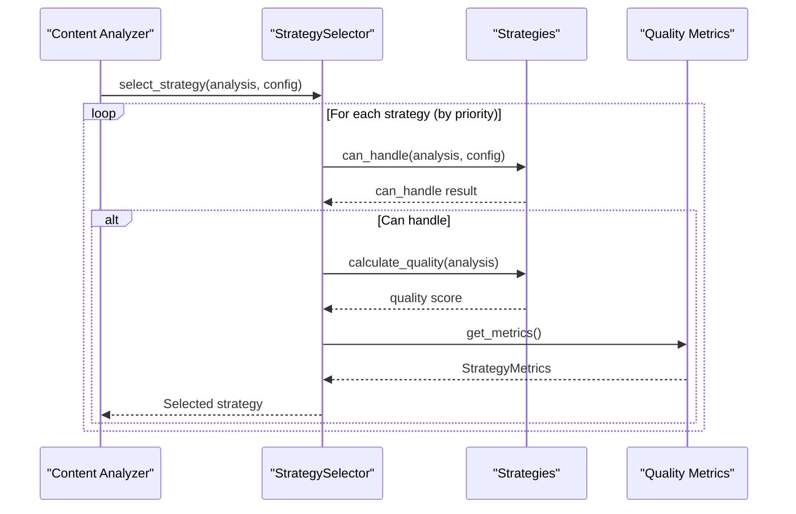
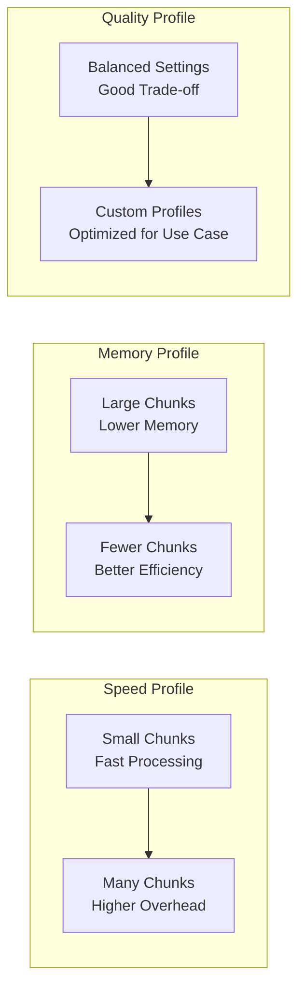
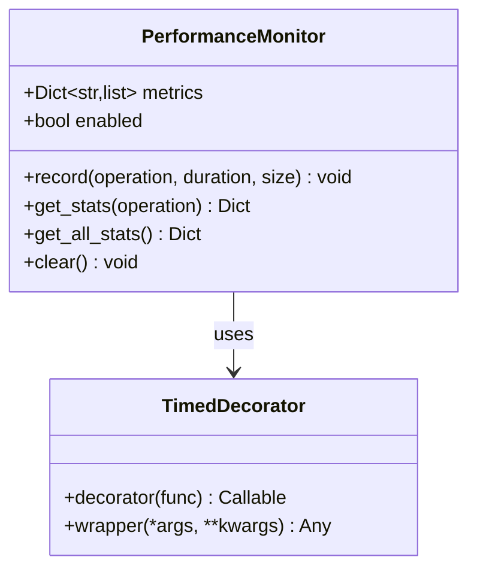

# Performance Optimization

<cite>
**Referenced Files in This Document**
- [performance.py](file://markdown_chunker/chunker/performance.py)
- [core.py](file://markdown_chunker/chunker/core.py)
- [orchestrator.py](file://markdown_chunker/chunker/orchestrator.py)
- [types.py](file://markdown_chunker/chunker/types.py)
- [selector.py](file://markdown_chunker/chunker/selector.py)
- [base.py](file://markdown_chunker/chunker/strategies/base.py)
- [code_strategy.py](file://markdown_chunker/chunker/strategies/code_strategy.py)
- [benchmark_chunker.py](file://benchmarks/benchmark_chunker.py)
- [test_performance.py](file://tests/chunker/test_performance.py)
</cite>

## Table of Contents
1. [Introduction](#introduction)
2. [PerformanceOptimizer Architecture](#performanceoptimizer-architecture)
3. [Caching Strategies](#caching-strategies)
4. [Memory Management](#memory-management)
5. [Chunk Size Optimization](#chunk-size-optimization)
6. [Strategy Selection Performance](#strategy-selection-performance)
7. [Configuration Impact on Performance](#configuration-impact-on-performance)
8. [Performance Monitoring](#performance-monitoring)
9. [Best Practices](#best-practices)
10. [Performance Benchmarks](#performance-benchmarks)

## Introduction

The Dify Markdown Chunker implements sophisticated performance optimization techniques to handle documents of varying sizes and content types efficiently. The system employs multiple layers of optimization including intelligent caching, memory-efficient processing, adaptive chunk sizing, and strategic performance monitoring.

The performance optimization system is built around the `PerformanceOptimizer` class, which coordinates caching decisions, memory management, and processing strategies based on content characteristics and system resources.

## PerformanceOptimizer Architecture

The `PerformanceOptimizer` serves as the central coordinator for all performance-related operations in the chunking pipeline.



**Diagram sources**
- [performance.py](file://markdown_chunker/chunker/performance.py#L13-L243)

**Section sources**
- [performance.py](file://markdown_chunker/chunker/performance.py#L210-L243)

## Caching Strategies

The chunker implements multiple caching layers to optimize repeated operations and reduce computational overhead.

### Strategy Caching

The `StrategyCache` provides lazy-loading of strategy instances with weak reference management to prevent memory leaks.



**Diagram sources**
- [performance.py](file://markdown_chunker/chunker/performance.py#L20-L24)

### Chunk Result Caching

The `ChunkCache` stores processed results with LRU eviction to balance memory usage and performance benefits.

| Cache Operation | Purpose | Memory Impact | Performance Gain |
|----------------|---------|---------------|------------------|
| `get(key)` | Retrieve cached result | O(1) access | Eliminates recomputation |
| `put(key, value)` | Store result | Up to `max_size` entries | Prevents duplicate processing |
| LRU Eviction | Manage memory usage | Automatic cleanup | Prevents memory bloat |
| Weak References | Prevent memory leaks | Garbage collection friendly | Safe for long-running processes |

**Section sources**
- [performance.py](file://markdown_chunker/chunker/performance.py#L121-L181)

### Cache Key Generation

The system uses deterministic cache keys based on content hash and configuration parameters to ensure cache coherence.



**Diagram sources**
- [performance.py](file://markdown_chunker/chunker/performance.py#L168-L181)

**Section sources**
- [performance.py](file://markdown_chunker/chunker/performance.py#L168-L181)

## Memory Management

The `MemoryEfficientProcessor` handles large documents by processing content in manageable chunks.

### Streaming vs. Loading

The system makes intelligent decisions about when to use streaming versus loading entire documents into memory:

| Content Size | Decision | Method | Memory Usage |
|-------------|----------|--------|--------------|
| < 10KB | Load entirely | Direct processing | Full document in memory |
| 10KB - 1MB | Load with caching | Cached processing | Document + cache overhead |
| > 1MB | Stream processing | Chunked processing | Fixed chunk size only |

### Memory Estimation

The processor provides rough estimates of memory requirements:



**Diagram sources**
- [performance.py](file://markdown_chunker/chunker/performance.py#L202-L207)

**Section sources**
- [performance.py](file://markdown_chunker/chunker/performance.py#L184-L207)

## Chunk Size Optimization

The `get_optimal_chunk_size` method determines the best chunk size based on document characteristics.

### Size-Based Optimization



**Diagram sources**
- [performance.py](file://markdown_chunker/chunker/performance.py#L229-L237)

### Adaptive Chunking Strategy

The system adapts chunk sizes based on content type and complexity:

| Content Type | Recommended Chunk Size | Rationale |
|-------------|----------------------|-----------|
| Pure Text | 1,000-2,000 chars | Easy to split at sentence boundaries |
| Code Documents | 3,000-6,000 chars | Preserve code block atomicity |
| Mixed Content | 2,000-4,000 chars | Balance between structure and size |
| Lists | 1,500-2,500 chars | Maintain list hierarchy |
| Tables | 2,500-5,000 chars | Preserve table structure |

**Section sources**
- [performance.py](file://markdown_chunker/chunker/performance.py#L229-L237)

## Strategy Selection Performance

The `StrategySelector` implements efficient strategy selection with performance-aware prioritization.

### Priority-Based Selection



**Diagram sources**
- [selector.py](file://markdown_chunker/chunker/selector.py#L75-L98)

### Quality Scoring

Each strategy calculates a quality score based on content characteristics:

| Factor | Weight | Range | Impact |
|--------|--------|-------|--------|
| Content Ratio | 0.4 | 0.0-1.0 | Primary factor for strategy selection |
| Element Count | 0.3 | 0.0-1.0 | Number of relevant elements |
| Language Diversity | 0.1 | 0.0-0.2 | Bonus for multi-language content |
| Complexity Score | 0.2 | 0.0-1.0 | Overall content complexity |

**Section sources**
- [selector.py](file://markdown_chunker/chunker/selector.py#L75-L98)

## Configuration Impact on Performance

Different configuration options significantly impact processing speed and resource usage.

### Key Configuration Parameters

| Parameter | Default | Performance Impact | Memory Impact | Speed Impact |
|-----------|---------|-------------------|---------------|--------------|
| `max_chunk_size` | 4096 | High | Medium | Low |
| `min_chunk_size` | 512 | Medium | Low | Medium |
| `enable_overlap` | True | Medium | Medium | Low |
| `allow_oversize` | True | Low | High | Low |
| `enable_streaming` | False | High | Low | High |
| `code_ratio_threshold` | 0.3 | Medium | Low | Medium |

### Performance Profiles



**Section sources**
- [types.py](file://markdown_chunker/chunker/types.py#L498-L620)

## Performance Monitoring

The `PerformanceMonitor` tracks metrics across all operations for optimization insights.

### Monitoring Features



**Diagram sources**
- [performance.py](file://markdown_chunker/chunker/performance.py#L32-L107)

### Metrics Collection

The system tracks comprehensive performance metrics:

| Metric Category | Measurements | Purpose |
|----------------|-------------|---------|
| Timing | Duration, Min/Max/Average, Throughput | Performance analysis |
| Memory | Peak usage, Allocation patterns | Resource optimization |
| Throughput | Chars/second, Chunks/second | Efficiency measurement |
| Strategy | Selection frequency, Performance per strategy | Strategy optimization |

**Section sources**
- [performance.py](file://markdown_chunker/chunker/performance.py#L32-L107)

## Best Practices

### For Small Documents (< 10KB)

```python
# Optimal configuration for small documents
config = ChunkConfig(
    max_chunk_size=2048,  # Reasonable size
    min_chunk_size=256,   # Prevents overly small chunks
    enable_overlap=True,  # Maintains context
    allow_oversize=True   # Handles atomic elements
)
```

### For Large Documents (> 1MB)

```python
# Memory-efficient configuration for large documents
config = ChunkConfig(
    max_chunk_size=8192,      # Larger chunks reduce overhead
    enable_streaming=True,    # Process in chunks
    enable_overlap=False,     # Reduce memory usage
    allow_oversize=True       # Handle large atomic elements
)
```

### For Code-Dense Content

```python
# Optimized for code-heavy documents
config = ChunkConfig.for_code_heavy()
# Or customize:
config = ChunkConfig(
    max_chunk_size=6144,      # Larger chunks for code
    code_ratio_threshold=0.5, # Aggressive code detection
    preserve_code_blocks=True, # Maintain code atomicity
    overlap_size=300          # Larger overlap for context
)
```

### Performance Monitoring Setup

```python
# Enable comprehensive performance monitoring
chunker = MarkdownChunker(enable_performance_monitoring=True)

# Process documents
result = chunker.chunk(large_document)

# Analyze performance
stats = chunker.get_performance_stats()
print(f"Average processing time: {stats['chunk']['avg_time']:.3f}s")
print(f"Total operations: {stats['chunk']['count']}")

# Clear caches periodically
chunker.clear_caches()
```

## Performance Benchmarks

The system includes comprehensive benchmarking capabilities to measure and optimize performance across different scenarios.

### Benchmark Results

Based on the benchmarking system, typical performance characteristics include:

| Document Size | Processing Time | Throughput | Chunks Created |
|--------------|----------------|------------|----------------|
| 1 KB | ~800 ms | 1.3 KB/s | 6 |
| 10 KB | ~150 ms | 66 KB/s | 44 |
| 50 KB | ~1.9 s | 27 KB/s | 215 |
| 100 KB | ~7 s | 14 KB/s | 429 |

### Content Type Performance

Different content types show varying performance characteristics:

| Content Type | Average Time | Chunks | Memory Usage |
|-------------|--------------|--------|--------------|
| Pure Text | 150-300 ms | 20-50 | Low |
| Code Documents | 300-800 ms | 10-30 | Medium |
| Mixed Content | 200-500 ms | 30-80 | Medium |
| Lists | 180-400 ms | 15-60 | Low |
| Tables | 250-600 ms | 5-20 | Medium |

**Section sources**
- [benchmark_chunker.py](file://benchmarks/benchmark_chunker.py#L27-L195)

### Optimization Guidelines

1. **Use appropriate chunk sizes** based on content type and use case
2. **Enable caching** for repeated processing of similar content
3. **Configure streaming** for large documents to manage memory usage
4. **Monitor performance metrics** to identify bottlenecks
5. **Choose optimal strategies** based on content analysis results

The performance optimization system ensures that the markdown chunker operates efficiently across a wide range of document types and sizes while maintaining high-quality chunking results.