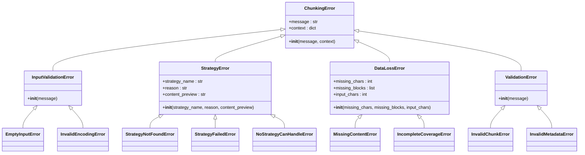
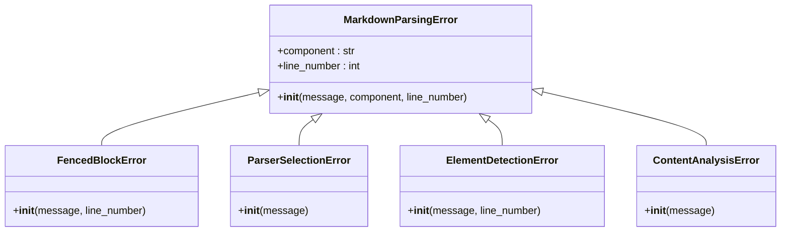
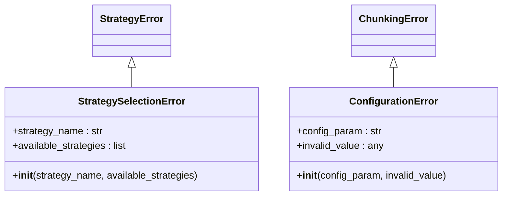
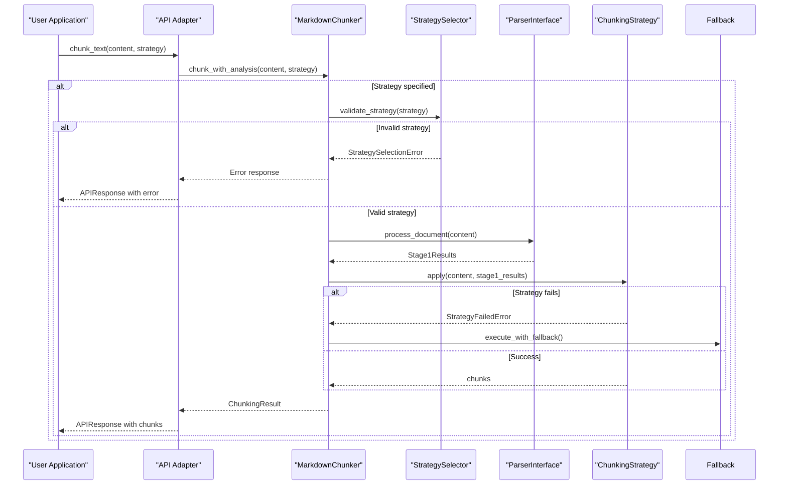
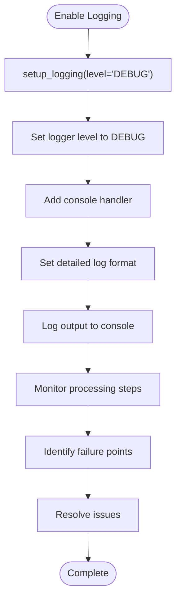
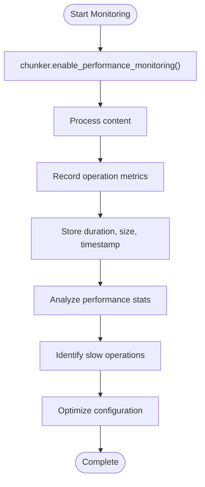
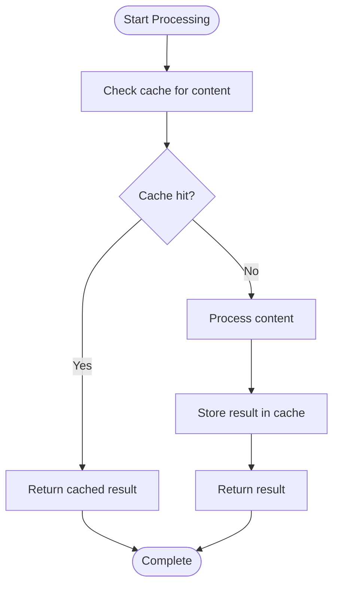
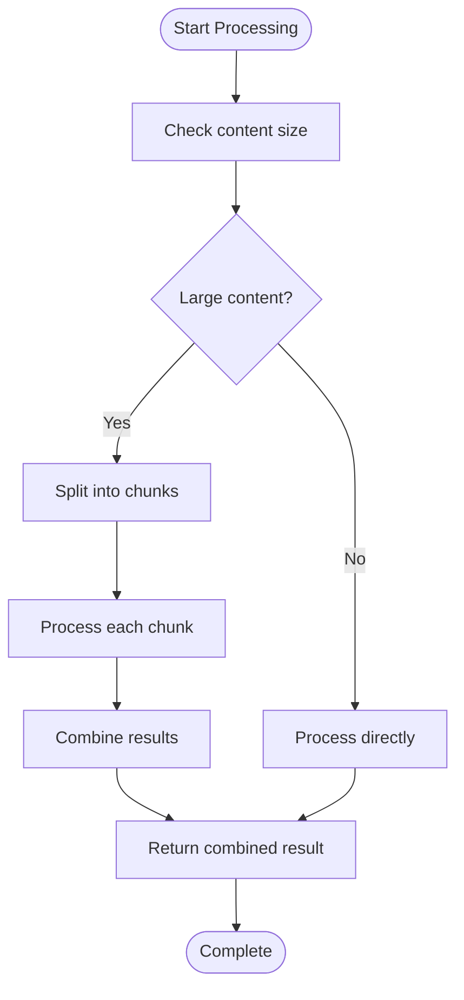
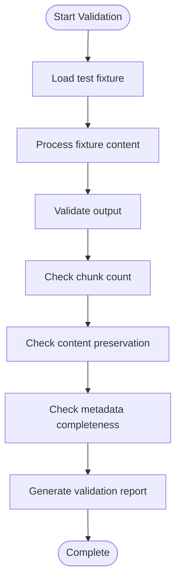
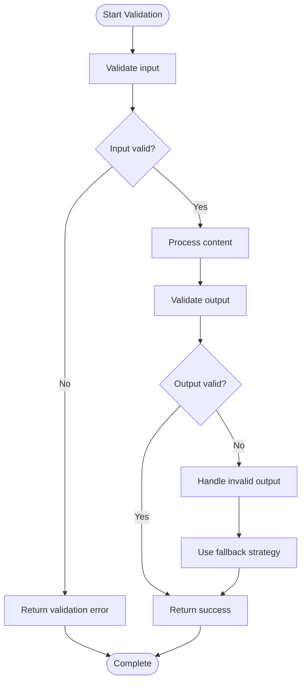

# Troubleshooting

<cite>
**Referenced Files in This Document**   
- [markdown_chunker/chunker/errors.py](file://markdown_chunker/chunker/errors.py)
- [markdown_chunker/api/error_handler.py](file://markdown_chunker/api/error_handler.py)
- [markdown_chunker/parser/errors.py](file://markdown_chunker/parser/errors.py)
- [markdown_chunker/logging_config.py](file://markdown_chunker/logging_config.py)
- [markdown_chunker/chunker/performance.py](file://markdown_chunker/chunker/performance.py)
- [markdown_chunker/chunker/validator.py](file://markdown_chunker/chunker/validator.py)
- [markdown_chunker/chunker/selector.py](file://markdown_chunker/chunker/selector.py)
- [markdown_chunker/chunker/orchestrator.py](file://markdown_chunker/chunker/orchestrator.py)
</cite>

## Table of Contents
1. [Introduction](#introduction)
2. [Error Types and Meanings](#error-types-and-meanings)
3. [Interpreting Error Messages and Stack Traces](#interpreting-error-messages-and-stack-traces)
4. [Common Issues and Solutions](#common-issues-and-solutions)
5. [Debugging Strategies](#debugging-strategies)
6. [Configuration-Related Problems](#configuration-related-problems)
7. [Performance Optimization](#performance-optimization)
8. [Testing and Validation](#testing-and-validation)
9. [Conclusion](#conclusion)

## Introduction

This troubleshooting guide provides practical solutions for common issues encountered when using the Markdown Chunker library. The guide covers error types, diagnostic procedures, and remediation steps for various scenarios including parsing errors, strategy selection failures, validation violations, and performance bottlenecks. By following the diagnostic steps and solutions outlined in this document, users can effectively identify and resolve issues in their markdown chunking workflows.

**Section sources**
- [markdown_chunker/chunker/errors.py](file://markdown_chunker/chunker/errors.py)
- [markdown_chunker/api/error_handler.py](file://markdown_chunker/api/error_handler.py)

## Error Types and Meanings

The Markdown Chunker library implements a comprehensive error hierarchy to provide clear and specific error information. Understanding these error types is essential for effective troubleshooting.

### Chunking Error Hierarchy

The error system is organized into a hierarchical structure with specific error types that inherit from base classes. This allows for both specific error handling and broader exception catching.



**Diagram sources **
- [markdown_chunker/chunker/errors.py](file://markdown_chunker/chunker/errors.py#L11-L210)

### Parsing Errors

Parsing errors occur during the initial processing of markdown content. These errors are typically related to input validation and syntax issues.



**Diagram sources **
- [markdown_chunker/parser/errors.py](file://markdown_chunker/parser/errors.py#L51-L92)

### Strategy Selection Errors

Strategy selection errors occur when the system cannot determine or apply an appropriate chunking strategy for the given content.



**Diagram sources **
- [markdown_chunker/chunker/errors.py](file://markdown_chunker/chunker/errors.py#L48-L109)
- [markdown_chunker/chunker/selector.py](file://markdown_chunker/chunker/selector.py)

## Interpreting Error Messages and Stack Traces

Understanding how to interpret error messages and stack traces is crucial for effective debugging. The Markdown Chunker library provides detailed error information that can help pinpoint the source of issues.

### Error Message Structure

Error messages in the Markdown Chunker library follow a consistent structure that includes the error type, message, and context information. When an error occurs, the message typically includes:

- Error type (e.g., StrategyNotFoundError, DataLossError)
- Specific error message describing the issue
- Context information such as strategy name, content preview, or line numbers
- Available strategies (for strategy-related errors)
- Missing fields or blocks (for validation errors)

For example, a StrategyNotFoundError will include the requested strategy name and a list of available strategies, helping users identify valid options.

**Section sources**
- [markdown_chunker/chunker/errors.py](file://markdown_chunker/chunker/errors.py#L72-L82)
- [markdown_chunker/api/error_handler.py](file://markdown_chunker/api/error_handler.py#L65-L79)

### Stack Trace Analysis

Stack traces provide a detailed view of the call hierarchy when an error occurs. In the Markdown Chunker library, stack traces can help identify:

1. The entry point of the chunking operation
2. The strategy selection process
3. The parsing stage (Stage 1)
4. The chunking stage (Stage 2)
5. Any validation or post-processing steps

When analyzing stack traces, pay attention to:
- The sequence of method calls leading to the error
- The specific line numbers where exceptions are raised
- The context passed between methods
- Any recursive calls that might indicate infinite loops

The API error handler includes functionality to include stack traces in error details when configured to do so, providing additional debugging information.



**Diagram sources **
- [markdown_chunker/api/error_handler.py](file://markdown_chunker/api/error_handler.py#L35-L63)
- [markdown_chunker/chunker/orchestrator.py](file://markdown_chunker/chunker/orchestrator.py)
- [markdown_chunker/chunker/selector.py](file://markdown_chunker/chunker/selector.py)

## Common Issues and Solutions

This section addresses frequent problems encountered when using the Markdown Chunker library, providing diagnostic steps and remediation procedures.

### Empty Chunks

Empty chunks can occur when the chunking process fails to extract meaningful content from the input. This issue typically stems from:

1. **Empty or whitespace-only input**: The input contains no substantive content.
2. **Parsing failures**: The markdown parser cannot extract content due to syntax errors.
3. **Strategy incompatibility**: The selected strategy cannot handle the content structure.

**Diagnostic Steps:**
1. Verify the input contains non-whitespace content
2. Check for parsing errors in the logs
3. Test with different strategies to identify compatibility issues

**Remediation Procedures:**
- Ensure input contains valid markdown content
- Use the `chunk_with_analysis` method to get detailed error information
- Try alternative strategies or allow automatic selection
- Implement input validation before chunking

```python
# Example: Checking for empty input
if not content or content.isspace():
    raise EmptyInputError("Input is empty or whitespace-only")
```

**Section sources**
- [markdown_chunker/chunker/errors.py](file://markdown_chunker/chunker/errors.py#L33-L38)
- [markdown_chunker/chunker/validator.py](file://markdown_chunker/chunker/validator.py)

### Lost Code Blocks

Code blocks may be lost during chunking due to improper handling of fenced code sections. This issue commonly occurs when:

1. **Malformed code fences**: Unclosed or improperly formatted code blocks
2. **Nested fences**: Code blocks within other block elements
3. **Mixed fence lengths**: Inconsistent backtick counts in opening and closing fences

**Diagnostic Steps:**
1. Examine the input for malformed code blocks
2. Check if code blocks are properly closed
3. Verify fence consistency (backtick count)
4. Review parsing error logs for fence-related issues

**Remediation Procedures:**
- Ensure all code blocks are properly closed
- Use consistent fence lengths (typically 3 backticks)
- Validate markdown syntax before chunking
- Use the parser's error collector to identify fence issues

```python
# Example: Using error collector to detect fence issues
from markdown_chunker.parser.errors import get_error_collector

collector = get_error_collector()
# Process document
# Check for fence-related errors
if collector.has_errors():
    for error in collector.get_errors():
        if "fence" in error.message.lower():
            print(f"Fence issue detected: {error}")
```

**Section sources**
- [markdown_chunker/parser/errors.py](file://markdown_chunker/parser/errors.py#L65-L70)
- [markdown_chunker/parser/fence_handler.py](file://markdown_chunker/parser/fence_handler.py)

### Incorrect Header Paths

Header paths may be incorrect when the hierarchical structure of headers is not properly preserved during chunking. This issue arises from:

1. **Header nesting errors**: Improper detection of header hierarchy
2. **Chunk boundaries**: Headers split across chunk boundaries
3. **Metadata preservation**: Header path information not maintained in chunk metadata

**Diagnostic Steps:**
1. Verify header structure in the original document
2. Check chunk metadata for header_path field
3. Examine chunk boundaries near headers
4. Test with different chunking strategies

**Remediation Procedures:**
- Use strategies that preserve document structure (e.g., structural strategy)
- Adjust chunk size to accommodate header sections
- Enable overlap to maintain context around headers
- Validate header path preservation in chunk metadata

```python
# Example: Checking header path in chunk metadata
for chunk in chunks:
    if 'header_path' in chunk.metadata:
        print(f"Chunk header path: {chunk.metadata['header_path']}")
    else:
        print("Header path not preserved")
```

**Section sources**
- [markdown_chunker/chunker/section_builder.py](file://markdown_chunker/chunker/section_builder.py)
- [markdown_chunker/chunker/types.py](file://markdown_chunker/chunker/types.py)

### Performance Bottlenecks

Performance issues can occur when processing large documents or complex markdown structures. Common causes include:

1. **Large document size**: Processing very large markdown files
2. **Complex nesting**: Deeply nested lists, code blocks, or tables
3. **Inefficient strategies**: Using inappropriate chunking strategies for the content type
4. **Memory constraints**: Insufficient memory for processing

**Diagnostic Steps:**
1. Measure processing time for different document sizes
2. Monitor memory usage during chunking
3. Identify slow processing stages (parsing vs. chunking)
4. Check for repeated processing of the same content

**Remediation Procedures:**
- Use appropriate chunking strategies for the content type
- Implement caching for frequently processed documents
- Process large documents in smaller segments
- Optimize configuration parameters (chunk size, overlap)
- Enable performance monitoring to identify bottlenecks

```python
# Example: Enabling performance monitoring
chunker.enable_performance_monitoring()
result = chunker.chunk_with_analysis(large_content)
stats = chunker.get_performance_stats()
print(f"Processing time: {stats.get('total_time', 0):.3f}s")
```

**Section sources**
- [markdown_chunker/chunker/performance.py](file://markdown_chunker/chunker/performance.py)
- [markdown_chunker/chunker/orchestrator.py](file://markdown_chunker/chunker/orchestrator.py)

## Debugging Strategies

Effective debugging requires a systematic approach to isolate and resolve issues. This section outlines proven debugging techniques for the Markdown Chunker library.

### Enabling Verbose Logging

Verbose logging provides detailed information about the chunking process, helping to identify issues at various stages.



To enable verbose logging:

```python
from markdown_chunker.logging_config import setup_logging

# Enable debug logging
logger = setup_logging(level="DEBUG")

# Now chunking operations will output detailed logs
chunker = MarkdownChunker()
chunks = chunker.chunk("# Test\n\nContent")
```

The logging configuration supports various levels (DEBUG, INFO, WARNING, ERROR, CRITICAL) and custom formats to suit different debugging needs.

**Section sources**
- [markdown_chunker/logging_config.py](file://markdown_chunker/logging_config.py)
- [markdown_chunker/chunker/orchestrator.py](file://markdown_chunker/chunker/orchestrator.py)

### Using the Performance Monitor

The performance monitor tracks processing metrics to identify bottlenecks and optimize performance.



To use the performance monitor:

```python
# Enable performance monitoring
chunker.enable_performance_monitoring()

# Process content
result = chunker.chunk_with_analysis(content)

# Get performance statistics
stats = chunker.get_performance_stats()
print(f"Total processing time: {stats.get('total_time', 0):.3f}s")

# Clear metrics for next operation
chunker.clear_performance_stats()
```

The performance monitor tracks metrics for various operations including parsing, strategy application, and validation, providing insights into processing efficiency.

**Section sources**
- [markdown_chunker/chunker/performance.py](file://markdown_chunker/chunker/performance.py#L32-L83)
- [markdown_chunker/chunker/orchestrator.py](file://markdown_chunker/chunker/orchestrator.py)

### Isolating Issues with Minimal Examples

Creating minimal examples helps isolate specific issues by eliminating confounding factors.

**Steps to create a minimal example:**
1. Start with the smallest possible input that reproduces the issue
2. Remove unrelated content while preserving the problematic structure
3. Test with default configuration to eliminate configuration issues
4. Gradually add complexity to identify the specific cause

```python
# Example: Minimal example for strategy selection error
from markdown_chunker import MarkdownChunker

# Minimal input that reproduces the issue
minimal_content = """# Header\n\nContent."""

# Test with specific strategy
chunker = MarkdownChunker()
try:
    chunks = chunker.chunk(minimal_content, strategy="invalid_strategy")
except Exception as e:
    print(f"Error: {type(e).__name__}: {str(e)}")
```

Minimal examples are particularly useful for:
- Reporting bugs to the development team
- Testing fixes for specific issues
- Understanding the boundaries of strategy capabilities
- Validating configuration changes

**Section sources**
- [markdown_chunker/chunker/orchestrator.py](file://markdown_chunker/chunker/orchestrator.py)
- [markdown_chunker/chunker/selector.py](file://markdown_chunker/chunker/selector.py)

## Configuration-Related Problems

Configuration issues can lead to unexpected behavior and processing failures. This section addresses common configuration problems and their solutions.

### Invalid Configuration Parameters

Invalid configuration parameters can cause chunking failures or suboptimal results. Common issues include:

1. **Invalid chunk sizes**: max_chunk_size less than min_chunk_size
2. **Negative values**: Negative values for size or overlap parameters
3. **Invalid strategy names**: Misspelled or non-existent strategy names
4. **Incompatible settings**: Conflicting configuration options

**Diagnostic Steps:**
1. Validate configuration parameters before use
2. Check for configuration-related error messages
3. Test with default configuration as baseline
4. Verify parameter types and value ranges

**Remediation Procedures:**
- Use configuration validation methods
- Implement error handling for invalid configurations
- Provide clear error messages for invalid parameters
- Use configuration profiles for common use cases

```python
# Example: Configuration validation
from markdown_chunker.chunker.types import ChunkConfig

try:
    config = ChunkConfig(
        max_chunk_size=1000,
        min_chunk_size=2000,  # Invalid: min > max
        enable_overlap=True
    )
except ValueError as e:
    print(f"Configuration error: {e}")
```

**Section sources**
- [markdown_chunker/chunker/types.py](file://markdown_chunker/chunker/types.py)
- [markdown_chunker/chunker/validator.py](file://markdown_chunker/chunker/validator.py)

### Strategy Selection Surprises

Unexpected strategy selection can occur due to content analysis misclassification or configuration issues.

**Common causes:**
1. **Content analysis inaccuracies**: Misclassification of content type
2. **Threshold configuration**: Strategy selection thresholds not properly set
3. **Strategy priority**: Unexpected strategy priority ordering
4. **Fallback behavior**: Unanticipated fallback to alternative strategies

**Diagnostic Steps:**
1. Examine content analysis results
2. Check strategy selection logic
3. Review configuration thresholds
4. Test with explicit strategy selection

**Remediation Procedures:**
- Use `chunk_with_analysis` to inspect content analysis
- Adjust strategy selection thresholds in configuration
- Explicitly specify strategy when needed
- Understand fallback hierarchy and behavior

```python
# Example: Inspecting content analysis
result = chunker.chunk_with_analysis(content)
print(f"Content type: {result.content_type}")
print(f"Code ratio: {result.code_ratio:.2f}")
print(f"Strategy used: {result.strategy_used}")
if result.fallback_used:
    print(f"Fallback used at level {result.fallback_level}")
```

**Section sources**
- [markdown_chunker/chunker/selector.py](file://markdown_chunker/chunker/selector.py)
- [markdown_chunker/chunker/analyzer.py](file://markdown_chunker/chunker/analyzer.py)

## Performance Optimization

Optimizing performance is crucial for processing large volumes of markdown content efficiently. This section covers strategies for improving processing speed and resource utilization.

### Caching Strategies

Caching can significantly improve performance for frequently processed content.



The Markdown Chunker implements multiple caching layers:
- **Strategy cache**: Caches strategy instances
- **Chunk cache**: Caches chunking results
- **Sentence cache**: Caches sentence splitting results

To manage caching:

```python
# Clear all caches
chunker.clear_caches()

# Or clear specific caches
chunker._performance_optimizer.chunk_cache.clear()
chunker._performance_optimizer.strategy_cache.clear()
```

**Section sources**
- [markdown_chunker/chunker/performance.py](file://markdown_chunker/chunker/performance.py#L13-L167)
- [markdown_chunker/chunker/orchestrator.py](file://markdown_chunker/chunker/orchestrator.py)

### Memory-Efficient Processing

For large documents, memory-efficient processing techniques can prevent memory exhaustion.



The MemoryEfficientProcessor class handles large documents by:

1. Splitting content into manageable chunks
2. Processing each chunk separately
3. Combining results into a unified output

```python
# Example: Processing large document
processor = MemoryEfficientProcessor(chunk_size=10000)
results = processor.process_in_chunks(large_content, chunker.chunk)
```

**Section sources**
- [markdown_chunker/chunker/performance.py](file://markdown_chunker/chunker/performance.py#L184-L208)
- [markdown_chunker/chunker/orchestrator.py](file://markdown_chunker/chunker/orchestrator.py)

## Testing and Validation

Comprehensive testing and validation ensure the reliability and correctness of the chunking process.

### Using Test Fixtures

Test fixtures provide examples of edge cases and common issues for validation.



Available test fixtures include:
- `edge_cases.md`: Tests edge cases like empty sections and malformed elements
- `code_heavy.md`: Tests code-focused content with multiple code blocks
- `list_heavy.md`: Tests list-heavy content with nested lists
- `unclosed_fence.md`: Tests malformed code fences
- `nested_fences.md`: Tests nested code fences

```python
# Example: Using test fixtures for validation
import os

fixture_path = "tests/fixtures/edge_cases.md"
with open(fixture_path, 'r') as f:
    content = f.read()

result = chunker.chunk_with_analysis(content)
print(f"Processed {len(result.chunks)} chunks")
print(f"Errors: {len(result.errors)}")
```

**Section sources**
- [tests/fixtures/edge_cases.md](file://tests/fixtures/edge_cases.md)
- [tests/fixtures/code_heavy.md](file://tests/fixtures/code_heavy.md)
- [tests/fixtures/list_heavy.md](file://tests/fixtures/list_heavy.md)

### Validation Error Handling

Proper validation ensures data integrity and prevents processing errors.



Validation checks include:
- Input type and encoding
- Content size limits
- Markdown syntax validity
- Chunk content preservation
- Metadata completeness
- Line coverage completeness

```python
# Example: Comprehensive validation
from markdown_chunker.chunker.validator import validate_chunking_result

result = chunker.chunk_with_analysis(content)
validation_errors = validate_chunking_result(result)

if validation_errors:
    for error in validation_errors:
        print(f"Validation error: {error}")
else:
    print("Validation passed")
```

**Section sources**
- [markdown_chunker/chunker/validator.py](file://markdown_chunker/chunker/validator.py)
- [markdown_chunker/chunker/errors.py](file://markdown_chunker/chunker/errors.py)

## Conclusion

This troubleshooting guide has provided a comprehensive overview of common issues encountered when using the Markdown Chunker library and their solutions. By understanding the error hierarchy, interpreting error messages, and applying the diagnostic steps and remediation procedures outlined in this document, users can effectively resolve issues in their markdown chunking workflows.

Key takeaways include:
- Understanding the structured error hierarchy for precise error handling
- Using verbose logging and performance monitoring for detailed diagnostics
- Creating minimal examples to isolate specific issues
- Properly configuring chunking parameters and strategies
- Optimizing performance through caching and memory-efficient processing
- Validating results with test fixtures and comprehensive validation

By following these guidelines, users can ensure reliable and efficient markdown chunking for their applications.