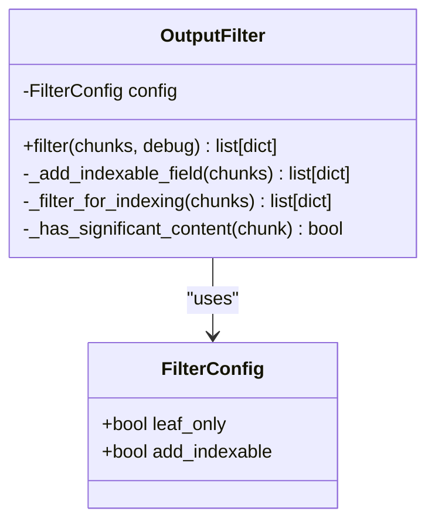
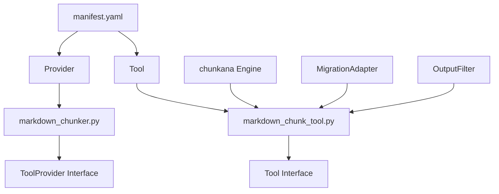
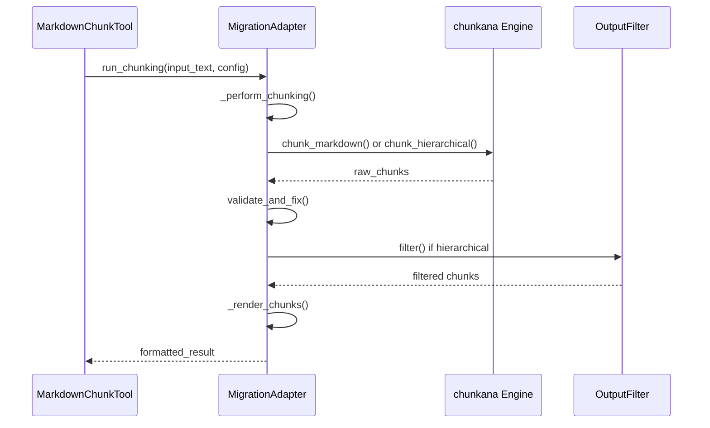
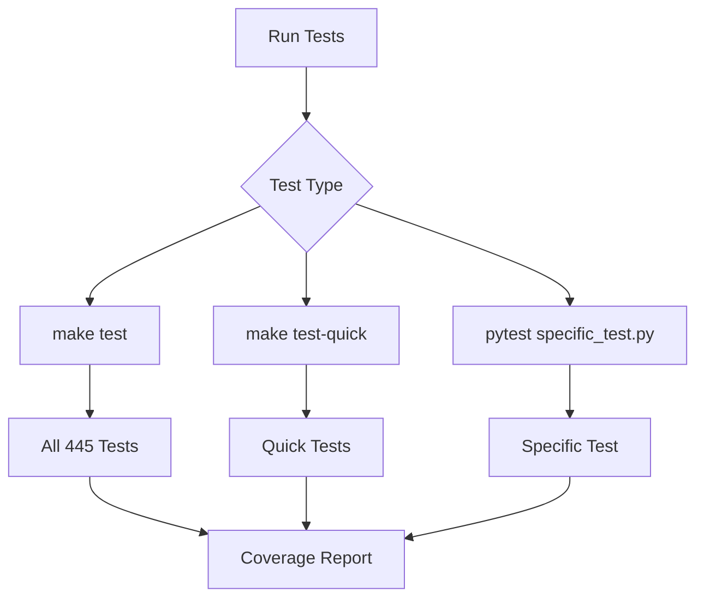

# Developer Workflows

<cite>
**Referenced Files in This Document**   
- [DEVELOPMENT.md](file://DEVELOPMENT.md)
- [CONTRIBUTING.md](file://CONTRIBUTING.md)
- [adapter.py](file://adapter.py)
- [output_filter.py](file://output_filter.py)
- [main.py](file://main.py)
- [provider/markdown_chunker.py](file://provider/markdown_chunker.py)
- [tools/markdown_chunk_tool.py](file://tools/markdown_chunk_tool.py)
- [manifest.yaml](file://manifest.yaml)
- [provider/markdown_chunker.yaml](file://provider/markdown_chunker.yaml)
- [tools/markdown_chunk_tool.yaml](file://tools/markdown_chunk_tool.yaml)
</cite>

## Table of Contents
1. [Development Setup](#development-setup)
2. [Local Development Environment Configuration](#local-development-environment-configuration)
3. [Contribution Process](#contribution-process)
4. [Extension Points](#extension-points)
5. [Plugin Architecture for Dify Integration](#plugin-architecture-for-dify-integration)
6. [Core Functionality Extension via adapter.py](#core-functionality-extension-via-adapterpy)
7. [Testing Framework Integration](#testing-framework-integration)
8. [Debugging Techniques and Logging Setup](#debugging-techniques-and-logging-setup)
9. [Code Organization Principles](#code-organization-principles)
10. [Best Practices](#best-practices)

## Development Setup

The development setup for dify-markdown-chunker-1 follows a standardized process to ensure consistency across environments. The repository requires Python 3.12+ and the dify-plugin CLI for packaging. Developers should clone the repository, create a virtual environment, and install dependencies using pip. The dify-plugin CLI must be installed separately and verified for proper functionality.

**Section sources**
- [DEVELOPMENT.md](file://DEVELOPMENT.md#L1-L419)

## Local Development Environment Configuration

Configuring the local development environment involves several key steps. After cloning the repository, developers must create a virtual environment using Python 3.12 and activate it. Dependencies are installed via `pip install -r requirements.txt`. The dify-plugin CLI is installed using a curl command that downloads the latest release for Linux/Mac systems. Verification of the installation is performed by checking the CLI version. The `.env.example` file should be copied to `.env` for debug mode configuration when needed.

**Section sources**
- [DEVELOPMENT.md](file://DEVELOPMENT.md#L1-L419)
- [.env.example](file://.env.example)

## Contribution Process

The contribution process is designed to maintain code quality and consistency. Contributors must fork the repository, create a feature branch, and follow the development workflow. All changes require corresponding tests, and the full test suite must pass before submission. Code formatting is enforced through the `make format` command, and linting is performed using `make lint`. Documentation updates are required for new features, including updates to README.md and CHANGELOG.md. Pull requests must include a clear description, reference to related issues, and test results. The commit message format follows a structured convention with specific types such as `feat`, `fix`, `docs`, `style`, `refactor`, `test`, and `chore`.

**Section sources**
- [CONTRIBUTING.md](file://CONTRIBUTING.md#L1-L196)

## Extension Points

The dify-markdown-chunker-1 provides several extension points for customization. Custom chunking strategies can be implemented by modifying the strategy parameter in the tool configuration. Parser modifications can be achieved by extending the underlying chunkana engine's parsing capabilities. Output filtering is controlled through the `output_filter.py` module, which allows for hierarchical output filtering based on the `leaf_only` and `add_indexable` configuration options. The `FilterConfig` class provides configuration for output filtering, while the `OutputFilter` class implements the filtering logic. The filtering process adds an indexable field to metadata and excludes root chunks by default.

**Diagram sources**
- [output_filter.py](file://output_filter.py#L12-L116)

**Section sources**
- [output_filter.py](file://output_filter.py#L1-L116)
- [adapter.py](file://adapter.py#L37-L38)

## Plugin Architecture for Dify Integration

The plugin architecture is designed for seamless integration with the Dify platform. The plugin is structured with a manifest.yaml file that defines metadata, version, author, name, labels, description, icon, privacy policy, resource requirements, permissions, and plugin tools. The provider directory contains the markdown_chunker.py file, which implements the ToolProvider interface without requiring credentials since chunking is a local operation. The tools directory contains the markdown_chunk_tool.py file, which implements the Tool interface for chunking Markdown documents. The YAML configuration files define the tool parameters, input validation, and output schema.

**Diagram sources**
- [manifest.yaml](file://manifest.yaml#L1-L49)
- [provider/markdown_chunker.py](file://provider/markdown_chunker.py#L1-L36)
- [tools/markdown_chunk_tool.py](file://tools/markdown_chunk_tool.py#L1-L126)

**Section sources**
- [manifest.yaml](file://manifest.yaml#L1-L49)
- [provider/markdown_chunker.yaml](file://provider/markdown_chunker.yaml#L1-L23)
- [tools/markdown_chunk_tool.yaml](file://tools/markdown_chunk_tool.yaml#L1-L178)

## Core Functionality Extension via adapter.py

The adapter.py file implements the MigrationAdapter class, which provides a compatibility layer between the plugin's tool interface and the chunkana engine. This adapter ensures exact behavioral compatibility while leveraging the advanced chunking capabilities of the chunkana engine. The adapter follows a two-stage processing model: chunking (boundary-invariant) and rendering (formatting). The chunking stage is independent of output format, while the rendering stage handles metadata embedding and formatting. The adapter supports hierarchical chunking with configurable filtering and maintains backward compatibility with legacy plugin behavior.

**Diagram sources**
- [adapter.py](file://adapter.py#L43-L352)
- [tools/markdown_chunk_tool.py](file://tools/markdown_chunk_tool.py#L29-L126)

**Section sources**
- [adapter.py](file://adapter.py#L1-L352)

## Testing Framework Integration

The testing framework is comprehensive, with 445 tests covering unit, integration, migration, and property-based testing. Tests are organized in the tests directory with subdirectories for different test categories. The test suite can be run using the `make test` command for all tests or `make test-quick` for a faster execution. Specific tests can be run using pytest directly. The test_migration_adapter.py file contains tests for the MigrationAdapter class, verifying configuration building, parameter parsing, metadata filtering, and chunking functionality. The test_provider_class.py file validates the provider class implementation and credential validation passthrough.

**Diagram sources**
- [DEVELOPMENT.md](file://DEVELOPMENT.md#L81-L92)
- [CONTRIBUTING.md](file://CONTRIBUTING.md#L31-L43)
- [tests/test_migration_adapter.py](file://tests/test_migration_adapter.py#L1-L189)
- [tests/test_provider_class.py](file://tests/test_provider_class.py#L1-L112)

**Section sources**
- [Makefile](file://Makefile)
- [pytest.ini](file://pytest.ini)
- [tests/](file://tests/)

## Debugging Techniques and Logging Setup

Debugging in dify-markdown-chunker-1 involves several techniques. Debug mode is enabled by creating a .env file from .env.example and updating it with debug configuration obtained from the Dify UI. The debug key is retrieved from Settings → Plugins → Debug Mode in the Dify UI. The .env file contains configuration for remote installation host, port, and key. The plugin is then run using `python main.py`. Debug mode with hierarchical chunking includes all chunks (root, intermediate, and leaf) rather than only leaf chunks. Error handling is implemented in the MarkdownChunkTool class, which yields error messages for validation and general exceptions.

**Section sources**
- [DEVELOPMENT.md](file://DEVELOPMENT.md#L187-L215)
- [.env.example](file://.env.example)
- [main.py](file://main.py#L1-L38)
- [tools/markdown_chunk_tool.py](file://tools/markdown_chunk_tool.py#L29-L126)

## Code Organization Principles

The code organization follows a clear structure with distinct directories for different concerns. The provider directory contains the provider class implementation, while the tools directory contains the tool implementation. The tests directory is organized with subdirectories for different test categories. The docs directory contains comprehensive documentation in multiple subdirectories including api, architecture, dify-marketplace, guides, reference, and research. Configuration files such as manifest.yaml, provider/markdown_chunker.yaml, and tools/markdown_chunk_tool.yaml define the plugin metadata and tool parameters. The adapter pattern is used to migrate from embedded chunking code to the external chunkana engine while maintaining backward compatibility.

**Section sources**
- [project_structure](file://project_structure)
- [manifest.yaml](file://manifest.yaml#L1-L49)
- [DEVELOPMENT.md](file://DEVELOPMENT.md#L53-L75)

## Best Practices

Best practices for development with dify-markdown-chunker-1 include maintaining compatibility with the chunkana engine, adhering to project coding standards, and following the established contribution process. Developers should ensure all tests pass before submitting changes and maintain comprehensive test coverage. Code should follow PEP 8 style guide with type hints for all functions and docstrings for public APIs. Functions should be focused and small with meaningful variable names. Documentation should be updated for new features, and CHANGELOG.md should be updated with each change. The plugin size must not exceed 50 MB uncompressed, and the .gitignore file must exclude venv/, __pycache__/, tests/, *.md (except README.md), and *.difypkg.

**Section sources**
- [CONTRIBUTING.md](file://CONTRIBUTING.md#L47-L52)
- [DEVELOPMENT.md](file://DEVELOPMENT.md#L179-L184)
- [.gitignore](file://.gitignore)