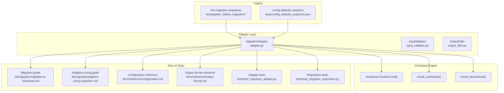
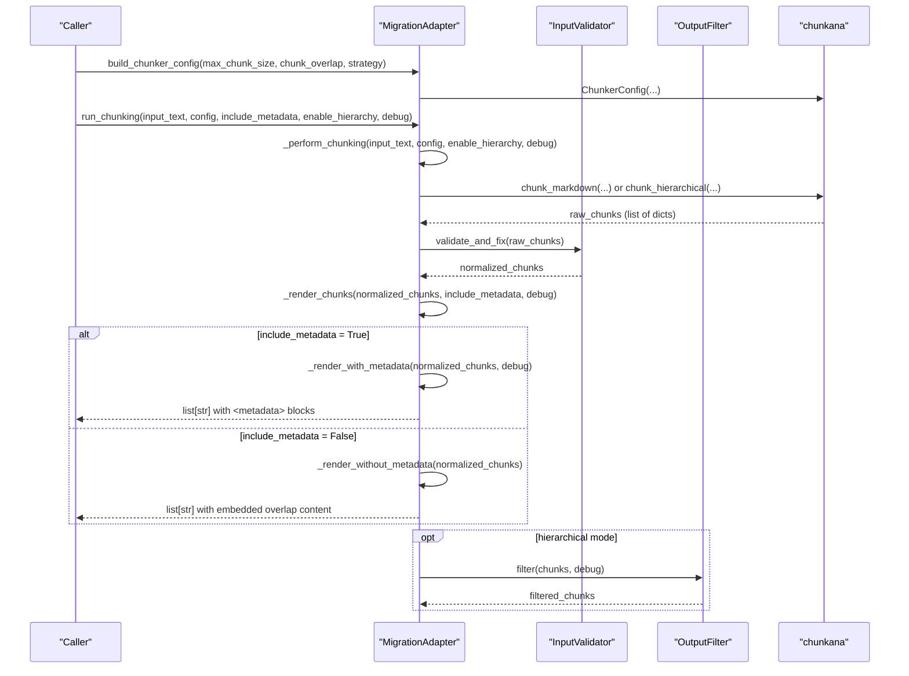
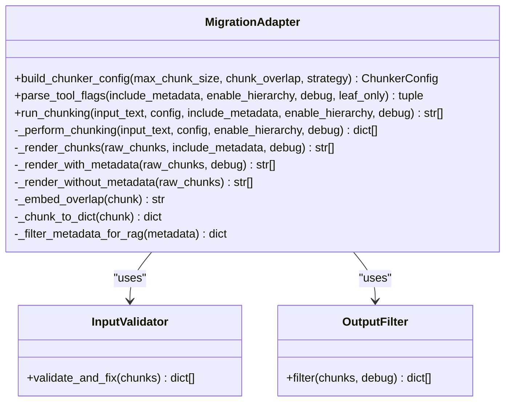
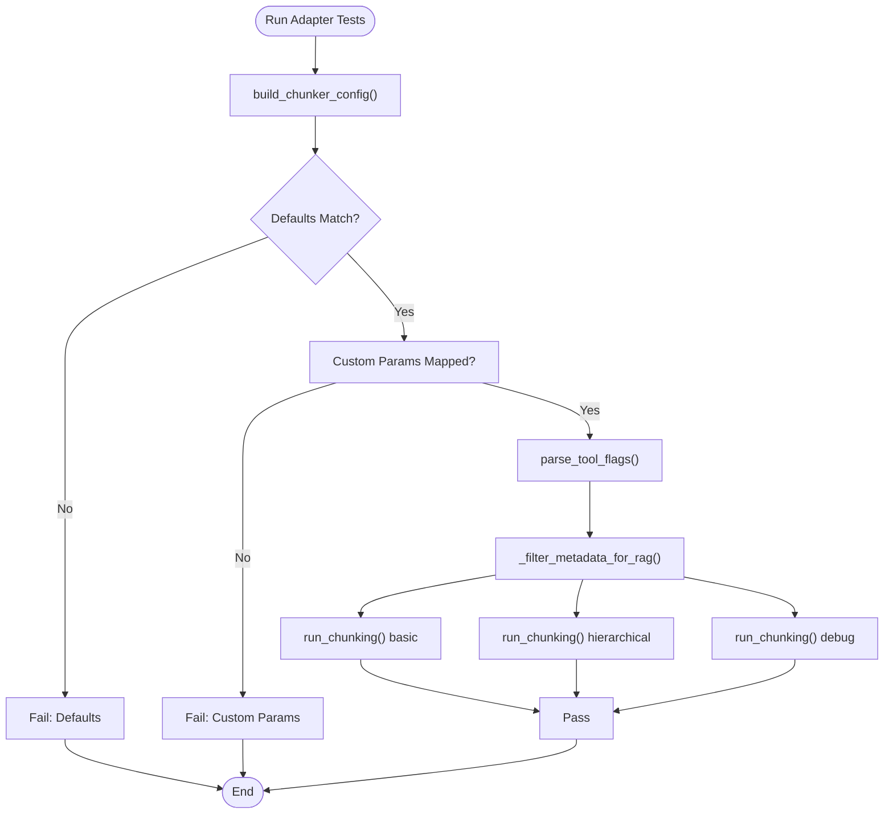
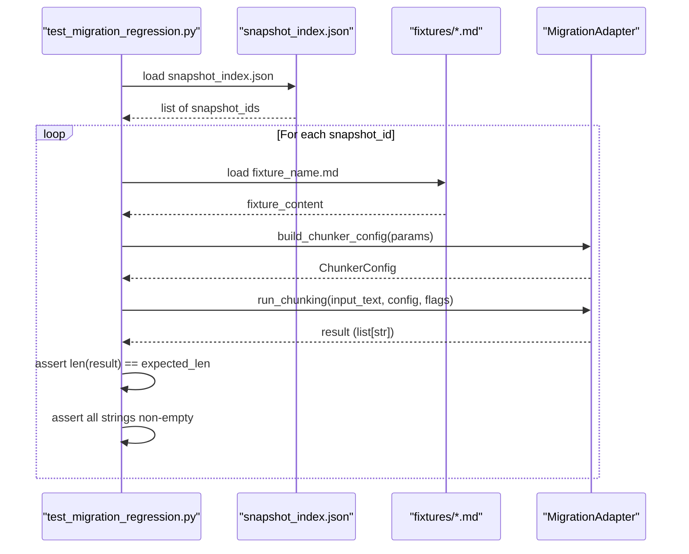
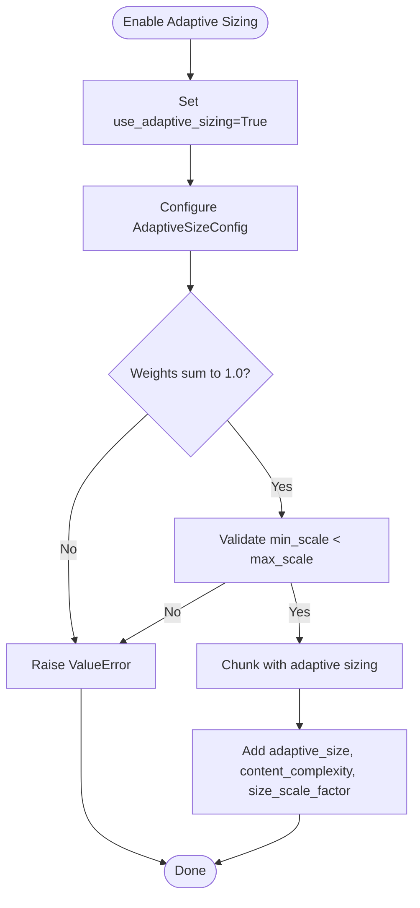
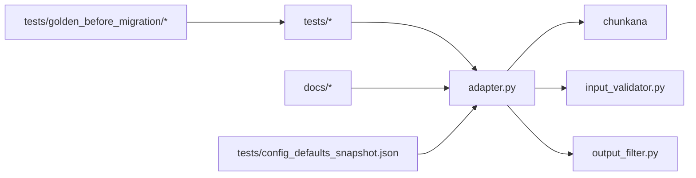

# Migration Guides

<cite>
**Referenced Files in This Document**
- [adapter.py](file://adapter.py)
- [tests/test_migration_adapter.py](file://tests/test_migration_adapter.py)
- [tests/test_migration_regression.py](file://tests/test_migration_regression.py)
- [tests/golden_before_migration/snapshot_index.json](file://tests/golden_before_migration/snapshot_index.json)
- [tests/config_defaults_snapshot.json](file://tests/config_defaults_snapshot.json)
- [docs/guides/migration-to-chunkana.md](file://docs/guides/migration-to-chunkana.md)
- [docs/guides/adaptive-sizing-migration.md](file://docs/guides/adaptive-sizing-migration.md)
- [docs/reference/configuration.md](file://docs/reference/configuration.md)
- [docs/reference/output-format.md](file://docs/reference/output-format.md)
- [CHANGELOG.md](file://CHANGELOG.md)
- [docs/guides/troubleshooting.md](file://docs/guides/troubleshooting.md)
</cite>

## Table of Contents
1. [Introduction](#introduction)
2. [Project Structure](#project-structure)
3. [Core Components](#core-components)
4. [Architecture Overview](#architecture-overview)
5. [Detailed Component Analysis](#detailed-component-analysis)
6. [Dependency Analysis](#dependency-analysis)
7. [Performance Considerations](#performance-considerations)
8. [Troubleshooting Guide](#troubleshooting-guide)
9. [Conclusion](#conclusion)
10. [Appendices](#appendices)

## Introduction
This document provides comprehensive migration guidance for transitioning from legacy chunking systems to the chunkana engine in dify-markdown-chunker-1. It focuses on:
- Configuration mapping between legacy and chunkana-compatible parameters
- Output format alignment and metadata filtering for RAG
- Behavioral consistency and validation using golden snapshots
- Adaptive chunk sizing migration steps and strategy selection logic
- Adapter responsibilities for transforming inputs and outputs
- Step-by-step validation procedures using test_migration_adapter.py and golden snapshots
- Compatibility matrices, deprecation timelines, rollback procedures, and common pitfalls

## Project Structure
The migration spans a clear separation between legacy behavior and the chunkana-powered adapter:
- Legacy behavior and pre-migration snapshots live under tests/golden_before_migration and tests/config_defaults_snapshot.json
- The adapter implements a compatibility layer that maps plugin UI parameters to chunkana configuration, performs chunking, and renders outputs with metadata filtering
- Documentation guides explain migration timelines, behavioral differences, and validation

**Diagram sources**
- [adapter.py](file://adapter.py#L1-L352)
- [tests/test_migration_adapter.py](file://tests/test_migration_adapter.py#L1-L189)
- [tests/test_migration_regression.py](file://tests/test_migration_regression.py#L1-L205)
- [tests/golden_before_migration/snapshot_index.json](file://tests/golden_before_migration/snapshot_index.json#L1-L200)
- [tests/config_defaults_snapshot.json](file://tests/config_defaults_snapshot.json#L1-L22)
- [docs/guides/migration-to-chunkana.md](file://docs/guides/migration-to-chunkana.md#L1-L212)
- [docs/guides/adaptive-sizing-migration.md](file://docs/guides/adaptive-sizing-migration.md#L1-L588)
- [docs/reference/configuration.md](file://docs/reference/configuration.md#L1-L530)
- [docs/reference/output-format.md](file://docs/reference/output-format.md#L1-L282)

**Section sources**
- [adapter.py](file://adapter.py#L1-L352)
- [tests/test_migration_adapter.py](file://tests/test_migration_adapter.py#L1-L189)
- [tests/test_migration_regression.py](file://tests/test_migration_regression.py#L1-L205)
- [tests/golden_before_migration/snapshot_index.json](file://tests/golden_before_migration/snapshot_index.json#L1-L200)
- [tests/config_defaults_snapshot.json](file://tests/config_defaults_snapshot.json#L1-L22)
- [docs/guides/migration-to-chunkana.md](file://docs/guides/migration-to-chunkana.md#L1-L212)
- [docs/guides/adaptive-sizing-migration.md](file://docs/guides/adaptive-sizing-migration.md#L1-L588)
- [docs/reference/configuration.md](file://docs/reference/configuration.md#L1-L530)
- [docs/reference/output-format.md](file://docs/reference/output-format.md#L1-L282)

## Core Components
- MigrationAdapter: central compatibility layer that builds chunkana configuration from plugin UI parameters, runs chunking, and renders outputs with metadata filtering. It separates chunking from rendering to guarantee boundary invariance and supports hierarchical chunking with filtering.
- InputValidator: ensures normalized chunk structures and fixes anomalies before rendering.
- OutputFilter: filters metadata fields for RAG-friendly outputs and supports hierarchical filtering (e.g., leaf_only).
- Golden snapshots and config defaults: provide pre-migration baselines for regression validation and capture default configuration behavior.

Key responsibilities:
- Parameter mapping from plugin UI to chunkana configuration
- Boundary-invariant chunking independent of include_metadata
- Metadata embedding control and filtering for different use cases
- Hierarchical chunking with configurable filtering and debug modes

**Section sources**
- [adapter.py](file://adapter.py#L1-L352)
- [tests/test_migration_adapter.py](file://tests/test_migration_adapter.py#L1-L189)
- [tests/test_migration_regression.py](file://tests/test_migration_regression.py#L1-L205)
- [tests/golden_before_migration/snapshot_index.json](file://tests/golden_before_migration/snapshot_index.json#L1-L200)
- [tests/config_defaults_snapshot.json](file://tests/config_defaults_snapshot.json#L1-L22)

## Architecture Overview
The adapter implements a two-stage pipeline:
1) Chunking stage: performs boundary-invariant chunking using chunkana’s chunk_markdown or chunk_hierarchical
2) Rendering stage: formats outputs depending on include_metadata and debug flags

**Diagram sources**
- [adapter.py](file://adapter.py#L131-L208)
- [adapter.py](file://adapter.py#L157-L191)
- [adapter.py](file://adapter.py#L193-L242)
- [adapter.py](file://adapter.py#L243-L296)
- [adapter.py](file://adapter.py#L306-L348)

**Section sources**
- [adapter.py](file://adapter.py#L131-L208)
- [adapter.py](file://adapter.py#L157-L191)
- [adapter.py](file://adapter.py#L193-L242)
- [adapter.py](file://adapter.py#L243-L296)
- [adapter.py](file://adapter.py#L306-L348)

## Detailed Component Analysis

### MigrationAdapter: Configuration Mapping and Output Rendering
- build_chunker_config: maps plugin UI parameters to chunkana ChunkerConfig, applies defaults from pre-migration snapshot, and filters unsupported parameters. Strategy “auto” maps to None to let chunkana auto-select.
- parse_tool_flags: extracts include_metadata, enable_hierarchy, debug, leaf_only flags.
- run_chunking: guarantees boundary invariance by separating chunking from rendering. The chunking stage depends only on input text and config; rendering depends on include_metadata and debug.
- _perform_chunking: calls chunk_markdown or chunk_hierarchical, converts results to dictionaries, validates and fixes anomalies, and filters hierarchical results when enabled.
- _render_chunks: chooses between metadata-embedded format and overlap-embedded format for include_metadata=False.
- _render_with_metadata: embeds filtered metadata into a <metadata> block; debug mode preserves all metadata; otherwise filters out statistical/internal fields.
- _render_without_metadata: embeds previous_content + content + next_content into chunk strings for context preservation.
- _filter_metadata_for_rag: excludes statistical, count, internal, and boolean false-valued fields to optimize RAG retrieval.

**Diagram sources**
- [adapter.py](file://adapter.py#L94-L119)
- [adapter.py](file://adapter.py#L121-L129)
- [adapter.py](file://adapter.py#L131-L156)
- [adapter.py](file://adapter.py#L157-L191)
- [adapter.py](file://adapter.py#L193-L242)
- [adapter.py](file://adapter.py#L243-L296)
- [adapter.py](file://adapter.py#L297-L305)
- [adapter.py](file://adapter.py#L306-L348)

**Section sources**
- [adapter.py](file://adapter.py#L94-L119)
- [adapter.py](file://adapter.py#L121-L129)
- [adapter.py](file://adapter.py#L131-L156)
- [adapter.py](file://adapter.py#L157-L191)
- [adapter.py](file://adapter.py#L193-L242)
- [adapter.py](file://adapter.py#L243-L296)
- [adapter.py](file://adapter.py#L297-L305)
- [adapter.py](file://adapter.py#L306-L348)

### Validation Using test_migration_adapter.py
- Validates build_chunker_config defaults and custom parameters
- Validates strategy mapping (“auto” to None)
- Validates metadata filtering for RAG
- Validates run_chunking behavior for basic, hierarchical, and debug modes

**Diagram sources**
- [tests/test_migration_adapter.py](file://tests/test_migration_adapter.py#L16-L39)
- [tests/test_migration_adapter.py](file://tests/test_migration_adapter.py#L67-L104)
- [tests/test_migration_adapter.py](file://tests/test_migration_adapter.py#L104-L189)

**Section sources**
- [tests/test_migration_adapter.py](file://tests/test_migration_adapter.py#L16-L39)
- [tests/test_migration_adapter.py](file://tests/test_migration_adapter.py#L67-L104)
- [tests/test_migration_adapter.py](file://tests/test_migration_adapter.py#L104-L189)

### Regression Validation Against Golden Snapshots
- Loads snapshot_index.json to iterate over param combinations
- Loads fixture markdown content and runs adapter with mapped parameters
- Compares chunk counts and ensures all chunks are non-empty strings
- Snapshot IDs and fixture names define the exact legacy behavior to preserve

**Diagram sources**
- [tests/test_migration_regression.py](file://tests/test_migration_regression.py#L42-L61)
- [tests/test_migration_regression.py](file://tests/test_migration_regression.py#L95-L123)
- [tests/test_migration_regression.py](file://tests/test_migration_regression.py#L124-L174)
- [tests/golden_before_migration/snapshot_index.json](file://tests/golden_before_migration/snapshot_index.json#L1-L200)

**Section sources**
- [tests/test_migration_regression.py](file://tests/test_migration_regression.py#L42-L61)
- [tests/test_migration_regression.py](file://tests/test_migration_regression.py#L95-L123)
- [tests/test_migration_regression.py](file://tests/test_migration_regression.py#L124-L174)
- [tests/golden_before_migration/snapshot_index.json](file://tests/golden_before_migration/snapshot_index.json#L1-L200)

### Adaptive Chunk Sizing Migration
- Opt-in feature via use_adaptive_sizing=True
- Adds metadata fields: adaptive_size, content_complexity, size_scale_factor
- Strategy selection logic: auto-selects based on content complexity; can be overridden
- Customization via AdaptiveSizeConfig: base_size, min_scale, max_scale, and weighted factors for code, tables, lists, sentence length
- Validation: weights must sum to 1.0; min_scale < max_scale; overhead negligible

**Diagram sources**
- [docs/guides/adaptive-sizing-migration.md](file://docs/guides/adaptive-sizing-migration.md#L1-L120)
- [docs/guides/adaptive-sizing-migration.md](file://docs/guides/adaptive-sizing-migration.md#L120-L206)
- [docs/guides/adaptive-sizing-migration.md](file://docs/guides/adaptive-sizing-migration.md#L206-L250)

**Section sources**
- [docs/guides/adaptive-sizing-migration.md](file://docs/guides/adaptive-sizing-migration.md#L1-L120)
- [docs/guides/adaptive-sizing-migration.md](file://docs/guides/adaptive-sizing-migration.md#L120-L206)
- [docs/guides/adaptive-sizing-migration.md](file://docs/guides/adaptive-sizing-migration.md#L206-L250)

### Output Format Alignment and Metadata Filtering
- Output format: array of strings with optional <metadata> block
- When include_metadata=False, overlap content is embedded into chunk strings to preserve context
- Metadata filtering removes statistical, count, internal, and false-valued boolean fields for RAG
- Line ranges and overlap fields are approximate; metadata-only context windows avoid duplication

**Section sources**
- [docs/reference/output-format.md](file://docs/reference/output-format.md#L1-L173)
- [docs/reference/output-format.md](file://docs/reference/output-format.md#L133-L164)
- [adapter.py](file://adapter.py#L243-L296)
- [adapter.py](file://adapter.py#L306-L348)

## Dependency Analysis
- Adapter depends on chunkana for chunking and ChunkerConfig
- Adapter composes InputValidator and OutputFilter for normalization and filtering
- Tests depend on adapter and snapshot index to validate behavioral compatibility
- Documentation guides define configuration mappings and output format expectations

**Diagram sources**
- [adapter.py](file://adapter.py#L1-L352)
- [tests/test_migration_adapter.py](file://tests/test_migration_adapter.py#L1-L189)
- [tests/test_migration_regression.py](file://tests/test_migration_regression.py#L1-L205)
- [tests/golden_before_migration/snapshot_index.json](file://tests/golden_before_migration/snapshot_index.json#L1-L200)
- [tests/config_defaults_snapshot.json](file://tests/config_defaults_snapshot.json#L1-L22)

**Section sources**
- [adapter.py](file://adapter.py#L1-L352)
- [tests/test_migration_adapter.py](file://tests/test_migration_adapter.py#L1-L189)
- [tests/test_migration_regression.py](file://tests/test_migration_regression.py#L1-L205)
- [tests/golden_before_migration/snapshot_index.json](file://tests/golden_before_migration/snapshot_index.json#L1-L200)
- [tests/config_defaults_snapshot.json](file://tests/config_defaults_snapshot.json#L1-L22)

## Performance Considerations
- Migration to chunkana improves performance characteristics and reduces memory usage
- Overlap embedding optimization with minimal overhead
- Boundary invariance ensures stable chunk counts across include_metadata modes
- Streaming processing path available for very large files (chunkana direct usage)

[No sources needed since this section provides general guidance]

## Troubleshooting Guide
Common migration pitfalls and resolutions:
- Module not found: chunkana — ensure plugin updated to v2.1.5 or later; chunkana is automatically installed
- Slightly different chunk boundaries — expected due to improved algorithms; content and quality improved
- Different metadata values — enhanced metadata provides more accurate information; update scripts that depend on specific metadata values
- Overlap embedding differences — content mode now embeds overlap; ensure downstream consumers handle embedded overlap
- Hierarchical mode differences — leaf_only filters to content chunks only; debug mode includes root/intermediate chunks

**Section sources**
- [docs/guides/migration-to-chunkana.md](file://docs/guides/migration-to-chunkana.md#L136-L156)
- [docs/guides/troubleshooting.md](file://docs/guides/troubleshooting.md#L206-L223)
- [docs/guides/troubleshooting.md](file://docs/guides/troubleshooting.md#L400-L421)

## Conclusion
The migration to chunkana delivers a robust, maintainable, and performant chunking engine while preserving backward compatibility. The adapter layer ensures exact behavioral parity with pre-migration versions, and comprehensive tests validate compatibility against golden snapshots. Adaptive sizing and advanced chunkana features are available for users requiring enhanced capabilities, with clear configuration mappings and output format expectations documented.

[No sources needed since this section summarizes without analyzing specific files]

## Appendices

### Compatibility Matrix: Plugin UI → chunkana
- max_chunk_size ↔ max_chunk_size
- chunk_overlap ↔ overlap_size (plugin caps at 35% of chunk_size)
- include_metadata ↔ include_metadata
- enable_hierarchy ↔ enable_hierarchy
- debug ↔ debug_mode
- leaf_only ↔ leaf_only
- strategy: auto → strategy_override=None; others map directly

**Section sources**
- [docs/reference/configuration.md](file://docs/reference/configuration.md#L191-L214)
- [docs/reference/configuration.md](file://docs/reference/configuration.md#L204-L213)

### Deprecation Timeline and Migration Notes
- v2.1.5: Migration to chunkana 0.1.0; removed embedded code; introduced adapter; updated dependencies
- v2.1.6: Hierarchical mode enhancements; leaf_only; OutputFilter improvements; overlap embedding fixes; boundary invariance enforced

**Section sources**
- [CHANGELOG.md](file://CHANGELOG.md#L53-L81)
- [CHANGELOG.md](file://CHANGELOG.md#L48-L52)

### Rollback Procedures
- Disabling adaptive sizing: set use_adaptive_sizing=False; returns to standard chunking behavior
- Downgrading plugin: uninstall old version and install new package from releases; reconfigure Knowledge Bases

**Section sources**
- [docs/guides/adaptive-sizing-migration.md](file://docs/guides/adaptive-sizing-migration.md#L415-L439)
- [CHANGELOG.md](file://CHANGELOG.md#L382-L388)

### Step-by-Step Validation Instructions
- Run adapter tests:
  - Build chunker config with defaults and custom params
  - Parse tool flags
  - Filter metadata for RAG
  - Execute run_chunking in basic, hierarchical, and debug modes
- Regression validation:
  - Load snapshot_index.json
  - For each snapshot_id: load fixture, build config, run adapter, compare chunk counts and non-empty strings
- Golden snapshot coverage:
  - Snapshot index enumerates fixture_name, parameters, and expected file per snapshot_id

**Section sources**
- [tests/test_migration_adapter.py](file://tests/test_migration_adapter.py#L16-L39)
- [tests/test_migration_adapter.py](file://tests/test_migration_adapter.py#L67-L104)
- [tests/test_migration_adapter.py](file://tests/test_migration_adapter.py#L104-L189)
- [tests/test_migration_regression.py](file://tests/test_migration_regression.py#L95-L123)
- [tests/test_migration_regression.py](file://tests/test_migration_regression.py#L124-L174)
- [tests/golden_before_migration/snapshot_index.json](file://tests/golden_before_migration/snapshot_index.json#L1-L200)