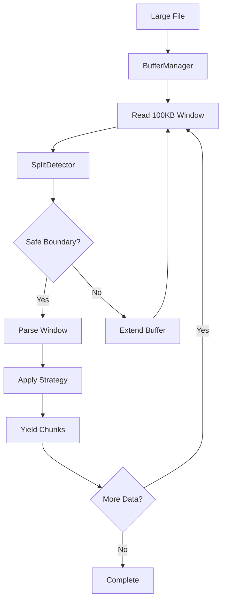

# Performance Optimization

<cite>
**Referenced Files in This Document**   
- [docs/guides/performance.md](file://docs/guides/performance.md)
- [docs/api/streaming.md](file://docs/api/streaming.md)
- [docs/architecture/README.md](file://docs/architecture/README.md)
- [docs/reference/configuration.md](file://docs/reference/configuration.md)
- [tests/performance/README.md](file://tests/performance/README.md)
</cite>

## Table of Contents
1. [Introduction](#introduction)
2. [Streaming Processing](#streaming-processing)
3. [Configuration Tuning](#configuration-tuning)
4. [Hierarchical Chunking and Adaptive Sizing](#hierarchical-chunking-and-adaptive-sizing)
5. [Benchmarking Methodology](#benchmarking-methodology)
6. [Real-World Optimization Examples](#real-world-optimization-examples)
7. [Trade-offs Between Accuracy and Performance](#trade-offs-between-accuracy-and-performance)
8. [Conclusion](#conclusion)

## Introduction

The dify-markdown-chunker-1 provides advanced performance optimization capabilities for processing Markdown documents in retrieval-augmented generation (RAG) pipelines. This document details the memory-efficient streaming processing, configuration tuning, hierarchical chunking, and benchmarking methodologies that enable optimal performance across diverse document types and sizes. The architecture is designed to balance processing speed, memory efficiency, and chunk quality while supporting both batch and streaming workflows.

**Section sources**
- [docs/guides/performance.md](file://docs/guides/performance.md#L1-L502)

## Streaming Processing

The streaming module enables memory-efficient processing of large Markdown files by implementing a buffer-based approach that maintains low memory usage regardless of input size. This capability is essential for processing documents exceeding 10MB in resource-constrained environments.

### Streaming Architecture

The streaming implementation follows a window-based processing model that reads and processes the document in manageable chunks while preserving semantic boundaries:



**Diagram sources**
- [docs/architecture/README.md](file://docs/architecture/README.md#L182-L196)

### Streaming Configuration

The `StreamingConfig` class provides control over memory usage and processing behavior:

| Parameter | Default | Description |
|---------|---------|-------------|
| `buffer_size` | 100,000 | Size of buffer window in characters (100KB) |
| `overlap_lines` | 20 | Context lines preserved between buffer windows |
| `max_memory_mb` | 100 | Maximum memory usage ceiling in megabytes |
| `safe_split_threshold` | 0.8 | Position within buffer to look for split points |

The streaming API guarantees bounded memory usage regardless of input file size, making it suitable for processing very large documentation files (100MB+) in memory-constrained environments.

**Section sources**
- [docs/api/streaming.md](file://docs/api/streaming.md#L1-L334)
- [docs/architecture/README.md](file://docs/architecture/README.md#L162-L199)

## Configuration Tuning

Optimal performance requires careful configuration of buffer sizes, concurrency settings, and caching strategies based on the specific use case and document characteristics.

### Configuration Profiles

The system provides predefined configuration profiles optimized for different scenarios:

| Profile | max_chunk_size | overlap_size | Use Case |
|---------|----------------|--------------|----------|
| Default | 4096 | 200 | General purpose |
| Code Heavy | 8192 | 100 | Technical documentation |
| Structured | 4096 | 200 | User guides |
| Minimal | 1024 | 50 | Small chunks, faster processing |
| No Overlap | 4096 | 0 | No context needed |

### Performance Impact of Configuration

Configuration choices directly impact processing performance:

| Configuration | Overhead | Notes |
|---------------|----------|-------|
| No overlap (0) | Baseline | No overlap processing |
| 50 overlap | < 2% | Minimal metadata |
| 100 overlap | < 5% | Standard setting |
| 200 overlap | < 10% | Default setting |
| 400 overlap | < 15% | Large context |

The v2 architecture uses metadata-only overlap, resulting in minimal performance impact compared to legacy implementations with physical text duplication.

**Section sources**
- [docs/guides/performance.md](file://docs/guides/performance.md#L122-L149)
- [docs/reference/configuration.md](file://docs/reference/configuration.md#L1-L530)

## Hierarchical Chunking and Adaptive Sizing

Hierarchical chunking and adaptive sizing provide intelligent chunking strategies that balance performance with semantic coherence.

### Adaptive Sizing Performance

Adaptive sizing automatically adjusts chunk size based on content complexity with minimal overhead:

| Metric | Measured Value | Target | Status |
|--------|----------------|--------|--------|
| Size Calculation Overhead | 0.1% | < 5% | ✓ Exceeds target |
| Chunking Time Impact | 0-70% | < 70% | ✓ Within variance |
| Complexity Scaling | 5.6-6.5x (1KB→100KB) | < 6.5x | ✓ Acceptable |
| Metadata Overhead | 17.4% | < 20% | ✓ Within bounds |

Adaptive sizing should be enabled when processing mixed-complexity documents (code + text), optimizing for semantic coherence, or handling content that varies significantly in complexity.

### Hierarchical Chunking Impact

Hierarchical chunking creates parent-child relationships between chunks but has performance implications:

| Feature | Batch | Streaming |
|---------|-------|-----------|
| All chunking strategies | ✅ | ✅ |
| Overlap context | ✅ | ✅ |
| Metadata enrichment | ✅ | ✅ |
| Hierarchical chunking | ✅ | ⚠️ Limited* |
| Semantic boundaries | ✅ | ❌ Future** |

\* Hierarchy built post-streaming; document summary may be limited  
\** Requires full-document embeddings; planned for future release

**Section sources**
- [docs/guides/performance.md](file://docs/guides/performance.md#L159-L190)
- [docs/api/streaming.md](file://docs/api/streaming.md#L311-L324)

## Benchmarking Methodology

The performance benchmark suite provides automated measurement across multiple dimensions to ensure consistent performance characteristics.

### Benchmark Categories

The suite includes five main benchmark categories:

1. **Size-Based Benchmarks**: Performance across document size categories (Tiny, Small, Medium, Large, Very Large)
2. **Content-Type Benchmarks**: Performance across different content categories (Technical documentation, GitHub READMEs, Changelogs, etc.)
3. **Strategy Benchmarks**: Individual strategy performance (CodeAware, Structural, Fallback)
4. **Configuration Benchmarks**: Impact of different configurations (Default, Code-heavy, Structured, Minimal, No-overlap)
5. **Scalability Analysis**: Regression analysis on time vs. size, memory scaling, and performance projections

### Benchmark Output

Results are saved to `tests/performance/results/` in multiple formats:

| File | Description |
|------|-------------|
| `latest_run.json` | Complete benchmark results (JSON) |
| `performance_report.md` | Human-readable report |
| `results_all.csv` | Tabular results (CSV) |
| `baseline.json` | Baseline for regression detection |

### Performance Thresholds

Benchmarks validate against acceptance criteria:

| Metric | Threshold | Context |
|--------|-----------|---------|
| Processing time | < 100ms per 100KB | Medium documents |
| Throughput | > 1000 KB/s | Standard processing |
| Memory efficiency | < 0.2 MB per KB | Excluding base memory |
| Scaling linearity | R² > 0.95 | Up to 1MB documents |

**Section sources**
- [tests/performance/README.md](file://tests/performance/README.md#L1-L310)

## Real-World Optimization Examples

### Optimizing Chunking Latency

For real-time RAG pipelines, minimize chunking latency with these optimizations:

```python
# Fast processing configuration (minimal features)
fast_config = ChunkConfig(
    max_chunk_size=2048,
    overlap_size=0,  # No overlap
    include_metadata=False,
    strategy_override="fallback",  # Fastest strategy
    use_adaptive_sizing=False,
    enable_code_context_binding=False,
    group_related_tables=False
)
```

This configuration reduces processing overhead by disabling non-essential features while maintaining basic chunking functionality.

### Maximizing Throughput

For batch processing of large document collections, optimize for throughput:

```python
# Reuse chunker instance across documents
chunker = MarkdownChunker(config)

for document in documents:
    chunks = chunker.chunk(document)
    # Process chunks...
```

Reusing the chunker instance avoids the overhead of initialization for each document, significantly improving throughput when processing multiple files.

**Section sources**
- [docs/reference/configuration.md](file://docs/reference/configuration.md#L303-L315)

## Trade-offs Between Accuracy and Performance

Different content types require different optimization strategies that balance accuracy and performance.

### Code-Heavy Documents

For code-heavy documents, prioritize accuracy over raw performance:

- Use larger chunk sizes (6144-8192) to preserve code context
- Enable code-aware strategy to prevent splitting code blocks
- Use moderate overlap (100-200) to maintain context
- Consider enabling code-context binding for enhanced semantic preservation

### Deeply Nested Documents

For deeply nested documents with complex structure:

- Use structural strategy to preserve hierarchy
- Enable hierarchical chunking for parent-child relationships
- Use moderate chunk sizes (4096) to balance granularity and context
- Consider adaptive sizing to handle varying content density

### Performance vs. Feature Trade-offs

| Configuration | Processing Speed | Memory Usage | Feature Completeness |
|---------------|------------------|--------------|---------------------|
| Plugin UI (basic) | Fast | Low | Medium |
| Plugin UI (hierarchical) | Medium | Medium | Medium-High |
| chunkana (minimal) | Very Fast | Very Low | Low |
| chunkana (full features) | Medium | Medium | Very High |

Choose the configuration that best balances the required features with performance constraints for your specific use case.

**Section sources**
- [docs/guides/performance.md](file://docs/guides/performance.md#L70-L82)
- [docs/reference/configuration.md](file://docs/reference/configuration.md#L434-L439)

## Conclusion

The dify-markdown-chunker-1 provides comprehensive performance optimization capabilities for processing Markdown documents in RAG pipelines. The streaming module enables memory-efficient processing of large files, while configuration tuning allows optimization for specific use cases. Hierarchical chunking and adaptive sizing provide intelligent chunking strategies that balance performance with semantic coherence. The comprehensive benchmarking suite ensures consistent performance characteristics across document sizes and types. By understanding the trade-offs between accuracy and performance for different content types, users can optimize their chunking pipeline for their specific requirements.