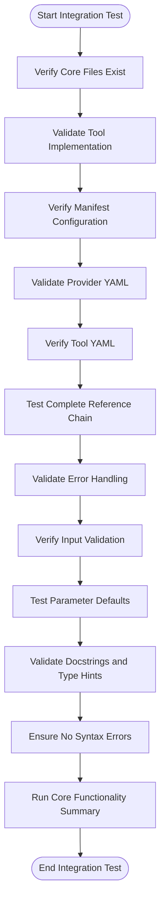
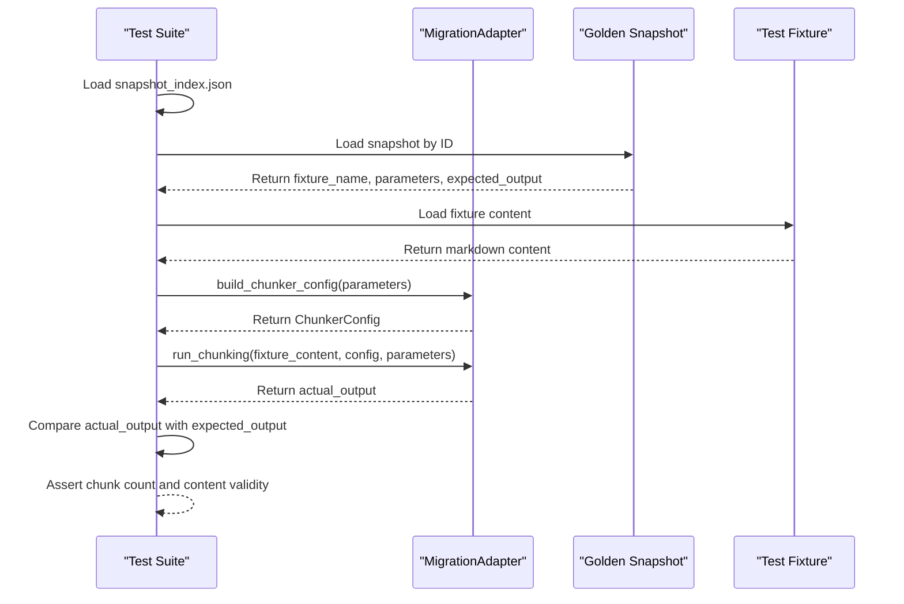

# Testing Procedures

<cite>
**Referenced Files in This Document**   
- [run_test.sh](file://run_test.sh)
- [pytest.ini](file://pytest.ini)
- [test_entry_point.py](file://tests/test_entry_point.py)
- [test_manifest.py](file://tests/test_manifest.py)
- [test_provider_class.py](file://tests/test_provider_class.py)
- [test_integration_basic.py](file://tests/test_integration_basic.py)
- [test_migration_regression.py](file://tests/test_migration_regression.py)
- [test_error_handling.py](file://tests/test_error_handling.py)
- [test_migration_adapter.py](file://tests/test_migration_adapter.py)
- [adapter.py](file://adapter.py)
- [main.py](file://main.py)
- [tests/fixtures](file://tests/fixtures)
- [tests/corpus](file://tests/corpus)
- [tests/golden_before_migration](file://tests/golden_before_migration)
</cite>

## Table of Contents
1. [Introduction](#introduction)
2. [Unit Testing Strategies](#unit-testing-strategies)
3. [Integration Testing Workflows](#integration-testing-workflows)
4. [Test Fixtures and Corpus Data](#test-fixtures-and-corpus-data)
5. [Regression Testing Protocols](#regression-testing-protocols)
6. [Running Tests and Configuration](#running-tests-and-configuration)
7. [Adding New Test Cases and Coverage](#adding-new-test-cases-and-coverage)
8. [Conclusion](#conclusion)

## Introduction
The dify-markdown-chunker-1 project implements a comprehensive testing framework to ensure the reliability, backward compatibility, and robustness of its markdown chunking functionality. The testing strategy encompasses unit tests for individual components, integration tests for end-to-end workflows, and regression tests to maintain compatibility across versions. The test suite leverages various test fixtures, corpus data, and golden snapshots to validate behavior across diverse document structures and content types. This document details the testing procedures, including strategies for unit and integration testing, the use of test fixtures and corpus data, regression testing protocols, and instructions for running and extending the test suite.

**Section sources**
- [test_entry_point.py](file://tests/test_entry_point.py#L1-L240)
- [test_manifest.py](file://tests/test_manifest.py#L1-L185)

## Unit Testing Strategies
Unit testing in dify-markdown-chunker-1 focuses on validating individual components such as parsers, chunkers, and adapters in isolation. The test suite includes dedicated test files for specific components, ensuring that each part of the system functions correctly according to its specifications. For example, `test_entry_point.py` verifies the validity of the main entry point, checking for proper syntax, required imports, timeout configuration, plugin instantiation, and the presence of the main guard. Similarly, `test_manifest.py` ensures that the manifest file contains all required fields, valid metadata, proper localization, resource allocation, runner configuration, tags, provider references, architecture support, minimum Dify version, created_at format, icon reference, and permissions configuration.

The adapter component is tested in `test_migration_adapter.py`, which validates the functionality of the `MigrationAdapter` class. This includes testing the `build_chunker_config` method with default and custom parameters, ensuring that the 'auto' strategy maps to `None`, and verifying the `parse_tool_flags` method with default and custom values. The `run_chunking` method is tested for basic functionality, handling of metadata inclusion/exclusion, hierarchical chunking, and debug mode behavior. These unit tests ensure that the adapter correctly maps parameters, processes input, and produces expected output for various configurations.

**Section sources**
- [test_entry_point.py](file://tests/test_entry_point.py#L1-L240)
- [test_manifest.py](file://tests/test_manifest.py#L1-L185)
- [test_migration_adapter.py](file://tests/test_migration_adapter.py#L1-L189)
- [test_provider_class.py](file://tests/test_provider_class.py#L1-L112)

## Integration Testing Workflows
Integration testing in dify-markdown-chunker-1 validates end-to-end processing from input to output chunks, ensuring that all components work together as expected. The `test_integration_basic.py` file contains tests that verify the complete reference chain from manifest to provider to tool to Python implementation. These tests check that all core files exist, the tool has the required `_invoke` method, imports necessary modules, handles all parameters, creates chunk configuration, instantiates the chunker, calls the chunking method, formats results, yields results, and maintains proper references between configuration files.

The integration tests also verify error handling, input validation, parameter defaults, docstrings, type hints, and the absence of syntax errors. A summary test, `test_core_functionality_summary`, consolidates these checks to ensure that all core functionality is present and working correctly. This comprehensive approach ensures that the tool functions as a cohesive unit, processing input text through the entire pipeline and producing correctly formatted output chunks with appropriate metadata.

**Diagram sources**
- [test_integration_basic.py](file://tests/test_integration_basic.py#L1-L233)

**Section sources**
- [test_integration_basic.py](file://tests/test_integration_basic.py#L1-L233)

## Test Fixtures and Corpus Data
The testing framework utilizes a rich set of test fixtures and corpus data to achieve comprehensive coverage across various document structures and content types. The `tests/fixtures` directory contains a variety of markdown files designed to test specific scenarios, including edge cases, complex structures, and different content types. These fixtures are used in unit and integration tests to validate the chunker's behavior on diverse inputs.

The `tests/corpus` directory contains an extensive collection of real-world documents organized by category, such as changelogs, debug logs, engineering blogs, GitHub readmes, mixed content, nested fencing, personal notes, research notes, scientific documents, and technical documentation. Each category includes multiple markdown files with corresponding metadata JSON files, providing a realistic test environment that reflects actual usage patterns. This corpus data is crucial for ensuring that the chunker performs well on a wide range of document types and structures, from simple text to complex, nested content.

**Section sources**
- [tests/fixtures](file://tests/fixtures)
- [tests/corpus](file://tests/corpus)

## Regression Testing Protocols
Regression testing in dify-markdown-chunker-1 is designed to ensure backward compatibility during upgrades by comparing current output against golden snapshots from previous versions. The `tests/golden_before_migration` directory contains JSON files that represent the expected output of the chunking process for specific input fixtures and parameters. These snapshots serve as a baseline for regression testing, allowing the team to verify that changes to the codebase do not alter the behavior of the chunker in unintended ways.

The `test_migration_regression.py` file implements regression tests that load these golden snapshots, run the current chunking process on the corresponding fixtures, and compare the output to the expected results. The tests check for compatibility in chunk count, content validity, and metadata inclusion/exclusion. Additionally, the tests validate basic functionality, metadata modes, and hierarchical chunking to ensure that all features continue to work as expected. This rigorous regression testing protocol is essential for maintaining the reliability and consistency of the chunker across different versions and updates.

**Diagram sources**
- [test_migration_regression.py](file://tests/test_migration_regression.py#L1-L205)
- [golden_before_migration](file://tests/golden_before_migration)

**Section sources**
- [test_migration_regression.py](file://tests/test_migration_regression.py#L1-L205)
- [golden_before_migration](file://tests/golden_before_migration)

## Running Tests and Configuration
Tests in dify-markdown-chunker-1 are executed using the `run_test.sh` script, which sets up the environment and runs the test suite. The script changes to the project directory, activates the virtual environment, and executes the test adapter script. This ensures a consistent testing environment and simplifies the test execution process for developers.

The test configuration is managed through the `pytest.ini` file, which specifies test discovery paths, file patterns, class and function naming conventions, and output options. The configuration includes markers for different test types (slow, integration, unit, blocker) and warning filters to ignore specific deprecation warnings and gevent monkey-patching warnings. The `addopts` parameter configures verbose output, short traceback format, and strict marker usage, providing detailed feedback during test execution. This configuration ensures that tests are discovered and run correctly, with appropriate filtering of warnings and detailed output for debugging.

**Section sources**
- [run_test.sh](file://run_test.sh#L1-L6)
- [pytest.ini](file://pytest.ini#L1-L37)

## Adding New Test Cases and Coverage
To add new test cases and achieve high code coverage, developers should follow the established patterns in the test suite. New unit tests should be added to the appropriate test file, such as `test_migration_adapter.py` for adapter functionality or `test_error_handling.py` for error handling scenarios. Integration tests can be added to `test_integration_basic.py` to validate new features or edge cases in the end-to-end workflow.

When adding new test cases, it is important to use relevant test fixtures from the `tests/fixtures` directory or create new ones that represent the specific scenario being tested. For complex or real-world scenarios, corpus data from the `tests/corpus` directory can be leveraged to ensure realistic test conditions. Developers should also consider adding new golden snapshots to the `tests/golden_before_migration` directory when introducing significant changes, to establish a baseline for future regression testing.

Achieving high code coverage involves testing all branches of conditional logic, edge cases, and error conditions. The test suite already includes comprehensive coverage for input validation, error handling, and parameter defaults, but new features or modifications may require additional test cases. Developers should use the `pytest` markers to categorize new tests appropriately and ensure that all test cases are discoverable and executable through the standard test runner.

**Section sources**
- [test_entry_point.py](file://tests/test_entry_point.py#L1-L240)
- [test_manifest.py](file://tests/test_manifest.py#L1-L185)
- [test_migration_adapter.py](file://tests/test_migration_adapter.py#L1-L189)
- [test_error_handling.py](file://tests/test_error_handling.py#L1-L111)

## Conclusion
The testing procedures in dify-markdown-chunker-1 provide a robust framework for ensuring the quality and reliability of the markdown chunking functionality. Through a combination of unit tests, integration tests, and regression tests, the project maintains high standards of code quality and backward compatibility. The use of comprehensive test fixtures, corpus data, and golden snapshots enables thorough validation across diverse document structures and content types. By following the established patterns and leveraging the available tools and configurations, developers can effectively add new test cases, achieve high code coverage, and maintain the integrity of the system through ongoing development and upgrades.