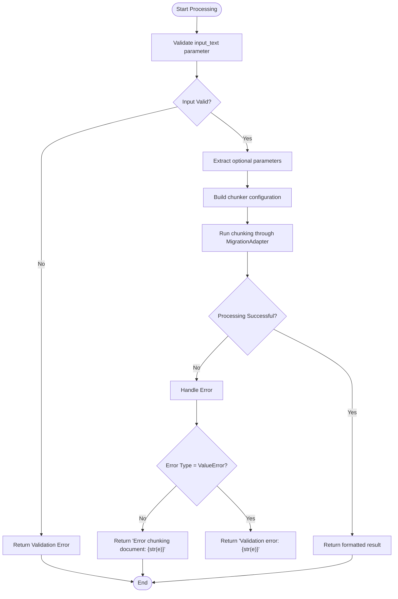
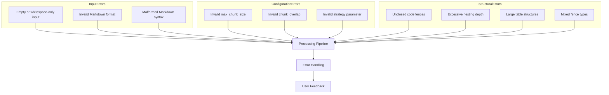
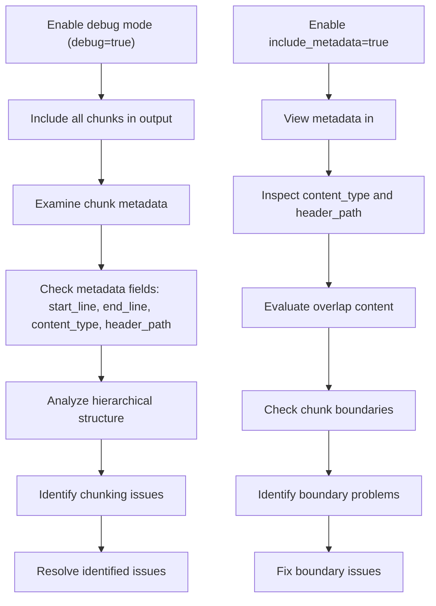
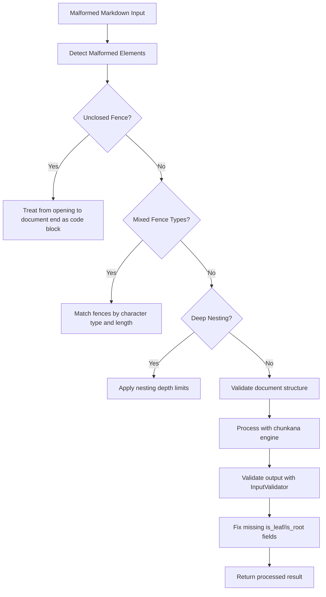
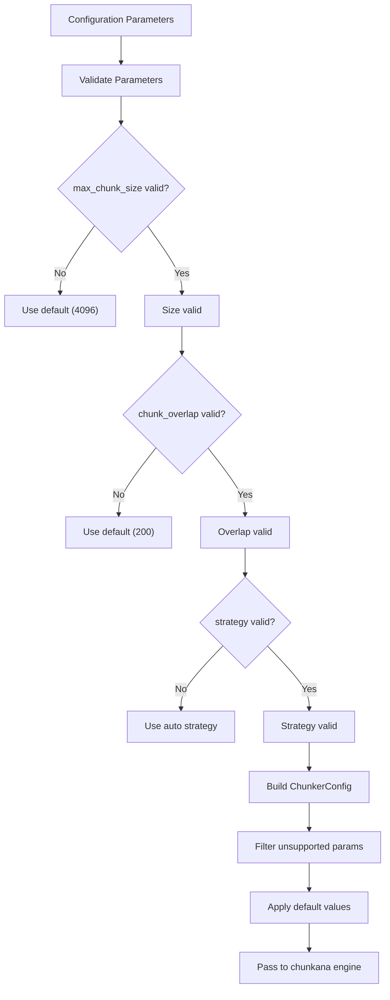
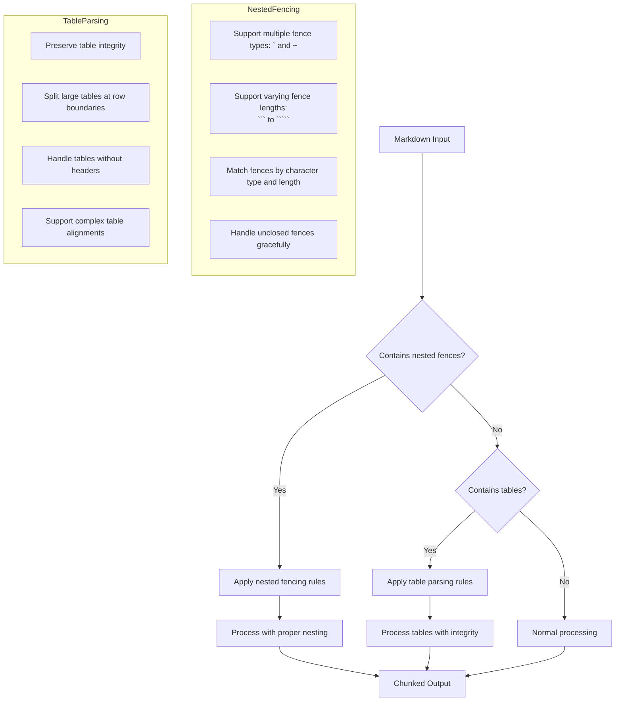
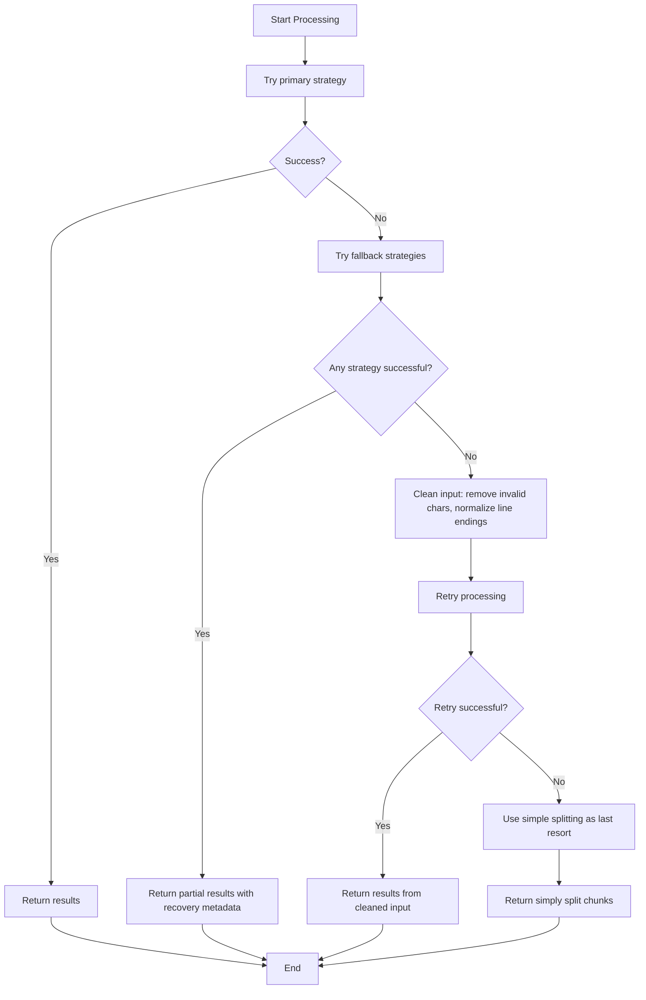
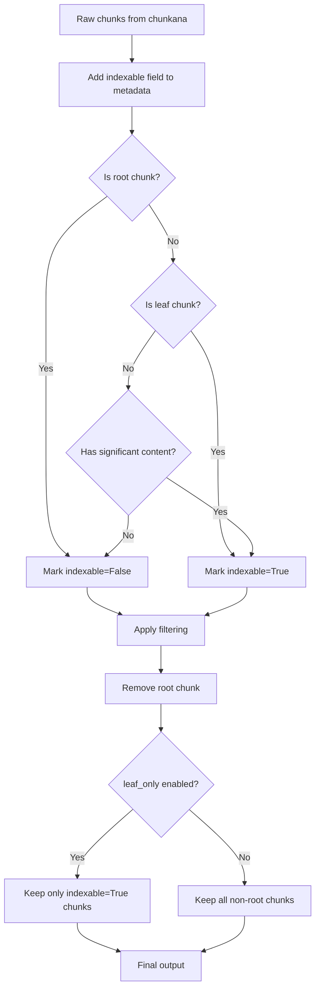
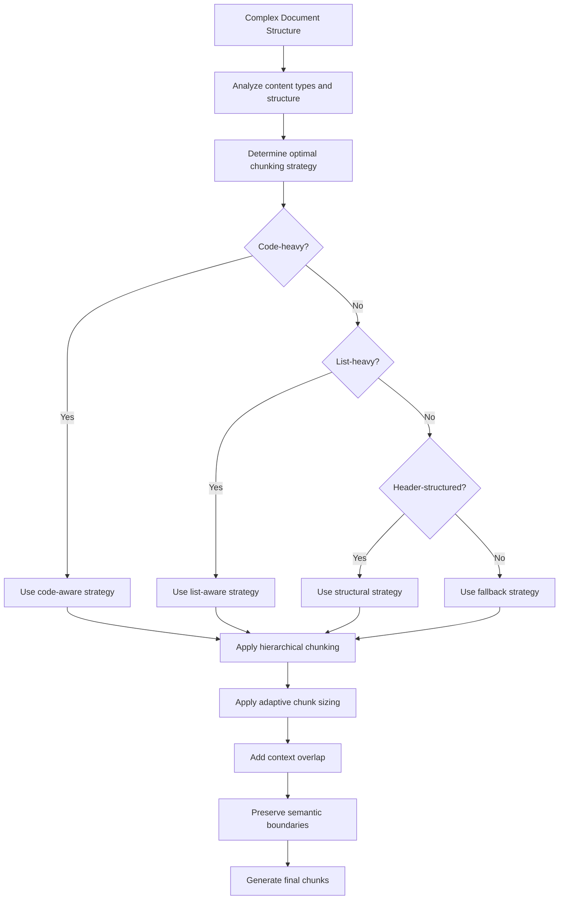

# Troubleshooting Guide

<cite>
**Referenced Files in This Document**   
- [test_error_handling.py](file://tests/test_error_handling.py)
- [markdown_chunk_tool.py](file://tools/markdown_chunk_tool.py)
- [adapter.py](file://adapter.py)
- [output_filter.py](file://output_filter.py)
- [input_validator.py](file://input_validator.py)
</cite>

## Table of Contents
1. [Introduction](#introduction)
2. [Error Handling Architecture](#error-handling-architecture)
3. [Common Error Scenarios](#common-error-scenarios)
4. [Diagnostic Procedures](#diagnostic-procedures)
5. [Malformed Input Handling](#malformed-input-handling)
6. [Configuration Validation Failures](#configuration-validation-failures)
7. [Nested Fencing and Table Parsing Edge Cases](#nested-fencing-and-table-parsing-edge-cases)
8. [Recovery Patterns for Failed Processing Jobs](#recovery-patterns-for-failed-processing-jobs)
9. [Output Integrity Validation](#output-integrity-validation)
10. [Mitigation Strategies for Complex Document Structures](#mitigation-strategies-for-complex-document-structures)

## Introduction
This troubleshooting guide provides comprehensive information for diagnosing and resolving common issues in the dify-markdown-chunker-1 system. The document covers error scenarios such as malformed Markdown input, unexpected chunk boundaries, configuration validation failures, and edge cases in nested fencing or table parsing. It details diagnostic procedures using debug logs and metadata inspection, explains how the system handles malformed inputs and fallback mechanisms when primary strategies fail, and provides solutions for issues identified in test_error_handling.py and recovery patterns for failed processing jobs.

**Section sources**
- [test_error_handling.py](file://tests/test_error_handling.py#L1-L110)

## Error Handling Architecture
The dify-markdown-chunker-1 system implements a robust error handling architecture designed to gracefully handle various error conditions without crashing. The architecture is built around a try-except structure in the markdown_chunk_tool.py file that captures both specific ValueError exceptions and general Exception types. This ensures that validation errors are handled separately from general processing errors, providing more informative feedback to users.

The error handling mechanism uses the create_text_message function to generate error messages, ensuring consistency in error reporting. The system avoids bare except clauses, which could mask underlying issues, and instead explicitly handles ValueError and general Exception types. Error messages include details from the original exception via str(e), providing valuable context for debugging.



**Diagram sources**
- [tools/markdown_chunk_tool.py](file://tools/markdown_chunk_tool.py#L73-L125)

**Section sources**
- [tools/markdown_chunk_tool.py](file://tools/markdown_chunk_tool.py#L73-L125)
- [test_error_handling.py](file://tests/test_error_handling.py#L20-L81)

## Common Error Scenarios
The dify-markdown-chunker-1 system encounters several common error scenarios during operation. These include empty or whitespace-only input, invalid configuration parameters, malformed Markdown syntax, and issues with complex document structures such as deeply nested fencing or large tables.

The system validates the input_text parameter to ensure it is not empty or whitespace-only, returning a specific error message when this validation fails. Configuration validation checks ensure that parameters like max_chunk_size and chunk_overlap have appropriate values. The system also handles malformed Markdown elements such as unclosed code fences, which could otherwise disrupt the chunking process.



**Diagram sources**
- [tools/markdown_chunk_tool.py](file://tools/markdown_chunk_tool.py#L76-L79)
- [test_error_handling.py](file://tests/test_error_handling.py#L42-L48)

**Section sources**
- [test_error_handling.py](file://tests/test_error_handling.py#L42-L48)
- [tools/markdown_chunk_tool.py](file://tools/markdown_chunk_tool.py#L76-L79)

## Diagnostic Procedures
Effective diagnosis of issues in the dify-markdown-chunker-1 system involves several key procedures. The primary diagnostic tool is the debug mode, which can be enabled through the debug parameter in the tool configuration. When debug mode is enabled along with enable_hierarchy=true, the system includes all chunks (root, intermediate, and leaf) in the output, providing a complete view of the chunking process.

Metadata inspection is another critical diagnostic procedure. The system generates rich metadata for each chunk, including start_line, end_line, content_type, header_path, and various structural indicators. This metadata can be used to trace the chunking process and identify where issues may be occurring. The output_filter.py module plays a key role in this process by adding indexable fields to metadata and filtering chunks based on their content significance.



**Diagram sources**
- [adapter.py](file://adapter.py#L139-L155)
- [output_filter.py](file://output_filter.py#L30-L58)

**Section sources**
- [adapter.py](file://adapter.py#L139-L155)
- [output_filter.py](file://output_filter.py#L30-L58)

## Malformed Input Handling
The dify-markdown-chunker-1 system implements specific handling for malformed Markdown input to ensure robust processing even with imperfect source documents. The system is designed to handle various types of malformed input, including unclosed code fences, mixed fence types, and deeply nested structures.

For unclosed fences, the system treats the content from the opening fence to the end of the document as a single code block, preventing the entire document from being misinterpreted. The system supports multiple fence types (backticks and tildes) and varying fence lengths (triple, quadruple, quintuple) to handle nested fencing scenarios. When encountering mixed fence types, the system matches opening and closing fences by both character type and length, ensuring proper nesting is maintained.

The input_validator.py module plays a crucial role in handling malformed input by validating and fixing data from the chunkana library. It ensures that critical metadata fields like is_leaf and is_root are present, setting default values when they are missing. This prevents processing failures due to incomplete metadata from the underlying chunking engine.



**Diagram sources**
- [adapter.py](file://adapter.py#L157-L191)
- [input_validator.py](file://input_validator.py#L17-L45)

**Section sources**
- [adapter.py](file://adapter.py#L157-L191)
- [input_validator.py](file://input_validator.py#L17-L45)

## Configuration Validation Failures
Configuration validation failures in the dify-markdown-chunker-1 system are handled through a combination of parameter validation and graceful fallback mechanisms. The system validates all configuration parameters, including max_chunk_size, chunk_overlap, and strategy, ensuring they have appropriate values before processing begins.

When configuration validation fails, the system returns specific error messages that identify the nature of the problem. For example, if the input_text parameter is empty or whitespace-only, the system returns a validation error indicating that input_text is required and cannot be empty. The system uses ValueError exceptions for configuration-related errors, allowing them to be distinguished from general processing errors.

The MigrationAdapter class in adapter.py handles configuration mapping from the plugin UI to the chunkana library configuration. It applies default values for parameters that are not specified and filters out unsupported parameters. This ensures that the configuration passed to the chunking engine is always valid, even if some parameters are missing or invalid in the input.



**Diagram sources**
- [adapter.py](file://adapter.py#L94-L119)
- [tools/markdown_chunk_tool.py](file://tools/markdown_chunk_tool.py#L83-L89)

**Section sources**
- [adapter.py](file://adapter.py#L94-L119)
- [tools/markdown_chunk_tool.py](file://tools/markdown_chunk_tool.py#L83-L89)

## Nested Fencing and Table Parsing Edge Cases
The dify-markdown-chunker-1 system handles nested fencing and table parsing edge cases through specialized parsing logic and robust error recovery mechanisms. For nested fencing, the system supports multiple fence types (backticks and tildes) and varying fence lengths to accommodate complex nesting scenarios.

The system can handle quadruple backticks (````) for nesting triple backticks inside, quintuple backticks (`````) for deeper nesting, and tilde fencing (~~~, ~~~~, ~~~~~) as an alternative syntax. Closing fences must have the same character type and length greater than or equal to the opening fence. This allows for proper nesting while preventing common parsing errors.

For table parsing, the system preserves table integrity by keeping entire tables within single chunks when possible. When tables are too large to fit within a single chunk, the system attempts to split them at logical boundaries such as row boundaries, maintaining the table structure across chunks. The system also handles edge cases like tables without headers and complex table alignments.



**Diagram sources**
- [docs/api/types.md](file://docs/api/types.md#L202-L206)
- [docs/research/features/02-nested-fencing-support.md](file://docs/research/features/02-nested-fencing-support.md#L278-L285)

**Section sources**
- [docs/api/types.md](file://docs/api/types.md#L202-L206)
- [docs/research/features/02-nested-fencing-support.md](file://docs/research/features/02-nested-fencing-support.md#L278-L285)

## Recovery Patterns for Failed Processing Jobs
The dify-markdown-chunker-1 system implements several recovery patterns for failed processing jobs, ensuring resilience in the face of various error conditions. These recovery patterns are designed to provide fallback mechanisms when primary processing strategies fail, allowing the system to produce usable output even in challenging scenarios.

The system employs a fallback strategy pattern where, if the primary chunking strategy fails, it attempts alternative strategies in order of decreasing sophistication. This begins with code-aware and list-aware strategies, followed by structural and fallback strategies. If all strategies fail, the system attempts an emergency fallback using simple splitting.

Another recovery pattern is partial results, where if some chunks can be successfully processed before an error occurs, those partial results are returned with appropriate metadata indicating the partial nature of the output. This allows downstream systems to work with the available content rather than receiving no output at all.

The CleanAndRetry pattern is also implemented, where the system attempts to clean the input content by removing invalid characters, normalizing line endings, and removing BOM (Byte Order Mark) before retrying the processing. This can resolve issues caused by encoding problems or invalid characters in the input.



**Diagram sources**
- [docs/reference/algorithms-ru.md](file://docs/reference/algorithms-ru.md#L3487-L3531)

**Section sources**
- [docs/reference/algorithms-ru.md](file://docs/reference/algorithms-ru.md#L3487-L3531)

## Output Integrity Validation
Output integrity validation in the dify-markdown-chunker-1 system is performed through the output_filter.py module, which ensures that the final output is suitable for downstream consumers such as vector databases and indexers. The validation process focuses on filtering hierarchical output to prevent accidental indexing of technical nodes like root and internal nodes.

The OutputFilter class applies a two-step validation process. First, it adds an indexable field to each chunk's metadata, respecting any existing value while applying defaults based on the chunk type. Root chunks are marked as non-indexable, leaf chunks as indexable, and non-leaf chunks as indexable only if they contain significant content (more than 100 characters of non-header content).

Second, the filter removes the root chunk from the output and optionally filters for indexing based on the indexable field when leaf_only mode is enabled. This ensures that only content-rich chunks are included in the final output, improving the quality of results for retrieval-augmented generation (RAG) systems.



**Diagram sources**
- [output_filter.py](file://output_filter.py#L30-L58)

**Section sources**
- [output_filter.py](file://output_filter.py#L30-L58)

## Mitigation Strategies for Complex Document Structures
The dify-markdown-chunker-1 system employs several mitigation strategies for handling complex document structures that could otherwise lead to suboptimal chunking results. These strategies address challenges posed by deeply nested content, mixed content types, and documents with irregular structures.

For deeply nested content, the system uses hierarchical chunking with parent-child relationships to preserve the document's structure. Each chunk includes metadata such as parent_id, children_ids, and level, allowing downstream systems to navigate the document hierarchy. The system also limits nesting depth to prevent excessive memory usage and processing time.

For mixed content types, the system employs adaptive strategy selection based on content analysis. It analyzes the document to determine the optimal chunking strategy, choosing between code-aware, list-aware, structural, and fallback strategies based on factors like code ratio and structure complexity. This ensures that different content types are handled appropriately.

The system also implements adaptive chunk sizing, adjusting chunk boundaries based on content density and semantic boundaries. This prevents chunks from being split in the middle of important content sections and ensures that related content stays together. Overlap between chunks is used to provide context continuity, with the overlap content embedded either in metadata fields or directly in the chunk text depending on the include_metadata setting.



**Diagram sources**
- [main.py](file://main.py#L9-L14)
- [adapter.py](file://adapter.py#L100-L119)

**Section sources**
- [main.py](file://main.py#L9-L14)
- [adapter.py](file://adapter.py#L100-L119)