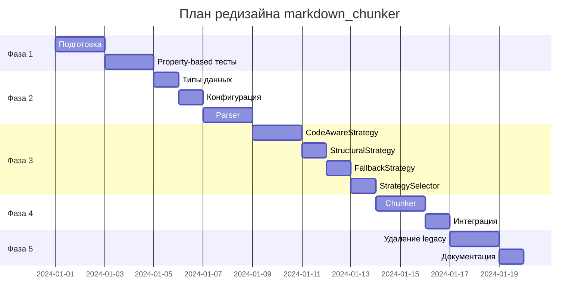

# План Редизайна: Обзор

## Цель

Упростить архитектуру markdown_chunker, сохранив все доменные свойства системы.

## Целевые метрики

| Метрика | Текущее | Целевое | Изменение |
|---------|---------|---------|-----------|
| Python-файлов | 55 | 12 | -78% |
| Строк кода | ~24,000 | ~5,000 | -79% |
| Параметров конфигурации | 32 | 8 | -75% |
| Стратегий | 6 | 3 | -50% |
| Тестовых файлов | 162 | ~10 | -94% |
| Тестов | 1853 | ~50 | -97% |

## Фазы редизайна

## Обзор фаз

### Фаза 1: Подготовка (2-3 дня)
- Создать property-based тесты для 8 доменных свойств
- Убедиться, что текущий код проходит эти тесты
- Настроить CI для регрессионного тестирования

### Фаза 2: Переработка типов и парсера (4-5 дней)
- Объединить `parser/types.py` и `chunker/types.py`
- Упростить `ChunkConfig` (32 → 8 параметров)
- Упростить парсер (удалить deprecated API)

### Фаза 3: Переработка стратегий (5-6 дней)
- Создать `CodeAwareStrategy` (объединение Code + Mixed + Table)
- Упростить `StructuralStrategy` (1720 → ~200 строк)
- Создать `FallbackStrategy` (бывшая SentencesStrategy)
- Удалить `ListStrategy`

### Фаза 4: Интеграция (3-4 дня)
- Переработать `MarkdownChunker`
- Удалить двойной парсинг
- Удалить двойной overlap
- Консолидировать валидацию

### Фаза 5: Очистка (2-3 дня)
- Удалить deprecated код
- Удалить backward compatibility
- Удалить старые тесты
- Обновить документацию

## Общая оценка: 16-21 день

## Критерии успеха

### Обязательные
1. ✅ Все 8 property-based тестов проходят
2. ✅ Публичный API сохранён (`MarkdownChunker`, `ChunkConfig`, `Chunk`)
3. ✅ Производительность не хуже текущей
4. ✅ Результаты на реальных документах идентичны

### Желательные
1. ⭐ Строк кода < 6000
2. ⭐ Файлов < 15
3. ⭐ Тестов < 100
4. ⭐ Время обработки улучшено на 10%+

## Стратегия отката

Если редизайн не удаётся:
1. Сохранить текущий код в ветке `legacy`
2. Вернуться к текущей реализации
3. Применить точечные исправления вместо полного редизайна

## Зависимости

- Python 3.10+
- Hypothesis (для property-based тестов)
- pytest
