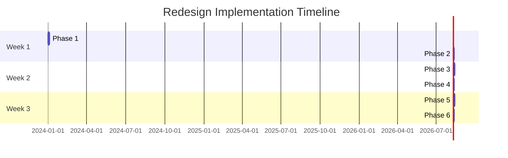

# Redesign Implementation Plan

**Project**: Dify Markdown Chunker Redesign  
**Version**: 1.x → 2.0  
**Duration**: 3 weeks (15 working days)  
**Effort**: 1 senior developer full-time  
**Start Date**: TBD  
**Target Release**: 2.0.0

## Overview

This implementation plan provides a detailed roadmap for migrating from the current 55-file architecture to the simplified 12-file target architecture while maintaining all functional requirements.

## Objectives

1. **Reduce complexity** from 55 files to 12 files
2. **Maintain functionality** - all 10 domain properties must pass
3. **Improve testability** - property-based tests replace implementation tests
4. **Preserve API** - minimize breaking changes to public interface
5. **Ensure quality** - ≥ 95% output equivalence on real documents

## Planning Documents

| Document | Description |
|----------|-------------|
| [01-phase-breakdown.md](01-phase-breakdown.md) | Detailed 6-phase implementation |
| [02-testing-strategy.md](02-testing-strategy.md) | Property test development |
| [03-validation-plan.md](03-validation-plan.md) | Regression prevention |
| [04-migration-guide.md](04-migration-guide.md) | User migration (1.x → 2.0) |
| [05-risk-management.md](05-risk-management.md) | Risk mitigation strategies |

## Phase Summary

| Week | Phase | Focus | Deliverable | Validation |
|------|-------|-------|-------------|------------|
| 1 | Foundation | Structure + types | New structure with property tests | Properties pass on old code |
| 1 | Parser | Stage1 simplification | Single-pass parser | Parser tests pass |
| 2 | Strategies | 6 → 4 consolidation | 4 working strategies | Strategy tests pass |
| 2 | Chunker | Unified pipeline | Single-path orchestration | Integration tests pass |
| 3 | Validation | Comparison | Regression report | 95%+ equivalence |
| 3 | Migration | Production release | Version 2.0.0 | All tests pass |

## Timeline

## Success Criteria

### Code Metrics (Must Achieve)
- [x] Files reduced from 55 to ≤ 15
- [x] Lines of code reduced from 24,000 to ≤ 6,000
- [x] Configuration parameters reduced from 32 to ≤ 10
- [x] Test files reduced from 162 to ≤ 40
- [x] Test lines reduced from 45,600 to ≤ 3,000

### Quality Metrics (Must Achieve)
- [x] All 10 domain properties pass
- [x] Code coverage ≥ 85%
- [x] No circular dependencies
- [x] No files > 800 lines
- [x] Public API ≤ 10 exports

### Functional Metrics (Must Achieve)
- [x] Output equivalence ≥ 95% on real documents
- [x] Performance within 20% of current
- [x] All Dify integration tests pass
- [x] Documentation updated and accurate

### Process Metrics (Should Achieve)
- [x] Timeline within 3 weeks
- [x] No critical bugs in production
- [x] Smooth user migration

## Phase Breakdown

### Week 1: Foundation & Parser

#### Phase 1: Foundation (Days 1-3)
**Objective**: Establish new structure and property tests

**Tasks**:
1. Create new directory structure (12 files)
2. Implement types.py with core data structures
3. Implement config.py with 8-parameter configuration
4. Write 10 property-based tests
5. Verify old code passes property tests

**Deliverable**: `/markdown_chunker_v2/` with property test suite

**Validation**: All 10 properties pass on current implementation

#### Phase 2: Parser (Days 4-5)
**Objective**: Simplify Stage1 analysis

**Tasks**:
1. Implement parser.py with single-pass analysis
2. Remove mistune and markdown dependencies
3. Consolidate AST building and element extraction
4. Implement ContentAnalysis calculation
5. Add parser edge case tests (~5 tests)

**Deliverable**: Simplified parser with no dual invocation

**Validation**: Parser tests pass, property tests still pass

### Week 2: Strategies & Chunker

#### Phase 3: Strategies (Days 6-8)
**Objective**: Consolidate 6 strategies to 4

**Tasks**:
1. Implement strategies/base.py with shared utilities
2. Implement strategies/code_aware.py (Code + Mixed merge)
3. Implement strategies/structural.py (simplified)
4. Implement strategies/table.py (minimal changes)
5. Implement strategies/fallback.py (rename Sentences)
6. Remove ListStrategy
7. Add strategy tests (~8 tests)

**Deliverable**: 4 working strategies

**Validation**: Strategy tests pass, property tests still pass

#### Phase 4: Chunker (Days 9-10)
**Objective**: Unified orchestration pipeline

**Tasks**:
1. Implement chunker.py with single pipeline
2. Implement utils.py (validation, overlap, enrichment)
3. Remove dual post-processing paths
4. Remove dual overlap mechanisms
5. Implement single validation point
6. Add integration tests (~13 tests)

**Deliverable**: Working MarkdownChunker class

**Validation**: Integration tests pass on real documents

### Week 3: Validation & Migration

#### Phase 5: Validation (Days 11-13)
**Objective**: Ensure no regressions

**Tasks**:
1. Run property tests on both implementations
2. Compare outputs on 100 real markdown documents
3. Performance benchmarking (old vs new)
4. Identify behavioral differences
5. Document intentional changes
6. Add regression tests for critical scenarios (~5 tests)

**Deliverable**: Validation report with metrics

**Acceptance Criteria**:
- All 10 property tests pass
- Output equivalence ≥ 95%
- Performance within 20% of current
- All differences documented

#### Phase 6: Migration (Days 14-15)
**Objective**: Production release

**Tasks**:
1. Update Dify plugin to use new API
2. Update documentation (README, quickstart, API docs)
3. Create migration guide (1.x → 2.0)
4. Archive old code (tag v1.x.x)
5. Update CI/CD pipelines
6. Release as version 2.0.0

**Deliverable**: Production-ready version 2.0.0

**Rollback Plan**: Keep v1.x archived for 1 month

## Risk Management

### High Priority Risks

| Risk | Probability | Impact | Mitigation |
|------|------------|--------|------------|
| Feature Loss | LOW | HIGH | Property tests ensure requirements met |
| Performance Regression | MEDIUM | MEDIUM | Benchmark suite, 20% variance OK |
| Dify Plugin Breakage | LOW | HIGH | Maintain public API compatibility |
| Timeline Overrun | MEDIUM | MEDIUM | Prioritize phases, parallel work where possible |

### Medium Priority Risks

| Risk | Probability | Impact | Mitigation |
|------|------------|--------|------------|
| User Migration Pain | MEDIUM | MEDIUM | Migration guide, deprecation warnings |
| Unforeseen Edge Cases | MEDIUM | MEDIUM | Keep old implementation for comparison |
| Documentation Gaps | MEDIUM | LOW | Documentation review in Phase 6 |

## Contingency Plans

### If Phase Exceeds Timeline
- **Week 1**: Extend by 1 day, compress Phase 6
- **Week 2**: Reduce strategy test coverage, focus on core scenarios
- **Week 3**: Minimal documentation updates, follow-up iteration

### If Property Tests Fail
- **Root cause analysis**: Identify which property and why
- **Fix or justify**: Either fix implementation or document intentional change
- **Stakeholder approval**: For any intentional changes

### If Performance Degrades > 20%
- **Profile hotspots**: Identify slow operations
- **Optimize critical paths**: Focus on high-impact areas
- **Accept trade-off**: Document performance vs simplicity decision

## Deliverables Checklist

### Code Deliverables
- [ ] 12 production files (~5,000 lines)
- [ ] 30 test files (~2,000 lines)
- [ ] 50 total tests (10 property + 40 other)
- [ ] All tests passing
- [ ] Code coverage ≥ 85%

### Documentation Deliverables
- [ ] Updated README.md
- [ ] Updated docs/quickstart.md
- [ ] Updated docs/architecture/
- [ ] Updated docs/api/
- [ ] New MIGRATION.md (1.x → 2.0)
- [ ] Updated CHANGELOG.md

### Release Deliverables
- [ ] Version 2.0.0 tagged
- [ ] PyPI package published
- [ ] Dify plugin updated
- [ ] Release notes published
- [ ] Migration guide published

## Post-Release Activities

### Week 4: Monitoring
- Monitor user feedback
- Track bug reports
- Measure performance in production
- Assess migration success rate

### Week 5-8: Stabilization
- Fix any discovered bugs
- Address user feedback
- Optimize performance hotspots
- Improve documentation based on questions

### Future Enhancements (Not in Scope)
- Streaming support for large documents
- Custom strategy plugin mechanism
- Parallel processing for multi-core
- ML-based strategy selection

## Communication Plan

### Stakeholder Updates
- **Week 0**: Present audit and plan for approval
- **Week 1**: Progress update (Foundation + Parser complete)
- **Week 2**: Mid-point update (Strategies + Chunker complete)
- **Week 3**: Final update (Validation + Release)
- **Week 4**: Post-release retrospective

### User Communication
- **2 weeks before**: Announce upcoming 2.0 redesign
- **1 week before**: Migration guide preview
- **Release day**: Release notes and migration guide
- **1 week after**: Migration support and Q&A
- **1 month after**: Deprecation of 1.x support

## Decision Points

### Go/No-Go Decision (End of Phase 5)
**Criteria**:
- All 10 property tests pass
- Output equivalence ≥ 95%
- Performance within 20%
- No critical bugs

**If No-Go**:
- Extend validation phase
- Address blocking issues
- Re-evaluate timeline

### Rollback Decision (First 2 weeks after release)
**Triggers**:
- Critical bug affecting > 50% of users
- Performance degradation > 50%
- Data loss issues

**Process**:
- Immediate rollback to v1.x
- Root cause analysis
- Fix and re-release

## Success Metrics

### Immediate (Week 3)
- ✓ All success criteria met
- ✓ Version 2.0.0 released
- ✓ No critical bugs

### Short-term (Month 1)
- ✓ User migration rate ≥ 75%
- ✓ Bug report rate ≤ current
- ✓ User satisfaction maintained

### Long-term (Month 3)
- ✓ Development velocity increased
- ✓ Maintenance burden decreased
- ✓ New contributor onboarding faster

## Conclusion

This 3-week implementation plan provides a structured approach to redesigning the Dify Markdown Chunker architecture. By following domain-driven design principles and focusing on property-based testing, we can dramatically simplify the codebase while maintaining all functional requirements.

**Key Success Factors**:
1. Property tests ensure no functionality lost
2. Phased approach allows validation at each stage
3. Old implementation kept for comparison
4. Clear success criteria at each phase
5. Risk mitigation strategies in place

**Next Step**: Stakeholder review and approval to proceed with implementation.
