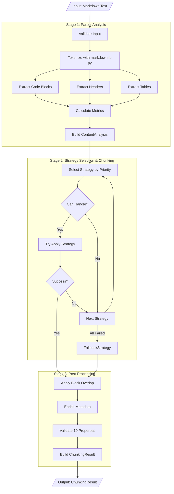

# Data Flow Architecture

This document describes the unified 3-stage processing pipeline in detail.

## Overview

The redesigned architecture uses a **single-path, linear pipeline** with three distinct stages:

```
Stage 1: Analysis    → Stage 2: Chunking    → Stage 3: Post-Processing
(Parser)               (Strategy Selection)    (Overlap, Metadata, Validation)
```

**Key Principles**:
- **Single-pass**: Stage 1 runs once (no dual invocation)
- **Single overlap**: Block-based only (no legacy/new switching)
- **Single validation**: All properties validated in one place

## Detailed Data Flow



## Stage 1: Parser Analysis

**Purpose**: Single-pass extraction of all structural elements and metrics

**Input**: Markdown text (string)

**Output**: ContentAnalysis dataclass

### Processing Steps

1. **Input Validation**
   ```python
   def validate_input(text: str) -> None:
       if not isinstance(text, str):
           raise ValueError("Input must be string")
       if len(text) > 100_000_000:  # 100MB limit
           raise ValueError("Document too large")
   ```

2. **Tokenization**
   ```python
   from markdown_it import MarkdownIt
   md = MarkdownIt()
   tokens = md.parse(text)
   ```

3. **Element Extraction** (parallel operations)
   - Code blocks from fence tokens
   - Headers from heading_open tokens
   - Tables from table_open/close tokens
   - Lists from bullet_list/ordered_list tokens (for metrics only)

4. **Metric Calculation**
   ```python
   total_chars = len(text)
   code_chars = sum(len(block.content) for block in code_blocks)
   table_chars = sum(len(table.content) for table in tables)
   text_chars = total_chars - code_chars - table_chars
   
   code_ratio = code_chars / total_chars if total_chars > 0 else 0.0
   text_ratio = text_chars / total_chars if total_chars > 0 else 0.0
   ```

5. **Content Type Determination**
   ```python
   if code_ratio >= 0.3:
       content_type = "code"
   elif code_ratio >= 0.1:
       content_type = "mixed"
   else:
       content_type = "text"
   ```

### Key Difference from Old Architecture

**Old** (Dual Invocation):
```python
# In orchestrator
stage1_results = parser.process_document(text)  # CALL 1

# Later in _post_process_chunks for preamble
if extract_preamble:
    stage1_results = parser.process_document(text)  # CALL 2 (DUPLICATE!)
```

**New** (Single Pass):
```python
# In chunker.chunk()
analysis = parser.analyze(text)  # CALL 1 (and only call)

# Preamble info already in analysis.preamble
if config.extract_preamble and analysis.preamble:
    # Use cached analysis, no re-parsing
```

**Impact**: ~50% faster for documents with preamble extraction enabled

## Stage 2: Strategy Selection & Chunking

**Purpose**: Select optimal strategy and produce initial chunks

**Input**: 
- Markdown text (string)
- ContentAnalysis (from Stage 1)

**Output**: List[Chunk]

### Strategy Selection Algorithm

```python
def _apply_strategy(
    self, text: str, analysis: ContentAnalysis
) -> Tuple[List[Chunk], str, Dict]:
    """
    Try strategies in priority order until one succeeds.
    
    Priority Order:
    1. CodeAwareStrategy (if code_ratio >= 0.3 or code_blocks >= 2)
    2. StructuralStrategy (if headers >= 3 and depth > 1 and code_ratio < 0.3)
    3. TableStrategy (if tables >= 3 or table_ratio >= 0.4)
    4. FallbackStrategy (always applicable)
    """
    for i, strategy in enumerate(self._strategies):
        # Check if strategy can handle this content
        if not strategy.can_handle(analysis):
            logger.debug(f"{strategy.name}: cannot handle")
            continue
        
        # Try to apply strategy
        try:
            logger.info(f"Trying strategy: {strategy.name}")
            chunks = strategy.apply(text, analysis)
            
            if chunks and len(chunks) > 0:
                logger.info(f"{strategy.name}: success ({len(chunks)} chunks)")
                return chunks, strategy.name, {
                    "used": False,
                    "level": 0
                }
        except Exception as e:
            logger.warning(f"{strategy.name} failed: {e}", exc_info=True)
            continue
    
    # All strategies failed, use FallbackStrategy
    # (which always works by design)
    fallback = self._strategies[-1]  # Last strategy is always Fallback
    logger.warning("All strategies failed, using fallback")
    chunks = fallback.apply(text, analysis)
    
    return chunks, fallback.name, {
        "used": True,
        "level": len(self._strategies) - 1
    }
```

### Strategy Behavior Matrix

| Strategy | Priority | Activation | Behavior | Cannot Split |
|----------|----------|------------|----------|--------------|
| CodeAware | 1 | code_ratio ≥ 0.3 OR code_blocks ≥ 2 | Preserve code blocks, group with context | Code blocks |
| Structural | 2 | headers ≥ 3 AND depth > 1 AND code_ratio < 0.3 | Split by header hierarchy | Large sections marked atomic |
| Table | 3 | tables ≥ 3 OR table_ratio ≥ 0.4 | Preserve tables, chunk text | Tables |
| Fallback | 4 | Always | Sentence-based grouping | None (can split anywhere) |

### Key Difference from Old Architecture

**Old** (Conditional Logic):
```python
# Complex conditional switching
if config.force_strategy:
    strategy = get_strategy_by_name(config.force_strategy)
else:
    # Quality scoring with weighted selection
    strategy = selector.select_strategy_weighted(analysis)
    
    # But exclude ListStrategy!
    if strategy.name == "list":
        strategy = selector.select_next_strategy()
```

**New** (Simple Priority):
```python
# Simple: try in order until one works
for strategy in [CodeAware, Structural, Table, Fallback]:
    if strategy.can_handle(analysis):
        try:
            return strategy.apply(text, analysis)
        except:
            continue
```

**Impact**: 
- Simpler logic, easier to debug
- No ListStrategy to exclude
- No quality scoring complexity
- Deterministic behavior

## Stage 3: Post-Processing

**Purpose**: Apply overlap, enrich metadata, validate properties

**Input**: List[Chunk] (from Stage 2)

**Output**: ChunkingResult

### Step 3.1: Apply Block Overlap

**Implementation** (block-based only):

```python
def _apply_overlap(
    self, chunks: List[Chunk], original_text: str
) -> List[Chunk]:
    """
    Apply block-based overlap between adjacent chunks.
    
    Algorithm:
    1. For each pair of adjacent chunks
    2. Find overlap region (last N chars of prev, first N chars of next)
    3. Ensure overlap doesn't break mid-word or mid-code-block
    4. Add overlap metadata
    """
    if self.config.overlap_size == 0:
        return chunks  # Overlap disabled
    
    overlapped_chunks = []
    
    for i, chunk in enumerate(chunks):
        new_content = chunk.content
        metadata = chunk.metadata.copy()
        
        # Overlap with previous chunk
        if i > 0:
            prev_chunk = chunks[i - 1]
            overlap_text = self._extract_overlap(
                prev_chunk.content,
                chunk.content,
                self.config.overlap_size,
                direction="forward"
            )
            
            if overlap_text:
                new_content = overlap_text + new_content
                metadata["has_overlap_prev"] = True
                metadata["overlap_prev_size"] = len(overlap_text)
        
        # Overlap with next chunk
        if i < len(chunks) - 1:
            next_chunk = chunks[i + 1]
            overlap_text = self._extract_overlap(
                chunk.content,
                next_chunk.content,
                self.config.overlap_size,
                direction="backward"
            )
            
            if overlap_text:
                new_content = new_content + overlap_text
                metadata["has_overlap_next"] = True
                metadata["overlap_next_size"] = len(overlap_text)
        
        overlapped_chunks.append(Chunk(
            content=new_content,
            start_line=chunk.start_line,
            end_line=chunk.end_line,
            metadata=metadata,
        ))
    
    return overlapped_chunks

def _extract_overlap(
    self,
    source: str,
    target: str,
    max_size: int,
    direction: str
) -> str:
    """
    Extract overlap region respecting block boundaries.
    
    Rules:
    - Don't break mid-word
    - Don't break mid-code-block (preserve ``` boundaries)
    - Don't exceed max_size
    """
    if direction == "forward":
        # Take last max_size chars from source
        overlap = source[-max_size:]
        
        # Adjust to word boundary
        if overlap and not overlap[0].isspace():
            # Find first space
            space_idx = overlap.find(' ')
            if space_idx > 0:
                overlap = overlap[space_idx + 1:]
    else:  # backward
        # Take first max_size chars from source
        overlap = source[:max_size]
        
        # Adjust to word boundary
        if overlap and not overlap[-1].isspace():
            # Find last space
            space_idx = overlap.rfind(' ')
            if space_idx > 0:
                overlap = overlap[:space_idx]
    
    # Check for code block boundaries
    if '```' in overlap:
        # Don't include partial code blocks in overlap
        # Either include full block or none
        fence_count = overlap.count('```')
        if fence_count % 2 != 0:  # Unbalanced
            # Truncate to last balanced point
            last_fence = overlap.rfind('```')
            overlap = overlap[:last_fence]
    
    return overlap
```

### Step 3.2: Enrich Metadata

**Standard Metadata Schema**:

```python
def _enrich_metadata(
    self, chunks: List[Chunk], analysis: ContentAnalysis
) -> List[Chunk]:
    """Add standardized metadata to all chunks."""
    
    for i, chunk in enumerate(chunks):
        # Identity
        chunk.metadata["chunk_id"] = f"chunk_{i:04d}"
        chunk.metadata["chunk_index"] = i
        chunk.metadata["total_chunks"] = len(chunks)
        
        # Content classification (if not already set by strategy)
        if "content_type" not in chunk.metadata:
            chunk.metadata["content_type"] = self._infer_content_type(
                chunk.content, analysis
            )
        
        # Structure
        if "header_path" not in chunk.metadata:
            chunk.metadata["header_path"] = self._infer_header_path(
                chunk, analysis
            )
        
        # Properties
        chunk.metadata["is_atomic"] = chunk.metadata.get("is_atomic", False)
        chunk.metadata["is_oversize"] = (
            chunk.size > self.config.max_chunk_size
        )
        
        # Document context
        chunk.metadata["document_chars"] = analysis.total_chars
        chunk.metadata["document_lines"] = analysis.total_lines
    
    return chunks
```

### Step 3.3: Validate Properties

**Single Validation Point**:

```python
def _validate_properties(self, chunks: List[Chunk], original_text: str):
    """
    Validate all 10 domain properties.
    
    Raises exception if any property fails.
    """
    # PROP-1: No Content Loss
    self._validate_no_content_loss(chunks, original_text)
    
    # PROP-2: Size Bounds
    self._validate_size_bounds(chunks)
    
    # PROP-3: Monotonic Ordering
    self._validate_monotonic_order(chunks)
    
    # PROP-4: No Empty Chunks
    self._validate_no_empty_chunks(chunks)
    
    # PROP-5: Valid Line Numbers
    self._validate_line_numbers(chunks)
    
    # PROP-6: Code Block Integrity (if applicable)
    if any("```" in c.content for c in chunks):
        self._validate_code_block_integrity(chunks, original_text)
    
    # PROP-7: Table Integrity (if applicable)
    if any("|" in c.content for c in chunks):
        self._validate_table_integrity(chunks, original_text)
    
    # Note: PROP-8, PROP-9, PROP-10 validated by property tests

def _validate_no_content_loss(self, chunks: List[Chunk], original: str):
    """PROP-1: Verify no content loss."""
    # Reconstruct document from chunks (removing overlap)
    reconstructed = ""
    for i, chunk in enumerate(chunks):
        content = chunk.content
        
        # Remove overlap with previous
        if i > 0 and chunk.metadata.get("has_overlap_prev"):
            overlap_size = chunk.metadata["overlap_prev_size"]
            content = content[overlap_size:]
        
        # Remove overlap with next
        if i < len(chunks) - 1 and chunk.metadata.get("has_overlap_next"):
            overlap_size = chunk.metadata["overlap_next_size"]
            content = content[:-overlap_size]
        
        reconstructed += content
    
    # Normalize for comparison
    def normalize(text):
        return text.strip().replace('\r\n', '\n')
    
    if normalize(reconstructed) != normalize(original):
        raise ValidationError(
            "PROP-1 Failed: Content loss detected. "
            f"Original: {len(original)} chars, "
            f"Reconstructed: {len(reconstructed)} chars"
        )
```

### Step 3.4: Build Result

```python
def _build_result(
    self,
    chunks: List[Chunk],
    strategy_used: str,
    fallback_info: Dict,
    processing_time: float
) -> ChunkingResult:
    """Build final ChunkingResult."""
    return ChunkingResult(
        chunks=chunks,
        strategy_used=strategy_used,
        processing_time=processing_time,
        fallback_used=fallback_info["used"],
        fallback_level=fallback_info["level"],
        metadata={
            "version": "2.0.0",
            "total_chunks": len(chunks),
            "total_size": sum(c.size for c in chunks),
            "avg_chunk_size": sum(c.size for c in chunks) / len(chunks) if chunks else 0,
        },
    )
```

## Key Differences Summary

| Aspect | Old Architecture | New Architecture |
|--------|-----------------|------------------|
| **Stage 1** | Dual invocation (orchestrator + preamble) | Single-pass analysis |
| **Overlap** | Two mechanisms (legacy + block-based) | Block-based only |
| **Post-Processing** | Two pipelines (orchestrator + core) | Single linear pipeline |
| **Validation** | Scattered (4+ locations) | Single point (Stage 3) |
| **Metadata** | Added at 4+ points | Enriched once (Stage 3) |
| **Complexity** | Conditional logic, dual paths | Linear, single path |

## Performance Implications

### Expected Performance Gains

1. **Stage 1**: ~50% faster (single-pass vs dual invocation)
2. **Stage 2**: Similar (strategy logic simplified but similar work)
3. **Stage 3**: ~30% faster (single pipeline vs dual)

**Overall**: Estimated 20-40% faster than current implementation

### Memory Usage

- **Lower peak memory**: No duplicate Stage1Results
- **Cleaner garbage collection**: Linear pipeline releases objects earlier
- **Smaller codebase**: Less code loaded into memory

## Error Handling

### Error Propagation

```python
try:
    # Stage 1
    analysis = parser.analyze(text)
except ParsingError as e:
    return ChunkingResult(
        chunks=[],
        strategy_used="none",
        processing_time=0,
        fallback_used=True,
        fallback_level=4,
        metadata={"error": str(e)},
    )

try:
    # Stage 2
    chunks, strategy, fallback = self._apply_strategy(text, analysis)
except StrategyError as e:
    # Fallback should have caught this
    logger.error(f"Strategy error: {e}")
    raise

try:
    # Stage 3
    chunks = self._apply_overlap(chunks, text)
    chunks = self._enrich_metadata(chunks, analysis)
    self._validate_properties(chunks, text)
except ValidationError as e:
    # Property violation - this is serious
    logger.error(f"Validation failed: {e}")
    raise
```

## Testing Strategy

### Unit Tests
- Test each stage independently
- Mock dependencies (parser for Stage 2, chunks for Stage 3)

### Integration Tests
- Test full pipeline end-to-end
- Use real markdown documents

### Property Tests
- Validate 10 properties after full pipeline
- Use Hypothesis for property-based testing

## Migration Notes

For developers migrating from old codebase:

1. **Remove dual invocation**: Search for duplicate `process_document()` calls
2. **Remove overlap switching**: Delete legacy `OverlapManager`
3. **Consolidate validation**: Move all validation to Stage 3
4. **Single metadata enrichment**: Remove metadata additions in strategies
5. **Linear flow**: No conditional post-processing paths
