# Module Inventory

## Обзор

Инвентаризация всех модулей проекта markdown_chunker с анализом структуры, публичных интерфейсов и зависимостей.

**Общая статистика:**
- Всего Python-файлов: **55**
- Всего строк кода: **~24,000**
- Основные подмодули: `parser/`, `chunker/`, `api/`

---

## Статистика файлов

### Топ-20 файлов по размеру

| Файл | Строк | Назначение |
|------|-------|------------|
| `chunker/strategies/structural_strategy.py` | 1720 | Структурная стратегия чанкинга |
| `chunker/types.py` | 1079 | Типы данных chunker (Chunk, ChunkConfig, ChunkingResult) |
| `parser/types.py` | 931 | Типы данных parser (Stage1Results, ContentAnalysis) |
| `chunker/components/overlap_manager.py` | 926 | Управление перекрытием чанков |
| `chunker/strategies/list_strategy.py` | 856 | Стратегия для списков |
| `chunker/strategies/mixed_strategy.py` | 848 | Стратегия для смешанного контента |
| `chunker/core.py` | 795 | Главный класс MarkdownChunker |
| `parser/validation.py` | 784 | Валидация парсера |
| `chunker/components/metadata_enricher.py` | 712 | Обогащение метаданных чанков |
| `parser/markdown_ast.py` | 699 | Построение AST |
| `chunker/block_packer.py` | 671 | Упаковка блоков в чанки |
| `chunker/orchestrator.py` | 665 | Оркестрация стратегий |
| `parser/enhanced_ast_builder.py` | 653 | Расширенный построитель AST |
| `parser/core.py` | 653 | Основной парсер (ParserInterface) |
| `parser/errors.py` | 630 | Обработка ошибок парсера |
| `chunker/strategies/code_strategy.py` | 624 | Стратегия для кода |
| `chunker/section_builder.py` | 607 | Построение секций |
| `chunker/strategies/sentences_strategy.py` | 525 | Стратегия по предложениям (fallback) |
| `parser/utils.py` | 523 | Утилиты парсера |
| `parser/analyzer.py` | 500 | Анализатор контента |

### Распределение по модулям

| Модуль | Файлов | Строк | % от общего |
|--------|--------|-------|-------------|
| `chunker/` | 26 | ~13,500 | 56% |
| `parser/` | 15 | ~8,500 | 35% |
| `api/` | 5 | ~900 | 4% |
| Корень | 2 | ~270 | 1% |

### ⚠️ Проблема: Размер файлов

Несколько файлов превышают 700 строк, что указывает на возможное нарушение Single Responsibility:
- `structural_strategy.py` (1720 строк) — слишком большой для одной стратегии
- `types.py` (1079 строк) — много типов в одном файле
- `overlap_manager.py` (926 строк) — сложная логика перекрытия

---

## Публичные интерфейсы

### Корневой модуль (`markdown_chunker/__init__.py`)

```python
__all__ = [
    "MarkdownChunker",      # Главный класс
    "ChunkConfig",          # Конфигурация
    "Chunk",                # Результирующий чанк
    "ChunkingResult",       # Результат чанкинга
    "ParserInterface",      # Интерфейс парсера
    "ContentAnalysis",      # Анализ контента
    "PreambleExtractor",    # Извлечение преамбулы
    "PreambleInfo",
    "PreambleType",
    "extract_preamble",
    "MarkdownChunkerProvider",  # Dify-провайдер
    "chunk_text",           # Convenience-функция
    "chunk_file",           # Convenience-функция
]
```

### Модуль chunker (`markdown_chunker/chunker/__init__.py`)

```python
__all__ = [
    "MarkdownChunker",
    "Chunk",
    "ChunkingResult", 
    "ChunkConfig",
]
```

### Модуль parser (`markdown_chunker/parser/__init__.py`)

```python
__all__ = [
    # Основные функции
    "extract_fenced_blocks", "parse_markdown", "parse_to_ast", 
    "process_markdown", "analyze",
    
    # Simple API (deprecated)
    "extract_code_blocks", "get_document_structure", "check_markdown_quality",
    "quick_analyze", "get_code", "get_structure", "check_quality",
    
    # Классы
    "ParserInterface", "Stage1Interface", "FenceHandler", "FencedBlockExtractor",
    "BlockCandidate", "NestingResolver",  # backward compatibility
    "ASTBuilder", "EnhancedASTBuilder", "MarkdownNode",
    
    # Валидация
    "InputValidator", "Stage1APIValidator", "APIValidator", "ASTValidator",
    "ValidationResult", "ValidationIssue", "ValidationError", "APIValidationError",
    
    # Ошибки
    "ErrorCollector", "ErrorInfo", "WarningInfo", "ErrorSummary", "SourceLocation",
    "ProcessingError", "MarkdownParsingError", "FencedBlockError",
    "ParserSelectionError", "ElementDetectionError", "ContentAnalysisError",
    
    # Утилиты
    "LineNumberConverter", "TextRecoveryUtils", "PhantomBlockPreventer",
    
    # Типы данных
    "FencedBlock", "Position", "ContentAnalysis", "Stage1Results",
]
```

### ⚠️ Проблема: Раздутый публичный API

Модуль `parser` экспортирует **50+ символов**, многие из которых:
- Deprecated (Simple API)
- Для backward compatibility
- Внутренние классы ошибок

---

## Граф зависимостей

```mermaid
graph TD
    subgraph "Корень"
        ROOT[markdown_chunker/__init__.py]
    end
    
    subgraph "API Layer"
        API[api/__init__.py]
        ADAPTER[api/adapter.py]
        VALIDATOR_API[api/validator.py]
        ERROR_HANDLER[api/error_handler.py]
    end
    
    subgraph "Chunker Layer"
        CHUNKER[chunker/__init__.py]
        CORE[chunker/core.py]
        ORCH[chunker/orchestrator.py]
        SELECTOR[chunker/selector.py]
        TYPES_C[chunker/types.py]
    end
    
    subgraph "Strategies"
        STRAT[strategies/__init__.py]
        BASE[strategies/base.py]
        CODE[strategies/code_strategy.py]
        MIXED[strategies/mixed_strategy.py]
        LIST[strategies/list_strategy.py]
        TABLE[strategies/table_strategy.py]
        STRUCT[strategies/structural_strategy.py]
        SENT[strategies/sentences_strategy.py]
    end
    
    subgraph "Components"
        COMP[components/__init__.py]
        OVERLAP[components/overlap_manager.py]
        META[components/metadata_enricher.py]
        FALLBACK[components/fallback_manager.py]
    end
    
    subgraph "Parser Layer"
        PARSER[parser/__init__.py]
        PARSER_CORE[parser/core.py]
        TYPES_P[parser/types.py]
        ANALYZER[parser/analyzer.py]
        AST[parser/ast.py]
    end
    
    ROOT --> CHUNKER
    ROOT --> PARSER
    
    API --> CHUNKER
    ADAPTER --> CORE
    ADAPTER --> TYPES_C
    
    CORE --> PARSER
    CORE --> ORCH
    CORE --> SELECTOR
    CORE --> COMP
    
    ORCH --> PARSER
    ORCH --> SELECTOR
    ORCH --> FALLBACK
    
    SELECTOR --> TYPES_P
    
    CODE --> TYPES_P
    MIXED --> TYPES_P
    LIST --> TYPES_P
    TABLE --> TYPES_P
    STRUCT --> TYPES_P
    SENT --> TYPES_P
    
    BASE --> TYPES_P
```



---

## Циклические зависимости

### Выявленные проблемы

1. **Нет прямых циклов**, но есть сложные цепочки:
   - `chunker/core.py` → `parser/__init__.py` → `parser/core.py` → (много файлов)
   
2. **Backward compatibility imports** в `parser/__init__.py`:
   ```python
   try:
       from .nesting_resolver import ...
   except ImportError:
       # Fallback definitions
   ```

3. **Динамический импорт провайдера** в корневом `__init__.py`:
   ```python
   _spec = importlib.util.spec_from_file_location("_provider_module", _provider_file)
   ```

### ⚠️ Проблема: Сложность импортов

- `parser/__init__.py` содержит **240 строк** только для организации импортов
- Много try/except для backward compatibility
- Fallback-определения классов при ImportError

---

## Необычные паттерны

### 1. Множественные точки входа

Есть несколько способов сделать одно и то же:
- `MarkdownChunker().chunk()` — основной
- `chunk_text()` — convenience
- `chunk_file()` — convenience
- `APIAdapter.process()` — для API

### 2. Дублирование типов

- `ChunkConfig` определён в `chunker/types.py`
- `ContentAnalysis` определён в `parser/types.py`
- Оба файла > 900 строк

### 3. Deprecated код не удалён

В `parser/__init__.py`:
```python
# Simple API for quick start (deprecated, kept for backward compatibility)
try:
    from .simple_api import (
        analyze, check_markdown_quality, ...
    )
except ImportError:
    def analyze(*args, **kwargs):
        raise NotImplementedError("simple_api has been removed")
```

---

## Выводы

### Ключевые проблемы структуры

1. **Переусложнённая иерархия**: 55 файлов для относительно простой задачи
2. **Раздутые файлы**: 6 файлов > 700 строк
3. **Избыточный публичный API**: 50+ экспортов из parser
4. **Backward compatibility overhead**: много кода для совместимости
5. **Дублирование**: похожие структуры в parser и chunker

### Рекомендации (предварительные)

1. Объединить `parser/types.py` и `chunker/types.py`
2. Удалить deprecated Simple API
3. Сократить публичный API parser до ~10 символов
4. Разбить `structural_strategy.py` на части или упростить
